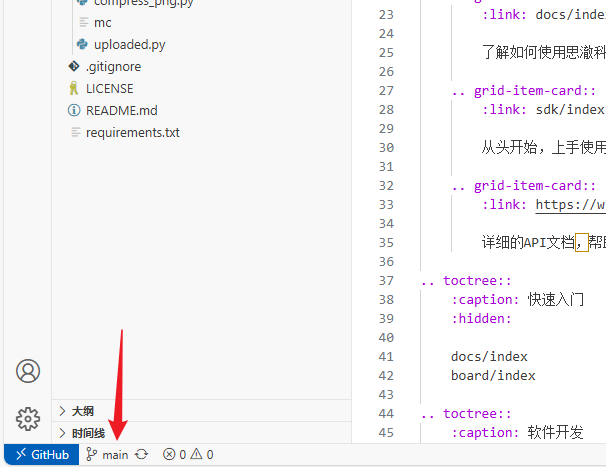
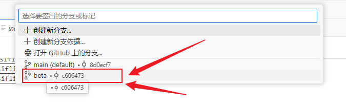
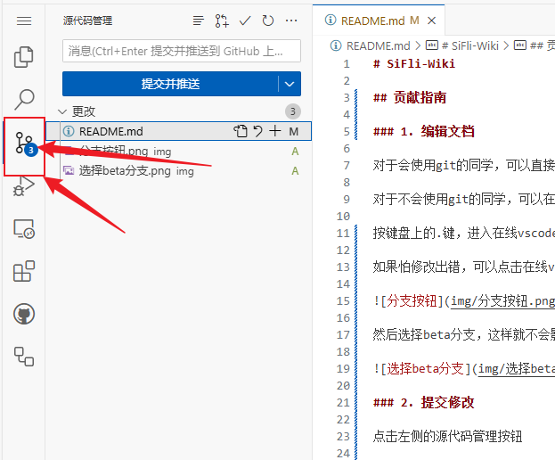
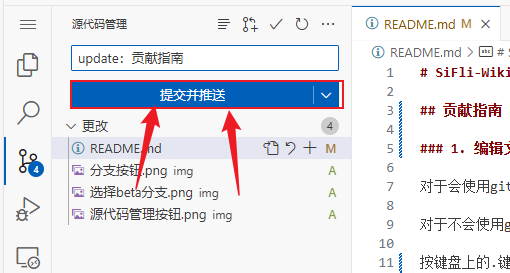

# SiFli-Wiki

## 贡献指南

### 1. 编辑文档

对于会使用git的同学，可以直接fork本项目，然后在本地修改后提交pull request。

对于不会使用git的同学，可以在浏览器中打开[SiFli-Wiki](https://github.com/OpenSiFli/SiFli-Wiki)

按键盘上的.键，进入在线vscode编辑模式，修改后提交即可。

如果怕修改出错，可以点击在线vscode左下角的分支按键

然后选择beta分支，这样就不会影响到主分支了。

### 2. 提交修改

点击左侧的源代码管理按钮

点击加号，暂存更改，然后在消息中提交修改原因，点击提交即可

### 3. 查看结果

提交后，会自动触发github action，大概2分钟后，可以在[SiFli-Wiki](http://wikitest.lovemcu.cn/)查看修改后的效果。