# NandFlash_BBM Parsing Guide
## 1 Introduction
**BBM (BBM): Bad Block Management (Bad Block Management)** 
Due to its physical characteristics, Nand Flash has a limited number of erase and write cycles. Once this limit is exceeded, the flash memory is essentially damaged. During use, some blocks of Nand Flash may become damaged. When such blocks are detected, they should be promptly marked as bad blocks and no longer used. The physical addresses of these bad blocks are mapped to other normal blocks for read and write operations. This management work is part of the bad block management of Nand Flash (Nand Flash may have some bad blocks at the time of manufacture). If eMMC storage is used, this software work is already completed by the control chip inside the eMMC. 
**Introduction to eMMC (Embedded MultiMediaCard)** 
eMMC is an integrated storage module that combines a NAND Flash chip and a control chip (Controller) in a single package and integrates standard interface protocols (such as the MMC protocol). In simple terms, eMMC = NAND Flash + Controller + Interface, providing a complete "plug-and-play" storage solution. It integrates the controller, which can autonomously perform the following tasks: 
1. Receive read and write commands from the processor (via a standard interface); 
2. Perform bad block management (shield damaged storage units); 
3. Implement wear leveling (evenly use all storage units to avoid localized excessive wear); 
4. Data verification and error correction (ECC), etc. 

Therefore, using eMMC eliminates the need to consider the BBM bad block management algorithm and the use of Flashdb to achieve wear leveling, making development easier.

## 2 BBM Management Method
The `sif_bbm_init` function divides the memory size of a new Nand chip into 32 parts, with the last 1/32 of the physical address space used for BBM management. If individual bad blocks are found in the first 31 parts, they are mapped to normal blocks in the last 1/32 for read and write operations. From the user's perspective, the Nand read and write addresses remain contiguous. 
**BBM Management Area Address Calculation** 
For 52X, the base address is 0x62000000, and for 56X, the base address is 0x64000000.
Currently, the most commonly used Nand chips are 512MB or 1Gb, corresponding to sizes of 0x4000000 and 0x8000000, respectively. The size reserved for BBM is 1/32 of the total size, so 0x200000 and 0x400000 are reserved, respectively. The address allocation starts from the end, so the starting address of the BBM area is different for 52X/56X and different sizes. Additionally, BBM information is saved in two blocks, with the same content except for the ID and CRC values. If the blocks are not bad, the two blocks saving BBM are adjacent, with addresses as follows: 
For 512Mb 52X, the starting addresses are: 0x65e00000 / 0x65e20000 
For 1Gb 52X, the starting addresses are: 0x69c00000 / 0x69c20000 
For 512Mb 56X, the starting addresses are: 0x67e00000 / 0x67e20000 
For 1Gb 56X, the starting addresses are: 0x6bc00000 / 0x6bc20000 
The length can be one page or multiple pages, and it is recommended to read multiple pages. The reason for reading multiple pages is that each time the BBM version is updated, it is rewritten in the next page. The start data of each page is either the BBM magic number (0X4D 42 66 53) or all FF. When the start data of the next page is all FF, the current page is the latest version, i.e., the data to be analyzed.
Additionally, the information from the two blocks can be read back and compared on a split screen.

## 3 BBM Management Table Reading
For the Jlink driver, use the original driver without BBM management, `SF32LB52X_EXT_ORG_NAND2.elf`
`\tools\flash\jlink_drv\sf32lb52x_nand_nobbm\SF32LB52X_EXT_ORG_NAND2.elf`
For the Uart driver, use `tools\uart_download\file\ram_patch_52X_NAND_NOBBM.bin` or `Butterfli\file\ram_patch_52X_NAND_NOBBM.bin` to read. The data read using the normal driver with BBM management has already been mapped by BBM. 
**Demonstration of Jflash Reading Method** 
Connect to the board via JLINK and open JFlash.exe on the PC

 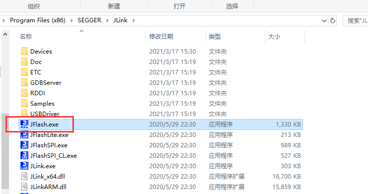 
Create a project and select the correct device for connection.
For the 52x series, select SF32LB52X_NAND_NOBBM.
For the 56X series, select SF32LB56X_NAND_NOBBM.
The non-NOBBM version cannot correctly access the reserved BBM address at the end, so only the version with the NOBBM suffix can be selected.

 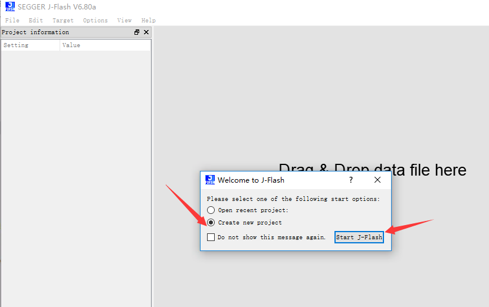 
 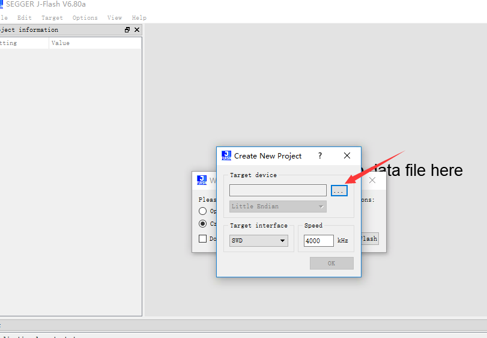 
 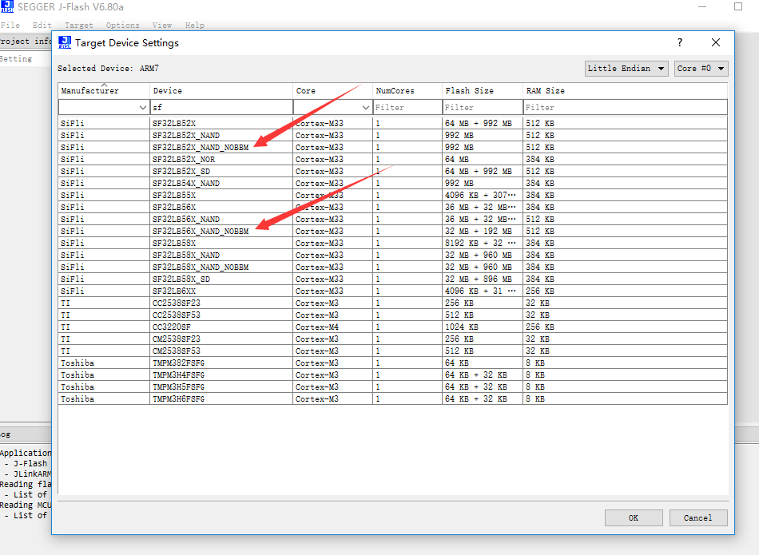 
 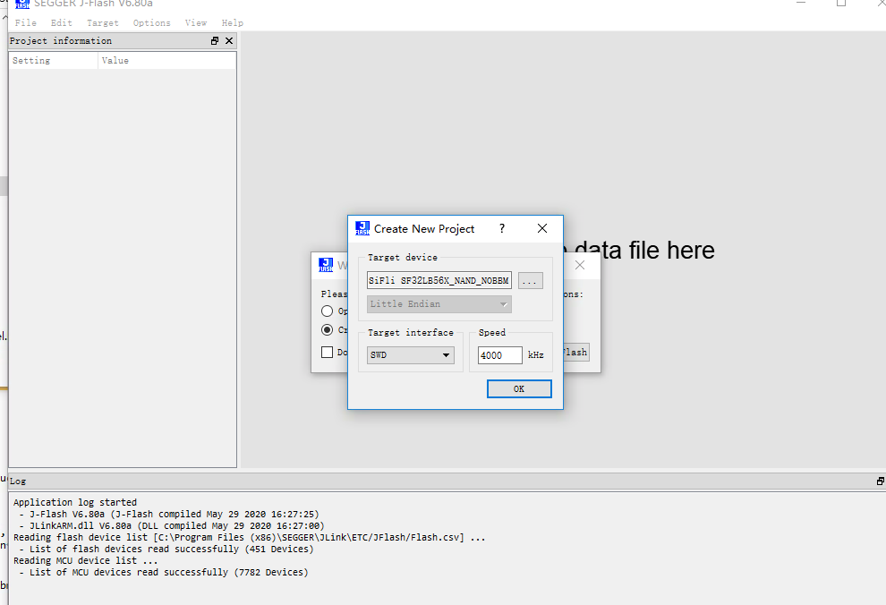 
 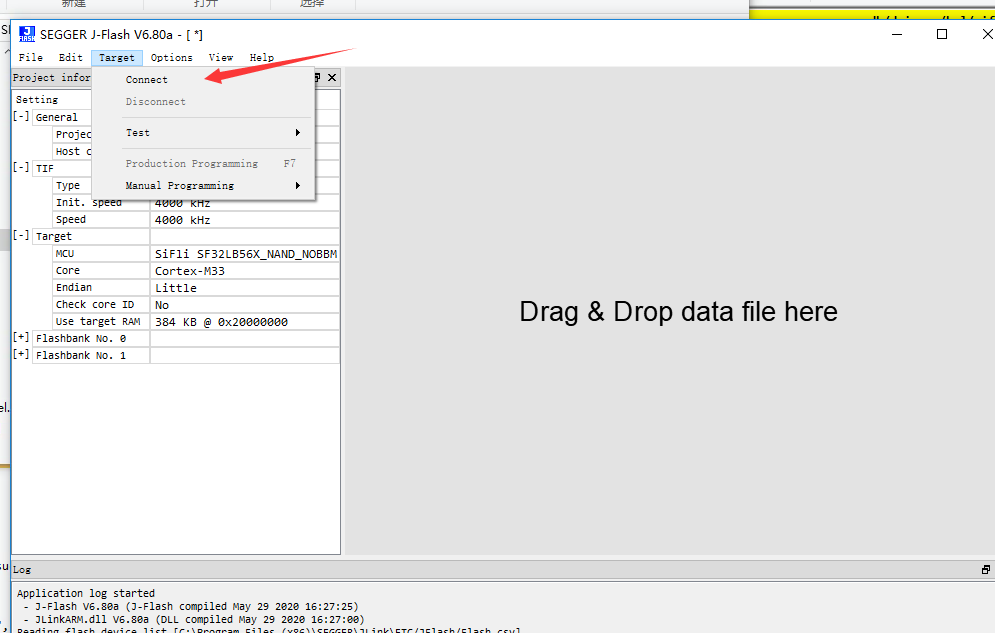 
 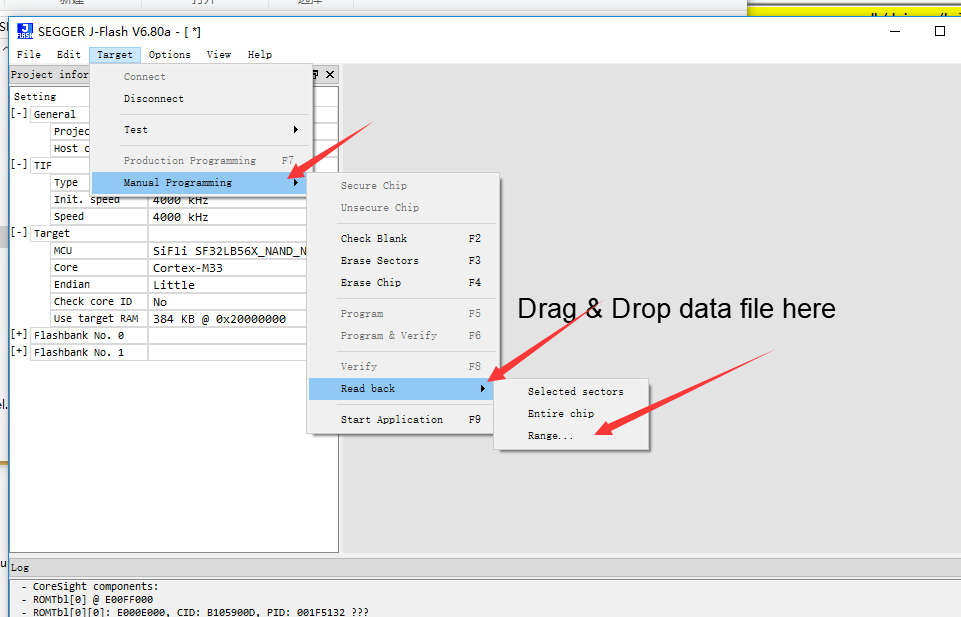 
For a 512M 56X, an example of reading a PAGE address:
 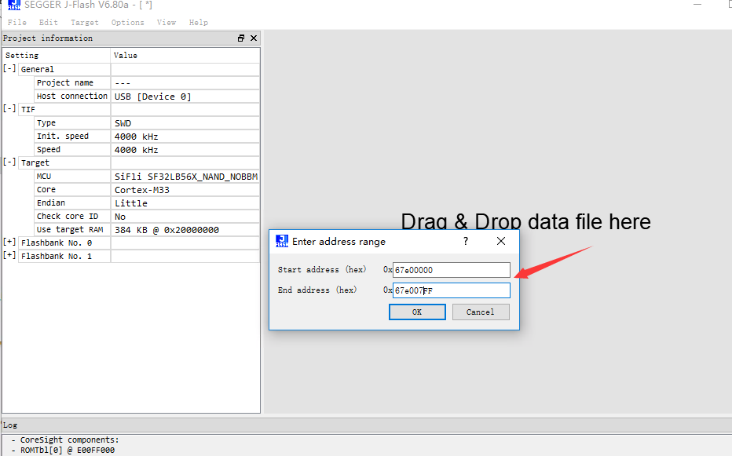 
For a 1Gb 56X, an example of reading 4 PAGE addresses:
 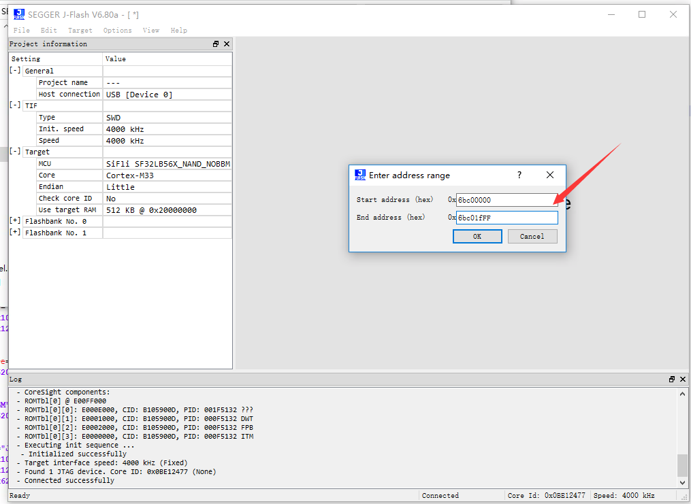 

## 4 BBM Data Analysis
The following is the BBM table data for a 1Gb chip on 56X without bad block information.
 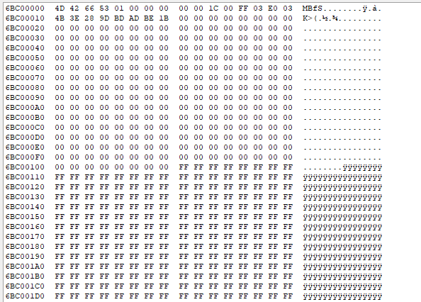 
Read the BBM information from the two blocks; except for the index and CRC, all other information is the same.
Additionally, the data is saved in little-endian format, for example, `reserv_blk_start (E0 03)` corresponds to a data size of 0x03e0, and `free_blk_start (FF 03)` corresponds to a data size of 0x3ff.
 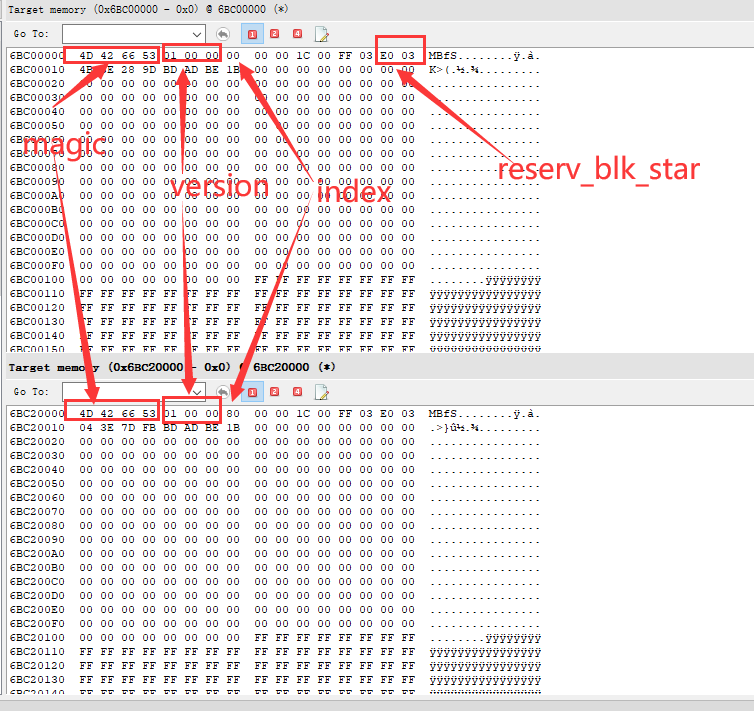 
The following is the mapping table data for 5 bad blocks, from which the bad blocks in the user area and their corresponding backup block addresses can be analyzed:
 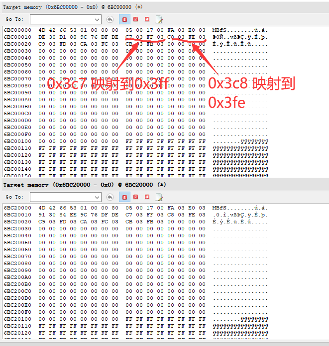 
**BBM Data Format**
 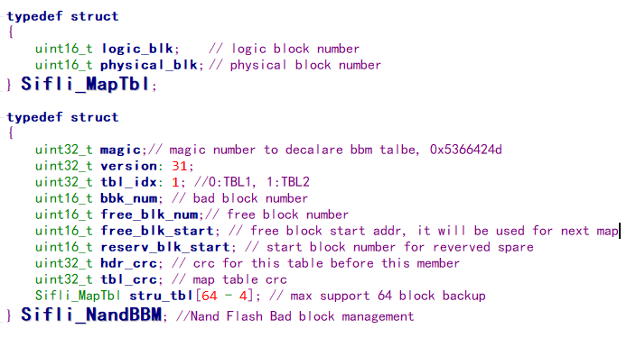 

## 5 Common BBM Issues

The main issues currently encountered include: 
a) The BBM table is not generated or the BBM save location is incorrect, manifested by the inability to read a valid table containing the magic number from the specified location. 
b) The data for `Free_blk_start` or `reserve_blk_start` is incorrect. `reserve_blk_start` is fixed and should not change even when the table version is updated; it should always be the starting block number of the BBM. `Free_blk_start` is variable and should gradually decrease, and during initialization, it should be the total number of blocks minus 1 (for example, if a 1Gb chip has 1024 blocks, the initial value should be 1023); it should never be less than `reserve_blk_start` (the theoretical minimum value should be `reserve_blk_start + 4`). 
c) The data in `Struc_tbl` is unreasonable. If no bad blocks are found, all data in this array should be 0. If bad blocks need to be mapped, the `logic_blk` data should be the block number of the user area address [0 : `reserve_blk_start` – 1]; the `physical_blk` data should be the block number of the available backup area [`reserve_blk_start` + 4 : maximum block number - 1].