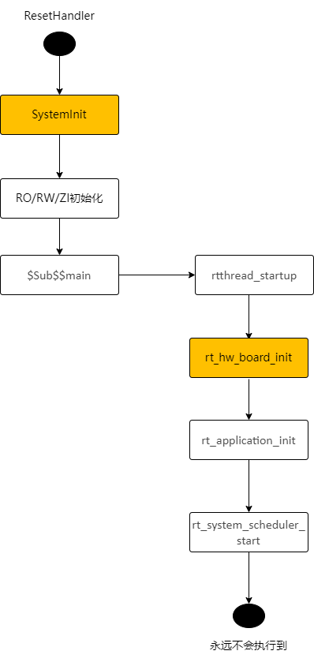
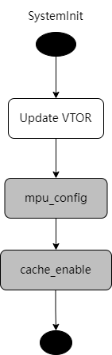
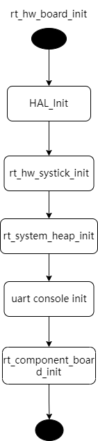
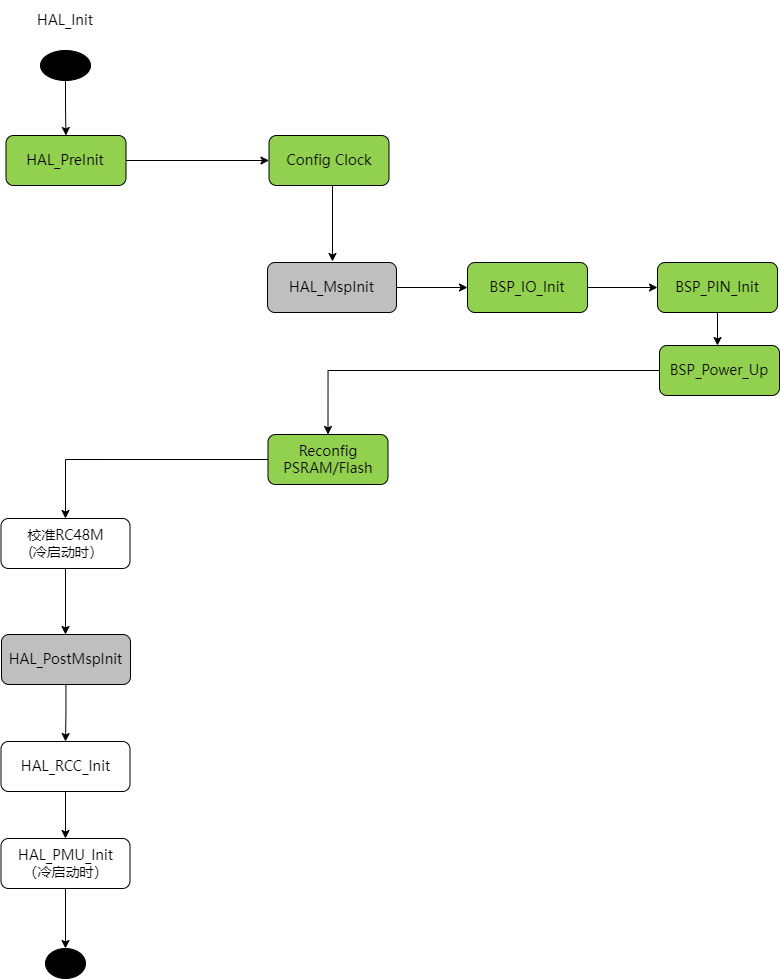
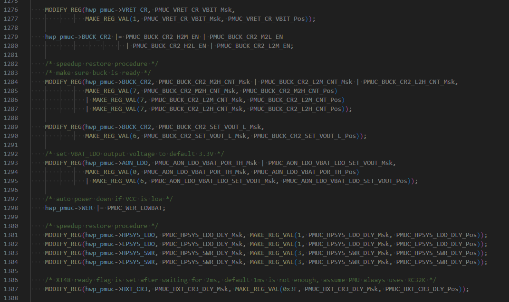
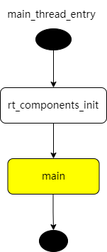

# SF32LB52X Boot and Low Power Process
## 1 Application Boot Process
The SF32LB52X is a dual-core chip with multiple internal and external storage interfaces. MPI1 is an internal storage interface that can connect to PSRAM and NOR Flash. MPI2 and SDMMC are external storage interfaces, where MPI2 can connect to NOR/PSRAM/NAND, and SDMMC can connect to SD-NAND or SD-eMMC. The application runs on the big core, while the Bluetooth Controller protocol stack runs on the small core. The small core is not open to users, and its boot process is controlled by the Bluetooth Host protocol stack on the big core, so users do not need to be concerned with it.<br>
The application boot process on the big core is divided into three stages:<br>
* 1) First Bootloader:固化在SF32LB52X内部的ROM中，加载Flash中的二级Bootloader到RAM中跳转运行
* 2) Second Bootloader:加载Flash中的应用程序并跳转执行
* 3) Application:用户程序
### 1.1 First Bootloader
The first bootloader is固化在了芯片的ROM中，其中断向量表地址为0. After power-on, the first bootloader runs first, determining the location of the Flash partition table (internal or external Flash, referred to as the boot Flash) based on the chip package type. According to the Flash partition table, it copies the second bootloader code to RAM and jumps to run it.<br>
During the first bootloader stage, the big core runs at the default clock frequency upon power-on and initializes the IO configuration of the boot Flash.<br>
### 1.2 Second Bootloader
The second bootloader loads and executes the application based on the chip package type and the Flash partition table. Depending on the chip package type, the application can be booted in several ways, with two execution modes: XIP (execute code directly from NOR Flash, where the storage address and execution address are the same) and non-XIP (copy code from Flash to RAM for execution, where the storage address and execution address are different). Regardless of the boot method, the application and the second bootloader are stored on the same boot Flash, with the only difference being the execution mode of the application code:<br>
* 1. Internal NOR Flash (MPI1): The boot Flash is the internal NOR Flash, and the application is stored on the internal NOR Flash, running in XIP mode<br>
* 2. No internal NOR Flash:<br>
  a. External NOR Flash (MPI2): The boot Flash is the external NOR Flash, and the application is stored on the external NOR Flash, running in XIP mode<br>
  b. Internal PSRAM (MPI1), External NAND Flash (MPI2): The boot Flash is the external NAND Flash, and the application is stored on the external NAND Flash, running in non-XIP mode, i.e., the code is copied to the internal PSRAM for execution<br>
  c. Internal PSRAM, External SD Flash (SDIO): Same as b)<br>
For package types with internal PSRAM, the second bootloader will enable LDO1V8 and initialize the PSRAM.<br>
The second bootloader modifies the default clock configuration, as shown in the table below:<br>

|Module|Clock Source|Frequency (MHz)|
|:----|:----|:----|
|DLL1| / | 144MHz|
|DLL2| / | 288MHz|
|Big Core System Clock| DLL1 | 144MHz|
|Internal NOR Flash| System Clock | 48MHz|
|Internal PSRAM| DLL2 | 144MHz|
|External Flash| DLL2 | 48MHz|
|External SD| DLL2 | |
|PMU| Default Value | |
|MPU| Disabled | |
|Cache| Disabled | |

The second bootloader does not load the PMU calibration parameters, only modifying the IO settings related to the used storage.<br>
Cache is not enabled, and MPU is not enabled.<br>
### 1.3 Application
The entry function of the application is `ResetHandler` (located in `drivers\cmsis\sf32lb52x\Templates\arm\startup_bf0_hcpu.S`), and its execution flow is shown in Figure 1. The user's main function `main` is called by the `main` thread created by `rt_application_init`, as shown in the `main_thread_entry` flow in Figure 5.<br><br>   
Figure 1 ResetHandler Flow<br>
`SystemInit` (located in `drivers/cmsis/sf32lb52x/Templates/system_bf0_ap.c`) is executed before variable initialization (therefore, variables with initial values cannot be used during this period, and zero-initialized variables should avoid depending on the initial value 0), updates the VTOR register to redirect the interrupt vector table, and calls `mpu_config` and `cache_enable` to initialize the MPU and enable the Cache. These two functions are weak functions and can be overridden in the application.<br>
<br><br> 

Figure 2 SystemInit Flow<br> 

`rt_hw_board_init` completes the initialization of the underlying hardware, such as clock and IO configuration, PSRAM and NOR Flash initialization, and heap and serial console initialization. `rt_component_board_init` is a user-defined initialization function that calls different functions depending on the application configuration.<br>
<br><br>  
Figure 3 rt_hw_board_init Flow<br>

`HAL_Init` completes the HAL initialization, loads the PMU calibration parameters, updates the clock and IO settings, and initializes the PSRAM and NOR Flash (based on the new clock configuration). In the diagram below, the green functions are board-level driver functions, each board has an independent implementation, including `HAL_PreInit`, `BSP_IO_Init`, `BSP_PIN_Init`, and `BSP_Power_Up`. The gray functions are virtual functions, implemented by the application, independent of the board, allowing different applications on the same board to have custom implementations, such as different IO configurations for different applications on the same board. In the flowchart in Figure 4, the horizontal direction represents nested function calls within a function, for example, `HAL_PreInit` calls the clock configuration function, and `HAL_MspInit` calls `BSP_IO_Init`. The vertical direction represents serially executed functions, such as `HAL_PreInit` followed by `HAL_PostMspInit`.<br> 
<br><br>   
Figure 4 HAL_Init Flow<br> 
The settings modified by `Config Clock` include:<br> 
* Load PMU calibration values
* Start GTimer
* Switch PMU to RC32K
* If using external XT32K, switch RTC to XT32K
* Configure the system clock to 240MHz (DLL1)
* Configure DLL2 to 288MHz (same as the second bootloader)

The loaded PMU calibration values include:<br> 
* BUCK_CR1_BG_BUF_VOS_POLAR
* BUCK_CR1_BG_BUF_VOS_TRIM
* LPSYS_VOUT_VOUT
* VRET_CR_TRIM
* PERI_LDO_LDO18_VREF_SEL
* PERI_LDO_LDO33_LDO2_SET_VOUT
* PERI_LDO_LDO33_LDO3_SET_VOUT
* AON_BG_BUF_VOS_POLAR
* AON_BG_BUF_VOS_TRIM
* HXT_CR1_CBANK_SEL (added in the Xiaomi branch, previously in the rt_component_board_init stage)
The code for loading calibration values may run on Flash or PSRAM.<br> 
The PMU parameters initialized by HAL_PMU_Init are shown in the following figure:<br> 
<br><br>   

In rt_application_init, the main thread is created with the entry function main_thread_entry. After the thread scheduling is released (i.e., after calling rt_system_scheduler_start), the main thread is scheduled and enters the main_thread_entry function. It first calls rt_components_init to initialize the components, and then calls the main function (application implementation). User code starts from the main function, for example, the main function of the rt_driver example is in example/rt_driver/src/main.c.
<br><br>   
Figure 5 main_thread_entry flow<br>
For the SF32LB523 watch solution using external NOR, it can be considered that there are two applications: one is the OTA Manager, and the other is the User App. The secondary bootloader first jumps to the OTA Manager to execute the above application startup process, and then jumps to the User App to execute the same startup process again. The difference is that some application-specific module initializations may vary.

### 1.4 Board-Level Driver Interfaces
Each board needs to implement the following board-level driver functions, refer to customer/boards/eh-lb52xu:
Function Name| Mandatory| Description
:--|:--|:--
HAL_PreInit| YES| It is recommended to keep the default implementation of HDK
BSP_Power_Up| NO| Called after wake-up
BSP_IO_Power_Down| NO| Called before sleep
BSP_LCD_Reset| NO| 
BSP_LCD_PowerUp| NO| Called when the screen is powered on
BSP_LCD_PowerDown| NO| Called when the screen is powered off
BSP_TP_Reset| NO| 
BSP_TP_PowerUp| NO| Called when the touch screen is powered on
BSP_TP_PowerDown| NO| Called when the touch screen is powered off
HAL_MspInit| NO| Application
HAL_PostMspInit| NO| 
BSP_IO_Init| NO(?)| Called by HAL_MspInit, currently the default implementation of HAL_MspInit is an empty function, but it can be modified to call BSP_IO_Init in the future, and a standard implementation of BSP_IO_Init can be provided, which calls BSP_IO_Init and BSP_Power_Up sequentially
BSP_PIN_Init| NO(?)| Called by BSP_IO_Init, IO configuration function

### 1.5 Application-Specific Driver Interfaces
If different applications on the same board need to implement different HAL_MspInit functions, it is recommended to place the implementation of HAL_MspInit in the application directory. Otherwise, it can be placed in the board directory.<br> 
Function Name| Mandatory| Description
:--|:--|:--
HAL_MspInit| NO| 
HAL_PostMspInit| NO|

## 2 Low Power Flow
### 2.1 Sleep Flow
It is recommended to use the deepsleep low power mode (sleep mode). In this mode, all RAM data and hardware configurations are retained, and the recovery time required to return from sleep mode to the active state is relatively short. During sleep, the IO levels can remain in the same state as when the system is active, but peripherals stop working, and the CPU can only be awakened by a limited number of wake-up sources, including GPIO interrupts, RTC interrupts, LPTIM interrupts, and inter-core communication interrupts. For the application, the transition between sleep mode and active mode is transparent. Whether to enter sleep mode is controlled by the lowest priority IDLE thread. When all high-priority threads have no tasks to execute, the IDLE thread is scheduled, and the IDLE thread will check if the sleep conditions are met. Sleep mode can be entered when all the following conditions are satisfied:
* 1. Sleep mode is not disabled
* 2. The timeout time of the most recent timer in the operating system is greater than the threshold, with the default threshold being 100ms
* 3. Wake-up conditions are not met, for example, a wake-up source is enabled but not activated
* 4. Data sent to the small core has been read

Before entering sleep mode, the LPTIM is started based on the timeout time of the most recent timer in the operating system. The interrupt time of the LPTIM is set to the timeout time of the operating system timer. For example, if the most recent timer will time out in 200ms, the LPTIM is configured to trigger an interrupt after 200ms, thus waking up the big core after 200ms. Therefore, even if sleep mode is entered, the application can still wake up on time to call the operating system timer timeout function.

The application can use `rt_pm_request(PM_SLEEP_MODE_IDLE)` to prevent entering sleep mode, and release the request by calling `rt_pm_release(PM_SLEEP_MODE_IDLE)`. When peripherals are active, the RT-Thread driver framework will automatically call `rt_pm_request` to prevent sleep, avoiding accidental entry into sleep mode during interrupt handling.

The default timer threshold for deepsleep mode is 100ms (see the table below, defined in `bf0_pm.c`). You can use `rt_pm_policy_register` to register a custom policy table, where `thresh` represents the timer threshold, and `mode` represents the sleep mode that can be entered when the threshold is exceeded.
```c
RT_WEAK const pm_policy_t pm_policy[] =
{
#ifdef PM_STANDBY_ENABLE
#ifdef SOC_BF0_HCPU
    {100, PM_SLEEP_MODE_STANDBY},
#else
    {10, PM_SLEEP_MODE_STANDBY},
#endif /* SOC_BF0_HCPU */
#elif defined(PM_DEEP_ENABLE)
#ifdef SOC_BF0_HCPU
    {100, PM_SLEEP_MODE_DEEP},
#else
    {10, PM_SLEEP_MODE_DEEP},
#endif /* SOC_BF0_HCPU */
#else
#ifdef SOC_BF0_HCPU
    {100, PM_SLEEP_MODE_LIGHT},
#else
    {15, PM_SLEEP_MODE_LIGHT},
#endif /* SOC_BF0_HCPU */
#endif /* PM_STANDBY_ENABLE */
};
```
If peripherals need to be powered down to reduce power consumption when entering sleep, you can modify the configuration in `BSP_IO_Power_Down`. Correspondingly, you can power up the peripherals in `BSP_Power_Up`, which is called after waking up from sleep.

### 2.2 WFI Automatic Frequency Reduction
When the IDLE thread is entered but the sleep conditions are not met, the big core can reduce the frequency to lower the current during WFI. The conditions for frequency reduction are that high-speed peripherals are not active. High-speed peripherals include:
- EPIC
- EZIP
- LCDC
- USB
- SD

Check if EPIC/EZIP are active and not placed in the HAL driver but integrated into the LVGL graphics library. If the SDK's built-in LVGL implementation is not used, call `rt_pm_hw_device_start` to indicate that the high-speed peripheral is active, avoiding frequency reduction during WFI. Call `rt_pm_hw_device_stop` when the peripheral finishes its work.

The judgment of whether LCDC/USB/SD are active is integrated into the RT-Thread LCD Device driver.

The WFI frequency after reduction is configured by the function `HAL_RCC_HCPU_SetDeepWFIDiv`. Note that when an audio peripheral is active, the frequency can only be reduced to 48MHz. Otherwise, it can be reduced to 4MHz, and the HPSYS_RCC_DBGR_FORCE_HP bit in `hwp_hpsys_rcc->DBGR` should be set to 1.

### 2.3 Scenario-Based Dynamic Frequency Adjustment
For scenarios that do not require high-performance computing, the big core can reduce both frequency and voltage to lower the operating power consumption. For example, after the watch screen is turned off and the wrist-lift algorithm is running, the system frequency can be reduced to 48MHz. Although the algorithm execution time will be longer as the CPU frequency slows down, the total power consumption (i.e., the product of current and time) will still be lower. You can measure the power consumption of different operating modes and choose the mode with the lowest power consumption.

Use the `rt_pm_run_enter` function to configure the current operating mode. The big core supports the four operating modes listed in the table below. It is recommended to use the HIGH_SPEED and MEDIUM_SPEED modes. The application defaults to the HIGH_SPEED mode after startup.

Switching to a high-speed mode takes effect immediately, i.e., the switch to high-speed mode is completed when `rt_pm_run_enter` exits. Switching to a low-speed mode is delayed until the IDLE thread completes, i.e., the function exits while still in the original mode, and the switch will be completed when the IDLE thread is scheduled.

| Mode | System Clock (MHz) |
|:--|:--:|
| PM_RUN_MODE_HIGH_SPEED | 240 |
| PM_RUN_MODE_NORMAL_SPEED | 144 |
| PM_RUN_MODE_MEDIUM_SPEED | 48 |
| PM_RUN_MODE_LOW_SPEED | 24 |

The SDK also provides the `pm_scenario_start` and `pm_scenario_stop` functions to facilitate switching based on scenarios. Currently supported scenarios include UI and Audio. When the UI or Audio scenario is active, the HIGH_SPEED mode is used. When both UI and Audio are inactive, the MEDIUM_SPEED mode is used.