# Low Power Development Guide
## 1 Introduction
This document introduces the low-power debugging process for the SiFli MCU chip on the customer's hardware platform. The SiFli MCU chip is a dual-core Cortex-M33 STAR SoC chip. The main core HCPU operates at a frequency of 0~240MHz and belongs to the HPSYS subsystem, suitable for high-performance computing tasks such as graphics, audio, and neural networks; the secondary core LCPU operates at a frequency of 0~48MHz and belongs to the LPSYS subsystem, suitable for tasks such as Bluetooth, sensor data collection, and computation.<br>
- Low-power development examples can be found in `SDK\example\rt_device\pm\project`
## 2 Configuring Low Power Mode
### 2.1 Enabling Low Power Mode
1. Run `menuconfig` in the project directories of HCPU and LCPU to open the software configuration menu.
2. Navigate to SiFli Middleware and select "Enable Low Power Support" to enable low-power mode support in the middleware. "Enable PM Debug" is a debugging switch; if enabled, it will output low-power related logs. The specific log descriptions are provided in Section 3.3;
<br>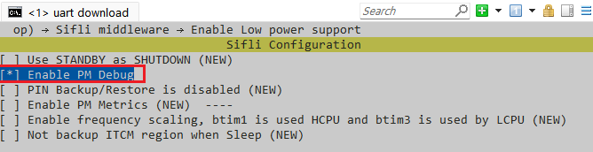<br>   
Figure 2-1: Middleware Low Power Configuration Menu<br>
3. Navigate to RTOS → RT-Thread Components → Device Drivers. "Using Power Management Device Drivers" is the low-power service option for the operating system. Since the middleware's low-power support is already enabled, this option is selected by default. "Enable Standby Mode" is used to configure whether the system can enter STANDBY low-power mode. If selected, the system can enter STANDBY mode, as shown in Figure 2-2. If not selected, the system can only enter LIGHT low-power mode. Note that if LCPU enables STANDBY mode, HCPU must also enable STANDBY mode.<br>
<br>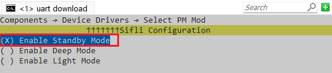<br>  
Figure 2-2: Device Driver Low Power Configuration Menu
1. After configuration, ensure that the project configuration file `rtconfig.h` includes the following definitions:<br>
```c
#define RT_USING_PM 1 // Enable PM module
//#define PM_DEEP_ENABLE 1 // Recommended for 52 MCU to use DEEP sleep mode
#define PM_STANDBY_ENABLE 1 // Recommended for 55, 58, 56 to use STANDBY sleep mode
#define BSP_USING_PM 1  // Enable PM module
#define BSP_PM_DEBUG 1 // Print PM[S], [W] logs
```

### 2.2 Disabling Low Power Mode
1. Run `menuconfig` in the project directories of HCPU and LCPU to open the software configuration menu.
2. Navigate to SiFli Middleware and uncheck "Enable Low Power Support" to disable low-power mode support in the middleware.
3. Navigate to RTOS → RT-Thread Components → Device Drivers and uncheck "Using Power Management Device Drivers" to disable the operating system's low-power service.

### 2.3 Key Wakeup Configuration
Refer to the configuration method in `SDK\example\rt_device\pm\common`<br>
1. Standby Wakeup Configuration (can be used for standby, deep, and light wakeups)<br>

The following is an example of the HAL layer's standby wakeup API function. If IO wakeup requires event handling, GPIO interrupts need to be configured:<br>
```c
HAL_HPAON_EnableWakeupSrc(HPAON_WAKEUP_SRC_PIN3, AON_PIN_MODE_LOW); // 55x PA80 #WKUP_A3
HAL_LPAON_EnableWakeupSrc(LPAON_WAKEUP_SRC_PIN5, AON_PIN_MODE_NEG_EDGE); // 55x PB48 #WKUP_PIN5
// To verify if the configuration is effective, refer to the corresponding registers in the chip manual:
rt_kprintf("wsr:0x%x,wer:0x%x,\n", hwp_hpsys_aon->WSR, hwp_hpsys_aon->WER); // hcpu
rt_kprintf("wsr:0x%x,wer:0x%x,\n", hwp_lpsys_aon->WSR, hwp_lpsys_aon->WER); // lcpu
```

2. Shutdown Wakeup Configuration (can be used for hibernate wakeup)<br>

For the 55 series MCU, only the wakeup pins 0-5 of the Lcpu have wakeup functionality in Hibernate mode. Refer to the 55 series user manual for the PMUC WER register configuration.
For MCUs after the 55 series, two wakeup sources PIN0 and PIN1 can coexist, and each wakeup source can be assigned to any Hcpu/Lcpu wakeup pin. Refer to the user manual for the PMUC CR register configuration.<br>
The following is an example of the HAL layer's shutdown wakeup API function:<br>
```c
// Configuration method for 55x:
HAL_PMU_EnablePinWakeup(5, AON_PIN_MODE_NEG_EDGE); // 55x PB48 #WKUP_PIN5
// To verify if the configuration is effective, refer to the corresponding registers in the chip manual:
rt_kprintf("CR:0x%x,WER:0x%x\n", hwp_pmuc->CR, hwp_pmuc->WER);
// Configuration method for 58x, 58x, 52x:
HAL_PMU_SelectWakeupPin(0, HAL_HPAON_QueryWakeupPin(hwp_gpio1, BSP_KEY1_PIN)); // select PA34 to wake_pin0
HAL_PMU_EnablePinWakeup(0, AON_PIN_MODE_HIGH);  // enable wake_pin0 
rt_kprintf("CR:0x%x,WER:0x%x\n", hwp_pmuc->CR, hwp_pmuc->WER);
```
After hibernation shutdown, the wakeup is equivalent to a cold start (but with the PM_HIBERNATE_BOOT flag), unlike Standby wakeup which can resume the original program. The wakeup pin and level mode are controlled by the PMU registers. To verify if the configuration is effective, print the corresponding PMU WER and CR register values for comparison;<br>
**Note:**<br>
If an IO port needs to be used for both standby and shutdown wakeups, both configurations must be set;<br>
## 3 Low Power Mode Debugging Methods
### 3.1 Low Power Modes
Both HPSYS and LPSYS support the following four low-power modes. In this solution, only IDLE, LIGHT, and STANDBY modes are used.<br>

* PM_SLEEP_MODE_IDLE：<br>
CPU stops at WFI or WFE instruction, the system has a high-speed clock, peripherals can operate, and all interrupts can wake the system from WFI or WFE instructions.
* PM_SLEEP_MODE_LIGHT：<br>
The subsystem enters LIGHT low-power mode, the system high-speed clock is disabled, and it switches to a 32K clock. Peripherals stop working, but neither the CPU nor the peripherals lose power, and they can be woken by limited wake sources.
* PM_SLEEP_MODE_DEEP：<br>
The subsystem enters DEEP low-power mode, the power supply switches to RET_LDO, the system high-speed clock is disabled, and it switches to a 32K clock. Peripherals stop working, but neither the CPU nor the peripherals lose power, and they can be woken by limited wake sources.
* PM_SLEEP_MODE_STANDBY：<br>
The subsystem enters STANDBY low-power mode, the power supply switches to RET_LDO, the system high-speed clock is disabled, and it switches to a 32K clock. Both the CPU and peripherals lose power, but they can be woken by limited wake sources. HCPU has only 64KB of Retention RAM that remains powered, so data on it will not be lost, while other RAM will lose power and data cannot be retained. LCPU's RAM remains powered, and data can be retained.<br>

The current consumption for various low-power modes is shown in Table 3-1.<br>
In the solution, if PSRAM exists, HCPU will back up data that needs to be saved from the power-down RAM to PSRAM, and restore data from PSRAM upon waking. If there is no PSRAM, data that needs to be saved from RAM will be backed up to 64KB of Retention RAM.<br>
Unless otherwise specified, entering a sleep mode for the subsystem refers to entering a low-power mode other than IDLE, and waking up refers to exiting a low-power mode other than IDLE.<br>
In addition to the four low-power modes provided by each subsystem, the chip also provides two system-level shutdown modes (see Table 3-2):<br>
• Hibernate mode:<br> All subsystems lose power, the system switches to a 32K crystal, and can be woken by PIN and RTC. The RTC wake-up time is accurate. The software interface is HAL_PMU_EnterHibernate.<br>
• Shutdown mode:<br> All subsystems lose power, the system switches to RC10K, and can be woken by PIN and RTC, but the RTC wake-up time is inaccurate. The software interface is HAL_PMU_EnterShutdown.<br>

Table 3-1: Low-Power Modes

| Low-Power Mode | CPU State | Peripheral State | SRAM | Wake Source | Wake Time | Chip Current @1.8V |
|:--|:--|:--|:--|:--|:--|:--|
| PM_SLEEP_MODE_IDLE | stop | run | accessible | any interrupt | <0.5us | LPSYS: 0.2mA~0.8mA HPSYS: 1.2mA~5.5mA |
| PM_SLEEP_MODE_LIGHT | stop | stop | inaccessible, fully retained | wake interrupt | 30us~100us | LPSYS: 186uA HPSYS: 1155uA |
| PM_SLEEP_MODE_DEEP | stop | stop | LPSYS: inaccessible, fully retained HPSYS: inaccessible, only 64KB retained | wake interrupt | 100us~1ms | LPSYS: 93uA HPSYS: 316uA |
| PM_SLEEP_MODE_STANDBY | reset | reset | LPSYS: inaccessible, fully retained HPSYS: inaccessible, only 64KB retained | wake interrupt | 1ms~2ms | <5uA |

Table 3-2: Shutdown Modes

| Low-Power Mode | CPU State | Peripheral State | SRAM | IO | Wake Source | Wake Time | Chip Current @1.8V |
|:--|:--|:--|:--|:--|:--|:--|:--|
| Hibernate | reset | reset | data not retained | high impedance | RTC and PIN | >2ms | 600nA |
| Shutdown | reset | reset | data not retained | high impedance | RTC and PIN | >2ms | 250nA |

Note: The above current data is for reference only, and actual values may increase due to different peripheral enablement and IO settings. "stop" indicates that the component stops working and can resume operation without reconfiguration upon exiting the low-power mode; "reset" indicates that the component stops working and is reset upon exiting the low-power mode, and for the CPU, it will start executing from ROM, and for peripherals, they need to be reconfigured to work.

### 3.2 Low-Power Flow
In the solution, HPSYS can only enter sleep mode after the screen is turned off. When the screen is on, if HCPU is not working, HPSYS can only enter IDLE mode. Only after HPSYS enters sleep mode can LPSYS enter sleep mode. If HPSYS is not in sleep mode, even if LCPU is not working, LPSYS can only enter IDLE mode (for the 52 series, HCPU and LCPU can enter sleep mode independently). When HPSYS is in sleep mode, LPSYS can freely enter and exit sleep mode without waking HPSYS.

#### 3.2.1 Screen Off
The lock screen time can be selected in the settings interface. When the screen has no operation for more than the lock screen time, the screen turns off. In the IDLE thread, the sleep conditions are checked, and if the conditions are met, HPSYS enters sleep mode, and LPSYS can also enter sleep mode.
<br>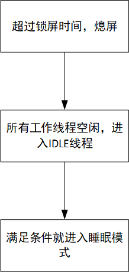<br>
Figure 3-1: Screen Off Flow<br>

#### 3.2.2 HPSYS Wake-Up
HPSYS can be woken by the following events:
* Key press
* Events from the phone app (BLE Notification/ Setting/ Incoming call/ Find device/ Push notifications, etc.)
* Events from sensor algorithms (goal achievement, sedentary reminder, wrist raise to light up the screen, abnormal heart rate, historical cache overflow, etc.)
* Alarm
* Low battery warning
* Charger insertion
After HPSYS is woken, it can optionally turn on the screen. For the following events, the screen does not need to be turned on, while for other events, the screen needs to be turned on:
1. Setting events from the phone app
2. Historical cache overflow events from sensors
For example, the flow for waking up and turning on the screen with a key press is shown in Figure 3-2. After the screen is turned on, it enters a new round of the screen-off judgment process.
The wake-up flow triggered by a setting event from the phone app is shown in Figure 3-3. After handling the Setting request and returning to the IDLE thread, it can immediately enter sleep mode.
<br>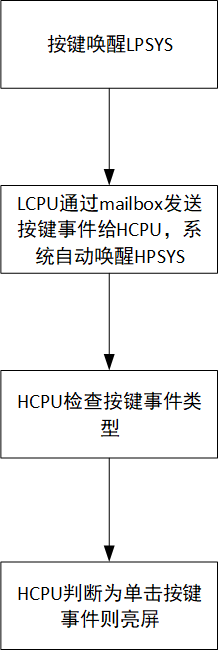<br>
Figure 3-2: Key Press Screen On/Off Flow
<br>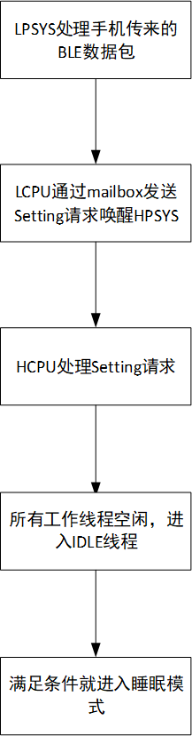<br>
Figure 3-3: Wake-Up Flow for Receiving Phone Setting Event

#### 3.2.3 LPSYS Wakeup
LPSYS can be awakened by the following events:
* Button press
* HPSYS wakes up
* Sensor data acquisition timer timeout
* BLE periodic timer timeout
### 3.3 Log Interpretation
HCPU and LCPU will output logs through the console. After enabling the low-power debug switch as described in Section 2.1, you can search for the keywords in the table in the logs to analyze the system's low-power process.
Table 3-3: Log Keyword Interpretation
Log| Meaning
:--|:--
gui_suspend| Screen off
gui_resume| Screen on
[pm]S: mode,gtime| Entering sleep mode, mode indicates the low-power mode, 2 indicates LIGHT, 4 indicates STANDBY. gtime is the current time, in units of 32768Hz
[pm]W: gtime| Exiting sleep mode, gtime is the current time, in units of 32768Hz
[pm]WSR:0xXXXXX| Wakeup reason

The time displayed by gtime is synchronized on both HCPU and LCPU sides. For example, in Figure 3-4, the green box indicates that the system entered sleep at 2136602 and woke up at 2142330, with the wakeup reason being 0x200. Therefore, the sleep duration is sleep_time=(2142330-2136602)/32768=175ms, and the wakeup reason is the mailbox interrupt triggered by LPSYS. A bit set to 1 in WSR indicates that the corresponding source triggered the wakeup. The meaning of each bit is detailed in the corresponding chip manual register table; see Table 3-4, Table 3-5, and Table 3-6 for the 55 series MCU configuration (data sourced from SF32LB55x User Manual, 4.3 HPSYS_AON Register, 4.4 LPSYS_AON Register).
<br>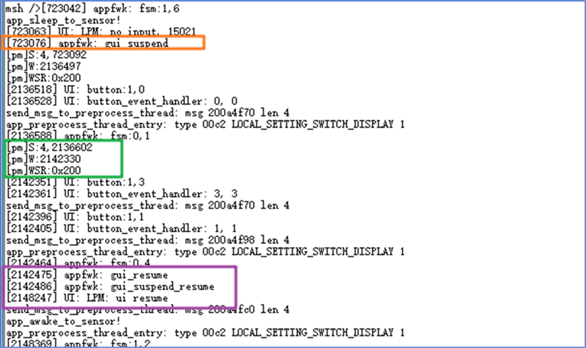<br>
Figure 3-4: Low-Power Log Example

**Table 3-4: 55 Series HPSYS WSR Meaning**
|Bit Field| Meaning|
|:--|:--
|[0]| RTC wakeup|
|[1]| LPTIM1 wakeup|
|[2]| PIN0 wakeup|
|[3]| PIN1 wakeup|
|[4]| PIN2 wakeup|
|[5]| PIN3 wakeup|
|[8]| LPSYS manually wakes up HPSYS|
|[9]| LPSYS wakes up HPSYS using Mailbox|

**Table 3-5: 55 Series HPSYS Wakeup PIN Mapping Table**

|Wakeup| PIN Meaning|
:--|:--
PIN0| PA77
PIN1| PA78
PIN2| PA79
PIN3| PA80

**Table 3-6: 55 Series LPSYS WSR Meaning**

Bit Field| Meaning
:--|:--
[0]| RTC wakeup
[1]| LPTIM2 wakeup
[2]| LPCOMP1 wakeup
[3]| LPCOMP2 wakeup
[4]| BLE wakeup
[5]| PIN0 wakeup
[6]| PIN1 wakeup
[7]| PIN2 wakeup
[8]| PIN3 wakeup
[9]| PIN4 wakeup
[10]| PIN5 wakeup
[11]| HPSYS manually wakes up LPSYS
[12]| HPSYS wakes up LPSYS using Mailbox

**Table 3-7: 55 Series LPSYS Wakeup PIN Mapping Table**

Wakeup| PIN Meaning
:--|:--
PIN0| PB43
PIN1| PB44
PIN2| PB45
PIN3| PB46
PIN4| PB47
PIN5| PB48

### 3.4 Common Issue Analysis
Since SWD cannot connect after entering sleep mode, UART must be used as the console port to capture logs for issue analysis.
#### 3.4.1 Whether Entered Sleep Mode
If any of the following conditions are met, it is highly likely that HPSYS has entered sleep mode:

- SWD cannot connect
- HCPU's console does not respond
- HCPU's logs show "s: mode, gtime"

If any of the following conditions are met, it is highly likely that LPSYS has entered sleep mode:

- LCPU's console does not respond
- LCPU's logs show "s: mode, gtime"

It is necessary to confirm that the finsh shell option is enabled in the LCPU's Command shell.
- You can also measure the voltage of the chip's power pins to determine the current low-power mode.<br>
When HPSYS is in active, sleep, or deepsleep mode, the LDO1_VOUT voltage remains at 1.1V. When HPSYS is in standby mode, the LDO1_VOUT voltage cannot be maintained and will gradually drop to 0V. When LPSYS is in active, sleep, or deepsleep mode, the LDO2_VOUT or BUCK2_VOUT voltage remains at 0.9V. When LPSYS is in standby mode, the LDO2_VOUT or BUCK2_VOUT voltage cannot be maintained and will gradually drop to 0V. When the chip enters hibernate mode, LDO1_VOUT, LDO2_VOUT, BUCK2_VOUT, and VDD_RET all drop to 0V.<br>
Refer to Figure 3-5 for the power pin voltages of the 55 series in low-power modes (data sourced from SF32LB55x User Manual, 4.2.9 Determining the Current Low-Power Mode)
<br>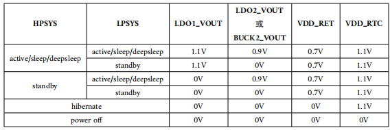<br>

**Figure 3-5: 55 Series Power Pin Voltages in Low-Power Modes**

#### 3.4.2 Why the Sleep Mode is Not Entered
When the CPU is idle, entering the sleep mode requires the following conditions to be met simultaneously:
- The PM module is enabled
- The CPU is idle and has entered the idle thread
- Sleep mode is not disabled
- The operating system's timer timeout is greater than the sleep threshold
- No wake-up sources are present
- Data sent to another core has been read
If HCPU or LCPU fails to enter sleep mode, you can refer to the example `SDK\example\rt_device\PM` and troubleshoot step by step. The troubleshooting methods for Hcpu and Lcpu are the same:
1. Enable the PM module<br>
Ensure that the following macros are generated in rtconfig.h:
```c
#define RT_USING_PM 1
#define BSP_USING_PM 1 // Enable low power mode
#define PM_STANDBY_ENABLE 1 // Enter standby mode low power # 55,58,56 series recommend standby sleep
//#define PM_DEEP_ENABLE 1 // Enter Deep mode low power # 52 series recommend Deep sleep
#define BSP_PM_DEBUG 1 // Enable low power mode debug log
```
2. Confirm that the CPU is idle and has entered the idle thread<br>
You can use the finsh serial command `list_thread` to check the status of all threads. Only tshell and tidle should be ready, and all others should be in the suspend state. Otherwise, a thread that remains in the ready state will prevent the IDLE thread from running, and the system will not enter sleep mode. As shown in the following figure, I added a `__asm("B .");` infinite loop instruction in the `app_watch_entry()` function, which prevents the app_watch thread from entering the suspend state, thus preventing sleep.
<br>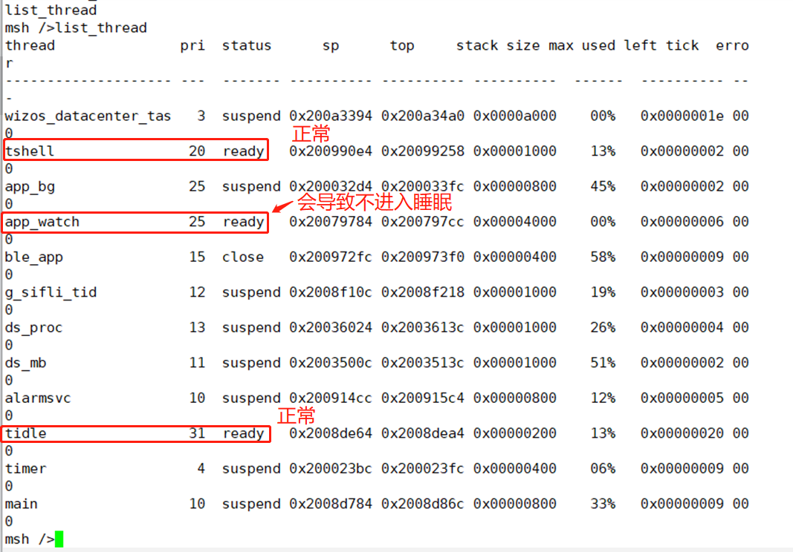<br>
Figure 3-6: Information returned by the `list_thread` command

3. Confirm that sleep mode is not disabled<br>
Send the command `pm_dump` in the console. If the Counter for Idle Mode is greater than 0, it indicates that a module has called `rt_pm_request(PM_SLEEP_MODE_IDLE)` to disable sleep. Check the code to ensure that `rt_pm_release(PM_SLEEP_MODE_IDLE)` is called to release the sleep inhibition. If the Counter is 0, it indicates that sleep mode is not disabled.
<br>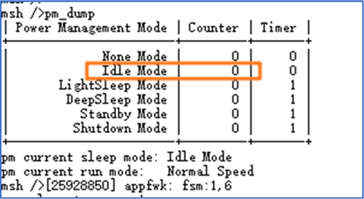<br>
Figure 3-7: Information returned by the `pm_dump` command

4. Confirm that the operating system's timer timeout is greater than the sleep threshold<br>
Send the command `list_timer` in the console to display all created timers in the operating system. Compare the timeout value of the activated timers with the sleep threshold. If the timeout value is less than the sleep threshold, it indicates that the timer is preventing the system from entering sleep mode. The timeout unit for the operating system timer is ms.
<br>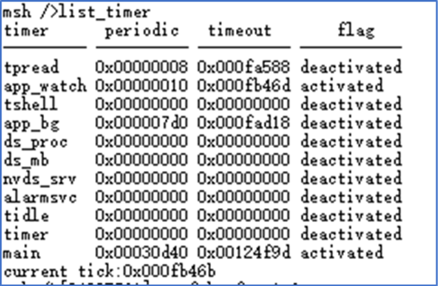<br>
Figure 3-8: Information returned by the `list_timer` command
See the following configuration, the default sleep threshold for HPSYS is 100ms, and for LPSYS is 10ms:
```c
RT_WEAK const pm_policy_t pm_policy[] =
{
#ifdef PM_STANDBY_ENABLE
#ifdef SOC_BF0_HCPU
    {100, PM_SLEEP_MODE_STANDBY}, // Hcpu enters standby sleep if no timer wakes it up within 100ms
#else
    {10, PM_SLEEP_MODE_STANDBY}, // Lcpu enters standby sleep if no timer wakes it up within 10ms
#endif /* SOC_BF0_HCPU */
#elif defined(PM_DEEP_ENABLE)
#ifdef SOC_BF0_HCPU
    {100, PM_SLEEP_MODE_DEEP}, // Hcpu enters Deep sleep if no timer wakes it up within 100ms
#else
    {10, PM_SLEEP_MODE_DEEP}, // Lcpu enters Deep sleep if no timer wakes it up within 10ms
#endif /* SOC_BF0_HCPU */
#else
#ifdef SOC_BF0_HCPU
    {100, PM_SLEEP_MODE_LIGHT},
#else
```
See the following code, if there is a 90ms delay (90ms timer wake-up) in the Hcpu code, Hcpu will never enter sleep mode:
```c
while(1)
{
    rt_thread_delay(90); // 90ms delay
}
```

**Note the difference between delay functions:**<br>
a. HAL layer delay functions: (equivalent to instruction loops in while, the delay will not switch to other threads)<br>
```c
HAL_Delay(10); /* delay 10ms */<br>
HAL_Delay_us(10); /* delay 10us */<br>
```
b. RTT interface delay functions:<br>
```c
rt_thread_delay(100); /* delay 100ms */<br>
```
When the RTT interface delay function is executed, it will switch to other threads, such as the idle thread,<br>
and will enter Standby sleep when the sleep threshold is lower than the delay duration.<br>
5. Ensure there are no unhandled wake-up sources<br>
If there are wake-up sources that have not been cleared, the system will not enter sleep (because it will be woken up even if it goes to sleep). You can use serial commands to read the WSR registers of Hcpu and Lcpu. In the console, send the command `regop read` to read the WER and WSR registers and check if there are any wake-up sources preventing sleep. For example, the register addresses for the 55 series HPSYS are 0x40030018 and 0x4003001C, and for LPSYS are 0x40070018 and 0x4007001C.<br>
```
regop unlock 0000
regop read 4007001c 1
regop read 4003001c 1
```
You can also connect a Jlink/SifliUsartServer debugger to read the register values, or use log printing to get the WSR value, and refer to the corresponding chip manual to identify the specific wake-up source.
```c
rt_kprintf("wsr:0x%x,wer:0x%x,\n",hwp_hpsys_aon->WSR,hwp_hpsys_aon->WER); //hcpu
rt_kprintf("wsr:0x%x,wer:0x%x,\n",hwp_lpsys_aon->WSR,hwp_lpsys_aon->WER); //lcpu
```
A common issue is incorrect pin level states for wake-up pins, such as setting a low-level wake-up but the wake-up pin level is always low.<br>
6. Ensure data sent to the other core has been read<br>
You can use Ozone to connect, dump memory, and view with trace32, or use log printing to check the `tx_buffer` of each queue in the `ipc_ctx` variable to see if there is any data that has not been read. As shown in Figure 3-9, `read_idx_mirror` and `write_idx_mirror` should normally be equal or empty. If they are not equal, it means there is data that has not been read, which can prevent the system from entering sleep. For example, if there is unprocessed data, the system cannot enter sleep:
<br><br>
Figure 3-9: Non-empty `read_idx_mirror` and `write_idx_mirror`<br>
As shown in Figure 3-10, the data is empty:
<br>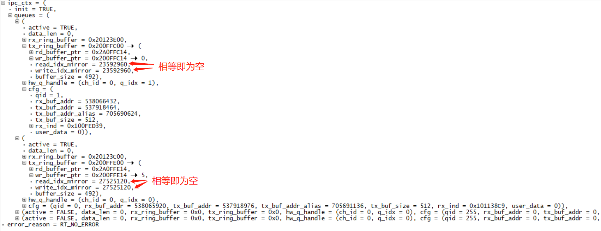<br>
Figure 3-10: Empty `read_idx_mirror` and `write_idx_mirror`<br>
Below is the log output of the `read_idx_mirror` and `write_idx_mirror` content for each queue with `active` set to 1:
```c
for(i=0;i<IPC_LOGICAL_QUEUE_NUM;i++)
{
    if(ipc_ctx.queues[i].active == true)
    {
        if(ipc_ctx.queues[i].rx_ring_buffer != NULL)
        {
            if(ipc_ctx.queues[i].tx_ring_buffer != NULL)
            {
                LOG_I("ipc_ctx.queues[%d].tx read_idx_mirror=0x%x,write_idx_mirror=0x%x\n",i,ipc_ctx.queues[i].tx_ring_buffer->read_idx_mirror,ipc_ctx.queues[i].tx_ring_buffer->write_idx_mirror);
            }
        }
    }
}
```
As shown in Figure 3-11, Hcpu does not enter sleep because Lcpu has not started the data service, and the data sent by Hcpu to qid=1 has not been read by Lcpu:
<br>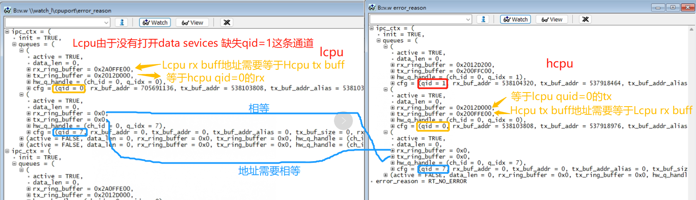<br>

## 4 Power Optimization Methods
### 4.1 Standby Leakage Analysis
If both HPSYS and LPSYS have entered sleep mode, the focus of overall power optimization can be expanded from the following three points:<br>
1. Remove the display, external sensors, charging IC, and other removable components to check the minimum system current;<br>
2. Incorrect IO level configuration in software can cause voltage differences leading to leakage, and floating inputs without pull-up or pull-down can also cause leakage;<br>
3. Internal PSRAM/Flash and external NAND/Flash/EMMC have not entered sleep mode;<br>
If the hardware can be disassembled to measure current, you can use a multimeter to check which power supply line is leaking, such as VSYS, VLDO2, VLDO3, VDD_SIP, VDDIOA?<br>
This can help narrow down the scope of the investigation.<br>

#### 4.1.1 Peripheral Leakage
1) Board-level components are not powered off<br>
2) Board-level components are powered off, but incorrect pin settings on the chip cause current to flow back into the board-level components through the chip pins<br>
For 2), to avoid the chip pins connected to the powered-off components from outputting high or enabling pull-up resistors.
Based on the aforementioned analysis of leakage causes, the configuration methods for common peripheral pins in working and sleep states are shown in Table 4-1. When the external circuit is not powered off, the circuit state does not change, and there is no need to change the pin configuration even when entering sleep mode. Only when the external circuit is powered off should the relevant pin settings be modified. Therefore, if the external circuit is already powered off before entering sleep mode, the pin settings should be immediately modified to reduce power consumption. Similarly, if the external circuit remains powered off after waking up from sleep, the pin settings should be modified again to the powered-off state settings because the pin settings will revert to default values due to the power-off.
<br>Table 4-1: Recommended Pin Settings<br>
Peripheral| Pin| Direction| Working State| Sleep (External Circuit Not Powered Off)| Sleep (External Circuit Powered Off)
:--|:--|:--|:--|:--|:--
PSRAM|PSRAM_CLK| O| Digital Output| Digital Output| GPIO Mode Output Low
PSRAM|PSRAM_CLKB| O| Digital Output| Digital Output| GPIO Mode Output Low
PSRAM|PSRAM_CS| O |Digital Output| Digital Output |GPIO Mode Output Low
PSRAM|PSRAM_DM0| O |Digital Output |Digital Output| GPIO Mode Output Low
PSRAM|PSRAM_DM1| O| Digital Output| Digital Output| GPIO Mode Output Low
PSRAM|PSRAM_DQS0| I/O| Digital Input with Pull-down| Digital Input with Pull-down| Digital Input with Pull-down
PSRAM|PSRAM_DQS1| I/O |Digital Input with Pull-down| Digital Input with Pull-down| Digital Input with Pull-down
PSRAM|PSRAM_DQx |I/O |Digital Input with Pull-down| Digital Input with Pull-down |Digital Input with Pull-down
QSPI|QSPIx_CLK| O| Digital Output| Digital Output| GPIO Mode Output Low
QSPI|QSPIx_CS| O| Digital Output| Digital Output| GPIO Mode Output Low
QSPI|QSPIx_DIO0| I/O| Digital Input with Pull-down| Digital Input with Pull-down| Digital Input with Pull-down
QSPI|QSPIx_DIO1| I/O| Digital Input with Pull-down| Digital Input with Pull-down| Digital Input with Pull-down
QSPI|QSPIx_DIO2| I/O| Digital Input with Pull-up| Digital Input with Pull-up| Digital Input with Pull-down
QSPI|QSPIx_DIO3| I/O| Digital Input with Pull-up| Digital Input with Pull-up| Digital Input with Pull-down
QSPI|QSPIx_DIO4| I/O| Digital Input with Pull-down| Digital Input with Pull-down| Digital Input with Pull-down
QSPI|QSPIx_DIO5| I/O| Digital Input with Pull-down| Digital Input with Pull-down| Digital Input with Pull-down
QSPI|QSPIx_DIO6| I/O| Digital Input with Pull-up| Digital Input with Pull-up| Digital Input with Pull-down
QSPI|QSPIx_DIO7| I/O| Digital Input with Pull-up| Digital Input with Pull-up| Digital Input with Pull-down
USART|USARTx_RXD| I |Digital Input with Pull-up| Digital Input with Pull-up| Digital Input with Pull-down
USART|USARTx_TXD| O |Digital Output| Digital Output| Digital Output
USART|USARTx_CTS| I| Digital Input with Pull-up| Digital Input with Pull-up |Digital Input with Pull-down
USART|USARTx_RTS| O |Digital Output| Digital Output |Digital Output
I2C|I2Cx_SCL| I/O| Digital Input| Digital Input| Digital Input with Pull-down
I2C|I2Cx_SDA| I/O |Digital Input| Digital Input| Digital Input with Pull-down
SPI Master|SPIx_CLK| O |Digital Output| Digital Output| GPIO Mode Output Low
SPI Master|SPIx_CS| O |Digital Output| Digital Output| GPIO Mode Output Low
SPI Master|SPIx_DI| I |Digital Input with Pull-down| Digital Input with Pull-down| Digital Input with Pull-down
SPI Master|SPIx_DO| O |Digital Output |Digital Output| GPIO Mode Output Low
SPI Master|SPIx_DIO| I/O| Digital Input with Pull-down| Digital Input with Pull-down| Digital Input with Pull-down
LCDC SPI|LCDCx_SPI_CS| O |Digital Output| Digital Output| GPIO Mode Input with Pull-down
LCDC SPI|LCDCx_SPI_CLK| O |Digital Output |Digital Output| GPIO Mode Input with Pull-down
LCDC SPI|LCDCx_SPI_DIO0| I/O| Digital Input with Pull-down| Digital Input with Pull-down| GPIO Mode Input with Pull-down
LCDC SPI|LCDCx_SPI_DIO1| O |Digital Output| Digital Output |GPIO Mode Input with Pull-down
LCDC SPI|LCDCx_SPI_DIO2| O |Digital Output| Digital Output| GPIO Mode Input with Pull-down
LCDC SPI|LCDCx_SPI_DIO3| O |Digital Output| Digital Output| GPIO Mode Input with Pull-down
LCDC SPI|LCDCx_SPI_RSTB| O |Digital Output| Digital Output| GPIO Output Low
LCDC SPI|LCDCx_SPI_TE| I |Digital Input| Digital Input| GPIO Mode Input with Pull-down
SDIO|SD_CLK| O |Digital Output |Digital Output| GPIO Mode Output Low
SDIO|SD_CMD| I/O| Digital Input with Pull-up| Digital Input with Pull-up| Digital Input with Pull-down
SDIO|SD_DIOx| I/O |Digital Input with Pull-up| Digital Input with Pull-up| Digital Input with Pull-down
I2S|I2S1_BCK| O |Digital Output |Digital Output |GPIO Mode Output Low
I2S|I2S1_LRCK |O |Digital Output |Digital Output |GPIO Mode Output Low
I2S|I2S1_SDI |I |Digital Input with Pull-down |Digital Input with Pull-down |Digital Input with Pull-down
I2S|I2S2_BCK |O |Digital Output| Digital Output| GPIO Mode Output Low
I2S|I2S2_LRCK| O |Digital Output| Digital Output |GPIO Mode Output Low
I2S|I2S2_SDI| I |Digital Input with Pull-down| Digital Input with Pull-down| Digital Input with Pull-down
I2S|I2S2_SDO| O |Digital Output |Digital Output |GPIO Mode Output Low
PDM|PDM_CLK |O |Digital Output| Digital Output |GPIO Mode Output Low
PDM|PDM_DATA| I| Digital Input with Pull-down| Digital Input with Pull-down| Digital Input with Pull-down
GPTIM Output| GPTIMx_CHx| O |Digital Output| Digital Output |GPIO Mode Output Low
GPTIM Input| GPTIMx_CHx| I |Digital Input with Pull-down| Digital Input with Pull-down| Digital Input with Pull-down
GPTIM |GPTIMx_ETR |I |Digital Input with Pull-down| Digital Input with Pull-down |Digital Input with Pull-down
GPIO Input| GPIO| I| Digital Input| Digital Input| GPIO Output Low or Digital Input with Pull-down
GPIO Output| GPIO| O |Digital Output |Digital Output| GPIO Mode Output Low

#### 4.1.2 Chip IO Internal Leakage
In the FAQ section,
[8.7 Standby and Standby Shutdown Common IO Internal Leakage Models](../../faq/mcu/low_power.md#87_Standby待机和Standby关机IO内部常见的漏电模型) and
[8.8 Hibernate Shutdown Common Wakeup IO Internal Leakage Models](../../faq/mcu/low_power.md#88_Hibernate关机常见的唤醒IO内部漏电模型) provide detailed explanations;<br>
These can be summarized as:<br>
1) Floating input pins (due to the power-off of the connected device, which is equivalent to the pin being floating) leading to uncertain voltage levels<br>
2) Mismatch between IO output levels and internal/external pull-up/pull-down resistors<br>
As shown in Figure 4-1: Pin Internal Structure, the functions are described as follows:<br>
- DS – driving strength
- OE – output enable
- O   – output
- I     – input
- IE   – input enable
- PE  – pull enable
- PS  – pull select
The combination of these controls can achieve the functions commonly used in daily operations;<br>
Push-pull output (push-pull)<br>
- OE = 1, O = 0/1
Open-drain output (open-drain)<br>
- OE = 0/1, O = 0
<br>Figure 4-1: Pin Internal Structure<br>
<br>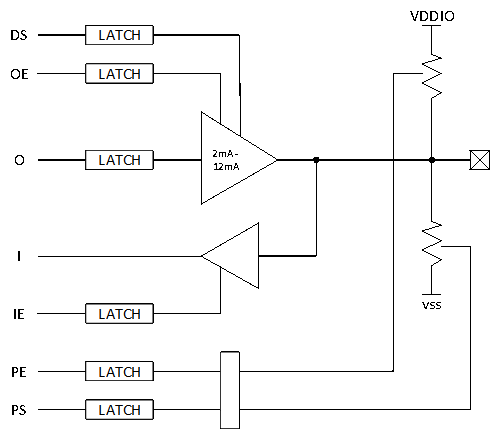<br>
**Note:**<br>
For the 55 series, the PA01 port of the USB has an internal default 18K ohm pull-down resistor. When the output is high or an external high voltage is applied, leakage can occur. For handling methods, refer to the FAQ section [1.6 55 Series MCU Reusing USB PA01/PA03 Leakage Risk](../../faq/mcu/gpio.md#16_55系列MCU复用USB的PA01)

#### 4.1.3 Chip Internal and External Storage Chip Leakage
1. Methods for PSRAM to Enter and Exit Half_sleep<br>
```c
void BSP_Power_Up(bool is_deep_sleep)
{
#ifdef SOC_BF0_HCPU
    if (!is_deep_sleep)
    {
#if defined(BSP_USING_PSRAM1)
        rt_psram_exit_low_power("psram1"); // Exit half_sleep
#endif
    }
    // Omitted
}
void BSP_IO_Power_Down(int coreid, bool is_deep_sleep)
{
#ifdef SOC_BF0_HCPU
    if (coreid == CORE_ID_HCPU)
    {
#if defined(BSP_USING_PSRAM1)
        rt_psram_enter_low_power("psram1");  // Enter half_sleep
#endif
    }
#else
    // Omitted
#endif
}
```
2. Methods for Flash Power-off and Entering and Exiting Deep_sleep<br>
The following code demonstrates the methods for nor flash power-off and entering and exiting deep sleep:<br>
```c
HAL_RAM_RET_CODE_SECT(BSP_PowerDownCustom, void BSP_PowerDownCustom(int coreid, bool is_deep_sleep))
{
#ifdef SOC_BF0_HCPU
#ifdef BSP_USING_NOR_FLASH2
    HAL_PMU_ConfigPeriLdo(PMU_PERI_LDO2_3V3, false, true); // Method to turn off nor flash power supply

    HAL_PIN_Set(PAD_PA16, GPIO_A16, PIN_PULLDOWN, 1); // After turning off the power supply, the flash IO needs to be set to pull-down
    HAL_PIN_Set(PAD_PA12, GPIO_A12, PIN_PULLDOWN, 1);
    HAL_PIN_Set(PAD_PA15, GPIO_A15, PIN_PULLDOWN, 1);
    HAL_PIN_Set(PAD_PA13, GPIO_A13, PIN_PULLDOWN, 1);
    HAL_PIN_Set(PAD_PA14, GPIO_A14, PIN_PULLDOWN, 1);
    HAL_PIN_Set(PAD_PA17, GPIO_A17, PIN_PULLDOWN, 1);

    HAL_PIN_Set(PAD_PA35, GPIO_A35, PIN_PULLDOWN, 1);
    HAL_PIN_Set(PAD_PA36, GPIO_A36, PIN_PULLDOWN, 1);
#elif defined(BSP_USING_NOR_FLASH1)
    FLASH_HandleTypeDef *flash_handle;
    flash_handle = (FLASH_HandleTypeDef *)rt_flash_get_handle_by_addr(MPI1_MEM_BASE);
    HAL_FLASH_DEEP_PWRDOWN(flash_handle); // Method for nor flash to enter deep sleep, in this way, the IO state does not need to be modified
    HAL_Delay_us(3);
#endif /* BSP_USING_NOR_FLASH2 */
#else
    {
        ;
    }
#endif

HAL_RAM_RET_CODE_SECT(BSP_PowerUpCustom, void BSP_PowerUpCustom(bool is_deep_sleep))
{
#ifdef SOC_BF0_HCPU
    if (!is_deep_sleep)
    {
#ifdef BSP_USING_NOR_FLASH2
        HAL_PIN_Set(PAD_PA16, MPI2_CLK,  PIN_NOPULL,   1); // Before turning on the nor flash power supply, configure the IO to the working state
        HAL_PIN_Set(PAD_PA12, MPI2_CS,   PIN_NOPULL,   1);
        HAL_PIN_Set(PAD_PA15, MPI2_DIO0, PIN_PULLDOWN, 1);
        HAL_PIN_Set(PAD_PA13, MPI2_DIO1, PIN_PULLDOWN, 1);
        HAL_PIN_Set(PAD_PA14, MPI2_DIO2, PIN_PULLUP,   1);
        HAL_PIN_Set(PAD_PA17, MPI2_DIO3, PIN_PULLUP, 1);
```

```c
HAL_PIN_Set(PAD_PA35, GPIO_A35, PIN_PULLUP, 1);
        HAL_PIN_Set(PAD_PA36, GPIO_A36, PIN_PULLUP, 1);

        HAL_PMU_ConfigPeriLdo(PMU_PERI_LDO2_3V3, true, true); // Enable nor flash power supply

        BSP_Flash_hw2_init(); // Re-initialize nor flash after power-off
#elif defined(BSP_USING_NOR_FLASH1)
        FLASH_HandleTypeDef *flash_handle;
        flash_handle = (FLASH_HandleTypeDef *)rt_flash_get_handle_by_addr(MPI1_MEM_BASE);
        HAL_FLASH_RELEASE_DPD(flash_handle); // Wake up nor flash from deep sleep
        HAL_Delay_us(20); // A delay is required after waking up from deep sleep, refer to the flash chip manual for the specific delay time (tRES1 time after ABH command)
#endif
#endif /* BSP_USING_NOR_FLASH2 */
    }
    else if (PM_STANDBY_BOOT == SystemPowerOnModeGet())
    {
    }
#elif defined(SOC_BF0_LCPU)
    {
        ;
    }
#endif
}
```
**Note:**<br>
For the case where XIP runs from nor flash, the code to put nor flash into sleep mode should be declared to run in RAM with `HAL_RAM_RET_CODE_SECT`
### 4.2 Code Implementation
The pin configuration code is implemented in the `pinmux.c` and `drv_io.c` (55 series), `bsp_power.c` (58, 56, 52 series) files of the development board. These files need to be implemented based on the IO function definitions and hardware design of the development board to provide interfaces such as `BSP_PIN_Init`, `BSP_Power_Up`, and `BSP_IO_Power_Down`.

#### 4.2.1 Pin Configuration for Active State
`BSP_PIN_Init` is executed once during cold boot and after waking up from STANDBY. In `BSP_PIN_Init`, you can set the function and input/output mode of each pin for the active state.<br>
Use the function `HAL_PIN_Set` to select the pin function and pull-up/pull-down properties. For example, the following sample code configures PB46 as the USART3_RX function and sets it to digital input pull-up mode.
```c
HAL_PIN_Set (PAD_PB46, USART3_RXD, PIN_PULLUP, 0);
```
For output IOs, if configured in `PIN_NOPULL` mode and no GPIO output is set, the input port will be left floating, causing leakage current.<br>
```c
HAL_PIN_Set(PAD_PA35, GPIO_A35, PIN_NOPULL, 1);
```
As shown above: If PA35 is only configured as an IO with `PIN_NOPULL` and no GPIO output is set, the GPIO pin will default to input mode, causing the input port to be left floating and causing leakage current. You need to set the GPIO output level using the HAL layer function `BSP_GPIO_Set`. After the RTOS starts, you can also use the driver layer to set the output level.<br>
To switch back to input mode, you can call `HAL_GPIO_DeInit`.<br>
#### 4.2.2 Pin Configuration for Sleep State
In `drv_io.c` (55 series), `bsp_power.c` (58, 56, 52 series), users can implement the following virtual functions to dynamically switch pin settings when entering and exiting sleep mode, optimizing the overall power consumption.<br>
<br>Table 4-2: Pin Configuration API for Sleep State<br>
Function Name | Description
:--|:--
BSP_IO_Power_Down| Executed before entering sleep
BSP_Power_Up| Executed after waking up (for STANDBY mode wake-up, executed after `BSP_PIN_Init`)
BSP_TP_PowerDown| Executed after the screen turns off
BSP_TP_PowerUp| Executed before the screen turns on
BSP_LCD_PowerDown| Executed after the screen turns off
BSP_LCD_PowerUp| Executed before the screen turns on

<br>**Note:**<br>
The 52 series uses deep sleep, and the process will be different. Refer to the 52 series sleep process chapter.

If the power-down and power-up control of board-level devices are performed in conjunction with sleep, the power to the board-level devices can be cut off and the corresponding pin settings modified in `BSP_IO_Power_Down`. The reverse operation can be completed in `BSP_Power_Up`. However, the disadvantage of this method is that the control is not fine-grained enough. For example, after the screen is turned off, the HPSYS might not enter sleep mode for some time. If the LCD is still powered during this period, it will increase power consumption. Similarly, if the HPSYS is awakened to perform a task for some time but the screen does not need to be on, powering the screen in `BSP_Power_Up` will also increase power consumption.

To address this, users can implement more complex control logic in `BSP_IO_Power_Down` and `BSP_Power_Up`. For example, for the screen and touch, the power-down handling can be placed in `BSP_TP_PowerDown` and `BSP_LCD_PowerDown`. This way, once the screen is turned off, the screen and touch chip can be immediately powered down. In `BSP_Power_Up`, `BSP_TP_PowerDown` and `BSP_LCD_PowerDown` need to be called again to restore the pin settings to the power-down state. If the conditions for turning on the screen are met, the system will call `BSP_TP_PowerUp` and `BSP_LCD_PowerUp` before the screen is turned on to restore the power and pin settings for the screen and touch.

### 4.3 Sleep Process
#### 56 Series
* hcpu Sleep and Wake-up
When the hcpu enters the idle thread and determines whether the sleep conditions are met, the following process is followed for sleep and wake-up:
```
rt_thread_idle_entry->rt_system_power_manager->_pm_enter_sleep->'pm->ops->sleep(pm, mode);->sifli_sleep -> log print [pm]S:4,11620140 -> RT_DEVICE_CTRL_SUSPEND device suspend -> 
sifli_standby_handler ->BSP_IO_Power_Down-> assembly WFI enter standby-> timer or IO wake-up -> function
SystemInitFromStandby -> HAL_Init -> BSP_IO_Init-> restore_context-> PC pointer set to sifli_standby_handler function WFI instruction continues to run -> BSP_Power_Up-> execute RTT device RT_DEVICE_CTRL_RESUME device resume function -> log print [pm]W:11620520 -> log print [pm]WSR:0x80
```
* LCPU Sleep and Wake-up
The LCPU sleep and wake-up process is basically the same as the hcpu standby process, with the following differences:
```
sifli_standby_handler-> sifli_standby_handler_core-> IO configuration function BSP_IO_Power_Down-> memory sleep function soc_power_down-> assembly WFI enter standby-> timer or IO wake-up -> function SystemPowerOnModeInit ->SystemPowerOnInitLCPU-> HAL_Init-> BSP_IO_Init-> restore_context-> set to WFI instruction and continue execution -> memory exit sleep function soc_power_up-> IO configuration function after sleep BSP_Power_Up-> execute RTT device RT_DEVICE_CTRL_RESUME device resume function -> log print [pm]W:11620520 -> log print [pm]WSR:0x80
```
#### 55 Series
* The 55 series standby process is the same as the 56 series, with the difference being in the wake-up function:
```
timer or IO wake-up -> function SystemPowerOnModeInit -> HAL_Init -> BSP_IO_Init-> restore_context-> PC pointer set to sifli_standby_handler function WFI instruction continues to run -> BSP_Power_Up-> execute RTT device RT_DEVICE_CTRL_RESUME device resume function -> log print [pm]W:11620520 -> log print [pm]WSR:0x80
```
* The LCPU wake-up process is the same as the 56 series.
#### 52 Series
* The 52 series standby process differs from the 56 series in that it enters the `sifli_deep_handler();` standby function and lacks the peripheral SUSPEND/RESUME and context restoration process, making sleep and wake-up faster:
```
sifli_sleep -> log print [pm]S:3,11620140 -> sifli_deep_handler ->BSP_IO_Power_Down-> assembly WFI enter deep-> timer or IO wake-up -> WFI instruction continues to run -> BSP_Power_Up-> log print
[pm]W:11620520 -> log print [pm]WSR:0x80
```

* The Lcpu of the 52 series does not allow code modification, so this part does not need to be considered.<br>
### 4.4 Hibernate Shutdown Leakage Analysis
#### 4.4.1 Hibernate Shutdown Process
* Enter Hibernate<br>
The process of entering Hibernate is relatively simple, by calling the `HAL_PMU_EnterHibernate();` function. Before the chip enters hibernation, the Hibernate wake-up PIN and wake-up level of the PMU need to be configured. For the 55 series MCU, no additional processing is required. For the 56 and 56 series MCUs, due to the additional PMU pull-up/pull-down system that takes effect during Hibernate to prevent leakage, the wake-up PIN can be configured using the `HAL_PIN_Set` function. For the 52 series MCU, since it has 3 built-in LDOs, you need to check your hardware connections to determine whether to configure and disable them using the `HAL_PMU_ConfigPeriLdo` function.<br>
* Hibernate Wake-up<br>
After waking up from Hibernate by pressing the wake-up PIN, you can determine whether it is a `hibernate boot` and the duration of the button press to decide whether to power on by checking `(PM_HIBERNATE_BOOT == SystemPowerOnModeGet())`.<br>
#### 4.4.2 Hibernate Shutdown Configuration
- Enter Hibernate Sleep Shutdown Mode<br>
Call the function `HAL_PMU_EnterHibernate();`. Before entering Hibernate, configure the wake-up PIN and wake-up level of the PMU to ensure that the system can be awakened after entering Hibernate sleep shutdown mode. For the 55 series MCU, the wake-up PINs are in a floating input state during Hibernate, and to prevent floating leakage, external circuits should provide pull-up/pull-down states. For the 58, 56, and 52 series MCUs, to solve the problem of requiring external pull-up/pull-down resistors for the 55 series MCU when entering Hibernate shutdown mode, an additional PMU pull-up/pull-down system (corresponding to software registers: `hwp_rtc->PAWK1R`, `hwp_rtc->PAWK2R`) is provided for the wake-up PINs during Hibernate. It is recommended to use the `HAL_PIN_Set` function to configure the pull-up/pull-down of the wake-up PINs. For the 52 series MCU, which has 3 built-in LDOs (corresponding to software: `PMU_PERI_LDO_1V8`, `PMU_PERI_LDO2_3V3`, `PMU_PERI_LDO3_3V3`), you need to check your hardware connections to determine whether to configure and disable them using the `HAL_PMU_ConfigPeriLdo` function.<br>
The `hwp_pmuc->WKUP_CNT` register can configure how long the external signal needs to be sustained to wake up after Hibernate (only for the 58, 56, and 52 series MCUs).<br>
The following code is the configuration before entering Hibernate for the 52 series MCU:
```c
rt_kprintf("SF32LB52X entry_hibernate\n");
HAL_PMU_SelectWakeupPin(0, HAL_HPAON_QueryWakeupPin(hwp_gpio1, BSP_KEY1_PIN)); // select PA34 to wake_pin0
HAL_PMU_EnablePinWakeup(0, AON_PIN_MODE_HIGH);  // enable wake_pin0 
hwp_pmuc->WKUP_CNT = 0x50005;    // 31-16bit: config PIN1 wake CNT, 15-0bit: PIN0 wake CNT
rt_kprintf("SF32LB52X CR:0x%x, WER:0x%x\n", hwp_pmuc->CR, hwp_pmuc->WER);
HAL_PIN_Set(PAD_PA24, GPIO_A24, PIN_PULLDOWN, 1); // #WKUP_PIN0
HAL_PIN_Set(PAD_PA25, GPIO_A25, PIN_PULLDOWN, 1); // #WKUP_PIN1
HAL_PIN_Set(PAD_PA26, GPIO_A26, PIN_PULLDOWN, 1); // #WKUP_PIN2
HAL_PIN_Set(PAD_PA27, GPIO_A27, PIN_PULLDOWN, 1); // #WKUP_PIN3

HAL_PIN_Set(PAD_PA34, GPIO_A34, PIN_PULLDOWN, 1); // #WKUP_PIN10
HAL_PIN_Set(PAD_PA35, GPIO_A35, PIN_PULLDOWN, 1); // #WKUP_PIN11
HAL_PIN_Set(PAD_PA36, GPIO_A36, PIN_PULLDOWN, 1); // #WKUP_PIN12
HAL_PIN_Set(PAD_PA37, GPIO_A37, PIN_PULLDOWN, 1); // #WKUP_PIN13
HAL_PIN_Set(PAD_PA38, GPIO_A38, PIN_PULLDOWN, 1); // #WKUP_PIN14
HAL_PIN_Set(PAD_PA39, GPIO_A39, PIN_PULLDOWN, 1); // #WKUP_PIN15
HAL_PIN_Set(PAD_PA40, GPIO_A40, PIN_PULLDOWN, 1); // #WKUP_PIN16
HAL_PIN_Set(PAD_PA41, GPIO_A41, PIN_PULLDOWN, 1); // #WKUP_PIN17
HAL_PIN_Set(PAD_PA42, GPIO_A42, PIN_PULLDOWN, 1); // #WKUP_PIN18
HAL_PIN_Set(PAD_PA43, GPIO_A43, PIN_PULLDOWN, 1); // #WKUP_PIN19
HAL_PIN_Set(PAD_PA44, GPIO_A44, PIN_PULLDOWN, 1); // #WKUP_PIN20
```

```c
rt_hw_interrupt_disable();
HAL_PMU_ConfigPeriLdo(PMU_PERI_LDO2_3V3, false, false); 
HAL_PMU_ConfigPeriLdo(PMU_PERI_LDO3_3V3, false, false);
HAL_PMU_ConfigPeriLdo(PMU_PERI_LDO_1V8, false, false);
HAL_PMU_EnterHibernate();
```
<br>**Note:**<br>
- For the 55 series MCUs, since each wake-up pin can be enabled independently, configuring the Hibernate wake-up source only requires calling the function `HAL_PMU_EnablePinWakeup` to enable the corresponding wake-up pin;<br>
- For the 58, 56, and 52 series MCUs, only two wake-up source pins (pin0, pin1) are allowed simultaneously, so an additional step is required to call the function `HAL_PMU_SelectWakeupPin` to select which specific wake-up pin corresponds to pin0 and pin1, refer to the register configuration in `hwp_pmuc->CR`;<br>
- For the 52 series MCUs, the #WKUP_PIN4-9 (PA28-PA33) pins have been canceled for wake-up functionality due to internal sharing with the ADC, and are treated as regular IO pins. The handling method is shown in the red box below, where the external IO is disconnected and internally pulled low (no leakage in Hibernate mode), but the registers `hwp_rtc->PAWK1R, hwp_rtc->PAWK2R` should not be directly set to pull-up, as this could cause leakage.
<br>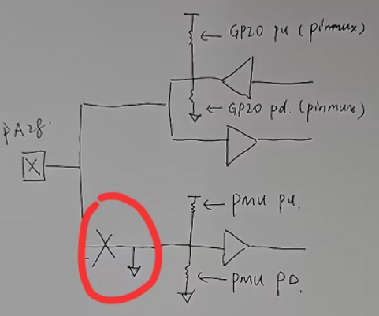<br> 

- Hibernate Wake-up Judgment<br>
After waking up from Hibernate by pressing a wake-up pin, you can determine if `if(PM_HIBERNATE_BOOT == SystemPowerOnModeGet())` is `hibernate boot` and the duration of the button press to decide whether to power on.
```