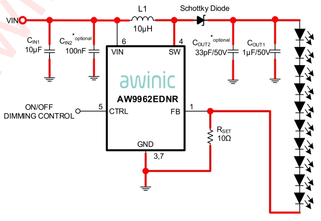
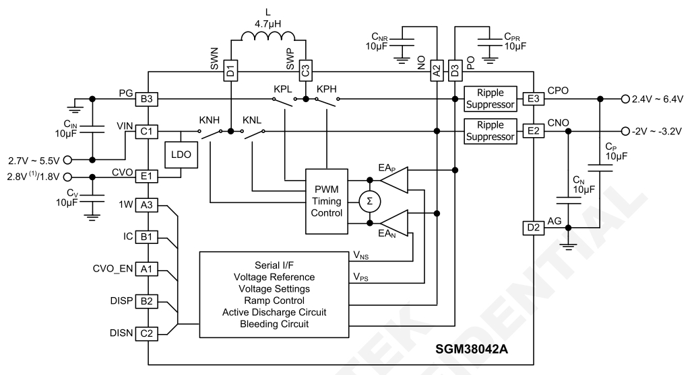
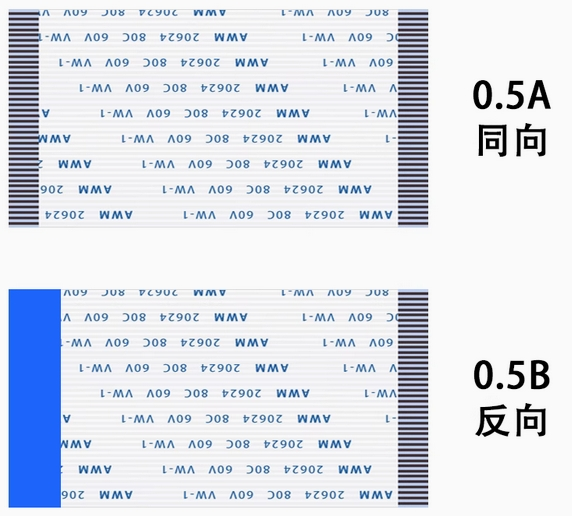
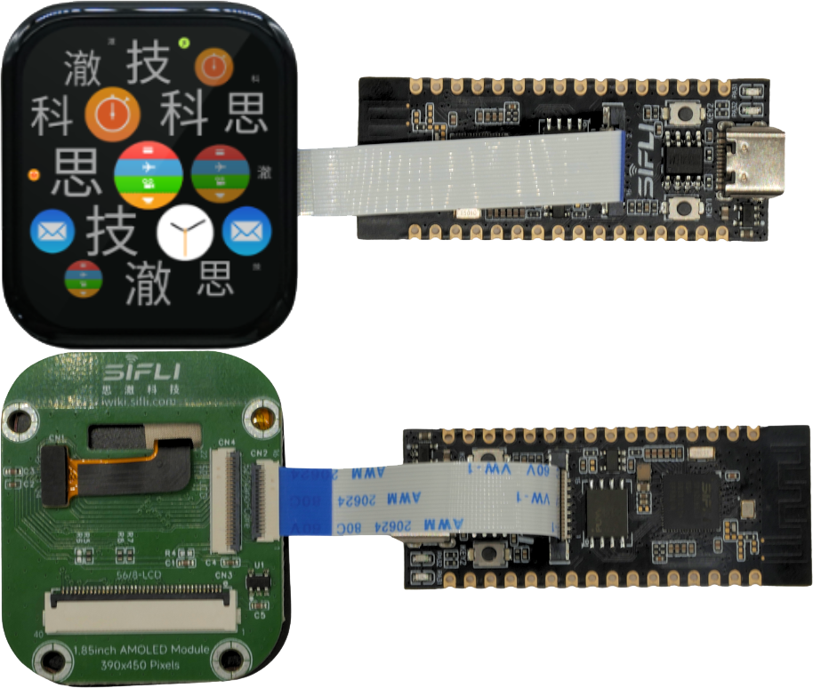
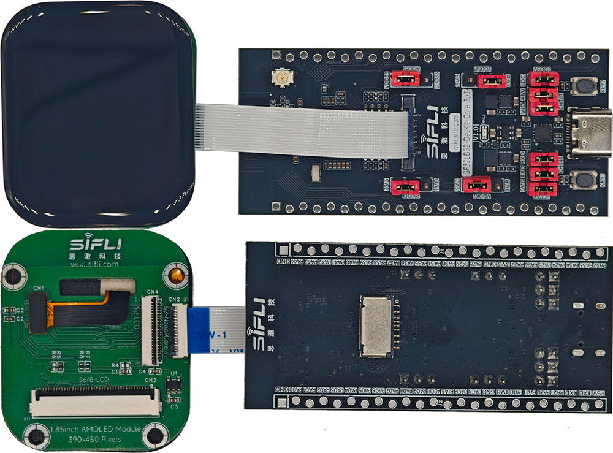
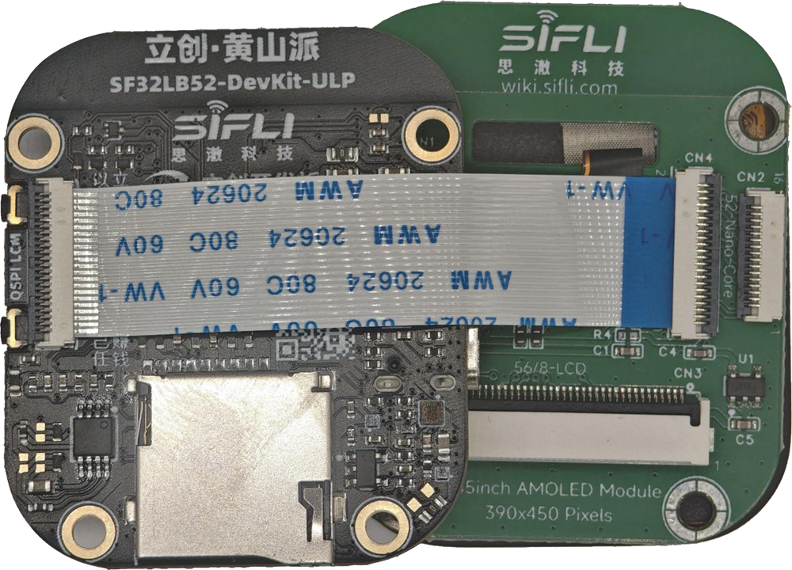
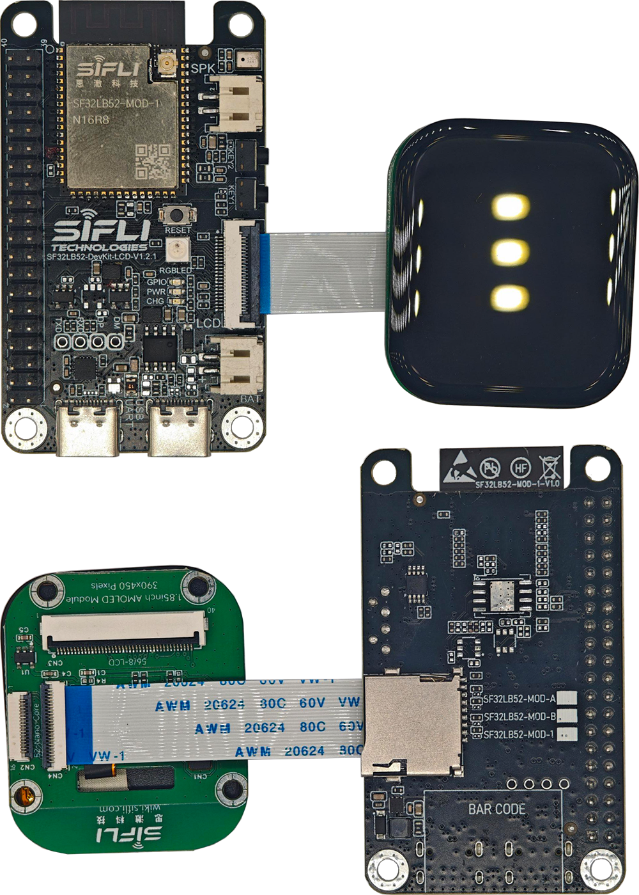
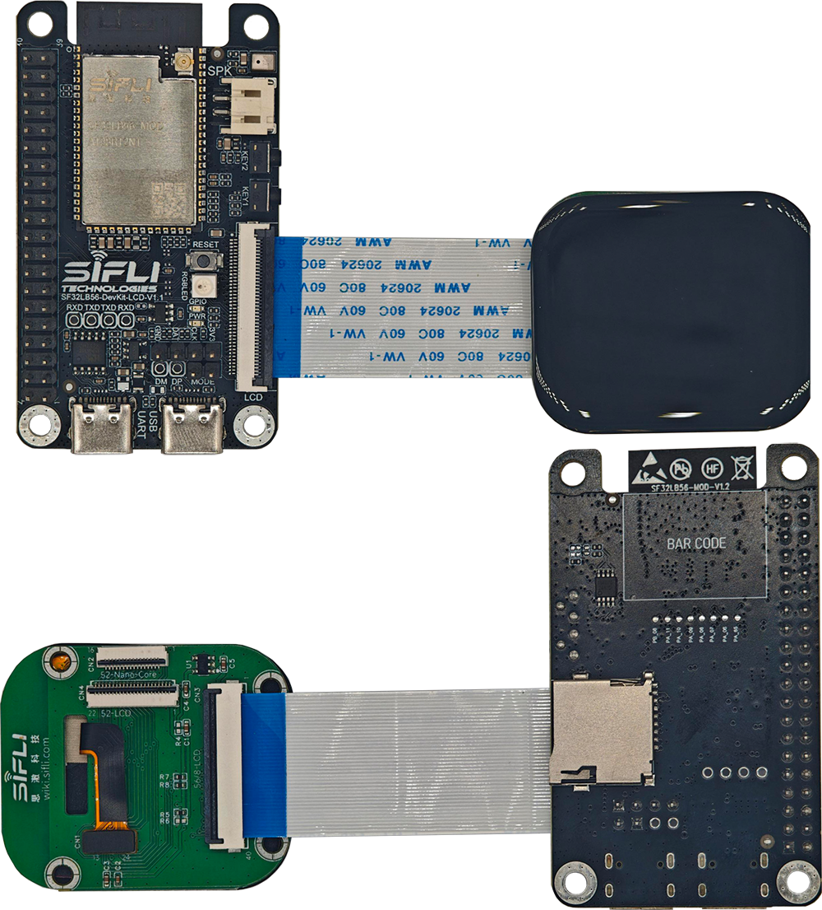
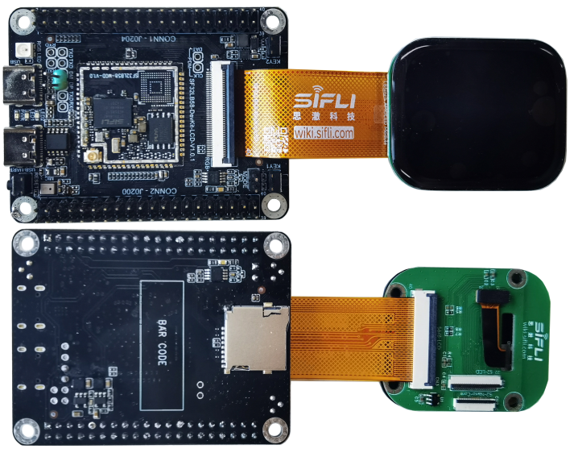

# Sich Dev Board LCM Adapter Board Guide

This document guides you on how to create an adapter board for the Sich Dev Board to debug third-party displays.

## Sich Dev Board Screen Interface Types

- 16p QSPI FPC
  - SF32LB52-DevKit-Nano
  - SF32LB52-DevKit-Core
- 22p QSPI FPC
  - SF32LB52-DevKit-LCD
  - SF32LB52-DevKit-ULP (Lichuang.Huangshan)
- 40p RGB FPC
  - SF32LB56-DevKit-LCD
  - SF32LB58-DevKit-LCD
- 30p MIPI-DSI FPC
  - SF32LB58-DevKit-LCD

## Sich Dev Board Screen Interface Definitions

### 16p QSPI FPC Interface

<div align="center"> 16p FPC Interface Signal Definitions </div>

```{table}
:align: center
|PIN| DevKit FPC CON PIN-Name      | Descriptions  | LCM PIN-Name |
|:--|:---------|:-----------                       |------    |
|1  | GND      | Power Supply Ground               | GND      |  
|2  | LCD_RST  | LCD reset output Active low       | RESX     |
|3  | BL_PWM   | Back light PWM control output     | BL       |
|4  | TE       | Tearing effect input              | TE       |
|5  | QSPI_CS  | LCD QSPI Chip select output       | CSx      | 
|6  | QSPI_CLK | LCD QSPI clock output             | CLK/WRx  |
|7  | QSPI_D0  | LCD QSPI data 0 inout             | D0/RDx   |
|8  | QSPI_D1  | LCD QSPI data 1 output            | D1/DCx   |
|9  | QSPI_D2  | LCD QSPI data 2 output            | D2       |
|10 | QSPI_D3  | LCD QSPI data 3 output            | D3       |
|11 | 3.3V     | DC 3.3V Power Supply              | VCI      | 
|22 | GND      | Power Supply Ground               | GND      | 
|13 | TP_INT   | TP Interrupt signal inout         | TP-INT   |
|14 | TP_SDA   | TP I2C data signal                | TP-SDA   |
|15 | TP_SCL   | TP I2C clock signal               | TP-SCL   |
|16 | TP_RST   | TP Reset                          | TP-RTN   |

```

### 22p QSPI FPC Interface

<div align="center"> 22p FPC Interface Signal Definitions </div>

```{table}
:align: center
|PIN| DevKit FPC CON PIN-Name      | Descriptions  | LCM PIN-Name |
|:--|:---------|:-----------                       |------    |
|1  | LEDK     | LED cathode                       | LEDK     | 
|2  | LEDA     | LED anode                         | LEDA     | 
|3  | D2/DB0   | LCD QSPI data 2,8080 data 0       | DB0      |
|4  | D3/DB1   | LCD QSPI data 3,8080 data 1       | DB1      |
|5  | DB2      | 8080 data 2                       | DB2      |
|6  | DB3      | 8080 data 3                       | DB3      |
|7  | DB4      | 8080 data 4                       | DB4      |
|8  | DB5      | 8080 data 5                       | DB5      |
|9  | DB6      | 8080 data 6                       | DB6      |
|10 | DB7      | 8080 data 7                       | DB7      |
|11 | TE       | Tearing effect input              | TE       |
|12 | LCD_RST  | LCD reset output Active low       | RESX     |
|13 | CLK      | LCD QSPI clock output             | CLK/WRx  |
|14 | D0/RD    | LCD QSPI data 0 inout             | D0/RDx   |
|15 | CS       | LCD QSPI Chip select output       | CSx      | 
|16 | D1/DC    | LCD QSPI data 1 output            | D1/DCx   |
|17 | 3.3V     | DC 3.3V Power Supply              | VCI      | 
|18 | TP_INT   | TP Interrupt signal inout         | TP-INT   |
|19 | TP_SDA   | TP I2C data signal                | TP-SDA   |
|20 | TP_SCL   | TP I2C clock signal               | TP-SCL   |
|21 | TP_RST   | TP Reset                          | TP-RTN   |
|22 | GND      | Power Supply Ground               | GND      |  

```

### 40p RGB FPC Interface

<div align="center"> 40p FPC Interface Signal Definitions  </div>

```{table}
:align: center
|PIN| DevKit FPC CON PIN-Name      | Descriptions  | LCM PIN-Name |
|:--|:---------|:-----------                       |------    |
|1  | 5V       | DC 5V Power Supply                | DC5V     | 
|2  | 5V       | DC 5V Power Supply                | DC5V     | 
|3  | R0       | Red data 0                        | DR0      |
|4  | R1       | Red data 1                        | DR1      |
|5  | R2       | Red data 2                        | DR2      |
|6  | R3       | Red data 3                        | DR3      |
|7  | R4       | Red data 4                        | DR4      |
|8  | R5       | Red data 5                        | DR5      |
|9  | R6       | Red data 6                        | DR6      |
|10 | R7       | Red data 7                        | DR7      |
|11 | GND      | Power Supply Ground               | GND      |
|12 | G0       | Green data 0                      | DG0      |
|13 | G1       | Green data 1                      | DG1      |
|14 | G2       | Green data 2                      | DG2      |
|15 | G3       | Green data 3                      | DG3      |
|16 | G4       | Green data 4                      | DG4      |
|17 | G5       | Green data 5                      | DG5      |
|18 | G6       | Green data 6                      | DG6      |
|19 | G7       | Green data 7                      | DG7      |
|20 | GND      | Power Supply Ground               | GND      |
|21 | B0       | Blue data 0                       | DB0      |
|22 | B1       | Blue data 1                       | DB1      |
|23 | B2       | Blue data 2                       | DB2      |
|24 | B3       | Blue data 3                       | DB3      |
|25 | B4       | Blue data 4                       | DB4      |
|26 | B5       | Blue data 5                       | DB5      |
|27 | B6       | Blue data 6                       | DB6      |
|28 | B7       | Blue data 7                       | DB7      |
|29 | GND      | Power Supply Ground               | GND      |
|30 | CLK      | clock output                      | PCLK     |
|31 | HSYNC    | Horizontal sync signal output     | HSD      |
|32 | VSYNC    | Vertical sync signal output       | VSD      |
|33 | DE       | DE signal when DE mode            | DEN      |
|34 | BL_PWM   | Backlight brightness adjustment signal  | BL-PWM   |
|35 | TP_RST   | TP Reset                          | TP-RTN   |
|36 | TP_SDA   | TP I2C data signal                | TP-SDA   |
|37 | NC       | None connect                      | NC       |
|38 | TP_SCL   | TP I2C clock signal               | TP-SCL   |
|39 | TP_INT   | TP Interrupt signal inout         | TP-INT   |
|40 | LCD_RST  | LCD reset output Active low       | RESX     | 

```

### 30p MIPI-DSI FPC Interface


<div align="center"> 30p FPC Interface Signal Definitions </div>

```{table}
:align: center
|PIN| DevKit FPC CON PIN-Name      | Descriptions  | LCM PIN-Name |
|:--|:---------|:-----------                       |------    |
|1  | GND      | Power Supply Ground               | GND      |
|2  | NC       | None connect                      | NC       | 
|3  | NC       | None connect                      | NC       |
|4  | GND      | Power Supply Ground               | GND      |
|5  | D1P      | MIPI data Lane 1 positive-end output pin   | D1P      |
|6  | D1N      | MIPI data Lane 1 negative-end output pin   | D1N      |
|7  | GND      | Power Supply Ground                | GND      |
|8  | DCKP     | MIPI clock Lane positive-end output pin    | DCKP     |
|9  | DCKN     | MIPI clock Lane negative-end output pin    | DCKN     |
|10 | GND      | Power Supply Ground               | GND      |
|11 | D0P      | MIPI data Lane 0 positive-end output pin   | D0P      |
|12 | D0N      | MIPI data Lane 0 negative-end output pin   | D0N      |
|13 | GND      | Power Supply Ground               | GND      |
|14 | NC       | None connect                      | NC       |
|15 | NC       | None connect                      | NC       |
|16 | GND      | Power Supply Ground               | GND      |
|17 | TE       | Tearing effect input              | TE       |
|18 | LCD_RST  | LCD reset output Active low       | RESX     |
|19 | 1.8V     | I/O interface power supply,1.8V output     | IOVCC    |
|20 | 3.3V     | VCI interface power supply,3.3V output     | VCI      |
|21 | 3.3V     | TP power supply,3.3V output       | TP-VDD   |
|22 | TP_INT   | TP Interrupt signal inout         | TP-INT   |
|23 | TP_SDA   | TP I2C data signal                | TP-SDA   |
|24 | TP_SCL   | TP I2C clock signal               | TP-SCL   |
|25 | TP_RST   | TP Reset                          | TP-RTN   |
|26 | LEDK     | LED cathode                       | LEDK     |
|27 | LEDK     | LED cathode                       | LEDK     |
|28 | NC       | None connect                      | NC       |
|29 | LEDA     | LED anode                         | LEDA     |
|30 | LEDA     | LED anode                         | LEDA     |
```

## LCM Adapter Board Signal Connections

Sicheng Technology's multiple series of development boards use a unified graphical interface to perfectly support common display interfaces such as SPI (SPI, DSPI, and QSPI), 8080, 8-bit parallel e-ink displays, JDI, RGB, and DSI.

### SPI, DSPI, and QSPI Display Interfaces

<div align="center"> 16p FPC interface for connecting SPI, DSPI, and QSPI displays </div>

```{table}
:align: center
|PIN| DevKit FPC CON PIN-Name | 3W-SPI  | 4W-SPI | DSPI  | QSPI  |
|:--|:------------------------|:--------|:-------|:------|:------|
|1  | GND                     | GND     | GND    | GND   | GND   | 
|2  | LCD_RST                 | RESX    | RESX   | RESX  | RESX  |
|3  | BL_PWM                  | BL      | BL     | BL    | BL    |
|4  | TE                      | NC      | NC     | NC    | TE    |
|5  | QSPI_CS                 | CSx     | CSx    | CSx   | CSx   | 
|6  | QSPI_CLK                | CLK     | CLK    | CLK   | CLK   |
|7  | QSPI_D0                 | RDx     | RDx    | D0    | D0    |
|8  | QSPI_D1                 | NC      | DCx    | D1    | D1    |
|9  | QSPI_D2                 | NC      | NC     | NC    | D2    |
|10 | QSPI_D3                 | NC      | NC     | NC    | D3    |
|11 | 3.3V                    | VDD     | VDD    | VDD   | VDD   | 

```
<br>

<div align="center"> 22p FPC interface for connecting SPI, DSPI, and QSPI displays </div>

```{table}
:align: center
|PIN| DevKit FPC CON PIN-Name | 3W-SPI  | 4W-SPI | DSPI  | QSPI  |
|:--|:------------------------|:--------|:-------|:------|:------|
|1  | LEDK                    | LEDK    | LEDK   | LEDK  | LEDK  | 
|2  | LEDA                    | LEDA    | LEDA   | LEDA  | LEDA  | 
|3  | D2/DB0                  | NC      | NC     | NC    | D2    |
|4  | D3/DB1                  | NC      | NC     | NC    | D3    |
|11 | TE                      | NC      | NC     | NC    | TE    |
|12 | LCD_RST                 | RESX    | RESX   | RESX  | RESX  |
|13 | CLK                     | CLK     | CLK    | CLK   | CLK   |
|14 | D0/RD                   | RDx     | RDx    | D0    | D0    |
|15 | CS                      | CSx     | CSx    | CSx   | CSx   |
|16 | D1/DC                   | NC      | DCx    | D1    | D1    | 
|17 | 3.3V                    | VDD     | VDD    | VDD   | VDD   | 

```
<br>

<div align="center"> 56LCD development board 40p FPC interface for connecting SPI, DSPI, and QSPI displays </div>

```{table}
:align: center
|PIN| 56-LCD | 3W-SPI  | 4W-SPI | DSPI  | QSPI  |
|:--|:-------|:--------|:-------|:------|:------|
|1  | 5V     | 5V      | 5V     | 5V    | 5V    | 
|2  | 5V     | 5V      | 5V     | 5V    | 5V    | 
|11 | GND    | GND     | GND    | GND   | GND   | 
|15 | G3     | NC      | NC     | NC    | TE    |
|20 | GND    | GND     | GND    | GND   | GND   | 
|21 | B0     | CSx     | CSx    | CSx   | CSx   |
|22 | B1     | CLK     | CLK    | CLK   | CLK   |
|23 | B2     | RDx     | RDx    | D0    | D0    |
|25 | B4     | NC      | NC     | NC    | D3    |
|26 | B5     | NC      | DCx    | D1    | D1    | 
|27 | B6     | NC      | NC     | NC    | D2    |
|29 | GND    | GND     | GND    | GND   | GND   | 
|40 | LCD_RST| RESX    | RESX   | RESX  | RESX  |

```
<br>

<div align="center"> 58LCD development board 40p FPC interface for connecting SPI, DSPI, and QSPI displays </div>

```{table}
:align: center
|PIN| 58-LCD | 3W-SPI  | 4W-SPI | DSPI  | QSPI  |
|:--|:-------|:--------|:-------|:------|:------|
|1  | 5V     | 5V      | 5V     | 5V    | 5V    | 
|2  | 5V     | 5V      | 5V     | 5V    | 5V    | 
|9  | R6     | NC      | NC     | NC    | TE    |
|10 | R7     | CSx     | CSx    | CSx   | CSx   |
|11 | GND    | GND     | GND    | GND   | GND   | 
|12 | G0     | NC      | NC     | NC    | D3    |
|13 | G1     | CLK     | CLK    | CLK   | CLK   |
|14 | G2     | NC      | NC     | NC    | D2    |
|15 | G3     | NC      | DCx    | D1    | D1    | 
|16 | G4     | RDx     | RDx    | D0    | D0    |
|20 | GND    | GND     | GND    | GND   | GND   | 
|29 | GND    | GND     | GND    | GND   | GND   | 
|40 | LCD_RST| RESX    | RESX   | RESX  | RESX  |

```
### MCU-8080 Interface Screen

The 8-bit MCU-8080 only supports 22p and 40p (56-DevKit-LCD) FPC interfaces, and the connection methods are shown in the following two tables.

<div align="center"> 22p FPC Interface Connection to MCU-8080 Screen </div>

```{table}
:align: center
|PIN| DevKit FPC CON PIN-Name      | Descriptions  | MCU-8080 |
|:--|:---------|:-----------                       |------    |
|1  | LEDK     | LED cathode                       | LEDK     | 
|2  | LEDA     | LED anode                         | LEDA     | 
|3  | D2/DB0   | 8080 data 0                       | DB0      |
|4  | D3/DB1   | 8080 data 1                       | DB1      |
|5  | DB2      | 8080 data 2                       | DB2      |
|6  | DB3      | 8080 data 3                       | DB3      |
|7  | DB4      | 8080 data 4                       | DB4      |
|8  | DB5      | 8080 data 5                       | DB5      |
|9  | DB6      | 8080 data 6                       | DB6      |
|10 | DB7      | 8080 data 7                       | DB7      |
|11 | TE       | Tearing effect input              | TE       |
|12 | LCD_RST  | LCD reset output Active low       | RESX     |
|13 | CLK      | Write enable output               | WRx      |
|14 | D0/RD    | Read enable output                | RDx      |
|15 | CS       | Chip select output                | CSx      | 
|16 | D1/DC    | Display data/command select output| DCx      |
|17 | 3.3V     | DC 3.3V Power Supply              | VCI      | 
|18 | TP_INT   | TP Interrupt signal inout         | TP-INT   |
|19 | TP_SDA   | TP I2C data signal                | TP-SDA   |
|20 | TP_SCL   | TP I2C clock signal               | TP-SCL   |
|21 | TP_RST   | TP Reset                          | TP-RTN   |
|22 | GND      | Power Supply Ground               | GND      |  

```
<br>

<div align="center"> 56LCD Development Board 40p FPC Interface Connection to MCU-8080 Screen </div>

```{table}
:align: center
|PIN| DevKit FPC CON PIN-Name      | Descriptions  | MCU-8080 |
|:--|:---------|:-----------                       |------    |
|1  | 5V       | DC 5V Power Supply                | DC5V     | 
|2  | 5V       | DC 5V Power Supply                | DC5V     | 
|11 | GND      | Power Supply Ground               | GND      |
|12 | G0       | 8080 data 2                       | DB2      |
|13 | G1       | 8080 data 4                       | DB4      |
|14 | G2       | 8080 data 6                       | DB6      |
|15 | G3       | Tearing effect input              | TE       |
|16 | G4       | 8080 data 7                       | DB7      |
|17 | G5       | 8080 data 3                       | DB3      |
|18 | G6       | 8080 data 5                       | DB5      |
|20 | GND      | Power Supply Ground               | GND      |
|21 | B0       | Chip select output                | CSx      |
|22 | B1       | Write enable output               | WRx      |
|23 | B2       | Read enable output                | RDx      |
|25 | B4       | 8080 data 1                       | DB1      |
|26 | B5       | Display data/command select output| DCx      |
|27 | B6       | 8080 data 0                       | DB0      |
|29 | GND      | Power Supply Ground               | GND      |
|40 | LCD_RST  | LCD reset output Active low       | RESX     | 

```
### 8-bit Parallel Interface E-Ink Display

The 8-bit parallel interface e-ink display requires a large number of IO interfaces, which the FPC screen interface of the Siches development board cannot meet.

For detailed design guidelines, please refer to the [8-bit Parallel Interface E-Ink Display Hardware Design Guide](http://wiki.sifli.com).

### JDI Parallel Interface Display

Common interfaces for JDI displays include 24-pin parallel and 10-pin serial interfaces. The pinout for these interfaces is shown in the following two tables.

<div align="center"> 24-pin Parallel JDI Signal Definitions </div>

```{table}
:align: center
|PIN| Signal       | Descriptions                                           | Connect to      |
|:--|:-------------|:-------------------------------------------------------|:----------------|
|1  | LED Cathode 1| Power supply for the LED (Cathode)                     | Onboard circuit | 
|2  | NC           | NC                                                     | NC              | 
|3  | VDD2         | Power supply for the vertical driver and pixel memory  | Onboard circuit |
|4  | JDI_VST      | Start signal for the vertical driver                   | MCU             |
|5  | JDI_ENB      | Write enable signal for the pixel memory               | MCU             |
|6  | FRP          | Liguid crystal driving signal ("Off" pixel)            | MCU             |
|7  | VDD1         | Power supply for the horizontal driver and pixel memory| Onboard circuit |
|8  | JDI_HST      | Start signal for the horizontal driver                 | MCU             |
|9  | JDI_R1       | Red image data (odd pixels)                            | MCU             |
|10 | JDI_G1       | Green image data (odd pixels)                          | MCU             |
|11 | JDI_B1       | Blue image data (odd pixels)                           | MCU             |
|12 | HOUT         | Output from the end of the horizontal shift register   | MCU             |
|13 | VCOM         | Common electrode driving signal                        | MCU             |
|14 | JDI_B2       | Blue image data (odd pixels)                           | MCU             |
|15 | JDI_G2       | Green image data (odd pixels)                          | MCU             |
|16 | JDI_R2       | Red image data (odd pixels)                            | MCU             |
|17 | JDI_HCK      | Shift clock for the horizontal driver                  | MCU             |
|18 | GND          | Ground                                                 | GND             |
|19 | XFRP         | Liguid crystal driving signal ("On" pixel)             | MCU             |
|20 | JDI_XRST     | Reset signal for the horizontal and vertical driver    | MCU             |
|21 | JDI_VCK      | Shift clock for the vertical driver                    | MCU             |
|22 | VOUT         | Output from the end of the vertical shift register     | MCU             |
|23 | LED Anode    | Power supply for the LED (Anode)                       | Onboard circuit |
|24 | LED Cathode 1| Power supply for the LED 2 (Cathode)                   | Onboard circuit |

```
<br>

<div align="center"> 10p Serial Port JDI Signal Definitions </div>

```{table}
:align: center
|PIN| Signal       | Descriptions                                           | Connect to      |
|:--|:-------------|:-------------------------------------------------------|:----------------|
|1  | JDI_SCLK     | Serial clock signal                                    | MCU             | 
|2  | JDI_SI       | Serial data input signal                               | MCU             | 
|3  | JDI_SCS      | Chip select signal                                     | MCU             |
|4  | JDI_EXTCOMIN | COM inversion polarity input                           | MCU             |
|5  | JDI_DISP     | Display ON/OFF switching signal                        | MCU             |
|6  | VDDA         | Power supply for analog                                | Onboard circuit |
|7  | VDD1         | Power supply for logic                                 | Onboard circuit |
|8  | EXTMODE      | COM inversion mode select terminal                     | Onboard circuit |
|9  | VSS          | Logic ground                                           | Onboard circuit |
|10 | VSSA         | Analog ground                                          | Onboard circuit |

```
For detailed design guidelines, please refer to the [JDI Screen Hardware Design Guide](http://wiki.sifli.com).

### RGB(MIPI-DPI) Interface Screen

Only the SF32LB56-DevKit-LCD and SF32LB56-DevKit-LCD development boards support the RGB interface screen. The 40-pin FPC connector pinout on the development board is compatible with the pinout of the Olimex RGB screen, allowing the Olimex RGB screen to be directly connected.

Developers can refer to the 40-pin FPC connector pinout defined above and the Olimex RGB screen documentation to design a display adapter board.

Third-party RGB screen links:
* [7-inch RGB Screen Module 1024*600 (Olimex)](https://detail.tmall.com/item.htm?abbucket=17&id=609758563397&rn=b8068af8e33ece4aa2c043b54a77a153&spm=a1z10.5-b-s.w4011-24686329149.72.255354adb0S1oV)
* [HTM-H070A20-RGB-A01C_V0-1](https://item.taobao.com/item.htm?id=845117257237&spm=a213gs.v2success.0.0.42674831Eg7yk8&skuId=5791172462409)

### MIPI(MIPI-DSI) Interface Screen

As shown in the 30-pin FPC connector signal definitions above, the Siches SF32LB58-DevKit-LCD development board supports up to 2-lane data transmission and can support MIPI screens with a maximum resolution of 1280*800.

The signal connections for the adapter board can be referenced from the 30-pin FPC connector pinout defined above. The development board already integrates a constant current WLED driver circuit, and the backlight LEDK and LEDA can provide a drive current of 100mA, supporting up to 6 parallel LED channels. The Rset resistor on the development board can be adjusted according to the specific LED structure of the screen to meet the actual drive current requirements.

```{important}
1. The IO of the development board is 3.3V level. If the IO level of the LCD adapter board's driver chip is 1.8V, a level shift chip should be used to convert the level.
2. The data and clock lines of QSPI, 8080, and RGB should be connected in series with 22~47 ohm resistors.
3. The I2C signals on the *-Nano and *-Core development boards do not have pull-up resistors, and pull-up resistors need to be added on the screen adapter board.
```
## Backlight Circuit for Adapter Board

### TFT Screen Backlight Circuit

The backlight of a TFT screen is generally composed of series and parallel connected LED light pipes. The number of series and parallel connected LEDs varies depending on the screen size, and the composition of the backlight LEDs is usually introduced in the bare screen specification sheet, which can be used to design the backlight drive circuit.

<div align="center"> Common Backlight Composition for TFT Screens of Different Sizes </div>

```{table}
:align: center
|Size      | LED Structure        | LED VF&IF            | LED drive circuit |
|:---------|:---------------------|:---------------------|:------------------|
|1.3inch   | 2 parallel           | VF=3.3V,IF=15*2mA    | 3.3V DC drive     |
|2.4inch   | 4 parallel           | VF=3.3V,IF=15*4mA    | 3.3V DC drive     | 
|2.8inch   | 4 parallel           | VF=3.3V,IF=15*4mA    | 3.3V DC drive     |
|3.5inch   | 6 parallel           | VF=3.3V,IF=15*6mA    | 3.3V DC drive     |
|4.2inch   | 8 serial             | VF=25.6V,IF=15mA     | Boost WLED driver |
|5.5inch   | 2 serial *7 parallel | VF=6.4V,IF=105mA     | Boost WLED driver |
|7inch     | 3 serial *6 parallel | VF=9.6V,IF=90mA      | Boost WLED driver |
|10.1inch  | 4 serial *7 parallel | VF=12.8V,IF=105mA    | Boost WLED driver |

```
For the backlight drive circuit using 1 LED in parallel, LEDA can be directly connected to a 3.3V power source, and LEDK can be directly connected to GND.

For the backlight drive circuit with multiple LEDs in series, the common 5V and 3.3V are not sufficient to meet the VF voltage requirements, so a boost method must be used to drive the LEDs. It is recommended to use a constant current LED driver chip to drive the backlight LEDs. The current requirement for the backlight is the number of parallel LED paths x 15mA. As shown in the figure below, Rset is used to set the IF drive current, and the chip's FB is typically 200mV, so IF = VFB / Rset is the drive current.

 

<div align="center"> Common Constant Current LED Driver Chip Circuit</div>  <br>  <br>  <br>

### AMOLED Backlight Circuit

AMOLED uses pixel-level self-emitting technology and does not have a backlight source like TFT screens. Brightness adjustment is generally achieved by adjusting the color of the pixels, for example, black does not emit light, and white is the brightest, so there is no need to provide a dedicated PWM signal to adjust the backlight brightness.

AMOLED screens typically come with a PMIC chip that provides VGH, VGL, and VCOM voltages to the panel. The screen driver chip adjusts the corresponding voltage values through a 1W interface. The PMIC's power supply range generally supports 2.7~5.5V, so the 5V or 3.3V from the development board's FPC interface can be used to power the PMIC on the screen.

 

<div align="center"> Common AMOLED PMIC Chip Circuit</div>  <br>  <br>  <br>

### E-Ink Backlight Circuit

The backlight circuit for e-ink screens is relatively complex and uses a dedicated PMIC chip to provide the voltage for various power sources of the e-ink screen.

Commonly used PMIC power chips include TPS65185 and SY7637A.

For detailed design guidelines, please refer to the [8-bit Parallel E-Ink Screen Hardware Design Guide](http://wiki.sifli.com).

## Selection of FPC Flexible Flat Cables

The FPC socket on the Siches development board is of the type that flips up and contacts from below. It is recommended to use an FPC socket that flips up and contacts from both sides when making a breakout board.

Recommended FPC sockets:
- [16p-0.5mm](https://item.szlcsc.com/5909045.html?fromZone=s_s__%2522C5213753%2522&spm=sc.gbn.xh1.zy.n___sc.cidn.hd.ss&lcsc_vid=QAcLUgJQQlQLU1RQEQQKBVEAFAIIU1NQQ1ZZAgJVFVYxVlNTR1FZVFZTTlRfUTsOAxUeFF5JWBIBSRccGwIdBEoFGAxB)
- [22p-0.5mm](https://item.szlcsc.com/5909048.html?fromZone=s_s__%2522C5213756%2522&spm=sc.gbn.xh1.zy.n___sc.gbn.hd.ss&lcsc_vid=QAcLUgJQQlQLU1RQEQQKBVEAFAIIU1NQQ1ZZAgJVFVYxVlNTR1FZVFZTTlRfUTsOAxUeFF5JWBIBSRccGwIdBEoFGAxB)
- [30p-0.5mm](https://item.szlcsc.com/3056931.html?fromZone=s_s__%2522FPC-05FB-30PH20%2522&spm=sc.gbn.xh1.zy.n___sc.it.hd.ss&lcsc_vid=QAcLUgJQQlQLU1RQEQQKBVEAFAIIU1NQQ1ZZAgJVFVYxVlNTR1FZVFZTTlRfUTsOAxUeFF5JWBIBSRccGwIdBEoFGAxB)
- [40p-0.5mm](https://item.szlcsc.com/3056935.html?fromZone=s_s__%2522C2856837%2522&spm=sc.gbn.xh1.zy.n___sc.it.hd.ss&lcsc_vid=QAcLUgJQQlQLU1RQEQQKBVEAFAIIU1NQQ1ZZAgJVFVYxVlNTR1FZVFZTTlRfUTsOAxUeFF5JWBIBSRccGwIdBEoFGAxB)

When using an FPC socket that flips up and contacts from both sides on the breakout board, the FPC flexible flat cables can be chosen in 16p, 22p, 30p, and 40p, with a 0.5mm pitch. The contact points of the FPC can be on the same side or on opposite sides.

 

<div align="center"> Reference FPC Flexible Flat Cable</div>  <br>  <br>  <br>

```{important}
When designing the adapter board, pay attention to the position of pin 1 of the FPC connector. If the adapter board directly references the wiring sequence and pin 1 position of the development board schematic, it will cause signal crossover and make the actual flexible flat cable connection unusable. Solutions include:
1. Modify the position of pin 1 in the PCB library of the connector on the adapter board, and name the pin sequence from the opposite direction, keeping the schematic unchanged.
2. Modify the position of pin 1 in the schematic symbol library of the connector on the adapter board, and name the pin sequence from the opposite direction, keeping the PCB library unchanged.
```

## Sicheng LCM Module

To facilitate developers in using Sicheng Technology's development boards to debug display functions, Sicheng Technology has launched multiple LCM screen modules, including QSPI, RGB, and DSI interfaces. The screen sizes include a 1.85-inch AMOLED 390x450 watch screen, a 4.3-inch TFT 800x480 display, a 7-inch TFT 1024x600 display, and an 8-inch TFT 1280x800 display.

### 1.85-inch AMOLED Module

#### Features

- Size: 1.85-inch rectangular rounded AMOLED watch screen, bare screen model: ZC-A1D85W-010
- Resolution: 390x450
- Brightness: 800 cd/m²
- Display data interface: QSPI
- Touch data interface: I2C
- OLED Driver IC: CO5300AF-01
- Power IC: BV6802W
- TP IC: FT6146-M00

#### Supported Development Board List

- SF32LB52-DevKit-Nano
	- [16p-0.5mm pitch-5cm length-reverse-FPC](https://detail.tmall.com/item.htm?detail_redpacket_pop=true&id=680458377217&ltk2=1750067224011jye1g23u8nodzodf4cqbwg&ns=1&priceTId=213e035a17500671977881818e1d06&query=FPC%2022P%200.5&spm=a21n57.1.hoverItem.4&utparam=%7B%22aplus_abtest%22%3A%229f477038981a766efe59de49bfe14d1d%22%7D&xxc=ad_ztc&sku_properties=148242406%3A56086872)
- SF32LB52-DevKit-Core-****
	- [16p-0.5mm pitch-5cm length-reverse-FPC](https://detail.tmall.com/item.htm?detail_redpacket_pop=true&id=680458377217&ltk2=1750067224011jye1g23u8nodzodf4cqbwg&ns=1&priceTId=213e035a17500671977881818e1d06&query=FPC%2022P%200.5&spm=a21n57.1.hoverItem.4&utparam=%7B%22aplus_abtest%22%3A%229f477038981a766efe59de49bfe14d1d%22%7D&xxc=ad_ztc&sku_properties=148242406%3A56086872)
- SF32LB52-DevKit-ULP (Lichuang. Huangshan School)
	- [22p-0.5mm pitch-5cm length-reverse-FPC](https://detail.tmall.com/item.htm?detail_redpacket_pop=true&id=680458377217&ltk2=1750067224011jye1g23u8nodzodf4cqbwg&ns=1&priceTId=213e035a17500671977881818e1d06&query=FPC%2022P%200.5&spm=a21n57.1.hoverItem.4&utparam=%7B%22aplus_abtest%22%3A%229f477038981a766efe59de49bfe14d1d%22%7D&xxc=ad_ztc&skuId=5623637216836)
- SF32LB52-DevKit-LCD
	- [22p-0.5mm pitch-5cm length-reverse-FPC](https://detail.tmall.com/item.htm?detail_redpacket_pop=true&id=680458377217&ltk2=1750067224011jye1g23u8nodzodf4cqbwg&ns=1&priceTId=213e035a17500671977881818e1d06&query=FPC%2022P%200.5&spm=a21n57.1.hoverItem.4&utparam=%7B%22aplus_abtest%22%3A%229f477038981a766efe59de49bfe14d1d%22%7D&xxc=ad_ztc&skuId=5623637216836)
- SF32LB56-DevKit-LCD
	- [40p-0.5mm pitch-5cm length-reverse-FPC](https://detail.tmall.com/item.htm?detail_redpacket_pop=true&id=680458377217&ltk2=1750067224011jye1g23u8nodzodf4cqbwg&ns=1&priceTId=213e035a17500671977881818e1d06&query=FPC%2022P%200.5&skuId=5791728402036&spm=a21n57.1.hoverItem.4&utparam=%7B%22aplus_abtest%22%3A%229f477038981a766efe59de49bfe14d1d%22%7D&xxc=ad_ztc)
- SF32LB58-DevKit-LCD
	- [40p-0.5mm pitch-5cm length-forward-FPC](http://10.23.10.196:19000/web-file/hardware/files/documentation/FPC_40p_to_1p85-AMOLED-Module%E8%BD%AF%E6%8E%92%E7%BA%BF_2025-07-04.epro?)

#### Installation Methods for Development Boards and Displays

 

<div align="center"> Installation method for SF32LB52-DevKit-Nano development board</div>  <br>  <br>  <br>

 

<div align="center"> Installation method for SF32LB52-DevKit-Core-**** development board</div>  <br>  <br>  <br>

 

<div align="center"> Installation Method for SF32LB52-DevKit-ULP (Lichuang.Huangshan) Development Board</div>  <br>  <br>  <br>

 

<div align="center"> Installation Method for SF32LB52-DevKit-LCD Development Board</div>  <br>  <br>  <br>

 

<div align="center"> Installation Method for SF32LB56-DevKit-LCD Development Board</div>  <br>  <br>  <br>

 

<div align="center"> Installation Method for SF32LB58-DevKit-LCD Development Board</div>  <br>  <br>  <br>

[Adapter Board Reference Design Data](https://downloads.sifli.com/hardware/files/documentation/SFLCM1p85-A-390-450-Adapter_V1.0.epro?)

### 4.3inch TFT Module
(Coming Soon)
### 7inch TFT Module
(Coming Soon)
### 8inch TFT Module
(Coming Soon)