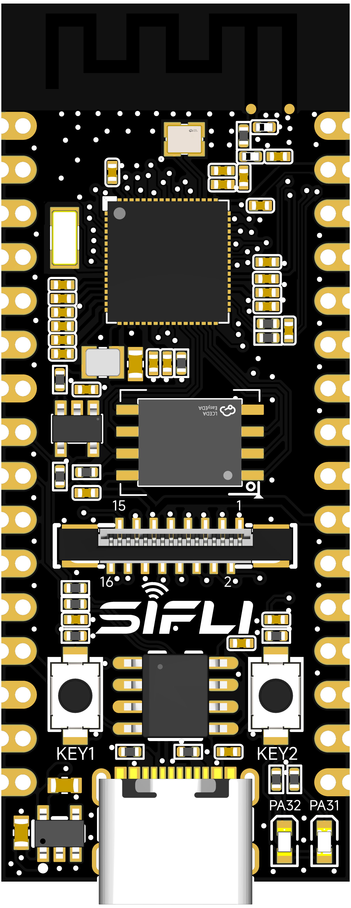
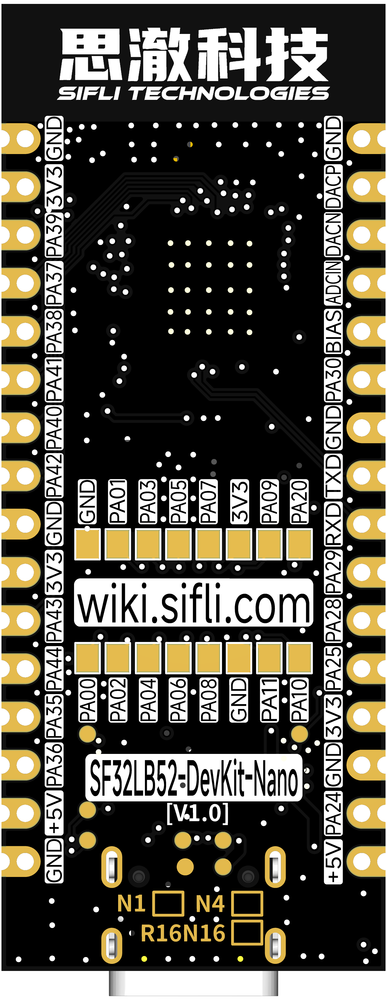
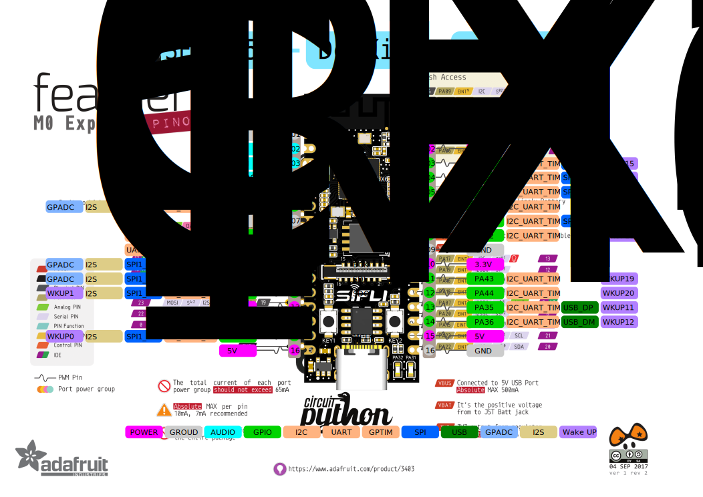
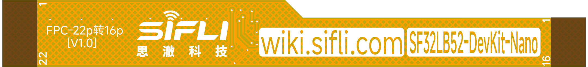

# SF32LB52-DevKit-Nano Development Board User Guide

## Development Board Version Information:

* *-N4-V1.0.0: Configured with SF32LB52BU56 chip (4MB internal NOR Flash), current version
* *-R16N16-V1.0.0: Configured with SF32LB52JUD6 chip (16MB internal PSRAM) + 16MB NOR Flash, current version

## 1. Development Board Overview

The SF32LB52-DevKit-Nano is a development board based on the SiChes Technology SF32LB52BU56/SF32LB52JUD6 chips, with dimensions of only 21mm*51mm. The board edge is designed with邮票孔 (postage stamp holes), making it convenient for developers to use in various scenarios. The development board supports GPIO, UART, I2C, SPI, LCD, I2S, GPADC, PWM, and analog audio input/output.

 

<div align="center"> Front View of the Development Board </div>  <br>  <br>  <br>

 

<div align="center"> Back View of the Development Board </div>  <br>  <br>  <br>

## 2. Feature List
This development board has the following features:
1. Board Type:
    - -N4: Equipped with the SF32LB52BU56 chip, configured as follows:
    
        - Integrated configuration:
            - 4MB NOR Flash, interface frequency 96MHz
        
    - -R16N16: Equipped with the SF32LB52JUD6 chip, configured as follows:
    
        - Integrated configuration:
            - 16MB OPI-PSRAM, interface frequency 144MHz
        
        - Equipped with 128Mb QSPI-NOR Flash, interface frequency 72MHz, STR mode 
2. Crystals
    - 48MHz crystal
    - 32.768KHz crystal
3. Antenna
    - Equipped with a PCBA antenna
4. GPIO
    - LCC half-hole supports 17 GPIOs
    - LGA pins support 13 GPIOs
5. UART-I2C-GPTIM
    - 3x UART
    - 4x I2C
    - 2x GPTIM
    - All GPIOs support configuration as UART, I2C, and GPTIM
6. SPI
    - 2x SPI
7. GPADC
    - 3x GPADC
9. Display
    - FPC16P, 0.5mm pitch connector for display expansion
    - SPI/DSPI/Quad SPI, supports DDR mode QSPI display interface
    - Supports I2C interface touch screen
    - Supports 1.85 inch AMOLED screen via 16p to 22p ribbon cable
10. Audio
    - Supports audio ADC input, can connect to analog or silicon microphones
    - Supports PDM digital microphone input
    - Analog audio output, requires external Class-AB/D audio PA to drive the speaker
    - All interfaces are exposed through LCC half-holes
11. USB
    - Type C-UART interface, equipped with CH340N serial chip, for program download and software debugging, can supply power
    - USB interface, supports USB2.0 FS, exposed through LCC half-holes
12. Buttons
    - 1x Function button
    - 1x Power button, supports long press (10s) reset function
13. LEDs
    - 2x LEDs, GPIO controlled
14. Power
    - Powered via USB Type-C interface
    - Equipped with VBUS 5V to 3.3V LDO chip
    - Equipped with power switch, can be controlled by the RTS# pin of CH340N to reset the MCU

## 3. Pinout Definition

 

<div align="center"> Front Pinout of the Development Board (Click to Enlarge) </div>  <br>  <br>  <br>

 

<div align="center"> Back Pinout of the Development Board (Click to Enlarge) </div>  <br>  <br>  <br>

### Detailed Pin Description

The table below provides a detailed description of the SF32LB52-DevKit-Nano development board pins.

<div align="center"> LEFT LCC (J1) Pin Description Table </div>

```{table}

|Pin| Pin Name            | Reset Default and Alternate Functions | Pull-up/Pull-down |
|:--|:--------------------|:--------------------------------------|:------------------|
|1  | GND                 | Ground                                |                   |
|2  | DACP                | Analog audio output signal            |                   |
|3  | DACN                | Analog audio output signal            |                   |
|4  | MIC_ADC             | MIC input signal                      |                   |
|5  | MIC_BIAS            | MIC bias voltage                      |                   |
|6  | PA30                | **PA30**, UART, I2C, GPTIM, I2S1_LRCK, and GPADC2 | PD                |
|7  | GND                 | Ground                                |                   |
|8  | PA19                | **UART0_TXD**, Debug and Download Port, PA19, SWCLK, I2C, GPTIM | None              |
|9  | PA18                | **UART0_RXD**, Debug and Download Port, PA18, SWDIO, I2C, GPTIM | PU                |
|10 | PA29                | **PA29**, UART, I2C, GPTIM, SPI1_CS, I2S1_BCK, and GPADC1 | PD                |
|11 | PA28                | **PA28**, UART, I2C, GPTIM, SPI1_CLK, I2S1_SDI, and GPADC0 | PD                |
|12 | PA25                | **PA25**, UART, I2C, GPTIM, SPI1_DI, I2S1_SDO, and WKUP1 | PD                |
|13 | 3.3V                | 3.3V power supply, can be used as 3.3V input when USB TypeC is not inserted; can be used as 3.3V output when USB TypeC is inserted |                   |
|14 | GND                 | Ground                                |                   |
|15 | PA24                | **PA24**, UART, I2C, GPTIM, SPI1_DIO, I2S1_MCLK, and WKUP0 | PD                |
|16 | 5V                  | 5V power supply, can be used as 5V input when USB TypeC is not inserted; can be used as 5V output when USB TypeC is inserted |                   |

```

<div align="center"> RIGHT LCC (J2) Pin Description Table </div>

```{table}

|Pin| Pin Name            | Reset Default and Alternate Functions | Pull-up/Pull-down |
|:--|:--------------------|:--------------------------------------|:------------------|
|1  | GND                 | Ground                                |                   |
|2  | 3.3V                | 3.3V power supply, can be used as 3.3V input when USB TypeC is not inserted; can be used as 3.3V output when USB TypeC is inserted |                   |
|3  | PA39                | **PA39**, UART, I2C, GPTIM, SPI2_CLK, and WKUP15 | PU                |
|4  | PA37                | **PA37**, UART, I2C, GPTIM, SPI2_DIO, and WKUP13 | PD                |
|5  | PA38                | **PA38**, UART, I2C, GPTIM, SPI2_DI, and WKUP14 | PD                |
|6  | PA41                | **PA41**, UART, I2C, GPTIM, and WKUP17 | PU                |
|7  | PA40                | **PA40**, UART, I2C, GPTIM, SPI2_CS, and WKUP16 | PU                |
|8  | PA42                | **PA42**, UART, I2C, GPTIM, and WKUP18 | PU                |
|9  | GND                 | Ground                                |                   |
|10 | 3.3V                | 3.3V power supply, can be used as 3.3V input when USB TypeC is not inserted; can be used as 3.3V output when USB TypeC is inserted |                   |
|11 | PA43                | **PA43**, UART, I2C, GPTIM, and WKUP19 | PD                |
|12 | PA44                | **PA44**, UART, I2C, GPTIM, and WKUP20 | PD                |
|13 | PA35                | **PA35**, UART, I2C, GPTIM, USB_DP, and WKUP11 | PD                |
|14 | PA36                | **PA36**, UART, I2C, GPTIM, USB_DM, and WKUP12 | PD                |
|15 | 5V                  | 5V power supply, can be used as 5V input when USB TypeC is not inserted; can be used as 5V output when USB TypeC is inserted |                   |
|16 | GND                 | Ground                                |                   |

```


### 16p QSPI Line Sequence FPC Interface Definition

<div align="center"> 16p FPC Interface Signal Definition </div>

```{table}

|Pin|	Pin Name           	   |   Reset Default and Alternate Functions  | Pull-up/Pull-down |
|:--|:-----------------------|:-----------|------|
|1  | GND    | Ground                        |      | 
|2  | PA_00 | **PA00**、UART、I2C、GPTIM and LCD_RST   | PD   |
|3  | PA_01 | **PA01**、UART、I2C、GPTIM and BL_PWM    | PD   |
|4  | PA_02 | **PA02**、UART、I2C、GPTIM、LCD_TE and I2S1_MCLK   | PD   |
|5  | PA_03 | **PA03**、UART、I2C、GPTIM、LCD_CS and I2S1_SDO    | PU   | 
|6  | PA_04 | **PA04**、UART、I2C、GPTIM、LCD_CLK and I2S1_SDI   | PD   |
|7  | PA_05 | **PA05**、UART、I2C、GPTIM、LCD_D0 and I2S1_BCK    | PD   |
|8  | PA_06 | **PA06**、UART、I2C、GPTIM、LCD_D1 and I2S1_LRCK   | PD   |
|9  | PA_07 | **PA07**、UART、I2C、GPTIM、LCD_D2 and PDM1_CLK    | PD   |
|10 | PA_08 | **PA08**、UART、I2C、GPTIM、LCD_D3 and PDM1_DAT    | PD   |
|11 | 3.3V  | 3.3V Power Output                  |      | 
|12 | GND    | Ground                        |      | 
|13 | PA_09 | **PA09**、UART、I2C、GPTIM and CTP_INT    | PD   |
|14 | PA_11 | **PA11**、UART、I2C、GPTIM and CTP_SDA    | PU   |
|15 | PA_20 | **PA20**、UART、I2C、GPTIM and CTP_SCL    | PD   |
|16 | PA_10 | **PA10**、UART、I2C、GPTIM and CTP_RST    | PD   |

```

## 4. Function Introduction

### Power Supply Description

The development board supports the following 3 power supply methods:

- USB Type-C interface power supply (default)
- 5V and GND pin power supply
- 3.3V and GND pin power supply

The recommended power supply method during debugging: USB Type-C interface power supply.

### LED Control

The development board has 2 LEDs. Developers can refer to the following table for controlling the corresponding pins.

<div align="center"> LED Signal Control Table  </div>

```{table}

|LED Number|	Corresponding GPIO           	   |   Description  |
|:--|:-----------------------|:-----------|
|LED1  | PA31    | Low level to light up                 |
|LED2  | PA32    | Low level to light up                 |
```

### External Flash

The development board is equipped with a Flash (depending on the board model, some are soldered, some are not), supporting the following types:

- SPI NOR Flash, WSON8-8x6mm or WSON8-6x5mm
- SPI NAND Flash, WSON8-8x6mm
- SD NAND Flash, WSON8-8x6mm

<div align="center"> Flash Signal Definition  </div>

```{table}

|Pin|	Pin Name           	   |   Reset Default and Alternate Functions  | Pull-up/Pull-down |
|:--|:-----------------------|:-----------|------|
|1  | PA_12 | **PA12**、UART、I2C、GPTIM、MPI2_CS and SD1_D2    | PU   |
|2  | PA_13 | **PA13**、UART、I2C、GPTIM、MPI2_D1 and SD1_D3    | PD   |
|3  | PA_14 | **PA14**、UART、I2C、GPTIM、MPI2_D2 and SD1_CLK   | PD   |
|4  | PA_15 | **PA15**、UART、I2C、GPTIM、MPI2_D0 and SD1_CMD   | PD   |
|5  | PA_16 | **PA16**、UART、I2C、GPTIM、MPI2_CLK and SD1_D0    | PD   | 
|6  | PA_17 | **PA17**、UART、I2C、GPTIM、MPI2_D3 and SD1_D1    | PD   |
```

<div align="center"> Board Model and Flash Information Correspondence Table  </div>

```{table}

|Board Model|	MCU Package Specification           	   |   On-board Specification  |
|:--|:-----------------------|:-----------|
|SF32LB52-DevKit-Nano-N4      | 4MB SPI NOR Flash | None    |
|SF32LB52-DevKit-Nano-R16N16  | 16MB OPI PSRAM | 16MB SPI NOR Flash    |
```

### Buttons

The development board has 2 buttons that require software-defined functions. KEY1 supports hardware long-press reset for 10 seconds. Developers can refer to the following table for controlling the corresponding pins.

<div align="center"> Button Signal Control Table  </div>

```{table}

|Button Number|	Corresponding GPIO           	   |   Description  |
|:--|:-----------------------|:-----------|
|KEY1  | PA34    | High level active, supports long-press reset for 10 seconds |
|KEY2  | PA33    | High level active                |
```

### Download and Debugging

Connect the USB-to-UART port with a USB cable, open the firmware download tool from Sicheng Technology, and select the corresponding COM port and program.
1. Download Mode
    - Check the BOOT option, power on, and enter the download mode after booting to complete the program download.
2. Software Development Mode
    - Uncheck the BOOT option, power on, and enter the serial log print mode after booting to enter the software debugging mode.
3. Board Reset
    - Reset the MCU through the RTS# pin of the CH340N controlled by the host computer tool.

**For more details, please refer to&emsp;[Firmware Burn Tool Impeller](烧录工具)**


### LCD Display Interface

The development board supports QSPI interface LCD screens, with a vertical 16p-0.5pitch FPC connector that flips up and down to make contact.
Please refer to the signal line sequence defined above. If the line sequence is different, a transition board is required for testing. Please refer to the *SF32LB52-DevKit-LCD Transition Board Manufacturing Guide*.

The screen for the Huángshān series can be directly connected using a 22p to 16p ribbon cable.

 

<div align="center"> FPC Transition Ribbon Cable </div>  <br>  <br>  <br>

[Reference Materials](https://downloads.sifli.com/hardware/files/documentation/ProPrj_FPC_22p_to_16p%E8%BD%AF%E6%8E%92%E7%BA%BF.epro?) 

### Audio Expansion

The development board requires external microphones and differential audio amplifiers.

- [Electret Microphone Board Reference](https://item.taobao.com/item.htm?id=891546819215&pisk=g3ttX5NYqXciCTxOKdu3mg2lmpDkD2vNvCJ7msfglBdphC1GiNsbdM6A3l1f5K6fDBOmQ1vj_IKAOG_2SsfGMip2wFhoq0vwQiSSZbmk_owrJgP_f1Ncdk6RDONxuxqpQiSjZbmoqdJwNSry3l6fdvBG3tsfGl1IpT6lcl_bfyNCT6sbfO__Ry6fhSZ1GIwIAtX8crZf5D_CnTIfGI6jpp1Fhi1j9jlAOR10DUgQANrLBEqbcHBORwv11a7-n97T3dfac9-NB05WC6Ebm14gj8ppIfEyKG-MwTAiAldJhL8fJnFIws-pdhTXL5hAXpAw2Gt-6lXhv1Q5d3M0z6xdsItORYqRoMtlPGTn8fbcXts1zek4SsTXe3IMsXrfsUpB9ax3tujWzBKAPgsr_3xJmCVlwt4tpna4uN6E_bxHypqU4QWdZAnYur7ELo49mA44uw-Pp_DtWrzV8X5..&spm=a21xtw.29178619.product_shelf.3.34d33772zuSkO1&skuId=5740404937614)
- [MEMS Microphone Board Reference](https://detail.tmall.com/item.htm?id=814534179060&ns=1&pisk=g53Se-TCQTXSM7adOuA4GovZEnUEB2t27L5IsfeFzMU-hJej6Q2yx3DIcvH048eyZyZKpYHQxQ2UpJME90oW7FloZy4KRd8w7X1wqAH79uIJ9ZF_9IPRFEzkwy4pQd8w7bcu-A0VoWbdDSe0NMFKpuIvk72Y9gUKp-EY65W8JvHpksF3TaILvWIvG7VCJge8prBYaWILpvUpGje09yF-pyhh41NBV8cWwk_r8dRlbJwfJw3bMJDrGUSQ3cNSvRGRYjGxlNq7Bbef8d9YgqwQnVp2cjDr2YPmdF9bWcDjRlUBPOVSDfaYUPLRkzuowcEKWpjKNzwSpkiDCNP7zmZsP0AhHbHaFcUoT19rGkFsrzo2FNetfbnai2JcyJixv4ru-TpQKqGxyDsrmNy1kVsCGlbLGgAXGMjHuIb4G5SWKTq8i7Z2GI6-xObd8iRXGTnu2SV77IOfevf..&priceTId=213e054e17429838198525727ea59a&skuId=5678321102126&spm=a21n57.1.hoverItem.1&utparam=%7B%22aplus_abtest%22%3A%22730abba11fa183522caa7f9e2e59074c%22%7D&xxc=ad_ztc)
- [Audio Amplifier Board Reference](https://item.taobao.com/item.htm?id=12602258834&pisk=g0_-U1DKS-2uuY_Ji_rm-FD4yzVGJofPMT5s-pvoAtBAOT9kKBTBGjOptDiCOpYdp9BpEHwyrwBvzZjo-L2yJ66MWR2gSPfPaF8QIRD0Vn9v5CJINvAShrTH9SVDsp5Pae8QIR4gS_kKdDDKAB9QMrOBteOBRHNYlBpjPBgWOxNv3KgWN3tWhrOkwQiCd3tjcBRHO0gIRKOX3BTBd9TQMs92OfrQpKGWK2I_ccEC086nR2_vwntcNLGv-ZOJCdCSx2gIYQKJC_94QNZ2_n1evwlEJnf5b9R1FYwpLZCfPG6_n0v5XBCGvOUs8IS5eZtdoWzNMUIAkUb7Lc5cMLt9oiq4EHYReGJwVoyVChCGjU7_HV9dVTWebw2ZzL1C_NSMWzHwwi19kgyOSNQhEAv9t0FARDoeVIyzIZjt6G1omIpgwynEYnPq-0Q3ZDoe0NRvI7E-YD-43&spm=a21xtw.29178619.product_shelf.2.654a20dbhEwOYd)

### PCB Component Location Query

<a href="../../_static/SF32LB52-DevKit-Nano-%E8%BE%85%E5%8A%A9%E7%84%8A%E6%8E%A5.html">SF32LB52-DevKit-Nano-PCB</a> 

## 5. Sample Acquisition

Retail samples and small batches can be purchased directly from [Taobao](https://sifli.taobao.com/). For bulk orders, please email sales@sifli.com or contact customer service on Taobao to obtain sales contact information.
Participating in open-source projects can allow you to apply for free samples. You can join QQ group 674699679 for communication.

## 6. Related Documents

- [SF32LB52x Chip Technical Specification](https://downloads.sifli.com/silicon/DS0052-SF32LB52x-芯片技术规格书%20V2p4.pdf?)
- [SF32LB52x User Manual](https://downloads.sifli.com/silicon/UM0052-SF32LB52x-用户手册%20V0p3.pdf?)
- [SF32LB52-DevKit-Nano Design Drawings](https://downloads.sifli.com/hardware/files/documentation/SF32LB52-DevKit-Nano_V1.0.0.zip?)
- [SF32LB52-DevKit-LCD Adapter Board Manufacturing Guide](SF32LB52-DevKit-LCD-Adapter)