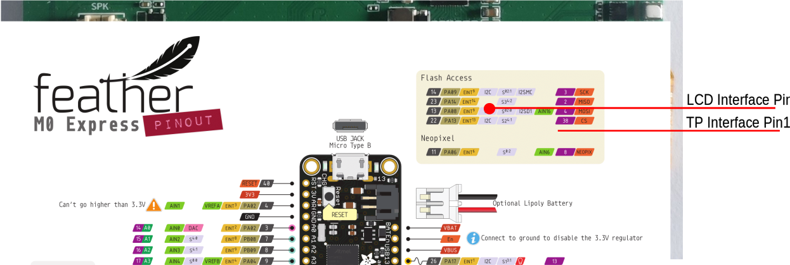
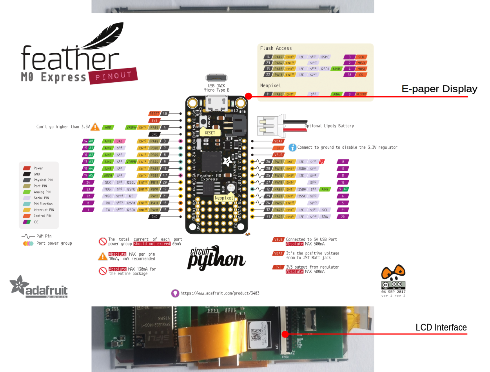
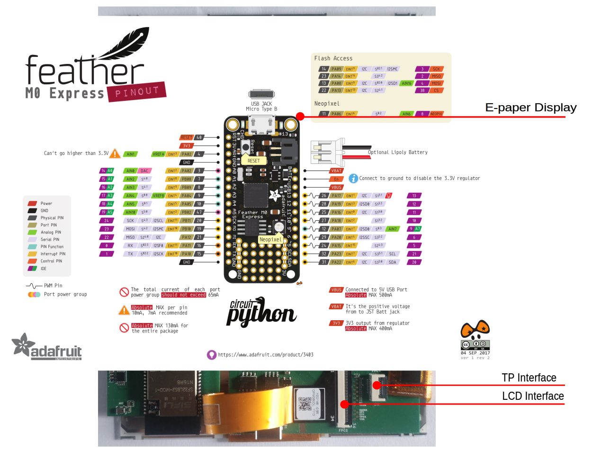
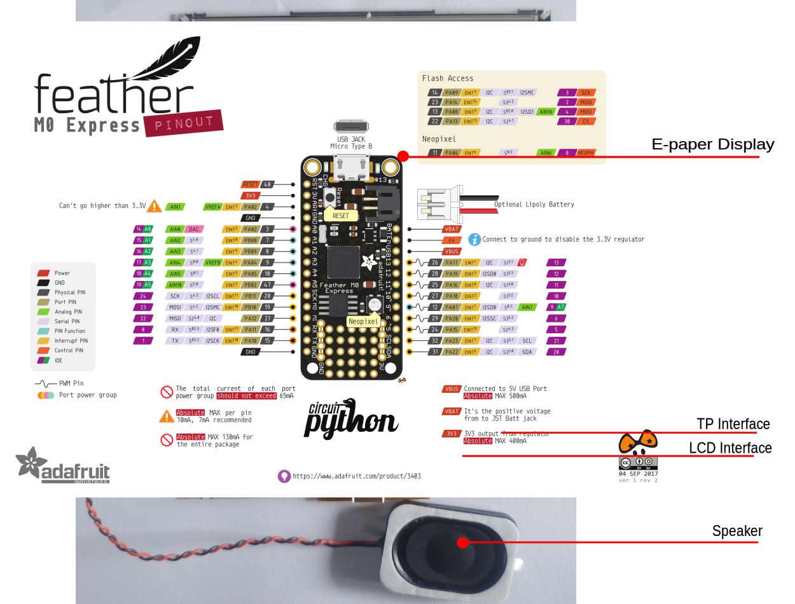
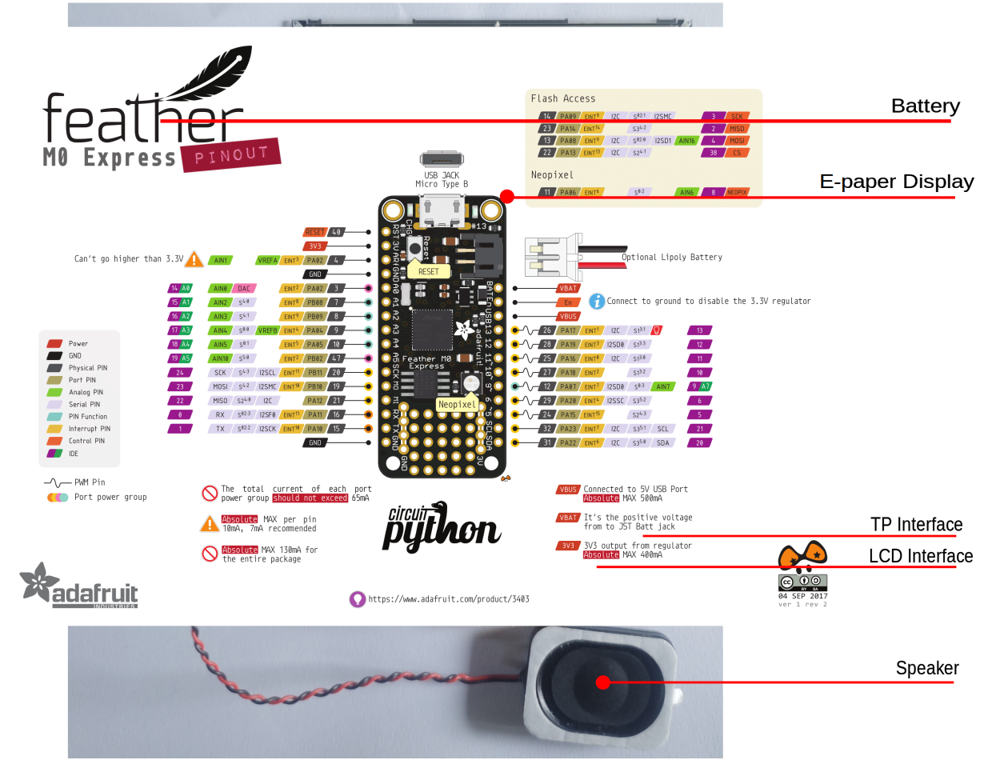
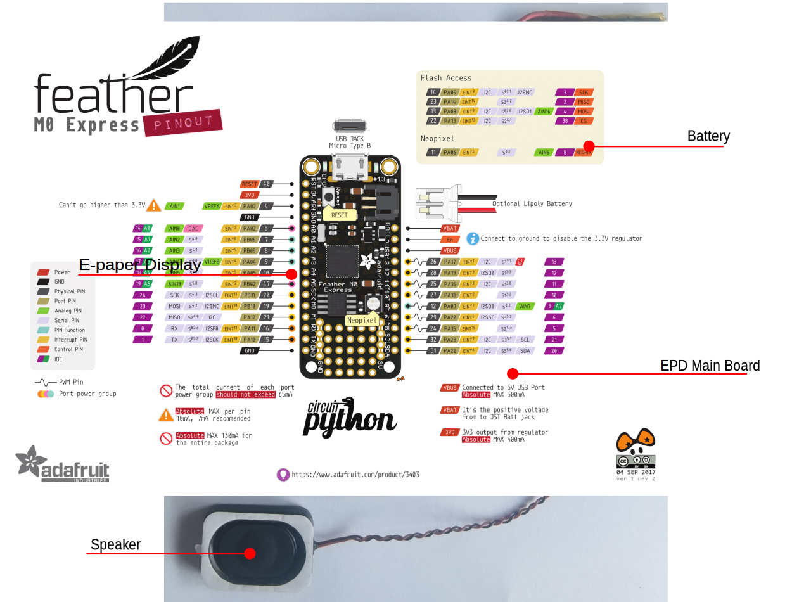

# SF32LB52-OED-6'-EPD开发板使用指南

## 开发板概述

SF32LB52-OED-6'-EPD是一款基于SF32LB52-MOD-1模组的电子墨水屏开发板，支持`758 x 1024 (XGA) 6寸墨水屏`，同时支持`模拟MIC输入`、`模拟音频输出`、`SDIO接口`、`TF卡`、`A+G Sensor` 和`H+T Sensor`等，为开发者提供丰富的硬件接口资源，可以用于开发各种电子墨水屏显示应用，帮助开发者简化硬件开发过程和缩短产品的上市时间。

 

<div align="center"> 开发板实物正面照 </div>  <br>  <br>

 

<div align="center"> 开发板实物背面照 </div>  <br>  <br>

### 特性列表
该开发板具有以下特性：
1.	模组：板载SF32LB52-MOD-1-N16R8模组，模组配置如下：
    - 标配SF32LB525UC6芯片，内置合封配置为：
        - 8MB OPI-PSRAM，接口频率144MHz
    - 128Mb QSPI-NOR Flash，接口频率72MHz，STR模式
    - 48MHz晶体
    - 32.768KHz晶体
    - 板载天线，或IPEX天线座，通过0欧电阻选择，默认为板载天线
    - 射频匹配网络及其它阻容感器件
2.	专用屏幕接口
    - 8bit EPD并行驱动接口，通过34pin FPC引出
    - 支持I2C接口的触摸屏
3.	音频
    - 支持模拟MIC输入
    - 模拟音频输出，板载Class-D音频PA
4.	Sensor
    - 支持6轴Accelerometer+Gyroscope Sensor
    - 支持Humidity+Temperature Sensor
5.	USB
    - Type C接口，支持板载USB转串口芯片，实现程序下载和软件DEBUG，可供电
6.	Charger
    - 板载1A线性Charger，搭载1500mAh锂电池，支持充电器插入检测。
7.	SD卡
    - 支持采用SPI接口的TF卡，板载Micro SD卡插槽

### 功能框图

 

<div align="center"> 开发板功能框图 </div>  <br>  <br>

### 组件介绍

SF32LB52-OED-6'-EPD开发板的主板是整个套件的核心，板载SF32LB52-MOD-1-N16R8模组，并提供34P FPC连接座连接EPD显示屏。

 

<div align="center"> 功能说明 </div>  <br>  <br>

## 墨水屏套件组装介绍

### 显示屏安装

墨水屏的LCD和TP是分开的FPC，分别通过FPC安装到开发板上，屏幕和TP的FPC柔性排线易损，安装时要小心。FPC安装如下图所示：

 

<div align="center"> 墨水屏显示和触摸接口安装照片 </div>  <br>  <br>

6寸墨水屏安装到开发板上：

 

<div align="center"> 墨水屏套件显示屏接口安装照片 </div>  <br>  <br>

 

<div align="center"> 墨水屏套件触摸屏接口安装照片 </div>  <br>  <br>

### 喇叭安装

开发板支持MX1.25类型2P端子接口的喇叭，喇叭推荐选3Ω/4W规格的，安装如下图所示：

 

<div align="center"> 墨水屏套件喇叭安装照片 </div>  <br>  <br>

### 电池安装

开发板支持MX1.25类型2P端子接口的锂电池，锂电池推荐1500mAh规格的，安装如下图所示：

 

<div align="center"> 墨水屏套件电池安装照片 </div>  <br>  <br>

### 墨水屏套件整机

显示屏、喇叭和电池安装到开发板上，正确安装后如下图所示：

 

<div align="center"> 墨水屏套件整机照片 </div>  <br>  <br>

## 应用程序开发

本节主要介绍硬件和软件的设置方法，以及烧录固件至开发板以及开发应用程序的说明。

### 必备硬件

- 1x SF32LB52-OED-6'-EPD（含SF32LB52-MOD-1-N16R8模组）
- 1x LCD模组(奥翼6寸墨水屏 OPM060DA)
- 1x 1000mAh ~ 1500mAh锂电池
- 1x USB2.0数据线（标准A型转Type-C型）
- 1x 电脑（Windows、Linux或macOS）

```{note}
1. 开发板使用时，必须插着电池，USB线只用于充电和串口调试或程序烧录。
2. 请确保使用适当的USB数据线，部分数据线仅可用于充电，无法用于数据传输和程序烧录。
```
### 可选硬件

- 1x扬声器
- 1x TF Card

### 硬件设置

准备好开发板，加载第一个示例应用程序：

1.	正确连接墨水屏屏幕排线到开发板上；
2.  正确连接电池到开发板上；
3.	打开思澈的SifliTrace工具软件，选择正确的COM口；
4.	插入USB数据线，分别连接PC与开发板的USB to UART端口；
5.	LCD屏幕亮起，可以用手指与触摸屏进行交互。

硬件设置完成，接下来可以进行软件设置。


### 软件设置

SF32LB52-OED-6'-EPD的开发板，如何快速设置开发环境，请参考软件相关文档。 

## 硬件参考

本节提供关于开发板硬件的更多信息。

### GPIO分配列表

下表为 SF32LB52-MOD-1-N16R8 模组管脚的 GPIO 分配列表，用于控制开发板的特定组件或功能。

```{table}
:width: 100%
:align: center
:name: SF32LB52-MOD-1-N16R8-GPIO-LIST

|管脚|	管脚名称     |   功能                                     |
|:--|:-------------|:------------------------------------------|
|1  | GND          | 接地                                       |
|2  | PA_44        | TPS_PWRCOM，EPD电源VCOM使能                 |
|3  | PA_43        | EDP_D7，EPD信号                            |
|4  | PA_42        | EDP_D6，EPD信号                            |
|5  | PA_23        | XTAL32K_XO，默认NC                         |
|6  | PA_22        | XTAL32K_XI，默认NC                         |
|7  | PA_41        | EDP_D5，EPD信号                            |
|8  | PA_40        | EDP_D4，EPD信号                            |
|9  | PA_39        | EDP_D3，EPD信号                            |
|10 | PA_38        | TPS_PWRUP，EPD电源上电控制                  |
|11 | PA_37        | EDP_D2，EPD信号                            |
|12 | PA_36        | SENSOR_SDA， 传感器I2C SDA接口              |
|13 | PA_35        | SENSOR_SCL， 传感器I2C SCL接口              |
|14 | PA_34        | HOME和长按复位按键                           |
|15 | PA_33        | ADC功能按键，支持两个KEY                     |
|16 | PA_32        | CTP_3.3V电源使能                            |
|17 | VDD33_VOUT2  | 3.3V电源输出（默认无输出，需要软件配置后才有输出）|
|18 | PA_24        | SPI1_DIO，SD卡接口信号                      |
|19 | PA_25        | SPI1_DI，SD卡接口信号                       |
|20 | PA_26        | CHG_STATUS，充电状态指示信号                 |
|21 | PA_27        | SD卡_CD信号，LED                            |
|22 | PA_28        | SPI1_CLK，SD卡接口信号                      |
|23 | PA_29        | SPI1_CS，SD卡接口信号                       |
|24 | PA_30        | CTP_INT，触摸屏中断信号                      |
|25 | PA_31        | CTP_RST，触摸屏复位信号                      |
|26 | GND          | 接地                                       |
|27 | VSYS         | 3.2~4.7V电源输入                            |
|28 | PA_20        | TPS_WAKEUP，EPD电源唤醒信号                 |
|29 | PA_19        | DB_UART_TXD, 程序下载及软件调试接口          |
|30 | PA_18        | DB_UART_RXD, 程序下载及软件调试接口          |
|31 | PA_11        | TPS_SDA，触摸屏I2C                         |
|32 | PA_10        | TPS_SCL，触摸屏I2C                         |
|33 | AU_DAC1P_OUT | 模拟音频输出信号                            |
|34 | AU_DAC1N_OUT | 模拟音频输出信号                            |
|35 | GND          | 接地                                       |
|36 | MIC_BIAS     | MIC偏置电压                                |
|37 | MIC_ADC_IN   | MIC输入信号                                |
|38 | PA_09        | EDP_LE，EPD信号                            |
|39 | PA_08        | EDP_D1，EPD信号                            |
|40 | PA_07        | EDP_D0，EPD信号                            |
|41 | PA_06        | EDP_SPH，EPD信号                           |
|42 | PA_05        | EDP_OE，EPD信号                            |
|43 | PA_04        | EDP_CLK，EPD信号                           |
|44 | PA_03        | EDP_GMODE，EPD信号                         |
|45 | PA_02        | AU_PA_EN，音频功放使能信号                  |
|46 | PA_01        | EDP_CPV，EPD信号                           |
|47 | PA_00        | EDP_STV，EPD信号                           |
|48 | GND          | 接地                                       |
|49 | GND          | 接地                                       |
|50 | GND          | 接地                                       |
|51 | GND          | 接地                                       |
|52 | GND          | 接地                                       |
|53 | GND          | 接地                                       |
|54 | GND          | 接地                                       |
|55 | GND          | 接地                                       |
|56 | GND          | 接地                                       |
|57 | GND          | 接地                                       |
|58 | GND          | 接地                                       |
|58 | GND          | 接地                                       |
|60 | GND          | 接地                                       |
|61 | VBATS        | 电池电压检测输入                            |
|62 | NC           | NO Connection                             |
|63 | PA_15        | NO Connection                             |
|64 | PA_16        | NO Connection                             |
|65 | PA_17        | NO Connection                             |
|66 | PA_14        | NO Connection                             |
|67 | PA_13        | NO Connection                             |
|68 | PA_12        | NO Connection                             |

```

```{important}
1. SF32LB52-OED-6'-EPD适配SF32LB52-MOD-1模组。
2. 模组17管脚是3.3V电源输出（默认无输出，需要软件配置后才有输出）。
3. 模组27管脚VBAT未3.2~4.7V电源输入。
4. SF32LB-MOD-1模组的VBAT电源的开机阈值设置为3.58V，关机阈值设置为3.48V。非电池类供电应用，推荐VBAT供3.8V电压。
5. 模组62管脚为NC。
6. 模组63~68管脚默认为模组内部连接Nor Flash，开发板无法使用；若要使用SDIO接口，请选择无flash版本的模组。
```

### 34p 墨水屏LCD FPC接口定义


```{table}
:width: 100%
:align: center
:name: EPD-FPC-FPC2-GPIO-LIST

|管脚|管脚名称  |   功能                                |
|:--|:--------|:------------------------------------ |
|1  | VNEG    | Negative power supply source driver  |                   
|2  | VGL     | Negative power supply gate driver    |
|3  | VSS     | Ground                               |
|4  | NC      | NO Connection                        |
|5  | NC      | NO Connection                        |
|6  | VDD     | Digital power supply drivers         |
|7  | VSS     | Ground                               | 
|8  | CLK     | Clock source driver                  |
|9  | VSS     | Ground                               |
|10 | LE      | Latch enable source driver           |      
|11 | OE      | Output enable source driver          |        
|12 | SPH     | Start pulse source driver            |
|13 | D0      | Data signal source driver            |
|14 | D1      | Data signal source driver            |
|15 | D2      | Data signal source driver            |
|16 | D3      | Data signal source driver            |
|17 | D4      | Data signal source driver            |
|18 | D5      | Data signal source driver            |
|19 | D6      | Data signal source driver            |
|20 | D7      | Data signal source driver            |
|21 | VCOM    | Common connection                    |
|22 | NC      | NO Connection                        |
|23 | NC      | NO Connection                        |
|24 | NC      | NO Connection                        |
|25 | NC      | NO Connection                        |
|26 | VSS     | Ground                               |
|27 | GMODE   | Output mode selection gate driver    |
|28 | CPV     | Shift clock input                    |
|29 | STV     | Start pulse gate driver              |
|30 | NC      | NO Connection                        |
|31 | VBORDER | Border connection,NO Connection      | 
|32 | VSS     | Ground                               |
|33 | VPOS    | Positive power supply source driver  |
|34 | VGH     | Positive power supply gate driver    |

```

### 8p CTP FPC接口定义


```{table}
:width: 100%
:align: center
:name: CTP-FPC-FPC4-GPIO-LIST

|管脚|管脚名称  |   功能             |
|:--|:--------|:----------------- |
|1  | VSS     | Ground            |      
|2  | VSS     | Ground            |
|3  | PA_11   | CTP I2C_SDA       |
|4  | PA_10   | CTP I2C_SCL       |
|5  | PA_29   | CTP INT           |
|6  | PA_31   | CTP RTN           |
|7  | NC      | NO Connection     |
|8  | VDD_3V3 | 3.3V Power output |

```
### 供电说明

开发板只支持电池供电，连接器H20接锂电池供电。

USB-TypeC的VBUS只是用来充电，不能给板子直接供电运行。


### 硬件设置选项

通过USB-to-UART端口连上USB线，打开思澈科技的程序下载工具，选取相应的COM口和程序。
1.  下载模式
- 勾选BOOT项，上电，开机后进入下载模式，就可以完成程序的下载。
2.  软件开发模式
- 去掉BOOT项，上电，开机后进入串口log打印模式，便进入软件调试模式。

**具体请参考&emsp;[固件烧录工具 Impeller](https://wiki.sifli.com/tools/%E7%83%A7%E5%BD%95%E5%B7%A5%E5%85%B7.html)**

### 充电及电池选型

开发板集成了LP4056HSPF 线性充电芯片，最大支持1A充电电流，默认设置为1000mA恒流充电电流。

电池推荐选取1500mAh单芯聚合物锂电池，电池接口为MX1.25mm连接器，极性请参考开发板上电池座丝印。

### LCD显示屏接口

开发板支持并口墨水屏，接插件为34p-0.5pitch FPC，双侧触点上下接触。
信号线序请参考上文定义。
* 已支持屏型号：奥翼 OPM060DA 

### 音频接口

开发板板载MEMS MIC和音频功放芯片。
* 支持板上mic的音频信号输入。
* 支持外接喇叭（最大支持3W/4欧姆），喇叭接插件规格（MX1.25mm连接器）。

## 样品获取

[墨水屏开发板超低功耗电子书电子桌牌](https://item.taobao.com/item.htm?abbucket=9&id=982738503582&mi_id=0000pDNIjo0Pj_29fkc7ifmF6Y_pBCqY3EgQwpwU71DKMNE&ns=1&skuId=6110372370746&spm=a21n57.1.hoverItem.1&utparam=%7B%22aplus_abtest%22%3A%223c87588d55ca363f5f070236babd24db%22%7D&xxc=taobaoSearch)

## 相关文档

- [DS5203-SF32LB52-MOD-1技术规格书](index)
- [SF32LB52-OED-6'-EPD设计图纸](https://downloads.sifli.com/hardware/files/documentation/ProPrj_SF32-OED-6'-EPD-V120.epro?)
- [SiFli EPD_Reader开源软件](https://github.com/OpenSiFli/EPD_Reader)
