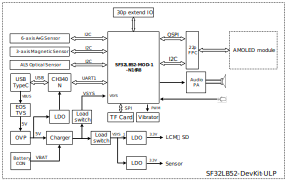
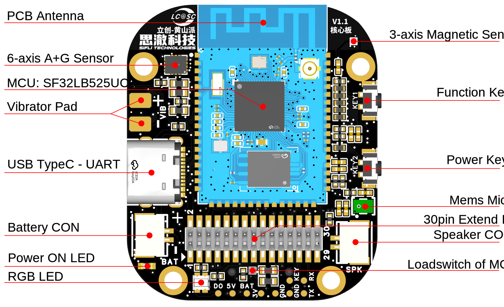
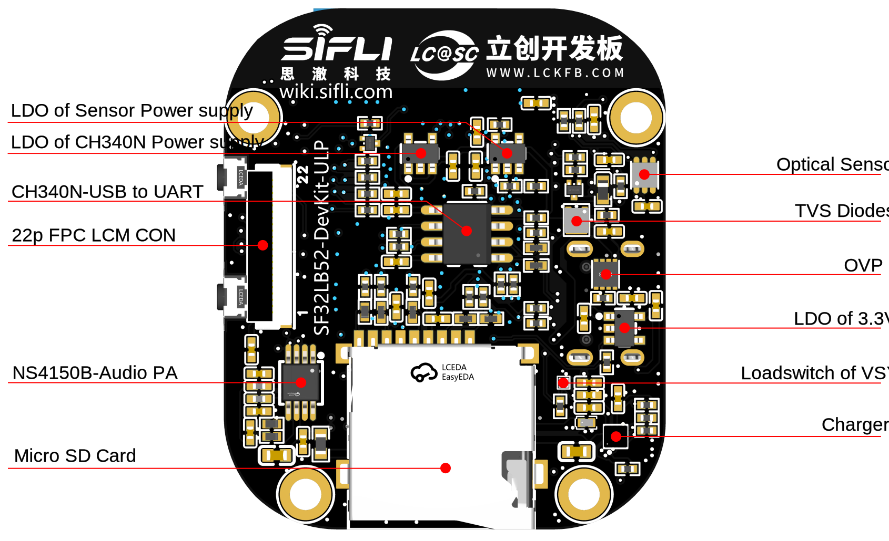
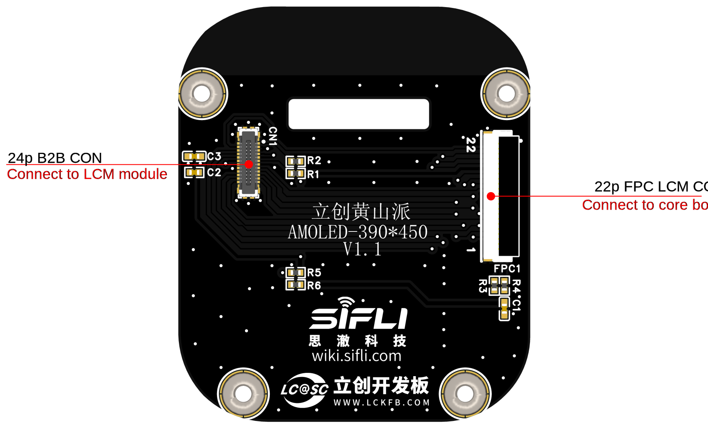
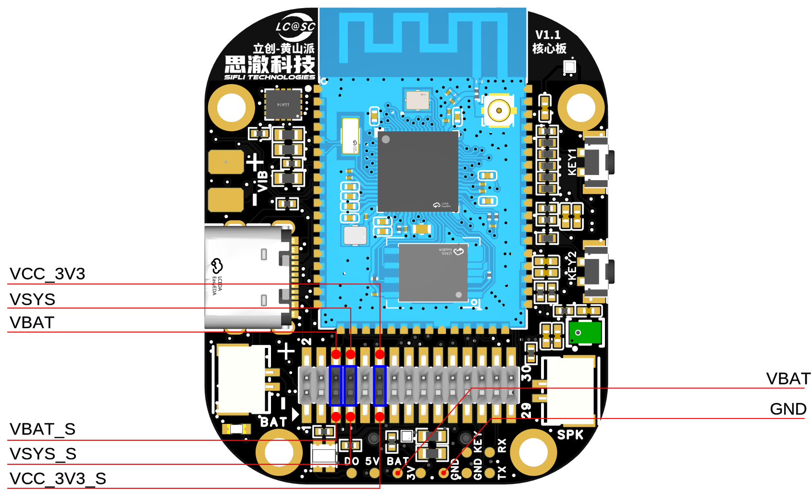

# SF32LB32-ULP Development Board User Guide

(This development board is currently for internal testing and will be modified and improved before being released to the public)

## Development Board Version Information:

* V1.0.0: Uses the SF32LB52-MOD-1 module, current version

## Development Board Overview

The LIT Huangshan is a development board based on the SF32LB52-MOD-1 module from Sichai Technology, and it also serves as a prototype for smart watches and bands. Developers can use this development board to design prototypes for smart watches and bands.

<!--  

<div align="center"> Front view of the development board </div>  <br>  <br>  <br>

 

<div align="center"> Back view of the development board </div>  <br>  <br>  <br> -->


### Feature List
This development board has the following features:
1. Module: Equipped with the SF32LB52x-MOD-1-N16R8 module based on the SF32LB52x chip, with the following configuration:
    - Standard SF32LB525UC6 chip, with integrated configuration:
        - 8MB OPI-PSRAM, interface frequency 144MHz
    - 128Mb QSPI-NOR Flash, interface frequency 72MHz, STR mode
    - 48MHz crystal
    - 32.768KHz crystal
    - On-board PCB antenna
2. Display
    - AMOLED screen, model: ZC-A1D85W-010
    - 1.85 inches
    - 390*450
    - 800 cd/m2
    - Quad SPI display interface
    - OLED Driver IC: CO5300AF-01
    - Power IC: BV6802W
    - TP IC: FT6146-M00
3. Dedicated Screen Interface
    - SPI/DSPI/Quad SPI, supports DDR mode QSPI, exposed through a 22-pin FPC and a 40-pin header
    - Supports I2C interface touch screen
4. Audio
    - On-board integrated Mems MIC
    - Analog audio output, on-board Class-D audio PA
    - External GH-1.25mm connector for 3W/4Ω or 2W/8Ω speaker
5. USB
    - Type C-UART interface, on-board CH340N serial chip for program download and software debugging, can supply power
    - USB interface, supports USB2.0 FS, exposed through a 30-pin header
6. SD Card
    - Supports SPI interface TF card, on-board Micro SD card slot
7. Buttons
    - 1x function button
    - 1x power button, supports long press 10s reset function
8. RGB-LED
    - 1x RGB-LED, SK6812MINI-HS, GPIO controlled
9. Motor
    - On-board motor driver circuit, reserved external motor soldering points
10. Sensors
    - Six-axis IMU-Inertial Measurement Unit, LSM6DS3TR-C
    - Three-axis geomagnetic sensor, MMC5603NJ
    - Ambient light sensor, LTR-303ALS-01
11. Power
    - OVP, SY5320
    - Charger, SY6103
    - Loadswitch, LP5240HVF
    - LDO, ETA5055V330DS2F
    - Supports external GH1.25mm positive sequence connector for lithium battery, maximum charging voltage 4.5V, maximum charging current 500mA
12. 30-pin Function Expansion Interface
    - 2x15-pin, 1.27mm pitch header
    - Expands GPIO
    - Supports power consumption testing


### Functional Block Diagram

 

<div align="center"> Functional block diagram of the development board </div>  <br>  <br>  <br>


### Component Introduction

The SF32LB52 Huangshan development board includes:

    - Core board 
    - Screen board 
    - Battery 
    - Speaker 

 

<div align="center"> Front view of the core board (click to enlarge) </div>  <br>  <br>  <br>

 

<div align="center"> Back view of the core board (click to enlarge) </div>  <br>  <br>  <br>

 

<div align="center"> Back view of the screen board (click to enlarge) </div>  <br>  <br>  <br>

 

<div align="center"> Core board jumper cap and test point description (click to enlarge) </div>  <br>  <br>  <br>


## Application Development

This section mainly introduces the methods for setting up hardware and software, as well as how to flash firmware to the development board and develop applications.

### Required Hardware

- 1 x SF32LB52 Huangshan (with SF32LB52X-MOD-1-N16R8 module)
- 1 x USB2.0 data cable (Standard A to Type-C)
- 1 x Computer (Windows, Linux, or macOS)

```{note}
1. If you need to use both UART debugging and the USB interface, you will need two USB2.0 data cables;
2. Ensure you use an appropriate USB data cable, as some cables are only suitable for charging and cannot be used for data transmission or firmware flashing.
```
### Optional Hardware

- 1x Speaker
- 1x TF Card
- 1x Lithium battery greater than 450mAh

### Hardware Setup

Prepare the development board and load the first example application:

1. Open the SifliTrace tool software from Sichai, and select the correct COM port;
2. Insert the USB data cable, connecting the PC to the USB to UART port of the development board;
3. The LCD screen will light up, and you can interact with the touch screen using your fingers.

Hardware setup is complete, and you can now proceed to the software setup.


### Software Setup

For a quick setup of the development environment, please refer to the relevant software documentation.

## Hardware Reference

This section provides more information about the development board hardware.

### GPIO Allocation List

The table below lists the GPIO allocations for the SF32LB52-MOD-1-N16R8 module pins, used to control specific components or functions of the development board.

<div align="center"> Signal definition table </div>

```{table}

|Pin| Pin Name | Function |
|:--|:-----------------------|:-----------|
|1 | GND   | Ground                     |
|2 | PA_44 | VBUS_DET, charger insertion detection   |
|3 | PA_43 | KEY2                    |
|4 | PA_42 | Audio_PA_EN             |
|5 | PA_23 | XTAL32K_XO, default NC       |
|6 | PA_22 | XTAL32K_XI, default NC       |
|7 | PA_41 | Touchscreen interrupt INT             |
|8 | PA_40 | Sensor I2C1_SCL           |
|9 | PA_39 | Sensor I2C1_SDA            |
|10 | PA_38 | VSYS to VSYS_1 switch control   |
|11 | PA_37 | Touchscreen I2C_SCL            |
|12 | PA_36 | USB_DM                  |
|13 | PA_35 | USB_DP                  |
|14 | PA_34 | HOME and long press reset button        |
|15 | PA_33 | Touchscreen I2C_SDA            |
|16 | PA_32 | RGB LED                 |
|17 | VDD33_VOUT2 | 3.3V power output       |
|18 | PA_24 | SPI1_DIO, SD card interface signal    |
|19 | PA_25 | SPI1_DI, SD card interface signal     |
|20 | PA_26 | VSYS_1 to VCC33 switch control  |
|21 | PA_27 | SD card_CD signal              |
|22 | PA_28 | SPI1_CLK, SD card interface signal    |
|23 | PA_29 | SPI1_CS, SD card interface signal     |
|24 | PA_30 | VSYS_1 to HR3V3 switch control  |
|25 | PA_31 | Sensor INT1               |
|26 | GND | Ground                       |
|27 | VBAT  | 3.7~4.7V power input          |
|28 | PA_20 | Vibrator PWM            |
|29 | PA_19 | DB_UART_TXD, program download and software debugging interface |
|30 | PA_18 | DB_UART_RXD, program download and software debugging interface |
|31 | PA_11 | Charger I2C0_SDA        |
|32 | PA_10 | Charger I2C0_SCL        |
|33 | AU_DAC1P_OUT | Analog audio output signal    |
|34 | AU_DAC1N_OUT | Analog audio output signal    |
|35 | GND | Ground                       |
|36 | MIC_BIAS | MIC bias voltage            |
|37 | MIC_ADC_IN | MIC input signal          |
|38 | PA_09 | Touchscreen interrupt RST             |
|39 | PA_08 | QSPI D3, LCD interface signal |
|40 | PA_07 | QSPI D2, LCD interface signal |
|41 | PA_06 | QSPI D1, E-Paper DC, LCD interface signal |
|42 | PA_05 | QSPI D0, E-Paper SDI, LCD interface signal |
|43 | PA_04 | QSPI CLK, E-Paper SCLK, LCD interface signal |
|44 | PA_03 | QSPI CS, E-Paper CS, LCD interface signal |
|45 | PA_02 | QSPI TE, E-Paper BUSY, LCD interface signal |
|46 | PA_01 | BL PWM, LCD interface signal      |
|47 | PA_00 | RSTB, LCD interface signal        |
|48 | GND | Ground                      |
|49 | GND | Ground                      |
|50 | GND | Ground                      |
|51 | GND | Ground                      |
|52 | GND | Ground                      |
|53 | GND | Ground                      |
|54 | GND | Ground                      |
|55 | GND | Ground                      |
|56 | GND | Ground                      |
|57 | GND | Ground                      |
|58 | GND | Ground                      |
|58 | GND | Ground                      |
|60 | GND | Ground                      |
|61 | VBATS | Battery voltage detection input          |
|62 | NC  | NC                        |
|63 | PA_15 | MPI2_D0, SD1_CMD        |
|64 | PA_16 | MPI2_CLK, SD1_D0        |
|65 | PA_17 | MPI2_D3, SD1_D1         |
|66 | PA_14 | MPI2_D2, SD1_CLK        |
|67 | PA_13 | MPI2_D1, SD1_D3         |
|68 | PA_12 | MPI2_CS, SD1_D2         |

```

```{important}
1. The SF32LB52-DevKit-ULP is compatible with the SF32LB-MOD-1 module.
2. Pin 17 VDD33_VOUT of the module is a 3.3V power output, which is disabled by default and requires software to enable the internal LDO.
3. Pin 27 VBAT of the module is a power input pin that can be directly connected to a lithium battery. When not using battery power and switching to constant voltage power, the input range is 3.7V~4.7V, with a recommended connection of 3.8V.
4. The power-on threshold for VBAT of the SF32LB-MOD-1-N16R8 module is set to 3.58V, and the power-off threshold is set to 3.48V.
5. Pins 62~68 of the SF32LB-MOD-1-N16R8 module are connected to the internal Nor Flash by default and cannot be used on the development board; if you need to use the SDIO interface, choose a module without the flash.
```

### 30P Pin Header Interface Definition

<div align="center"> 30p Pin Header Interface Definition </div>

```{table}

|Pin|	Pin Name           	   |   Function  |
|:--|:-----------------------|:-----------|
|1  | USB_VBUS_5V    | USB TypeC VBUS                     
|2  | USB_VBUS_5V    | USB TypeC VBUS     
|3  | GND     | Ground 
|4  | GND     | Ground 
|5  | VBAT_S  | VBAT power output, needs to be shorted to VBAT 
|6  | VBAT    | VBAT power input, needs to be shorted to VBAT_S 
|7  | VSYS_S  | VSYS power output, needs to be shorted to VSYS 
|8  | VSYS    | VSYS power input, needs to be shorted to VSYS_S  
|9  | GND     | Ground 
|10 | GND     | Ground                 
|11 | VCC_3V3_S  | VCC_3V3 power output, needs to be shorted to VCC_3V3                   
|12 | VCC_3V3    | VCC_3V3 power input, needs to be shorted to VCC_3V3_S 
|13 | PA_36   | Default USB_DM 
|14 | PB_39   | Default I2C1_SDA         
|15 | PA_35   | Default USB_DP             
|16 | PA_40   | Default I2C1_SCL 
|17 | PA_32   | Default RGN-LED data, can be used as GPIO 
|18 | PA_30   | Default Sensor power control, using as GPIO will affect PA39 and PA40
|19 | PA_29   | Default SPI1_CS, can be used as GPIO, the TF card on the core board cannot be inserted when extended 
|20 | PA_24   | Default SPI1_DO, can be used as GPIO, the TF card on the core board cannot be inserted when extended  
|21 | PA_28   | Default SPI1_CLK, can be used as GPIO, the TF card on the core board cannot be inserted when extended  
|22 | PA_25   | Default SPI1_DI, can be used as GPIO, the TF card on the core board cannot be inserted when extended 
|23 | PA_27   | Default SD_DET, can be used as GPIO, the TF card on the core board cannot be inserted when extended
|24 | PA_20   | Default VIB PWM, can be used as GPIO, the motor on the core board cannot be soldered when extended 
|25 | PA_19   | Debug UART_TXD 
|26 | PA_34   | KEY1, for power on/off and long press 10s reset 
|27 | PA_18   | Debug UART_RXD 
|28 | PA_43   | KEY2, function button 
|29 | PA_11   | Default I2C0_SDA
|30 | PA_10   | Default I2C0_SCL 
```

```{important}
1. Pins 1 and 2 of the 30p header are connected to the VBUS input of USB-TypeC. When the development board is connected to a USB cable, these pins can serve as 5V output; when the development board is not connected to a USB cable, these pins can serve as 5V input.
2. Pin 5 of the 30p header is connected to the battery holder on the development board and is not connected to the downstream. During operation, a jumper cap is needed to short VBAT_S and VBAT.
3. Pin 6 of the 30p header is connected to the VBAT pin of the charging IC on the development board and the VBAT_S pin of the module. VBAT_S and VBAT are disconnected here to facilitate the insertion of an ammeter for power consumption testing.
4. Pin 7 of the 30p header is connected to the VSYS pin of the charging IC on the development board and is not connected to the downstream. During operation, a jumper cap is needed to short VSYS_S and VSYS.
5. Pin 8 of the 30p header is connected to the VSYS pin of the module and other VSYS input pins. VSYS_S and VSYS are disconnected here to facilitate the insertion of an ammeter for power consumption testing.
6. Pin 11 of the 30p header is connected to the LDO output pin of the VCC_3V3 conversion from VSYS_1 on the development board and is not connected to the downstream. During operation, a jumper cap is needed to short VCC_3V3_S and VCC_3V3.
7. Pin 12 of the 30p header is connected to the main VCC_3V3 power on the development board. VSYS_S and VSYS are disconnected here to facilitate the insertion of an ammeter for power consumption testing.
```

### 22p QSPI Line Order FPC Interface Definition

<div align="center"> 22p FPC Interface Signal Definition </div>

```{table}

|Pin|	Pin Name           	   |   Function  |
|:--|:-----------------------|:-----------|
|1  | VBAT    | VBAT power output                     
|2  | PA_01   | BL_PWM signal (used with TFT screen)    
|3  | PA_07   | QSPI D2, LCD interface signal 
|4  | PA_08   | QSPI D3, LCD interface signal 
|5  | NC      | NC 
|6  | NC      | NC 
|7  | NC      | NC 
|8  | NC      | NC  
|9  | NC      | NC 
|10 | NC      | NC                 
|11 | PA_02   | QSPI TE, LCD interface signal                   
|12 | PA_00   | LCD Reset, LCD interface signal 
|13 | PA_04   | QSPI CLK, SPI CLK, LCD interface signal 
|14 | PB_05   | QSPI D0, SPI SDI, LCD interface signal         
|15 | PA_03   | QSPI CS, SPI CS, LCD interface signal             
|16 | PA_06   | QSPI D1, SPI DC, LCD interface signal 
|17 | VDD_3V3 | 3.3V power output 
|18 | PA_41   | Touchscreen INT interrupt signal
|19 | PA_33   | Touchscreen I2C_SDA signal 
|20 | PA_37   | Touchscreen I2C_SCL signal 
|21 | PA_09   | Touchscreen RTN reset signal 
|22 | GND     | Ground      

```

### Power Supply Description

The SF32LB52 Huangshan Development Board has two power supply methods: USB Type-C and battery power.

1.  The USB Type-C port on the board can power the board.
2.  The board can be powered by a battery alone, which is convenient for independent operation without a computer.

### Hardware Configuration Options

Connect the USB-to-UART port with a USB cable, open the Sifli program download tool, and select the corresponding COM port and program.
1.  Download Mode
- Check the BOOT item, power on, and enter the download mode after booting to complete the program download.
2.  Software Development Mode
- Uncheck the BOOT item, power on, and enter the serial log print mode after booting to enter the software debugging mode.
3.  Reset
- The module can be reset by pulling the RTS# pin of the CH340N low and then high.

**For more details, please refer to &emsp;[Firmware Burn Tool Impeller](烧录工具)**

### Battery Charging and Selection

The SF32LB52 Huangshan Development Board integrates the SY6103 linear charging chip, which supports a maximum charging current of 500mA, with a default setting of 450mA constant current.

It is recommended to use a 450mAh to 500mAh single-cell polymer lithium battery. The battery connector is a GH-1.25mm female socket with positive polarity. Please refer to the battery socket silkscreen on the development board for polarity.

### LCD Display Interface

The SF32LB52 Huangshan core board supports QSPI interface LCD screens. The connector is a 22p-0.5pitch FPC, with dual contact points on the top and bottom. Please refer to the signal definitions above. If the signal lines are different, a conversion board is required for testing. Please refer to the *SF32LB52-DevKit-LCD Adapter Board Manufacturing Guide*.

### Audio Interface

The SF32LB52 Huangshan core board integrates a MEMS MIC and an audio amplifier chip.
* It supports audio signal input from the onboard mic.
* It supports external speakers (up to 3W/4 ohms), with the speaker connector being a GH-1.25mm female socket.

## Sample Acquisition

Retail samples and small batches can be purchased directly from [Taobao](https://sifli.taobao.com/). Bulk customers can send an email to sales@sifli.com or contact customer service on Taobao to obtain sales contact information.
Open source contributors can apply for free samples by joining QQ group 674699679 for communication.

## Related Documents

- [SF32LB52x Chip Technical Specification](https://downloads.sifli.com/silicon/DS0052-SF32LB52x-%E8%8A%AF%E7%89%87%E6%8A%80%E6%9C%AF%E8%A7%84%E6%A0%BC%E4%B9%A6%20V2p4.pdf?)
- [SF32LB52x User Manual](https://downloads.sifli.com/silicon/UM0052-SF32LB52x-%E7%94%A8%E6%88%B7%E6%89%8B%E5%86%8C%20V0p3.pdf?)
- [SF32LB52-MOD-1 Technical Specification](https://downloads.sifli.com/silicon/DS5203-SF32LB52-MOD-1%E6%8A%80%E6%9C%AF%E8%A7%84%E6%A0%BC%E4%B9%A6%20V0p1.pdf?)
- [SF32LB52-MOD-1 Design Drawings](https://downloads.sifli.com/hardware/files/documentation/SF32LB52-MOD-1-V1.0.0.zip?)
- [SF32LB52-Huangshan Design Drawings](https://downloads.sifli.com/hardware/files/documentation/SF32LB52-HSPDevKit_V1.1.0.zip?)
- [SF32LB52-DevKit-LCD Adapter Board Manufacturing Guide](SF32LB52-DevKit-LCD-Adapter)
