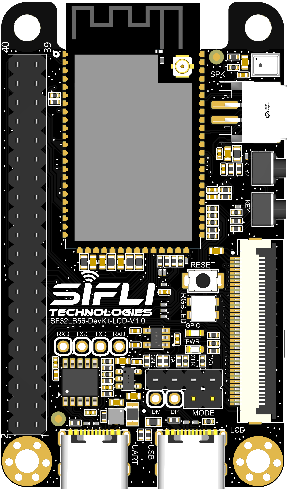
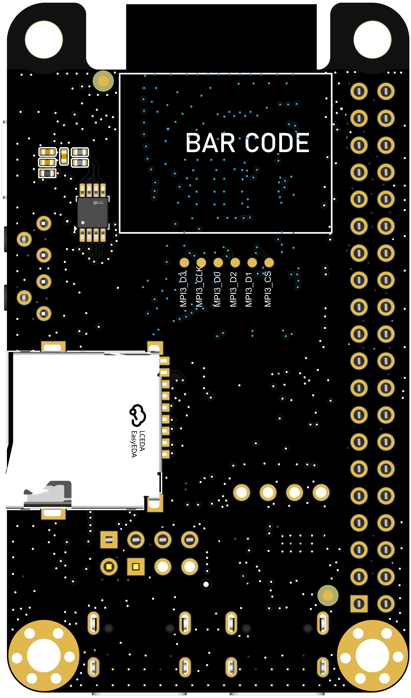
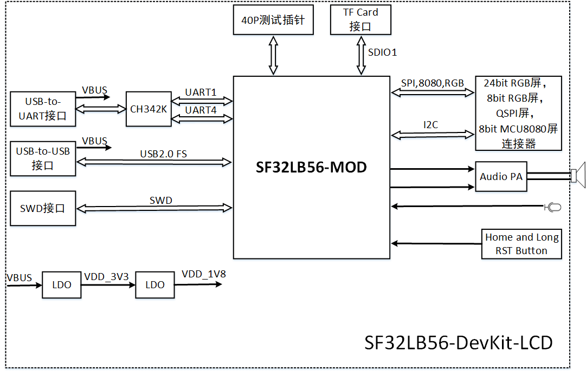
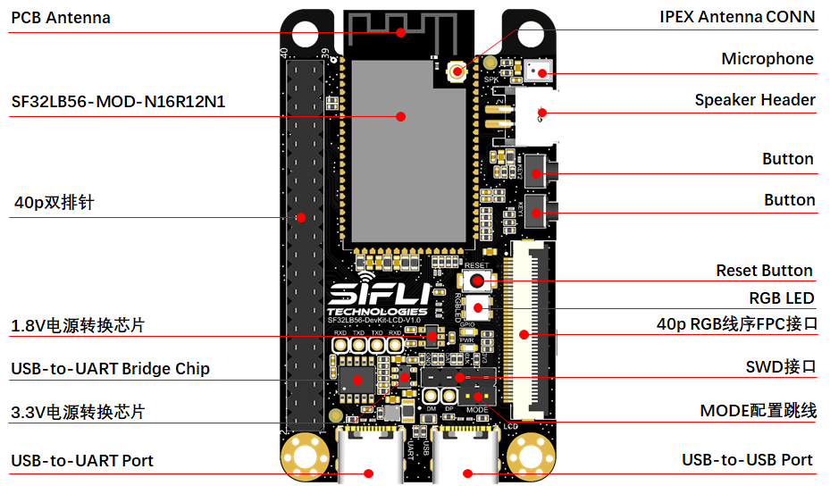
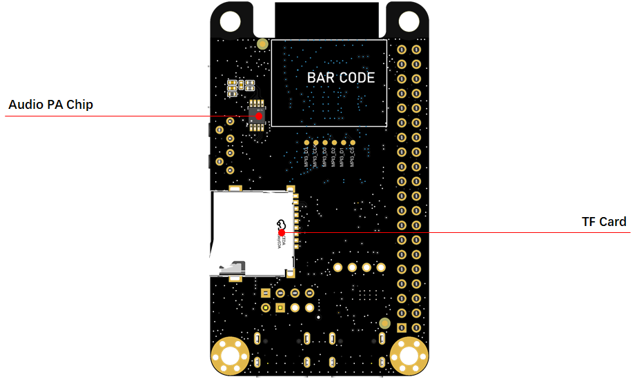
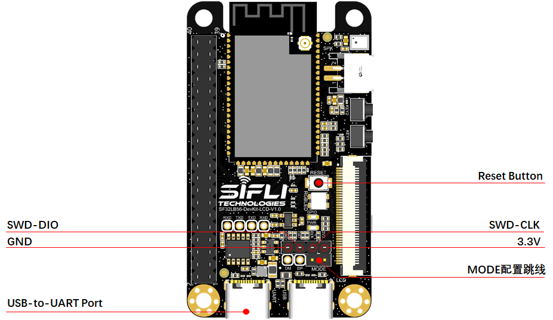

# SF32LB56-DevKit-LCD Development Board User Guide


## Overview of the Development Board


The SF32LB56-DevKit-LCD is a development board based on the SF32LB56xV series module, primarily used for developing various applications with displays that use `MIPI-DPI`/`SPI`/`DSPI`/`QSPI` or `MIPI-DBI(MCU/8080)` interfaces.

The development board also features an analog MIC input, analog audio output, SDIO interface, USB-C interface, and supports TF cards, providing developers with a rich set of hardware interfaces. This helps developers simplify the hardware development process and reduce the time to market for their products.

The appearance of the SF32LB56_DevKit-LCD is shown in Figure 1 and Figure 2.



<div align="center"> Figure 1: SF32LB56_DevKit-LCD Development Board - Front View </div>  <br> <br> <br> 


 

<div align="center"> Figure 2: SF32LB56_DevKit-LCD Development Board - Back View </div>  <br> <br> <br> 


### Feature List
The development board has the following features:
1. Module: Equipped with the SF32LB56-MOD-A128R12N1 module based on the SF32LB56xV chip, with the following configuration:
    - Standard configuration: SF32LB566VCB36 chip, with the following integrated components:
        - 8MB OPI-PSRAM, interface frequency 144MHz (subject to change upon official release)
        - 4MB OPI-PSRAM, interface frequency 144MHz (subject to change upon official release)
    - 1Gb QSPI-Nand Flash, interface frequency 72MHz, STR mode (subject to change upon official release)
    - 48MHz crystal
    - 32.768KHz crystal
    - On-board antenna or IPEX antenna connector, selectable via 0Ω resistor, default is on-board antenna
    - RF matching network and other passive components
2. Dedicated screen interfaces
    - MIPI-DPI, supports 40-pin FPC connector for the Olimex 40-pin pinout
    - SPI/DSPI/QSPI, supports DDR mode QSPI, exposed via 40-pin header
    - 8bit MCU/8080, exposed via 40-pin header
     - Supports I2C interface touch screen
3. Audio
    - Supports analog MIC input
    - Analog audio output, with on-board Class-D audio PA
4. USB
    - Type C interface, supports on-board USB to UART chip for program download and software debugging, can provide power
    - Type C interface, supports USB2.0 FS, can provide power
5. SD Card
    - Supports SDIO interface TF card, with on-board Micro SD card slot


### Functional Block Diagram

 

<div align="center"> Figure 3: Development Board Functional Block Diagram </div>  <br> <br> <br> 


### Component Introduction

The main board of the SF32LB56-DevKit-LCD development board is the core of the entire kit. This main board integrates the SF32LB56-MOD-A128R12N1 module and provides an MIPI-DPI (RGB-24bit) LCD connector.

 

<div align="center"> Figure 3: SF32LB56-DevKit-LCD Board - Front (Click to Enlarge) </div>  <br> <br> <br> 

 

<div align="center"> Figure 4: SF32LB56-DevKit-LCD Board - Back (Click to Enlarge) </div>  <br> <br> <br> 


## Application Development

This section mainly introduces the setup methods for hardware and software, as well as the instructions for burning firmware to the development board and developing applications.

### Required Hardware

- 1 x SF32LB56-DevKit-LCD (including SF32LB56-MOD-A128R12N1 module)
- 1 x Screen module
- 1 x USB2.0 data cable (Standard A to Type-C)
- 1 x SWD debugger
- 1 x Computer (Windows, Linux, or macOS)

```{note}

1. If you need to use both UART debugging and the USB interface, you will need two USB2.0 data cables;
2. Ensure you use the appropriate USB data cable, as some cables are only suitable for charging and cannot be used for data transfer or firmware burning.

```
### Optional Hardware

- 1 x Speaker
- 1 x TF Card
- 1 x 450mAh Lithium Battery

### Hardware Setup

Prepare the development board and load the first example application:

1. Connect the screen module to the corresponding LCD connector interface;
2. Open the SifliTrace tool software from Sicheng, and select the correct COM port;
3. Insert the USB data cable to connect the PC to the USB to UART port of the development board;
4. The screen should light up, and you can interact with the touch screen using your fingers.

Once the hardware setup is complete, you can proceed to the software setup.


### Software Setup

For the SF32LB56-DevKit-LCD development board, refer to the relevant software documentation for a quick setup of the development environment.

## Hardware Reference

This section provides more information about the hardware of the development board.

### GPIO Allocation List

The table below lists the GPIO allocation for the SF32LB56-MOD-A128R12N1 module, used to control specific components or functions of the development board.

<div align="center"> SF32LB56-MOD-A128R12N1 GPIO Allocation </div>

```{table}
:align: center
| Pin | Pin Name | Function |
|:--|:-----------------------|:-----------|
| 1  | GND   | Ground |
| 2  | PB_22 | Touchscreen reset signal |
| 3  | PA_47 | MIPI-DPI(RGB) DE, LCD interface signal |
| 4  | PA_42 | MIPI-DPI(RGB) VSYNC, LCD interface signal |
| 5  | PA_44 | MIPI-DPI(RGB) HSYNC, LCD interface signal |
| 6  | PB_17 | UART4_TXD, default print port of BOOTROM and small core software debugging interface |
| 7  | PB_16 | UART4_RXD, default print port of BOOTROM and small core software debugging interface |
| 8  | PA_45 | MIPI-DPI(RGB) CLK, LCD interface signal |
| 9  | PA_46 | MIPI-DPI(RGB) B7, LCD interface signal |
| 10 | PA_18 | USB_DM |
| 11 | PA_17 | USB_DP |
| 12 | PA_40 | MIPI-DPI(RGB) B6, MCU 8080 DIO0, QSPI DIO2, E-Paper SDI, LCD interface signal |
| 13 | PA_39 | MIPI-DPI(RGB) B5, MCU 8080 DC, QSPI DIO1, E-Paper DC, LCD interface signal |
| 14 | PB_32 | HOME and long press reset button |
| 15 | PA_51 | Touchscreen interrupt INT |
| 16 | PA_41 | MIPI-DPI(RGB) B4, MCU 8080 DIO1, QSPI DIO3, LCD interface signal |
| 17 | PA_43 | MIPI-DPI(RGB) B3, LCD interface signal |
| 18 | PA_38 | MIPI-DPI(RGB) B2, MCU 8080 RD, QSPI DIO0, LCD interface signal |
| 19 | PA_37 | MIPI-DPI(RGB) B1, MCU 8080 WR, QSPI CLK, E-Paper CLK, LCD interface signal |
| 20 | PA_36 | MIPI-DPI(RGB) B0, MCU 8080 CS, QSPI CS, E-Paper CS, LCD interface signal |
| 21 | PA_35 | MIPI-DPI(RGB) G7, LCD interface signal |
| 22 | PA_31 | MIPI-DPI(RGB) G6, MCU 8080 DIO5, LCD interface signal |
| 23 | PA_29 | MIPI-DPI(RGB) G5, MCU 8080 DIO3, LCD interface signal |
| 24 | PA_34 | MIPI-DPI(RGB) G4, MCU 8080 DIO7, LCD interface signal |
| 25 | BOOT_MODE | BOOT_MODE signal, =1 download mode; =0 user program mode |
| 26 | VDD   | Main power input, 2.97~3.63V |
| 27 | VDDSIP | Package-integrated storage power input, 1.71~1.92V |
| 28 | GND   | Ground |
| 29 | VDDIO | GPIO power input, 1.71~3.63V |
| 30 | PA_01 | Touchscreen I2C_SCL |
| 31 | PA_02 | Touchscreen I2C_SDA |
| 32 | PA_03 | UART1_TXD, large core debugging serial port |
| 33 | PA_04 | UART1_RXD, large core debugging serial port |
| 34 | PA_15 | SD1_DIO1, SD card interface signal |
| 35 | PA_22 | SD1_DIO0, SD card interface signal |
| 36 | PA_27 | SD1_CMD, SD card interface signal |
| 37 | PA_26 | SD1_CLK, SD card interface signal |
| 38 | PA_20 | SD1_DIO3, SD card interface signal |
| 39 | PA_12 | SD1_DIO2, SD card interface signal |
| 40 | PA_33 | MIPI-DPI(RGB) G3, MCU 8080 TE, QSPI TE, E-Paper BUSY, LCD interface signal |
| 41 | PA_32 | MIPI-DPI(RGB) G2, MCU 8080 DIO6, LCD interface signal |
| 42 | GND   | Ground |
| 43 | AU_DAC1P_OUT | Analog audio output signal |
| 44 | AU_DAC1N_OUT | Analog audio output signal |
| 45 | GND   | Ground |
| 46 | MIC_BIAS | MIC bias voltage |
| 47 | MIC_ADC_IN | MIC input signal |
| 48 | PA_50 | RSTB, LCD interface signal |
| 49 | PA_30 | MIPI-DPI(RGB) G1, MCU 8080 DIO4, LCD interface signal |
| 50 | PA_28 | MIPI-DPI(RGB) G0, MCU 8080 DIO2, LCD interface signal |
| 51 | PA_25 | MIPI-DPI(RGB) R7, LCD interface signal |
| 52 | PA_23 | MIPI-DPI(RGB) R6, LCD interface signal |
| 53 | PA_21 | MIPI-DPI(RGB) R5, LCD interface signal |
| 54 | PA_19 | MIPI-DPI(RGB) R4, LCD interface signal |
| 55 | PA_24 | MIPI-DPI(RGB) R3, LCD interface signal |
| 56 | PA_16 | MIPI-DPI(RGB) R2, LCD interface signal |
| 57 | PA_13 | MIPI-DPI(RGB) R1, LCD interface signal |
| 58 | PA_14 | MIPI-DPI(RGB) R0, LCD interface signal |
| 59 | PB_23 | BL PWM, LCD interface signal |
| 60 | GND   | Ground |
| 61 | PB_12 | VBUS_DET, USB plug detection |
| 62 | PB_11 | GPIO LED control signal |
| 63 | PB_09 | GPIO control signal for RGBLED |
| 64 | PB_08 | GPIO |
| 65 | PB_35 | KEY, function button |
| 66 | PA_76 | SD card slot insertion detection interface signal |
| 67 | PA_06 | MPI3_CS, SD2_DIO2, I2S1_MCLK, module internal Nor Flash interface signal, not available externally when the module supports Nor Flash |
| 68 | PA_07 | MPI3_DIO1, SD2_DIO3, I2S1_SDI, module internal Nor Flash interface signal, not available externally when the module supports Nor Flash |
| 69 | PA_08 | MPI3_DIO2, SD2_CLK, I2S1_SDO, module internal Nor Flash interface signal, not available externally when the module supports Nor Flash |
| 70 | PA_09 | MPI3_DIO0, SD2_CMD, I2S1_BCK, module internal Nor Flash interface signal, not available externally when the module supports Nor Flash |
| 71 | PA_10 | MPI3_CLK, SD2_DIO0, I2S1_LRCK, module internal Nor Flash interface signal, not available externally when the module supports Nor Flash |
| 72 | PA_11 | MPI3_DIO3, SD2_DIO1, module internal Nor Flash interface signal, not available externally when the module supports Nor Flash |
| 73 | GND | Ground |
| 74 | GND | Ground |
| 76 | GND | Ground |
| 77 | GND | Ground |
| 78 | GND | Ground |
| 79 | PB_13 | SWDIO, SWD interface signal |
| 80 | PB_15 | SWCLK, SWD interface signal |
| 81 | PB_18 | SPI3_CS, RGB screen SPI interface, GPIO interface signal for WIFI |
| 82 | PB_19 | SPI3_CLK, RGB screen SPI interface, GPIO interface signal for WIFI |
| 83 | PB_20 | SPI3_DI, used as GPIO enable signal for audio amplifier |
| 84 | PB_21 | SPI3_DO, RGB screen SPI interface, GPIO interface signal for WIFI |
| 85 | PA_69 | SPI2_DI, I2S1_SDI, PDM1_CLK, used as SPI interface signal for WIFI |
| 86 | PA_64 | SPI2_DO, I2S1_SDO, PDM1_DAT, used as SPI interface signal for WIFI |
| 87 | PA_73 | SPI2_CLK, I2S1_BCK, PDM2_CLK, used as SPI interface signal for WIFI |
| 88 | PA_71 | SPI2_CS, I2S1_LRCK, PDM2_DAT, used as SPI interface signal for WIFI |
| 89 | PA_65 | GPIO, I2S1_MCLK |
```

### 40P Pin Header Interface Definition

 

<div align="center"> Figure 5: 40p Pin Header Interface Definition on the Development Board (Click to Enlarge) </div>  <br> <br> <br> 

### 40p RGB FPC Interface Definition

**Compatible with the 40pin FPC Interface of Olimex**

<div align="center"> RGB-FPC-J0100 Signal Definition </div>

```{table}
:align: center
|Pin|	Pin Name           	   |   Function  |
|:--|:-----------------------|:-----------|
|1   | 5V       | 5V Power Output                 
|2   | 5V       | 5V Power Output   
|3   | R0       | PA_14，LCDC1_DPI_R0  &emsp; &emsp; &emsp; &emsp; &emsp; &emsp; &emsp; &emsp; &emsp; &emsp; &emsp; &emsp; &emsp; &emsp; &emsp; &emsp; &emsp; &emsp;  
|4   | R1       | PA_13，LCDC1_DPI_R1        
|5   | R2       | PA_16，LCDC1_DPI_R2    
|6   | R3       | PA_24，LCDC1_DPI_R3    
|7   | R4       | PA_19，LCDC1_DPI_R4    
|8   | R5       | PA_21，LCDC1_DPI_R5    
|9   | R6       | PA_23，LCDC1_DPI_R6    
|10  | R7       | PA_25，LCDC1_DPI_R7    
|11  | GND      | Ground  
|12  | G0       | PA_28，LCDC1_DPI_G0 
|13  | G1       | PA_30，LCDC1_DPI_G1                
|14  | G2       | PA_32，LCDC1_DPI_G2         
|15  | G3       | PA_33，LCDC1_DPI_G3       
|16  | G4       | PA_34，LCDC1_DPI_G4                 
|17  | G5       | PA_29，LCDC1_DPI_G5       
|18  | G6       | PA_31，LCDC1_DPI_G6    
|19  | G7       | PA_35，LCDC1_DPI_G7    
|20  | GND      | Ground      
|21  | B0       | PA_36，LCDC1_DPI_B0       
|22  | B1       | PA_37，LCDC1_DPI_B1       
|23  | B2       | PA_38，LCDC1_DPI_B2       
|24  | B3       | PA_43，LCDC1_DPI_B3       
|25  | B4       | PA_41，LCDC1_DPI_B4       
|26  | B5       | PA_39，LCDC1_DPI_B5       
|27  | B6       | PA_40，LCDC1_DPI_B6       
|28  | B7       | PA_46，LCDC1_DPI_B7       
|29  | GND      | Ground       
|30  | CLK      | PA_45，LCDC1_DPI_CLK        
|31  | HSYNC    | PA_44，LCDC1_DPI_HSYNC       
|32  | VSYNC    | PA_42，LCDC1_DPI_VSYNC       
|33  | DE       | PA_47，LCDC1_DPI_DE       
|34  | BL       | PB_23，BL_PWM       
|35  | CTP_RST  | PB_22       
|36  | CTP_SDA  | PA_02，I2C4_SDA       
|37  | NC       | -       
|38  | CTP_SCL  | PA_01，I2C4_SCL       
|39  | CTP_INT  | PA_51       
|40  | RESET    | PA_50            
```

### Power Supply Description

The SF32LB56-DevKit-LCD development board is powered through the USB Type-C interface. Both USB Type-C interfaces on the board can power the board. For downloading and debugging, please use the USB-to-UART port.

### Firmware Burning and Testing

#### Firmware Burning Tool Impeller Download
Connect the USB-to-UART port with a USB cable, open the firmware download tool provided by Sifli, and select the corresponding COM port and program.
1. Download Mode
- Insert the Mode jumper cap, power on, and the board will enter download mode, allowing the program to be downloaded.
2. Software Development Mode
- Remove the Mode jumper cap, power on, and the board will enter serial log print mode, allowing software debugging.

**For more details, please refer to&emsp;[Firmware Burning Tool Impeller](/tools/烧录工具)**

#### Jlink SWD Tool Download and Debugging

As shown in the following two figures, connect the corresponding IO pins with jumper wires.

 

<div align="center"> Figure 6: SF32LB56-DevKit-LCD SWD Debugging Wiring Diagram </div>  <br> <br> <br> 

## Sample Acquisition

Retail samples and small quantities can be purchased directly from [Taobao](https://sifli.taobao.com/). For bulk orders, please send an email to sales@sifli.com or contact customer service on Taobao for sales information.
Open source contributors can apply for free samples by joining QQ group 674699679 for communication.

## Related Documents

- [SF32LB56x Chip Technical Specification](https://downloads.sifli.com/user%20manual/DS5601-SF32LB56x-%E8%8A%AF%E7%89%87%E6%8A%80%E6%9C%AF%E8%A7%84%E6%A0%BC%E4%B9%A6%20V1p9p2.pdf)
- [SF32LB56x User Manual](https://downloads.sifli.com/user%20manual/UM5601-SF32LB56x-%E7%94%A8%E6%88%B7%E6%89%8B%E5%86%8C%20V1p0p2.pdf)
- [SF32LB56-MOD Technical Specification](https://downloads.sifli.com/silicon/DS5602-SF32LB56-MOD%E6%8A%80%E6%9C%AF%E8%A7%84%E6%A0%BC%E4%B9%A6%20V0p2.pdf)
- [SF32LB56-MOD Design Drawings](https://downloads.sifli.com/hardware/SF32LB56-MOD-V1.2.0.zip)
- [SF32LB56-DevKit-LCD Design Drawings](https://downloads.sifli.com/hardware/SF32LB56-DevKit-LCD_V1.1.0.zip)