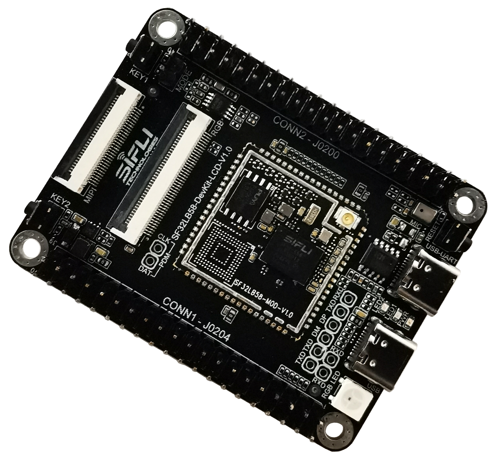

# SF32LB58-DevKit-LCD Development Board User Guide

## Module Version Information:

* V1.0.1: SF32LB58-MOD-N16R32N1 and SF32LB58-MOD-A128R32N1, using SF32LB586VDD36 chip, current version
```{table} 
:align: center
| No. | V1.0.1 Update Content |
|:-- |:------ |
|1 | Modified eMMC power control IO; VCC and VCCQ power control IO for storage particles changed from PA80 to: PA74 controls VCC, PA80 controls VCCQ. Added resistor R0115.   
```
* V1.0.0: SF32LB58-MOD-N16R32N1, using SF32LB586VDD36 chip

## Development Board Version Information:

* V1.0.1: Using SF32LB58-MOD-N16R32N1-V1.0.1 and SF32LB58-MOD-A128R32N1-V1.0.1 modules, internally soldered SF32LB586VDD36 chip, current version
```{table} 
:align: center
| No. | V1.0.1 Update Content |
|:-- |:------ |
|1 | Added USB plug/unplug detection function, using PB_24.   
|2 | Changed PTC to 2A/6V, solving the issue of insufficient power supply current when dual audio outputs at maximum power. 
|3 | Removed level conversion part in RGBLED circuit, as this circuit does not meet RGBLED timing requirements.
|4 | Replaced DCDC chip to solve high output ripple issue.
|5 | Removed pull-up resistor on USB dp signal to resolve interruption issues during USB slave mode.
```
* V1.0.0: Using SF32LB58-MOD-N16R32N1-V1.0.0 module, internally soldered SF32LB587VEE56 chip, initial version

## Development Board Overview

SF32LB58-DevKit-LCD is a development board based on the SF32LB58-MOD module, primarily used for developing various applications with displays via `DSI`, `DPI`, and `QSPI` interfaces.

The development board is equipped with analog MIC input, analog audio output, SDIO interface, USB-C interface, TF card support, etc., providing developers with rich hardware interface resources. It can be used to develop drivers for various peripheral interfaces, helping developers simplify hardware development processes and shorten product time-to-market.

 

<div align="center"> Front view of SF32LB58_DevKit-LCD development board </div>   <br> <br> <br> 


 

<div align="center"> Back view of SF32LB58_DevKit-LCD development board </div>   <br> <br> <br>  


### Feature List
The development board has the following features:
1.	Module: Onboard SF32LB58-MOD-N16R32N1 or SF32LB58-MOD-A128R32N1 module based on SF32LB58x chip, module configuration as follows:
    - Standard configuration SF32LB586VDD36 chip, internally integrated configuration:
        - 16MB HPI-PSRAM, interface frequency 144MHz
        - 16MB HPI-PSRAM, interface frequency 144MHz
        - 1MB QSPI-NOR Flash, interface frequency 48MHz
    - 16MB QSPI-NOR Flash, interface frequency 72MHz, STR mode (SF32LB58-MOD-N16R32N1 version)
    - 128MB QSPI-Nand Flash, interface frequency 72MHz, STR mode (SF32LB58-MOD-A128R32N1 version)
    - 48MHz crystal
    - 32.768KHz crystal
    - IPEX antenna socket
    - RF matching network and other passive components
2.	Specialized screen interface
    - DSI/RGB888, up to 2-lane data transmission, standard 30-pin FPC connector
    - DPI/RGB888, supports serial 8-bit RGB, Alpha & Omega 40-pin FPC connector
    - Dual SPI/DSPI/QSPI, supports DDR mode QSPI, extended via 40-pin header
    - Supports I2C interface touch screen
3.	Audio
    - Supports dual analog MIC input, onboard one analog MIC input by default, selectable via resistor jumper between onboard MIC or 40-pin header input
    - Supports stereo analog audio output, onboard Class-D audio PA, maximum 2.8W/4 ohm speaker output, speaker connected via 40-pin header
4.	USB
    - Type C interface, supports onboard USB-to-serial chip for program download and software DEBUG, capable of power supply
    - Type C interface, supports USB2.0 HS, capable of power supply
5.	SD Card
    - Supports TF card using SDIO interface, onboard Micro SD card slot
6.  Headers
    - Large core GPIO input/output interface, 40-pin header
    - Small core GPIO input/output interface, 40-pin header


### Functional Block Diagram

 

<div align="center"> Development board functional block diagram </div>   <br> <br> <br> 

 
### Component Introduction

The mainboard of the SF32LB58-DevKit-LCD development board is the core of the entire kit. This mainboard integrates the SF32LB58-MOD-N16R32N1 module and provides MIPI-DSI and DPI/RGB888 LCD connectors.

 

<div align="center"> SF32LB58-DevKit-LCD Board - Front (click to enlarge) </div>   <br> <br> <br> 


 

<div align="center"> SF32LB58-DevKit-LCD Board - Back (click to enlarge) </div>   <br> <br> <br> 

 
## Application Development

This section mainly introduces hardware and software setup methods, as well as instructions for flashing firmware to the development board and developing applications.

### Required Hardware

- 1 x SF32LB58-DevKit-LCD (including SF32LB58-MOD-N16R32N1 module)
- 1 x Screen module (MIPI-DSI or DPI/RGB888)
- 1 x USB2.0 cable (standard Type-A to Type-C)
- 1 x Computer (Windows, Linux or macOS)

```{note}

1. If you need both UART debugging and USB interface usage, two USB2.0 cables are required;
2. Please ensure using appropriate USB data cables, as some cables are only for charging and cannot be used for data transfer and program flashing.

```
### Optional Hardware

- 2 x Speakers
- 1 x TF Card

### Hardware Setup

Prepare the development board and load the first sample application:

1.	Connect the screen module to the corresponding LCD connector;
2.	Open SifliTrace tool software from Sichuo, select the correct COM port;
3.	Insert USB data cable, connecting PC and development board USB to UART port respectively;
4.	The screen lights up, you can interact with the touchscreen using your finger.

Hardware setup is complete, next proceed with software setup.


### Software Setup

For SF32LB58-DevKit-LCD development board, please refer to software-related documents for quick development environment setup.

## Hardware Reference

This section provides more information about the development board hardware.

### GPIO Allocation List

The table below shows the GPIO allocation list for SF32LB58-MOD-N16R32N1 module pins, used to control specific components or functions of the development board.

<div align="center"> SF32LB58-MOD-N16R32N1 GPIO Allocation </div>

```{table}
:align: center
| Pin | Pin Name           	   |   Function  |
|:--|:-----------------------|:-----------|
|1   | VDDIOB   | PB domain GPIO power input                 
|2   | PB_36    | DB_UART_RXD, program download and software debugging interface   
|3   | PB_37    | DB_UART_TXD, program download and software debugging interface   
|4   | PB_54    | HOME and long press reset button        
|5   | PA_75    | SD2_DIO1, SD card interface signal    
|6   | PA_76    | SD2_DIO0, SD card interface signal    
|7   | PA_77    | SD2_CLK, SD card interface signal    
|8   | PA_70    | SD2_CND, SD card interface signal    
|9   | PA_81    | SD2_DIO3, SD card interface signal    
|10  | PA_79    | SD2_DIO2, SD card interface signal    
|11  | Boot_Mode | Boot mode selection signal, =1 for download mode; =0 for run mode  
|12  | RSTN     | MCU reset signal 
|13  | VDD_1V8  | 1.8V power input                
|14  | GND      | Ground         
|15  | VDDIOA   | PA12~PA93 power input       
|16  | VDD_3V3  | 3.3V power input                 
|17  | PA_13    | DPI DE, LCDC1 interface signal       
|18  | PA_15    | DPI VSYNC, LCDC1 interface signal    
|19  | PA_14    | DPI HSYNC, LCDC1 interface signal    
|20  | PA_12    | DPI CLK, LCDC1 interface signal      
|21  | PA_67    | DPI B7, LCDC1 interface signal       
|22  | PA_65    | DPI B6, LCDC1 interface signal       
|23  | PA_63    | DPI B5, LCDC1 interface signal       
|24  | PA_62    | DPI B4, LCDC1 interface signal       
|25  | PA_61    | DPI B3, LCDC1 interface signal       
|26  | PA_58    | DPI B2, LCDC1 interface signal       
|27  | PA_57    | DPI B1, LCDC1 interface signal       
|28  | PA_56    | DPI B0, LCDC1 interface signal       
|29  | PA_55    | DPI G7, LCDC1 interface signal       
|30  | PA_54    | DPI G6, LCDC1 interface signal       
|31  | PA_53    | DPI G5, LCDC1 interface signal       
|32  | PA_50    | DPI G4, LCDC1 interface signal       
|33  | PA_48    | DPI G3, LCDC1 interface signal       
|34  | PA_47    | DPI G2, LCDC1 interface signal       
|35  | PA_46    | DPI G1, LCDC1 interface signal       
|36  | PA_45    | DPI G0, LCDC1 interface signal       
|37  | PA_44    | DPI R7, LCDC1 interface signal       
|38  | PA_43    | DPI R6, LCDC1 interface signal       
|39  | PA_27    | DPI R5, LCDC1 interface signal       
|40  | PA_26    | DPI R4, LCDC1 interface signal       
|41  | PA_25    | DPI R3, LCDC1 interface signal       
|42  | PA_24    | DPI R2, LCDC1 interface signal       
|43  | PA_23    | DPI R1, LCDC1 interface signal       
|44  | PA_22    | DPI R0, LCDC1 interface signal       
|45  | VDDIOA2  | PA00~PA11 power input        
|46  | GND      | Ground  
|47  | DSI_D0N  | MIPI-DSI D0N, LCDC1 interface signal   
|48  | DSI_D0P  | MIPI-DSI D0P, LCDC1 interface signal   
|49  | DSI_CLKN | MIPI-DSI CLKN, LCDC1 interface signal   
|50  | DSI_CLKP | MIPI-DSI CLKP, LCDC1 interface signal   
|51  | DSI_D1N  | MIPI-DSI D1N, LCDC1 interface signal   
|52  | DSI_D1P  | MIPI-DSI D1P, LCDC1 interface signal   
|53  | PA_32    | GPIO, UART1_RXD 
|54  | PA_31    | GPIO, UART1_TXD 
|55  | USB_DN   | USB_DN 
|56  | USB_DP   | USB_DP 
|57  | PA_17    | CTP Interrupt, DSI/DPI LCDC1 interface signal  
|58  | PA_16    | CTP Reset, DSI/DPI LCDC1 interface signal 
|59  | PA_00    | GPIO, SD1_DIO7, CAN1_TXD 
|60  | PA_03    | GPIO, SD1_DIO5, CAN1_RXD 
|61  | PB_17    | GPIO 
|62  | PB_18    | GPIO 
|63  | PB_11    | SWD_DIO 
|64  | PB_07    | SWD_CLK 
|65  | GND      | Ground     
|66  | AU_DAC1N_OUT | Analog audio output signal    
|67  | AU_DAC1P_OUT | Analog audio output signal    
|68  | MIC_BIAS | MIC bias voltage            
|69  | AU_ADC1N_IN  | MIC input signal        
|70  | AU_ADC1P_IN  | MIC input signal        
|71  | GND      | Ground     
|72  | BT_ANT   | Bluetooth antenna signal 
|73  | PB_51    | GPIO 
|74  | PB_52    | GPIO 
|75  | PB_56    | GPIO, KEY2 Input 
|76  | PB_57    | GPIO 
|77  | PB_58    | GPIO, TF card Detect signal 
|78  | PB_59    | GPIO 
|79  | PA_93    | CTP Reset, LCDC1 interface signal 
|80  | PA_92    | CTP Interrupt, LCDC1 interface signal
|81  | PA_91    | QSPI D0, LCDC1 interface signal 
|82  | PA_90    | QSPI CLK, LCDC1 interface signal 
|83  | PA_88    | QSPI CS, LCDC1 interface signal 
|84  | PA_86    | QSPI D3, LCDC1 interface signal 
|85  | PA_84    | QSPI D2, LCDC1 interface signal 
|86  | PA_82    | QSPI D1, LCDC1 interface signal 
|87  | PA_60    | CTP I2C_SCL, DSI/DPI LCDC1 interface signal 
|88  | PA_59    | CTP I2C_SDA, DSI/DPI LCDC1 interface signal 
|89  | PA_52    | BL PWM, QSPI LCDC1 interface signal   
|90  | PA_51    | LCD Reset, QSPI LCDC1 interface signal   
|91  | PA_42    | BL PWM, DSI/DPI LCDC1 interface signal   
|92  | PA_20    | GPIO, UART3_RXD 
|93  | PA_21    | GPIO, UART3_TXD 
|94  | PA_29    | GPIO, I2C2_SDA 
|95  | PA_28    | GPIO, I2C2_SCL
|96  | PA_18    | LCD Reset, DSI/DPI LCDC1 interface signal 
|97  | PA_02    | GPIO, CAN2_RXD 
|98  | PA_11    | GPIO, CAN2_TXD, SCI_RST 
|99  | PA_08    | GPIO, SD1_DIO6, SCI_DIO, UART2_RXD 
|100 | PA_07    | GPIO, SD1_DIO4, SCI_CLK, UART2_TXD  
|101 | PA_10    | GPIO, SD1_CMD, MPI4_CS 
|102 | PA_09    | GPIO, SD1_CLK, MPI4_CLK 
|103 | PA_06    | GPIO, SD1_DIO3, MPI4_DIO3 
|104 | PA_04    | GPIO, SD1_DIO1, MPI4_DIO1
|105 | PA_05    | GPIO, SD1_DIO0, MPI4_DIO0 
|1
