# NandFlash_BBM Analysis Guide
## 1 Introduction
**BBM (BBM): Bad Block Management** 
Due to the physical characteristics of Nand Flash, it supports only a limited number of erase/write cycles. Once that limit is exceeded, it is basically damaged. During use, some blocks in Nand Flash may become worn out. When this is detected, the block must be promptly marked as a bad block and no longer used, and the physical address of the bad block must be mapped to another normal block for read/write operations. The related management work is part of Nand Flash bad block management (usually, some bad blocks may already exist when Nand Flash leaves the factory). If eMMC storage is used, this part of the software work has already been completed inside the eMMC internal controller chip. 
**Introduction to eMMC (Embedded MultiMediaCard)** 
It is an integrated storage module that packages a NAND Flash chip and a controller chip (Controller) in a single chip, and integrates a standard interface protocol, such as the MMC protocol. Simply put, eMMC = NAND Flash + controller + interface. It is a complete “plug-and-play” storage solution. With the integrated controller, it can independently perform: 
1. Receive read/write commands from the processor (through the standard interface); 
2. Perform bad block management (mask damaged storage cells); 
3. Implement wear leveling (use storage cells evenly to avoid excessive local wear); 
4. Data verification and error correction (ECC), etc. 

Therefore, when eMMC is used, there is no need to further consider the BBM bad block management algorithm required by Nand Flash or to choose Flashdb to implement wear leveling, making development easier.

## 2 BBM Management Method
The sif_bbm_init function divides the memory size of a brand-new Nand device into 32 parts. The last 1/32 of the physical address space is used for BBM management. If individual bad blocks are found in the first 31 parts, they are mapped to normal blocks in the last 1/32 for read/write operations. For users, the Nand read/write addresses remain contiguous. 
**BBM Management Area Address Calculation**   
For 52X, the base address is 0x62000000. For 56X, the base address is 0x64000000.
The NAND devices currently used are mostly 512MB or 1Gb devices, corresponding to sizes of 0X4000000 and 0x8000000, respectively. The size reserved for BBM is 1/32 of the total size, so 0x200000 and 0x400000 are reserved, respectively. In addition, the address division starts from the end, so for 52X/56X and different sizes, the start address of the BBM area is different. Also, BBM information is saved in two blocks at the same time. Except for the ID and CRC values, the other contents should be the same. If they are not bad blocks, the two blocks that store BBM are adjacent, with addresses as follows:  
For 512Mb 52X, the start addresses are: 0x65e00000 / 0x65e20000  
For 1Gb 52X, the start addresses are: 0x69c00000 / 0x69c20000  
For 512Mb 56X, the start addresses are: 0x67e00000 / 0x67e20000  
For 512Mb 56X, the start addresses are: 0x6bc00000 / 0x6bc20000  
The length can be one page or multiple PAGEs. It is recommended to directly read multiple PAGEs. The reason for reading multiple PAGEs is that each time the BBM version is updated, it is written again in the next PAGE. The starting data of each PAGE is either the BBM magic num (0X4D 42 66 53) or all FF. When the starting data of the next PAGE is all FF, the current PAGE has the latest version number, that is, it is the data that needs to be analyzed.
In addition, the information of the two blocks can be read back at the same time and displayed in split screens for comparison and analysis.  

## 3 Reading the BBM Management Table
For the J-Link driver, use the Original driver, not the driver with BBM management, `SF32LB52X_EXT_ORG_NAND2.elf`
`\tools\flash\jlink_drv\sf32lb52x_nand_nobbm\SF32LB52X_EXT_ORG_NAND2.elf`
For the Uart driver, use `tools\uart_download\file\ram_patch_52X_NAND_NOBBM.bin` or `Butterfli\file\ram_patch_52X_NAND_NOBBM.bin` for reading. With a normal driver that includes BBM management, the contents read from the device are data that has already been mapped by BBM. 
**Jflash Read Method Demonstration**  
Connect to the board through JLINK, and open JFlash.exe on the PC. 

 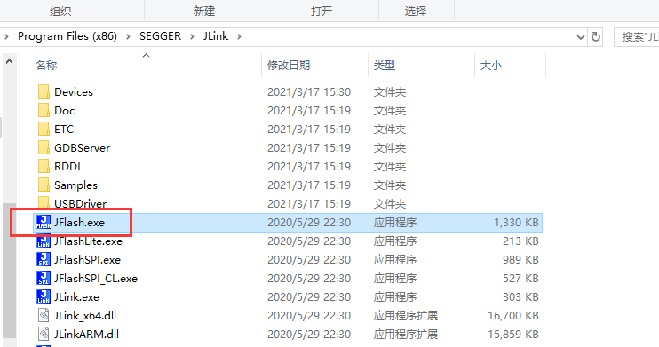  
Create a project and select the correct device for connection.
For the 52x series, select SF32LB52X_NAND_NOBBM. 
For the 56X series, select SF32LB56X_NAND_NOBBM.
The non-NOBBM version cannot correctly access the several megabytes of reserved BBM addresses at the end, so only the version with the NOBBM suffix can be selected. 

 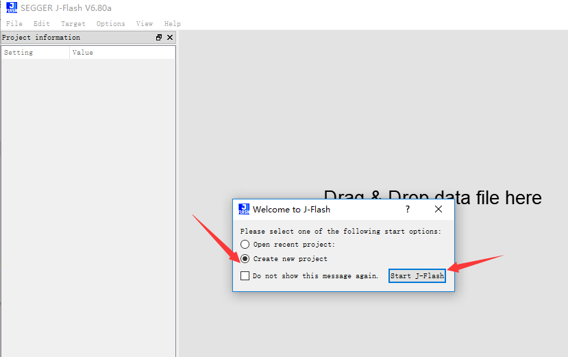  
 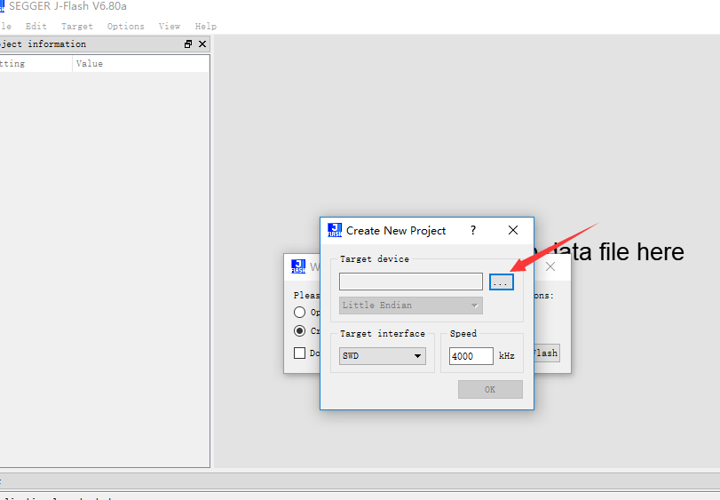  
 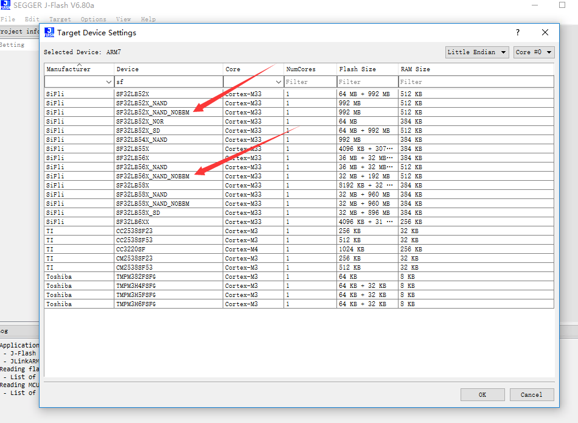  
 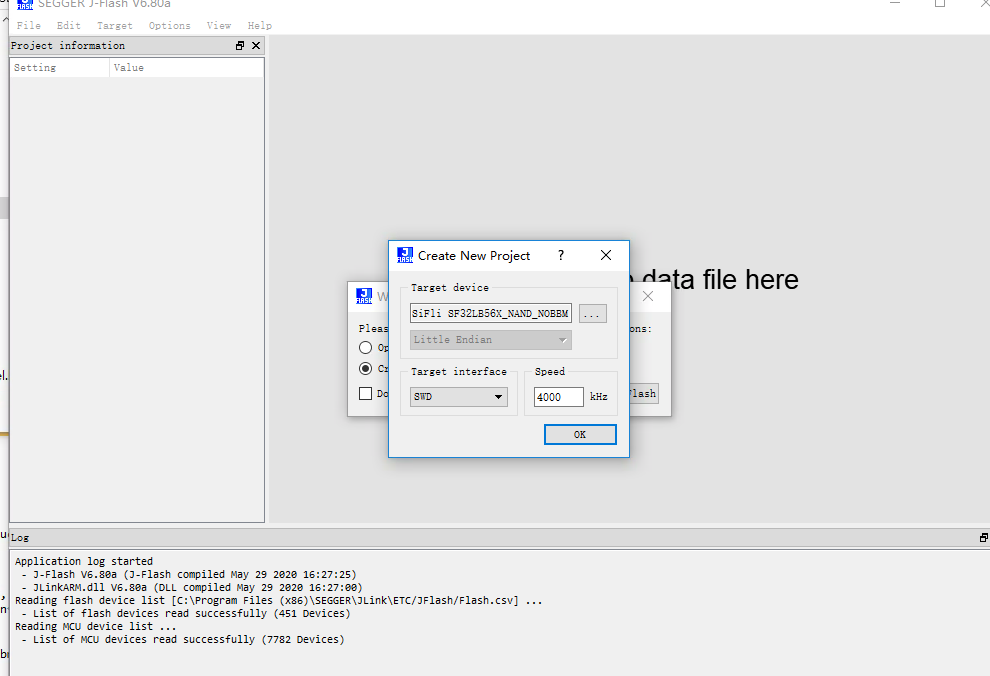  
 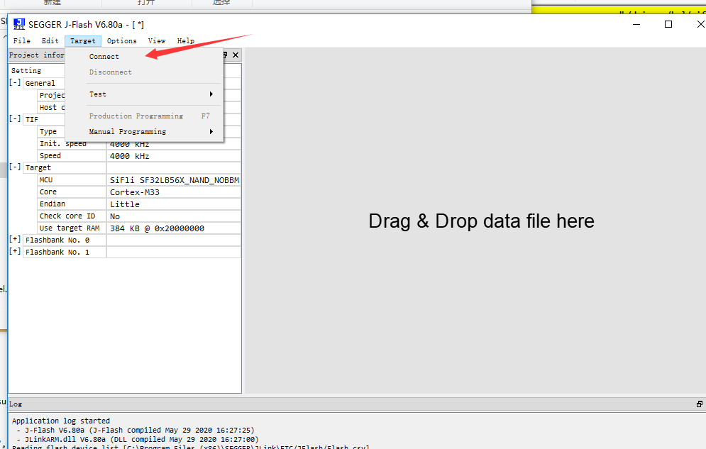  
 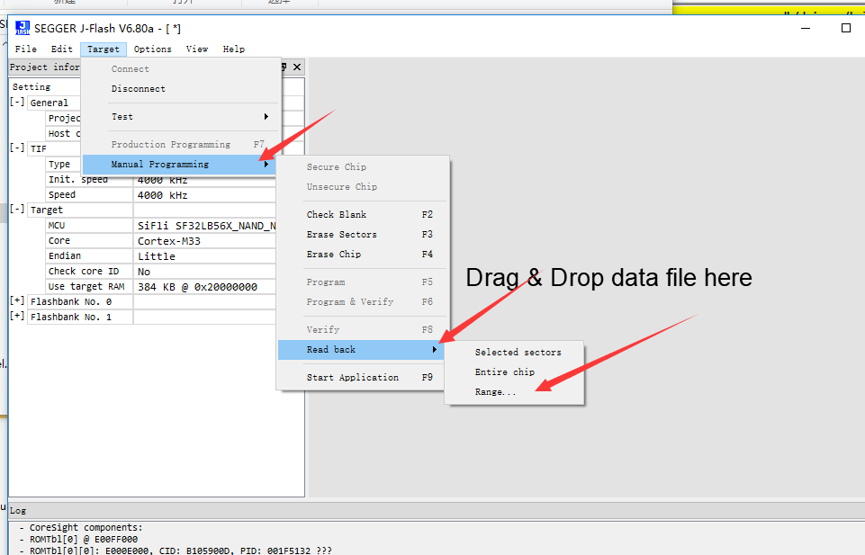  
Example of reading a PAGE address for a 512M 56X:
 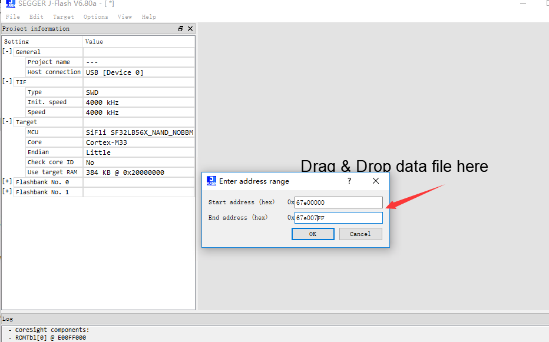  
Address example for reading 4 PAGEs on a 1Gb 56X:
 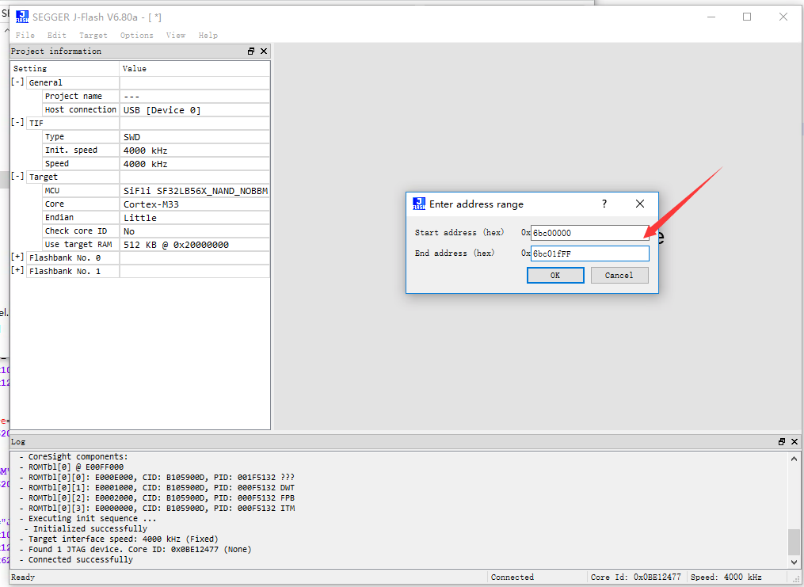 

## 4 BBM Data Analysis
The figure below shows the BBM table data for a 1Gb die on 56X with no bad-block information.
 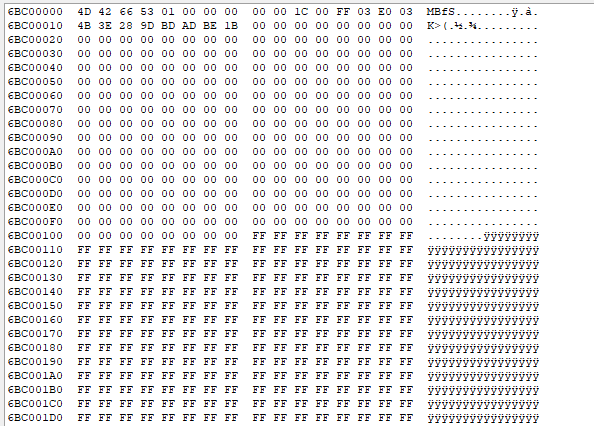 
Read the BBM information in two blocks. Except for the index and CRC, the other information is the same.
In addition, the data is stored in little-endian format. For example, reserv_blk_start (E0 03) in the figure below corresponds to a data size of 0x03e0, and free_blk_start (FF 03) corresponds to a data size of 0x3ff.
 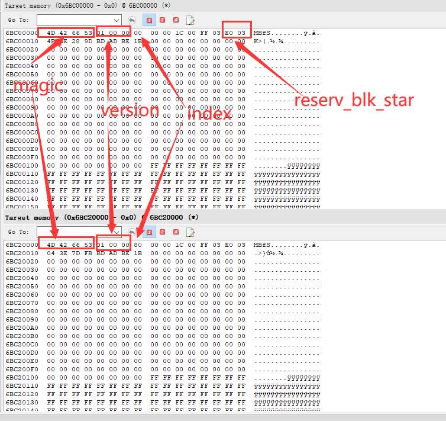 
The figure below shows the mapping table data for 5 bad blocks. From the table, you can analyze which blocks in the user area are bad blocks and the corresponding mapped backup block addresses:
 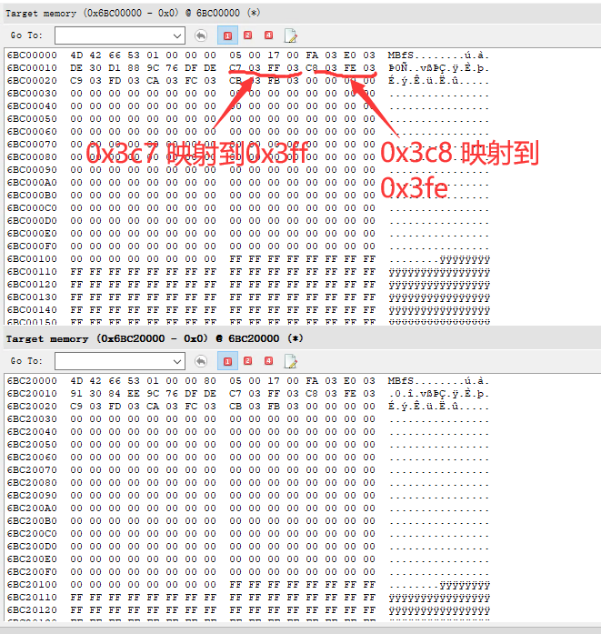 
**BBM Data Format** 
 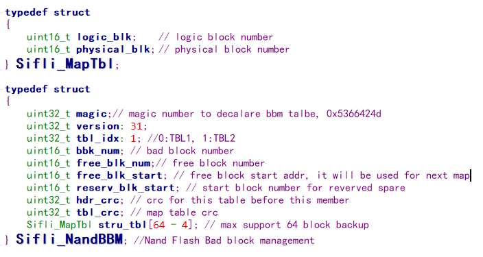 

## 5 BBM FAQ

The main issues currently encountered include: 
a) The BBM table is not generated, or the BBM storage location is incorrect. This is indicated by the inability to read a valid table containing magic num from the location specified above. 
b)	The data of Free_blk_start or reserve_blk_start is incorrect. reserve_blk_start is fixed; even if the table version is updated, this data should not change and should remain fixed as the BBM start block number. Free_blk_start is variable, and the value gradually decreases. During initialization, it should be the total block number minus 1 (for example, a 1Gb device has 1024 blocks, so the initial value should be 0123). At the minimum, it must not be smaller than reserve_blk_start (the theoretical minimum value should be reserve_blk_start + 4). 
c)	The data in Struc_tbl is unreasonable. If no bad blocks are found, all data in this array should be 0. If bad blocks occur and need to be mapped, the data of logic_blk should be the block number in the user area address range [0 : reserve_blk_start – 1]; the data of physical_blk should be the available block number in the backup area [reserve_blk_start + 4 : maximum block number - 1].
