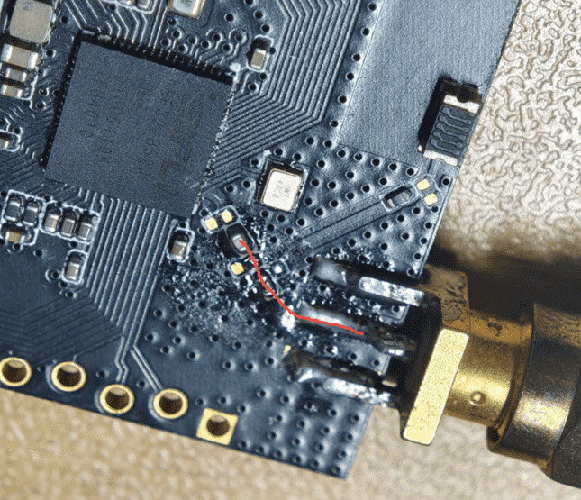
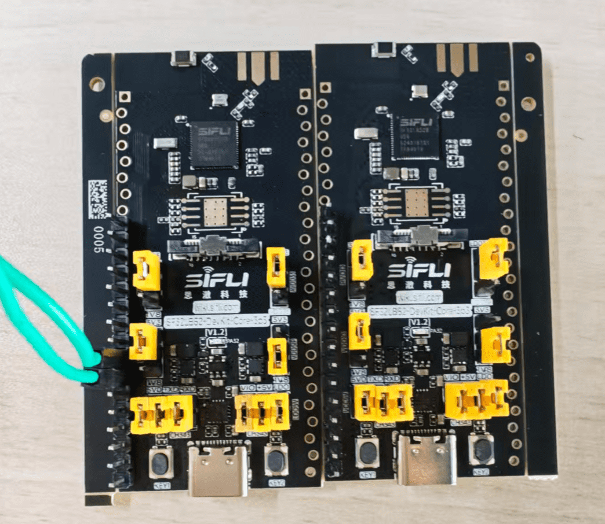
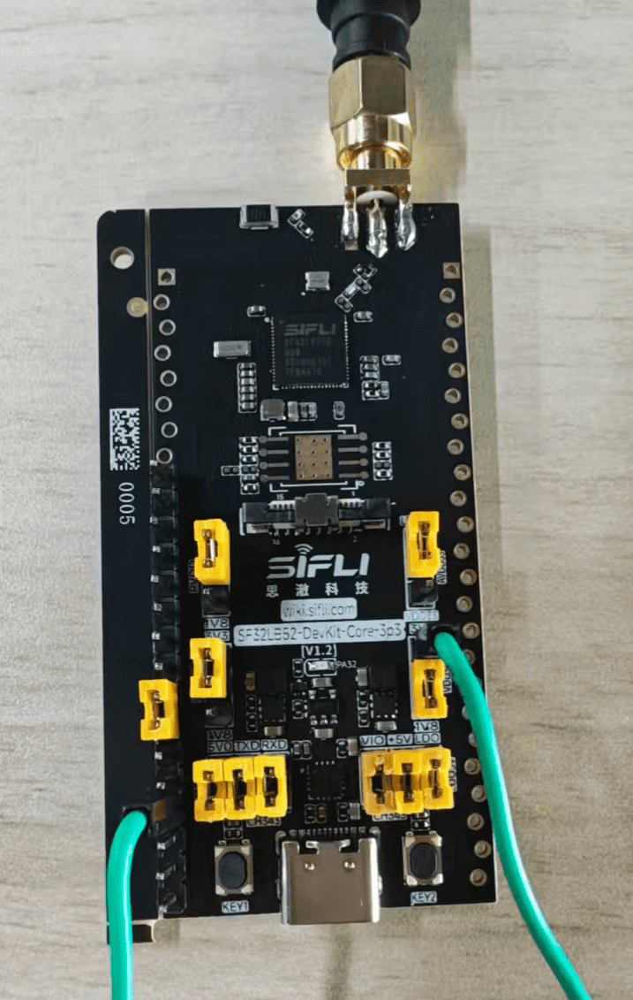

# SF32LB52-DevKit-Core-3p3 Development Board Test Guide

## 1. Overview

The Core development board is a standard development board for commercial customers and professional users. It ships with a standard firmware image and matching documentation, helping customers quickly verify Bluetooth RF performance, transmit power, receive sensitivity, and power consumption data without modifying code or rebuilding firmware.

## 2. Firmware Acquisition

Firmware acquisition path:

## 3. Firmware Flashing

### 1. Flashing Tool (Impeller)

Tool download: [Impeller tool package][Impeller]

Flashing tool instructions: [Impeller User Guide][Impeller User Guide]

### 2. Flashing Requirements

Hardware environment: PC + hardware development board + Type-C USB cable.

Software environment: Windows system + Impeller tool + firmware package.

#### 3. Flashing Steps

Before the device runs or firmware is flashed, configure the jumpers as follows:


1. Short jumper caps 1, 2, and 3 to 3.3 V, and short jumper cap 4 to 1.8 V.

2. Short all antenna caps at position 5.

3. Connect the Type-C USB cable at position 6 to the PC for firmware flashing.

4. Use the Impeller tool to start flashing.


The parameter setting page for step 1 in the figure above is shown below:


5. After the download succeeds, continue with the test-flow configuration below, then power-cycle the board for normal startup.

## 4. Range Test

Flash the same firmware to two Core development boards. Before powering on, users only need to configure the jumpers.

After configuring the mode and power for the two boards, the range test can be performed.

### 1. Antenna Selection

The Core board supports two antenna options: onboard ceramic antenna and external antenna.


1. Position 1 is the onboard ceramic antenna, position 2 is the reserved pad for an external antenna, and position 3 is a 0-ohm resistor.

2. When the 0-ohm resistor at position 3 is soldered as shown above by default, the onboard ceramic antenna is used.

3. When the 0-ohm resistor at position 3 is soldered as shown below, the soldered external antenna is used.



4. Note: the middle pad is the signal pad (RF), and the pads on both sides are GND.

### 2. Jumper Configuration

#### Mode Selection

1. The two test boards are divided into a TX board and an RX board. Both boards use the same firmware.

2. The board role is selected by the PA27 level. Configure the PA27 level with a jumper before startup.

```{important}

1. PA27 is low by default, so the device defaults to TX mode.
2. The onboard LED status can be used to identify the current mode: TX LED double pulse / RX LED single pulse.

```

```{table}
:name: mode-selection

| PA27 State | Device Mode |
|:-----------|:------------|
| Low level  | TX (transmitter, actively scans and connects) |
| High level | RX (receiver, advertises and waits for connection) |

```

19 dB Bluetooth receive mode (left) and Bluetooth transmit mode (right)



#### Power Selection

1. When no power-selection configuration is made, the device uses 19 dB transmit power by default.

2. To select another transmit power, disconnect device power, configure the jumper, and then power on again. The device loads the configured transmit power after reboot.

```{table}
:name: power-selection

| Pin Pulled High | Transmit Power (dBm) |
|:----------------|:---------------------|
| PA26            | 10 |
| PA25            | 13 |
| PA24            | 16 |

```

```{important}

1. Priority: PA26 > PA25 > PA24. If multiple pins are pulled high at the same time, the highest-priority pin takes effect.
2. Both boards must select the same power level for testing.

```

#### 16 dB Power Selection Example

Transmitter:

- Connect the jumper to PA24.


Receiver:

- Connect the jumpers to PA27 and PA24.



### 3. LED Status (PA32)

The LED status can be used to determine the board mode and connection state.

#### TX Board

```{table}
:name: tx-board-led

| LED Behavior | Meaning |
|:-------------|:--------|
| Two pulses per second | Not connected; scanning for RX |
| 1 Hz breathing LED | RX found, waiting for connection |
| Always on | Connected |

```

#### RX Board

```{table}
:name: rx-board-led

| LED Behavior | Meaning |
|:-------------|:--------|
| One pulse per second | Not connected / disconnected |
| Always on | Connected |

```

### 4. Connection and Reconnection Behavior

#### Initial Connection

- RX advertises with the name `SIFLI_RANGE`; no user operation is required.
- TX starts scanning immediately after power-on. After matching RX, TX connects automatically.

#### Automatic Reconnection

- If either side disconnects, RX automatically advertises again and TX automatically scans again.
- When multiple board pairs are present in the same environment, TX always connects to the RX with the strongest RSSI, selected cumulatively within a 2-second window.

### 5. Log Parsing (Mode Confirmation)

Within about 2 to 3 seconds after startup, the following log is printed:

```text
[xxxx] I/range_io main: Range test boot: role=RX(recv), tx_power=19dBm
```

This line confirms the current role and the loaded power level.

After the BLE protocol stack is initialized, the following log is printed:

```text
[xxxx] I/range_io mbox: Override BT TX power -> 19dBm
```

This line confirms that the power setting has been delivered to the BLE controller.

[Impeller]: https://downloads.sifli.com/tools/Impeller/Impeller_latest.7z
[Impeller User Guide]: https://wiki.sifli.com/tools/%E7%83%A7%E5%BD%95%E5%B7%A5%E5%85%B7.html
