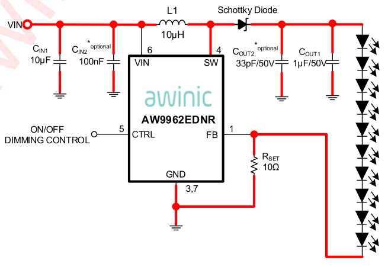
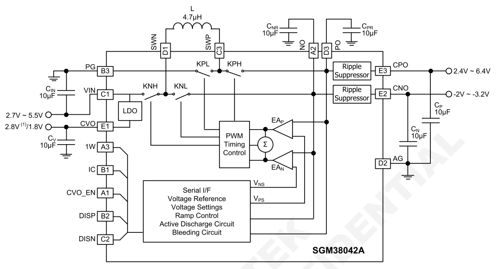
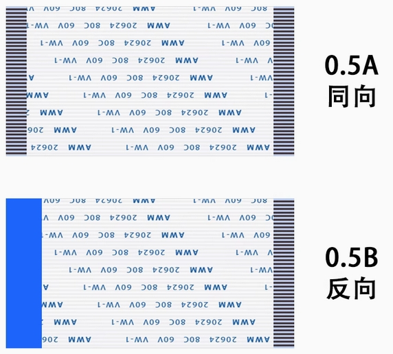
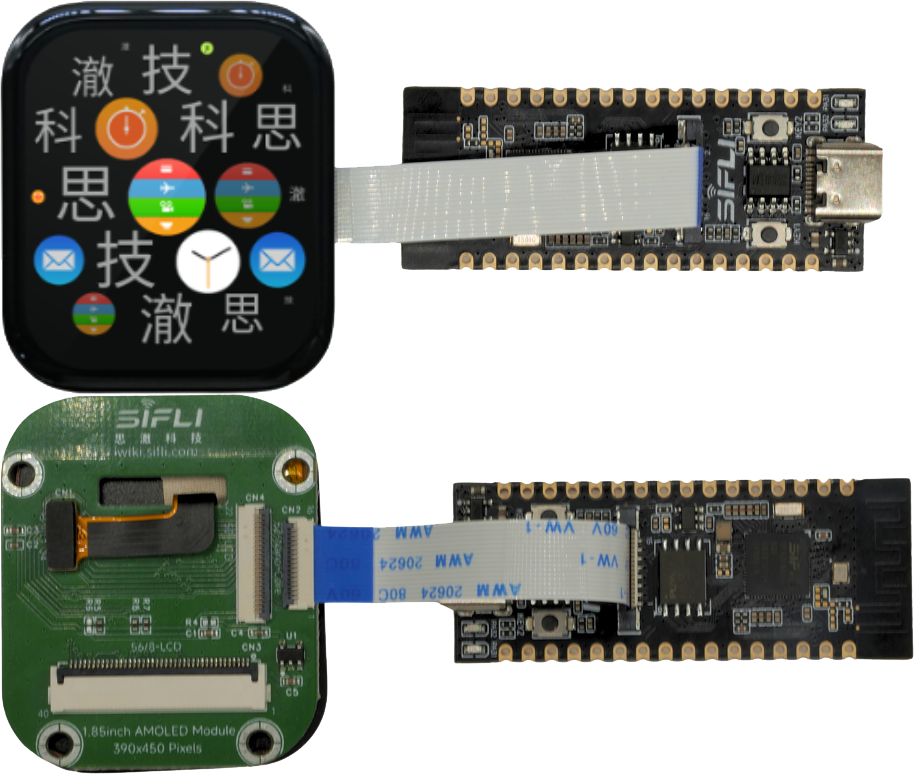
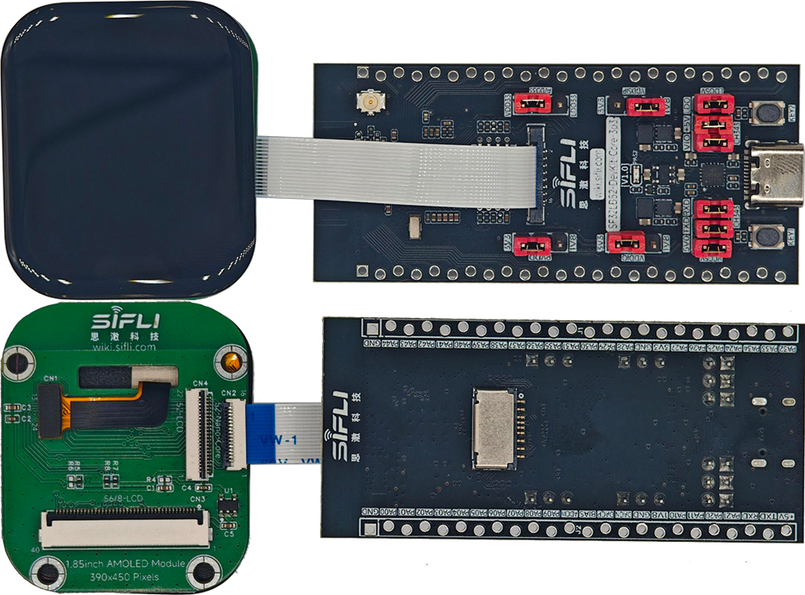
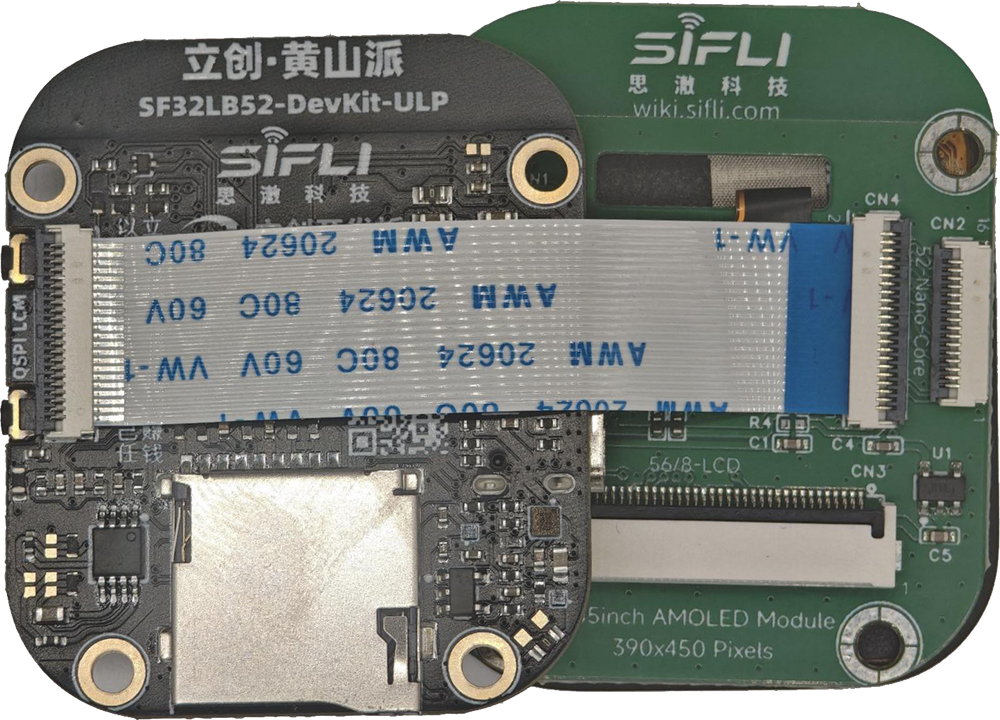
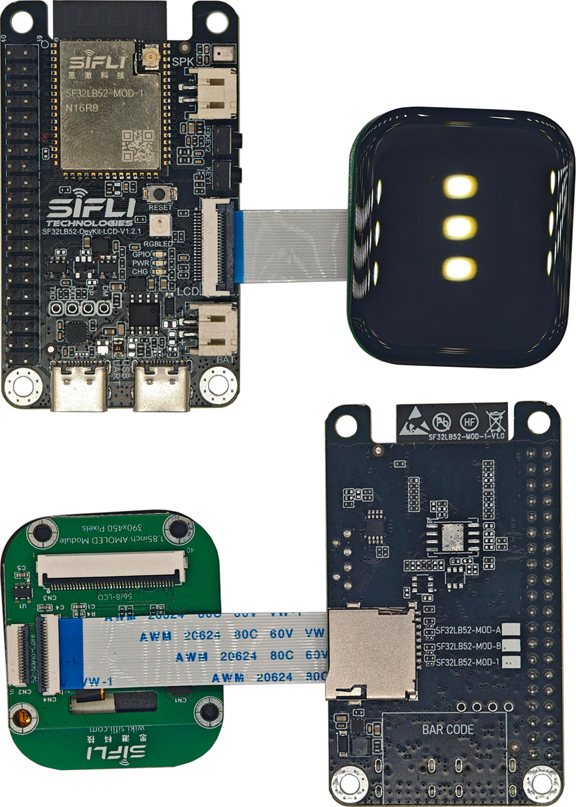
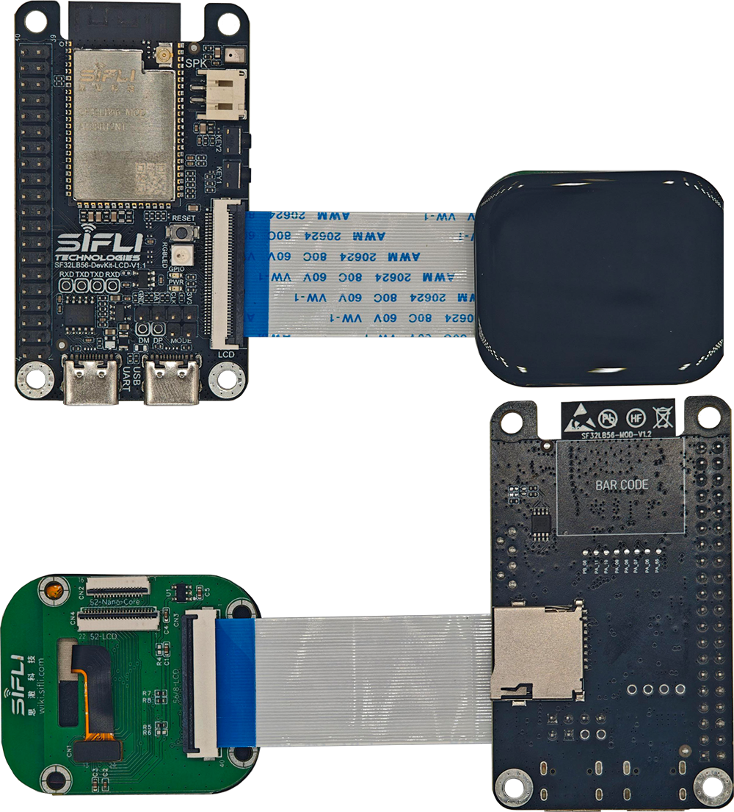
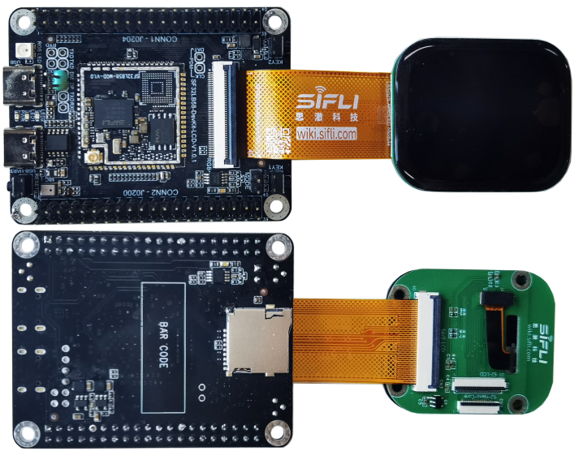

# Guide to Making an LCM Adapter Board for SiFli Development Boards

This document describes how to make a matching adapter board for SiFli development boards to debug third-party displays.

## Display Interface Types on SiFli Development Boards

- 16p QSPI FPC
	- SF32LB52-DevKit-Nano
	- SF32LB52-DevKit-Core
- 22p QSPI FPC
	- SF32LB52-DevKit-LCD
	- SF32LB52-DevKit-ULP (LCSC Huangshan Pi)
- 40p RGB FPC
	- SF32LB56-DevKit-LCD
	- SF32LB58-DevKit-LCD
- 30p MIPI-DSI FPC
	- SF32LB58-DevKit-LCD

## Display Interface Definitions on SiFli Development Boards


### 16p QSPI FPC Interface

<div align="center"> 16p FPC Connector Signal Definition  </div>

```{table}
:align: center
|PIN| DevKit FPC CON PIN-Name      | Descriptions  | LCM PIN-Name |
|:--|:---------|:-----------                       |------    |
|1  | GND      | Power Supply Ground               | GND      |  
|2  | LCD_RST  | LCD reset output Active low       | RESX     |
|3  | BL_PWM   | Back light PWM control output     | BL       |
|4  | TE       | Tearing effect input              | TE       |
|5  | QSPI_CS  | LCD QSPI Chip select output       | CSx      | 
|6  | QSPI_CLK | LCD QSPI clock output             | CLK/WRx  |
|7  | QSPI_D0  | LCD QSPI data 0 inout             | D0/RDx   |
|8  | QSPI_D1  | LCD QSPI data 1 output            | D1/DCx   |
|9  | QSPI_D2  | LCD QSPI data 2 output            | D2       |
|10 | QSPI_D3  | LCD QSPI data 3 output            | D3       |
|11 | 3.3V     | DC 3.3V Power Supply              | VCI      | 
|22 | GND      | Power Supply Ground               | GND      | 
|13 | TP_INT   | TP Interrupt signal inout         | TP-INT   |
|14 | TP_SDA   | TP I2C data signal                | TP-SDA   |
|15 | TP_SCL   | TP I2C clock signal               | TP-SCL   |
|16 | TP_RST   | TP Reset                          | TP-RTN   |

```

### 22p QSPI FPC Interface

<div align="center"> 22p FPC Connector Signal Definition  </div>

```{table}
:align: center
|PIN| DevKit FPC CON PIN-Name      | Descriptions  | LCM PIN-Name |
|:--|:---------|:-----------                       |------    |
|1  | LEDK     | LED cathode                       | LEDK     | 
|2  | LEDA     | LED anode                         | LEDA     | 
|3  | D2/DB0   | LCD QSPI data 2,8080 data 0       | DB0      |
|4  | D3/DB1   | LCD QSPI data 3,8080 data 1       | DB1      |
|5  | DB2      | 8080 data 2                       | DB2      |
|6  | DB3      | 8080 data 3                       | DB3      |
|7  | DB4      | 8080 data 4                       | DB4      |
|8  | DB5      | 8080 data 5                       | DB5      |
|9  | DB6      | 8080 data 6                       | DB6      |
|10 | DB7      | 8080 data 7                       | DB7      |
|11 | TE       | Tearing effect input              | TE       |
|12 | LCD_RST  | LCD reset output Active low       | RESX     |
|13 | CLK      | LCD QSPI clock output             | CLK/WRx  |
|14 | D0/RD    | LCD QSPI data 0 inout             | D0/RDx   |
|15 | CS       | LCD QSPI Chip select output       | CSx      | 
|16 | D1/DC    | LCD QSPI data 1 output            | D1/DCx   |
|17 | 3.3V     | DC 3.3V Power Supply              | VCI      | 
|18 | TP_INT   | TP Interrupt signal inout         | TP-INT   |
|19 | TP_SDA   | TP I2C data signal                | TP-SDA   |
|20 | TP_SCL   | TP I2C clock signal               | TP-SCL   |
|21 | TP_RST   | TP Reset                          | TP-RTN   |
|22 | GND      | Power Supply Ground               | GND      |  

```

### 40p RGB FPC Interface

<div align="center"> 40p FPC Connector Signal Definition  </div>

```{table}
:align: center
|PIN| DevKit FPC CON PIN-Name      | Descriptions  | LCM PIN-Name |
|:--|:---------|:-----------                       |------    |
|1  | 5V       | DC 5V Power Supply                | DC5V     | 
|2  | 5V       | DC 5V Power Supply                | DC5V     | 
|3  | R0       | Red data 0                        | DR0      |
|4  | R1       | Red data 1                        | DR1      |
|5  | R2       | Red data 2                        | DR2      |
|6  | R3       | Red data 3                        | DR3      |
|7  | R4       | Red data 4                        | DR4      |
|8  | R5       | Red data 5                        | DR5      |
|9  | R6       | Red data 6                        | DR6      |
|10 | R7       | Red data 7                        | DR7      |
|11 | GND      | Power Supply Ground               | GND      |
|12 | G0       | Green data 0                      | DG0      |
|13 | G1       | Green data 1                      | DG1      |
|14 | G2       | Green data 2                      | DG2      |
|15 | G3       | Green data 3                      | DG3      |
|16 | G4       | Green data 4                      | DG4      |
|17 | G5       | Green data 5                      | DG5      |
|18 | G6       | Green data 6                      | DG6      |
|19 | G7       | Green data 7                      | DG7      |
|20 | GND      | Power Supply Ground               | GND      |
|21 | B0       | Blue data 0                       | DB0      |
|22 | B1       | Blue data 1                       | DB1      |
|23 | B2       | Blue data 2                       | DB2      |
|24 | B3       | Blue data 3                       | DB3      |
|25 | B4       | Blue data 4                       | DB4      |
|26 | B5       | Blue data 5                       | DB5      |
|27 | B6       | Blue data 6                       | DB6      |
|28 | B7       | Blue data 7                       | DB7      |
|29 | GND      | Power Supply Ground               | GND      |
|30 | CLK      | clock output                      | PCLK     |
|31 | HSYNC    | Horizontal sync signal output     | HSD      |
|32 | VSYNC    | Vertical sync signal output       | VSD      |
|33 | DE       | DE signal when DE mode            | DEN      |
|34 | BL_PWM   | Backlight brightness adjustment signal  | BL-PWM   |
|35 | TP_RST   | TP Reset                          | TP-RTN   |
|36 | TP_SDA   | TP I2C data signal                | TP-SDA   |
|37 | NC       | None connect                      | NC       |
|38 | TP_SCL   | TP I2C clock signal               | TP-SCL   |
|39 | TP_INT   | TP Interrupt signal inout         | TP-INT   |
|40 | LCD_RST  | LCD reset output Active low       | RESX     | 

```

### 30p MIPI-DSI FPC Interface


<div align="center"> 30p FPC Connector Signal Definition  </div>

```{table}
:align: center
|PIN| DevKit FPC CON PIN-Name      | Descriptions  | LCM PIN-Name |
|:--|:---------|:-----------                       |------    |
|1  | GND      | Power Supply Ground               | GND      |
|2  | NC       | None connect                      | NC       | 
|3  | NC       | None connect                      | NC       |
|4  | GND      | Power Supply Ground               | GND      |
|5  | D1P      | MIPI data Lane 1 positive-end output pin   | D1P      |
|6  | D1N      | MIPI data Lane 1 negative-end output pin   | D1N      |
|7  | GND      | Power Supply Groud                | GND      |
|8  | DCKP     | MIPI clock Lane positive-end output pin    | DCKP     |
|9  | DCKN     | MIPI clock Lane negative-end output pin    | DCKN     |
|10 | GND      | Power Supply Ground               | GND      |
|11 | D0P      | MIPI data Lane 0 positive-end output pin   | D0P      |
|12 | D0N      | MIPI data Lane 0 negative-end output pin   | D0N      |
|13 | GND      | Power Supply Ground               | GND      |
|14 | NC       | None connect                      | NC       |
|15 | NC       | None connect                      | NC       |
|16 | GND      | Power Supply Ground               | GND      |
|17 | TE       | Tearing effect input              | TE       |
|18 | LCD_RST  | LCD reset output Active low       | RESX     |
|19 | 1.8V     | I/O interface power supply,1.8V output     | IOVCC    |
|20 | 3.3V     | VCI interface power supply,3.3V output     | VCI      |
|21 | 3.3V     | TP power supply,3.3V output       | TP-VDD   |
|22 | TP_INT   | TP Interrupt signal inout         | TP-INT   |
|23 | TP_SDA   | TP I2C data signal                | TP-SDA   |
|24 | TP_SCL   | TP I2C clock signal               | TP-SCL   |
|25 | TP_RST   | TP Reset                          | TP-RTN   |
|26 | LEDK     | LED cathode                       | LEDK     |
|27 | LEDK     | LED cathode                       | LEDK     |
|28 | NC       | None connect                      | NC       |
|29 | LEDA     | LED anode                         | LEDA     |
|30 | LEDA     | LED anode                         | LEDA     |

```

## LCM Adapter Board Signal Connections

Multiple series of SiFli development boards use a unified graphical interface to fully support displays with common interface types such as SPI (SPI, DSPI, and QSPI), 8080, 8-bit parallel e-paper, JDI, RGB, and DSI.

### SPI, DSPI, and QSPI Interface Displays

<div align="center"> 16p FPC Connector Connected to SPI, DSPI, and QSPI Displays  </div>

```{table}
:align: center
|PIN| DevKit FPC CON PIN-Name | 3W-SPI  | 4W-SPI | DSPI  | QSPI  |
|:--|:------------------------|:--------|:-------|:------|:------|
|1  | GND                     | GND     | GND    | GND   | GND   | 
|2  | LCD_RST                 | RESX    | RESX   | RESX  | RESX  |
|3  | BL_PWM                  | BL      | BL     | BL    | BL    |
|4  | TE                      | NC      | NC     | NC    | TE    |
|5  | QSPI_CS                 | CSx     | CSx    | CSx   | CSx   | 
|6  | QSPI_CLK                | CLK     | CLK    | CLK   | CLK   |
|7  | QSPI_D0                 | RDx     | RDx    | D0    | D0    |
|8  | QSPI_D1                 | NC      | DCx    | D1    | D1    |
|9  | QSPI_D2                 | NC      | NC     | NC    | D2    |
|10 | QSPI_D3                 | NC      | NC     | NC    | D3    |
|11 | 3.3V                    | VDD     | VDD    | VDD   | VDD   | 

```
<br>

<div align="center"> 22p FPC Connector Connected to SPI, DSPI, and QSPI Displays  </div>

```{table}
:align: center
|PIN| DevKit FPC CON PIN-Name | 3W-SPI  | 4W-SPI | DSPI  | QSPI  |
|:--|:------------------------|:--------|:-------|:------|:------|
|1  | LEDK                    | LEDK    | LEDK   | LEDK  | LEDK  | 
|2  | LEDA                    | LEDA    | LEDA   | LEDA  | LEDA  | 
|3  | D2/DB0                  | NC      | NC     | NC    | D2    |
|4  | D3/DB1                  | NC      | NC     | NC    | D3    |
|11 | TE                      | NC      | NC     | NC    | TE    |
|12 | LCD_RST                 | RESX    | RESX   | RESX  | RESX  |
|13 | CLK                     | CLK     | CLK    | CLK   | CLK   |
|14 | D0/RD                   | RDx     | RDx    | D0    | D0    |
|15 | CS                      | CSx     | CSx    | CSx   | CSx   |
|16 | D1/DC                   | NC      | DCx    | D1    | D1    | 
|17 | 3.3V                    | VDD     | VDD    | VDD   | VDD   | 

```
<br>

<div align="center"> 56LCD Development Board 40p FPC Connector Connected to SPI, DSPI, and QSPI Displays  </div>

```{table}
:align: center
|PIN| 56-LCD | 3W-SPI  | 4W-SPI | DSPI  | QSPI  |
|:--|:-------|:--------|:-------|:------|:------|
|1  | 5V     | 5V      | 5V     | 5V    | 5V    | 
|2  | 5V     | 5V      | 5V     | 5V    | 5V    | 
|11 | GND    | GND     | GND    | GND   | GND   | 
|15 | G3     | NC      | NC     | NC    | TE    |
|20 | GND    | GND     | GND    | GND   | GND   | 
|21 | B0     | CSx     | CSx    | CSx   | CSx   |
|22 | B1     | CLK     | CLK    | CLK   | CLK   |
|23 | B2     | RDx     | RDx    | D0    | D0    |
|25 | B4     | NC      | NC     | NC    | D3    |
|26 | B5     | NC      | DCx    | D1    | D1    | 
|27 | B6     | NC      | NC     | NC    | D2    |
|29 | GND    | GND     | GND    | GND   | GND   | 
|40 | LCD_RST| RESX    | RESX   | RESX  | RESX  |

```
<br>

<div align="center"> 58LCD Development Board 40p FPC Connector Connected to SPI, DSPI, and QSPI Displays  </div>

```{table}
:align: center
|PIN| 58-LCD | 3W-SPI  | 4W-SPI | DSPI  | QSPI  |
|:--|:-------|:--------|:-------|:------|:------|
|1  | 5V     | 5V      | 5V     | 5V    | 5V    | 
|2  | 5V     | 5V      | 5V     | 5V    | 5V    | 
|9  | R6     | NC      | NC     | NC    | TE    |
|10 | R7     | CSx     | CSx    | CSx   | CSx   |
|11 | GND    | GND     | GND    | GND   | GND   | 
|12 | G0     | NC      | NC     | NC    | D3    |
|13 | G1     | CLK     | CLK    | CLK   | CLK   |
|14 | G2     | NC      | NC     | NC    | D2    |
|15 | G3     | NC      | DCx    | D1    | D1    | 
|16 | G4     | RDx     | RDx    | D0    | D0    |
|20 | GND    | GND     | GND    | GND   | GND   | 
|29 | GND    | GND     | GND    | GND   | GND   | 
|40 | LCD_RST| RESX    | RESX   | RESX  | RESX  |

```
### MCU-8080 Interface Display

8-bit MCU-8080 is supported only by the 22p and 40p (56-DevKit-LCD) FPC interfaces. The connection methods are shown in the following two tables.

<div align="center"> 22p FPC Connector Connected to MCU-8080 Displays  </div>

```{table}
:align: center
|PIN| DevKit FPC CON PIN-Name      | Descriptions  | MCU-8080 |
|:--|:---------|:-----------                       |------    |
|1  | LEDK     | LED cathode                       | LEDK     | 
|2  | LEDA     | LED anode                         | LEDA     | 
|3  | D2/DB0   | 8080 data 0                       | DB0      |
|4  | D3/DB1   | 8080 data 1                       | DB1      |
|5  | DB2      | 8080 data 2                       | DB2      |
|6  | DB3      | 8080 data 3                       | DB3      |
|7  | DB4      | 8080 data 4                       | DB4      |
|8  | DB5      | 8080 data 5                       | DB5      |
|9  | DB6      | 8080 data 6                       | DB6      |
|10 | DB7      | 8080 data 7                       | DB7      |
|11 | TE       | Tearing effect input              | TE       |
|12 | LCD_RST  | LCD reset output Active low       | RESX     |
|13 | CLK      | Write enable output               | WRx      |
|14 | D0/RD    | Read enable output                | RDx      |
|15 | CS       | Chip select output                | CSx      | 
|16 | D1/DC    | Display data/command select output| DCx      |
|17 | 3.3V     | DC 3.3V Power Supply              | VCI      | 
|18 | TP_INT   | TP Interrupt signal inout         | TP-INT   |
|19 | TP_SDA   | TP I2C data signal                | TP-SDA   |
|20 | TP_SCL   | TP I2C clock signal               | TP-SCL   |
|21 | TP_RST   | TP Reset                          | TP-RTN   |
|22 | GND      | Power Supply Ground               | GND      |  

```
<br>

<div align="center"> 56LCD Development Board 40p FPC Connector Connected to MCU-8080 Displays  </div>

```{table}
:align: center
|PIN| DevKit FPC CON PIN-Name      | Descriptions  | MCU-8080 |
|:--|:---------|:-----------                       |------    |
|1  | 5V       | DC 5V Power Supply                | DC5V     | 
|2  | 5V       | DC 5V Power Supply                | DC5V     | 
|11 | GND      | Power Supply Ground               | GND      |
|12 | G0       | 8080 data 2                       | DB2      |
|13 | G1       | 8080 data 4                       | DB4      |
|14 | G2       | 8080 data 6                       | DB6      |
|15 | G3       | Tearing effect input              | TE       |
|16 | G4       | 8080 data 7                       | DB7      |
|17 | G5       | 8080 data 3                       | DB3      |
|18 | G6       | 8080 data 5                       | DB5      |
|20 | GND      | Power Supply Ground               | GND      |
|21 | B0       | Chip select output                | CSx      |
|22 | B1       | Write enable output               | WRx      |
|23 | B2       | Read enable output                | RDx      |
|25 | B4       | 8080 data 1                       | DB1      |
|26 | B5       | Display data/command select output| DCx      |
|27 | B6       | 8080 data 0                       | DB0      |
|29 | GND      | Power Supply Ground               | GND      |
|40 | LCD_RST  | LCD reset output Active low       | RESX     | 

```
### 8-bit Parallel E-Paper Display Interface

An 8-bit parallel e-paper display requires many I/O interfaces, and the FPC display interface on SiFli development boards cannot meet the I/O count requirement.

For detailed design guidelines, refer to the [8-bit Parallel E-Paper Display Hardware Design Guide](http://wiki.sifli.com).

### JDI Parallel Interface Display

Common interfaces for JDI displays include a 24p parallel interface and a 10p serial interface. The interface pin sequences are shown in the following two tables.

<div align="center"> 24p Parallel JDI Signal Definition  </div>

```{table}
:align: center
|PIN| Signal       | Descriptions                                           | Connect to      |
|:--|:-------------|:-------------------------------------------------------|:----------------|
|1  | LED Cathode 1| Power supply for the LED (Cathode)                     | Onboard circuit | 
|2  | NC           | NC                                                     | NC              | 
|3  | VDD2         | Power supply for the vertical driver and pixel memory  | Onboard circuit |
|4  | JDI_VST      | Start signal for the vertical driver                   | MCU             |
|5  | JDI_ENB      | Write enable signal for the pixel memory               | MCU             |
|6  | FRP          | Liguid crystal driving signal ("Off" pixel)            | MCU             |
|7  | VDD1         | Power supply for the horizontal driver and pixel memory| Onboard circuit |
|8  | JDI_HST      | Start signal for the horizontal driver                 | MCU             |
|9  | JDI_R1       | Red image data (odd pixels)                            | MCU             |
|10 | JDI_G1       | Green image data (odd pixels)                          | MCU             |
|11 | JDI_B1       | Blue image data (odd pixels)                           | MCU             |
|12 | HOUT         | Output from the end of the horizontal shift register   | MCU             |
|13 | VCOM         | Common electrode driving signal                        | MCU             |
|14 | JDI_B2       | Blue image data (odd pixels)                           | MCU             |
|15 | JDI_G2       | Green image data (odd pixels)                          | MCU             |
|16 | JDI_R2       | Red image data (odd pixels)                            | MCU             |
|17 | JDI_HCK      | Shift clock for the horizontal driver                  | MCU             |
|18 | GND          | Ground                                                 | GND             |
|19 | XFRP         | Liguid crystal driving signal ("On" pixel)             | MCU             |
|20 | JDI_XRST     | Reset signal for the horizontal and vertical driver    | MCU             |
|21 | JDI_VCK      | Shift clock for the vertical driver                    | MCU             |
|22 | VOUT         | Output from the end of the vertical shift register     | MCU             |
|23 | LED Anode    | Power supply for the LED (Anode)                       | Onboard circuit |
|24 | LED Cathode 1| Power supply for the LED 2 (Cathode)                   | Onboard circuit |

```
<br>

<div align="center"> 10p Serial JDI Signal Definition  </div>

```{table}
:align: center
|PIN| Signal       | Descriptions                                           | Connect to      |
|:--|:-------------|:-------------------------------------------------------|:----------------|
|1  | JDI_SCLK     | Serial clock signal                                    | MCU             | 
|2  | JDI_SI       | Serial data input signal                               | MCU             | 
|3  | JDI_SCS      | Chip select signal                                     | MCU             |
|4  | JDI_EXTCOMIN | COM inversion polarity input                           | MCU             |
|5  | JDI_DISP     | Display ON/OFF switching signal                        | MCU             |
|6  | VDDA         | Power supply for analog                                | Onboard circuit |
|7  | VDD1         | Power supply for logic                                 | Onboard circuit |
|8  | EXTMODE      | COM inversion mode select terminal                     | Onboard circuit |
|9  | VSS          | Logic ground                                           | Onboard circuit |
|10 | VSSA         | Analog ground                                          | Onboard circuit |

```
For detailed design guidelines, refer to the [JDI Display Hardware Design Guide](http://wiki.sifli.com).

### RGB (MIPI-DPI) Interface Display

Only the SF32LB56-DevKit-LCD and SF32LB56-DevKit-LCD development boards support RGB interface displays. The 40p FPC connector pin sequence on the development board is compatible with the ALIENTEK pin sequence, so an ALIENTEK RGB display can be plugged in directly for use.

Developers can refer to the 40p FPC connector pin sequence defined above and the ALIENTEK RGB display documentation to make a display adapter board.

Third-party RGB display links:
* [IPS Version 7-inch RGB Display Module 1024*600 (ALIENTEK)](https://detail.tmall.com/item.htm?abbucket=17&id=609758563397&rn=b8068af8e33ece4aa2c043b54a77a153&spm=a1z10.5-b-s.w4011-24686329149.72.255354adb0S1oV)
* [HTM-H070A20-RGB-A01C_V0-1](https://item.taobao.com/item.htm?id=845117257237&spm=a213gs.v2success.0.0.42674831Eg7yk8&skuId=5791172462409)

### MIPI (MIPI-DSI) Interface Display

As shown in the 30p FPC connector signal definitions above, the SiFli SF32LB58-DevKit-LCD development board supports up to 2-lane data transmission and MIPI displays with resolutions up to 1280*800.

For adapter board signal connections, refer to the 30p FPC connector pin sequence above. The development board already integrates a constant-current WLED driver circuit. The backlight LEDK and LEDA can provide 100 mA of drive current, and the display backlight supports up to 6 parallel LED channels. The Rset resistor on the development board can be adjusted according to the specific LED structure of the display to meet the actual drive current requirements.

```{important}
1. The I/O level of the development board is 3.3 V. If the I/O level of the driver chip on the LCD adapter board is 1.8 V, use a level-shifter chip to perform level shifting.
2. The data and clock lines for QSPI, 8080, and RGB need 22–47 ohm resistors connected in series.
3. The I2C signals on *-Nano and *-Core development boards do not have pull-up resistors, so I2C pull-up resistors need to be added on the display adapter board.
```
## Adapter Board Backlight Circuit

### TFT Display Backlight Circuit

The backlight of a TFT display is generally composed of LED emitters connected in series and parallel. Depending on the display size, the number of series and parallel backlight LEDs also varies. The bare display datasheet usually describes the backlight LED configuration, which should be used to design the backlight driver circuit.

<div align="center"> Backlight Composition of Common TFT Screen Sizes  </div>

```{table}
:align: center
|Size      | LED Structure        | LED VF&IF            | LED drive circuit |
|:---------|:---------------------|:---------------------|:------------------|
|1.3inch   | 2 parallel           | VF=3.3V,IF=15*2mA    | 3.3V DC drive     |
|2.4inch   | 4 parallel           | VF=3.3V,IF=15*4mA    | 3.3V DC drive     | 
|2.8inch   | 4 parallel           | VF=3.3V,IF=15*4mA    | 3.3V DC drive     |
|3.5inch   | 6 parallel           | VF=3.3V,IF=15*6mA    | 3.3V DC drive     |
|4.2inch   | 8 serial             | VF=25.6V,IF=15mA     | Boost WLED driver |
|5.5inch   | 2 serial *7 parallel | VF=6.4V,IF=105mA     | Boost WLED driver |
|7inch     | 3 serial *6 parallel | VF=9.6V,IF=90mA      | Boost WLED driver |
|10.1inch  | 4 serial *7 parallel | VF=12.8V,IF=105mA    | Boost WLED driver |

```
For a backlight driver circuit using a single LED in a parallel configuration, LEDA can be connected directly to the 3.3 V power supply, and LEDK can be connected directly to GND.

For a backlight driver circuit with multiple LEDs connected in series, common 5 V and 3.3 V supplies do not meet the VF voltage requirement, so the LEDs can only be driven by boosting the voltage. It is recommended to use a constant-current LED driver chip to drive the backlight LEDs. The number of parallel LED channels x 15 mA is the current requirement for the display backlight. As shown in the figure below, Rset is used to set the IF drive current. The FB of the chip is generally 200 mV, and IF=VFB/Rset is the drive current.

 

<div align="center"> Common Constant-Current LED Driver Chip Circuit</div>  <br>  <br>  <br>

### AMOLED Display Backlight Circuit

AMOLED uses pixel-level self-emissive technology and does not have a backlight source like a TFT display. Brightness adjustment is generally performed by adjusting the color of pixels. For example, black means no light emission, and white means maximum brightness. Therefore, no dedicated PWM signal is required to adjust backlight brightness.

AMOLED displays generally include a PMIC chip that provides VGH, VGL, and VCOM voltages to the panel. The display driver chip adjusts the corresponding voltage values through the 1W interface. The PMIC power supply range generally supports 2.7–5.5 V, so 5 V or 3.3 V from the development board FPC connector can be routed to power the PMIC on the display.

 

<div align="center"> Common AMOLED PMIC Chip Circuit</div>  <br>  <br>  <br>


### E-Paper Display Backlight Circuit

The backlight circuit of an e-paper display is relatively complex and uses a dedicated PMIC chip to provide the voltages for the various power supplies of the e-paper display.

Common PMIC power chips include TPS65185 and SY7637A.

For detailed design guidelines, refer to the [8-bit Parallel E-Paper Display Hardware Design Guide](http://wiki.sifli.com).

## FPC Flexible Flat Cable Selection

The FPC connector on the SiFli development board is a top-flip, bottom-contact type. When making an adapter board, it is recommended that the FPC connector on the adapter board use a top-flip, dual-contact top-and-bottom type.

Recommended FPC connector:
- [16p-0.5mm](https://item.szlcsc.com/5909045.html?fromZone=s_s__%2522C5213753%2522&spm=sc.gbn.xh1.zy.n___sc.cidn.hd.ss&lcsc_vid=QAcLUgJQQlQLU1RQEQQKBVEAFAIIU1NQQ1ZZAgJVFVYxVlNTR1FZVFZTTlRfUTsOAxUeFF5JWBIBSRccGwIdBEoFGAxB)
- [22p-0.5mm](https://item.szlcsc.com/5909048.html?fromZone=s_s__%2522C5213756%2522&spm=sc.gbn.xh1.zy.n___sc.gbn.hd.ss&lcsc_vid=QAcLUgJQQlQLU1RQEQQKBVEAFAIIU1NQQ1ZZAgJVFVYxVlNTR1FZVFZTTlRfUTsOAxUeFF5JWBIBSRccGwIdBEoFGAxB)
- [30p-0.5mm](https://item.szlcsc.com/3056931.html?fromZone=s_s__%2522FPC-05FB-30PH20%2522&spm=sc.gbn.xh1.zy.n___sc.it.hd.ss&lcsc_vid=QAcLUgJQQlQLU1RQEQQKBVEAFAIIU1NQQ1ZZAgJVFVYxVlNTR1FZVFZTTlRfUTsOAxUeFF5JWBIBSRccGwIdBEoFGAxB)
- [40p-0.5mm](https://item.szlcsc.com/3056935.html?fromZone=s_s__%2522C2856837%2522&spm=sc.gbn.xh1.zy.n___sc.it.hd.ss&lcsc_vid=QAcLUgJQQlQLU1RQEQQKBVEAFAIIU1NQQ1ZZAgJVFVYxVlNTR1FZVFZTTlRfUTsOAxUeFF5JWBIBSRccGwIdBEoFGAxB)

If a top-flip, dual-contact top-and-bottom FPC connector is used on the adapter board, the FPC flexible flat cable can be a 16p, 22p, 30p, or 40p FPC flexible flat cable with 0.5 mm pitch. The cable contact points can be on the same side or on opposite sides.

 

<div align="center"> Reference FPC Flexible Flat Cable</div>  <br>  <br>  <br>

```{important}
When designing the adapter board, pay attention to the pin 1 position of the FPC connector. If the adapter board directly references the pin sequence and pin 1 position from the development board schematic, the signals will cross when actually connected with a flexible flat cable and the board cannot be used. The solutions include:
1. Modify the pin 1 position in the PCB footprint library for the connector on the adapter board, and start numbering the pins from the opposite direction while keeping the schematic symbol unchanged.
2. Modify the pin 1 position in the schematic symbol library for the connector on the adapter board, and start numbering the pins from the opposite direction while keeping the PCB footprint library unchanged.
```

## SiFli LCM Module

To make it easier for developers to use SiFli development boards to debug display functions, SiFli has launched multiple LCM display modules, including QSPI, RGB, and DSI interfaces. The display sizes include a 1.85-inch AMOLED 390x450 watch display, a 4.3-inch TFT 800x480 display, a 7-inch TFT 1024x600 display, and an 8-inch TFT 1280x800 display.

### 1.85inch AMOLED Module

#### Features

- Size: 1.85-inch rectangular rounded-corner AMOLED watch display, bare display model: ZC-A1D85W-010
- Resolution: 390x450
- Brightness: 800 cd/m2
- Display data interface: QSPI
- Touch data interface: I2C
- OLED Driver IC: CO5300AF-01
- Power IC: BV6802W
- TP IC: FT6146-M00

#### Development Board Support List

- SF32LB52-DevKit-Nano
	- [16p-0.5mm Pitch-5cm Length-Reverse-FPC](https://detail.tmall.com/item.htm?detail_redpacket_pop=true&id=680458377217&ltk2=1750067224011jye1g23u8nodzodf4cqbwg&ns=1&priceTId=213e035a17500671977881818e1d06&query=FPC%2022P%200.5&spm=a21n57.1.hoverItem.4&utparam=%7B%22aplus_abtest%22%3A%229f477038981a766efe59de49bfe14d1d%22%7D&xxc=ad_ztc&sku_properties=148242406%3A56086872)
- SF32LB52-DevKit-Core-****
	- [16p-0.5mm Pitch-5cm Length-Reverse-FPC](https://detail.tmall.com/item.htm?detail_redpacket_pop=true&id=680458377217&ltk2=1750067224011jye1g23u8nodzodf4cqbwg&ns=1&priceTId=213e035a17500671977881818e1d06&query=FPC%2022P%200.5&spm=a21n57.1.hoverItem.4&utparam=%7B%22aplus_abtest%22%3A%229f477038981a766efe59de49bfe14d1d%22%7D&xxc=ad_ztc&sku_properties=148242406%3A56086872)
- SF32LB52-DevKit-ULP (LCSC Huangshan Pi)
	- [22p-0.5mm Pitch-5cm Length-Reverse-FPC](https://detail.tmall.com/item.htm?detail_redpacket_pop=true&id=680458377217&ltk2=1750067224011jye1g23u8nodzodf4cqbwg&ns=1&priceTId=213e035a17500671977881818e1d06&query=FPC%2022P%200.5&spm=a21n57.1.hoverItem.4&utparam=%7B%22aplus_abtest%22%3A%229f477038981a766efe59de49bfe14d1d%22%7D&xxc=ad_ztc&skuId=5623637216836)
- SF32LB52-DevKit-LCD
	- [22p-0.5mm Pitch-5cm Length-Reverse-FPC](https://detail.tmall.com/item.htm?detail_redpacket_pop=true&id=680458377217&ltk2=1750067224011jye1g23u8nodzodf4cqbwg&ns=1&priceTId=213e035a17500671977881818e1d06&query=FPC%2022P%200.5&spm=a21n57.1.hoverItem.4&utparam=%7B%22aplus_abtest%22%3A%229f477038981a766efe59de49bfe14d1d%22%7D&xxc=ad_ztc&skuId=5623637216836)
- SF32LB56-DevKit-LCD
	- [40p-0.5mm Pitch-5cm Length-Reverse-FPC](https://detail.tmall.com/item.htm?detail_redpacket_pop=true&id=680458377217&ltk2=1750067224011jye1g23u8nodzodf4cqbwg&ns=1&priceTId=213e035a17500671977881818e1d06&query=FPC%2022P%200.5&skuId=5791728402036&spm=a21n57.1.hoverItem.4&utparam=%7B%22aplus_abtest%22%3A%229f477038981a766efe59de49bfe14d1d%22%7D&xxc=ad_ztc)
- SF32LB58-DevKit-LCD
	- [40p-0.5mm Pitch-5cm Length-Forward-FPC](http://10.23.10.196:19000/web-file/hardware/files/documentation/FPC_40p_to_1p85-AMOLED-Module%E8%BD%AF%E6%8E%92%E7%BA%BF_2025-07-04.epro?)

#### Development Board and Display Installation Method

 

<div align="center"> SF32LB52-DevKit-Nano Development Board Installation Method</div>  <br>  <br>  <br>

 

<div align="center"> SF32LB52-DevKit-Core-**** Development Board Installation Method</div>  <br>  <br>  <br>

 

<div align="center"> SF32LB52-DevKit-ULP (LCSC Huangshan Pi) Development Board Installation Method</div>  <br>  <br>  <br>

 

<div align="center"> SF32LB52-DevKit-LCD Development Board Installation Method</div>  <br>  <br>  <br>

 

<div align="center"> SF32LB56-DevKit-LCD Development Board Installation Method</div>  <br>  <br>  <br>

 

<div align="center"> SF32LB58-DevKit-LCD Development Board Installation Method</div>  <br>  <br>  <br>

[Adapter Board Reference Design Materials](https://downloads.sifli.com/hardware/files/documentation/SFLCM1p85-A-390-450-Adapter_V1.0.epro?)

### 4.3inch TFT Module
(Coming soon)
### 7inch TFT Module
(Coming soon)
### 8inch TFT Module
(Coming soon)
