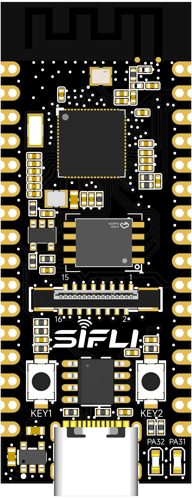
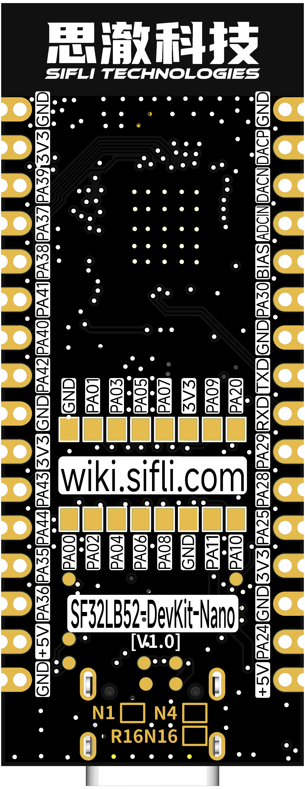
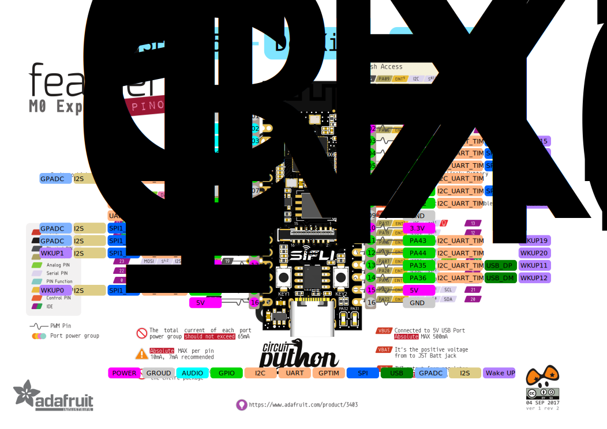
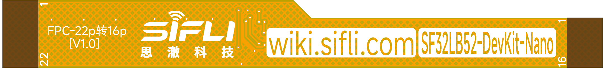

# SF32LB52-DevKit-Nano Development Board User Guide


## Development board version information:

* *-N4-V1.0.0: Configured with the SF32LB52BU56 chip (internally co-packaged with 4 MB NOR Flash). Current version.
* *-R16N16-V1.0.0: Configured with SF32LB52JUD6 (internally co-packaged with 16 MB PSRAM) + 16 MB NOR Flash. Current version.

## 1. Development Board Overview

SF32LB52-DevKit-Nano is a development board based on SiFli Technology's SF32LB52BU56/SF32LB52JUD6 chips. It measures only 21 mm x 51 mm and uses a castellated-hole design along the board edges, making it convenient for developers to use in different scenarios. The development board supports GPIO, UART, I2C, SPI, LCD, I2S, GPADC, PWM, and analog audio input/output.

 

<div align="center"> Front Photo of the Development Board </div>  <br>  <br>  <br>

 

<div align="center"> Rear Photo of the Development Board </div>  <br>  <br>  <br>


## 2. Feature List
This development board has the following features:
1.	Board type:
    - -N4: Onboard SF32LB52BU56 chip, configured as follows:
    
        - Co-packaged configuration:
            - 4 MB NOR Flash, interface frequency 96 MHz
        
    - -R16N16: Onboard SF32LB52JUD6 chip, configured as follows:
    
        - Co-packaged configuration:
            - 16 MB OPI-PSRAM, interface frequency 144 MHz
        
        - Onboard 128 Mb QSPI-NOR Flash, interface frequency 72 MHz, STR mode 
2.	Crystal
    - 48 MHz crystal
    - 32.768 kHz crystal
3.	Antenna
    - Onboard PCBA antenna
4.	GPIO
    - LCC castellated holes support 17 GPIOs
    - LGA pins support 13 GPIOs
5.	UART-I2C-GPTIM
    - 3x UART
    - 4x I2C
    - 2x GPTIM
    - All GPIOs can be configured for UART, I2C, and GPTIM
6.	SPI
    - 2x SPI
7.	GPADC
    - 3x GPADC
9.	Display
    - FPC16P, 0.5 mm-pitch connector for display expansion
    - SPI/DSPI/Quad SPI, supports DDR-mode QSPI display interface
    - Supports touchscreens with an I2C interface
    - Supports the Huangshan Pi 1.85-inch AMOLED display through a 16p-to-22p flat cable
10.	Audio
    - Supports audio ADC input and can connect to an analog microphone or silicon microphone
    - Supports PDM digital microphone input
    - Analog audio output requires an external Class-AB/D audio PA to drive the speaker
    - All interfaces are routed out through LCC castellated holes
11.	USB
    - Type-C-UART interface, with onboard CH340N serial chip for firmware flashing and software debugging, and can supply power
    - USB interface, supports USB 2.0 FS and is routed out through LCC castellated holes
12.  Buttons
    - 1x Function Buttons
    - 1x Power Buttons, supports reset by long-pressing for 10s
13.  LED
    - 2x LEDs, GPIO-controlled
14. Power
    - Powered through the USB Type-C interface
    - Onboard LDO chip for converting VBUS 5 V to 3.3 V
    - Onboard power switch, with enable controlled through the RTS# pin of the CH340N to implement MCU reset 

## 3. Pin Definition

 

<div align="center"> Front Pinout of the Development Board (click to enlarge) </div>  <br>  <br>  <br>

 

<div align="center"> Rear PinOut of the Development Board (click to enlarge) </div>  <br>  <br>  <br>

### Detailed Pin Description

The following table provides detailed descriptions of the pins on the SF32LB52-DevKit-Nano development board.

<div align="center"> LEFT LCC (J1) Pin Description Table </div>

```{table}

|Pin|	Pin Name           	   |   Reset Default and Multiplexed Functions  | Pull-up/Pull-down |
|:--|:-----------------------|:-----------|------|
|1 | GND   | Ground                     |  |
|2 | DACP  | Analog Audio output signal          |  |
|3 | DACN  | Analog Audio output signal          |  |
|4 | MIC_ADC  | MIC input signal           |  |
|5 | MIC_BIAS | MIC bias voltage           |  |
|6 | PA30  | **PA30**, UART, I2C, GPTIM, I2S1_LRCK, and GPADC2  | PD |
|7 | GND   | Ground                     | 
|8 | PA19  | **UART0_TXD**, debug and download port, PA19, SWCLK, I2C, GPTIM    | None |
|9 | PA18  | **UART0_RXD**, debug and download port, PA18, SWDIO, I2C, GPTIM    | PU |
|10 | PA29 | **PA29**, UART, I2C, GPTIM, SPI1_CS, I2S1_BCK, and GPADC1   | PD |
|11 | PA28 | **PA28**, UART, I2C, GPTIM, SPI1_CLK, I2S1_SDI, and GPADC0  | PD |
|12 | PA25 | **PA25**, UART, I2C, GPTIM, SPI1_DI, I2S1_SDO, and WKUP1    | PD |
|13 | 3.3V | 3.3VPower. When USB TypeC is not plugged in, it can be used as a 3.3V input; when USB TypeC is plugged in, it can be used as a 3.3V output    |  |
|14 | GND  | Ground                     |  |
|15 | PA24 | **PA24**, UART, I2C, GPTIM, SPI1_DIO, I2S1_MCLK, and WKUP0  | PD |
|16 | 5V   | 5VPower. When USB TypeC is not plugged in, it can be used as a 5V input; when USB TypeC is plugged in, it can be used as a 5V output    |

```

<div align="center"> RIGHT LCC (J2) Pin Description Table </div>

```{table}

|Pin|	Pin Name           	   |   Reset Default and Multiplexed Functions  | Pull-up/Pull-down |
|:--|:-----------------------|:-----------|------|
|1 | GND   | Ground                     |  |
|2 | 3.3V  | 3.3VPower. When USB TypeC is not plugged in, it can be used as a 3.3V input; when USB TypeC is plugged in, it can be used as a 3.3V output    |  |
|3 | PA39  | **PA39**, UART, I2C, GPTIM, SPI2_CLK, and WKUP15   | PU |
|4 | PA37  | **PA37**, UART, I2C, GPTIM, SPI2_DIO, and WKUP13   | PD |
|5 | PA38  | **PA38**, UART, I2C, GPTIM, SPI2_DI, and WKUP14    | PD |
|6 | PA41  | **PA41**, UART, I2C, GPTIM, and WKUP17             | PU |
|7 | PA40  | **PA40**, UART, I2C, GPTIM, SPI2_CS, and WKUP16    | PU |
|8 | PA42  | **PA42**, UART, I2C, GPTIM, and WKUP18             | PU |
|9 | GND   | Ground                     |  |
|10 | 3.3V | 3.3VPower. When USB TypeC is not plugged in, it can be used as a 3.3V input; when USB TypeC is plugged in, it can be used as a 3.3V output    |  |
|11 | PA43 | **PA43**, UART, I2C, GPTIM, and WKUP19             | PD |
|12 | PA44 | **PA44**, UART, I2C, GPTIM, and WKUP20             | PD |
|13 | PA35 | **PA35**, UART, I2C, GPTIM, USB_DP, and WKUP11     | PD |
|14 | PA36 | **PA36**, UART, I2C, GPTIM, USB_DM, and WKUP12     | PD |
|15 | 5V   | 5VPower. When USB TypeC is not plugged in, it can be used as a 5V input; when USB TypeC is plugged in, it can be used as a 5V output    |  |
|16 | GND   | Ground                     |  |

```


### 16-pin QSPI FPC Interface Pinout Definition

<div align="center"> 16p FPC Connector Signal Definition  </div>

```{table}

|Pin|	Pin Name           	   |   Reset Default and Multiplexed Functions  | Pull-up/Pull-down |
|:--|:-----------------------|:-----------|------|
|1  | GND    | Ground                        |      | 
|2  | PA_00 | **PA00**, UART, I2C, GPTIM, and LCD_RST   | PD   |
|3  | PA_01 | **PA01**, UART, I2C, GPTIM, and BL_PWM    | PD   |
|4  | PA_02 | **PA02**, UART, I2C, GPTIM, LCD_TE, and I2S1_MCLK   | PD   |
|5  | PA_03 | **PA03**, UART, I2C, GPTIM, LCD_CS, and I2S1_SDO    | PU   | 
|6  | PA_04 | **PA04**, UART, I2C, GPTIM, LCD_CLK, and I2S1_SDI   | PD   |
|7  | PA_05 | **PA05**, UART, I2C, GPTIM, LCD_D0, and I2S1_BCK    | PD   |
|8  | PA_06 | **PA06**, UART, I2C, GPTIM, LCD_D1, and I2S1_LRCK   | PD   |
|9  | PA_07 | **PA07**, UART, I2C, GPTIM, LCD_D2, and PDM1_CLK    | PD   |
|10 | PA_08 | **PA08**, UART, I2C, GPTIM, LCD_D3, and PDM1_DAT    | PD   |
|11 | 3.3V  | 3.3V Power output                  |      | 
|12 | GND    | Ground                        |      | 
|13 | PA_09 | **PA09**, UART, I2C, GPTIM, and CTP_INT    | PD   |
|14 | PA_11 | **PA11**, UART, I2C, GPTIM, and CTP_SDA    | PU   |
|15 | PA_20 | **PA20**, UART, I2C, GPTIM, and CTP_SCL    | PD   |
|16 | PA_10 | **PA10**, UART, I2C, GPTIM, and CTP_RST    | PD   |

```

## 4. Feature Introduction

### Power Supply Description

The development board supports the following three power supply methods:

- Powered through the USB Type-C interface (default)
- Power supply via 5V and GND pin headers
- Power supply via 3.3V and GND pin headers

Recommended power supply method during debugging: power supply via the USB Type-C connector.

### LED Control

The development board has two onboard LEDs. Developers can refer to the table below to control the corresponding pins.

<div align="center"> LED Signal Control Table  </div>

```{table}

|LED No.|	Corresponding GPIO           	   |   Description  |
|:--|:-----------------------|:-----------|
|LED1  | PA31    | On at low level                 |
|LED2  | PA32    | On at low level                 |
```

### External Flash

The development board has one onboard flash device (depending on the board type, it may or may not be soldered). Supported types:

- SPI NOR Flash, WSON8-8x6mm or WSON8-6x5mm
- SPI NAND Flash, WSON8-8x6mm
- SD  NAND Flash, WSON8-8x6mm

<div align="center"> Flash Signal Definitions  </div>

```{table}

|Pin|	Pin Name           	   |   Reset Default and Multiplexed Functions  | Pull-up/Pull-down |
|:--|:-----------------------|:-----------|------|
|1  | PA_12 | **PA12**, UART, I2C, GPTIM, MPI2_CS, and SD1_D2    | PU   |
|2  | PA_13 | **PA13**, UART, I2C, GPTIM, MPI2_D1, and SD1_D3    | PD   |
|3  | PA_14 | **PA14**, UART, I2C, GPTIM, MPI2_D2, and SD1_CLK   | PD   |
|4  | PA_15 | **PA15**, UART, I2C, GPTIM, MPI2_D0, and SD1_CMD   | PD   |
|5  | PA_16 | **PA16**, UART, I2C, GPTIM, MPI2_CLK, and SD1_D0    | PD   | 
|6  | PA_17 | **PA17**, UART, I2C, GPTIM, MPI2_D3, and SD1_D1    | PD   |
```

<div align="center"> Board Type and Flash Information Mapping Table  </div>

```{table}

|Development Board Model|	MCU Co-packaged Specification           	   |   On-board Specification  |
|:--|:-----------------------|:-----------|
|SF32LB52-DevKit-Nano-N4      | 4MB SPI NOR Flash | None    |
|SF32LB52-DevKit-Nano-R16N16  | 16MB OPI PSRAM | 16MB SPI NOR Flash    |
```

### Buttons

The development board has two onboard buttons whose functions must be defined in software. KEY1 supports hardware reset by pressing and holding for 10 seconds. Developers can refer to the table below to control the corresponding pins.

<div align="center"> Buttons Signal Control Table  </div>

```{table}

|Buttons No.|	Corresponding GPIO           	   |   Description  |
|:--|:-----------------------|:-----------|
|KEY1  | PA34    | Active high; supports reset by long-pressing for 10 seconds |
|KEY2  | PA33    | Active high                |
```

### Flashing and Debugging

Connect a USB cable to the USB-to-UART port, open SiFli Technology's firmware flashing tool, and select the corresponding COM port and firmware.
1.  Download Mode
    - Check the BOOT option and power on. After startup, the board enters download mode, and firmware flashing can be completed.
2.  Software Development Mode
    - Clear the BOOT option and power on. After startup, the board enters serial port log output mode, which is software debugging mode.
3. Development Board Reset
    - Reset the MCU by controlling the RTS# pin of the CH340N through the PC tool.

**For details, refer to&emsp;[Firmware Flashing Tool Impeller](烧录工具)**

```{note}
Some development boards, such as Huangshan Pi and SF32LB52-DevKit-Nano-N16R16, reset through the RTS pin of the onboard USB-to-UART chip. This is mainly intended to make board reset easier. The newer SifliTrace tool already supports RTS reset.

Q: This design can cause an inconvenience: after the board is powered on again, the first serial-port connection made by a tool may trigger a board reset. In some cases, opening the serial port during use may power off the board.

A: Disable hardware flow control to resolve this issue. Open Device Manager -> right-click the port and select Properties -> Port Settings (Advanced) -> select Disable modem control.

```


### LCD Display Interface

The development board supports QSPI-interface LCD screens. The connector is a vertical 16p-0.5pitch FPC, flip-up, bottom-contact type.
Refer to the signal pin sequence defined above. If the pin sequence differs, use an adapter board for testing; see the SF32LB52-DevKit-LCD Adapter Board Fabrication Guide.

The Huangshan Pi display can be connected directly using an FPC-22p to 16p flexible flat cable.

 

<div align="center"> FPC Adapter Flex Cable </div>  <br>  <br>  <br>

[Reference](https://downloads.sifli.com/hardware/files/documentation/ProPrj_FPC_22p_to_16p%E8%BD%AF%E6%8E%92%E7%BA%BF.epro?) 

### Audio Expansion

The development board requires an external microphone and a differential audio power amplifier.

- [Reference Electret Microphone Board](https://item.taobao.com/item.htm?id=891546819215&pisk=g3ttX5NYqXciCTxOKdu3mg2lmpDkD2vNvCJ7msfglBdphC1GiNsbdM6A3l1f5K6fDBOmQ1vj_IKAOG_2SsfGMip2wFhoq0vwQiSSZbmk_owrJgP_f1Ncdk6RDONxuxqpQiSjZbmoqdJwNSry3l6fdvBG3tsfGl1IpT6lcl_bfyNCT6sbfO__Ry6fhSZ1GIwIAtX8crZf5D_CnTIfGI6jpp1Fhi1j9jlAOR10DUgQANrLBEqbcHBORwv11a7-n97T3dfac9-NB05WC6Ebm14gj8ppIfEyKG-MwTAiAldJhL8fJnFIws-pdhTXL5hAXpAw2Gt-6lXhv1Q5d3M0z6xdsItORYqRoMtlPGTn8fbcXts1zek4SsTXe3IMsXrfsUpB9ax3tujWzBKAPgsr_3xJmCVlwt4tpna4uN6E_bxHypqU4QWdZAnYur7ELo49mA44uw-Pp_DtWrzV8X5..&spm=a21xtw.29178619.product_shelf.3.34d33772zuSkO1&skuId=5740404937614)
- [Reference MEMS Microphone Board](https://detail.tmall.com/item.htm?id=814534179060&ns=1&pisk=g53Se-TCQTXSM7adOuA4GovZEnUEB2t27L5IsfeFzMU-hJej6Q2yx3DIcvH048eyZyZKpYHQxQ2UpJME90oW7FloZy4KRd8w7X1wqAH79uIJ9ZF_9IPRFEzkwy4pQd8w7bcu-A0VoWbdDSe0NMFKpuIvk72Y9gUKp-EY65W8JvHpksF3TaILvWIvG7VCJge8prBYaWILpvUpGje09yF-pyhh41NBV8cWwk_r8dRlbJwfJw3bMJDrGUSQ3cNSvRGRYjGxlNq7Bbef8d9YgqwQnVp2cjDr2YPmdF9bWcDjRlUBPOVSDfaYUPLRkzuowcEKWpjKNzwSpkiDCNP7zmZsP0AhHbHaFcUoT19rGkFsrzo2FNetfbnai2JcyJixv4ru-TpQKqGxyDsrmNy1kVsCGlbLGgAXGMjHuIb4G5SWKTq8i7Z2GI6-xObd8iRXGTnu2SV77IOfevf..&priceTId=213e054e17429838198525727ea59a&skuId=5678321102126&spm=a21n57.1.hoverItem.1&utparam=%7B%22aplus_abtest%22%3A%22730abba11fa183522caa7f9e2e59074c%22%7D&xxc=ad_ztc)
- [Reference Audio Power Amplifier Board](https://item.taobao.com/item.htm?id=12602258834&pisk=g0_-U1DKS-2uuY_Ji_rm-FD4yzVGJofPMT5s-pvoAtBAOT9kKBTBGjOptDiCOpYdp9BpEHwyrwBvzZjo-L2yJ66MWR2gSPfPaF8QIRD0Vn9v5CJINvAShrTH9SVDsp5Pae8QIR4gS_kKdDDKAB9QMrOBteOBRHNYlBpjPBgWOxNv3KgWN3tWhrOkwQiCd3tjcBRHO0gIRKOX3BTBd9TQMs92OfrQpKGWK2I_ccEC086nR2_vwntcNLGv-ZOJCdCSx2gIYQKJC_94QNZ2_n1evwlEJnf5b9R1FYwpLZCfPG6_n0v5XBCGvOUs8IS5eZtdoWzNMUIAkUb7Lc5cMLt9oiq4EHYReGJwVoyVChCGjU7_HV9dVTWebw2ZzL1C_NSMWzHwwi19kgyOSNQhEAv9t0FARDoeVIyzIZjt6G1omIpgwynEYnPq-0Q3ZDoe0NRvI7E-YD-43&spm=a21xtw.29178619.product_shelf.2.654a20dbhEwOYd)

### PCB Component Location Lookup

<a href="../../_static/SF32LB52-DevKit-Nano-%E8%BE%85%E5%8A%A9%E7%84%8A%E6%8E%A5.html">SF32LB52-DevKit-Nano-PCB</a> 

## 5. Obtaining Samples

Retail samples and small batches can be purchased directly from [Taobao](https://sifli.taobao.com/). Volume customers can email sales@sifli.com or contact customer service on Taobao for sales contact information.
Open-source contributors may apply for free samples and can join QQ group 674699679 for discussion.


## 6. Related Documents

- [SF32LB52x Chip Datasheet](https://wiki.sifli.com/silicon/index.html)
- [SF32LB52x User Manual](https://wiki.sifli.com/silicon/index.html)
- [SF32LB52-DevKit-Nano Design Drawings](https://downloads.sifli.com/hardware/files/documentation/SF32LB52-DevKit-Nano_V1.0.0.zip?)
- [SF32LB52-DevKit-LCD Adapter Board Fabrication Guide](SF32LB52-DevKit-LCD-Adapter)
