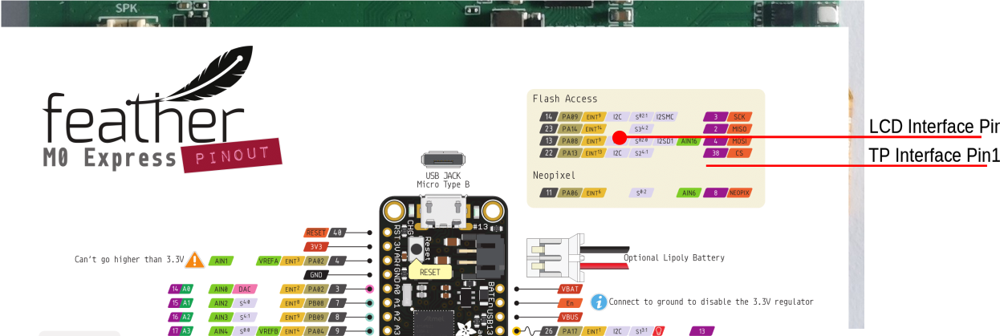
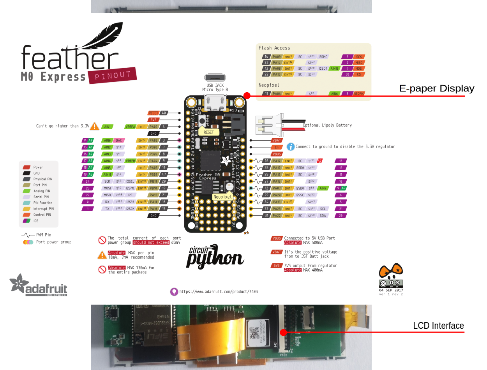
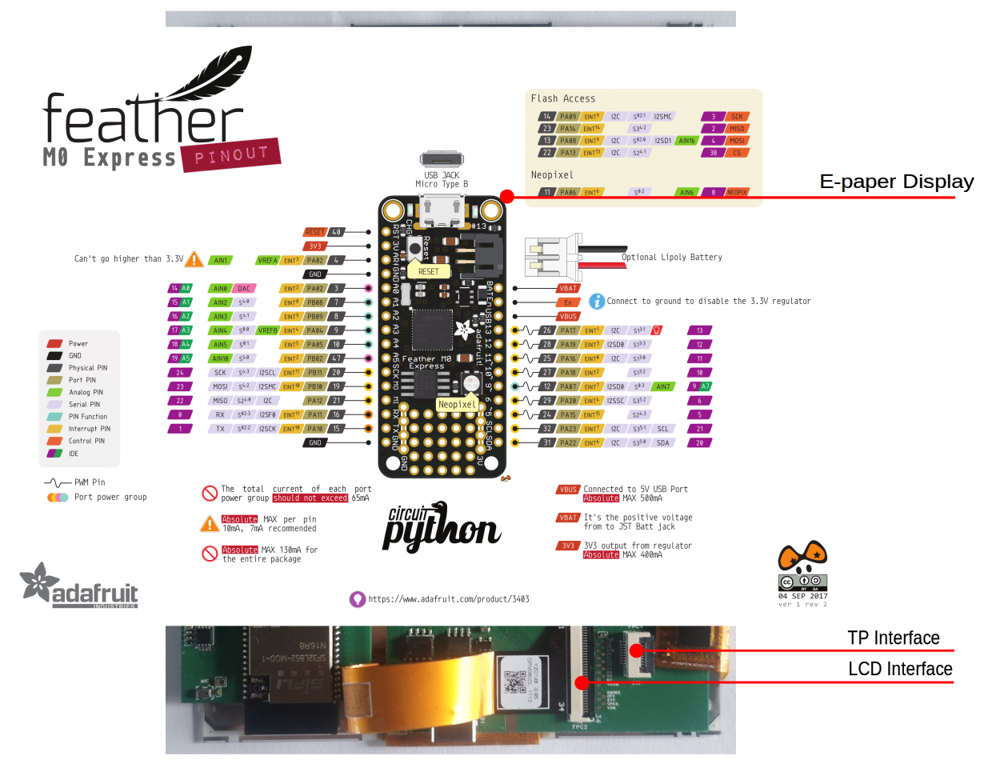
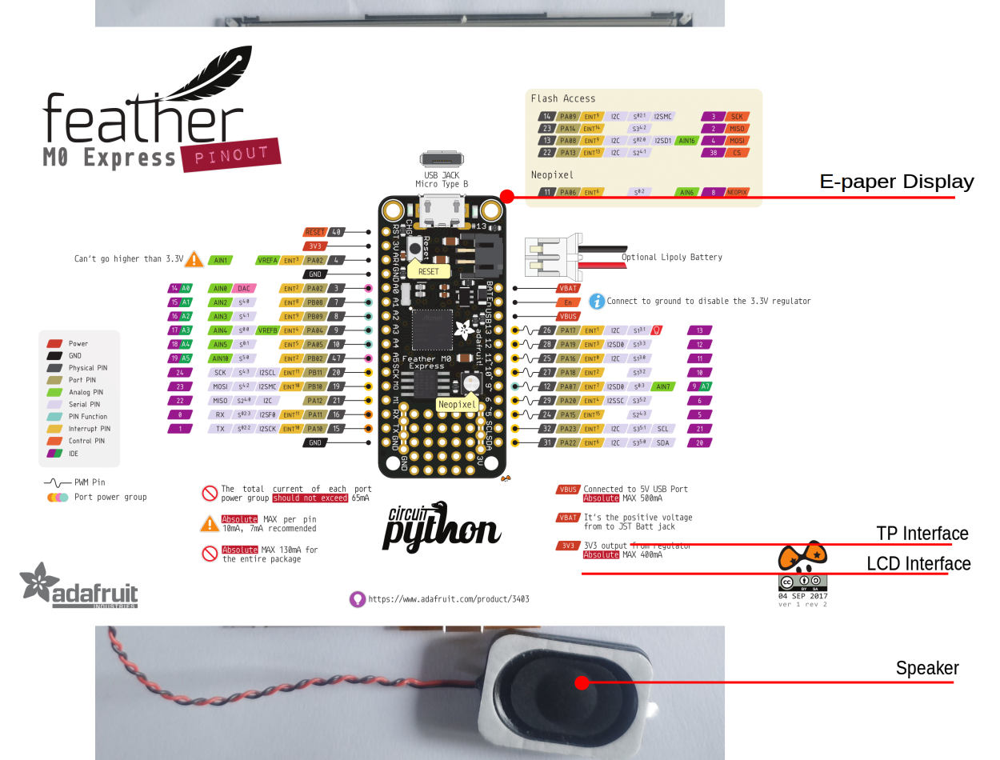
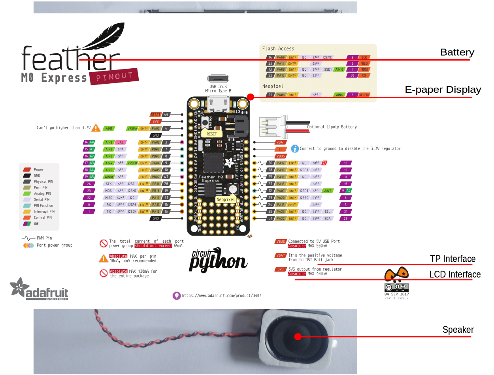
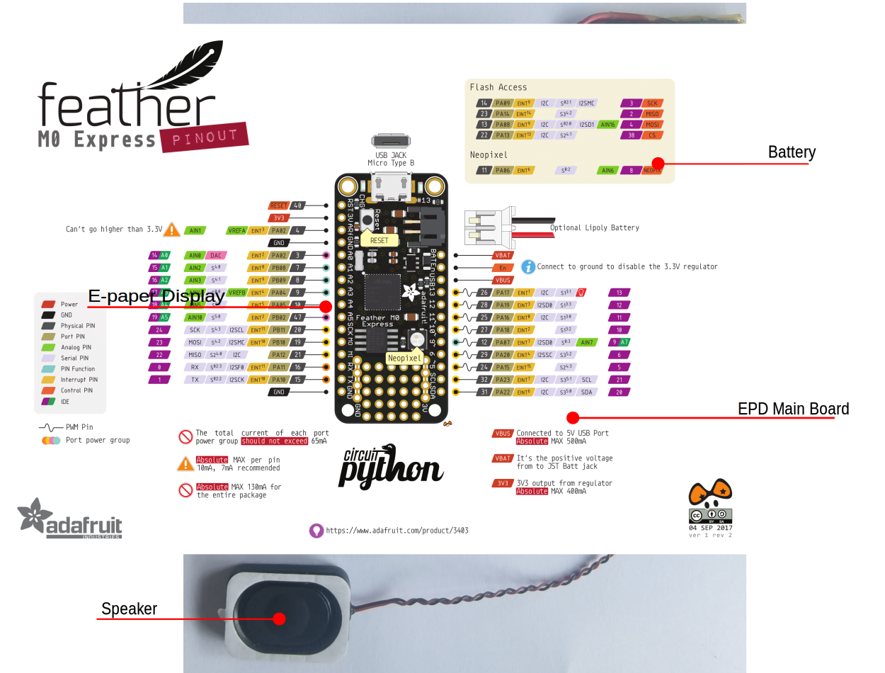

# SF32LB52-OED-6'-EPD Development Board User Guide

## Development Board Overview

The SF32LB52-OED-6'-EPD is an e-paper display development board based on the SF32LB52-MOD-1 module. It supports a `758 x 1024 (XGA) 6-inch e-paper display`, and also supports `analog MIC input`, `analog audio output`, `SDIO interface`, `TF card`, `A+G Sensor`, and `H+T Sensor`, providing developers with abundant hardware interface resources. It can be used to develop various e-paper display applications, helping developers simplify the hardware development process and shorten time to market.

 

<div align="center"> Front Photo of the Development Board </div>  <br>  <br>

 

<div align="center"> Rear Photo of the Development Board </div>  <br>  <br>

### Feature List
This development board has the following features:
1.	Module: onboard SF32LB52-MOD-1-N16R8 module, configured as follows:
    - Standard SF32LB525UC6 chip, with the following built-in co-packaged configuration:
        - 8MB OPI-PSRAM, interface frequency 144MHz
    - 128Mb QSPI-NOR Flash, interface frequency 72MHz, STR mode
    - 48 MHz crystal
    - 32.768 kHz crystal
    - Onboard antenna or IPEX antenna connector, selected through a 0-ohm resistor; onboard antenna by default
    - RF matching network and other resistor, capacitor, and inductor components
2.	Dedicated display interface
    - 8-bit EPD parallel driver interface, brought out through a 34-pin FPC
    - Supports touchscreens with an I2C interface
3.	Audio
    - Supports analog MIC input
    - Analog audio output, onboard Class-D audio PA
4.	Sensor
    - Supports a 6-axis accelerometer + gyroscope sensor
    - Supports a humidity + temperature sensor
5.	USB
    - Type-C interface, supports the onboard USB-to-serial chip for firmware flashing and software DEBUG, and can be used to supply power
6.	Charger
    - Onboard 1A linear charger, equipped with a 1500mAh lithium battery, and supports charger insertion detection.
7.	SD Card
    - Supports TF cards using the SPI interface, with an onboard Micro SD card slot

### Functional Block Diagram

 

<div align="center"> Development Board Functional Block Diagram </div>  <br>  <br>

### Component Introduction

The main board of the SF32LB52-OED-6'-EPD development board is the core of the entire kit. It has an onboard SF32LB52-MOD-1-N16R8 module and provides a 34P FPC connector for connecting the EPD display.

 

<div align="center"> Function Description </div>  <br>  <br>

## E-Paper Display Kit Assembly Introduction

### Display Installation

The LCD and TP of the e-paper display use separate FPCs, which are installed onto the development board through the FPC connectors. The FPC flexible flat cables for the display and TP are fragile, so handle them carefully during installation. FPC installation is shown in the figure below:

 

<div align="center"> Installation Photo of E-Paper Display and Touch Interfaces </div>  <br>  <br>

Install the 6-inch e-paper display onto the development board:

 

<div align="center"> Installation Photo of the E-Paper Display Kit Display Interface </div>  <br>  <br>

 

<div align="center"> Installation Photo of the E-Paper Display Kit Touchscreen Interface </div>  <br>  <br>

### Speaker Installation

The development board supports speakers with an MX1.25 type 2P terminal connector. A speaker with a 3Ω/4W specification is recommended. Installation is shown in the figure below:

 

<div align="center"> E-Paper Display Kit Speaker Installation Photo </div>  <br>  <br>

### Battery Installation

The development board supports lithium batteries with an MX1.25 type 2P terminal connector. A 1500mAh lithium battery is recommended. Installation is shown in the figure below:

 

<div align="center"> E-Paper Display Kit Battery Installation Photo </div>  <br>  <br>

### Complete E-Paper Display Kit

After the display, speaker, and battery are installed on the development board, the correct installation is shown in the figure below:

 

<div align="center"> Complete E-Paper Display Kit Photo </div>  <br>  <br>

## Application Development

This section mainly describes how to set up the hardware and software, flash firmware to the development board, and develop applications.

### Required Hardware

- 1x SF32LB52-OED-6'-EPD (including SF32LB52-MOD-1-N16R8 module)
- 1x LCD module (奥翼 6-inch e-paper display OPM060DA)
- 1x 1000mAh ~ 1500mAh lithium battery
- 1x USB2.0 data cable (standard Type-A to Type-C)
- 1x computer (Windows, Linux, or macOS)

```{note}
1. When using the development board, the battery must be connected. The USB cable is used only for charging, serial port debugging, or firmware flashing.
2. Make sure to use an appropriate USB data cable. Some cables are for charging only and cannot be used for data transfer or firmware flashing.
```
### Optional Hardware

- 1x speaker
- 1x TF Card

### Hardware Setup

Prepare the development board and load the first sample application:

1.	Correctly connect the e-paper display flexible flat cable to the development board;
2.  Correctly connect the battery to the development board;
3.	Open SiFli's SifliTrace tool software and select the correct COM port;
4.	Plug in the USB data cable to connect the PC to the USB-to-UART port on the development board;
5.	The LCD display lights up, and you can interact with the touchscreen using your finger.

Hardware setup is complete. You can now proceed with software setup.


### Software Setup

For how to quickly set up the development environment for the SF32LB52-OED-6'-EPD development board, refer to the software-related documents. 

## Hardware Reference

This section provides more information about the development board hardware.

### GPIO Assignment List

The table below lists the GPIO assignments for the pins of the SF32LB52-MOD-1-N16R8 module, used to control specific components or functions on the development board.

```{table}
:width: 100%
:align: center
:name: SF32LB52-MOD-1-N16R8-GPIO-LIST

|Pin|	Pin Name     |   Function                                     |
|:--|:-------------|:------------------------------------------|
|1  | GND          | Ground                                       |
|2  | PA_44        | TPS_PWRCOM, EPD power VCOM enable                 |
|3  | PA_43        | EDP_D7, EPD signal                            |
|4  | PA_42        | EDP_D6, EPD signal                            |
|5  | PA_23        | XTAL32K_XO, default NC                         |
|6  | PA_22        | XTAL32K_XI, default NC                         |
|7  | PA_41        | EDP_D5, EPD signal                            |
|8  | PA_40        | EDP_D4, EPD signal                            |
|9  | PA_39        | EDP_D3, EPD signal                            |
|10 | PA_38        | TPS_PWRUP, EPD power-on control                  |
|11 | PA_37        | EDP_D2, EPD signal                            |
|12 | PA_36        | SENSOR_SDA, sensor I2C SDA interface              |
|13 | PA_35        | SENSOR_SCL, sensor I2C SCL interface              |
|14 | PA_34        | HOME and long-press reset button                           |
|15 | PA_33        | ADC function button, supports two KEYs                     |
|16 | PA_32        | CTP_3.3V power enable                            |
|17 | VDD33_VOUT2  | 3.3V power output (no output by default; output is available only after software configuration)|
|18 | PA_24        | SPI1_DIO, SD Card interface signal                      |
|19 | PA_25        | SPI1_DI, SD Card interface signal                       |
|20 | PA_26        | CHG_STATUS, charging status indicator signal                 |
|21 | PA_27        | SD Card_CD signal, LED                            |
|22 | PA_28        | SPI1_CLK, SD Card interface signal                      |
|23 | PA_29        | SPI1_CS, SD Card interface signal                       |
|24 | PA_30        | CTP_INT, touchscreen interrupt signal                      |
|25 | PA_31        | CTP_RST, touchscreen reset signal                      |
|26 | GND          | Ground                                       |
|27 | VSYS         | 3.2~4.7V power input                            |
|28 | PA_20        | TPS_WAKEUP, EPD power wake-up signal                 |
|29 | PA_19        | DB_UART_TXD, program download and software debugging interface          |
|30 | PA_18        | DB_UART_RXD, program download and software debugging interface          |
|31 | PA_11        | TPS_SDA, touchscreen I2C                         |
|32 | PA_10        | TPS_SCL, touchscreen I2C                         |
|33 | AU_DAC1P_OUT | analog Audio output signal                            |
|34 | AU_DAC1N_OUT | analog Audio output signal                            |
|35 | GND          | Ground                                       |
|36 | MIC_BIAS     | MIC bias voltage                                |
|37 | MIC_ADC_IN   | MIC input signal                                |
|38 | PA_09        | EDP_LE, EPD signal                            |
|39 | PA_08        | EDP_D1, EPD signal                            |
|40 | PA_07        | EDP_D0, EPD signal                            |
|41 | PA_06        | EDP_SPH, EPD signal                           |
|42 | PA_05        | EDP_OE, EPD signal                            |
|43 | PA_04        | EDP_CLK, EPD signal                           |
|44 | PA_03        | EDP_GMODE, EPD signal                         |
|45 | PA_02        | AU_PA_EN, Audio power amplifier enable signal                  |
|46 | PA_01        | EDP_CPV, EPD signal                           |
|47 | PA_00        | EDP_STV, EPD signal                           |
|48 | GND          | Ground                                       |
|49 | GND          | Ground                                       |
|50 | GND          | Ground                                       |
|51 | GND          | Ground                                       |
|52 | GND          | Ground                                       |
|53 | GND          | Ground                                       |
|54 | GND          | Ground                                       |
|55 | GND          | Ground                                       |
|56 | GND          | Ground                                       |
|57 | GND          | Ground                                       |
|58 | GND          | Ground                                       |
|58 | GND          | Ground                                       |
|60 | GND          | Ground                                       |
|61 | VBATS        | Battery voltage detection input                            |
|62 | NC           | NO Connection                             |
|63 | PA_15        | NO Connection                             |
|64 | PA_16        | NO Connection                             |
|65 | PA_17        | NO Connection                             |
|66 | PA_14        | NO Connection                             |
|67 | PA_13        | NO Connection                             |
|68 | PA_12        | NO Connection                             |

```

```{important}
1. The SF32LB52-OED-6'-EPD is compatible with the SF32LB52-MOD-1 module.
2. Module pin 17 is a 3.3 V power output (no output by default; output is available only after software configuration).
3. Module pin 27 VBAT is a 3.2~4.7 V power input.
4. For the SF32LB-MOD-1 module, the power-on threshold of the VBAT power supply is set to 3.58 V, and the power-off threshold is set to 3.48 V. For non-battery-powered applications, it is recommended to supply 3.8 V to VBAT.
5. Module pin 62 is NC.
6. Module pins 63~68 are connected to the module's internal NOR Flash by default and cannot be used by the development board. To use the SDIO interface, select the module version without flash.
```

### 34p E-Paper Display LCD FPC Interface Definition


```{table}
:width: 100%
:align: center
:name: EPD-FPC-FPC2-GPIO-LIST

|Pin|Pin Name  |   Function                                |
|:--|:--------|:------------------------------------ |
|1  | VNEG    | Negative power supply source driver  |                   
|2  | VGL     | Negative power supply gate driver    |
|3  | VSS     | Ground                               |
|4  | NC      | NO Connection                        |
|5  | NC      | NO Connection                        |
|6  | VDD     | Digital power supply drivers         |
|7  | VSS     | Ground                               | 
|8  | CLK     | Clock source driver                  |
|9  | VSS     | Ground                               |
|10 | LE      | Latch enable source driver           |      
|11 | OE      | Output enable source driver          |        
|12 | SPH     | Start pulse source driver            |
|13 | D0      | Data signal source driver            |
|14 | D1      | Data signal source driver            |
|15 | D2      | Data signal source driver            |
|16 | D3      | Data signal source driver            |
|17 | D4      | Data signal source driver            |
|18 | D5      | Data signal source driver            |
|19 | D6      | Data signal source driver            |
|20 | D7      | Data signal source driver            |
|21 | VCOM    | Common connection                    |
|22 | NC      | NO Connection                        |
|23 | NC      | NO Connection                        |
|24 | NC      | NO Connection                        |
|25 | NC      | NO Connection                        |
|26 | VSS     | Ground                               |
|27 | GMODE   | Output mode selection gate driver    |
|28 | CPV     | Shift clock input                    |
|29 | STV     | Start pulse gate driver              |
|30 | NC      | NO Connection                        |
|31 | VBORDER | Border connection,NO Connection      | 
|32 | VSS     | Ground                               |
|33 | VPOS    | Positive power supply source driver  |
|34 | VGH     | Positive power supply gate driver    |

```

### 8p CTP FPC Interface Definition


```{table}
:width: 100%
:align: center
:name: CTP-FPC-FPC4-GPIO-LIST

|Pin|Pin Name  |   Function             |
|:--|:--------|:----------------- |
|1  | VSS     | Ground            |      
|2  | VSS     | Ground            |
|3  | PA_11   | CTP I2C_SDA       |
|4  | PA_10   | CTP I2C_SCL       |
|5  | PA_29   | CTP INT           |
|6  | PA_31   | CTP RTN           |
|7  | NC      | NO Connection     |
|8  | VDD_3V3 | 3.3 V power output |

```
### Power Supply Description

The development board supports battery power supply only. Connector H20 connects to a lithium battery for power supply.

The VBUS of USB-TypeC is only used for charging and cannot directly power the board for operation.


### Hardware Setup Options

Connect a USB cable to the USB-to-UART port, open SiFli Technology's firmware flashing tool, and select the corresponding COM port and firmware.
1.  Download Mode
- Check the BOOT option and power on. After startup, the board enters download mode, and firmware flashing can be completed.
2.  Software Development Mode
- Clear the BOOT option and power on. After startup, the board enters serial port log output mode, which is software debugging mode.

**For details, refer to&emsp;[Firmware Flashing Tool Impeller](https://wiki.sifli.com/tools/%E7%83%A7%E5%BD%95%E5%B7%A5%E5%85%B7.html)**

### Charging and Battery Selection

The development board integrates an LP4056HSPF linear charging chip, supports a maximum charging current of 1A, and is configured by default for a 1000mA constant-current charging current.

A 1500mAh single-cell polymer lithium battery is recommended. The battery interface is an MX1.25mm connector. For polarity, refer to the silkscreen on the battery holder of the development board.

### LCD Display Interface

The development board supports parallel-interface e-paper displays. The connector is a 34p-0.5pitch FPC with contacts on both sides for top and bottom contact.
Refer to the signal pin sequence defined above.
* Supported display model: 奥翼 OPM060DA 

### Audio Interface

The development board has an onboard MEMS MIC and audio power amplifier chip.
* Supports audio signal input from the onboard mic.
* Supports an external speaker (up to 3W/4 ohms). Speaker connector specification: MX1.25mm connector.

## Obtaining Samples

[E-Paper Display Development Board Ultra-Low-Power E-Book Electronic Desk Nameplate](https://item.taobao.com/item.htm?id=982738503582)

## Related Documents

- [DS5203-SF32LB52-MOD-1 Technical Datasheet](index)
- [SF32LB52-OED-6'-EPD Design Files](https://downloads.sifli.com/hardware/files/documentation/ProPrj_SF32-OED-6'-EPD-V120.epro?)
- [SiFli EPD_Reader Open-Source Software](https://github.com/OpenSiFli/EPD_Reader)
