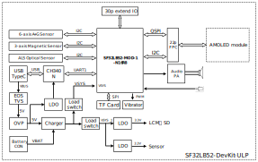
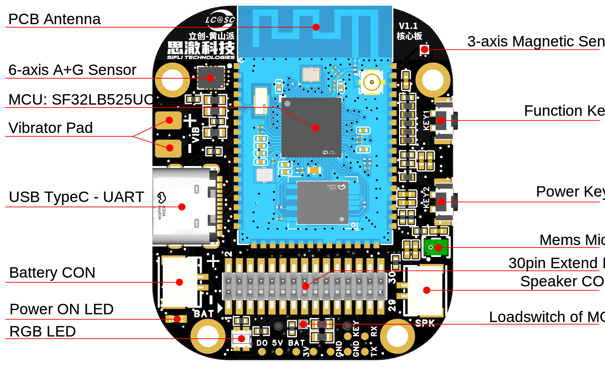
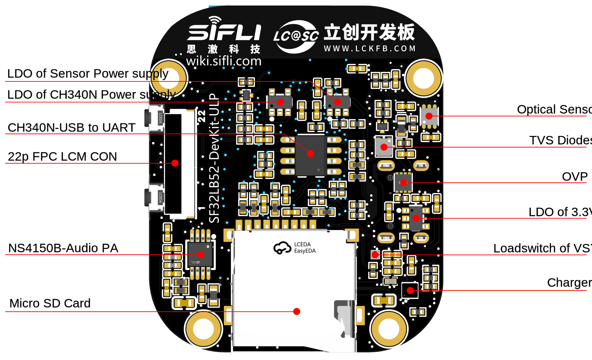
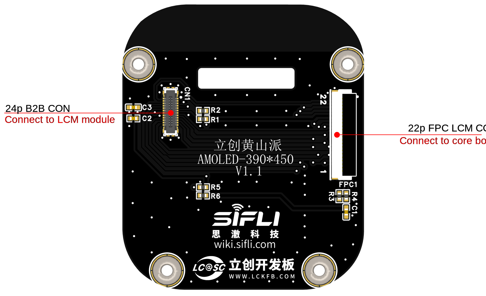
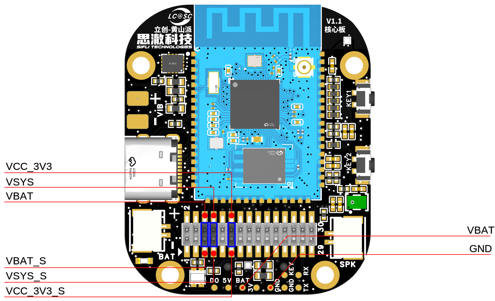

# Lichuang Huangshan Pi Development Board User Guide

(This development board is currently available for internal trial use and will be released externally after future modifications and improvements.)

## Development board version information:

* V1.0.0: Uses the SF32LB52-MOD-1 module, current version

## Development Board Overview


Lichuang Huangshan Pi is a development board based on the SiFli Technology SF32LB52-MOD-1 module, and is also a prototype for smart watches and fitness bands. Developers can use this development board for prototyping smart watches and fitness bands.

<!--  

<div align="center"> Front Photo of the Development Board </div>  <br>  <br>  <br>

 

<div align="center"> Rear Photo of the Development Board </div>  <br>  <br>  <br> -->


### Feature List
This development board has the following features:
1.	Module: onboard SF32LB52x-MOD-1-N16R8 module based on the SF32LB52x chip, configured as follows:
    - Standard SF32LB525UC6 chip, with the following built-in co-packaged configuration:
        - 8MB OPI-PSRAM, interface frequency 144MHz
    - 128Mb QSPI-NOR Flash, interface frequency 72MHz, STR mode
    - 48 MHz crystal
    - 32.768 kHz crystal
    - Onboard PCBA antenna
2.	Display
    - AMOLED display, model: ZC-A1D85W-010
    - 1.85-inch
    - 390*450
    - 800 cd/m2
    - Quad SPI display interface
    - OLED Driver IC: CO5300AF-01
    - Power IC: BV6802W
    - TP IC: FT6146-M00
3.	Dedicated display interface
    - SPI/DSPI/Quad SPI, supports DDR mode QSPI, brought out through a 22-pin FPC and a 40-pin header
    - Supports touchscreens with an I2C interface
4.	Audio
    - Onboard integrated MEMS MIC
    - Analog audio output, onboard Class-D audio PA
    - External 3 W/4 ohm or 2 W/8 ohm speaker with a GH-1.25 mm interface
5.	USB
    - Type-C-UART interface, with onboard CH340N serial chip for firmware flashing and software debugging, and can supply power
    - USB interface, supports USB 2.0 FS, routed out through the 30p interface
6.	SD Card
    - Supports TF cards using the SPI interface, with an onboard Micro SD card slot
7.  Buttons
    - 1x function button
    - 1x power button, supports reset by pressing and holding for 10 s
8.  RGB-LED
    - 1x RGB LED, SK6812MINI-HS, GPIO-controlled
9.  Motor
    - Onboard motor driver circuit, with reserved solder pads for an external motor
10. Sensors
    - Six-axis IMU (inertial measurement unit), LSM6DS3TR-C
    - Three-axis geomagnetic sensor, MMC5603NJ
    - Ambient light sensor, LTR-303ALS-01
11. Power
    - OVP, SY5320
    - Charger, SY6103
    - Loadswitch, LP5240HVF
    - LDO, ETA5055V330DS2F
    - Supports an external lithium battery with a GH1.25 mm forward-pinout interface, maximum charging voltage 4.5 V, maximum charging current 500 mA
12. 30p function expansion interface
    - 2x15p, 1.27 mm pitch pin header
    - Expansion GPIO
    - Supports power consumption testing


### Functional Block Diagram

 

<div align="center"> Development Board Functional Block Diagram </div>  <br>  <br>  <br>


### Component Introduction

The SF32LB52 Huangshan Pi development board includes:

    - Core board 
    - Display board 
    - Battery 
    - Speaker 

 

<div align="center"> Front of the Core Board (click to enlarge) </div>  <br>  <br>  <br>

 

<div align="center"> Rear of the Core Board (click to enlarge) </div>  <br>  <br>  <br>

 

<div align="center"> Rear of the Display Board (click to enlarge) </div>  <br>  <br>  <br>

 

<div align="center"> Description of Core Board Jumper Caps and Test Points (click to enlarge) </div>  <br>  <br>  <br>


## Application Development

This section mainly describes how to set up the hardware and software, flash firmware to the development board, and develop applications.

### Required Hardware

- 1 x SF32LB52 Huangshan Pi (including the SF32LB52X-MOD-1-N16R8 module)
- 1 x USB 2.0 data cable (standard Type-A to Type-C)
- 1 x computer (Windows, Linux, or macOS)

```{note}
1. If you need both UART debugging and the USB interface, two USB 2.0 data cables are required;
2. Make sure to use an appropriate USB data cable. Some cables are for charging only and cannot be used for data transfer or firmware flashing.
```
### Optional Hardware

- 1x speaker
- 1x TF Card
- 1x lithium battery greater than 450 mAh

### Hardware Setup

Prepare the development board and load the first sample application:

1.	Open SiFli's SifliTrace tool software and select the correct COM port;
2.	Plug in the USB data cable to connect the PC to the USB-to-UART port on the development board;
3.	The LCD display lights up, and you can interact with the touchscreen using your finger.

Hardware setup is complete. You can now proceed with software setup.

```{note}
Some development boards, such as Huangshan Pi and SF32LB52-DevKit-Nano-N16R16, reset through the RTS pin of the onboard USB-to-UART chip. This is mainly intended to make board reset easier. The newer SifliTrace tool already supports RTS reset.

Q: This design can cause an inconvenience: after the board is powered on again, the first serial-port connection made by a tool may trigger a board reset. In some cases, opening the serial port during use may power off the board.

A: Disable hardware flow control to resolve this issue. Open Device Manager -> right-click the port and select Properties -> Port Settings (Advanced) -> select Disable modem control.

```


### Software Setup

For instructions on quickly setting up the development environment, refer to the software documentation. 

## Hardware Reference

This section provides more information about the development board hardware.

### GPIO Assignment List

The table below lists the GPIO assignments for the pins of the SF32LB52-MOD-1-N16R8 module, used to control specific components or functions on the development board.

<div align="center"> Signal Definition Table  </div>

```{table}

|Pin|	Pin Name           	   |   Function  |
|:--|:-----------------------|:-----------|
|1 | GND   | Ground                     |
|2 | PA_44 | VBUS_DET, charger insertion detection   |
|3 | PA_43 | KEY2                    |
|4 | PA_42 | Audio_PA_EN             |
|5 | PA_23 | XTAL32K_XO, default NC       |
|6 | PA_22 | XTAL32K_XI, default NC       |
|7 | PA_41 | Touchscreen interrupt INT             |
|8 | PA_40 | SensorsI2C1_SCL           |
|9 | PA_39 | SensorsI2C1_SDA            |
|10 | PA_38 | VSYS to VSYS_1 switching control   |
|11 | PA_37 | Touchscreen I2C_SCL            |
|12 | PA_36 | USB_DM                  |
|13 | PA_35 | USB_DP                  |
|14 | PA_34 | HOME and long-press ResetButtons        |
|15 | PA_33 | Touchscreen I2C_SDA            |
|16 | PA_32 | RGB LED                 |
|17 | VDD33_VOUT2 | 3.3V Power output       |
|18 | PA_24 | SPI1_DIO, SD Card interface signal    |
|19 | PA_25 | SPI1_DI, SD Card interface signal     |
|20 | PA_26 | VSYS_1 to VCC33 switching control  |
|21 | PA_27 | SD Card_CD signal              |
|22 | PA_28 | SPI1_CLK, SD Card interface signal    |
|23 | PA_29 | SPI1_CS, SD Card interface signal     |
|24 | PA_30 | VSYS_1 to HR3V3 switching control  |
|25 | PA_31 | SensorsINT1               |
|26 | GND | Ground                       |
|27 | VBAT  | 3.7~4.7V Power input          |
|28 | PA_20 | vibrator PWM            |
|29 | PA_19 | DB_UART_TXD, program download and software debug interface |
|30 | PA_18 | DB_UART_RXD, program download and software debug interface |
|31 | PA_11 | Charger I2C0_SDA        |
|32 | PA_10 | Charger I2C0_SCL        |
|33 | AU_DAC1P_OUT | Analog Audio output signal    |
|34 | AU_DAC1N_OUT | Analog Audio output signal    |
|35 | GND | Ground                       |
|36 | MIC_BIAS | MIC bias voltage            |
|37 | MIC_ADC_IN | MIC input signal          |
|38 | PA_09 | Touchscreen interrupt RST             |
|39 | PA_08 | QSPI D3, LCD interface signal |
|40 | PA_07 | QSPI D2, LCD interface signal |
|41 | PA_06 | QSPI D1, E-Paper DC, LCD interface signal |
|42 | PA_05 | QSPI D0, E-Paper SDI, LCD interface signal |
|43 | PA_04 | QSPI CLK, E-Paper SCLK, LCD interface signal |
|44 | PA_03 | QSPI CS, E-Paper CS, LCD interface signal |
|45 | PA_02 | QSPI TE, E-Paper BUSY, LCD interface signal |
|46 | PA_01 | BL PWM, LCD interface signal      |
|47 | PA_00 | RSTB, LCD interface signal        |
|48 | GND | Ground                      |
|49 | GND | Ground                      |
|50 | GND | Ground                      |
|51 | GND | Ground                      |
|52 | GND | Ground                      |
|53 | GND | Ground                      |
|54 | GND | Ground                      |
|55 | GND | Ground                      |
|56 | GND | Ground                      |
|57 | GND | Ground                      |
|58 | GND | Ground                      |
|58 | GND | Ground                      |
|60 | GND | Ground                      |
|61 | VBATS | Battery voltage detection input          |
|62 | NC  | NC                        |
|63 | PA_15 | MPI2_D0, SD1_CMD        |
|64 | PA_16 | MPI2_CLK, SD1_D0        |
|65 | PA_17 | MPI2_D3, SD1_D1         |
|66 | PA_14 | MPI2_D2, SD1_CLK        |
|67 | PA_13 | MPI2_D1, SD1_D3         |
|68 | PA_12 | MPI2_CS, SD1_D2         |

```

```{important}
1. SF32LB52-DevKit-ULP is compatible with the SF32LB-MOD-1 module.
2. Pin 17 VDD33_VOUT of the module is a 3.3 V power output. It has no output by default; software must enable the internal LDO.
3. Pin 27 VBAT of the module is a power input pin and can be connected directly to a lithium battery. When battery power is not used and a constant-voltage supply is used instead, the input range is 3.7 V to 4.7 V; 3.8 V is recommended.
4. For the SF32LB-MOD-1-N16R8 module, the VBAT power-on threshold is set by software to 3.58 V, and the power-off threshold is set by software to 3.48 V.
5. Pins 62 to 68 of the SF32LB-MOD-1-N16R8 module are connected to the module's internal NOR Flash by default and cannot be used by the development board. To use the SDIO interface, select a module version without flash.
```

### 30P pin header interface definition


<div align="center"> 30p Pin Header Interface Definition  </div>

```{table}

|Pin|	Pin Name           	   |   Function  |
|:--|:-----------------------|:-----------|
|1  | USB_VBUS_5V    | USB TypeC VBUS                     
|2  | USB_VBUS_5V    | USB TypeC VBUS     
|3  | GND     | Ground 
|4  | GND     | Ground 
|5  | VBAT_S  | VBATPower output, must be shorted to the VBAT pin 
|6  | VBAT    | VBATPower input, must be shorted to the VBAT_S pin 
|7  | VSYS_S  | VSYSPower output, must be shorted to the VSYS pin 
|8  | VSYS    | VSYSPower input, must be shorted to the VSYS_S pin  
|9  | GND     | Ground 
|10 | GND     | Ground                 
|11 | VCC_3V3_S  | VCC_3V3Power output, must be shorted to the VCC_3V3 pin                   
|12 | VCC_3V3    | VCC_3V3Power input, must be shorted to the VCC_3V3_S pin 
|13 | PA_36   | Default USB_DM 
|14 | PB_39   | Default I2C1_SDA         
|15 | PA_35   | Default USB_DP             
|16 | PA_40   | Default I2C1_SCL 
|17 | PA_32   | Default RGN-LED data, can be used as GPIO 
|18 | PA_30   | Default Sensor power control; when used as GPIO, it affects PA39 and PA40
|19 | PA_29   | Default SPI1_CS, can be used as GPIO; when expanded, the TF card on the core board must not be inserted 
|20 | PA_24   | Default SPI1_DO, can be used as GPIO; when expanded, the TF card on the core board must not be inserted  
|21 | PA_28   | Default SPI1_CLK, can be used as GPIO; when expanded, the TF card on the core board must not be inserted  
|22 | PA_25   | Default SPI1_DI, can be used as GPIO; when expanded, the TF card on the core board must not be inserted 
|23 | PA_27   | Default SD_DET, can be used as GPIO; when expanded, the TF card on the core board must not be inserted
|24 | PA_20   | Default VIB PWM, can be used as GPIO; when expanded, the Motor on the core board must not be soldered 
|25 | PA_19   | Debug UART_TXD 
|26 | PA_34   | KEY1, power on/off and press and hold for 10s Reset 
|27 | PA_18   | Debug UART_RXD 
|28 | PA_43   | KEY2, function Buttons 
|29 | PA_11   | Default I2C0_SDA
|30 | PA_10   | Default I2C0_SCL 
```

```{important}
1. Pins 1 and 2 of the 30p header are connected to the VBUS input of USB Type-C. When a USB cable is plugged into the development board, these pins can be used as a 5 V output; when no USB cable is plugged into the development board, these pins can be used as a 5 V input.
2. Pin 5 of the 30p header is connected to the battery holder on the development board and is not connected to the downstream circuitry. During operation, use a jumper cap to short VBAT_S and VBAT.
3. Pin 6 of the 30p header is connected to the VBAT pin of the charging IC on the development board and the VBATS pin of the module. VBAT_S and VBAT are disconnected here to facilitate power consumption testing with an ammeter in series.
4. Pin 7 of the 30p header is connected to the VSYS pin of the charging IC on the development board and is not connected to the downstream circuitry. During operation, use a jumper cap to short VSYS_S and VSYS.
5. Pin 8 of the 30p header is connected to the VSYS pin of the module and other VSYS input pins. VSYS_S and VSYS are disconnected here to facilitate power consumption testing with an ammeter in series.
6. Pin 11 of the 30p header is connected to the output pin of the LDO that converts VSYS_1 to VCC_3V3 on the development board, and is not connected to the downstream circuitry. During operation, use a jumper cap to short VCC_3V3_S and VCC_3V3.
7. Pin 12 of the 30p header is connected to the VCC_3V3 main power rail of the development board. VSYS_S and VSYS are disconnected here to facilitate power consumption testing with an ammeter in series.
```

### 22p QSPI Pin Sequence FPC Interface Definition

<div align="center"> 22p FPC Connector Signal Definition  </div>

```{table}

|Pin|	Pin Name           	   |   Function  |
|:--|:-----------------------|:-----------|
|1  | VBAT    | VBATPower output                     
|2  | PA_01   | BL_PWM signal (used with TFT screen)    
|3  | PA_07   | QSPI D2, LCD interface signal 
|4  | PA_08   | QSPI D3, LCD interface signal 
|5  | NC      | NC 
|6  | NC      | NC 
|7  | NC      | NC 
|8  | NC      | NC  
|9  | NC      | NC 
|10 | NC      | NC                 
|11 | PA_02   | QSPI TE, LCD interface signal                   
|12 | PA_00   | LCD Reset, LCD interface signal 
|13 | PA_04   | QSPI CLK, SPI CLK, LCD interface signal 
|14 | PB_05   | QSPI D0, SPI SDI, LCD interface signal         
|15 | PA_03   | QSPI CS, SPI CS, LCD interface signal             
|16 | PA_06   | QSPI D1, SPI DC, LCD interface signal 
|17 | VDD_3V3 | 3.3VPower output 
|18 | PA_41   | Touchscreen INT interrupt signal
|19 | PA_33   | Touchscreen I2C_SDA signal 
|20 | PA_37   | Touchscreen I2C_SCL signal 
|21 | PA_09   | Touchscreen RTNReset signal 
|22 | GND     | Ground      

```

### Power Supply Description

The SF32LB52 Huangshan Pi development board supports two power supply methods: USB Type-C and battery power.

1.  The onboard USB Type-C connector can power the board.
2.  It can be powered by a battery alone, allowing standalone operation without a computer.

### Hardware Setup Options

Connect a USB cable to the USB-to-UART port, open SiFli Technology's firmware flashing tool, and select the corresponding COM port and firmware.
1.  Download Mode
- Check the BOOT option and power on. After startup, the board enters download mode, and firmware flashing can be completed.
2.  Software Development Mode
- Clear the BOOT option and power on. After startup, the board enters serial port log output mode, which is software debugging mode.
3.  Reset
- The module is reset by pulling the RTS# pin of the CH340N low and then high.

**For details, refer to&emsp;[Firmware Flashing Tool Impeller](烧录工具)**

### Charging and Battery Selection

The SF32LB52-Huangshan Pi development board integrates an SY6103 linear charging chip, supports a maximum charging current of 500 mA, and is set by default to a 450 mA constant current.

A 450 mAh to 500 mAh single-cell polymer lithium battery is recommended. The battery interface is a GH-1.25 mm female connector with a forward pinout. For polarity, refer to the silkscreen of the battery holder on the development board.

### LCD Display Interface

The SF32LB52-Huangshan Pi core board supports QSPI-interface LCD screens. The connector is a 22p-0.5pitch FPC, flip-up, dual top/bottom-contact type.
Refer to the signal pin sequence defined above. If the pin sequence differs, use an adapter board for testing; see the SF32LB52-DevKit-LCD Adapter Board Fabrication Guide.

### Audio Interface

The SF32LB52-Huangshan Pi core board integrates a MEMS MIC and an audio power amplifier chip.
* Supports audio signal input from the onboard mic.
* Supports an external speaker (up to 3 W/4 ohms). Speaker connector specification: GH-1.25 mm female connector.

## Obtaining Samples

Retail samples and small batches can be purchased directly from [Taobao](https://sifli.taobao.com/). Volume customers can email sales@sifli.com or contact customer service on Taobao for sales contact information.
Open-source contributors may apply for free samples and can join QQ group 674699679 for discussion.

## Related Documents

- [SF32LB52x Chip Datasheet](https://wiki.sifli.com/silicon/index.html)
- [SF32LB52x User Manual](https://wiki.sifli.com/silicon/index.html)
- [SF32LB52-MOD-1 Datasheet](https://wiki.sifli.com/silicon/index.html)
- [SF32LB52-MOD-1 Design Drawings](https://downloads.sifli.com/hardware/files/documentation/SF32LB52-MOD-1-V1.0.0.zip?)
- [SF32LB52-Huangshan Pi Design Drawings](https://downloads.sifli.com/hardware/files/documentation/ProPrj_立��·黄山派SF32LB52开发板V1.2(202504250924).epro?)
- [SF32LB52-DevKit-LCD Adapter Board Manufacturing Guide](SF-DevKit-LCM-Adapter)
