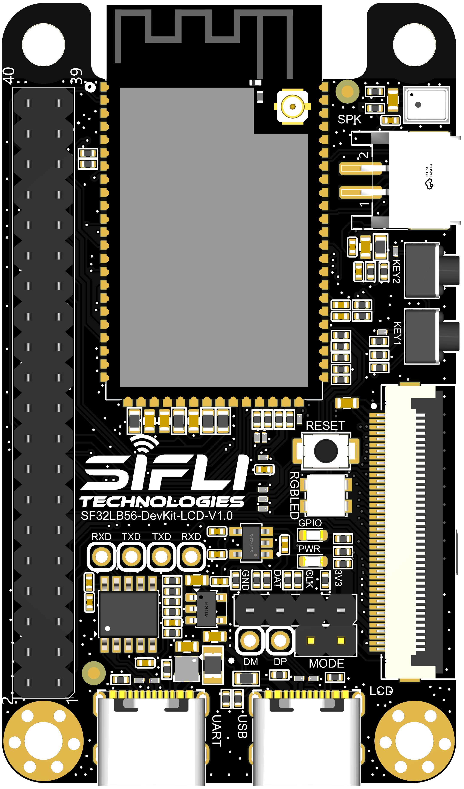
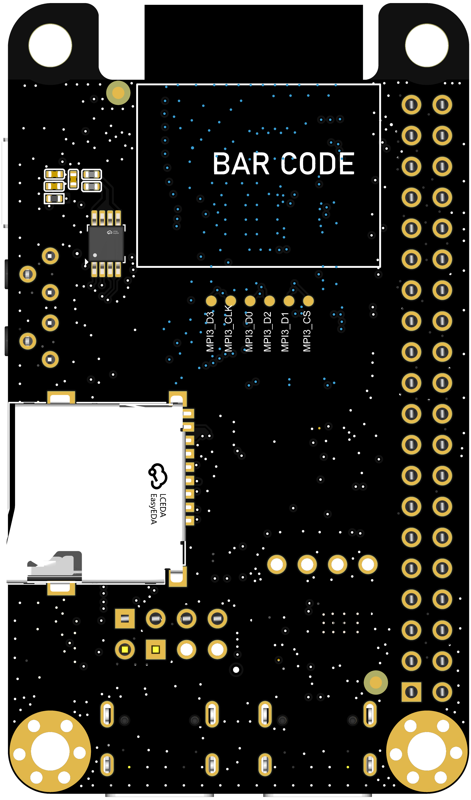
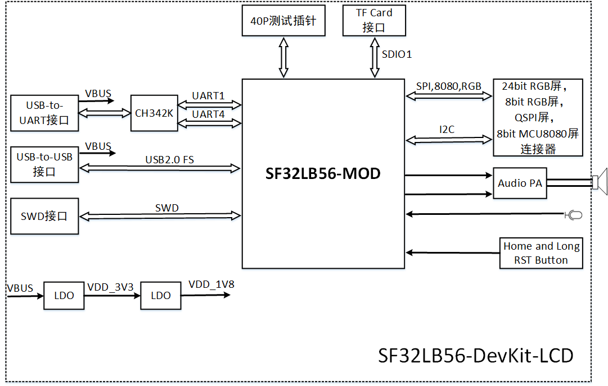
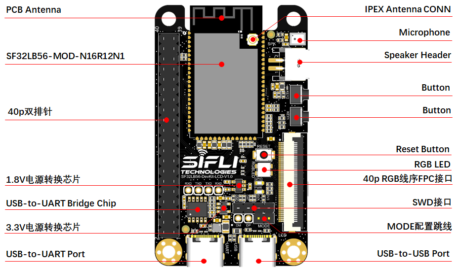
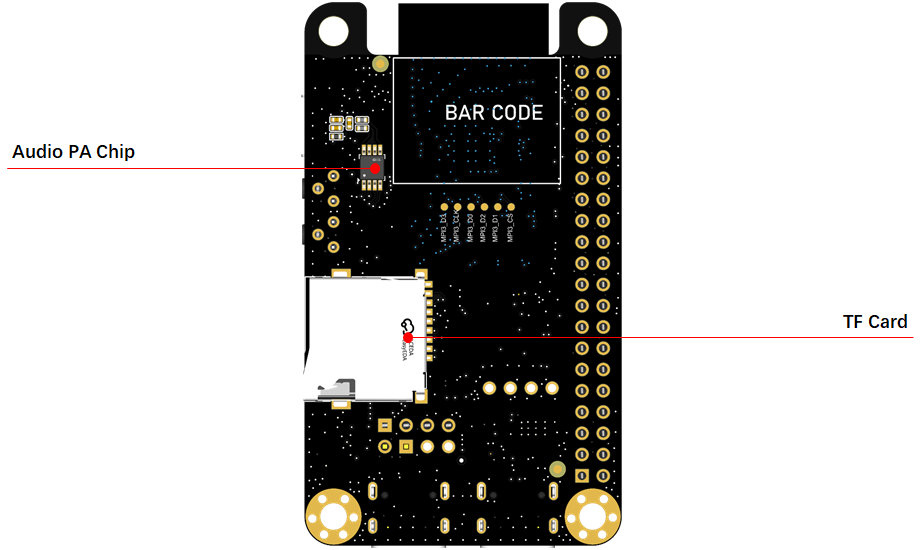
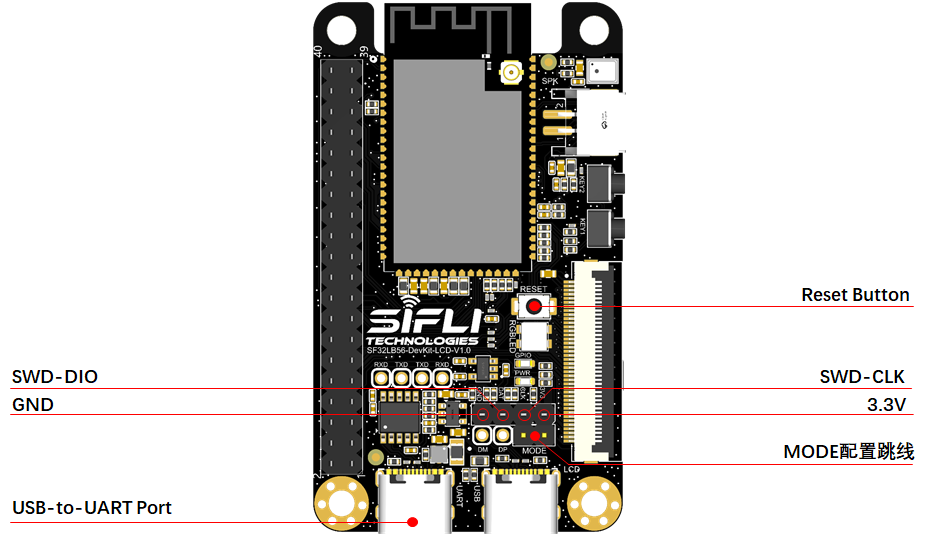

# SF32LB56-DevKit-LCD Development Board User Guide


## Development Board Overview


SF32LB56-DevKit-LCD is a development board based on the SF32LB56xV series chip module. It is mainly used to develop various applications for displays with `MIPI-DPI`/`SPI`/`DSPI`/`QSPI` or `MIPI-DBI(MCU/8080)` interfaces.

The development board also includes analog MIC input, analog audio output, an SDIO interface, a USB-C interface, and TF card support, providing developers with abundant hardware interface resources. It can be used to develop drivers for peripherals with various interfaces, helping developers simplify the hardware development process and shorten product time to market.

The appearance of the SF32LB56_DevKit-LCD is shown in Figure 1 and Figure 2.



<div align="center"> Figure 1 Front Photo of the SF32LB56_DevKit-LCD Development Board </div>  <br> <br> <br> 


 

<div align="center"> Figure 2 Rear Photo of the SF32LB56_DevKit-LCD Development Board </div>  <br> <br> <br> 


### Feature List
This development board has the following features:
1.	Module: onboard SF32LB56-MOD-A128R12N1 module based on the SF32LB56xV chip. The module configuration is as follows:
    - Standard SF32LB566VCB36 chip, with the built-in co-packaged configuration as follows:
        - 8 MB OPI-PSRAM, interface frequency 144 MHz (may change in the official release)
        - 4 MB OPI-PSRAM, interface frequency 144 MHz (may change in the official release)
    - 1 Gb QSPI-NAND Flash, interface frequency 72 MHz, STR mode (may change in the official release)
    - 48 MHz crystal
    - 32.768 kHz crystal
    - Onboard antenna or IPEX antenna connector, selected through a 0-ohm resistor; onboard antenna by default
    - RF matching network and other resistor, capacitor, and inductor components
2.	Dedicated display interface
    - MIPI-DPI, supports an FPC connector with the 正点原子 40-pin pinout
    - SPI/DSPI/QSPI, supports DDR-mode QSPI, routed out through a 40-pin header
    - 8-bit MCU/8080, routed out through a 40-pin header
     - Supports touchscreens with an I2C interface
3.	Audio
    - Supports analog MIC input
    - Analog audio output, onboard Class-D audio PA
4.	USB
    - Type-C interface, supports the onboard USB-to-serial chip for firmware flashing and software DEBUG, and can be used to supply power
    - Type-C interface, supports USB2.0 FS, and can be used to supply power
5.	SD Card
    - Supports TF cards using the SDIO interface, with an onboard Micro SD card slot


### Functional Block Diagram

 

<div align="center"> Figure 3 Development Board Functional Block Diagram </div>  <br> <br> <br> 


### Component Introduction

The mainboard of the SF32LB56-DevKit-LCD development board is the core of the entire kit. This mainboard integrates the SF32LB56-MOD-A128R12N1 module and provides an LCD connector for MIPI-DPI (RGB-24bit)

 

<div align="center"> Figure 3 SF32LB56-DevKit-LCD Board - Front (click to enlarge) </div>  <br> <br> <br> 

 

<div align="center"> Figure 4 SF32LB56-DevKit-LCD Board - Rear (click to enlarge) </div>  <br> <br> <br> 


## Application Development

This section mainly describes how to set up the hardware and software, flash firmware to the development board, and develop applications.

### Required Hardware

- 1 x SF32LB56-DevKit-LCD (including the SF32LB56-MOD-A128R12N1 module)
- 1 x display module
- 1 x USB 2.0 data cable (standard Type-A to Type-C)
- 1 x SWD debugger
- 1 x computer (Windows, Linux, or macOS)

```{note}

1. If you need both UART debugging and the USB interface, two USB 2.0 data cables are required;
2. Make sure to use an appropriate USB data cable. Some cables are for charging only and cannot be used for data transfer or firmware flashing.

```
### Optional Hardware

- 1 x speaker
- 1 x TF Card
- 1 x 450 mAh lithium battery

### Hardware Setup

Prepare the development board and load the first sample application:

1.	Connect the display module to the corresponding LCD connector interface;
2.	Open SiFli's SifliTrace tool software and select the correct COM port;
3.	Plug in the USB data cable to connect the PC to the USB-to-UART port on the development board;
4.	The display lights up, and you can interact with the touchscreen using your finger.

Hardware setup is complete. You can now proceed with software setup.


### Software Setup

For the SF32LB56-DevKit-LCD development board, refer to the software documentation for how to quickly set up the development environment. 

## Hardware Reference

This section provides more information about the development board hardware.

### GPIO Assignment List

The table below lists the GPIO assignments for the SF32LB56-MOD-A128R12N1 module pins, used to control specific components or functions on the development board.

<div align="center"> SF32LB56-MOD-A128R12N1 GPIO Assignment </div>

```{table}
:align: center
|Pin|	Pin Name           	   |   Function  |
|:--|:-----------------------|:-----------|
|1  | GND   | Ground                     |
|2  | PB_22 | Touchscreen reset signal             |
|3  | PA_47 | MIPI-DPI(RGB) DE, LCD interface signal |
|4  | PA_42 | MIPI-DPI(RGB) VSYNC, LCD interface signal |
|5  | PA_44 | MIPI-DPI(RGB) HSYNC, LCD interface signal |
|6  | PB_17 | UART4_TXD, BOOTROM default print port and small-core software debug interface |
|7  | PB_16 | UART4_RXD, BOOTROM default print port and small-core software debug interface |
|8  | PA_45 | MIPI-DPI(RGB) CLK, LCD interface signal |
|9  | PA_46 | MIPI-DPI(RGB) B7, LCD interface signal |
|10 | PA_18 | USB_DM                  |
|11 | PA_17 | USB_DP                  |
|12 | PA_40 | MIPI-DPI(RGB) B6, MCU 8080 DIO0, QSPI DIO2, E-Paper SDI, LCD interface signal |
|13 | PA_39 | MIPI-DPI(RGB) B5, MCU 8080 DC, QSPI DIO1, E-Paper DC, LCD interface signal |
|14 | PB_32 | HOME and long-press reset button        |
|15 | PA_51 | Touchscreen interrupt INT             |
|16 | PA_41 | MIPI-DPI(RGB) B4, MCU 8080 DIO1, QSPI DIO3, LCD interface signal |
|17 | PA_43 | MIPI-DPI(RGB) B3, LCD interface signal |
|18 | PA_38 | MIPI-DPI(RGB) B2, MCU 8080 RD, QSPI DIO0, LCD interface signal |
|19 | PA_37 | MIPI-DPI(RGB) B1, MCU 8080 WR, QSPI CLK, E-Paper CLK, LCD interface signal |
|20 | PA_36 | MIPI-DPI(RGB) B0, MCU 8080 CS, QSPI CS, E-Paper CS, LCD interface signal |
|21 | PA_35 | MIPI-DPI(RGB) G7, LCD interface signal |
|22 | PA_31 | MIPI-DPI(RGB) G6, MCU 8080 DIO5, LCD interface signal |
|23 | PA_29 | MIPI-DPI(RGB) G5, MCU 8080 DIO3, LCD interface signal |
|24 | PA_34 | MIPI-DPI(RGB) G4, MCU 8080 DIO7, LCD interface signal |
|25 | BOOT_MODE | BOOT_MODE signal, =1 Download Mode; =0 user program mode  |
|26 | VDD   | Main power supply input, 2.97~3.63V     |
|27 | VDDSIP| Co-packaged memory power supply input, 1.71~1.92V  |
|28 | GND   | Ground                     |
|29 | VDDIO | GPIO power supply input, 1.71~3.63V  |
|30 | PA_01 | Touchscreen I2C_SCL            |
|31 | PA_02 | Touchscreen I2C_SDA            |
|32 | PA_03 | UART1_TXD, big-core debug serial port    |
|33 | PA_04 | UART1_RXD, big-core debug serial port    |
|34 | PA_15 | SD1_DIO1, SD Card interface signal    |
|35 | PA_22 | SD1_DIO0, SD Card interface signal    |
|36 | PA_27 | SD1_CMD, SD Card interface signal    |
|37 | PA_26 | SD1_CLK, SD Card interface signal    |
|38 | PA_20 | SD1_DIO3, SD Card interface signal    |
|39 | PA_12 | SD1_DIO2, SD Card interface signal    |
|40 | PA_33 | MIPI-DPI(RGB) G3, MCU 8080 TE, QSPI TE, E-Paper BUSY, LCD interface signal |
|41 | PA_32 | MIPI-DPI(RGB) G2, MCU 8080 DIO6, LCD interface signal |
|42 | GND   | Ground                     |
|43 | AU_DAC1P_OUT | Analog Audio output signal    |
|44 | AU_DAC1N_OUT | Analog Audio output signal    |
|45 | GND   | Ground                     |
|46 | MIC_BIAS | MIC bias voltage            |
|47 | MIC_ADC_IN | MIC input signal          |
|48 | PA_50 | RSTB, LCD interface signal         |
|49 | PA_30 | MIPI-DPI(RGB) G1, MCU 8080 DIO4, LCD interface signal |
|50 | PA_28 | MIPI-DPI(RGB) G0, MCU 8080 DIO2, LCD interface signal |
|51 | PA_25 | MIPI-DPI(RGB) R7, LCD interface signal |
|52 | PA_23 | MIPI-DPI(RGB) R6, LCD interface signal |
|53 | PA_21 | MIPI-DPI(RGB) R5, LCD interface signal |
|54 | PA_19 | MIPI-DPI(RGB) R4, LCD interface signal |
|55 | PA_24 | MIPI-DPI(RGB) R3, LCD interface signal |
|56 | PA_16 | MIPI-DPI(RGB) R2, LCD interface signal |
|57 | PA_13 | MIPI-DPI(RGB) R1, LCD interface signal |
|58 | PA_14 | MIPI-DPI(RGB) R0, LCD interface signal |
|59 | PB_23 | BL PWM, LCD interface signal      |
|60 | GND   | Ground                    |
|61 | PB_12 | VBUS_DET, USB plug/unplug detection    |
|62 | PB_11 | GPIO LED control signal         |
|63 | PB_09 | RGBLED GPIO control signal     |
|64 | PB_08 | GPIO                   |
|65 | PB_35 | KEY, function button            |
|66 | PA_76 | Insertion detection interface signal for the SD Card slot   |
|67 | PA_06 | MPI3_CS, SD2_DIO2, I2S1_MCLK, module internal Nor Flash interface signal; unavailable externally when the module supports internal Nor Flash |
|68 | PA_07 | MPI3_DIO1, SD2_DIO3, I2S1_SDI, module internal Nor Flash interface signal; unavailable externally when the module supports internal Nor Flash |
|69 | PA_08 | MPI3_DIO2, SD2_CLK, I2S1_SDO, module internal Nor Flash interface signal; unavailable externally when the module supports internal Nor Flash |
|70 | PA_09 | MPI3_DIO0, SD2_CMD, I2S1_BCK, module internal Nor Flash interface signal; unavailable externally when the module supports internal Nor Flash |
|71 | PA_10 | MPI3_CLK, SD2_DIO0, I2S1_LRCK, module internal Nor Flash interface signal; unavailable externally when the module supports internal Nor Flash |
|72 | PA_11 | MPI3_DIO3, SD2_DIO1, module internal Nor Flash interface signal; unavailable externally when the module supports internal Nor Flash |
|73 | GND | Ground                      |
|74 | GND | Ground                      |
|76 | GND | Ground                      |
|77 | GND | Ground                      |
|78 | GND | Ground                      |
|79 | PB_13 | SWDIO, SWD interface signal       |
|80 | PB_15 | SWCLK, SWD interface signal       |
|81 | PB_18 | SPI3_CS, RGB screen SPI interface, WIFI GPIO interface signal  |
|82 | PB_19 | SPI3_CLK, RGB screen SPI interface, WIFI GPIO interface signal  |
|83 | PB_20 | SPI3_DI, used as the GPIO enable signal for the Audio amplifier         |
|84 | PB_21 | SPI3_DO, RGB screen SPI interface, WIFI GPIO interface signal  |
|85 | PA_69 | SPI2_DI, I2S1_SDI, PDM1_CLK, used as the WIFI SPI interface signal   |
|86 | PA_64 | SPI2_DO, I2S1_SDO, PDM1_DAT, used as the WIFI SPI interface signal   |
|87 | PA_73 | SPI2_CLK, I2S1_BCK, PDM2_CLK, used as the WIFI SPI interface signal   |
|88 | PA_71 | SPI2_CS, I2S1_LRCK, PDM2_DAT, used as the WIFI SPI interface signal   |
|89 | PA_65 | GPIO, I2S1_MCLK         |
```

### 40P Pin Header Interface Definition


 

<div align="center"> Figure 5 Development Board 40p Pin Header Interface Definition (click to enlarge) </div>  <br> <br> <br> 


### 40-pin RGB FPC interface pinout definition

**Compatible with the 正点原子 40-pin FPC interface pinout**

<div align="center"> RGB-FPC-J0100 Signal Definitions </div>

|Pin|	Pin Name           	   |   Function  |
|:--|:-----------------------|:-----------|
|1   | 5V       | 5V power output                 
|2   | 5V       | 5V power output   
|3   | R0       | PA_14, LCDC1_DPI_R0
|4   | R1       | PA_13, LCDC1_DPI_R1        
|5   | R2       | PA_16, LCDC1_DPI_R2    
|6   | R3       | PA_24, LCDC1_DPI_R3    
|7   | R4       | PA_19, LCDC1_DPI_R4    
|8   | R5       | PA_21, LCDC1_DPI_R5    
|9   | R6       | PA_23, LCDC1_DPI_R6    
|10  | R7       | PA_25, LCDC1_DPI_R7    
|11  | GND      | Ground  
|12  | G0       | PA_28, LCDC1_DPI_G0 
|13  | G1       | PA_30, LCDC1_DPI_G1                
|14  | G2       | PA_32, LCDC1_DPI_G2         
|15  | G3       | PA_33, LCDC1_DPI_G3       
|16  | G4       | PA_34, LCDC1_DPI_G4                 
|17  | G5       | PA_29, LCDC1_DPI_G5       
|18  | G6       | PA_31, LCDC1_DPI_G6    
|19  | G7       | PA_35, LCDC1_DPI_G7    
|20  | GND      | Ground      
|21  | B0       | PA_36, LCDC1_DPI_B0       
|22  | B1       | PA_37, LCDC1_DPI_B1       
|23  | B2       | PA_38, LCDC1_DPI_B2       
|24  | B3       | PA_43, LCDC1_DPI_B3       
|25  | B4       | PA_41, LCDC1_DPI_B4       
|26  | B5       | PA_39, LCDC1_DPI_B5       
|27  | B6       | PA_40, LCDC1_DPI_B6       
|28  | B7       | PA_46, LCDC1_DPI_B7       
|29  | GND      | Ground       
|30  | CLK      | PA_45, LCDC1_DPI_CLK        
|31  | HSYNC    | PA_44, LCDC1_DPI_HSYNC       
|32  | VSYNC    | PA_42, LCDC1_DPI_VSYNC       
|33  | DE       | PA_47, LCDC1_DPI_DE       
|34  | BL       | PB_23, BL_PWM       
|35  | CTP_RST  | PB_22       
|36  | CTP_SDA  | PA_02, I2C4_SDA       
|37  | NC       | -       
|38  | CTP_SCL  | PA_01, I2C4_SCL       
|39  | CTP_INT  | PA_51       
|40  | RESET    | PA_50            

### Power Supply Description

The SF32LB56-DevKit-LCD development board is powered through a USB Type-C interface. Both onboard USB Type-C connectors can power the board. For download and debugging, use the USB-to-UART port.

### Flash the test firmware

#### Download the Impeller firmware flashing tool
Connect a USB cable to the USB-to-UART port, open SiFli Technology's firmware flashing tool, and select the corresponding COM port and firmware.
1.  Download Mode
- Install the Mode jumper cap, power on, and after startup the board enters download mode, allowing the program to be downloaded.
2.  Software Development Mode
- Remove the Mode jumper cap, power on, and after startup the board enters serial log printing mode, which is software debugging mode.

**For details, refer to&emsp;[Impeller Firmware Flashing Tool](/tools/烧录工具)**

#### J-Link SWD tool download and debugging

As shown in the two figures below, use DuPont wires to connect the corresponding IOs.

 

<div align="center"> Figure 6 SF32LB56-DevKit-LCD SWD Debug Wiring Diagram </div>  <br> <br> <br> 


## Obtaining Samples

Retail samples and small batches can be purchased directly from [Taobao](https://sifli.taobao.com/). Volume customers can email sales@sifli.com or contact customer service on Taobao for sales contact information.
Open-source contributors may apply for free samples and can join QQ group 674699679 for discussion.

## Related Documents

- [SF32LB56x Chip Datasheet](https://wiki.sifli.com/silicon/index.html)
- [SF32LB56x User Manual](https://wiki.sifli.com/silicon/index.html)
- [SF32LB56-MOD Datasheet](https://wiki.sifli.com/silicon/index.html)
- [SF32LB56-MOD Design Drawings](https://downloads.sifli.com/hardware/files/documentation/SF32LB56-MOD-V1.2.0.zip)
- [SF32LB56-DevKit-LCD Design Drawings](https://downloads.sifli.com/hardware/files/documentation/SF32LB56-DevKit-LCD_V1.1.0.zip)
