# SF32LB58-DevKit-LCD Development Board User Guide

## Module version information:

* V1.0.1: SF32LB58-MOD-N16R32N1 and SF32LB58-MOD-A128R32N1, using the SF32LB586VDD36 chip, current version
```{table} 
:align: center
|No. | V1.0.1 Updates |
|:-- |:------ |
|1 | Modified the eMMC power control IO. The VCC and VCCQ power control IOs for the memory device were changed from PA80 to: PA74 controls VCC, and PA80 controls VCCQ. Added resistor R0115.   
```
* V1.0.0: SF32LB58-MOD-N16R32N1, using the SF32LB586VDD36 chip


## Development board version information:

* V1.0.1: Uses the SF32LB58-MOD-N16R32N1-V1.0.1 and SF32LB58-MOD-A128R32N1-V1.0.1 modules, with the SF32LB586VDD36 chip soldered inside, current version
```{table} 
:align: center
|No. | V1.0.1 Updates |
|:-- |:------ |
|1 | Added USB plug/unplug detection, using PB_24.   
|2 | Changed the PTC to 2A/6V to resolve the issue of insufficient supply current when dual Audio outputs at maximum power. 
|3 | Removed the level-shifting section in the RGBLED circuit, because this circuit does not meet the RGBLED timing requirements.
|4 | Replaced the DCDC chip to resolve the issue of large output ripple.
|5 | Removed the pull-up resistor on the USB dp signal to resolve the issue where interrupts could not occur in USB slave mode.
```
* V1.0.0: Uses the SF32LB58-MOD-N16R32N1-V1.0.0 module, with the SF32LB587VEE56 chip soldered inside, initial version

## Development Board Overview

SF32LB58-DevKit-LCD is a development board based on the SF32LB58-MOD module. It is mainly used to develop various applications for displays based on `DSI`, `DPI`, and `QSPI` interfaces.

The development board also includes analog MIC input, analog audio output, an SDIO interface, a USB-C interface, and TF card support, providing developers with abundant hardware interface resources. It can be used to develop drivers for peripherals with various interfaces, helping developers simplify the hardware development process and shorten product time to market.

 

<div align="center"> Front Photo of the SF32LB58_DevKit-LCD Development Board </div>   <br> <br> <br> 


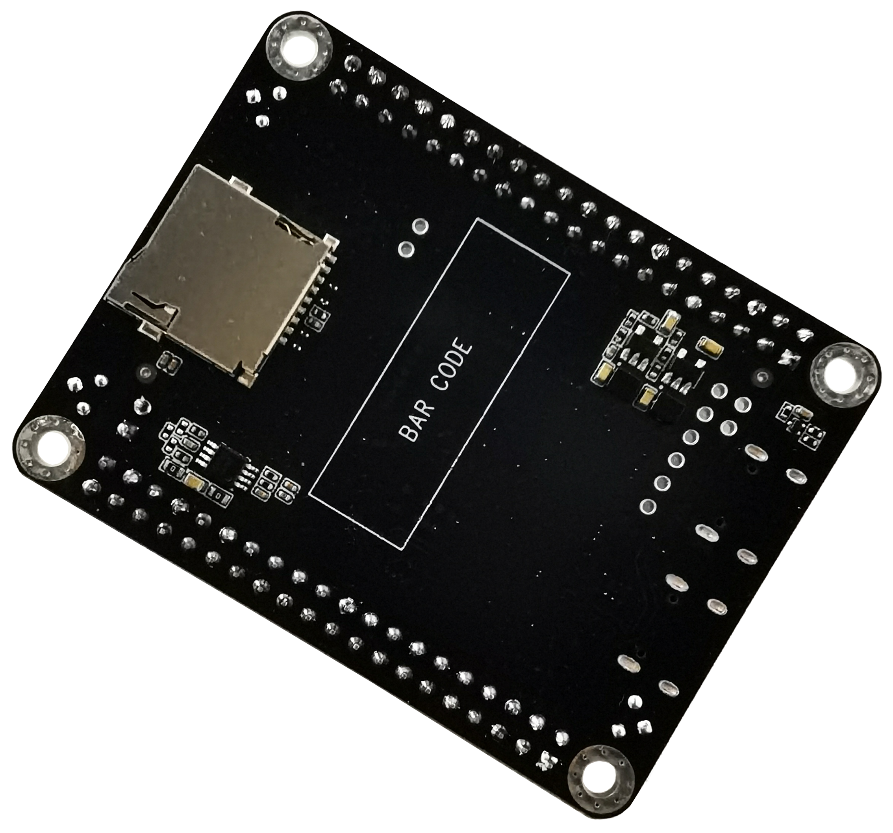 

<div align="center"> Rear Photo of the SF32LB58_DevKit-LCD Development Board </div>   <br> <br> <br>  


### Feature List
This development board has the following features:
1.	Module: onboard SF32LB58-MOD-N16R32N1 or SF32LB58-MOD-A128R32N1 module based on the SF32LB58x chip. The module configuration is as follows:
    - Standard SF32LB586VDD36 chip, with the following built-in co-packaged configuration:
        - 16 MB HPI-PSRAM, interface frequency 144 MHz
        - 16 MB HPI-PSRAM, interface frequency 144 MHz
        - 1 MB QSPI-NOR Flash, interface frequency 48 MHz
    - 16 MB QSPI-NOR Flash, interface frequency 72 MHz, STR mode (SF32LB58-MOD-N16R32N1 version)
    - 128 MB QSPI-NAND Flash, interface frequency 72 MHz, STR mode (SF32LB58-MOD-A128R32N1 version)
    - 48 MHz crystal
    - 32.768 kHz crystal
    - IPEX antenna connector
    - RF matching network and other resistor, capacitor, and inductor components
2.	Dedicated display interface
    - DSI/RGB888, up to 2-lane data transmission, standard 30-pin pinout FPC connector
    - DPI/RGB888, supports serial 8-bit RGB, 正点原子 40-pin pinout FPC connector
    - Dual SPI/DSPI/QSPI, supports DDR-mode QSPI, routed out through a 40-pin header
    - Supports touchscreens with an I2C interface
3.	Audio
    - Supports two analog MIC inputs. By default, one onboard analog MIC input is used. The onboard MIC or 40-pin header input can be selected via resistor jumpers.
    - Supports stereo analog audio output, with an onboard Class-D audio PA and up to 2.8 W output to a 4-ohm speaker. The speaker connects to the 40-pin header.
4.	USB
    - Type-C interface, supports the onboard USB-to-serial chip for firmware flashing and software DEBUG, and can be used to supply power
    - Type-C interface, supports USB 2.0 HS, and can be used for power input
5.	SD Card
    - Supports TF cards using the SDIO interface, with an onboard Micro SD card slot
6.  Header
    - Big-core GPIO input/output interface, 40-pin header
    - Small-core GPIO input/output interface, 40-pin header


### Functional Block Diagram

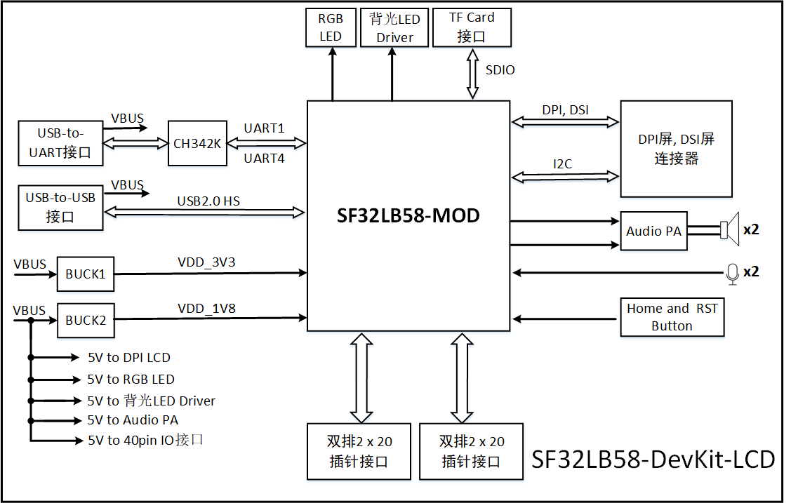 

<div align="center"> Development Board Functional Block Diagram </div>   <br> <br> <br> 

 
### Component Introduction

The mainboard of the SF32LB58-DevKit-LCD development board is the core of the entire kit. This mainboard integrates the SF32LB58-MOD-N16R32N1 module and provides LCD connectors for MIPI-DSI and DPI/RGB888.

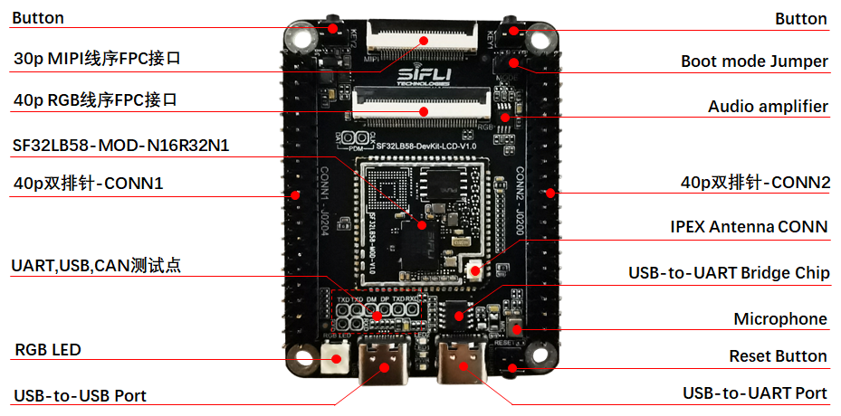 

<div align="center"> SF32LB58-DevKit-LCD Board - Front View (click to enlarge) </div>   <br> <br> <br> 


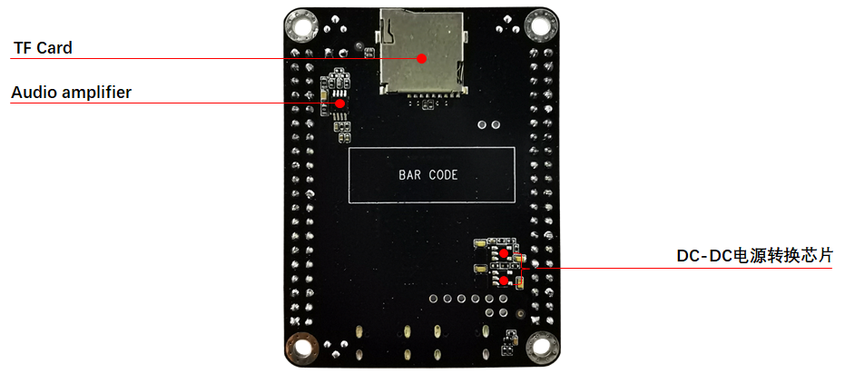 

<div align="center"> SF32LB58-DevKit-LCD Board - Back View (click to enlarge) </div>   <br> <br> <br> 

 
## Application Development

This section mainly describes how to set up the hardware and software, flash firmware to the development board, and develop applications.

### Required Hardware

- 1 x SF32LB58-DevKit-LCD (including the SF32LB58-MOD-N16R32N1 module)
- 1 x display module (MIPI-DSI or DPI/RGB888)
- 1 x USB 2.0 data cable (standard Type-A to Type-C)
- 1 x computer (Windows, Linux, or macOS)

```{note}

1. If you need both UART debugging and the USB interface, two USB 2.0 data cables are required;
2. Make sure to use an appropriate USB data cable. Some cables are for charging only and cannot be used for data transfer or firmware flashing.

```
### Optional Hardware

- 2 x speakers
- 1 x TF Card

### Hardware Setup

Prepare the development board and load the first sample application:

1.	Connect the display module to the corresponding LCD connector interface;
2.	Open SiFli's SifliTrace tool software and select the correct COM port;
3.	Plug in the USB data cable to connect the PC to the USB-to-UART port on the development board;
4.	The display lights up, and you can interact with the touchscreen using your finger.

Hardware setup is complete. You can now proceed with software setup.


### Software Setup

For the SF32LB58-DevKit-LCD development board, refer to the software documentation for how to quickly set up the development environment. 

## Hardware Reference

This section provides more information about the development board hardware.

### GPIO Assignment List

The following table lists the GPIO assignments for the SF32LB58-MOD-N16R32N1 module pins, which are used to control specific components or functions on the development board.

<div align="center"> SF32LB58-MOD-N16R32N1 GPIO Assignment </div>

```{table}
:align: center
|Pin|	Pin Name           	   |   Function  |
|:--|:-----------------------|:-----------|
|1   | VDDIOB   | PB-domain GPIO power input                 
|2   | PB_36    | DB_UART_RXD, program download and software debugging interface   
|3   | PB_37    | DB_UART_TXD, program download and software debugging interface   
|4   | PB_54    | HOME and long-press reset button        
|5   | PA_75    | SD2_DIO1, SD Card interface signal    
|6   | PA_76    | SD2_DIO0, SD Card interface signal    
|7   | PA_77    | SD2_CLK, SD Card interface signal    
|8   | PA_70    | SD2_CND, SD Card interface signal    
|9   | PA_81    | SD2_DIO3, SD Card interface signal    
|10  | PA_79    | SD2_DIO2, SD Card interface signal    
|11  | Boot_Mode | Boot mode selection signal. When =1, Download Mode; when =0, Run mode  
|12  | RSTN     | MCU reset signal 
|13  | VDD_1V8  | 1.8V power input                
|14  | GND      | Ground         
|15  | VDDIOA   | PA12~PA93 power input       
|16  | VDD_3V3  | 3.3V power input                 
|17  | PA_13    | DPI DE, LCDC1 interface signal       
|18  | PA_15    | DPI VSYNC, LCDC1 interface signal    
|19  | PA_14    | DPI HSYNC, LCDC1 interface signal    
|20  | PA_12    | DPI CLK, LCDC1 interface signal      
|21  | PA_67    | DPI B7, LCDC1 interface signal       
|22  | PA_65    | DPI B6, LCDC1 interface signal       
|23  | PA_63    | DPI B5, LCDC1 interface signal       
|24  | PA_62    | DPI B4, LCDC1 interface signal       
|25  | PA_61    | DPI B3, LCDC1 interface signal       
|26  | PA_58    | DPI B2, LCDC1 interface signal       
|27  | PA_57    | DPI B1, LCDC1 interface signal       
|28  | PA_56    | DPI B0, LCDC1 interface signal       
|29  | PA_55    | DPI G7, LCDC1 interface signal       
|30  | PA_54    | DPI G6, LCDC1 interface signal       
|31  | PA_53    | DPI G5, LCDC1 interface signal       
|32  | PA_50    | DPI G4, LCDC1 interface signal       
|33  | PA_48    | DPI G3, LCDC1 interface signal       
|34  | PA_47    | DPI G2, LCDC1 interface signal       
|35  | PA_46    | DPI G1, LCDC1 interface signal       
|36  | PA_45    | DPI G0, LCDC1 interface signal       
|37  | PA_44    | DPI R7, LCDC1 interface signal       
|38  | PA_43    | DPI R6, LCDC1 interface signal       
|39  | PA_27    | DPI R5, LCDC1 interface signal       
|40  | PA_26    | DPI R4, LCDC1 interface signal       
|41  | PA_25    | DPI R3, LCDC1 interface signal       
|42  | PA_24    | DPI R2, LCDC1 interface signal       
|43  | PA_23    | DPI R1, LCDC1 interface signal       
|44  | PA_22    | DPI R0, LCDC1 interface signal       
|45  | VDDIOA2  | PA00~PA11 power input        
|46  | GND      | Ground  
|47  | DSI_D0N  | MIPI-DSI D0N, LCDC1 interface signal   
|48  | DSI_D0P  | MIPI-DSI D0P, LCDC1 interface signal   
|49  | DSI_CLKN | MIPI-DSI CLKN, LCDC1 interface signal   
|50  | DSI_CLKP | MIPI-DSI CLKP, LCDC1 interface signal   
|51  | DSI_D1N  | MIPI-DSI D1N, LCDC1 interface signal   
|52  | DSI_D1P  | MIPI-DSI D1P, LCDC1 interface signal   
|53  | PA_32    | GPIO, UART1_RXD 
|54  | PA_31    | GPIO, UART1_TXD 
|55  | USB_DN   | USB_DN 
|56  | USB_DP   | USB_DP 
|57  | PA_17    | CTP Interrupt, DSI/DPI LCDC1 interface signal  
|58  | PA_16    | CTP Reset, DSI/DPI LCDC1 interface signal 
|59  | PA_00    | GPIO, SD1_DIO7, CAN1_TXD 
|60  | PA_03    | GPIO, SD1_DIO5, CAN1_RXD 
|61  | PB_17    | GPIO 
|62  | PB_18    | GPIO 
|63  | PB_11    | SWD_DIO 
|64  | PB_07    | SWD_CLK 
|65  | GND      | Ground     
|66  | AU_DAC1N_OUT | Analog Audio output signal    
|67  | AU_DAC1P_OUT | Analog Audio output signal    
|68  | MIC_BIAS | MIC bias voltage            
|69  | AU_ADC1N_IN  | MIC input signal        
|70  | AU_ADC1P_IN  | MIC input signal        
|71  | GND      | Ground     
|72  | BT_ANT   | Bluetooth antenna signal 
|73  | PB_51    | GPIO 
|74  | PB_52    | GPIO 
|75  | PB_56    | GPIO, KEY2 Input 
|76  | PB_57    | GPIO 
|77  | PB_58    | GPIO, TF card Detect signal 
|78  | PB_59    | GPIO 
|79  | PA_93    | CTP Reset, LCDC1 interface signal 
|80  | PA_92    | CTP Interrupt, LCDC1 interface signal
|81  | PA_91    | QSPI D0, LCDC1 interface signal 
|82  | PA_90    | QSPI CLK, LCDC1 interface signal 
|83  | PA_88    | QSPI CS, LCDC1 interface signal 
|84  | PA_86    | QSPI D3, LCDC1 interface signal 
|85  | PA_84    | QSPI D2, LCDC1 interface signal 
|86  | PA_82    | QSPI D1, LCDC1 interface signal 
|87  | PA_60    | CTP I2C_SCL, DSI/DPI LCDC1 interface signal 
|88  | PA_59    | CTP I2C_SDA, DSI/DPI LCDC1 interface signal 
|89  | PA_52    | BL PWM, QSPI LCDC1 interface signal   
|90  | PA_51    | LCD Reset, QSPI LCDC1 interface signal   
|91  | PA_42    | BL PWM, DSI/DPI LCDC1 interface signal   
|92  | PA_20    | GPIO, UART3_RXD 
|93  | PA_21    | GPIO, UART3_TXD 
|94  | PA_29    | GPIO, I2C2_SDA 
|95  | PA_28    | GPIO, I2C2_SCL
|96  | PA_18    | LCD Reset, DSI/DPI LCDC1 interface signal 
|97  | PA_02    | GPIO, CAN2_RXD 
|98  | PA_11    | GPIO, CAN2_TXD, SCI_RST 
|99  | PA_08    | GPIO, SD1_DIO6, SCI_DIO, UART2_RXD 
|100 | PA_07    | GPIO, SD1_DIO4, SCI_CLK, UART2_TXD  
|101 | PA_10    | GPIO, SD1_CMD, MPI4_CS 
|102 | PA_09    | GPIO, SD1_CLK, MPI4_CLK 
|103 | PA_06    | GPIO, SD1_DIO3, MPI4_DIO3 
|104 | PA_04    | GPIO, SD1_DIO1, MPI4_DIO1
|105 | PA_05    | GPIO, SD1_DIO0, MPI4_DIO0 
|106 | PA_01    | GPIO, SD1_DIO2, MPI4_DIO2 
|107 | PB_10    | QSPI CLK, LCDC2 interface signal 
|108 | PB_09    | QSPI D0, LCDC2 interface signal 
|109 | PB_08    | QSPI CS, LCDC2 interface signal 
|110 | PB_06    | QSPI D3, LCDC2 interface signal 
|111 | PB_04    | QSPI D2, LCDC2 interface signal 
|112 | PB_03    | QSPI D1, LCDC2 interface signal 
|113 | PB_02    | TE,      LCDC2 interface signal 
|116 | PB_23    | Audio PA enable signal 
|117 | PB_26    | GPIO
|118 | PB_28    | GPIO, I2C6_SCL 
|119 | PB_29    | GPIO, I2C6_SDA 
|120 | PB_24    | GPIO 
|121 | PB_27    | CTP Reset, LCDC2 interface signal 
|122 | PB_31    | BL PWM,   LCDC2 interface signal 
|123 | PB_30    | LCD Reset, LCDC2 interface signal  
|124 | PB_34    | CTP Interrupt, LCDC2 interface signal 
|125 | PB_39    | RGB-LED control signal 
|126 | PB_38    | GPIO 
|127 | PB_47    | Green-LED control signal 
|128 | PB_48    | Blue-LED  control signal 
|129 | AU_DAC2N_OUT | Analog Audio output signal    
|130 | AU_DAC2P_OUT | Analog Audio output signal    
|131 | AU_ADC2N_IN  | MIC input signal        
|132 | AU_ADC2P_IN  | MIC input signal        
|133 | GND      | Ground    
|134 | GND      | Ground    
|135 | GND      | Ground    
|136 | GND      | Ground    
|137 | GND      | Ground    
|138 | GND      | Ground    

```

GPIO assignment table for the module's internal memory:

<div align="center"> SF32LB58-MOD-N16R32N1 Module Internal Nor Flash Memory GPIO Assignment </div>

```{table}
:align: center
|Pin|	Pin Name           	   |   Function  |
|:--|:-----------------------|:-----------|
|1   | PA_30    | MPI4_CS                 
|2   | PA_36    | MPI4_D2   
|3   | PA_37    | MPI4_D1   
|4   | PA_38    | MPI4_D3  
|5   | PA_39    | MPI4_CLK  
|6   | PA_40    | MPI4_D0 
|7   | PA_87    | MPI4 Flash memory power enable; =1 power on, =0 power off &emsp; &emsp; &emsp; &emsp;

```

<div align="center"> SF32LB58-MOD-N16R32N1 Module Internal eMMC Memory GPIO Assignment </div>

```{table}
:align: center
|Pin|	Pin Name           	   |   Function  |
|:--|:-----------------------|:-----------|
|1   | PA_30    | SD1_D1   
|2   | PA_33    | SD1_D7   
|3   | PA_34    | SD1_CMD  
|4   | PA_35    | SD1_D6             
|5   | PA_36    | SD1_D2   
|6   | PA_37    | SD1_D5   
|7   | PA_38    | SD1_D4  
|8   | PA_39    | SD1_CLK  
|9   | PA_40    | SD1_D3 
|10  | PA_41    | SD1_D0   
|11  | PA_49    | RESET (GPIO reset)  
|12  | PA_80    | SD1 eMMC memory power enable; =1 power on, =0 power off &emsp; &emsp; &emsp; &emsp;

```

### 40P Pin Header Interface Definition

<div align="center"> CONN1-J0204 Signal Definitions </div>

```{table}
:align: center
|Pin|	Pin Name           	   |   Function  |
|:--|:-----------------------|:-----------|
|1   | 3V3      | 3.3 V power                 
|2   | 5V       | 5 V power   
|3   | IO2      | PB_29, **I2C6_SDA**, UART6_TXD, LPCOMP1_N   
|4   | 5V       | 5 V power        
|5   | IO3      | PB_28, **I2C6_SCL**, UART6_RXD, LPCOMP1_P     
|6   | GND      | Ground    
|7   | IO4      | PB_38, GPTIM3_CH3, GPADC_CH6, UART6_CTS    
|8   | IO14     | PB_01, **UART6_TXD**, I2C7_SCL, GPTIM3_CH2, LPTIM3_OUT    
|9   | GND      | Ground    
|10  | IO15     | PB_00, **UART6_RXD**, I2C7_SDA, GPTIM3_CH1, LPTIM3_IN     
|11  | IO17     | PB_17, UART5_RXD, SPI3_CLK   
|12  | IO18     | PB_18, UART5_TXD, SPI3_DI 
|13  | IO27     | PB_34, SPI4_CS, I2S3_MCLK, GPADC_CH2                
|14  | GND      | Ground         
|15  | IO22     | PB_27       
|16  | IO23     | PB_30                 
|17  | 3V3      | 3.3 V power       
|18  | IO24     | PB_31    
|19  | IO10     | PB_02    
|20  | GND      | Ground      
|21  | IO9      | PB_04       
|22  | IO25     | PB_03       
|23  | IO11     | PB_08       
|24  | IO8      | PB_06       
|25  | GND      | Ground       
|26  | IO7      | PB_09       
|27  | IO0      | PB_10       
|28  | IO1      | PA_01       
|29  | IO5      | PA_05       
|30  | GND      | Ground      
|31  | IO6      | PA_04       
|32  | IO12     | PA_06       
|33  | IO13     | PA_09       
|34  | GND      | Ground       
|35  | IO19     | PA_07       
|36  | IO16     | PA_10       
|37  | IO26     | PA_11       
|38  | IO20     | PA_08       
|39  | GND      | Ground       
|40  | IO21     | PA_02            
```

<div align="center"> CONN2-J0200 Signal Definitions </div>

```{table}
:align: center
|Pin|	Pin Name           	   |   Function  |
|:--|:-----------------------|:-----------|
|1   | 3V3      | 3.3 V power                 
|2   | 5V       | 5 V power   
|3   | IO2      | PA_29   
|4   | 5V       | 5 V power        
|5   | IO3      | PA_28     
|6   | GND      | Ground    
|7   | IO4      | PB_07    
|8   | IO14     | PA_21   
|9   | GND      | Ground    
|10  | IO15     | PA_20     
|11  | IO17     | MIC_BIAS   
|12  | IO18     | PB_11 
|13  | IO27     | ADC1N_IN, N terminal of analog Audio channel 1 differential input &emsp; &emsp; &emsp; &emsp; &emsp; &emsp; &emsp; &emsp; &emsp; &emsp; &emsp;               
|14  | GND      | Ground         
|15  | IO22     | ADC1P_IN, P terminal of analog Audio channel 1 differential input        
|16  | IO23     | ADC2N_IN, N terminal of analog Audio channel 2 differential input                 
|17  | 3V3      | 3.3 V power       
|18  | IO24     | ADC2P_IN, P terminal of analog Audio channel 2 differential input     
|19  | IO10     | PA_43    
|20  | GND      | Ground      
|21  | IO9      | PA_84       
|22  | IO25     | PA_82       
|23  | IO11     | PA_88       
|24  | IO8      | PA_86       
|25  | GND      | Ground       
|26  | IO7      | PA_91       
|27  | IO0      | PA_90       
|28  | IO1      | PA_51       
|29  | IO5      | PA_92       
|30  | GND      | Ground      
|31  | IO6      | PA_93       
|32  | IO12     | PA_52       
|33  | IO13     | PB_57       
|34  | GND      | Ground       
|35  | IO19     | SPK1_P, P terminal of left-channel speaker output       
|36  | IO16     | SPK1_N, N terminal of left-channel speaker output        
|37  | IO26     | SPK2_P, P terminal of right-channel speaker output       
|38  | IO20     | SPK2_N, N terminal of right-channel speaker output       
|39  | GND      | Ground       
|40  | IO21     | PB_59            

```

### 40-pin RGB FPC interface pinout definition

**Compatible with the 正点原子 40-pin FPC interface pinout**

<div align="center"> RGB-FPC-J0201 Signal Definitions </div>

```{table}
:align: center
|Pin|	Pin Name           	   |   Function  |
|:--|:-----------------------|:-----------|
|1   | 5V       | 5V power output                 
|2   | 5V       | 5V power output   
|3   | R0       | PA_22, LCDC1_DPI_R0  &emsp; &emsp; &emsp; &emsp; &emsp; &emsp; &emsp; &emsp; &emsp; &emsp; &emsp; &emsp; &emsp; &emsp; &emsp; &emsp; &emsp; &emsp;  
|4   | R1       | PA_23, LCDC1_DPI_R1        
|5   | R2       | PA_24, LCDC1_DPI_R2    
|6   | R3       | PA_25, LCDC1_DPI_R3    
|7   | R4       | PA_26, LCDC1_DPI_R4    
|8   | R5       | PA_27, LCDC1_DPI_R5    
|9   | R6       | PA_43, LCDC1_DPI_R6    
|10  | R7       | PA_44, LCDC1_DPI_R7    
|11  | GND      | Ground  
|12  | G0       | PA_45, LCDC1_DPI_G0 
|13  | G1       | PA_46, LCDC1_DPI_G1                
|14  | G2       | PA_47, LCDC1_DPI_G2         
|15  | G3       | PA_48, LCDC1_DPI_G3       
|16  | G4       | PA_50, LCDC1_DPI_G4                 
|17  | G5       | PA_53, LCDC1_DPI_G5       
|18  | G6       | PA_54, LCDC1_DPI_G6    
|19  | G7       | PA_55, LCDC1_DPI_G7    
|20  | GND      | Ground      
|21  | B0       | PA_56, LCDC1_DPI_B0       
|22  | B1       | PA_57, LCDC1_DPI_B1       
|23  | B2       | PA_58, LCDC1_DPI_B2       
|24  | B3       | PA_61, LCDC1_DPI_B3       
|25  | B4       | PA_62, LCDC1_DPI_B4       
|26  | B5       | PA_63, LCDC1_DPI_B5       
|27  | B6       | PA_65, LCDC1_DPI_B6       
|28  | B7       | PA_67, LCDC1_DPI_B7       
|29  | GND      | Ground       
|30  | CLK      | PA_12, LCDC1_DPI_CLK        
|31  | HSYNC    | PA_14, LCDC1_DPI_HSYNC       
|32  | VSYNC    | PA_15, LCDC1_DPI_VSYNC       
|33  | DE       | PA_13, LCDC1_DPI_DE       
|34  | BL       | PA_42, BL_PWM       
|35  | CTP_RST  | PA_16       
|36  | CTP_SDA  | PA_59, I2C4_SDA       
|37  | NC       | -       
|38  | CTP_SCL  | PA_60, I2C4_SCL       
|39  | CTP_INT  | PA_17       
|40  | RESET    | PA_18            

```

### 30-pin MIPI FPC interface pinout definition

<div align="center"> MIPI-FPC-J0202 Signal Definitions </div>

```{table}
:align: center
|Pin|	Pin Name           	   |   Function  |
|:--|:-----------------------|:-----------|
|1   | GND      | Ground                 
|2   | D2P      | MIPI-DSI signal, Data lane2 positive output  
|3   | D2N      | MIPI-DSI signal, Data lane2 negative output   
|4   | GND      | Ground        
|5   | D1P      | MIPI-DSI signal, Data lane1 positive output   
|6   | D1N      | MIPI-DSI signal, Data lane1 negative output    
|7   | GND      | Ground    
|8   | DCKP     | MIPI-DSI signal, clock positive output     
|9   | DCKN     | MIPI-DSI signal, clock negative output     
|10  | GND      | Ground    
|11  | D0P      | MIPI-DSI signal, Data lane0 positive output  
|12  | D0N      | MIPI-DSI signal, Data lane0 negative output 
|13  | GND      | Ground                
|14  | D3P      | MIPI-DSI signal, Data lane3 positive output         
|15  | D3N      | MIPI-DSI signal, Data lane3 negative output       
|16  | GND      | Ground                 
|17  | TE/NC    | PA_43, Tearing effect to MCU frame signal &emsp; &emsp; &emsp; &emsp; &emsp; &emsp; &emsp; &emsp; &emsp; &emsp;    
|18  | RESX     | PA_18, LCD RESET signal    
|19  | IOVCC    | MIPI-DSI display driver I/O power supply, 1.8V output    
|20  | VCI      | MIPI-DSI display driver VDD power supply, 3.3V output      
|21  | CTP_VDD  | CTP driver VDD power supply, 3.3V output       
|22  | CTP_INT  | PA_17, touchscreen interrupt input       
|23  | CTP_SDA  | PA_59, touchscreen I2C SDA signal       
|24  | CTP_SCL  | PA_60, touchscreen I2C SCL signal       
|25  | CTP_RTN  | PA_59, touchscreen RESET signal       
|26  | LEDK     | Backlight diode cathode       
|27  | LEDK     | Backlight diode cathode       
|28  | NC       | -       
|29  | LEDA     | Backlight diode anode       
|30  | LEDA     | Backlight diode anode       

```

### Power Supply Description

The SF32LB58-DevKit-LCD development board supports USB Type-C power input.

Both onboard USB Type-C ports can power the board. For flashing and debugging, use the USB-to-UART port.


### Flash the test firmware

#### Download the Impeller firmware flashing tool
Connect a USB cable to the USB-to-UART port, open SiFli Technology's firmware flashing tool, and select the corresponding COM port and firmware.
1.  Download Mode
- Install the Mode jumper cap, power on, and after startup the board enters download mode, allowing the program to be downloaded.
2.  Software Development Mode
- Remove the Mode jumper cap, power on, and after startup the board enters serial log printing mode, which is software debugging mode.

**For details, refer to&emsp;[Firmware Flashing Tool Impeller](../tools/烧录工具.md)**

#### J-Link SWD tool download and debugging

As shown in the two figures below, use DuPont wires to connect the corresponding IOs.

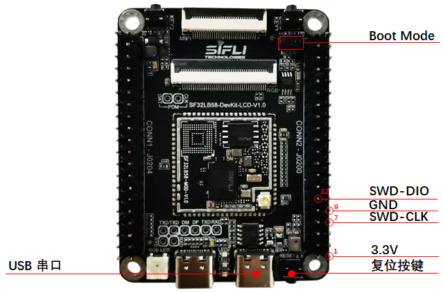 

<div align="center"> SF32LB58-DevKit-LCD Jlink Debug Wiring Diagram </div>   <br> <br> <br> 

 
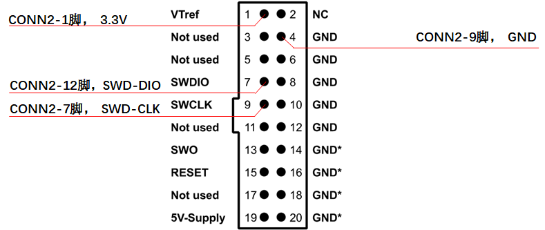 

<div align="center"> Jlink Debugger Wiring Diagram </div>   <br> <br> <br> 

 
For convenient connection, the development board comes with the adapter board shown below. The adapter board can be connected to the JLink debugger in the direction of the notch. Then plug in the included DuPont wires, and connect the other ends of the DuPont wires to the corresponding pins in {numref}`SF32LB58-DevKit-LCD-Jlink-PIN`, where VCC is the 3.3 V pin.

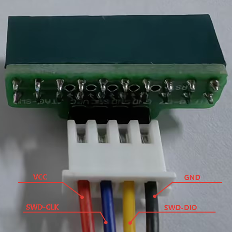 

<div align="center"> SWD Debugger Wiring Diagram </div>   <br> <br> <br> 


### LCD Display Interface

The SF32LB58-DevKit-LCD development board supports:
- MIPI-DSI interface (30p, 0.5 mm-pitch FPC connector), supporting up to 2-lane data transmission and up to 1280*800 resolution
    * Supported display model: [TFT-H080A11HDIFT4C30_V0-1](鑫洪泰)
- RGB interface (40p, 0.5 mm-pitch FPC connector), supporting up to RGB888 24-bit data transmission and up to 1280*800 resolution
    * Supported display models:
        * [IPS Version 7-inch RGB Display Module 1024*600 (ALIENTEK)](https://detail.tmall.com/item.htm?abbucket=17&id=609758563397&rn=b8068af8e33ece4aa2c043b54a77a153&spm=a1z10.5-b-s.w4011-24686329149.72.255354adb0S1oV)
        * [HTM-H070A20-RGB-A01C_V0-1](https://item.taobao.com/item.htm?id=845117257237&spm=a213gs.v2success.0.0.42674831Eg7yk8&skuId=5791172462409)
- QSPI interface (routed out through the 40p interface), supporting up to 512*512 resolution

**For details, refer to&emsp;[Display Debugging Tool](../tools/屏幕调试工具.md)**

#### MIPI display interface

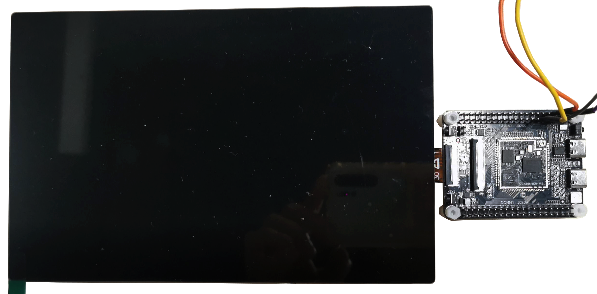 

<div align="center"> MIPI Interface Display Debug Wiring Diagram </div>   <br> <br> <br> 


#### RGB display interface

#### QSPI display interface

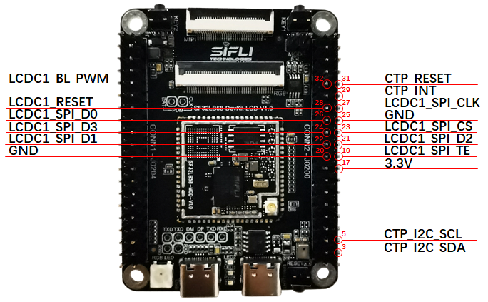 

<div align="center"> Large Core QSPI Interface Display Debug Wiring Diagram </div>   <br> <br> <br> 


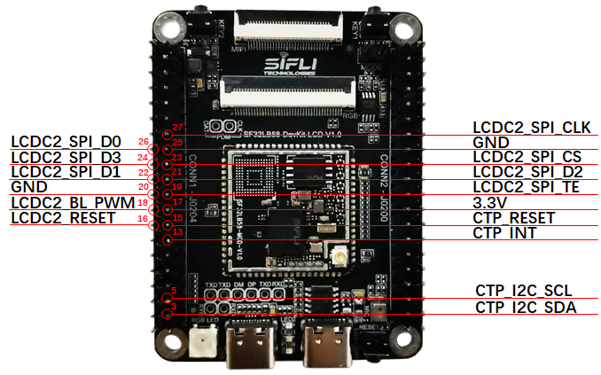 

<div align="center"> Small Core QSPI Interface Display Debug Wiring Diagram </div>   <br> <br> <br> 

 
### Audio Interface

The SF32LB58-DevKit-LCD development board supports:
- 1 onboard microphone input
- 2 audio ADC inputs (one is multiplexed with the onboard microphone and selected via a resistor jumper)
- 2 SPK outputs (support up to 3 W/4-ohm speakers)
- 1 PDM signal (multiplexed with the RGB signal and unavailable when the RGB display is operating)

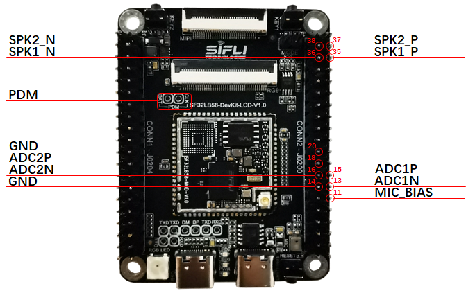 

<div align="center"> Audio Debug Wiring Diagram </div>   <br> <br> <br> 

 
### CAN interface

The SF32LB58-MOD module has a built-in CAN controller. The development board routes out a CAN interface, which requires an external CAN bus transceiver for use.

Refer to &emsp; [CAN Bus Transceiver Module](https://www.waveshare.net/shop/SN65HVD230-CAN-Board.htm)

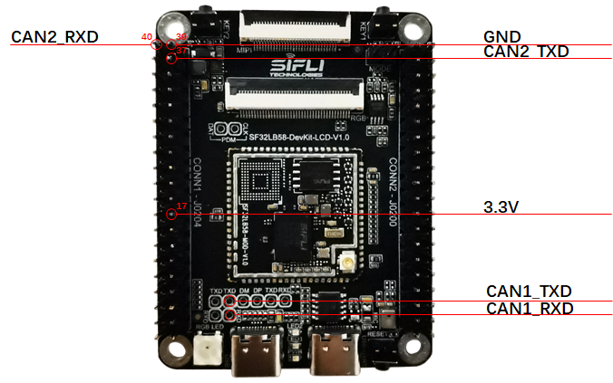 

<div align="center"> CAN Debug Wiring Diagram </div>   <br> <br> <br> 


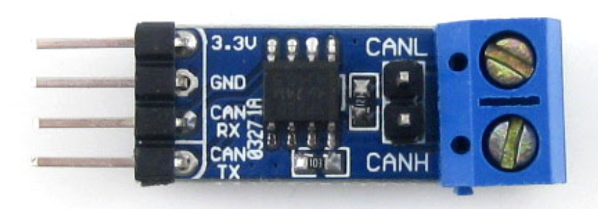 

<div align="center"> Reference CAN Bus Transceiver Module </div>   <br> <br> <br> 

 
### SDIO WiFi interface

Refer to &emsp; [SDIO WiFi Module](http://www.openedv.com/docs/modules/iot/atk-sdio-wifi.html)


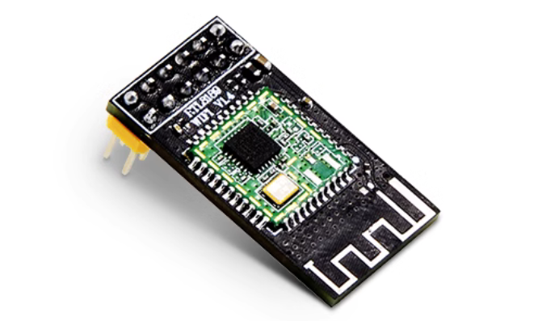 

<div align="center"> Reference SDIO WiFi Module </div>   <br> <br> <br> 


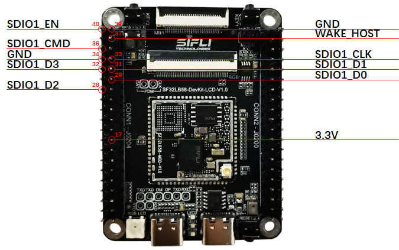 

<div align="center"> SDIO WiFi Wiring Diagram </div>   <br> <br> <br> 


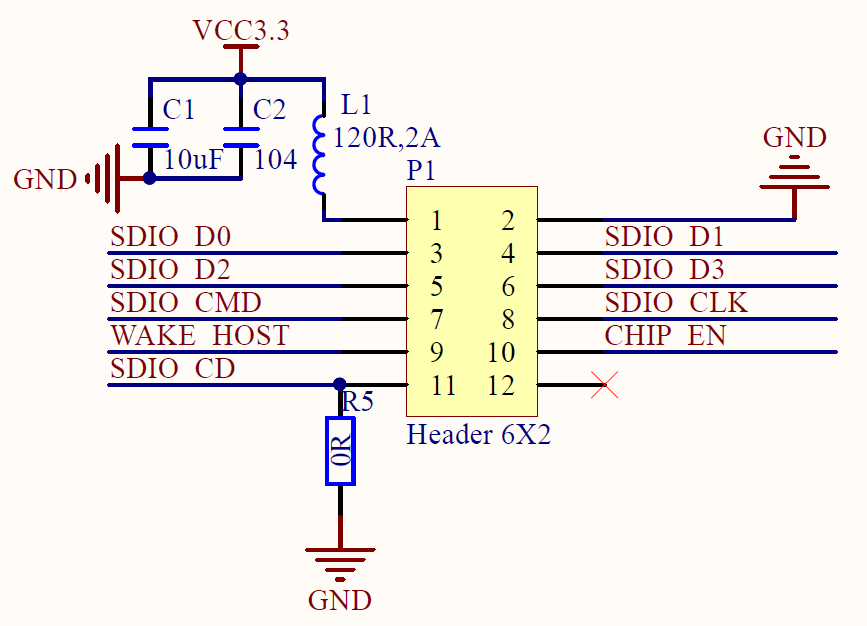 

<div align="center"> Reference SDIO WiFi Module Schematic </div>   <br> <br> <br> 

 
## Obtaining Samples

Obtain the chip:
- [SF32LB583VCC36](https://item.taobao.com/item.htm?id=933517354004&pisk=gv7sWM4jUAD_VujJfEPEAjyseKT2hWzPBjOAZs3ZMFL9Hr65p1-v3lXXctWHDN8N_99AI9v2BISZlxIditJwushXM989mGJ2QKTfiTs_UzzPs1YDy8yzzmhRoyY96q3tXSnpgIPe6utzUA8Dk8yrYqKgPEXtrvQsHDdpKCGtHtp99epHGAnAHdKKpQOkkKBAHHCpgIOxXCn9pWOwiVn9XVpKJQAvHqBvkW1pKILv6tLYO6pHMfyrNIZ6I1N8Tghwj2SO6pgxkNLDfKto0qgfxCKsj6pBYH7B1h9yDf1zlNBFMN7Mxom2o6S5hiB8LcJOVQ6B4GwS5T6MM9ddQSoDOi1ArFxsMqL1DObXjGG0Z6LOKgvkXk2HON7ycLxIC49VSO7BVaeKRBfFaNxhl8MpnGRkJI_0wm9XDgoozLgdPmGBqqdIjWNImm0ROnNkHXMKthdH1HPQOAImEq3qYWNIBGx9tCTzOWMOn&spm=a21xtw.29178619.0.0&skuId=5988791102029)
- [SF32LB586VDD36](https://item.taobao.com/item.htm?id=933517354004&pisk=gv7sWM4jUAD_VujJfEPEAjyseKT2hWzPBjOAZs3ZMFL9Hr65p1-v3lXXctWHDN8N_99AI9v2BISZlxIditJwushXM989mGJ2QKTfiTs_UzzPs1YDy8yzzmhRoyY96q3tXSnpgIPe6utzUA8Dk8yrYqKgPEXtrvQsHDdpKCGtHtp99epHGAnAHdKKpQOkkKBAHHCpgIOxXCn9pWOwiVn9XVpKJQAvHqBvkW1pKILv6tLYO6pHMfyrNIZ6I1N8Tghwj2SO6pgxkNLDfKto0qgfxCKsj6pBYH7B1h9yDf1zlNBFMN7Mxom2o6S5hiB8LcJOVQ6B4GwS5T6MM9ddQSoDOi1ArFxsMqL1DObXjGG0Z6LOKgvkXk2HON7ycLxIC49VSO7BVaeKRBfFaNxhl8MpnGRkJI_0wm9XDgoozLgdPmGBqqdIjWNImm0ROnNkHXMKthdH1HPQOAImEq3qYWNIBGx9tCTzOWMOn&skuId=5988791102030&spm=a21xtw.29178619.0.0)
- [SF32LB587VEE56](https://item.taobao.com/item.htm?id=933517354004&pisk=gv7sWM4jUAD_VujJfEPEAjyseKT2hWzPBjOAZs3ZMFL9Hr65p1-v3lXXctWHDN8N_99AI9v2BISZlxIditJwushXM989mGJ2QKTfiTs_UzzPs1YDy8yzzmhRoyY96q3tXSnpgIPe6utzUA8Dk8yrYqKgPEXtrvQsHDdpKCGtHtp99epHGAnAHdKKpQOkkKBAHHCpgIOxXCn9pWOwiVn9XVpKJQAvHqBvkW1pKILv6tLYO6pHMfyrNIZ6I1N8Tghwj2SO6pgxkNLDfKto0qgfxCKsj6pBYH7B1h9yDf1zlNBFMN7Mxom2o6S5hiB8LcJOVQ6B4GwS5T6MM9ddQSoDOi1ArFxsMqL1DObXjGG0Z6LOKgvkXk2HON7ycLxIC49VSO7BVaeKRBfFaNxhl8MpnGRkJI_0wm9XDgoozLgdPmGBqqdIjWNImm0ROnNkHXMKthdH1HPQOAImEq3qYWNIBGx9tCTzOWMOn&skuId=5988791102031&spm=a21xtw.29178619.0.0)

Obtain the module:
[SF32LB58-MOD Module](https://item.taobao.com/item.htm?id=940017626621&pisk=gpws56XXzFY_gHP-1xSeOn76yqMqfMWzWniYqopwDAHtkta7Jllxu14jGrznMRkabygYSy0qWmPwhEFLmruZ3oKjDykti5uq7qMbmzN1zTWzjlDmea7PUIK8n9DkWdh9upnKjxiOVb8H7lDmHa-eH_W7jPAJJDLxDDIIbcTxHV3xpMiqfdHxWjLp903KkxUxMkHK0mR96C3OA9noDqn9Bmhp90iqXxHYkDIIm2ntHxUYvMimtKxSc1ggfgIUwhlGo9qmRKpYdD3myk_e3Dwnf9g7f2inqJTo14EtRK7N19YEl22R86Z375UZxr65RYFuR-G-hOTofWESpVkRBpHaIlF-M8QDMlMs5rhbta9rfAPINRNGmeETzVN-Io-57kGxVRDaTN9-y7ZTaD2V-d3b9SeZsxYOlq2QvRFf43vrPpeWGHGkHDOGAMODiLEIGg0vAeKn6DmsTMsBWSYkHKRFAMTTsfnnfYSCAFUc.&spm=a21xtw.29178619.0.0)

Obtain the development board:
[SF32LB58-DevKit-LCD Development Board](https://item.taobao.com/item.htm?id=946577283968&pisk=gK6x53gtKz4m49uqDNVuI1gYYlEH67j4yZSIIFYm1aQRfZCMIsj6fdQ5So8cfr7OBUsNSEvMhfwO-MzqnOvcf_QVAIbObo-65N_9SsquKiS2QdahBJ2h07Z4epQv5n97fH-KCuAb9EaHOda3-JcoVIzDCNDEFgqSNH8ScmM15UtWjUt65n_6PQtBxq96CNZJNh-9chtXc8TWznHs1nMjPQt2bmGsCNs72HLW5dOf5gZJbUTs9yz9PmTiBstZ_zvnmrHrUTKvMFBMyvpcUvADRHTSC3WwDv8CcUHsIe38zfSRmrHFqKWcJHb0FxQdfM56wO37JFWRVt114qU9HgbVpK6LkxxkeEdBV9ZiTUXJoN6vNkDpsL6HOK1uarAMHh9XT_rZiF11v9pcozk6o6I5yBXorvvCTaB9OpszF9XdIZ0HJhcY2OGZ_ItrWwN9Cgxk_F-J-oet_fRz4AcAIocZ_QWe2eqYMflwaz5..&spm=a21xtw.29178619.0.0)


## Related Documents

- [SF32LB58x Chip Datasheet](https://wiki.sifli.com/silicon/index.html)
- [SF32LB58x User Manual](https://wiki.sifli.com/silicon/index.html)
- [SF32LB58-MOD Datasheet](https://wiki.sifli.com/silicon/index.html)
- [SF32LB58-MOD Design Drawings](https://downloads.sifli.com/hardware/files/documentation/SF32LB58-MOD-V1.0.1.zip?)
- [SF32LB58-DevKit-LCD Design Drawings](https://downloads.sifli.com/hardware/files/documentation/SF32LB58-DevKit-LCD-V1.0.1.zip?)
- [SF32LB58-DevKit-LCD Design Drawings - LCEDA Project](https://downloads.sifli.com/hardware/files/documentation/ProPrj_SF32LB58-DevKit-LCD_2025-09-24.epro?)
