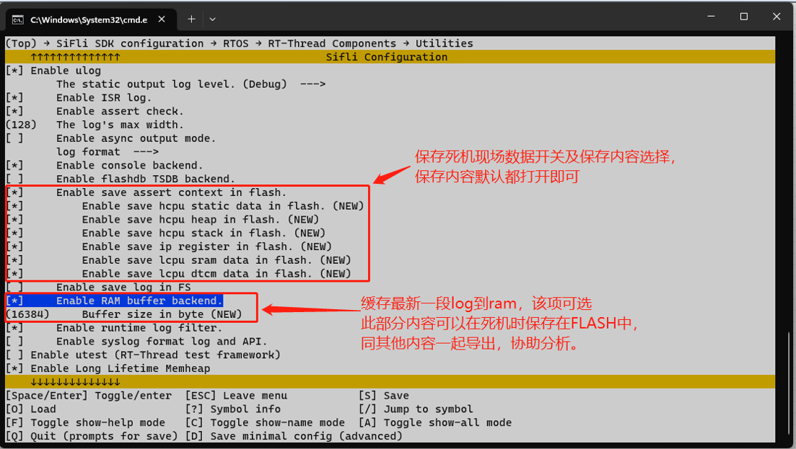
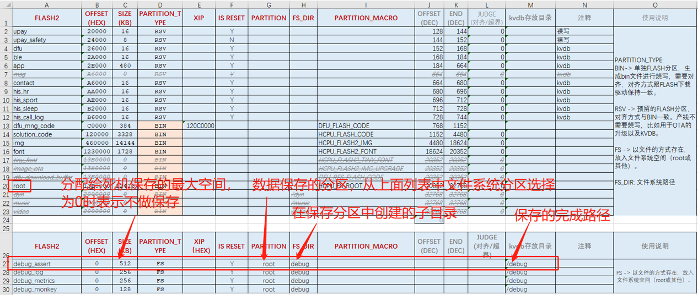
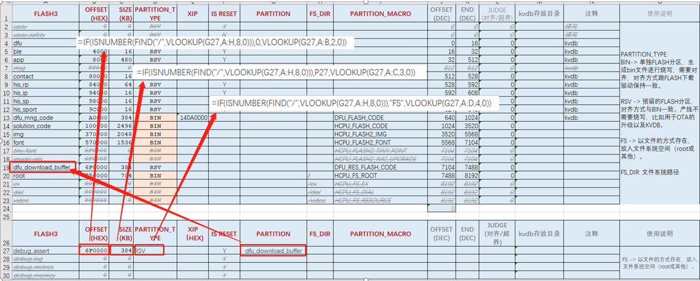
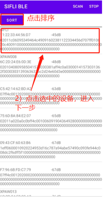
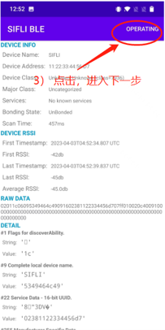
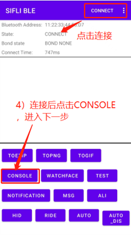
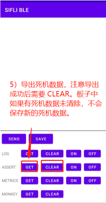
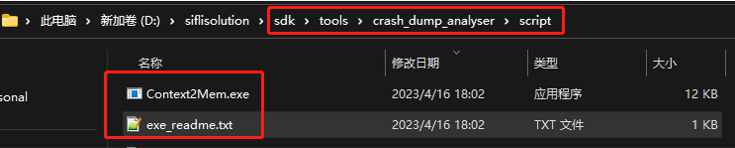
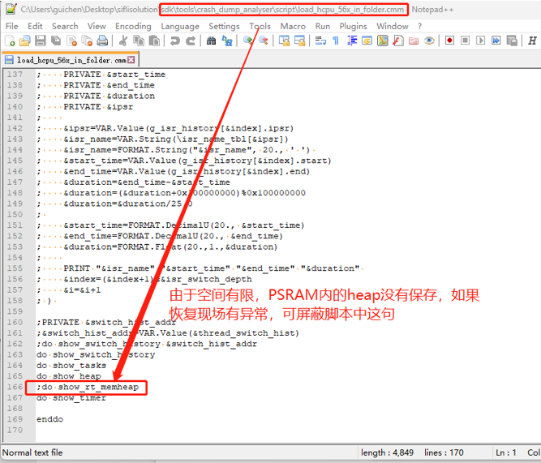

# 4 Methods for Saving the Crash Context
## 4.1 Saving the Crash Context to FLASH
1. menuconfig configuration 
 `(Top) → RTOS → RT-Thread Components → Utilities → Enable save assert context in flash. ` 
  

2. Space allocation (file system) 
Configure the space and partition used for crash data storage in the flash_map excel table. To save directly as files, configure SIZE/partition/subdirectory as needed (for reference only; the flash_map excel table is currently supported only by solution projects). You can also create your own file storage.
  
Configure the space and partition used for crash data storage in the flash_map excel table. You can use a shared buffer method: fill in the partition name of the shared buffer in the partition field, and use the formulas shown below to automatically obtain the address/SIZE/partition type.
  

3. Data export 
After the terminal crashes, it saves data to the configured location. After rebooting, you can export it with the mobile APP `SiFli_BLE`. The SiFli APP apk installation package and source code can be downloaded from github: 
[SiFli APP Demo Release](https://github.com/OpenSiFli/SiFli_OTA_APP/releases/tag/1.0.10) 
[SiFli_OTA_APP Demo](https://github.com/OpenSiFli/SiFli_OTA_APP)

The steps are as follows:
  

4. Data parsing 
Parse the exported file with the following tool, and then you can directly use the trace32 tool for crash-site analysis.
  
  
For the analysis method, refer to the section: 
[6.2 Restoring the Hcpu Crash Context with Trace32](../tools/trace32.md#Mark_用Trace32恢复Hcpu死机现场)
