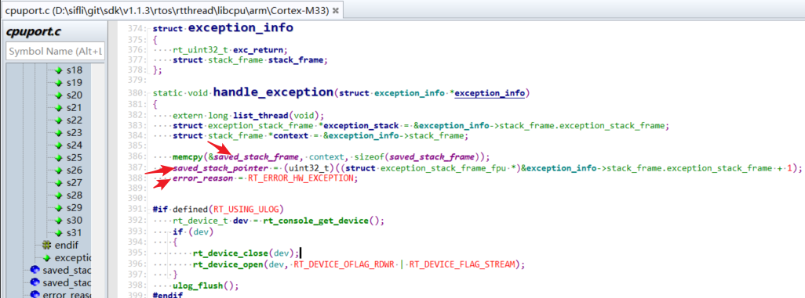
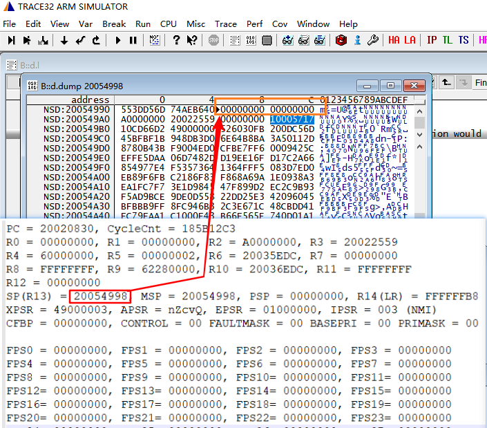
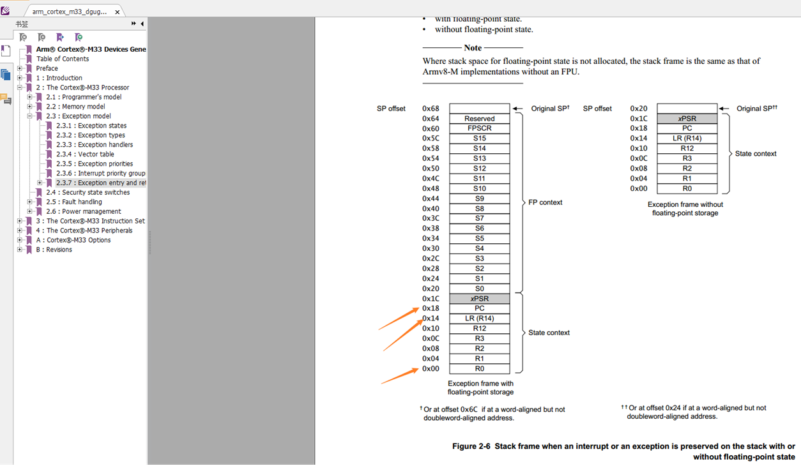

# 3 Restoring the Crash Context from a Memory Dump
## 3.1 Memory Dump Method
Refer to section [5.8 Memory Dump Method](../tools/sifli.md#Mark_Dump内存方法) to dump the crash memory context.<br>
## 3.2 Method for Automatically Restoring the Crash Context with Trace32
Refer to section [6.2 Restoring the Hcpu Crash Context with Trace32](../tools/trace32.md#Mark_用Trace32恢复Hcpu死机现场)<br>
<a name="33Trace32手动恢复死机现场方法"></a>
## 3.3 Method for Manually Restoring the Crash Context with Trace32
If automatic context restoration fails, you can manually enter the register values based on the crash context to restore the crash context.<br>
When an interrupt occurs (hardfault is also an interrupt), the interrupt function:<br>
```
HardFault_Handler->rt_hw_hard_fault_exception->handle_exception
```
Inside the function, registers R0-R4,R12,R14(LR),PC are pushed onto the `saved_stack_frame` and `saved_stack_pointer` variables,
<br><br>    
 The stacked registers can be seen in Figure 2 below. In the crash context shown in Figure 1 below, address 0x20054998 contains R0, address 0x200549AC contains LR, and address 0x200549B0 contains PC:0x10CD6602.<br>
Register PC: stores the program PC pointer before the crash.<br>
Register LR: stores the program pointer to return to after program execution completes.<br>
These registers can be used to restore the crash context.<br>
The global variable saved_stack_pointer stores the base address of the stacked data.<br>
The global variable saved_stack_frame stores the stacked data.<br>
<br><br>
<br><br>
