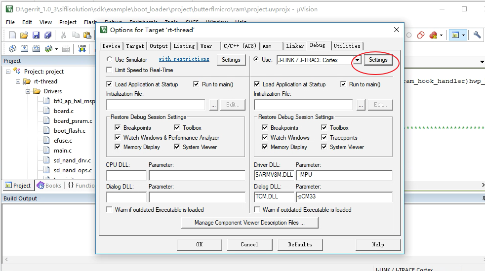
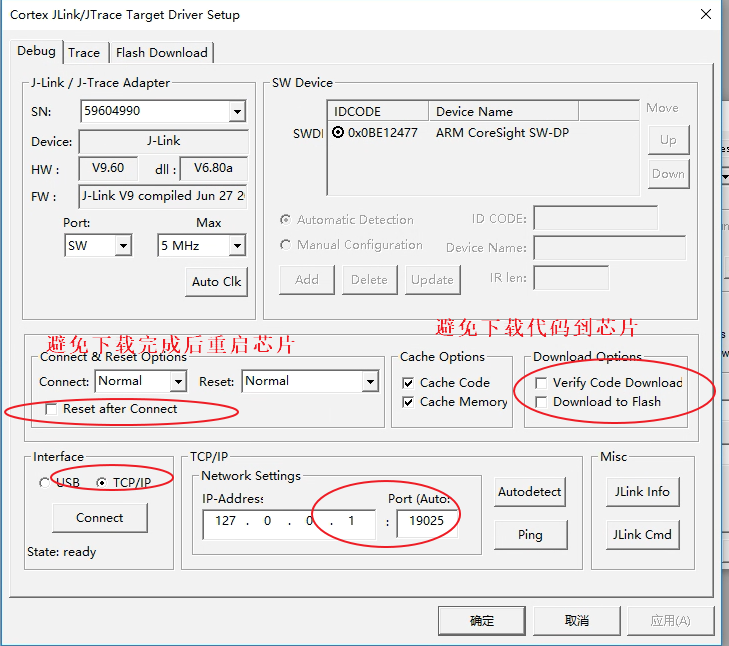
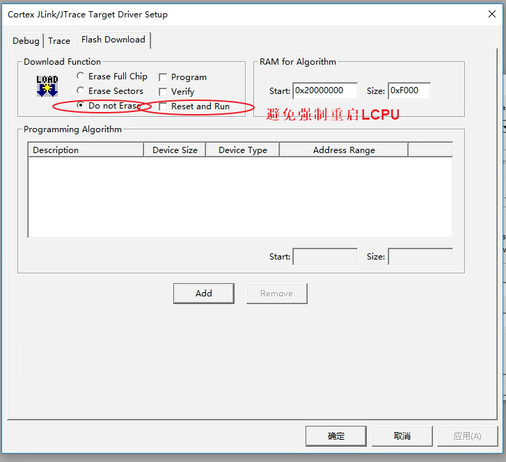
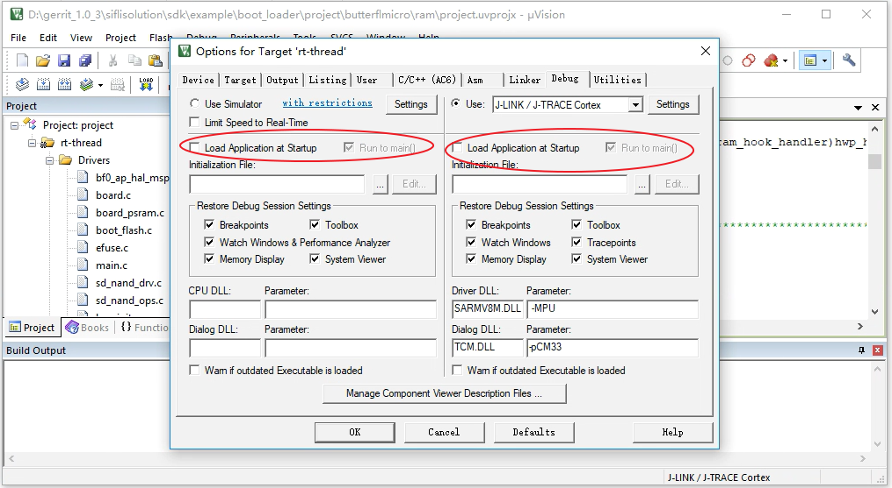
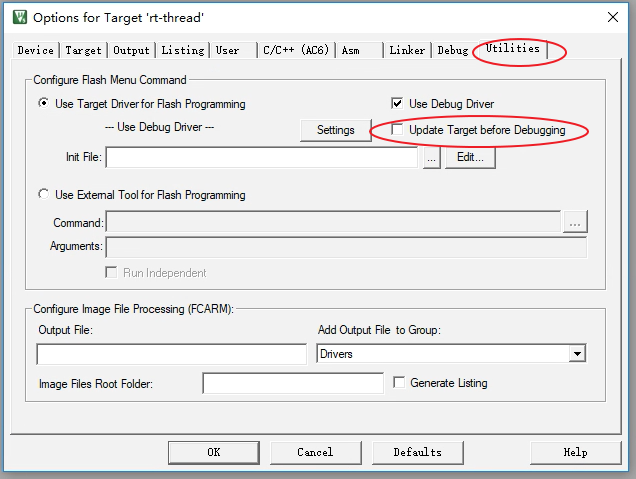
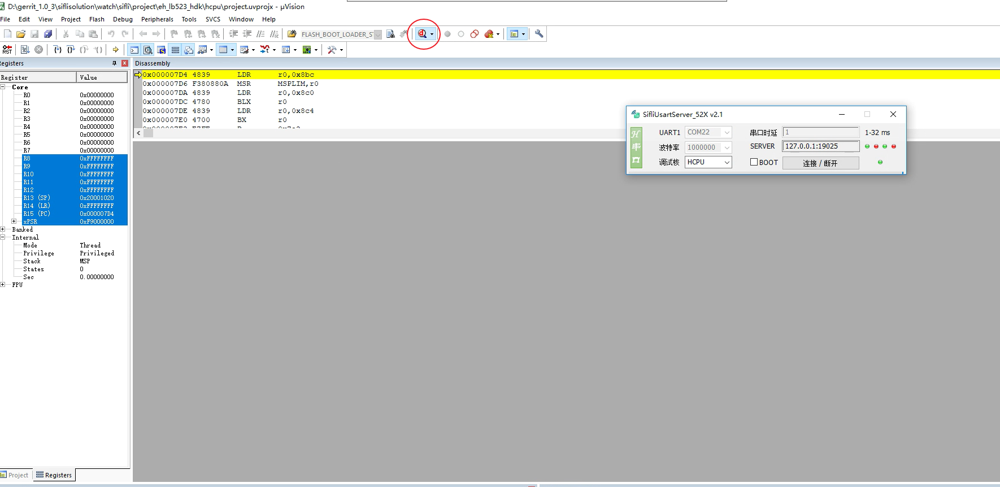
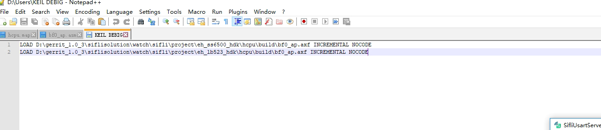
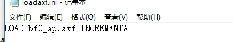
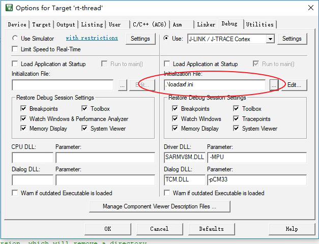

# 2 Online Debugging Method
## 2.1 Breakpoint Debugging Method
For crashes that occur in bootloader code, during system startup, or during wake-up from sleep, Jlink or the serial port may already be unavailable. Such crashes are often difficult to locate. You can add a breakpoint at a code location where you have confirmed the system has not crashed yet, and then connect online through SifliUsartServer or Jlink for online single-step execution to locate the issue. You can add a breakpoint at the very beginning of system reset:<br>
The HCPU startup assembly code is `drivers/cmsis/sf32lb55x/Templates/arm/startup_bf0_hcpu.S`
The LCPU startup assembly code is `drivers/cmsis/sf32lb55x/Templates/arm/startup_bf0_lcpu.S`
<br>Remove the comment character ';' from the first instruction in Reset_Handler so that it becomes `B .`
```c
; Reset Handler
Reset_Handler   PROC
                EXPORT   Reset_Handler             [WEAK]
                IMPORT   SystemInit
                IMPORT   __main

                B        . ;//MCU复位后第一条指令执行的位置，添加断点

                LDR      R0, =__stack_limit
                MSR      MSPLIM, R0                          ; Non-secure version of MSPLIM is RAZ/WI

                LDR      R0, =SystemInit ;//对应c语言函数void SystemInit(void)
                BLX      R0
                LDR      R0, =__main ;//对应c语言函数int $Sub$$main(void)->rtthread_startup();
                BX       R0
                ENDP
```

In this way, when the MCU starts, it will stay at the first instruction. After Jlink connects successfully, you can use Ozone or keil to change the PC register (+2) and set the required breakpoints, so as to debug the initialization process.<br>
You can also add the assembly instruction ` __asm("B .");` in the c file `SystemInit()` or `rtthread_startup()`.
```c
__ROM_USED int rtthread_startup(void)
{
    rt_hw_interrupt_disable();

    /* board level initialization
     * NOTE: please initialize heap inside board initialization.
     */
#ifdef RT_USING_PM
    rt_application_init_power_on_mode();
#endif // RT_USING_PM
    __asm("B ."); //设置断点
    rt_hw_board_init();
```
This keeps the system stopped at this instruction. At this time, connect J-Link, and use Ozone or Keil to change the PC register (+2), then continue single-step or breakpoint debugging.

## 2.2 Ozone Single-Step Debugging Configuration
Please refer to the relevant section for the Ozone tool:<br>
[4.3 Ozone Single-Step Debug](../tools/ozone.md/#43Ozone单步调试Debug)
## 2.3 Keil Single-Step Debugging Configuration
<br><br>
- Method for importing an axf file:<br>
1. Import by command
<br><br>
2. Import by script file<br>
Add the script file loadaxf.ini to the keil root directory, with the following content:
<br><br>
Note: The axf file bf0_ap.axf must be placed in the keil root directory;
Add loadaxf.ini to the configuration interface;
<br><br>
