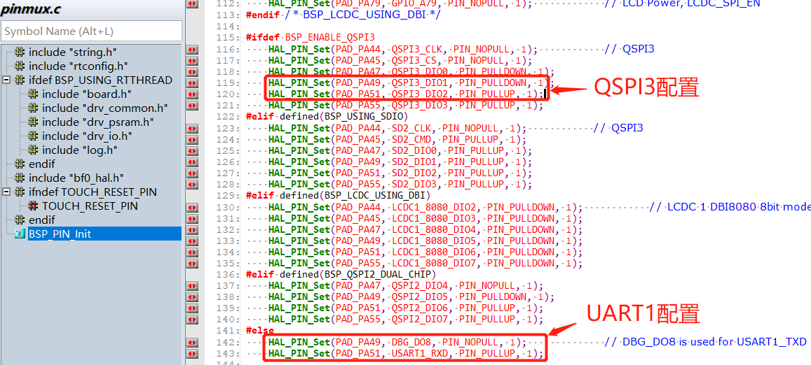
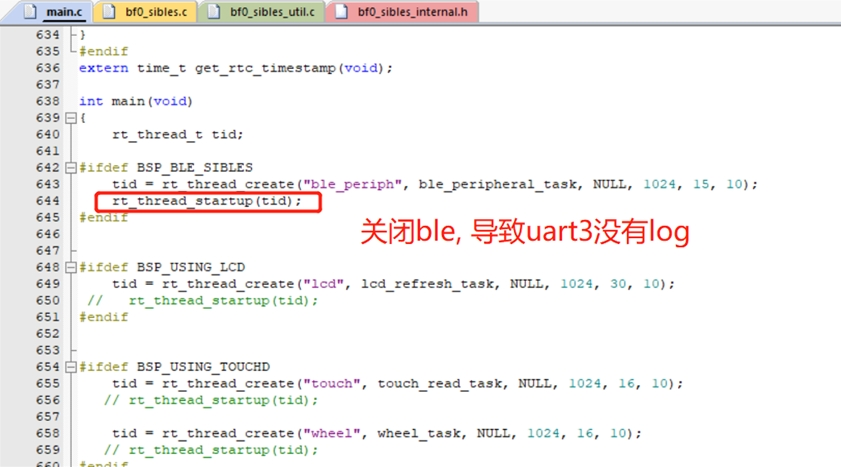
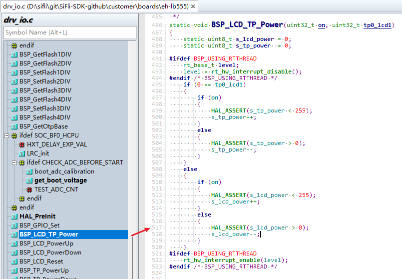

# 1 Log Debugging
## 1.1 No Log Output from HCPU
1. Set menuconfig→ RTOS → RT-Thread Kernel → Kernel Device Object→uart1 to uart1
2. Enable menuconfig → RTOS → RT-Thread Components → Utilities→Enable ulog
TIPS: In menuconfig, you can enter "/" to search for "ulog"
3. Whether the UART1 configuration in pinmux.c is correctly configured as UART1. A common case is that BSP_ENABLE_QSPI3 is enabled, as shown in the figure below:
<br><br>    

## 1.2 No Log Output from LCPU
After the following configuration, there is still no print output:<br>
  1. Set menuconfig→ RTOS → RT-Thread Kernel → Kernel Device Object→uart3 to uart3<br>
  2. Enable menuconfig → RTOS → RT-Thread Components → Utilities→Enable ulog<br>
  3. Confirm that in hcpu, menuconfig→ RTOS → RT-Thread Kernel → Kernel Device Object→uart1 is not configured as uart3; otherwise, there will be a conflict.<br>
  4. Confirm that in pinmux.c, the mode configurations for PB45 and PB46, the two UART3 pins, are correct. The default configuration is correct, as follows:<br>
  ```c
    HAL_PIN_Set(PAD_PB45, USART3_TXD, PIN_NOPULL, 0);           // USART3 TX/SPI3_INT
    HAL_PIN_Set(PAD_PB46, USART3_RXD, PIN_PULLUP, 0);           // USART3 RX
```	
Other cause 1: <br>
When using the V0.9.9\example\rt_driver\project\ec-lb551 project, the ble thread is not enabled, causing the Lcpu program not to be loaded.<br>
<br><br>       
Solution:<br>
Enable the ble thread or call the function lcpu_power_on(); separately to start the lcpu code.<br>
Other cause 2:<br>
```
example\multicore\ipc_queue\
example\pm\coremark\
```
For these projects, you need to send the command `lcpu on` in the HCPU console to start the LCPU. After startup succeeds, you can see the startup log on the LCPU console.<br>
Solution:<br>
In the corresponding project, there is a readme.txt file. You can refer to its contents to send the command to enable Lcpu.<br>

## 1.3 Method for Printing Registers in Code
Direct address read operation:
```c
static uint32_t pinmode19;
pinmode19= *(volatile uint32_t *)0x4004304c; //读取寄存器0x4004304c的值
uint32_t reg_printf= *(volatile uint32_t *)0x50016000; //打印寄存器0x50016000的值
rt_kprintf("0x50016000:0x%x\n",reg_printf);
```
Direct address write operation:
```c
#define _WWORD(reg,value) \
{ \
    volatile uint32_t * p_reg=(uint32_t *) reg; \
    *p_reg=value; \
}
_WWORD(0x40003050,0x200);  //PA01 pinmux寄存器写值0x00000200
```
Register-defined read operation:
```c
rt_kprintf("hwp_hpsys_rcc->CFGR:0x%x\n",hwp_hpsys_rcc->CFGR);
uint32_t reg_printf= hwp_hpsys_rcc->CFGR; //打印寄存器
rt_kprintf("hwp_hpsys_rcc->CFGR:0x%x\n",reg_printf);
```
Register-defined write operation:
```c
hwp_hpsys_rcc->CFGR = 0x40003050;//直接写值
MODIFY_REG(hwp_pmuc->LPSYS_SWR, PMUC_LPSYS_SWR_PSW_RET_Msk,
			MAKE_REG_VAL(1, PMUC_LPSYS_SWR_PSW_RET_Msk, PMUC_LPSYS_SWR_PSW_RET_Pos)); //只修改PMUC_LPSYS_SWR_PSW_RET_Msk的值为1，其他地方不变；

```
## 1.4 Method for Locating a Crash with Logs
1. Prompt indicating a crash on the peer core<br>
In the following log, after it indicates an LCPU crash, the Assert is actively triggered by Hcpu. You need to check where the LCPU crashed.<br>
```
07-11 10:31:55:616    [351767] E/mw.sys ISR: LCPU crash
07-11 10:31:55:617    Assertion failed at function:debug_queue_rx_ind, line number:221 ,(0)
07-11 10:31:55:617    Previous ISR enable 0
```
**Description**: During dual-core development, when one CPU has crashed, the state of the other CPU is actually unknown, and it may continue running for a long time, making the issue harder to detect. The current software design is that when one CPU has a known assert or hard fault, it notifies the peer core. After the peer core receives the notification, it triggers its own assert to facilitate troubleshooting; 

2. Assert line number prompt<br>
The following log indicates that the Assert occurred at line 517 of the drv_io.c file.
```
07-10 16:41:16:382    [572392] I/drv.lcd lcd_task: HW close
07-10 16:41:16:385    HAL assertion failed in file:drv_io.c, line number:517 
07-10 16:41:16:388    Assertion failed at function:HAL_AssertFailed, line number:616 ,(0)
07-10 16:41:16:389    Previous ISR enable 1
```
Line 517 of the corresponding drv_io.c file is shown in the figure below:<br>
When the value in parentheses of `RT_ASSERT(0);` or `HAL_ASSERT(s_lcd_power > 0);` is 0 (False), a crash will occur;<br>
A crash occurring here means that `s_lcd_power > 0` is false (s_lcd_power is not greater than 0).
<br><br>  

3. Log prompt showing crash PC pointer information<br>
In the following Log, when a hard fault occurs, the PC pointer at this time has already jumped into the abnormal interrupt `HardFault_Handler` or into the `rt_hw_mem_manage_exception` or `rt_hw_hard_fault_exception` function inside `MemManage_Handler`. The PC pointer seen after connecting may no longer be the first crash site. At this time, the series of addresses such as PC printed in the Log is the first crash site and can be used to restore the first crash context. As shown below, it indicates that the crash occurred at the PC address `0x0007ef00`. You can check the corresponding compiled `*.asm` file to see why this instruction crashed. Usually, the accessed memory or address is unreachable, causing an abnormal interrupt crash.<br> 
**Description**: In the function `handle_exception`, the variables `saved_stack_frame`, `saved_stack_pointer`, and `error_reason` will also store the crash stack, crash stack address, and crash reason in the following Log when the above abnormal crash occurs. You can analyze the crash cause by comparing them with the source code data structure.
```
06-24 15:48:41:031     sp: 0x200195c8
06-24 15:48:41:037    psr: 0x80000000
06-24 15:48:41:041    r00: 0x00000000
06-24 15:48:41:042    r01: 0x2001960c
06-24 15:48:41:043    r02: 0x00000010
06-24 15:48:41:044    r03: 0x0007ef00
06-24 15:48:41:045    r04: 0x00000000
06-24 15:48:41:046    r05: 0x00000010
06-24 15:48:41:046    r06: 0x00000000
06-24 15:48:41:047    r07: 0x00000010
06-24 15:48:41:047    r08: 0x2001960c
06-24 15:48:41:048    r09: 0x2001965c
06-24 15:48:41:049    r10: 0x60000000
06-24 15:48:41:049    r11: 0x00000000
06-24 15:48:41:050    r12: 0x200001cd
06-24 15:48:41:051     lr: 0x12064845
06-24 15:48:41:052     pc: 0x0007ef00
06-24 15:48:41:052    hard fault on thread: mbox
06-24 15:48:41:053    
06-24 15:48:41:053    =====================
06-24 15:48:41:054    PSP: 0x20019534, MSP: 0x2001419c
06-24 15:48:41:055    ===================
```
