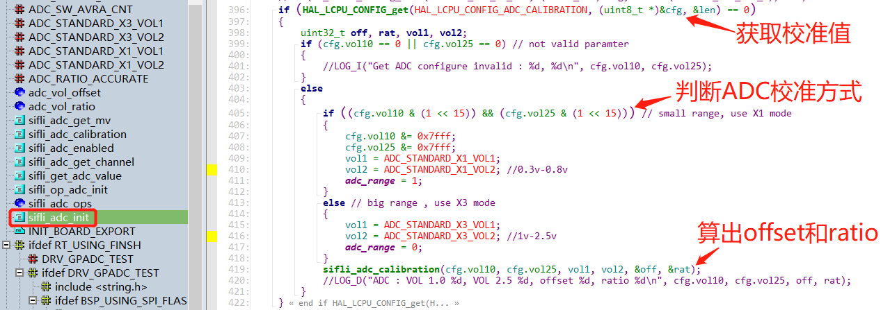
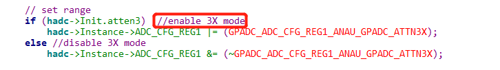
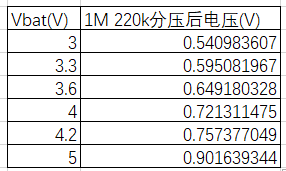
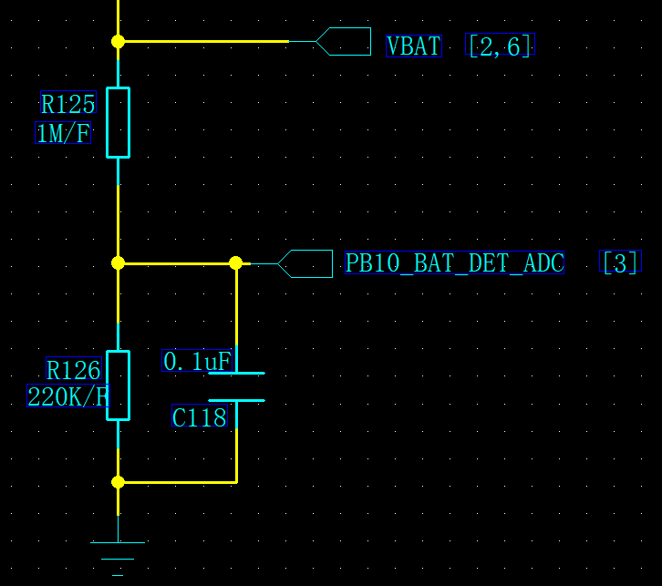
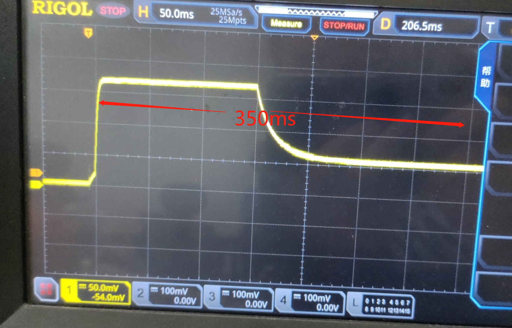
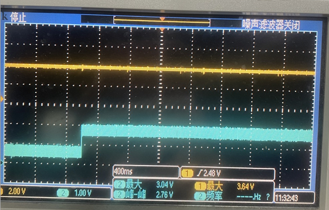
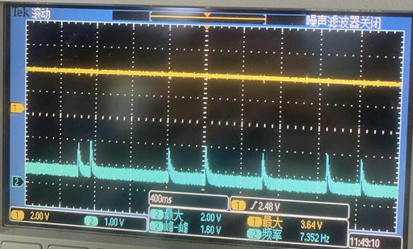
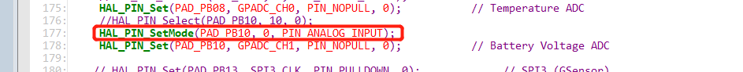

# 6 ADC Related
## 6.1 55 Series ADC Calibration Principle
The sf32lb55x chip has a 10-bit ADC. To ensure ADC sampling accuracy:<br> 
Calibration principle: <br> 
When the chip leaves the factory, the ADC values of each chip at 1.0V and 2.5V are measured and written into the factory area in flash, with the ID FACTORY_CFG_ID_ADC.;<br> 
During ADC initialization sifli_adc_init, these two values are read from the factory area of flash, namely the variables vol10 and vol25, which correspond to the voltage values 1.0v and 2.5v;<br>  
Through the function
```c
sifli_adc_calibration(cfg.vol10, cfg.vol25, vol1, vol2, &off, &rat);
#define ADC_STANDARD_X3_VOL1           (1000)
#define ADC_STANDARD_X3_VOL2           (2500)
```
A linear line between the ADC values of the corresponding registers and the voltage values is calculated;<br> 
The offset value offset and linear ratio ratio of this line are obtained. The offset value is the calculated register value corresponding to 0V;<br> 

All values read by the ADC later obtain the corresponding voltage value through this offset and radio ratio;<br> 
**Note:**<br> 
Early versions used the two sampling points 1V and 2.5V as ADC calibration points.<br> 
```c
#define ADC_STANDARD_X3_VOL1           (1000)
#define ADC_STANDARD_X3_VOL2           (2500)
```
New versions use two sampling points, 0.3 V and 0.8 V, as ADC calibration points.<br> 
```c
#define ADC_STANDARD_X1_VOL1           (300)
#define ADC_STANDARD_X1_VOL2           (800)
```
To distinguish it from the calibration method using the two sampling points 0.3V and 0.8V, the highest bit of these two calibration values is set to 1,
as follows:<br> 
<br><br>
```c
if ((cfg.vol10 & (1 << 15)) && (cfg.vol25 & (1 << 15))) // small range, use X1 mode
``` 
The corresponding sifli_adc_get_mv calculation method also uses different algorithms for the two different calibration ranges, adc_range.<br> 

When using the calibration method with the two sampling points 0.3V and 0.8V, the accuracy is insufficient when the voltage is close to 0V and after it exceeds 1V. In addition, in this mode, the software register ADC_CFG_RE disables the GPADC_ADC_CFG_REG1_ANAU_GPADC_ATTN3X mode, that is, it disables the internal voltage divider resistor. Therefore, the ADC test point cannot be directly connected to a voltage above 1.1V; otherwise, the chip may be burned out.<br> 
 <br><br>
When using the calibration method that takes the two sampling points 1V and 2.5V as ADC calibration points, the register configuration enables GPADC_ADC_CFG_REG1_ANAU_GPADC_ATTN3X mode. The voltage divider resistor inside the chip is enabled, providing 3x attenuation, and the input voltage must not exceed 3.3V.<br> 

## 6.2 Debug Method for Inaccurate ADC Sampling of Vbat Battery Voltage
a. Use a multimeter to test the sampling point level. The currently recommended voltage divider circuit uses 1M/220k voltage divider resistors with 1% accuracy;<br> 
Therefore, the level at the sampling point should be within the following corresponding voltages. If it does not match, confirm the resistance values and accuracy of the voltage divider resistors;<br> 
(Note: When measuring the sampling point voltage with a multimeter or oscilloscope, the input impedance of the introduced device will cause a 30mV voltage drop.)<br> 
<br><br> 
<br><br> 
b. After power-on startup and after wake-up from sleep, ADC sampling during the first approximately 300ms may be inaccurate, as shown in the following figure:<br> 
<br><br> 
By capturing the ADC sampling waveform at startup with an oscilloscope, you can find that in addition to the default high level at the beginning, the ADC waveform also has charging and discharging caused by the rc circuit, causing the sampling to stabilize only after about 350ms. In actual applications, add a sampling delay or filter out the initial unstable sampling values according to the actual situation.<br> 
c. In addition, after entering standby, the following sampling point waveform may appear:<br> 
<br><br> 
After waking up from standby, the sampling point has the following waveform:<br> 
<br><br> 
The reason here is that PB10 is in the internal pull-up state by default before initialization. When used as an ADC input, it needs to be configured in pinmux.c as PIN_NOPULL and in PIN_ANALOG_INPUT mode;<br> 
As shown in the figure below, the following setting in the red box is missing and should be set to PIN_ANALOG_INPUT mode, which causes the internal pull-up resistor on PB10 above to be enabled,
Occasionally, the sampled voltage may be very high;<br> 
<br><br> 
d. The 55x chip has not been calibrated;<br> 
Chips are calibrated before leaving the factory. After calibration, ADC calibration parameters are stored in the factory area of flash. For details, refer to the section on the ADC calibration principle.
<br> 
## 6.3 ADC Notes
a. The maximum sampling value for 55x is 1.1V, and for 56x and 52x it is 3.3V. The sampling voltage must not be greater than this value; otherwise, the ADC module can easily be damaged.<br> 
b. When connecting the 56x log uart output to an external PC, the reference level of the external hardware serial-port tool used must match the IO level. Otherwise, ADC sampling accuracy will be affected. For example, if the IO level is 3.3v and the reference level of the externally connected hardware serial-port tool is 5V, the sampled adc value will be much lower than normal. A 4V battery may be detected as only 3.3V.<br> 
c. When using a multimeter to measure the voltage at the sampling point, because a resistor has been introduced, the measured value is generally slightly lower than the actual value.<br>
