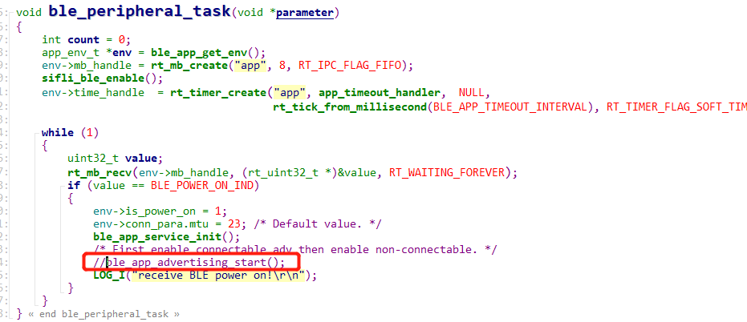
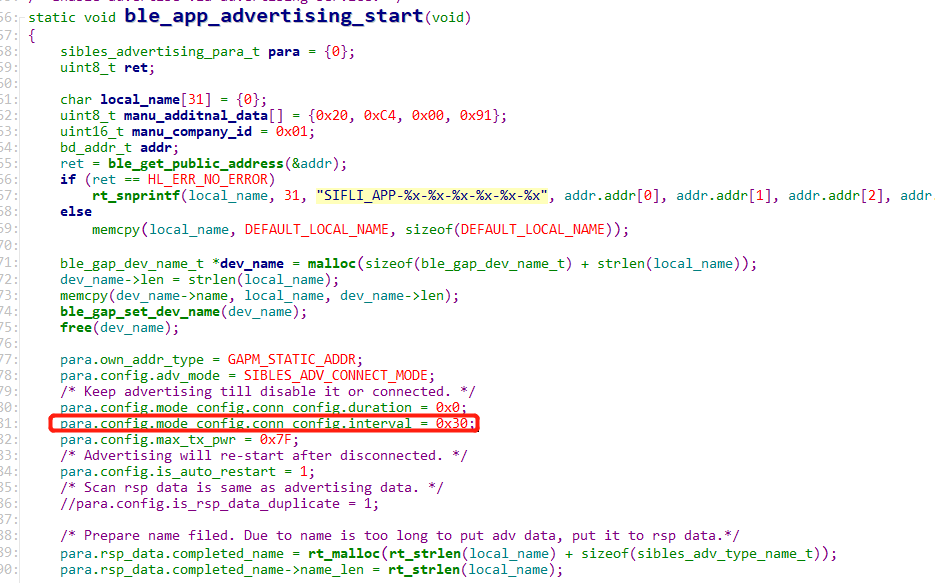

# 11 Bluetooth
## 11.1 Disabling BLE Advertising and Modifying the BLE Advertising Interval
Remove the call to: ble_app_advertising_start(); from the ble_peripheral_task function. 
As shown in the figure below:
    
Modify the ble advertising interval: 
In the ble_app_advertising_start function,
    
para.config.mode_config.conn_config.interval = 0x30; //0x30*0.625=30ms, advertise once every 30ms 
0x30 is decimal 48 * 0.625=30ms, advertise once every 30ms. 
If you want to change it to advertise once every 500ms, change it to 800. 
