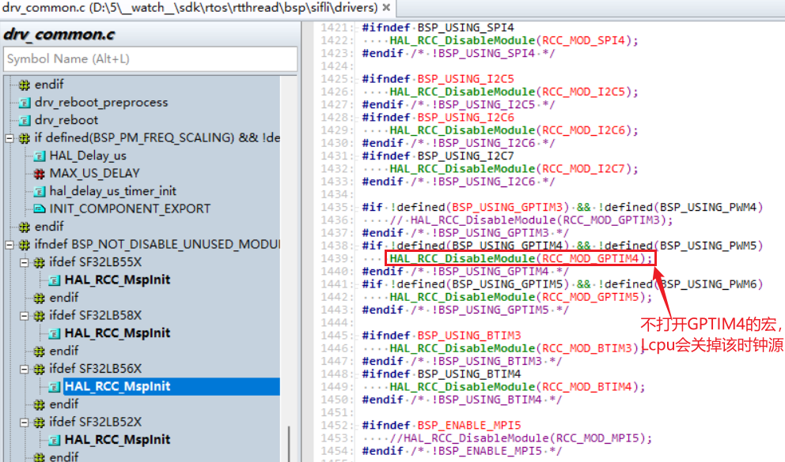
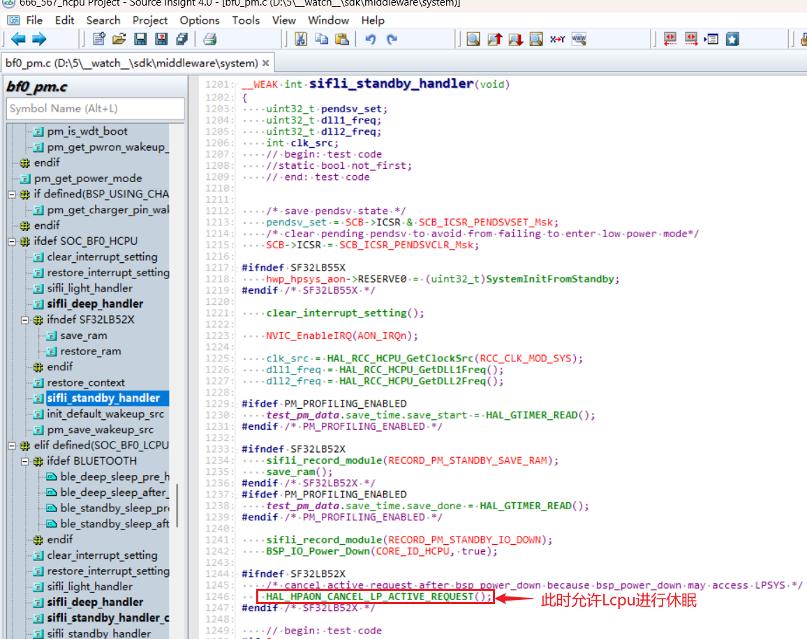
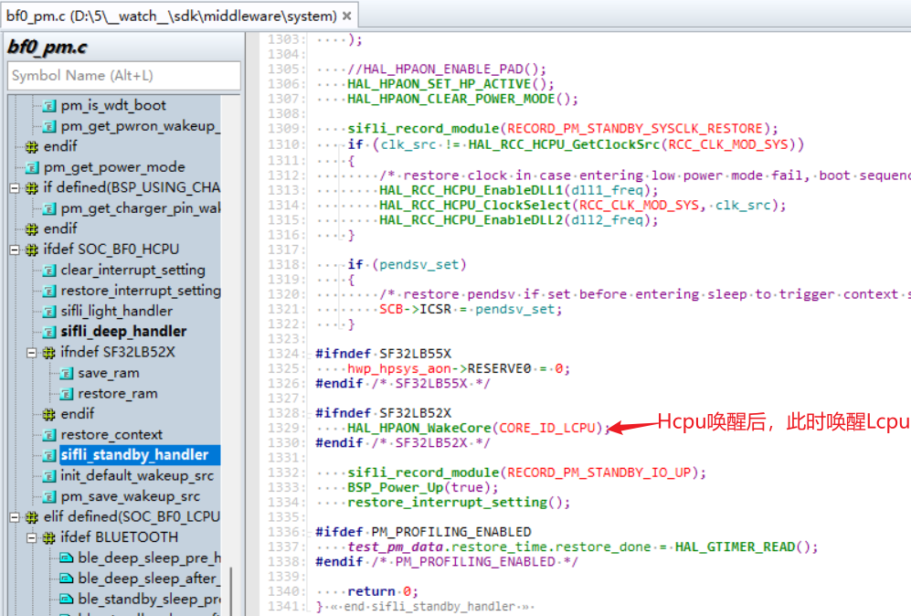
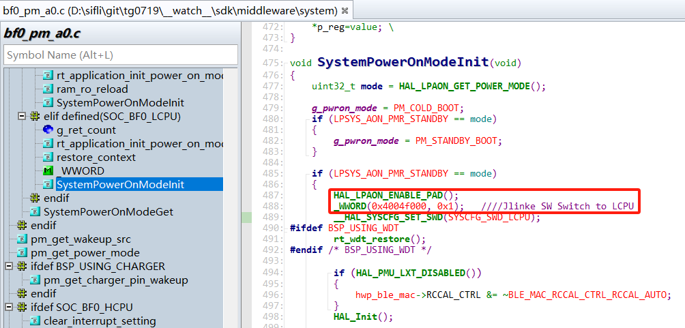
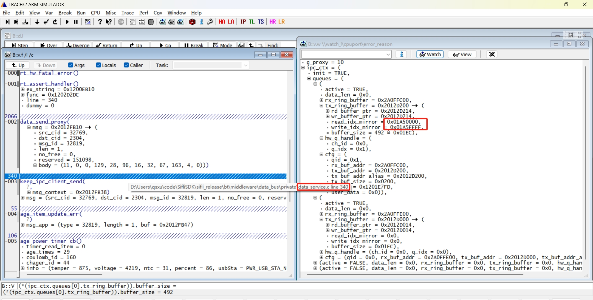

# 14 Dual-core Related
## 14.1 Dual-core Resource Access Rules
1) When Lcpu is awake, Hcpu can use all Lcpu peripheral resources, including PB pins, I2C, UART, etc.<br>
2) When Hcpu uses Lcpu peripherals, the macro definitions for the corresponding Lcpu peripherals must also be enabled. For example, if Hcpu needs to use the Lcpu PWM5 to drive a motor, but GPTIM4 and PWM5 of Lcpu are not enabled in the code, after Lcpu initialization, the existing SDK code will shut down this module to save power, causing Hcpu operations on GPTIM4 to output PWM5 to fail.<br>
```c
 HAL_RCC_DisableModule(RCC_MOD_GPTIM4);//关闭GPTIM4模块
```
<br><br>   
Similarly, the same operation is required when Hcpu uses Lcpu I2C, UART, and SPI resources.<br>
3) In the 56x and 52x series, the IO of each core can only be configured as resources owned by that core.<br>
For example: for the PA05_I2C_UART function of PA05, this IO can be configured for any group of I2C or UART, but it must follow the rule that PA pins can only be assigned I2C resources owned by Hcpu. For example, on 56x, PA pins can only be configured as resources belonging to Hcpu, i2c1-i2c4, and cannot be configured as resources belonging to Lcpu, i2c5-i2c7.<br>
Similarly, for Lcpu, PB pins can only be configured with resources of that core. PWM configurations such as PA05_TIM must also follow this principle.<br>
4) Lcpu cannot use Hcpu peripheral resources such as PA pins, nor can it access Hcpu registers. Accessing them will cause a Hardfault crash.<br>
For example: in the BSP_PIN_Init, BSP_Power_Up, BSP_IO_Power_Down, and other functions shared by Hcpu and Lcpu in the bsp_pinmux.c and bsp_power.c files, operations on PA pins must be placed inside macro definitions such as #ifdef SOC_BF0_HCPU to prevent Lcpu from calling IO operation functions for PA pins.<br>
5) In the SDK configurations for the 55x, 58x, and 56x series, the software is already designed so that Lcpu is woken up whenever Hcpu wakes up. After Hcpu wakes up, it wakes up Lcpu through the HAL_HPAON_WakeCore(CORE_ID_LCPU); function (in the 52x series, Hcpu/Lcpu sleep independently). In the Hcpu sleep functions sifli_standby_handler or sifli_deep_handler, the function HAL_HPAON_CANCEL_LP_ACTIVE_REQUEST(); is used to allow Lcpu to sleep.<br>
After Lcpu sleep is allowed, if Hcpu accesses Lcpu peripheral resources at this time, a Hardfault will also occur. Therefore, handle this carefully during sleep. The code is as follows:
<br><br>
<br><br>   

## 14.2 Communication Interface Between the Big Core and Small Core
You can refer to the SiFli Technology Software Development Kit documentation, and check the two dual-core communication examples ipc_queue and data_service under example\multicore\.<br>
### 14.2.1 Communication can use the registration and subscription method of datasevice
```c
datas_register(btn_service_name, &button_service_cb); //#注册按键发布
sensors_service_handle = datas_register("SENSORS_APP", &sensors_service_cb); //#注册sensor发布
datas_push_data_to_client(service, sizeof(action), &action); //#发布消息到客户端
datac_subscribe(key2_button_handle, "btn1", button_service_callback_key2, 0); //#注册订阅
```

### 14.2.2 Communicate directly through the existing sensor or BLE IPC mechanism in solution
Through the existing sensor channel:<br>
```c
ipc_send_msg_from_sensor_to_app(SENSOR_APP_EVENT_BATTERY_IND, sizeof(event_remind_t), &remind_ind); //发消息给Hcpu
ipc_send_msg_from_app_to_sensor(&msgx); //Hcpu发给Lcpu的sensor
```
Through the existing BLE channel:<br>
```c
ipc_send_msg_from_ble_to_app(BLE_APP_OTA_RECV_IND, len, (uint8_t *)param); //发消息给Hcpu
ipc_send_msg_from_app_to_ble(&msgx); //Hcpu发给Lcpu
```
To debug dual-core communication issues, you can check the specific contents of the global structure variable ipc_cxt.<br>
```c
typedef struct
{
    bool active;                          /**< whether the queue is opened, true: opened  */
    uint32_t data_len;                    /**< len of data in rx_ring_buffer */
    struct circular_buf *rx_ring_buffer;
    struct circular_buf *tx_ring_buffer;
    ipc_hw_q_handle_t hw_q_handle;        /**< handle of hw queue */
    ipc_queue_cfg_t cfg;                  /**< queue configuration */
} ipc_queue_t;
```
## 14.3 Switching Jlink(SWD) to Debug Different Cores
Use case: jlink connection to debug Lcpu or Ozone online debugging of Lcpu when Hcpu is already asleep.<br>
Operation method: operate the SWSEL bit of the SWCR register in hwp_lpsys_cfg.
- SWSEL
- 0: SWD connected to HCPU
- 1: SWD connected to LCPU
Method 1: When Hcpu is connected to jlink, run the corresponding \tools\segger\jlink_lcpu_56x.bat batch file in the SDK directory.<br>
For the 55 series, call jlink_lcpu_a0.bat.<br>
For the 55 series, call jlink_lcpu_pro.bat.<br>
Method 2: Modify it in the code.<br>
```c
//直接寄存器物理地址操作
#define _WWORD(reg,value) \
{ \
    volatile uint32_t * p_reg=(uint32_t *) reg; \
    *p_reg=value; \
}
_WWORD(0x4004f000, 0x1);   // 55X Jlink SW Switch to LCPU
_WWORD(0x4004f000, 0x0);   // 55X Jlink SW Switch to HCPU
_WWORD(0x5000f000, 0x1);   // 56X，58X Jlink SW Switch to LCPU
_WWORD(0x5000f000, 0x0);   // 56X，58X Jlink SW Switch to HCPU
```
Or specify register operations.
```c
hwp_lpsys_cfg->SWCR = 1; // Jlink SW Switch to LCPU
hwp_lpsys_cfg->SWCR = 0; // Jlink SW Switch to HCPU
```
If the Lcpu crash occurs very early after wake-up, it is recommended to add it at the Lcpu wake-up entry point. Refer to the 56X standby flow for details, but note that GPIO configuration must be enabled in advance:<br>
```c
HAL_LPAON_ENABLE_PAD();//打开Lcpu的GPIO配置
```
<br><br>    

## 14.4 How to determine whether a dual-core communication crash is caused by a full dataservice queue
1) As shown in the figure below, the Assert occurs inside the data_send_proxy function of Lcpu.<br>
2) Check whether read_idx_mirror and write_idx_mirror in tx_ring_buffer at this time have the same upper 16 bits, while the lower 16 bits are all 0 for one and all 1 for the other. Conversely, if the upper 16 bits are the same and the lower 16 bits are also the same, it indicates that the buffer is empty.<br>
As shown in the figure below, the first 16 bits are all equal to 0x01AF, and in the last 16 bits, one is all 0 and the other is all 1. This indicates that the buffer is full, causing the crash.<br>
3) This type of crash is usually caused by the peer core (Hcpu here) crashing or being too busy to process dataservice messages in time. You need to check the reason why the peer core crashed or why the task is busy.<br>
<br><br>
