# 1 GPIO-related
## 1.1 GPIO operation and debugging methods
### 1.1.1 RTT driver-layer operation method
The SiFli series MCU uses a dual-core architecture. Hcpu includes PA pins, Lcpu includes PB pins, and the 58 and 56 series also include low-power IO: PBR pins.<br>
To facilitate unified GPIO pin operation in the RTT operating system, the PA, PB, and PBR pins currently use a unified GPIO numbering scheme for pin device operations in the RTThread operating system:<br>
PA01 corresponds to 1, and PA78 corresponds to 78.<br>
Add 96 to PB pins, so PB0 corresponds to 96, PB1 corresponds to 97, and PB40 corresponds to 136.<br>
Add 160 to PBR0 pins, so PBR0 corresponds to 160, PBR1 corresponds to 161, and PBR2 corresponds to 162.<br>

PA, PB, and PBR can use the GET_PIN or GET_PIN_2 function to obtain the pin number.<br>
The first parameter of the GET_PIN function is 0, 1, or 2, corresponding to PBR, GPIO1(PA), and GPIO2(PB), respectively.  <br>
For example<br>
```
pin_numble=GET_PIN(0, 0)；//PBR0 对应值为160
PBR1就是GET_PIN(0, 1)=161，
PB1就是GET_PIN(2, 1)=97，
PA1就是GET_PIN(1, 1)=1
```
The first parameter of GET_PIN_2 is hwp_pbr, hwp_gpio1, or hwp_gpio2.<br>
```c
pin_numble=GET_PIN_2(hwp_pbr,1);  //PBR1 值为161
pin_numble=GET_PIN_2(hwp_gpio2,1); //PB1 值为97
pin_numble=GET_PIN_2(hwp_gpio1,1); //PA1 值为1
```
After unified GPIO numbering, you can operate IO through the general-purpose interface. The operation code is as follows:<br>
```c
rt_pin_mode(160, PIN_MODE_OUTPUT);  /* 配置PBR0输出 */
rt_pin_write(160, PIN_LOW);  /* PBR0输出低电平 */
rt_pin_mode(160, PIN_MODE_INPUT_PULLUP); /* 配置PBR0为输入口，注意此处配置上下拉，目前代码没有生效，需用HAL函数配置 */
if (1 == rt_pin_read(160)) /* 读PBR0状态 */
//
rt_pin_mode(78, PIN_MODE_OUTPUT);  /* 配置PA78输出 */
rt_pin_write(78, 0);/* PA78 输出低 */
//
rt_pin_mode(79, PIN_MODE_INPUT_PULLUP);/* 配置PA79为输入口，注意此处配置上下拉，目前代码没有生效，需用HAL函数配置 */
if (1 == rt_pin_read(79)) /* 读PA79状态 */
```
Configure as interrupt input mode:
```C
rt_pin_mode(144, PIN_MODE_INPUT_PULLUP);//配置PB48为输入口（48+96=144），注意此处配置上下拉，目前代码没有生效，需用HAL函数配置
curr_state = rt_pin_read(144); /* 读 PB48口状态 */
rt_pin_attach_irq(144, PIN_IRQ_MODE_FALLING, chsc5816tp_irq_handler, RT_NULL);/*配置为下降沿触发，中断函数为chsc5816tp_irq_handler */
rt_pin_irq_enable(144, 1);/* 启动 PB48 GPIO中断*/
//
rt_pin_mode(160,PIN_MODE_INPUT); //配置PBR0为输入模式，注意此处配置上下拉，目前代码没有生效，需用HAL函数配置
rt_pin_attach_irq(160,PIN_IRQ_MODE_FALLING,(void*)bt5376a_wakeup_event_handle, (void*)(rt_uint32_t)160); //配置为下降沿中断和中断处理函数bt5376a_wakeup_event_handle
rt_pin_irq_enable(160,1); //使能中断
```

**Note:**<br>
1. DRV-layer functions cannot modify the GPIO Funtion. HAL-layer functions must be used. By default, this is set in the pin initialization function BSP_PIN_Init during chip power-on or wake-up from standby.<br>
2. Hcpu can fully operate Lcpu resources, including PB pins, but Lcpu cannot directly read or write PA pins; otherwise, a Hardfault will occur.<br>
3. Before using pin device read/write operations, rt_pin_mode must be used to set the mode first. Setting input/output at the hal layer is not sufficient.<br>
4. When using RTT-layer operations for GPIO, after entering Standby sleep, the IO state has already been automatically backed up and restored. The backup function is `pm_pin_backup();` and the restore function is `pm_pin_restore();`. After executing `HAL_HPAON_DISABLE_PAD();`, operating GPIO at this time will keep the external output level of GPIO unchanged. After executing `HAL_HPAON_ENABLE_PAD();`, the GPIO and pinmux register configurations will be output to the external GPIO. In Deep sleep, the GPIO state will be retained and will not change.<br>
5. For RTT-layer GPIO operations, you can also refer to the RTT official website:<br> [PIN Device (rt-thread.org)](https://www.rt-thread.org/document/site/#/):
<br>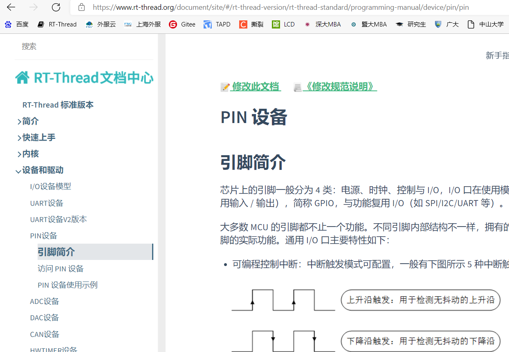<br> 

### 1.1.2 HAL-layer operation method
Before the RTT operating system is running, for example in the low-level code of drv_io.c, you can directly call HAL-interface GPIO functions to read and write GPIO ports.<br>
* PA/PB pin operation method:<br>
Functions for setting PA/PB function and pull-up/pull-down; PA/PB need to be distinguished by a parameter:<br>
```c
HAL_PIN_Set(PAD_PA03,GPIO_A3,PIN_NOPULL, 1); //设置PA03为GPIO模式，无上下拉
```
Output high/low:<br>
```c
BSP_GPIO_Set(3, 0, 1); //PA03输出低
BSP_GPIO_Set(3, 0, 0); //PB03输出低
```
Configure GPIO as input/output. The following figure shows PA24 configured as input mode:<br>
```c
GPIO_InitTypeDef GPIO_InitStruct;           
GPIO_InitStruct.Mode = GPIO_MODE_INPUT;                
GPIO_InitStruct.Pin = 24;                 
GPIO_InitStruct.Pull = GPIO_NOPULL;         
HAL_GPIO_Init(hwp_gpio1, &GPIO_InitStruct); 
```
Read the IO value:<br>
```c
int value;
value = HAL_GPIO_ReadPin((GPIO_TypeDef *)hwp_gpio1, 48); //读PA48的值：
value = HAL_GPIO_ReadPin((GPIO_TypeDef *)hwp_gpio2, 48); //读PB48的值：
```
**Note:**<br> 
1. For HAL-layer GPIO operations, a parameter is required to distinguish hcpu and lcpu, so PB48 can no longer be operated as 96+48 using the DRV layer.<br>
2. For HAL-layer GPIO operations, after entering Standby sleep, the IO state has already been automatically backed up and restored. The backup function is `pm_pin_backup();` and the restore function is `pm_pin_restore();`. After executing `HAL_HPAON_DISABLE_PAD();`, the external output level of GPIO will remain unchanged. After executing `HAL_HPAON_ENABLE_PAD();`, the GPIO and pinmux registers will be output to the external GPIO.<br>


* PBR port operation method:<br>
```c
HAL_PBR_ConfigMode(2,1);//配置PBR2为输出模式，第1个参数0对应PBR0, 2对应PBR2；第2个参数，1为输出，0位输入；
HAL_PBR_WritePin(2,1); //配置PBR2输出高
value=HAL_PBR_ReadPin(0); //读取PBR0的值，返回0或者1，返回值少于1表示有错误，比如输入pin为无效值
HAL_PIN_Set_Analog(PAD_PBR1, 0); //设置PBR1为模拟输入，对外为高阻态
HAL_PIN_Set(PAD_PBR1, PBR_GPO, PIN_NOPULL, 0); //配置PBR1为GPIO模式 
```
For the functions supported by each specific IO, see `pin_pad_func_hcpu` in the file `bf0_pin_const.c` or the hardware document SF32LB5XX_Pin config_X.xlsx.<br>
<br>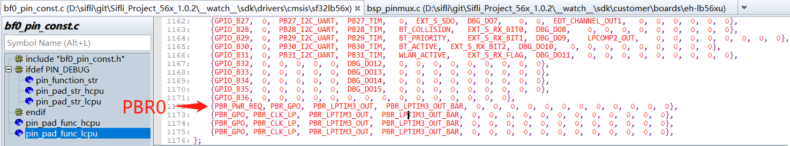<br>   

**Note:**<br>
PBR0 is in PWR_REQ mode by default. In this mode, the hardware automatically controls the output level high and low: it outputs high when LCPU is awake and low when it is asleep. Therefore, when some boards use this PIN to control power to the big-core PSRAM or NOR, it must be forced to output high to prevent PSRAM from losing power after the small core sleeps. The operation is as follows:<br>
HAL_PBR0_FORCE1_ENABLE();

### 1.1.3 GPIO method using register operations
The following directly operates the GPIO register to output high, output low, and toggle PA24 (the GPIO output state must be configured in advance). Refer to the chip manual for the meaning of the registers.<br>
```c
#define PM_DEBUG_PIN_HIGH()      ((GPIO1_TypeDef *)hwp_gpio1)->DOSR0 |= (1UL << 24)//PA00 - PA31
#define PM_DEBUG_PIN_LOW()       ((GPIO1_TypeDef *)hwp_gpio1)->DOCR0 |= (1UL << 24)
#define PM_DEBUG_PIN_TOGGLE()    ((GPIO1_TypeDef *)hwp_gpio1)->DOR0  ^= (1UL << 24)
```
The following is an example of register-based IO initialization and read/write operations:<br>
pin_test is the test program:<br>
```c
#ifdef SOC_BF0_HCPU
#define PA_HIGH(port) (port > 31) ? (((GPIO1_TypeDef *)hwp_gpio1)->DOR1 |= (1UL << (port-32))) : (((GPIO1_TypeDef *)hwp_gpio1)->DOR0 |= (1UL << port))
#define PA_LOW(port) (port > 31) ? (((GPIO1_TypeDef *)hwp_gpio1)->DOR1 &= (~(1UL << (port-32)))) : (((GPIO1_TypeDef *)hwp_gpio1)->DOR0 &= (~(1UL << port)))
#define PA_TOGGLE(port) (port > 31) ? (((GPIO1_TypeDef *)hwp_gpio1)->DOR1 ^= (1UL << (port-32))) : (((GPIO1_TypeDef *)hwp_gpio1)->DOR0 ^= (1UL << port))
#define PA_VALUE(port) (port > 31) ? (((GPIO1_TypeDef *)hwp_gpio1)->DIR1 &= (1UL << (port-32))) : (((GPIO1_TypeDef *)hwp_gpio1)->DIR0 &= (1UL << port))
#define PA_INIT(port,mode)                              \
        do                                              \
        {                                               \
            GPIO_InitTypeDef GPIO_InitStruct;           \
            GPIO_InitStruct.Mode = mode;                \
            GPIO_InitStruct.Pin = port;                 \
            GPIO_InitStruct.Pull = GPIO_NOPULL;         \
            HAL_PIN_Set(PAD_PA00+port, GPIO_A0+port, PIN_NOPULL, 1); \
            HAL_GPIO_Init(hwp_gpio1, &GPIO_InitStruct); \
        }                                               \
        while (0)
            
#ifndef SF32LB52X
#define PB_HIGH(port) (port > 31) ? (((GPIO2_TypeDef *)hwp_gpio2)->DOR1 |= (1UL << (port-32))) : (((GPIO2_TypeDef *)hwp_gpio2)->DOR0 |= (1UL << port))
#define PB_LOW(port) (port > 31) ? (((GPIO2_TypeDef *)hwp_gpio2)->DOR1 &= (~(1UL << (port-32)))) : (((GPIO2_TypeDef *)hwp_gpio2)->DOR0 &= (~(1UL << port)))
#define PB_TOGGLE(port) (port > 31) ? (((GPIO2_TypeDef *)hwp_gpio2)->DOR1 ^= (1UL << (port-32))) : (((GPIO2_TypeDef *)hwp_gpio2)->DOR0 ^= (1UL << port))
#define PB_VALUE(port) (port > 31) ? (((GPIO2_TypeDef *)hwp_gpio2)->DIR1 &= (1UL << (port-32))) : (((GPIO2_TypeDef *)hwp_gpio2)->DIR0 &= (1UL << port))
#define PB_INIT(port,mode)                              \
                do                                              \
                {                                               \
                    GPIO_InitTypeDef GPIO_InitStruct;           \
                    GPIO_InitStruct.Mode = mode;                \
                    GPIO_InitStruct.Pin = port;                 \
                    GPIO_InitStruct.Pull = GPIO_NOPULL;         \
                    HAL_PIN_Set(PAD_PB00+port, GPIO_B0+port, PIN_NOPULL, 0); \
                    HAL_GPIO_Init(hwp_gpio2, &GPIO_InitStruct); \
                }                                               \
                while (0)
#endif

int pin_test(int argc, char **argv)
{
    char i;
    uint8_t pin,value;
     if (argc > 1)
     {
        pin = strtoul(argv[3], 0, 10);
        value = strtoul(argv[4], 0, 10);
        rt_kprintf("pin:%d,value:%d,\n",pin,value);
        if ((strcmp("pa", argv[1]) == 0) || (strcmp("PA", argv[1]) == 0))
        {
            if (strcmp("-w", argv[2]) == 0)
            {
                if(value == 1)
                {
                    PA_HIGH(pin);
                    rt_kprintf("PA%d set high\n",pin);
                }
                else if(value == 0)
                {
                    PA_LOW(pin);
                    rt_kprintf("PA%d set low\n",pin);
                }
                else 
                {
                    PA_TOGGLE(pin);
                    rt_kprintf("PA%d toggle\n",pin);
                }
            }
            else if (strcmp("-r", argv[2]) == 0)
            {
                if(PA_VALUE(pin))
                    rt_kprintf("PA%d is high, %x\n",pin,PA_VALUE(pin));
                else
                    rt_kprintf("PA%d is low, %x\n",pin,PA_VALUE(pin));
            }
            else if (strcmp("-init", argv[2]) == 0)
            {
                if(value == 0)
                {
                    PA_INIT(pin,GPIO_MODE_INPUT);
                    rt_kprintf("PA%d INIT set input\n",pin);
                }
                else
                {
                    PA_INIT(pin,GPIO_MODE_OUTPUT);
                    rt_kprintf("PA%d INIT set output\n",pin);
                }
            }
        }
#ifndef SF32LB52X
        else if ((strcmp("pb", argv[1]) == 0) || (strcmp("PB", argv[1]) == 0))
        {
            if (strcmp("-w", argv[2]) == 0)
            {
                if(value == 1)
                {
                    PB_HIGH(pin);
                    rt_kprintf("PB%d set high\n",pin);
                }
                else if(value == 0)
                {
                    PB_LOW(pin);
                    rt_kprintf("PB%d set low\n",pin);
                }
                else 
                {
                    PB_TOGGLE(pin);
                    rt_kprintf("PA%d toggle\n",pin);
                }
            }
            else if (strcmp("-r", argv[2]) == 0)
            {
                if(PB_VALUE(pin))
                    rt_kprintf("PB%d is high, %x\n",pin,PB_VALUE(pin));
                else
                    rt_kprintf("PB%d is low, %x\n",pin,PB_VALUE(pin));
            }
            else if (strcmp("-init", argv[2]) == 0)
            {
                if(value == 0)
                {
                    PB_INIT(pin,GPIO_MODE_INPUT);
                    rt_kprintf("PB%d INIT set input\n",pin);
                }
                else
                {
                    PB_INIT(pin,GPIO_MODE_OUTPUT);
                    rt_kprintf("PB%d INIT set output\n",pin);
                }
            }
        }
#endif         
     }
     else
     {
         rt_kprintf("example:\npin_test pa -init 29 0  #set PA29 to input \n");
         rt_kprintf("pin_test pa -init 29 1  #set PA29 to output\n");
         rt_kprintf("pin_test pa -w 29 1  #write PA29 to high level\n");
         rt_kprintf("pin_test pa -w 29 0  #write PA29 to low level\n");
         rt_kprintf("pin_test pa -r 29  #read PA29\n");
         rt_kprintf("pin_test pb -init 29 1  #set PB29 to output\n");
     }
     return 0;
}

MSH_CMD_EXPORT(pin_test, forward pin_test command); /* 导出到 msh 命令列表中 */
#endif

```
Call method:<br>
```c
PA_INIT(29,GPIO_MODE_OUTPUT); //PA29初始化为输出口
PA_HIGH(29);//PA29输出高
PA_TOGGLE(29);//PA29电平翻转
PA_INIT(33,GPIO_MODE_INPUT);//PA33配置为输入口
uint8_t value = PA_VALUE(33);//读取PA33,值非0代表高，0代表低电平
PB_INIT(2,GPIO_MODE_OUTPUT); //PB02初始化为输出口
```

### 1.1.4 GPIO debugging method
* Method 1:<br>
Use the serial-port finsh command. The corresponding implementation function is: `int cmd_pin(int argc, char **argv)`
After the finsh function is enabled on Hcpu/Lcpu (enabled by default on Hcpu), on the serial-port console platform, you can use the pin command line to view the gpio status and make GPIO output a high or low level. For example:
```
pin //查看命令提示
pin status all //查看所有GPIO状态.
pin status 120 //查看120-96=24 PB24的状态41
pin mode 120 0 //设置PB24为输出mode
pin write 78 1 //设置PA78输出高
pin mux 106 2 //设置106-96=10 PB10为功能2 I2C4_SDA功能
pin status 160 //160-160=0 获取PBR0状态
```
<br>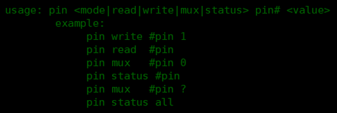<br>  

* Method 2:<br>
Use tools such as Ozone and Jlink to connect to the MCU, read the pinmux and gpio registers, and compare them with the user manual to check whether the configuration is correct.<br>
* pinmux register address mapping method:<br>
In `register.h`, the PA port corresponds to `PINMUX1_BASE or hwp_pinmux1`, and the PB port corresponds to `PINMUX2_BASE or hwp_pinmux2`.<br>
For example, the pinmux register address of PA03 is: `hwp_pinmux1->PAD_PA03`<br>
* Method for mapping gpio register addresses:<br>
PA port: `GPIO1_BASE or hwp_gpio1`; PB port corresponds to `GPIO2_BASE or hwp_gpio2`
Functions such as input enable, output enable, and pull-up/pull-down resistors for PBR port IO (PBR) can be configured through the RTC PBRxR registers. For example, the PBR0 address is `hwp_rtc->BKP0R`


## 1.2 Level fluctuation on 55X series PA ports after sleep wake-up
    After HCPU PA ports wake up from sleep, they first restore to the chip-default pull-up/pull-down state, as shown below: <br>
<br>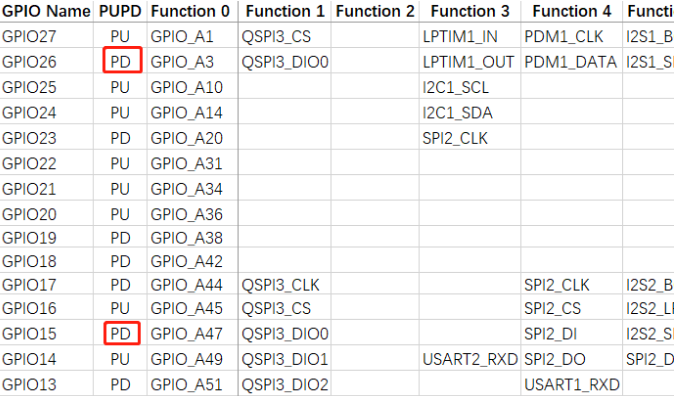<br>  
At this time, the user program has not started running yet. Then the values set in BSP_IO_Init in the pinmux.c file are applied.<br>
Therefore, if the HCPU GPIO level during sleep is inconsistent with the default pull-up/pull-down state, there may be a transition of about 10 ms after wakeup.<br>
After the LCPU PB port wakes up from sleep, the value before wakeup can be retained until the BSP_IO_Init function is executed. Therefore, as long as the GPIO port state is properly set in BSP_IO_Init, the LCPU GPIO value can be retained during sleep.<br>
For example, if you want PA03 to remain at a high level after power-on, because PA03 is pulled down by default, there will be a low level of about 10 ms after waking up from sleep. In actual use, you need to replace PA03 with a pin that is pulled up by default, such as PA10.<br>

**Note:** <br>
The PA port of the 56X and 52X series does not have this issue.

## 1.3 How to configure the TP driver IRQ interrupt
1. Menuconfig configuration <br>
After configuration, the following will be generated in rtconfig.h: <br>
```c
#define TOUCH_IRQ_PIN 79
```
<br>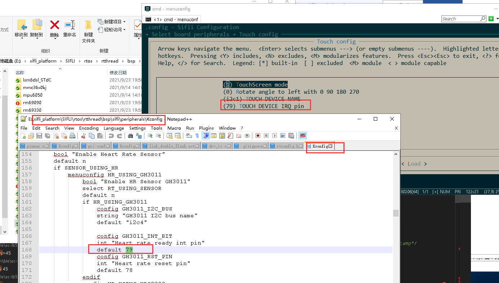<br>  
2. In pinmux.c, confirm the mode and pull-up/pull-down state of this IO port:<br>
```c
HAL_PIN_Set(PAD_PA79, GPIO_A79, PIN_NOPULL, 1); // GPIO模式，无上拉，
```
3. This definition will be used in drv_touch.c. The driver can directly use the two functions in drv_touch.c:<br>
```c
    rt_touch_irq_pin_attach(PIN_IRQ_MODE_FALLING, cst816_irq_handler, NULL);
    rt_touch_irq_pin_enable(1);
```
Or define this interrupt yourself in the initialization function:<br>
```c
    rt_pin_mode(TOUCH_IRQ_PIN, PIN_MODE_INPUT); //配置为input
    rt_pin_attach_irq(TOUCH_IRQ_PIN, PIN_IRQ_MODE_FALLING, (void *) cst816_irq_handler,(void *)(rt_uint32_t)TOUCH_IRQ_PIN);//配置下降沿中断和中断回调函数
    rt_pin_irq_enable(TOUCH_IRQ_PIN, 1); //使能中断
```
4. Enter the command on the HCPU serial port: pin status 79 to confirm whether this configuration is correct.<br>

## 1.4 How to detach touch IRQ
In the deinit function of the touch driver, before detaching the IRQ, you need to disable the interrupt of this pin first:<br>
```c
static rt_err_t deinit(void)
{
    rt_pin_irq_enable(TOUCH_IRQ_PIN, 0); //disable irq
    rt_pin_detach_irq(TOUCH_IRQ_PIN);
...
```
## 1.5 Why is PA55 a default pull-down port PD, but when I do not perform any operation after power-on, PA55 measures high?
Root cause: In the customer's OTA code, PA55 is pulled high.<br>
Have the customer add the `__asm("B .");` breakpoint command in the user program pinmux.c.<br>
<br>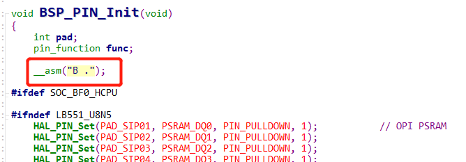<br>   
Test the PA55 pin; it is high,
```
mem32 0x50000038 20 读了相应的寄存器，有输出高的操作，
```
Enter r in jlink to reset the chip.<br>
After that, the read register value returns to normal, and the PA55 level is also normal.<br>
Because the user program starts running from 0x10060000, after reset it starts running from the OTA code at 0x10020000, and then jumps to the user's code at 0x1006000. However, PA55 is operated in drv_io.c of the OTA code, causing this phenomenon.
<a name="16_55系列MCU复用USB的PA01"></a>
## 1.6 Leakage risk of PA01/PA03 multiplexed with USB on 55 series MCU
In general, customers are advised not to use PA01.<br>
Because PA01 and PA03 are multiplexed with USB port functions, special care is required when using PA01 and PA03 as GPIOs.<br>
1. PA01 has an internal 18K pull-down resistor in active and light_sleep modes. It must output a high level; otherwise, leakage occurs. In standby and deep_sleep modes, the 18k pull-down resistor does not take effect.<br>
2. In standby mode, if the output levels of PA01 and PA03 are inconsistent, leakage current will occur through the USB circuit.
Specifically, leakage of about 20uA exists when the following conditions are met: <br>
a. Enter standby sleep <br>
b. PA01 and PA03 are configured with inconsistent levels (one outputs high or is pulled up, and the other outputs low or is pulled down). The leakage current is an uncertain value and may vary depending on the board or environment.<br>
c. Patch solution to eliminate leakage: When entering sleep, make the levels of the two IOs consistent, or at least set one of them to a high-impedance state (no pull-up or pull-down).<br>
d. Additional details: 1. The pull-down resistor of PA01 does not cause leakage in standby and deep_sleep modes; leakage occurs only in active or light_sleep mode. 2. High impedance requires not only our configuration, but also that there are no pull-up or pull-down resistors on the board.<br>
The following method can be used to output a high-impedance state:<br>
```c
HAL_PIN_Set_Analog(PAD_PA01,1); /* 模拟输入为Func10，关断GPIO输出，输入使能IE关闭，即为高阻态 */
HAL_PIN_Set_Analog(PAD_PA03,1);
```
## 1.7 Configure 32768 clock output on 55 series MCU-PB47/PB48

Before use, confirm that a 32768 crystal is mounted on the MCU side, and disable `#define LXT_DISABLE 1`.<br>
In addition, two changes are required:
1. Enable the flag bit. Take PB47 as an example:<br>
```c
     #define LPSYS_AON_DBGMUX_PB47_SEL_LPCLK  (0x1UL << LPSYS_AON_DBGMUX_PB47_SEL_Pos)
        MODIFY_REG(hwp_lpsys_aon->DBGMUX,LPSYS_AON_DBGMUX_PB47_SEL_Msk,LPSYS_AON_DBGMUX_PB47_SEL_LPCLK);
```
 2. If 32k output needs to be maintained during sleep, the part shown in the following screenshot needs to be masked.<br>
    Because if LPSYS_AON_ANACR_PB_AON_ISO is set to 1, the wakeup pins PB43~PB48 can maintain their levels during sleep, but the cost is that they cannot output a 32k waveform or a waveform controlled by lptim3. After it is masked, these wakeup pins PB43~PB48 cannot maintain their levels during sleep, so they cannot be used as GPIO output pins. 
<br>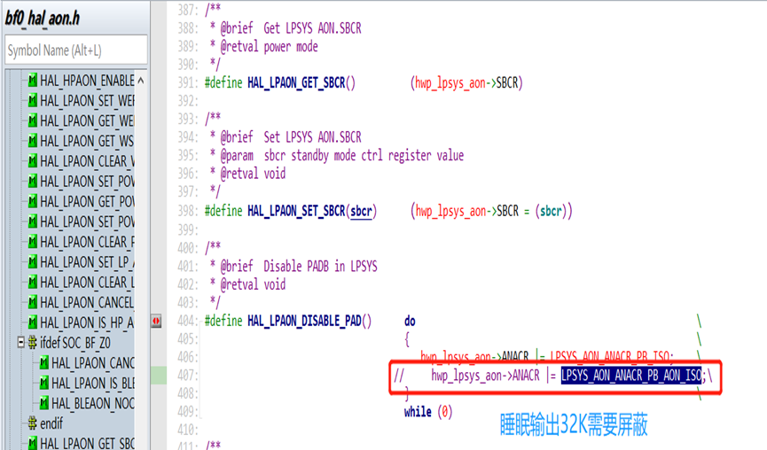<br>      
3. Note:<br>
Because in step 2, the PB IO retention function in standy is disabled in order to output 32k. Therefore, for the PB wakeup pins PB43-48 in standby mode, since the internal pull-up/pull-down no longer takes effect, an external defined level must be provided, or the pins should be set to output high or low according to the external connection, to prevent leakage on PB43-PB48 in standby mode.

## 1.8 Add PB25 as button KEY2 
1. In Lcpu menuconfig → Sifli middleware → Enable button library, set the number of keys to 2.<br>
2. In Lcpu menuconfig → Select board peripherals → Key config, set the GPIO corresponding to KEY2 to 121 (96+25).
<br>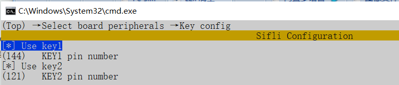<br>   
3. In Lcpu menuconfig → Sifli middleware → Enable button library, set the number of keys to 2.<br>
4. In Lcpu menuconfig → Select board peripherals → Key config, set the GPIO corresponding to KEY2 to 121 (96+25).<br>
5. In Lcpu, configure the initialization and wakeup source of KEY2 in the init_pin function in sensor_service.c.
<br>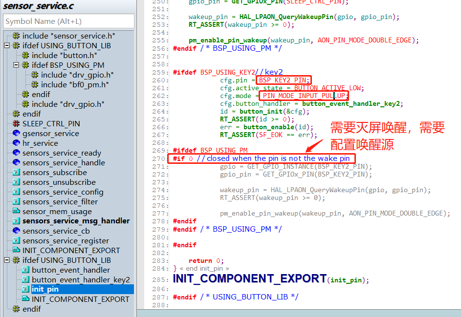<br>   
6. In Hcpu, configure the message subscription for KEY2 in the init_pin function in watch_demo.c.
<br>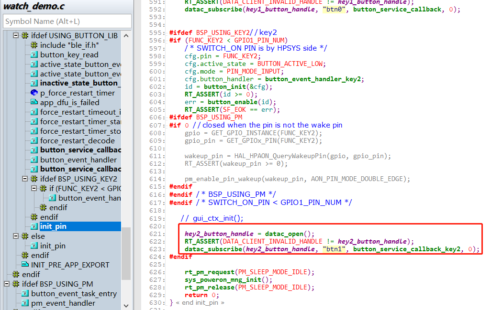<br>  

## 1.9 Increase GPIO drive capability 
Set both DS0 and DS1 bits to 1 for the strongest drive capability.<br>
```c
HAL_PIN_Set_DS0(PAD_PA10,1,1); //PA10 DS0置1
HAL_PIN_Set_DS1(PAD_PA10,1,1); //PA10 DS1置1
HAL_PIN_Set_DS1(PAD_PB16,0,1); //PB16 DS1置1
```

## 1.10 Configure GPIO as high-impedance mode
As shown below, set this IO to the analog input state. Externally, this IO port is in a high-impedance state.<br>
```c
HAL_PIN_Set_Analog(PAD_PA17, 1); //PA17 设置为模拟输入，对外高阻
HAL_PIN_Set_Analog(PAD_PB27, 0);  //PB27 设置为模拟输入，对外高阻
```
Restore from the high-impedance state to the original IO state, as follows:<br>
```c
HAL_PIN_Set(PAD_PA17, GPIO_A17, PIN_NOPULL, 1);
HAL_PIN_Set(PAD_PB27, GPIO_B27, PIN_NOPULL, 0);
HAL_PIN_SetMode(PAD_PA17, 1, PIN_DIGITAL_IO_PULLDOWN);  //sdk版本v2.2.0后，不再需要
HAL_PIN_SetMode(PAD_PB27, 0, PIN_DIGITAL_IO_PULLUP); //sdk版本v2.2.0后，不再需要
```
HAL_PIN_Set_Analog sets the IE bit of the IO to 0. If only the HAL_PIN_Set function is called for configuration, this function does not operate the IE bit. In this case, input cannot be used. To restore the IO for use as an input port, the HAL_PIN_SetMode function must also be called to restore IE to 1 (not required after SDK version v2.2.0).<br>

**Note:**<br>
After SDK version v2.2.0, the HAL_PIN_Set function already includes the operation to restore IE to 1, so there is no need to additionally add the HAL_PIN_SetMode function.

## 1.11 52X PA22/PA23 32K crystal IO multiplexing: I2C cannot output waveforms
Reason:<br>For 52X, the IE of other IOs is 1 by default, while the IE of the two 32k IOs is 0 by default.<br>
In the default flow, the HAL_PIN_Set function does not set IE to 1. For the PA22 and PA23 IOs, IE is 0 by default, so waveforms cannot be output.
<br>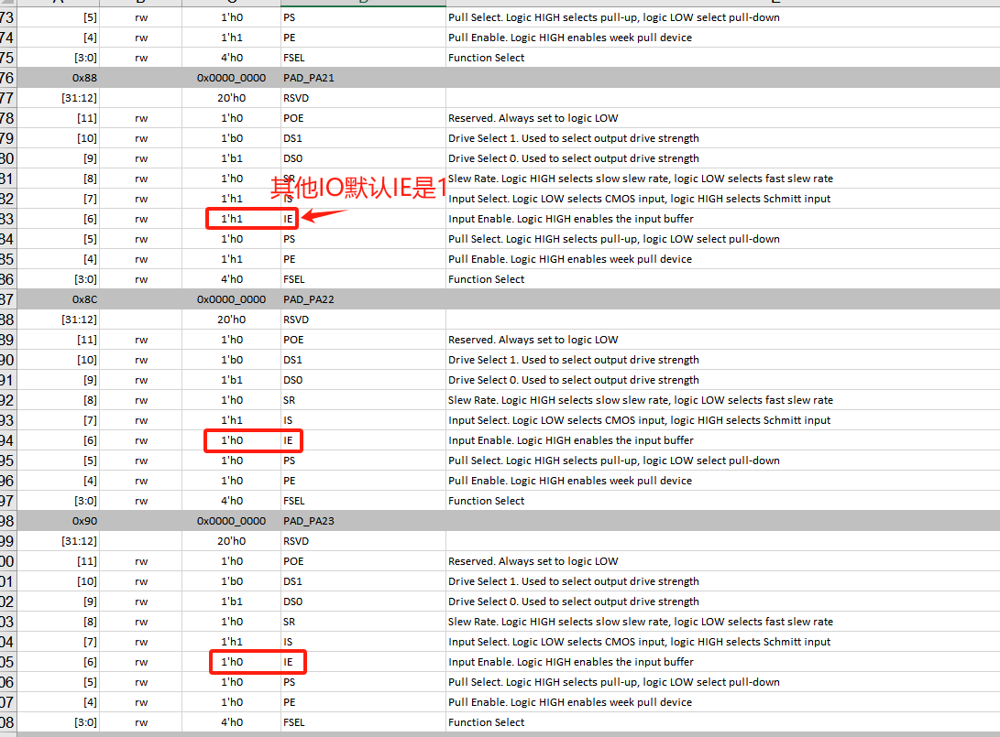<br>   
Solution:<br>
After adding the HAL_PIN_SetMode function to set the IO as a normal IO, the IE bit is set to 1, and I2C can output normally.
<br>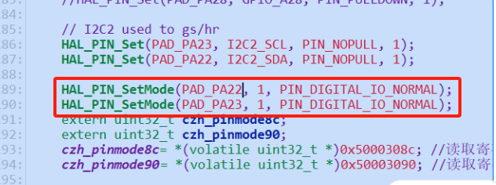<br>  

**Note:**<br>
For the two 32K IOs PA55 and PA56 on 56X, the IE bit defaults to 1, so this issue does not exist.<br>
After SDK version v2.2.0, the HAL_PIN_Set function already includes the operation to restore IE to 1, so there is no need to additionally add the HAL_PIN_SetMode function.

## 1.12 PAXX_I2C_UART and PAXX_TIM configuration method
For the 55 and 58 series MCUs, each IO is a fixed I2C,UART,PWM output port. Starting from the 56 and 52 series MCUs, to increase IO flexibility, the configuration becomes flexible as shown in the figure below:
<br>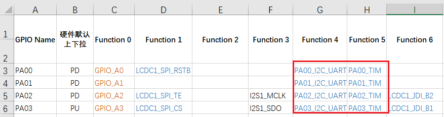<br>  
This is because I2CX_PINR, USART1_PINR, and GPTIMX_PINR registers are introduced in HPSYS_CFG and LPSYS_CFG, as shown in the figure below:
<br>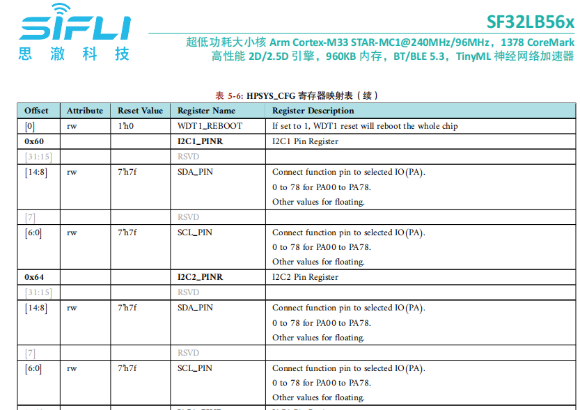<br> 
As described in the registers in the figure above: the corresponding I2C1 and I2C2 can both be configured to output on PA00-PA78. Which I2C, UART, and TIMER outputs can be configured on specific PA pins depends on which I2C, UART, and TIMER resources are owned by HCPU. Note that resources owned only by LCPU (such as I2C5,UART5) cannot be configured to the PA port. Similarly, resources owned only by HCPU (such as I2C1,UART1) cannot be configured to the PB port of LCPU. For details about which resources are owned by HCPU, refer to the chip user manual. In code, the corresponding registers can be found in HPSYS_CFG_TypeDef in hpsys_cfg.h and LPSYS_CFG_TypeDef in lpsys_cfg.h. In addition, the bf0_pin_const.h file lists all functions that can be configured for the MCU, as shown in the figure below:
<br>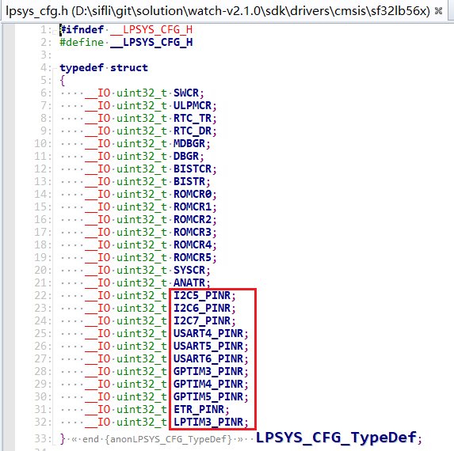<br>  
For example, a correct configuration (using a 56 series MCU as an example):
```c
HAL_PIN_Set(PAD_PA32, USART1_RXD, PIN_PULLUP, 1);
HAL_PIN_Set(PAD_PA32, I2C1_SCL, PIN_PULLUP, 1);
HAL_PIN_Set(PAD_PA42, GPTIM2_CH4, PIN_NOPULL, 1);//GPTIM2_CH1-GPTIM2_CH4都可以，GPTIM2_CH5不行，因为没有此配置，详情查看对应芯片手册的寄存器:hwp_hpsys_cfg->GPTIM2_PINR
```
Incorrect configuration:
```c
HAL_PIN_Set(PAD_PA42,USART4_TXD,PIN_NOPULL, 1);//错误，UART4在Lcpu上，不能配置到Hcpu的PA口
HAL_PIN_Set(PAD_PB37,GPTIM2_CH4,PIN_NOPULL, 0);//错误，GPTIM2在Hcpu上，不能配置到Lcpu的PB口
