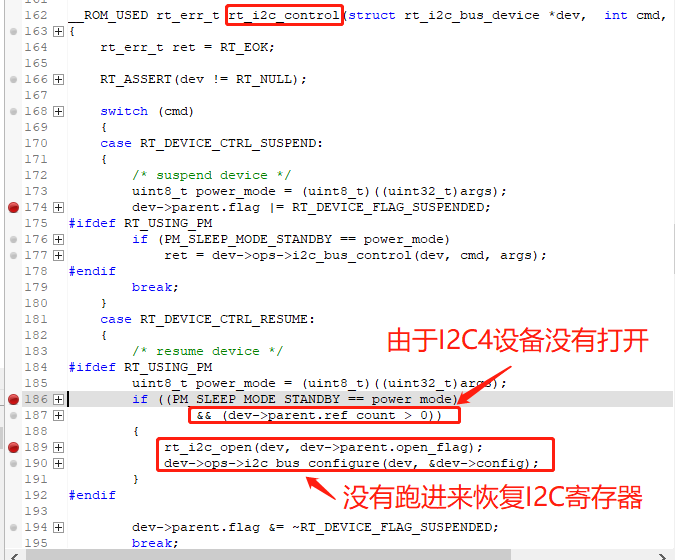
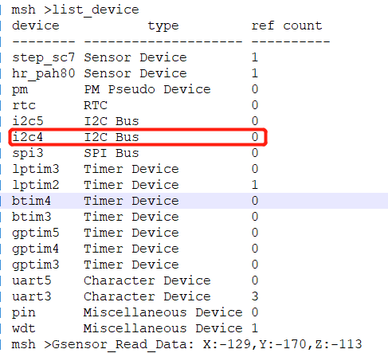
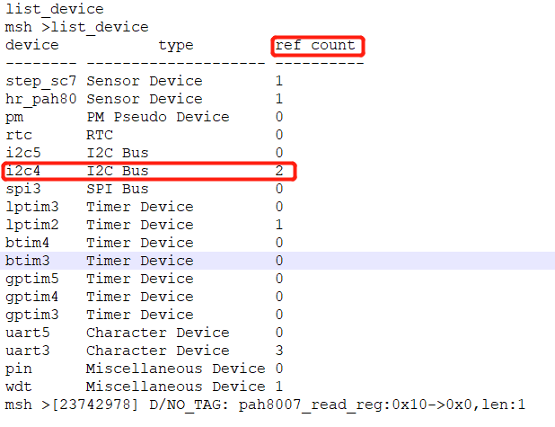
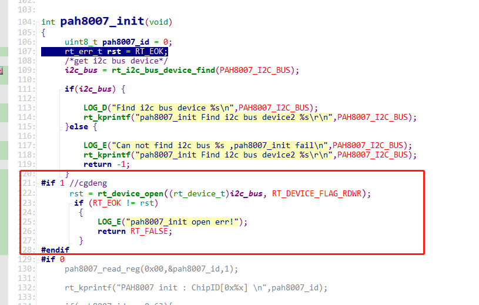
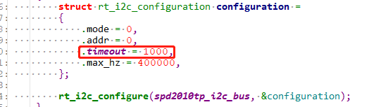
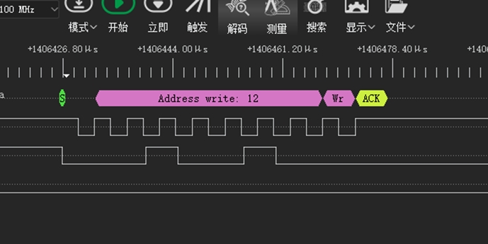
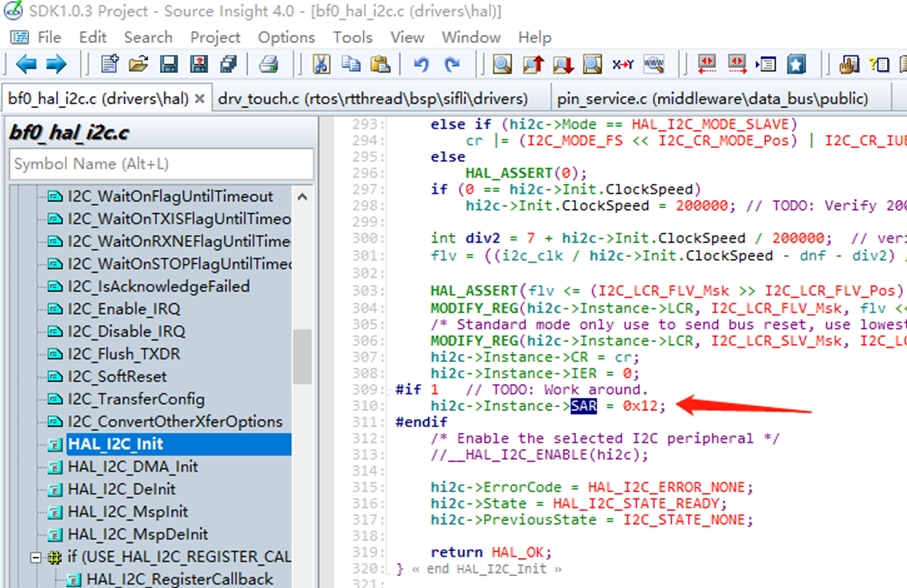
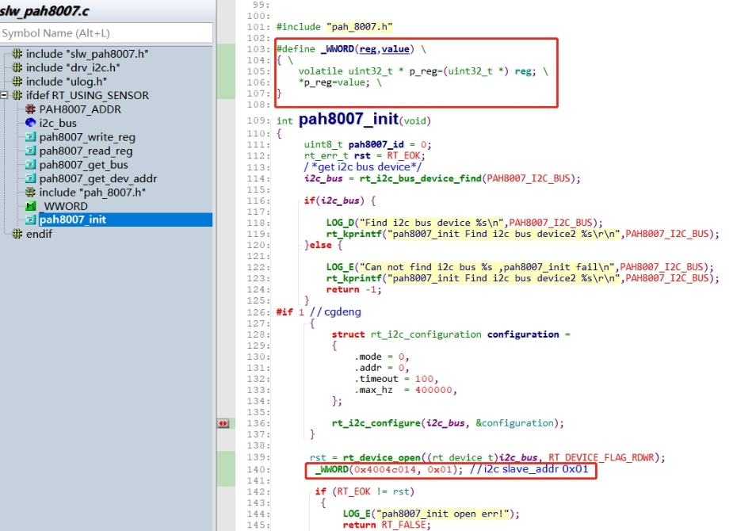
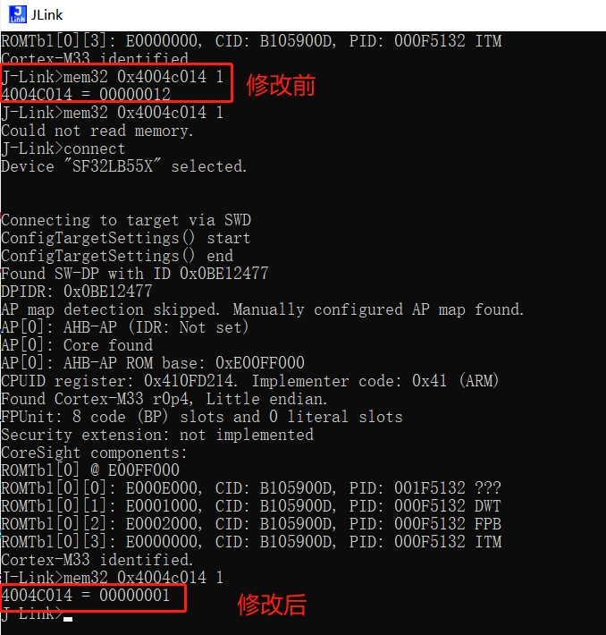

# 7 I2C-related
## 7.1 Correct I2C initialization method
I2C must be initialized and used strictly according to the following three-step method. Otherwise, I2C may not recover properly after sleep wake-up:
```
rt_i2c_bus_device_find /*第一步find I2C设备*/
rt_device_open /*第二步open I2C设备*/
rt_i2c_configure /*第三步配置 I2C设备*/
```
```c
static struct rt_i2c_bus_device *i2c_bus = RT_NULL;     /* I2C总线设备句柄 */
int sc7a20_i2c_init()
{
/*第一步find I2C设备*/
   i2c_bus = rt_i2c_bus_device_find("i2c4");
    if (i2c_bus)
    {
        LOG_D("Find i2c bus device I2C4\n");
/*第二步open I2C设备*/
rt_device_open((rt_device_t)i2c_bus, RT_DEVICE_FLAG_RDWR);
/* 或者采用rt_i2c_open函数，但是list_device时I2C不会显示open状态 */
	   	//rt_i2c_open(i2c_bus, RT_DEVICE_FLAG_RDWR);
 
		struct rt_i2c_configuration configuration =
        {
            .mode = 0,
            .addr = 0,
            .timeout = 500, //超时时间（ms）
            .max_hz  = 400000, //I2C速率（hz）
        };
/*第三步配置 I2C设备*/
        rt_i2c_configure(i2c_bus, &configuration);
    }
    else
    {
        LOG_E("Can not found i2c bus I2C4, init fail\n");
        return -1;
    }
    return 0;
   }
```   
## 7.2 I2C communication error after I2C4 enters standby sleep and wakes up
Root cause: When operating the I2C device, only rt_i2c_bus_device_find was used for the I2C4 device, and rt_device_open was not called for this device.
In our software architecture, after waking up from standby, whether to restore the I2C configuration is determined by checking whether the I2C device is in the open state. Since I2C4 was not opened, the I2C4 configuration was not restored after waking up from standby, causing I2C4 to be unavailable.
As shown in the figure below:
<br><br>  
<br><br>   
Solution:
After adding the following open i2c4 operation, the issue was resolved.
<br><br>    
<br><br>  

## 7.3 Intermittent I2C errors
1. The timeout initialized by rt_i2c_configure is set too short. Due to thread switching, the I2C thread may not get executed, which can easily cause a timeout. 150 ms is recommended. If it is set too long, when an ERR occurs on I2C, the system may hang in the I2C thread. In the figure below, 1000 means 1 second:
<br><br>   
2. The I2C rate does not match the pull-up resistor. The rising and falling edges of the I2C waveform are too slow. For 400Kbps, a 1.5K-2.2K pull-up resistor is recommended.<br>
3. I2C fly-wire debugging. When using fly wires to debug I2C devices such as Touch chips, an overly long bus may cause interference glitches in the I2C waveform, resulting in incorrect I2C waveform recognition.<br>
4. When some I2C devices encounter an Error, SDA may be held low by the I2C peripheral. When SDA is pulled low, the I2C controller detects that the bus is busy, and SDA cannot output waveforms. The log will print ERR. At this time, the peripheral can be reset. Common reset methods:<br>
A. Toggle the peripheral power supply or reset pin.<br>
B. Send an I2C bus reset (9 empty clocks) to reset the peripheral I2C bus. (In the SDK, when an I2C ERR occurs, the HAL layer already resets the I2C controller and sends 9 empty clocks.)<br>

## 7.4 I2C waveform cannot be output when the I2C device address is 0x12
After SDA is pulled low, the I2C controller can no longer output waveforms, as shown in the figure below:
<br><br>   
Root cause:
The SF32LB55x chip supports i2c slave mode,
and the address of this slave mode was configured as 0x12 in the driver, causing the chip to recognize 0x12 and enter i2c slave mode.
The driver is as follows:
<br><br>   
Solution 1:
This part of the Lcpu code is in ROM, so modifying it directly will not take effect. Delete the Lcpu ROM function HAL_I2C_Init from rom.sym.
And modify this address.
Solution 2:
After I2C4 device initialization is complete, reconfigure this register directly:
<br><br> 
```c
#define _WWORD(reg,value) \
{ \
    volatile uint32_t * p_reg=(uint32_t *) reg; \
    *p_reg=value; \
}
_WWORD(0x4004c014, 0x01);   //i2c slave_addr 0x01
``` 
<br><br>
