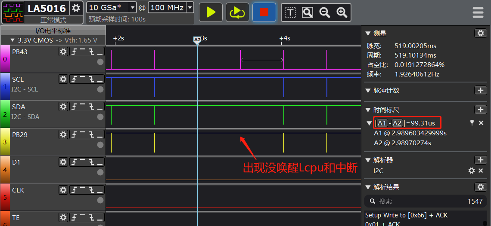

# 3 Interrupt-related
## 3.1 Pulse width requirements for interrupt wake-up from standby sleep
As shown in the figure below, there is a probability that Lcpu cannot be woken up and an interrupt cannot be generated.<br>
Root cause:<br>
When the pulse width of the PB43 heart-rate interrupt is only 99us, this customer uses the RC10K oscillator in standby, with a frequency between 8k and 10k. The corresponding maximum clock period is 125us, so this 99us pulse may fail to wake up Lcpu from standby.
Solution:<br>
Modify the peripheral register or firmware so that the interrupt pulse width is greater than the clock period. With the RC10K oscillator, the pulse width must be at least greater than 125us.
<br><br>  

## 3.2 Global interrupt enable/disable functions
```c
uint32_t mask;
 mask = rt_hw_interrupt_disable(); /*关中断*/
 rt_hw_interrupt_enable(mask);  /*开中断*/
 ```
