# 8 Low Power-Related
## 8.1 Debugging method when Hcpu cannot enter standby sleep
For the CPU to enter sleep mode, the following conditions must be met. If it cannot enter sleep, you can troubleshoot one by one using the methods below:<br>
a. Confirm that the following macro has been generated in rtconfig.h:<br>
```c
#define RT_USING_PM 1
#define BSP_USING_PM 1 //开启低功耗模式
#define PM_STANDBY_ENABLE 1 //进入standby模式的低功耗,
//#define PM_DEEP_ENABLE 1  //52系列建议关掉上面standby，改用deep休眠
#define BSP_PM_DEBUG 1 //打开低功耗模式调试log
```
Enable method: select the following in menuconfig::<br>
<br>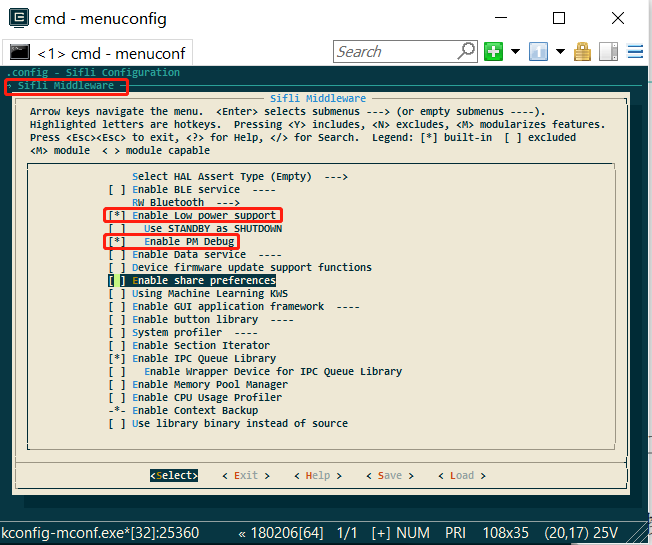<br>  
<br>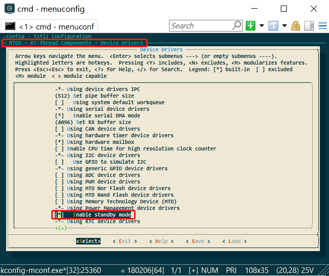<br>   
 
b. Entry into sleep mode is not disabled;:<br>

If the rt_pm_request(PM_SLEEP_MODE_IDLE); function is called in the program, entering sleep will be prohibited. You can enter the command pm_dump through the serial port to check. If it is 1 or greater than 1, sleep prohibition is enabled; if it is 0, sleep is allowed.<br>
<br>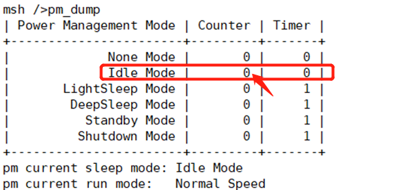<br> 

**Note:**<br>
`rt_pm_request(PM_SLEEP_MODE_IDLE); ` and `rt_pm_release(PM_SLEEP_MODE_IDLE)` must be used in pairs;<br>
c. The operating system timer timeout is greater than the sleep threshold;<br>
See the configuration of const pm_policy_t pm_policy[], as shown below. If hcpu is set to 100 here, that is 100ms,<br>
if there is a timer in the program that needs to wake up in less than 100ms, it will not enter sleep,<br>
<br>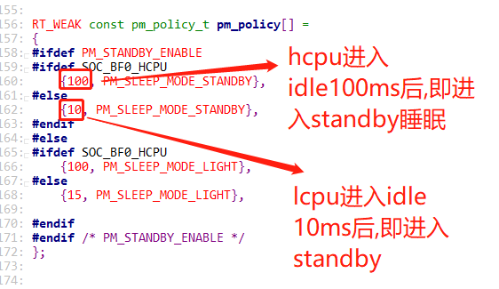<br> 
For example, in the following task, there is rt_thread_mdelay(90); 90<100, so it will not sleep. You can also use the serial port command list_timer to check the timer status.
<br><br> 
d. A wakeup source exists,<br>
If a wakeup source exists and has not been cleared, it will not enter sleep, because even if it goes to sleep, it will be woken up,<br>
A common case is that the level state of a wakeup pin is incorrect. For example, low-level wakeup is configured, but the wakeup pin level remains low all the time.<br>
You can read the WSR registers of hcpu and lcpu through serial port commands, Jllink, or log voltage. The WSR register addresses and bit definitions vary by series. Refer to the corresponding chip manual and check the specific wakeup source in wsr.<br>
```c
regop unlock 0000
regop read 4007001c 1
regop read 4003001c 1
```
<br>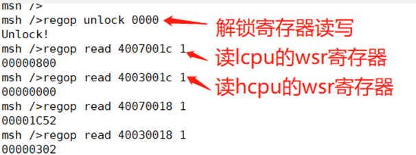<br> 
e. Data sent to the other core has not been read.<br>
Here, you can connect with Ozone or dump memory and use trace32 to inspect the tx buffer of the ipc_ctx variable and check whether there is data that has not been retrieved,<br>
As shown in the following figure, read_idx_mirror and write_idx_mirror are normally equal or empty. If they are not equal, data has not been retrieved, which will prevent entry into sleep. The following shows a case where non-empty data has not been retrieved and sleep is not allowed:<br>
<br>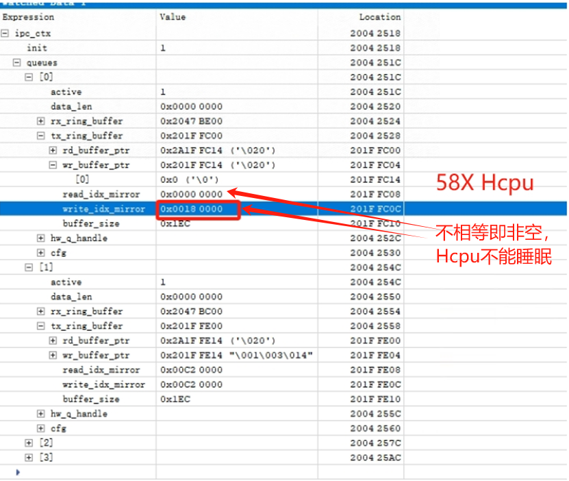<br> 
The following figure shows the normal case:<br>
<br>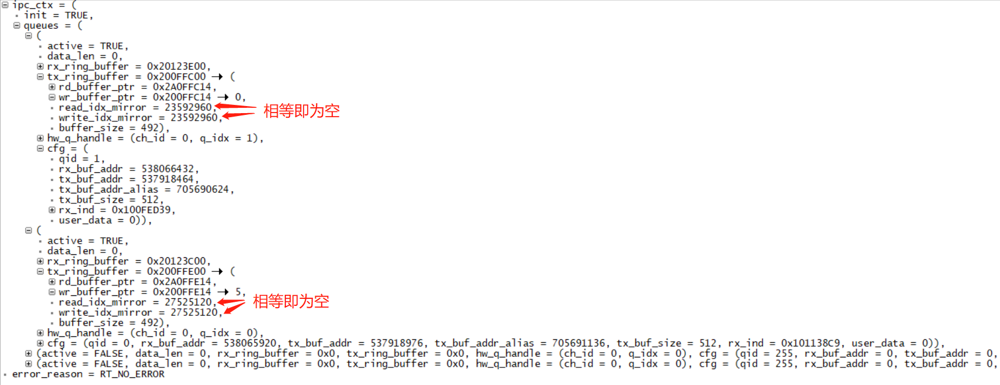<br>  
The following example shows an Hcpu where, because Lcpu has not enabled the data service, the channel with qid=1 is missing. The data sent by Hcpu is not retrieved by Lcpu, causing Hcpu to not enter sleep.<br>
<br>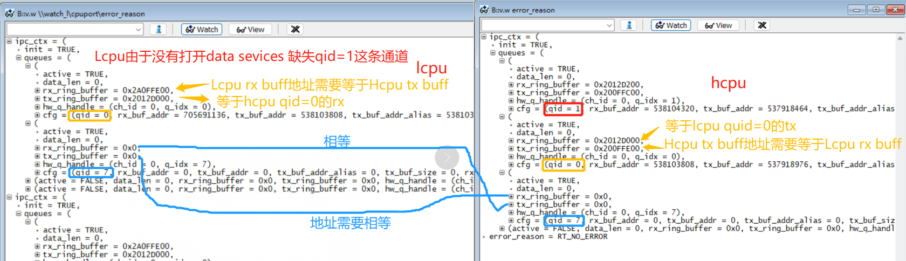<br> 
f. The cpu has not entered the idle process.<br>
You can use the serial port command: list_thread to check the status of all threads. Only tshell and tidle should be ready; all others should be in suspend state. Otherwise, entry into sleep will fail. <br>
As shown in the following figure, I added a __asm("B ."); infinite-loop instruction in the app_watch_entry() function, causing the app_watch thread to fail to enter suspend, which prevents sleep.<br>
<br>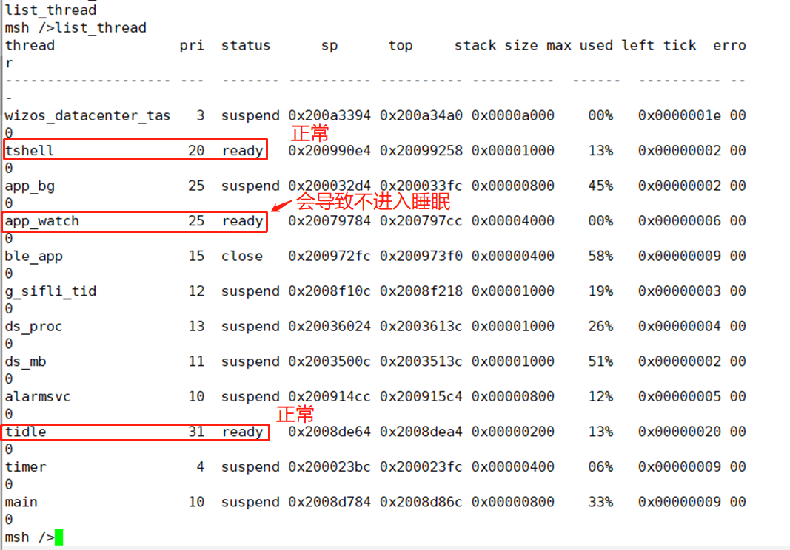<br>  
The following are screenshots of some commands used for checking:<br>
<br>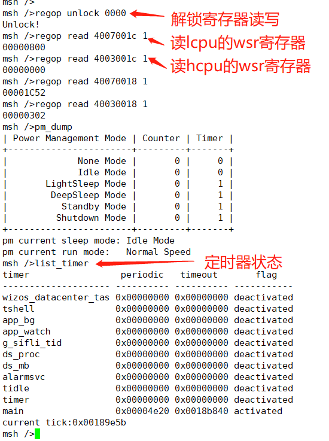<br> 

Description of the list_timer status:<br>
The first column, "timer", is the timer name;<br>
The second column, "periodic", is the timer period (hexadecimal);<br>
The third column, "timeout", is the timestamp when the next timer expires;<br>
The fourth column, "flag", indicates whether the timer is active;<br>
As shown in the figure above, the only active timer is the "main" timer (the delay function is also a timer), and the wakeup period is 0x4e20 (20000ms).

## 8.2 Hcpu is already asleep but Lcpu does not sleep
The reasons why Lcpu does not enter sleep are basically the same as in issue ## 8.1. You can refer to ## 8.1. Here we only describe a few details for debugging Lcpu without serial port commands:<br>
a. Since Jlink cannot connect at this time, when Hcpu is not sleeping, execute SDK\tools\segger\jlink_lcpu_a0.bat to switch the Jlink connection to Lcpu, and then debug.<br>
b. To check whether a wakeup source exists, after jlink is connected to Lcpu, use mem32 0x4007001c 1 to read the WSR register.<br>
c. Data sent to Hcpu has not been read.<br>
You can locate the ipc_ctx variable from the compiled map file, read it with jlink mem32, print the ipc_ctx variable, or connect with Ozone.exe to read the variable and check whether sent data has not been read by Hcpu.<br>

Common cause 1:<br>
Jlink reads the WSR register value through mem32 0x4007001c 1 as: 0x200, indicating that a wakeup source on PB47 has not been cleared. The following figure shows a 55X-related machine:<br>
<br>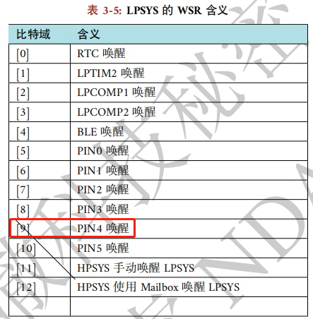<br> 
This is because the wakeup edge is configured as dual-edge trigger, as follows:<br>
```c
pm_enable_pin_wakeup(4, AON_PIN_MODE_DOUBLE_EDGE);  /* PB47 */
```
However, the GPIO interrupt is configured as falling-edge triggered:<br>
```c
rt_pin_attach_irq(BATT_USB_POW_PIN, PIN_IRQ_MODE_FALLING, battery_device_calback, RT_NULL);
```
In addition, the wake-up source is cleared in the GPIO interrupt callback function. This causes the wake-up source for the rising edge to be unable to be cleared, resulting in Lcpu not sleeping.<br>

## 8.3 Power-off charging wake-up issue
Reference example: `SDK\example\rt_device\pm\project`
Note that wakeup is divided into two cases: wakeup from standby/deep sleep and wakeup from hibernate power-off,
IOs that support hibernate power-off wakeup usually also support sleep wakeup. Check the chip manual to see which IOs support power-off wakeup;
<br>
Standby wakeup is configured by the AON register, as follows:<br>
```
HAL_HPAON_EnableWakeupSrc(HPAON_WAKEUP_SRC_PIN3, AON_PIN_MODE_LOW); //55x PA80 #WKUP_A3
HAL_LPAON_EnableWakeupSrc(LPAON_WAKEUP_SRC_PIN5, AON_PIN_MODE_NEG_EDGE);//55x PB48 #WKUP_PIN5
```
Power-off wake-up is configured by PMU and RTC registers, as follows:<br>
```
HAL_PMU_EnablePinWakeup(5, AON_PIN_MODE_NEG_EDGE); //55x PB48 #WKUP_PIN5
```
For charging wake-up, both power-off and standby usually require charging wake-up. Therefore, both AON and PMU wake-up must be configured. Refer to the configuration method below:<br>
1. Configure the charging detection pin as a wake-up source, and configure it so that it can wake up the system in both hibernate/standby modes, as follows:<br>
```c
//此函数已包含了配置AON和PMU的两种唤醒方式，要注意看该函数内具体实现
pm_enable_pin_wakeup(4, AON_PIN_MODE_NEG_EDGE); //4-> 对应为PB47，可以通过GPIO映射表来查找
```
As shown in the following figure:<br>
<br>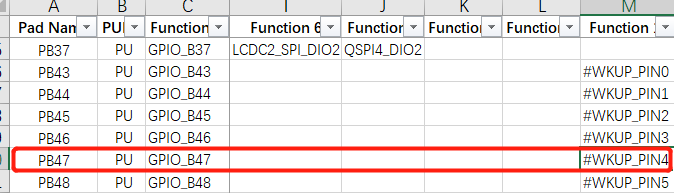<br> 
2. Configure the interrupt for the wakeup pin:<br>
```c
#define PIN_CHG_DET (47 + 96) /* PB47 */
    rt_pin_mode(PIN_CHG_DET, PIN_MODE_INPUT); /*设置为输入模式*/
    rt_pin_attach_irq(PIN_CHG_DET, PIN_IRQ_MODE_FALLING, (void *) battery_charger_input_handle,(void *)(rt_uint32_t) PIN_CHG_DET); /*配置PB47为下降沿中断*/
    rt_pin_irq_enable(PIN_CHG_DET, 1); /* 使能中断 */
```
3. Register the pin interrupt function. After wake-up, execution will enter the following interrupt function:<br>
```c
void battery_charger_input_handle(void)
{
    rt_sem_release(&charger_int_sem);
}
```
The following describes the charging detection initialization code:<br>
```c
#define PIN_CHG_DET (47 + 96) /* PB47 需加96 */
int battery_charger_pin_init(void)
{
#ifdef BSP_USING_PM
#ifdef BSP_USING_CHARGER
    GPIO_TypeDef *gpio = GET_GPIO_INSTANCE(PIN_CHG_DET);
    uint16_t gpio_pin = GET_GPIOx_PIN(PIN_CHG_DET);
    int8_t wakeup_pin = HAL_LPAON_QueryWakeupPin(gpio, gpio_pin);/* 查询PB47为哪个唤醒源 */
    RT_ASSERT(wakeup_pin >= 0); /* 非唤醒pin，会assert */
    //rt_kprintf("HAL_LPAON_QueryWakeupPin :%d\n", wakeup_pin);
    pm_enable_pin_wakeup(wakeup_pin, AON_PIN_MODE_NEG_EDGE); /* 配置唤醒源，wakeup_pin值为0-5对应上面表格的#WKUP_PIN0 - 5 */
#endif
#endif /* BSP_USING_PM */
    _batt_filter_init(&batt_inf);
    rt_pin_mode(PIN_CHG_EN, PIN_MODE_INPUT);
    rt_pin_mode(PIN_CHG_DET, PIN_MODE_INPUT);/*设置PB47为输入模式*/
    rt_pin_attach_irq(PIN_CHG_DET, PIN_IRQ_MODE_FALLING, (void *) battery_charger_input_handle,(void *)(rt_uint32_t) PIN_CHG_DET); /*配置PB47为下降沿中断*/
    rt_pin_irq_enable(PIN_CHG_DET, 1); /* 使能中断 */
    return 0;
}
```
<br>**Note:**<br>
a. If the wakeup source is configured as the AON_PIN_MODE_NEG_EDGE or AON_PIN_MODE_POS_EDGE edge wakeup mode,<br>
then the wakeup trigger mode of AON_PIN_MODE_NEG_EDGE and PIN_IRQ_MODE_FALLING must be consistent with the pin interrupt trigger mode (both falling-edge triggered or both rising-edge triggered),<br>
because WSR is cleared in the pin interrupt function HAL_GPIO_EXTI_IRQHandler. Otherwise, after one wakeup, the WSR register will not be cleared, preventing entry into sleep.<br>
b. If the wakeup source is configured as the AON_PIN_MODE_HIGH or AON_PIN_MODE_LOW level-triggered mode, the wakeup WSR flag bit does not need to be cleared by software. After the level changes, the WSR flag bit will be automatically cleared.<br>

## 8.4 Device Restarts After Entering Hibernate
Common cause 1:<br>
This means that the wakeup pin configured before entering hibernate has an abnormal level. For example, PB44 is configured as a low-level wakeup key pin, but PB44 has no pull-up power supply, causing the pin to remain low. Once it enters hiberante, the device powers on.<br>
Common cause 2:<br>
For example, for Lcpu sensor interrupt wakeup, the pm_enable_pin_wakeup function is used to configure interrupt wakeup. This function also configures hibernate power-off wakeup by default,<br>
and the sensor interrupt level changes during power-off, causing it to wake up again after going to sleep,<br>
<br>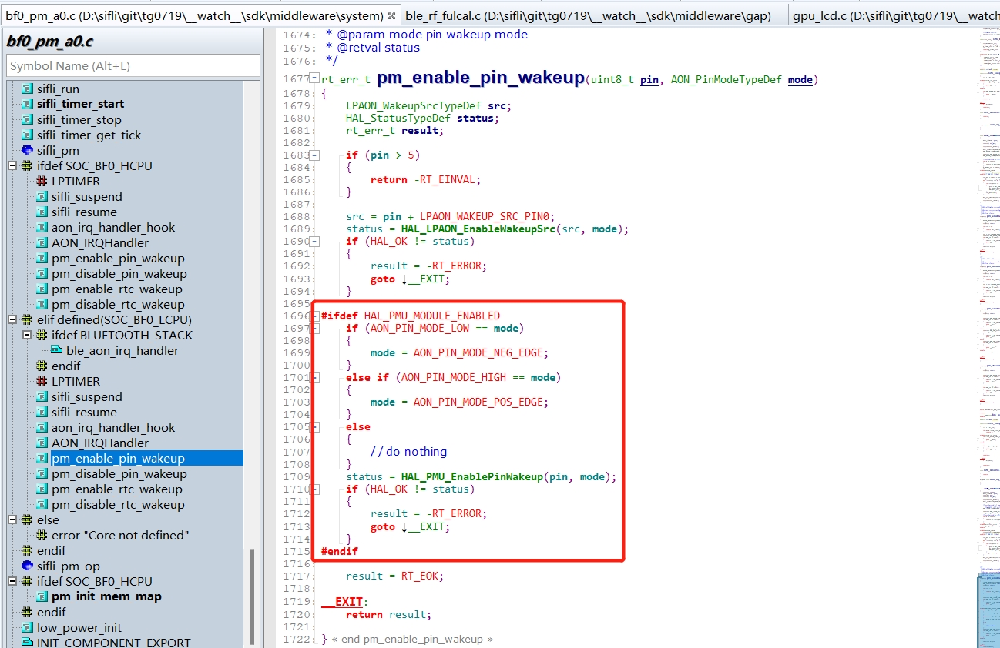<br> 
Solution:<br>
Replace the wakeup function call of pm_enable_pin_wakeup with HAL_LPAON_EnableWakeupSrc(src, mode); to configure only interrupt wakeup and not power-off wakeup. This resolves the issue.<br>
Common cause 3:<br>
For example, after charging wakeup or key wakeup, the PMU WSR flag bit is set to 1, but the user program does not handle and clear this WSR flag bit, causing the device to wake up again after sleeping.<br>
Solution:<br>
Before entering power-off, that is, in the pm_shutdown function, call HAL_PMU_CLEAR_WSR(hwp_pmuc->WSR); to clear the WSR flag bit first, and then enter sleep.<br>
```c
void pm_shutdown(void)
{
#ifdef BSP_PM_STANDBY_SHUTDOWN
    rt_err_t err;
    s_sys_poweron_mng.is_poweron = false;
    gui_pm_fsm(GUI_PM_ACTION_SLEEP);
#else
   HAL_PMU_CLEAR_WSR(hwp_pmuc->WSR);//清掉PMU_WSR
    rt_hw_interrupt_disable();
    HAL_PMU_EnterHibernate();
    while (1) {};
#endif
}
```
Common cause 4:<br>
The standard operation is not followed. That is, after HAL_PMU_EnterHibernate(); is executed, the machine does not immediately enter Hibernate mode and continues running.<br>
You must proceed as shown in the following figure: first disable interrupts, and after executing HAL_PMU_EnterHibernate();, add a while(1); infinite loop. This prevents subsequent code from executing and causing unpredictable issues such as a crash or reboot. As shown below:
<br>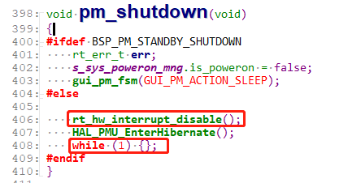<br> 

## 8.5 Startup Process After Wake-up from Hibernate
After entering hibernate sleep mode, rtc, wdt, and lcpu wakeup pins can wake up the whole machine. hcpu wakeup pins cannot wake up from hibernate sleep.<br>
After wakeup, startup is equivalent to a cold boot, and the program starts running from Hcpu.<br>
Configure the wakeup source. hcpu cannot wake up hibernate sleep. For lcpu, use the HAL_LPAON_EnableWakeupSrc function for configuration,<br>
The corresponding wakeup sources can be found in the SF32LB55X_Pin config_xxx.xlsx document, as shown in the following figure:<br>
<br>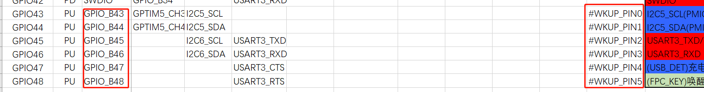<br> 
The cold-start method can be determined in the rt_application_init_power_on_mode function, as shown in the figure below:
<br>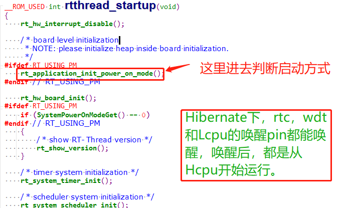<br> 
The startup mode is stored in the variable g_pwron_mode, and the wakeup source is stored in g_wakeup_src.
<br>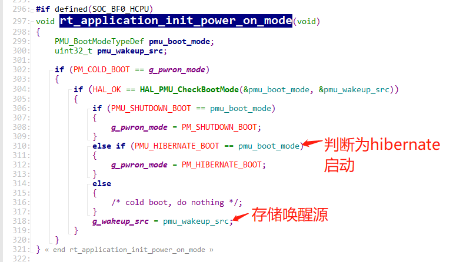<br> 
The function sys_pwron_fsm_handle_evt_init handles the event after wakeup.
<br>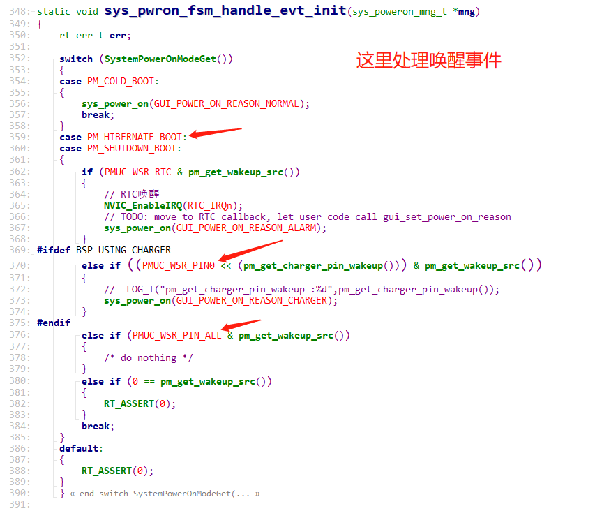<br>
You can manually read the pmu wsr register to check the status, using the following command: (The WSR register address varies by series. Refer to the corresponding chip manual.)<br>
```c
regop unlock 0000
regop read 4007a008 1
```
Corresponding code: `*wakeup_src = hwp_pmuc->WSR;`
<br>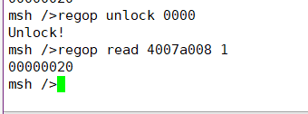<br> 
Bits corresponding to the register:<br>
<br>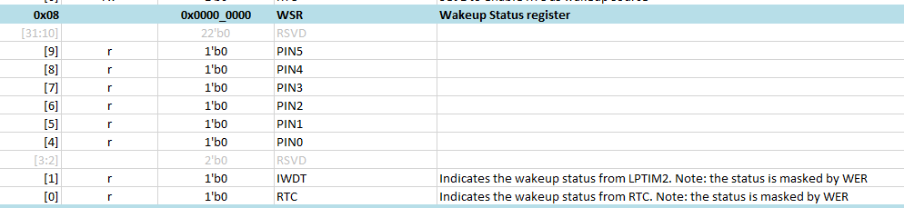<br>

## 8.6 Using Serial Port Commands to Control Sleep Entry
1. In the main function, add the rt_pm_request(PM_SLEEP_MODE_IDLE); call. By default, this disables entry into sleep.<br>
<br>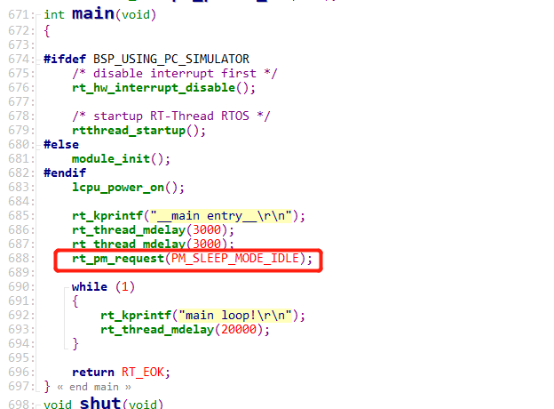<br> 
2. Add the control command sleep<br>
```c
int sleep(int argc, char **argv)
{
char i;
    if (argc > 1)
    {
        if (strcmp("standby", argv[1]) == 0)
        {
        		rt_kprintf("sleep on\r\n");
		rt_pm_release(PM_SLEEP_MODE_IDLE);
        }
        else if (strcmp("off", argv[1]) == 0)
        {
        		rt_kprintf("sleep off\r\n");   
		rt_pm_request(PM_SLEEP_MODE_IDLE);
        }
        else if (strcmp("down", argv[1]) == 0)
        {
		rt_kprintf("entry_hibernate\r\n");
		rt_hw_interrupt_disable();
		HAL_PMU_EnterHibernate(); 
		while (1) {};
        }		
        else
        {
        	rt_kprintf("sleep err\r\n");
        }
    }
    return 0;
}
MSH_CMD_EXPORT(sleep, forward sleep command); /* 导出到 msh 命令列表中 */
```
3. In the serial shell, enter sleep standby to allow sleep, enter sleep off to prevent entering sleep, and enter sleep down to enter hibernate shutdown mode.<br>
<a name="87_Standby待机和Standby关机IO内部常见的漏电模型"></a>
## 8.7 Common Internal IO Leakage Models in Standby and Standby Power-off
### 8.7.1 Standard IO Port Model
<br>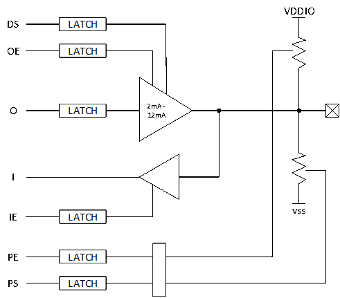<br> 
The function description is as follows:<br>
|DS | driving strength|
| --- | ------ |
|OE | output enable|
|O| output|
|I| input|
|IE| input enable|
|PE | pull enable|
|PS | pull select|
<br>Combined control can implement functions used in daily operation.<br>
Push-pull output<br>
*	OE = 1，O = 0/1
<br>Open-drain output (open-drain)<br>
*	OE = 0/1，O = 0

### 8.7.2 IO Leakage Model 1
OE=1，O=1，PE = 1, PS= 0；<br>
OE=1, O=1 indicates that the output is high;<br>
PE=1, PS=0 indicates that there is a pull-down resistor;<br>
The current flow is as follows:<br>
Current value: I = Vo/Rpd;	Rpd pull-down resistor;<br>
<br>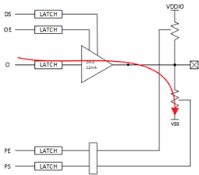<br> 
The corresponding leakage model is as follows<br>
```c
HAL_PIN_Set(PAD_PA31, GPIO_A31, PIN_PULLDOWN, 1);  //PA31配置为下拉
BSP_GPIO_Set(31, 1, 1); //PA31输出高电平
```
The correct configuration should be:<br>
```c
HAL_PIN_Set(PAD_PA31, GPIO_A31, PIN_NOPULL, 1);  //PA31配置无上下拉
BSP_GPIO_Set(31, 1, 1); //PA31输出高电平
```

### 8.7.3 IO Leakage Model 2
OE=1，O=0，PE = 1, PS= 1；<br>
OE=1, O=1 indicates that the output is low;<br>
PE=1, PS=1 indicates that there is a pull-up resistor;<br>
The current flow is as follows:<br>
Current value: I = VDDIO/Rpu;	Rpu pull-up resistor;<br>
<br>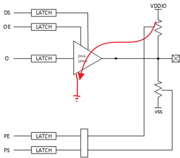<br> 
The corresponding leakage model is as follows<br>
```c
HAL_PIN_Set(PAD_PA31, GPIO_A31, PIN_PULLUP, 1);  //PA31配置为上拉
BSP_GPIO_Set(LCD_VCC_EN, 0, 1); //PA31输出低电平
```
The correct configuration should be:
```c
HAL_PIN_Set(PAD_PA31, GPIO_A31, PIN_NOPULL, 1);  //PA31配置无上下拉
BSP_GPIO_Set(LCD_VCC_EN, 0, 1); //PA31输出低电平
```

### 8.7.4 IO Leakage Model 3
IE= 1, OE=0，O=0，PE = 0, PS= 0；<br>
If the out voltage is at a certain voltage between 0 and VDDIO, the NMOS and PMOS of the input IO cell will be in a semi-conducting state, causing leakage. Based on this leakage model, the internal IO leakage is approximately 0uA - 200uA, varying by board.<br>
<br>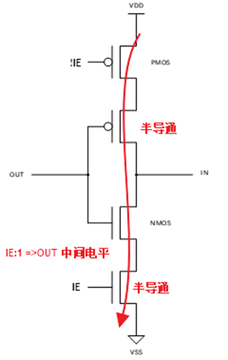<br> 
Current value: I=VDD/(Rnmos+Rpmos) <br>
*	The corresponding leakage model is as follows:<br>
```c
HAL_PIN_Set(PAD_PA31, GPIO_A31, PIN_NOPULL, 1);  //PA31配置无上下拉
```
Both of the following conditions are met<br>
A. BSP_GPIO_Set or rt_pin_write has not been called to output a high or low level<br>
B. The external IO is floating, with no corresponding pull-up or pull-down fixed level<br>

*	The correct configuration can be any of the following:
*	For an NC IO port or an unused IO, do not initialize it. IOs have pull-up/pull-down by default and do not need to be configured. The following figure shows the default IO pull-up/pull-down state
 <br>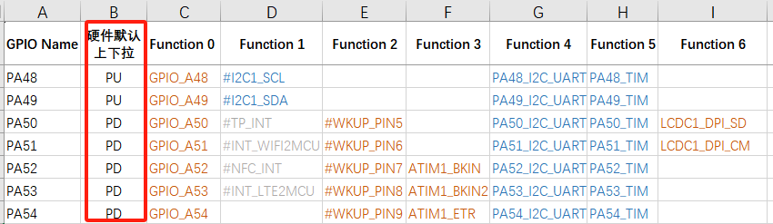<br>

*	The IO is used as an output port and outputs a high or low level.
```c
HAL_PIN_Set(PAD_PA31, GPIO_A31, PIN_NOPULL, 1);  //PA31配置无上下拉
BSP_GPIO_Set(LCD_VCC_EN, 0, 1); //PA31输出低电平
```

*	The IO is used as an input port, with external pull-up/pull-down resistors or a peripheral that can continuously provide a stable level.
```c
    HAL_PIN_Set(PAD_PB45, USART3_TXD, PIN_NOPULL, 0);           // USART3 TX/SPI3_INT
    HAL_PIN_Set(PAD_PB46, USART3_RXD, PIN_NOPULL, 0);           // USART3 RX
```
Or:
```c
    HAL_PIN_Set(PAD_PB45, USART3_TXD, PIN_PULLUP, 0);           // USART3 TX/SPI3_INT
    HAL_PIN_Set(PAD_PB46, USART3_RXD, PIN_PULLUP, 0);           // USART3 RX
```    
There is an external pull-up externally.
<br>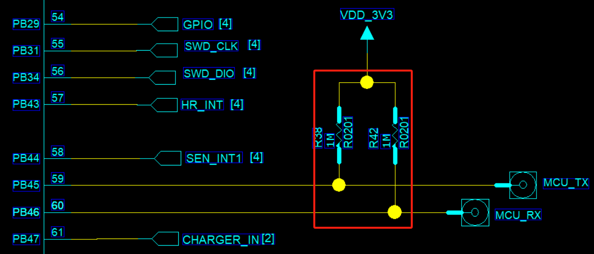<br> 
*	When the IO is used as an input, there is no external pull-up/pull-down, and no peripheral can provide a continuous stable level<br>
Configure as an internal pull-up or pull-down according to the external circuit (applicable to all IOs)<br>
```c
    HAL_PIN_Set(PAD_PB45, USART3_TXD, PIN_PULLUP, 0);        // USART3 TX
    HAL_PIN_Set(PAD_PB46, USART3_RXD, PIN_PULLUP, 0);        // USART3 RX
```    
For non-wake-up IOs, configure them as high impedance. The corresponding PAD IE bit will be turned off.<br>
```c
	HAL_PIN_Set_Analog(PAD_PB45, 0);  //设置为高阻
	HAL_PIN_Set_Analog(PAD_PB46, 0);  //设置为高阻
```    
For an IO port with wake-up function, there is also another input channel for wake-up input. When configured as high impedance, the wake-up input channel still has a leakage risk, so an internal or external pull-up must be present. As shown in the following figure, wake-up source IOs vary by chip. Refer to the corresponding Pin_config document.<br>
<br>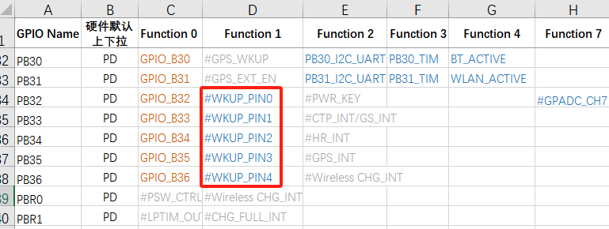<br> 
<a name="88_Hibernate关机常见的唤醒IO内部漏电模型"></a>
## 8.8 Common Internal Leakage Models of Wake-up IOs During Hibernate Power-off
### 8.8.1 IO State During Hibernate Power-off
	Regular IO (without wake-up function)<br>
After entering hibernate shutdown, all are in high-impedance state, with no internal leakage, and appear as high impedance externally<br>
	IO with wake-up function<br>
Compared with a regular IO, it has one additional wake-up input circuit. This circuit is used to wake up the MCU in hibernate. An external or internal pull-up/pull-down level is required to ensure that the wake-up IO does not leak current<br>
	After 55X hibernate shutdown, the pinmux pull-up/pull-down powers down. The wake-up IO has no internal PMU pull-up/pull-down and can only rely on external pull-up/pull-down<br>
	After 56X and 52X hibernate shutdown, the pinmux pull-up/pull-down powers down. The wake-up IO has a separate configurable PMU pull-up/pull-down that remains powered<br>
### 8.8.2 55X Wake-up IO Leakage Model During Hibernate Power-off
After 55X hibernate shutdown, the pinmux pull-up/pull-down powers down. The wake-up IO has no internal PMU pull-up/pull-down and can only rely on external pull-up/pull-down.<br>
When externally floating, based on this leakage model, the internal leakage of the wake-up IO is approximately 0uA - 200uA, varying by board.<br>
<br><br>
 
### 8.8.3 52X Wake-up IO Leakage Model 1 During Hibernate Power-off
After 52X enters Hibernate power-off, the wake-up IO has configurable PMU pull-up/pull-down. Before Hibernate power-off, if PMU no-pull is configured and there is no defined external pull-up/pull-down level, according to this leakage model (see the figure in ## 8.7.2), the internal leakage of the wake-up IO is approximately 0uA to 200uA (there will be differences between boards).<br>
```c
HAL_PIN_Set(PAD_PA24, GPIO_A24, PIN_NOPULL, 1);//唤醒IO PA24配置为无上下拉，外部也无上下拉
```
The correct configuration is as follows:<br>
In the pm_shutdown function, the unified configuration for wake-up IOs PA28-PA44 is as follows<br>
```c
hwp_rtc->PAWK1R = 0x0001ffff;; //PA28-PA44唤醒IO上下拉使能,bit0:PA28,bit1:PA29
hwp_rtc->PAWK2R = 0x0000; //PA28-PA44唤醒IO都配置为下拉，对应bit， 0:下拉，1:上拉 
```
In the following figure, the PE bit corresponds to pull-up/pull-down enable, and PS is pull-up/pull-down selection<br>
<br><br> 

PA24~PA27 and PBR0~3 use the same PAD. PA24~PA44 can all use the HAL_PIN_Set function to configure PMU pull-up/pull-down, for example:<br>
```c
HAL_PIN_Set(PAD_PA24, GPIO_A24, PIN_PULLDOWN, 1); //唤醒IO PA24 同时设置pinmux下拉和PMU下拉
HAL_PIN_Set(PAD_PA25, GPIO_A25, PIN_PULLDOWN, 1); 
HAL_PIN_Set(PAD_PA26, GPIO_A26, PIN_PULLDOWN, 1); 
HAL_PIN_Set(PAD_PA27, GPIO_A27, PIN_PULLDOWN, 1); 
```
When HAL_PIN_Set operates on the corresponding wake-up pins PA24~PA44, it configures the IO pinmux as pull-up/pull-down, and the internal PMU pull-up/pull-down is also configured at the same time,<br>
When Hibernate powers off, the pinmux pull-up/pull-down of the IO becomes invalid. The pull-up/pull-down in the PMU section does not power down and remains present.
<br>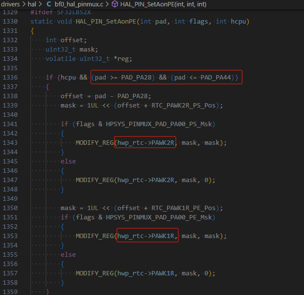<br> 

### 8.8.4 52X Wake-up IO Leakage Model 2 During Hibernate Power-off
After 52X enters Hibernate power-off, the wake-up IO has configurable non-power-down PMU pull-up/pull-down. Before Hibernate power-off, if the PMU pull-up/pull-down is configured opposite to the external level,<br>
```c
HAL_PIN_Set(PAD_PA24, GPIO_A24, PIN_PULLUP, 1);//唤醒IO PA24配置为PMU内部上拉，导致外设漏电
```
## 8.9 Low-Power Debugging Experience Sharing

**Power Consumption in Hibernate**<br>
55 series MCU:<br>
No software processing is required. All IOs are already in high-impedance state. Because the wake-up PIN has no internal pull-up/pull-down, external pull-up/pull-down is required to guarantee the level and ensure that the wake-up PIN does not leak current;<br>
58, 56, and 52 series MCU:<br>
Except for the wake-up PIN, all other IOs are already in high-impedance state. In software, you only need to confirm that the corresponding correct PIN pull-up/pull-down has been configured before entering Hibernate;<br>
For the 52 series, three internal LDOs also need to be turned off;<br>
Hibernate is typically below 5uA. Any other power consumption comes from the peripheral hardware circuits;<br>
**Deep/Standby Standby Power Consumption**<br>
First ensure that Hcpu/Lcpu have both entered low power mode, the Log has printed pm[s], and the system can be woken up by pm[w], ensuring that the sleep/wake-up process does not hang;<br>
You can also determine whether low power mode has been entered by measuring the voltages of the hpsys and lpsys LDOs in the hardware. The voltage decreases during sleep and recovers after wake-up;<br>
Power consumption mainly focuses on three aspects:<br>
```
1，外设漏电，包括MCU与外设IO电平差导致漏电<br>
2，MCU内部IO漏电，见FAQ的IO漏电模型，<br>
常见输出高而下拉，内部上拉而外部下拉，输入口而无上下拉，<br>
3，MCU内部或者外部存储单元Flash，Psram，EMMC没有进入低功耗，<br>
```
* Regarding the first point: it is best to remove all peripherals so that the system becomes a minimum system, and then eliminate peripheral leakage one by one.<br>
* Regarding the second point, see the code below. Configure regular IOs as high impedance during sleep, and configure the wake-up pin as pull-up or pull-down according to the external circuit;<br>
**Notes:**<br>
1. If an IO that needs to be used is configured as high impedance, it must be configured back after wake-up; otherwise, functionality will be affected;<br>
2. For some peripherals, such as nor flash, the QSPI CS needs to be configured high. Configuring it as high impedance may instead cause more leakage;<br>
```c
    HAL_PIN_Set_Analog(PAD_PA44, 1);
    HAL_PIN_Set(PAD_PA24, GPIO_A24, PIN_PULLDOWN, 1); //set pulldown or pullup all wakesrc pin
```    
* Regarding the third point, perform power-off (corresponding IO pull-down or high impedance) or sleep operations according to the power supply and IOs of the MCU internal/external flash, psrma, and emmc;<br>
For each specific storage device, whether to choose power-off or sleep must be determined based on whether the storage device data will be lost after waking from sleep, whether it needs to be retained, the time overhead of entering and exiting sleep, and the current parameters in the memory datasheet, so as to select the optimal solution that meets the functional requirements;<br>
The following are some operation interfaces for psram and flash entering and exiting sleep;<br>
```c
#ifdef BSP_USING_PSRAM1
    rt_psram_enter_low_power("psram1");
#endif
#ifdef BSP_USING_PSRAM1
    rt_psram_exit_low_power("psram1");
#endif
#if defined(BSP_USING_NOR_FLASH1)
        FLASH_HandleTypeDef hflash;
        hflash.Instance = FLASH1;
        HAL_FLASH_RELEASE_DPD(&hflash);
        HAL_Delay_us(8);
#endif /* BSP_USING_NOR_FLASH2 */
```
