# 9 PWM
## 9.1 Configuration Method for Using PB24 as the Motor PWM Port
1. Find that PB24 corresponds to GPTIM5 and Channel 2<br>
<br>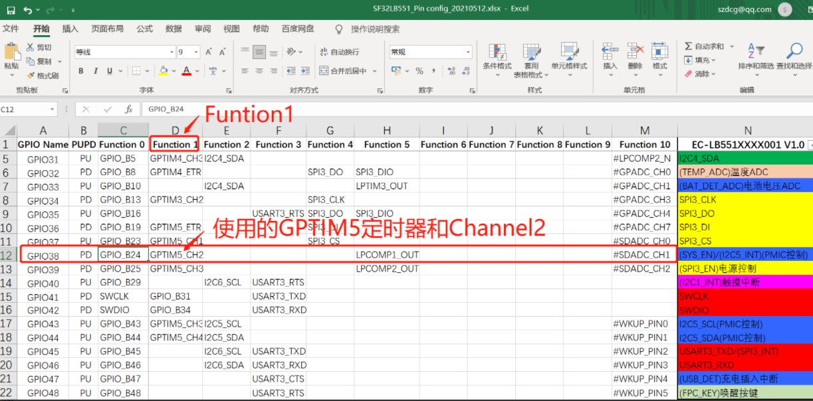<br>  
2. In pinmux.c, configure PB24 as the GPTIM5_CH2 function pin<br>
```c
HAL_PIN_Set(PAD_PB24, GPTIM5_CH2, PIN_NOPULL, 0);             // Motor PWM
```
3. Check the configuration in pwm_config.h and see that GPTIM5 corresponds to pwm6,<br>
<br>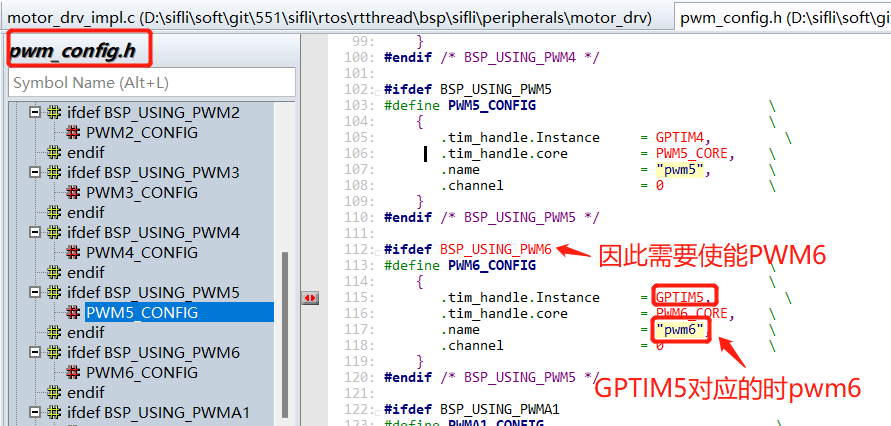<br>  
4. → RTOS → On-chip Peripheral Drivers → Enable pwm Select PWM6, and enable the following macro:<br>
```c 
#define BSP_USING_PWM6 1
```
5. Modify the configuration for pwm6 and channel 2 corresponding to PB24.<br>
```c
#define PORT_MOTO        (96+24)
#ifndef  MOTOR_DRV_MODE_GPIO
#define PWM_DEV_NAME      "pwm6"  /* PWM设备名称 */
#define PWM_DEV_CHANNEL     2    /* PWM通道 */
#endif
```
<br><br>  
6. For how to enable and configure pwm output, refer to the motor code and modify it to your corresponding PWM output configuration, as shown in the figure below:
<br>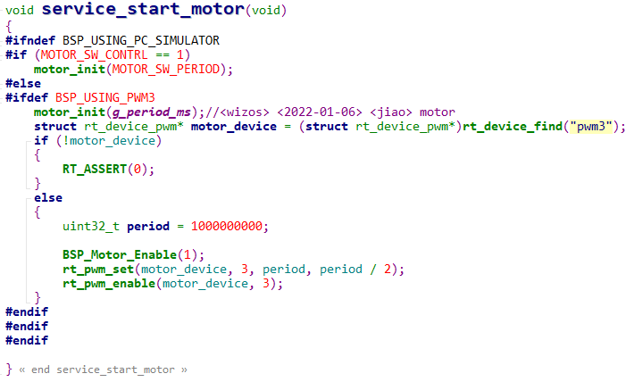<br>  

## 9.2 How to Configure PA47 as the LCD Backlight?
1. Find that PA47 corresponds to GPTIM1 and Channel4<br>
<br>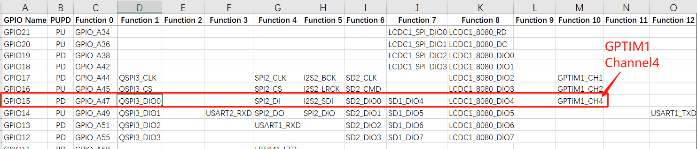<br>  
2. In the pinmux.c file, configure it as the GPTIM1_CH4 function pin, as follows:<br>
```c
#define LCD_BACKLIGHT_USING_PWM
#ifdef LCD_BACKLIGHT_USING_PWM
    HAL_PIN_Set(PAD_PA47, GPTIM1_CH4, PIN_NOPULL, 1);  //backlight pwm  
#else
    HAL_PIN_Set(PAD_PA47, GPIO_A47, PIN_NOPULL, 1);  /GPIO backlight
#endif 
```
3. Check the configuration in pwm_config.h and verify that GPTIM1 corresponds to pwm2,
<br>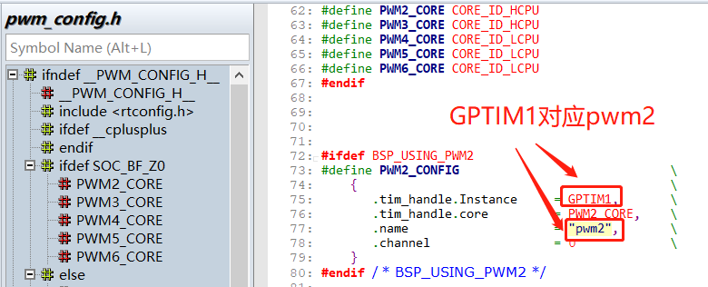<br>  
4. In menuconfig<br>
`→ RTOS → On-chip Peripheral Drivers → Enable pwm` Select PWM2, and enable the following macro: <br>
```c
#define BSP_USING_PWM2 1
```
5. In the SPD2010_SetBrightness brightness setting function of the corresponding display driver, configure pwm2 and channel 4 corresponding to PA47. The code is as follows:<br>
```c
#define LCD_BACKLIGHT_USING_PWM
#ifdef LCD_BACKLIGHT_USING_PWM
#define LCD_BACKLIGHT_PWM_DEV_NAME "pwm2"
#define LCD_BACKLIGHT_PWM_PERIOD (1 * 1000 * 1000)
#define LCD_BACKLIGHT_PWM_CHANNEL 4
#endif
void SPD2010_SetBrightness(LCDC_HandleTypeDef *hlcdc, uint8_t br)
{
    uint8_t bright = (uint8_t)((int)SPD2010_BRIGHTNESS_MAX * br / 100);
    SPD2010_WriteReg(hlcdc, SPD2010_WBRIGHT, &bright, 1);
//	rt_kprintf("SPD2010_SetBrightness val=%d \n",br);
#ifndef LCD_BACKLIGHT_USING_PWM //不用PWM，就直接拉高拉低GPIO点亮背光
	/* PA70 Backlight ,PA47 1V8_EN*/
		uint8_t bright = (uint8_t)((int)SPD2010_BRIGHTNESS_MAX * br / 100);
		GC9B71_WriteReg(hlcdc, SPD2010_WBRIGHT, &bright, 1);
		rt_pin_mode(LCD_BACKLIGHT_POWER_PIN, PIN_MODE_OUTPUT);
		rt_pin_write(LCD_BACKLIGHT_POWER_PIN, 1);
		LOG_I("SPD2010_SetBrightness,br:%d\n",br);	
	/* PA70 Backlight */
#else
	/* PA47 Backlight PWM,PA70_NC*/
		rt_uint32_t pulse = br * LCD_BACKLIGHT_PWM_PERIOD / 100;
		struct rt_device_pwm *device = RT_NULL;
		device = (struct rt_device_pwm *)rt_device_find(LCD_BACKLIGHT_PWM_DEV_NAME);
		if (!device)
		{
			LOG_I("find pwm:LCD_BACKLIGHT_PWM_DEV_NAME err!",br,pulse);
			return;
		}
		rt_pwm_set(device,LCD_BACKLIGHT_PWM_CHANNEL,LCD_BACKLIGHT_PWM_PERIOD,pulse);
		rt_pwm_enable(device, LCD_BACKLIGHT_PWM_CHANNEL);
		LOG_I("SPD2010_SetBrightness,br:%d,pulse:%d\n",br,pulse);
	/* PA47 Backlight PWM */	
#endif	
}
```
**Note:**<br>
When using a PA port to output PWM, if the Hcpu main frequency scaling function of `#define BSP_PM_FREQ_SCALING 1` is enabled,<br>
After Hcpu enters the idle thread, the main frequency decreases, and the PWM frequency of the corresponding Hcpu PA31 port also changes<br>
Solution 1:<br>
Disable the #define BSP_PM_FREQ_SCALING 1 macro, at the cost of higher hcpu power consumption when the screen is on<br>
Fundamental solution 2:<br>
Switch to a PB port to output PWM<br>

## 9.3 Method for Outputting PWM During Sleep
Application scenario: PWM output needs to continue in sleep state, using PWM controlled by Lcpu lptim3<br>
Usage:<br>
1. Enable the Lcpu lptim3 timer and PWM in menuconfig
<br>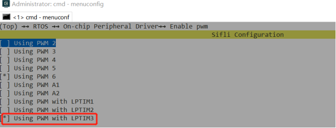<br>
<br>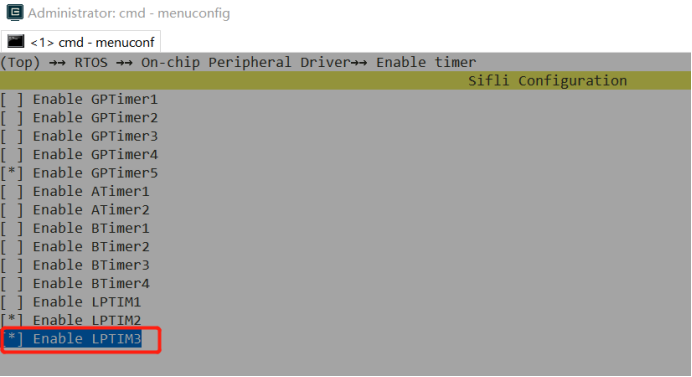<br>    
2. Set the corresponding pin to lptim3_pwm mode, for example PB44. Commonly used pins are PB43~PB46<br>
```c
HAL_PIN_Set(PAD_PB44, LPTIM3_OUT, PIN_NOPULL, 0);
MODIFY_REG(hwp_lpsys_aon->DBGMUX,LPSYS_AON_DBGMUX_PB44_SEL_Msk,                        MAKE_REG_VAL(1,LPSYS_AON_DBGMUX_PB44_SEL_Msk,LPSYS_AON_DBGMUX_PB44_SEL_Pos));
```
3. Define the macro PM_WAKEUP_PIN_AS_OUTPUT_IN_SLEEP to continue output during sleep
<br>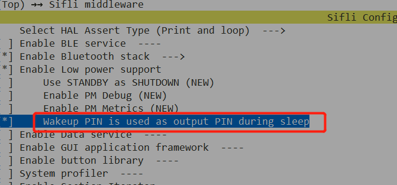<br> 
4. Fix the existing bug before sdk1.1.3; subsequent sdk versions will be updated<br>
<br>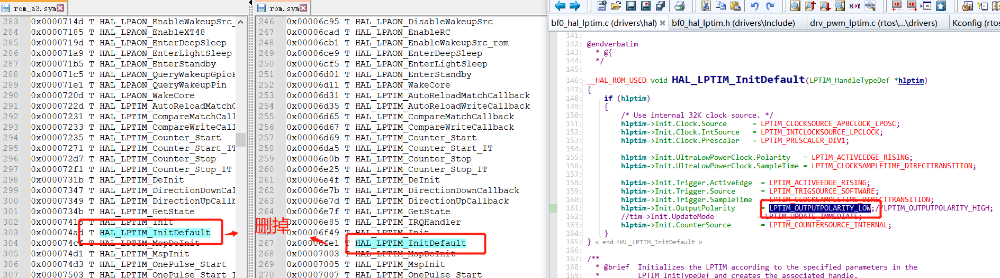<br>  
<br>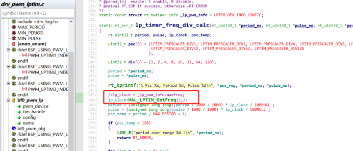<br>
 
5. The reference code is as follows: use PB44 as the pwm output<br>
<br>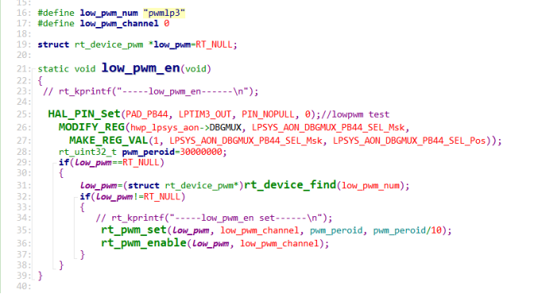<br>      
6. Usage notes:<br>
Because PB44 also outputs a waveform when sleep is enabled, the other wakeup pins on PB must be connected to fixed pull-up or pull-down resistors in hardware; otherwise, leakage current may occur.<br>

## 9.4 PWM Differences Among the 55X Series, 56X Series, and 52X Series
1. For the 55X series, the IO ports that can output PWM are fixed. Refer to ## 9.2. For the 56X and 52X series, any pin with the PXXX_TIM function can output PWM
 <br>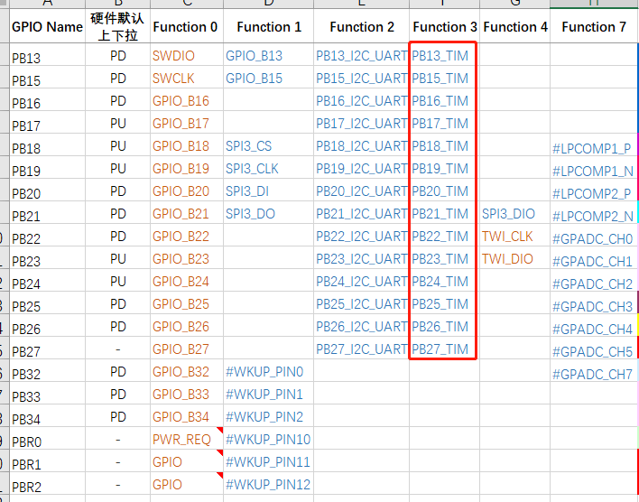<br>
2. For the 56X, 55X, and 52X series, if Hcpu is used to output PWM and the Hcpu main-frequency scaling feature #define BSP_PM_FREQ_SCALING 1 is enabled, after Hcpu enters the idle thread, the main frequency will decrease, and the PWM frequency of the Hcpu PA port will change accordingly,<br>
Solution:<br>
For the 55X and 56X series, switch to the PB port, or sacrifice active-screen power consumption and disable the `BSP_PM_FREQ_SCALING` main-frequency scaling feature,<br>
For the 52X series, GPTIM2 can be used to output PWM, because special handling has been implemented so that the PWM of GPTIM2 is not affected by system frequency changes,<br>

3. For the 56X and 52X series, any IO port that can output PWM can be configured with any TIM and channel,<br>
Refer to pwm_config.h for the timers TIM and channels supported by the cpu corresponding to pwm, for example:<br>
```c
HAL_PIN_Set(PAD_PA31, GPTIM1_CH3, PIN_NOPULL, 1);
HAL_PIN_Set(PAD_PA31, GPTIM1_CH1, PIN_NOPULL, 1); 
```
## 9.5 Notes on Connecting Different Channels of the Same PWM to Different Devices
1. Different channels of the 52x PWM can be connected to different devices. Typical applications include backlight and motor;<br>
Different channels of the same PWM can only be configured with the same period, but they can be configured with different duty cycles;<br>
The figure below shows the output waveforms of the respective channels when both the backlight and the motor are configured to 1kHz:
<br>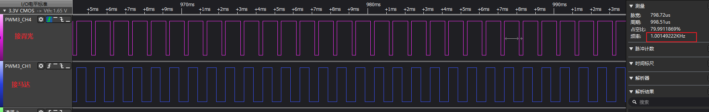<br> 
2. When the backlight and motor must be configured with different periods, the backlight is used continuously when the screen is on and cannot be time-multiplexed with the motor. Therefore, the backlight and motor need to be configured to different PWMs.<br>
On HDK52X, only PWM3 is not affected by automatic frequency scaling, so PWM3 is generally used for the backlight, and the motor can only use PWM2;<br>
Because PWM2 changes the period of the output waveform as automatic frequency scaling changes, it is best to consider disabling frequency scaling while the motor is in use.<br>
The reference implementation is as follows:<br>
<br>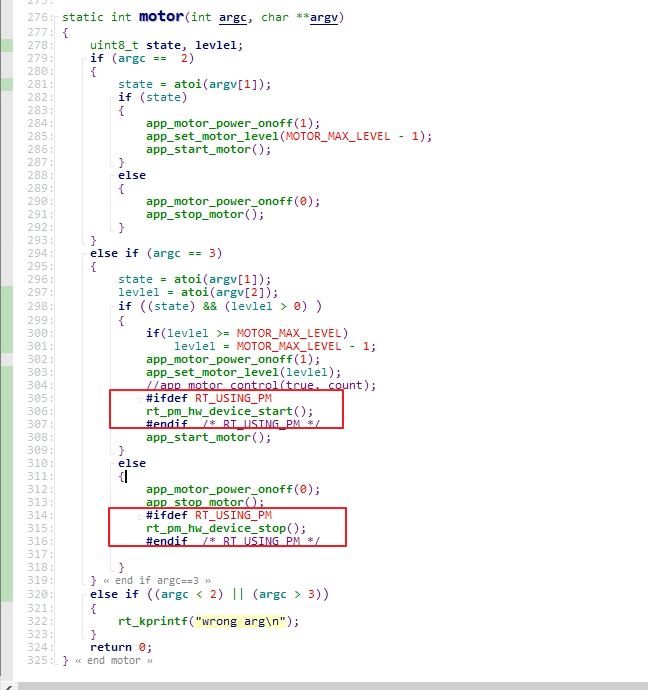<br>
