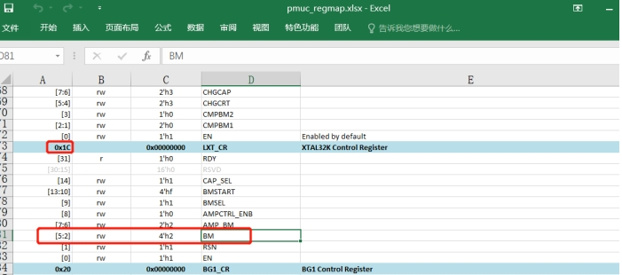
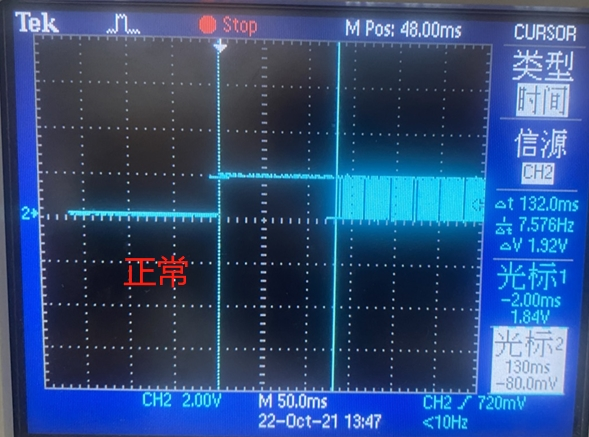
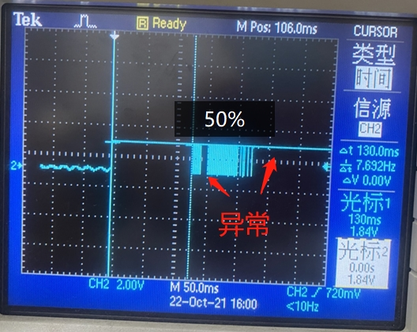
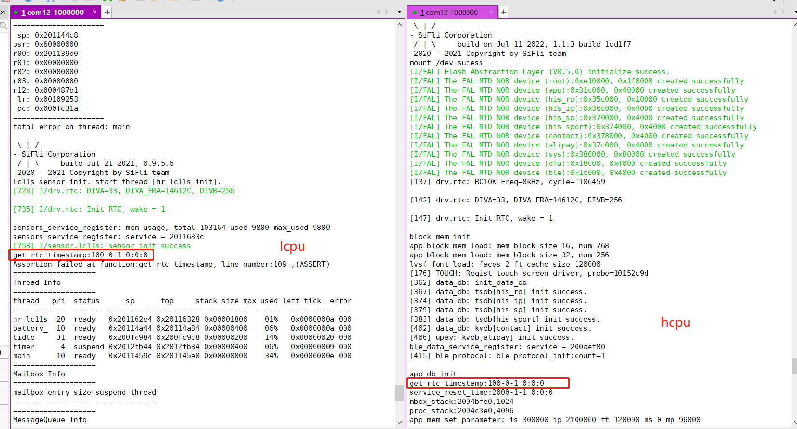
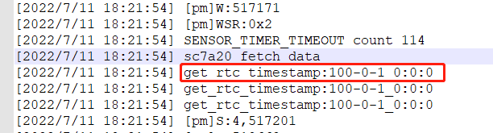
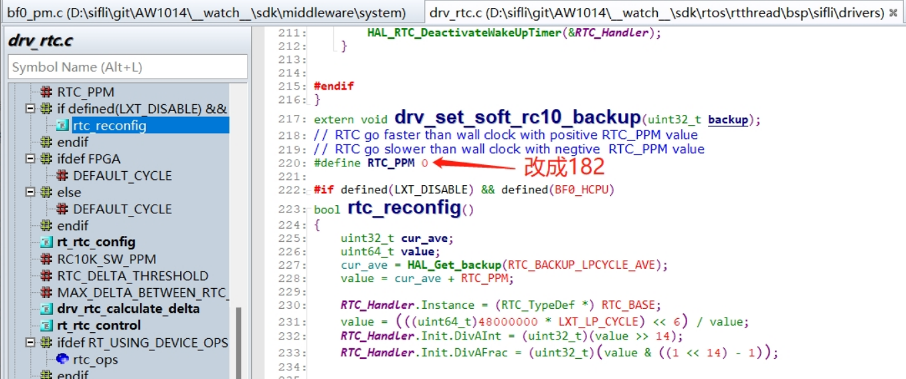

# 5 RTC Related
## 5.1 RTC Clock Fails to Start
Symptom: <br>
A customer had 5 boards, and the RTC did not run on 4 of them. They were 2-layer boards. After replacing the crystal with the one from our evb, the crystal could occasionally start, but it ran slowly and then stopped running.  
Experiments performed:<br>
1. In the mem32 0x4007a01c 1 register, the BM bias current defaults to 2. In the jlink interface, rewrite the BM value to 2, and the RTC can start running;<br>
2. In the code HAL_PMU_EnableXTAL32, change the BM bias current from the default 0x2 to 0x03 to increase the crystal drive current through the PMU register. The RTC can slowly start running. When changed to 0x6, it can start after 10 seconds. When changed to 0x9, it can start after 4 seconds. When changed to 0xa, it can start immediately, but there is a 2-second repetition in the middle;<br>
3. After changing it to 0xb, the RTC test is completely normal;<br>
<br><br> 
Because increasing BM in register 0x4007a01c from 2 to 3 increases the current by 80nA, if it is directly raised to 0xb, the current will increase by 9 times,
However, if the setting is less than 0xb, the RTC startup time is too long;<br>
Some more experiments were performed today, and the root cause was identified;<br>
a. First, configure PB01 to output the 32768 clock for clock observation,<br>
After Jlink is connected<br>
```
a)，命令输入: w4 0x40043004 0x2f9 把PB01切换到function 9，
b)，命令输入: w4 0x4004F018 0x8 把LSYSCFG其中的DBGCLKR bit3 CLK_EN置1，
```
<br><br>  
You can use the mem32 0x40043004 1 command to read back and confirm whether it has been written,
If adding the configuration in code, you can modify the PB01 mode in pinmux.c to 9 DBG_CLK,<br>
```c
HAL_PIN_Set(PAD_PB01, DBG_CLK, PIN_NOPULL, 0);
_WWORD(0x4004F018, 0x8);   // PB01 output 32768 clk
```
b. The 32768 waveforms of a normal board and an abnormal board are as follows:<br>
<br><br>  
<br><br>  

b. Swap the 32768 crystal between the normal and abnormal boards. The issue follows the main board and is unrelated to the crystal;<br>
c. Supply Vbuck1 with 1.25V, and the RTC clock tests normal;<br>
d. Therefore, a problem with the Vbuck1 power supply was suspected. Replacing the DCDC 4.7uH inductor did not improve the issue. After adding a 10uF capacitor in parallel with the 4.7uF capacitor of Vbuck DCDC, the rtc issue was resolved;<br>
Root cause: <br>
On the large board, the DCDC inductor and capacitor are too far from the CPU. The filter capacitor uses a 0402 package, and its capacitance also seems insufficient,
During previous support, many failure symptoms caused by insufficient Isat current of DCDC inductors were encountered,
Therefore, hardware engineers are expected to pay more attention to the selection of DCDC inductors and filter capacitors, as well as layout and routing.<br>

## 5.2 Method for Outputting the 32768 Crystal Clock Through I/O
1. Method for outputting the 32768 clock on 52/56<br>

PA24-PA27 on 52 and PBR0-PBR3 on 56 are LowPower consumptionIO pins, and they can continuously output a 32768hz clock during deep/standby sleep,
The specific configuration method is as follows:<br>
```c
#if defined(SF32LB52X)
    HAL_PIN_Set(PAD_PA24, PBR_CLK_RTC,  PIN_NOPULL, 1); //output 32768 clk
    HAL_PIN_Set(PAD_PA25, PBR_CLK_RTC,  PIN_NOPULL, 1); //output 32768 clk
    HAL_PIN_Set(PAD_PA26, PBR_CLK_RTC,  PIN_NOPULL, 1); //output 32768 clk
    HAL_PIN_Set(PAD_PA27, PBR_CLK_RTC,  PIN_NOPULL, 1); //output 32768 clk
#elif defined(SF32LB56X)
    HAL_PIN_Set(PAD_PBR1, PBR_CLK_LP,  PIN_NOPULL, 0); //output 32768 clk
    HAL_PIN_Set(PAD_PBR2, PBR_CLK_LP,  PIN_NOPULL, 0); //output 32768 clk
    HAL_PIN_Set(PAD_PBR3, PBR_CLK_LP,  PIN_NOPULL, 0); //output 32768 clk
#endif
```
2. Method for outputting the 32768 clock from the PB port on the 55 series<br>
For example: output the 32768 clock through PB01. The specific method is:<br>
After Jlink is connected<br>
```
A，命令输入: w4 0x40043004 0x2f9 把PB01切换到function 9，
B，命令输入: w4 0x4004F018 0x8 把LSYSCFG其中的DBGCLKR bit3 CLK_EN置1，
```
<br><br>  
You can use the `mem32 0x40043004 1 ` command to read back and confirm whether it has been written,<br>
If adding the configuration in code, you can modify the PB01 mode in pinmux.c to 9 DBG_CLK,<br>
```c
HAL_PIN_Set(PAD_PB01, DBG_CLK, PIN_NOPULL, 0);
_WWORD(0x4004F018, 0x8);	// PB01 output 32768 clk
```
**Note:**<br>
The prerequisite for the IO to output the 32768hz clock is: the board must have a 32768 crystal, and the macro `#define LXT_DISABLE 1` must not be enabled<br>

## 5.3 Method for Using the Internal RC Clock in a Solution Without the 32768 Crystal
1. Enabling method:<br>
In the Hcpu project menuconfig, select `(Top) → Board Config →  Lower crystal disabled`<br>
After the following macro is generated in rtconfig.h, Hcpu writes the configuration into the register. Lcpu obtains the register status through the function HAL_LXT_DISABLED. In the bootloader, the default clock is already the RC10k clock, so no modification is required;<br>
```
#define LXT_DISABLE 1
#define LXT_LP_CYCLE 200
```
Here, 200 indicates the measurement duration, in units of RC10K cycles. Count how many 48M cycles occur within 200 RC10K cycles to calculate the actual frequency of RC10K;<br>
To resolve the issue of inaccurate RTC timekeeping after switching to the RC clock, the solution is for lcpu to start a timer named “rc10 or rtc” with a 15-second period, and for hcpu to start a 5-minute timer (for 52, only Hcpu has one 15-second-period timer). After the timers start, calibration is performed based on the 48M crystal clock to correct the current RTC timekeeping Accuracy;<br>
2. After changing to the internal RC10K oscillator, the oscillation frequency changes from 32768 to 8000-10000. RC oscillation varies with temperature, and each board is different. Therefore, the timestamp calculation method is:<br>
Change from 601272/32.768 to 601272/9 (ms)<br>
```
[160579] TOUCH: Power off done.
[pm]S:4,160586
[pm]W:601272
```
As above, calculation of the duration from sleep to wake:<br>
```
(601272-160586)/9=48965(ms)
```
3. The advantages and disadvantages of using rc10k versus an external 32768 crystal are as follows:<br>
||rc10k|32768 crystal|
| ----- | --------------- | ---- |
|Accuracy|Depends on the 48M crystal accuracy and calibration algorithm|High|
|Power consumption|The wake-up overhead with a 15-second period increases by approximately 15 uA|Low|
|Cost|Low|High|
|I/O output 32K|Cannot output 32768 through I/O|Can be configured to output 32768 for peripherals such as Wi-Fi/GPS|
## 5.4 Reason Why the Timestamp Obtained by RTC Is Year 100, Month 00, Day 01, 0:0:0
1. First case: the whole device is reset or Lcpu is reset, before the clock has been written to the RTC<br>
As shown in the following figure:<br>
<br><br>  
2. Second case: after the CPU wakes from Standby, the RTC is read immediately, and the delay is less than 1/256 second (about 4ms).
<br><br>  
Because Hcpu takes more than 4ms to wake from standby, the RTC can be read directly after wakeup,<br>
When Lcpu wakes from standby and reads the RTC immediately, this phenomenon will occur. Therefore, it is not recommended for Lcpu to read the RTC frequently after waking from standby. If frequent reads are required, you can use the software time method we provide to replace the previous direct RTC reads.<br>
```c
#ifdef SOC_BF0_LCPU	
	timestamp = service_lcpu_get_current_time();
#else
   	timestamp = time(RT_NULL);
#endif
```
RTC and soft RTC time are periodically synchronized through a 30s timer and the `service_lcpu_soft_timestamp_reset()` function.<br>

## 5.5 How to Set the Default RTC Time (solution)
The initial time is set in app_set_default_system_time in app_comm.c. Modify the corresponding macro definitions as needed:<br>
```c
int app_set_default_system_time(void)
{
    if (PM_COLD_BOOT == SystemPowerOnModeGet())
    {
        setting_time_t default_time = {0};
        default_time.year = SIFLI_DEFAULT_YEAR;
        default_time.month = SIFLI_DEFAULT_MON;
        default_time.day = SIFLI_DEFAULT_DAY;
        default_time.hour = SIFLI_DEFAULT_HOUR;
        default_time.min = SIFLI_DEFAULT_MIN;
        default_time.second = SIFLI_DEFAULT_SECOND;
        default_time.zone = SIFLI_DEFAULT_TIMEZONE;
        app_update_system_time(&default_time);
    }
    return 0;
}
```


## 5.6 Adjustment Method for Inaccurate Timekeeping in the Solution Without the 32768 Crystal (Internal RC10K Clock)
1. Ensure that 48Mhz has been calibrated to guarantee the Accuracy of the 48M crystal;<br>
2. The calibration compensation can be adjusted as follows:<br>
```c
#define RTC_PPM 75 //可以为负数
```
<br><br> 
 Calculation algorithm:<br>
For example, a customer reported that the RTC was 21S slow after 32 hours. Since it is slow, the number of clocks by which it needs to run faster is increased through RTC_PPM. RTC_PPM is the number of additional clocks to run per 1M clocks<br>
The calculation formula is as follows:<br>
```
21 / (32 *60*60)  *1000000=182
```
32 hours is approximately 32*60*60 = 115200 seconds. If it is slow by 21 seconds, then it is slow by 21/115200 * 1000000=182 seconds per 1M seconds<br>
Using the above method, after calculating a compensation value of 182, the test showed a 2s delay after 40 hours, meeting the customer's requirements.<br>
