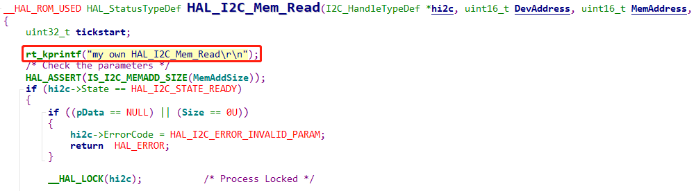
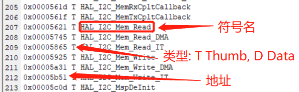
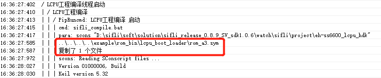
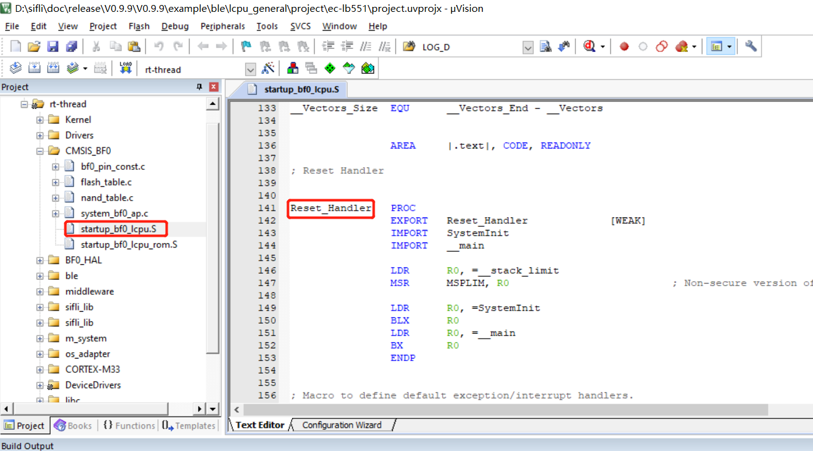
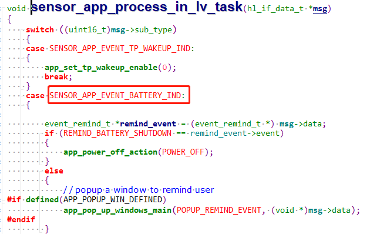
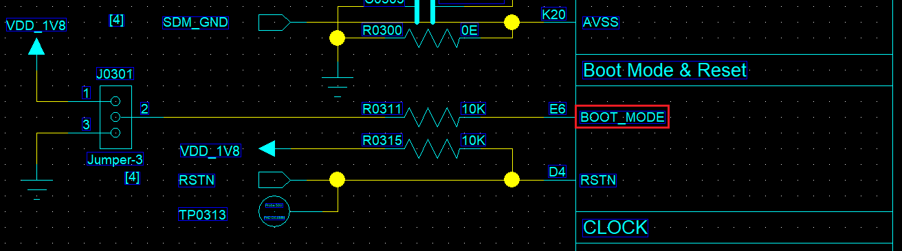
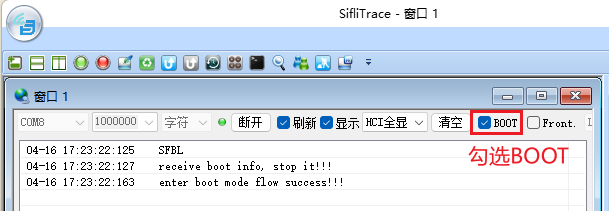
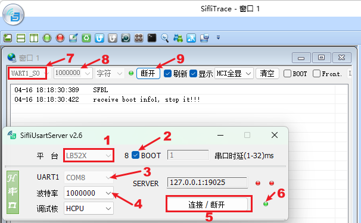

# 10 System
## 10.1 How to Call and Replace Functions and Variables Fixed in ROM Space in Lcpu?
  To save Lcpu RAM space for code, the ROM contains the BLE protocol stack, RTT OS, the complete HAL code, and some driver code.<br> 
In Lcpu, the functions and variables available for customer calls are placed via a symble file at:<br> 
the `SDK\example\ble\lcpu_general\project\ec-lb551\rom.sym ` file, and are declared as strong functions without the __weak attribute.<br> 

Therefore, when writing code, ROM code is called as much as possible whenever it can be called.
For example:<br> 
The function HAL_I2C_Mem_Read in the file bf0_hal_i2c.c that you see in the SDK will participate in compilation, but during linking, this definition is made a weak function:<br> 
```c
#define __HAL_ROM_USED __weak 
``` 
<br><br>  
In the corresponding example\ble\lcpu_general\project\ec-lb551\rom.sym file, as shown in the following figure:<br> 
<br><br>  

There is also a function with the same name, and it is not a __weak weak function. Therefore, it will be linked to the strong function code in ROM, so the rt_kprintf above will not be printed.<br> 
If you want to run this HAL_I2C_Mem_Read function and replace the function in ROM, first delete example\ble\lcpu_general\project\ec-lb551\rom.sym # This path may vary by project. You can locate it by checking the compilation log, as shown in the following figure:<br> 
<br><br>   
Then run the command scons -c to clear the lcpu build results and recompile. For the corresponding line 0x00005621 T HAL_I2C_Mem_Read in the file, during compilation and linking, because only this one HAL_I2C_Mem_Read weak function exists, this __weak function will be linked.<br> 
At this point, the rt_kprintf("my own HAL_I2C_Mem_Read\r\n"); print that you added in the figure above can be printed.<br> 
To confirm whether the function in ROM or the function in the code is being used, search for the address corresponding to this function in the map file generated by the Lcpu build.<br> 

## 10.2 Interface for Obtaining the Current Restart Mode
Currently, the startup states that can be identified by the SF32LB55X chip are as follows:<br> 
```
/** power on mode */
typedef enum
{
    PM_COLD_BOOT = 0，  /**< cold boot */
    PM_STANDBY_BOOT,   /**< boot from standby power mode */
    PM_HIBERNATE_BOOT, /**< boot from hibernate mode, system can be woken up by RTC and PIN precisely */
    PM_SHUTDOWN_BOOT,   /**< boot from shutdown mode, system can be woken by RTC and PIN, but wakeup time is not accurate */
} pm_power_on_mode_t;
```
You can obtain it by calling:<br> 
```c
pm_power_on_mode_t SystemPowerOnModeGet(void)
{
    return g_pwron_mode;
}
```
to obtain the startup mode;<br> 
Note: The four types of cold root—power-on, wdt, key reset, and HAL_PMU_Reboot—cannot be distinguished;<br> 
## 10.3 Is the main Function the Entry Function of lcpu?
The lcpu reset address is at<br> 
<br><br>   
The main function is the main function of one of the threads started after initialization is complete;<br> 

## 10.4 How Lcpu Wakes Up Hcpu
a. Lcpu can send a message to hcpu through ipc_send_msg_from_sensor_to_app as follows. This message can wake up Hcpu.<br> 
```c
static void battery_send_event_to_app(event_type_t type)
{
    event_remind_t remind_ind;

    rt_kprintf("battery_send_event_to_app: event %d\n", type);
    remind_ind.event = type;
    ipc_send_msg_from_sensor_to_app(SENSOR_APP_EVENT_BATTERY_IND, sizeof(event_remind_t), &remind_ind);
}
```
b. After the Hcpu side wakes up, add code in the task to process this message, as follows:
<br><br>  

## 10.5 Method for MCU to Enter Boot_Mode

The internal ROM of SiFli series MCUs has boot code fixed in it. Without flashing any code, the MCU enters the boot code after power-on. The boot code already includes common flash storage drivers and determines how to jump to the code by reading the Flashtable configuration at a fixed address in external storage. If the flashtable read by the boot code is incorrect, it will also remain in the boot_mode code. You can compare the PC pointer address with the `HPSYS address mapping` in the chip manual to determine whether it is in the boot_mode code range. The ROM address range where the boot code is located is usually as follows:<br>
Memory|Address space|Starting Address|Ending Address
:--|:--|:--|:--
ROM|64KB|0x0000_0000|0x0000_FFFF

Purpose of entering boot_mode:<br>
1. Hardware debugging: you can determine whether the MCU is running normally without programming any application;<br>
2. When Jlink or Uart is unavailable due to a user program crash or other situations, enter boot_mdoe mode to ensure programs can be downloaded normally;<br>

### 10.5.1 Method for 55/58/56 Series MCUs to Enter Boot Mode
<br><br>   
The 55, 58, and 56 series MCUs all have a BOOT_MODE pin. If BOOT_MODE is pulled high and the device is reset or powered on, it enters boot_mode. The following log appears on the default debug serial port of Lcpu, which is also the default uart download port.
```
   Serial:c2,Chip:2,Package:0,Rev:0
    \ | /
   - SiFli Corporation
    / | \     build on Mar 20 2022, 1.2.0 build dbebac
    2020 - 2022 Copyright by SiFli team
   msh >
```
In boot_mode, before performing UART download, you can enter the help command to verify whether the serial port is working, as follows:
```
   Serial:c2,Chip:2,Package:0,Rev:0
    \ | /
   - SiFli Corporation
    / | \     build on Mar 20 2022, 1.2.0 build dbebac
    2020 - 2022 Copyright by SiFli team
   msh >
TX:help
   help
   RT-Thread shell commands:
   list_mem 
   uart 
   spi_flash 
   reboot 
   regop 
   dump_config 
   dfu_recv 
   reset 
   lcpu 
   sysinfo 
   version 
   console 
   help 
   time 
   free 
   msh >
```  
<br>**Note**<br> 
The boot_mode log output after BOOT_MODE is pulled high comes from internally embedded ROM code and does not depend on external code. If this log is not present, check whether the serial port connection and MCU operating conditions are satisfied.<br> 
### 10.5.2 Method for Entering Boot Mode on 52 Series MCUs
<br><br> 
As shown in the figure above, you need to use the tool `SiFli-SDK\tools\SifliTrace\SifliTrace.exe` to connect over the serial port and select the BOOT option, then restart the device. In the boot code embedded in 52, it will wait for 2 seconds. After the BOOT option is selected, the SifliTrace tool sends a command to make 52 enter boot_mode. If you only see the `SFBL` log and do not see the following two logs, the UART path from the PC TX to the MCU RX may not be working;<br>
```
SFBL
receive boot info, stop it!!!
enter boot mode flow success!!!
```
You can also use the tool `SiFli-SDK\tools\SifliUsartServer.exe` together with SifliTrace.exe, as shown below:
<br><br> 

<br>**Note**<br>
The `SFBL` log does not depend on software. If this log is not present, check whether the serial port connection and MCU operating conditions are satisfied.<br>

## 10.6 Modifying the PA34 Long-Press Reset Time on the 52 Series
The 58, 56, and 52 series MCUs all support reset by long-pressing the power key (PWRKEY). If the chip's power key PB54 (58 series), PB32 (56 series), or PA34 (52 series) remains at a high level for more than 10 seconds, a PWRKEY reset occurs, resetting all modules except RTC and IWDT. You can query whether a PWRKEY reset has occurred through the `PWRKEY` flag in the PMUC register WSR, and clear this flag through `PWRKEY` in the PMUC register WCR.<br> 
For the 52 series, the long-press reset time can be modified (58 and 56 do not have this register and do not support modification). The default parameter of `PWRKEY_HARD_RESET_TIME` is 10, which means 10 seconds, and it can be modified as needed. Internally, RC32 counting is used and it does not depend on the external 32768 crystal clock. In addition, the key polarity cannot be modified;
```c
#ifndef PWRKEY_HARD_RESET_TIME
    #define PWRKEY_HARD_RESET_TIME     (10)   /* unit:s */
#endif
```
The corresponding code is configured in the initialization function HAL_PreInit:
```c
hwp_pmuc->PWRKEY_CNT = PWRKEY_CNT_CLOCK_FREQ * PWRKEY_HARD_RESET_TIME ;  //set pwrkey hard reset time time*32768
```
