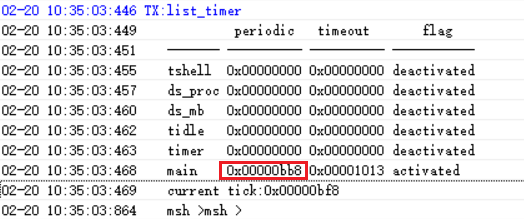

# 2 Timer-Related
## 2.1 Delay Functions
1. HAL-layer delay function: (equivalent to an instruction loop in a while loop; it does not switch to other threads during the delay)<br> 
```c
HAL_Delay(10); /* 延时10ms */
HAL_Delay_us(10); /* 延时10us */
```
2. RTT interface delay function:<br> 
When the RTT interface delay function executes, it switches to other threads, such as the ilde thread. When the sleep threshold is lower than the delay duration, it will enter Standby sleep.<br>
```c
rt_thread_delay(100); /* 延时100ms */
```
## 2.2 Obtaining the Timestamp, Tick Value, and RC10K Oscillation Frequency
1. Obtain the timestamp:<br> 
```c
/* 32768晶体时钟，会1/32768秒，寄存器值加1*/
/* RC10K时钟，会约1/9000秒，寄存器值加1*/
uint32_t start_time = HAL_GTIMER_READ(); 
```
2. Obtain the Tick value that increments every 1 ms:<br> 
```c
rt_tick_t start_timer = rt_tick_get(); /* RTT系统函数，1m秒返回值会加1 */
uint32_t tickstart = HAL_GetTick();  /* HAL层的函数，1m秒返回值会加1 */
```
3. Obtain the current clock frequency:<br> 
```c
/* 32768晶体时钟，会返回32768*/
/* RC10K时钟，会返回8k-10k之间的值*/
uint32_t mcuOscData = HAL_LPTIM_GetFreq(); 
```
## 2.3 Serial Port Command for Viewing Existing Timers
```c
list_timer
```
 <br><br> 
Description of the list_timer status:<br> 
The first column, "timer", is the timer name;<br> 
The second column, "periodic", is the timer period (hexadecimal, in ms);<br> 
The third column, "timeout", is the timestamp when the next timer expires;<br> 
The fourth column, "flag", indicates whether the timer is active,<br> 
As shown in the figure above, the only active timer is the "main" timer (the delay function is also a timer), and the wake-up period is 0xbb8 (3000ms).<br>
