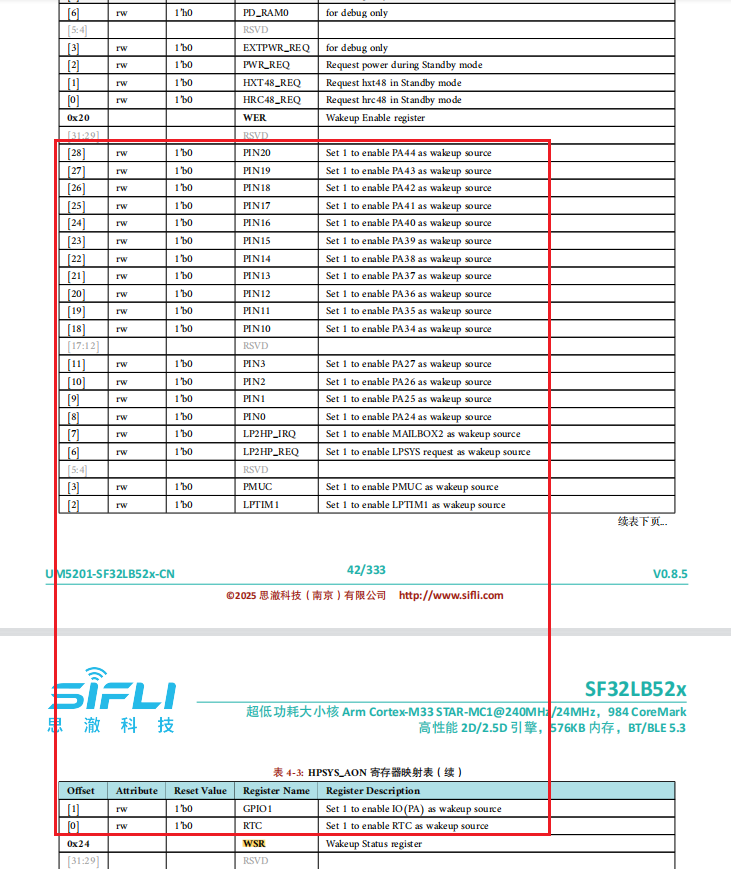

# 13 UART-Related
## 13.1 How to Wake Up the MCU Using UART RX
The following are the wake-up sources when the MCU is in sleep mode:
<br><br>  

If you want to wake up from Deep/Standby sleep mode, you can see that there is no UART wake-up function. Therefore, you need to configure UART RX as GPIO mode and then enable the wake-up function of this IO. Refer to the example `\example\rt_device\pm\project\hcpu`, as shown below:<br>

```c
HAL_PIN_Set(PAD_PA26, USART2_TXD, PIN_PULLUP, 1); //uart2 default setting
HAL_PIN_Set(PAD_PA27, USART2_RXD, PIN_PULLUP, 1); //uart2 default setting 

static void gpio_wakeup_handler(void *args)
{
    rt_kprintf("gpio_wakeup_handler!\n");
    HAL_PIN_Set(PAD_PA27, USART2_RXD, PIN_PULLUP, 1); //switch to uart function
    rt_pm_request(PM_SLEEP_MODE_IDLE); //set MCU not to sleep
}
#if defined(SF32LB52X)
{
    HAL_PIN_Set(PAD_PA27, GPIO_A27, PIN_PULLUP, 1); //set PA27 to GPIO funtion

    HAL_HPAON_EnableWakeupSrc(HPAON_WAKEUP_SRC_PIN3, AON_PIN_MODE_POS_EDGE); //Enable #WKUP_PIN3 (PA27)

    rt_pin_mode(27, PIN_MODE_INPUT);

    rt_pin_attach_irq(27, PIN_IRQ_MODE_RISING, (void *) gpio_wakeup_handler,\
                (void *)(rt_uint32_t) 27); //PA34 GPIO interrupt
    rt_pin_irq_enable(27, 1);
}
#endif
```
It is recommended to use an independent GPIO to wake up the MCU (most customers do this). If you want wakepin and uart rx2 to share the same GPIO, you need to do more software work as described above. UART data can be received only after wake-up is complete (when the [pm]W: print is seen), and the MCU must be kept awake until the RX operation is complete.<br>

## 13.2 Issue Where UART1 Does Not Enter the RX Interrupt Callback Function
Root cause:<br>
1. The UART FIFO has only one byte. If the system is busy, one byte is approximately 10 bits long, and 115200 requires approximately 1us. If the FIFO is not cleared within 1us after the interrupt is received, it will overflow;<br>
2. The USART1_IRQHandler interrupt can be entered, but because there is an error, there is no upper-layer callback. The upper-layer callback occurs only when data is received normally. Because Uart1 is used to control Bluetooth audio, changing it to Segger printing and system polling may cause the RX interrupt to not be cleared in time.<br>
Solution:<br>
Change to DMA RX interrupt.<br>
 rt_device_open(g_bt_uart, RT_DEVICE_FLAG_INT_RX);
Change to
 rt_device_open(g_bt_uart, RT_DEVICE_FLAG_DMA_RX);

 ## 13.3 How to Print Logs on UART Without Using rt_kprintf

1. rt_kprintf<br>
```c
rt_kprintf("app_cache_alloc: size %d failed!\n", size);
```
rt_kprintf printing is not affected by other switches and will always print. It is suitable for short-term debugging and can be deleted later. There must not be too many logs of this type, as they will affect system speed.<br>
2. Ulog printing<br>
Ulog printing can be output by level. When the level DBG_LEVEL is adjusted to DBG_ERROR, the lower-level `DBG_WARNING,DBG_INFO,DBG_LOG` messages will no longer be output.
```c
#define DBG_LEVEL          DBG_ERROR  // DBG_LOG //
#define LOG_TAG              "drv.it7259e"
#include <drv_log.h>
void init(void)
{
    LOG_D("it7259e touch_init\n");
}

```
3. Printing by operating UART registers<br>
In some scenarios, such as when the `bootloader` or the RTT operating system has not started yet, Log debugging is required. You can use the following method. The prerequisite is that hwp_usart1 has already been initialized. For the uart initialization method, refer to the example `example\uart\src`.
```c
char *boot_tag = "0x";
void boot_uart_tx(USART_TypeDef *uart, uint8_t *data, int len)
{
    int i;

    for (i = 0; i < len; i++)
    {
        while ((uart->ISR & UART_FLAG_TXE) == 0);
        uart->TDR = (uint32_t)data[i];
    }
}
void main()
{
    boot_tag = "tag0\n";
    boot_uart_tx(hwp_usart1, (uint8_t *)boot_tag, strlen(boot_tag));
}
```
