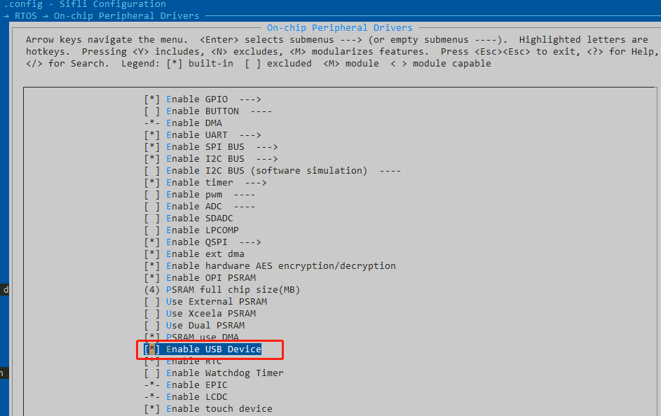
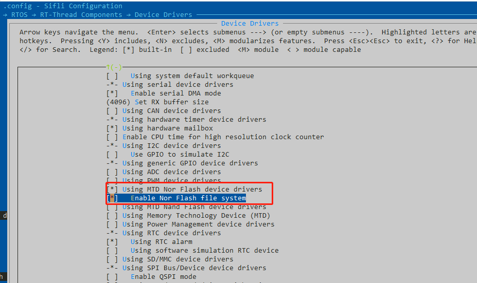
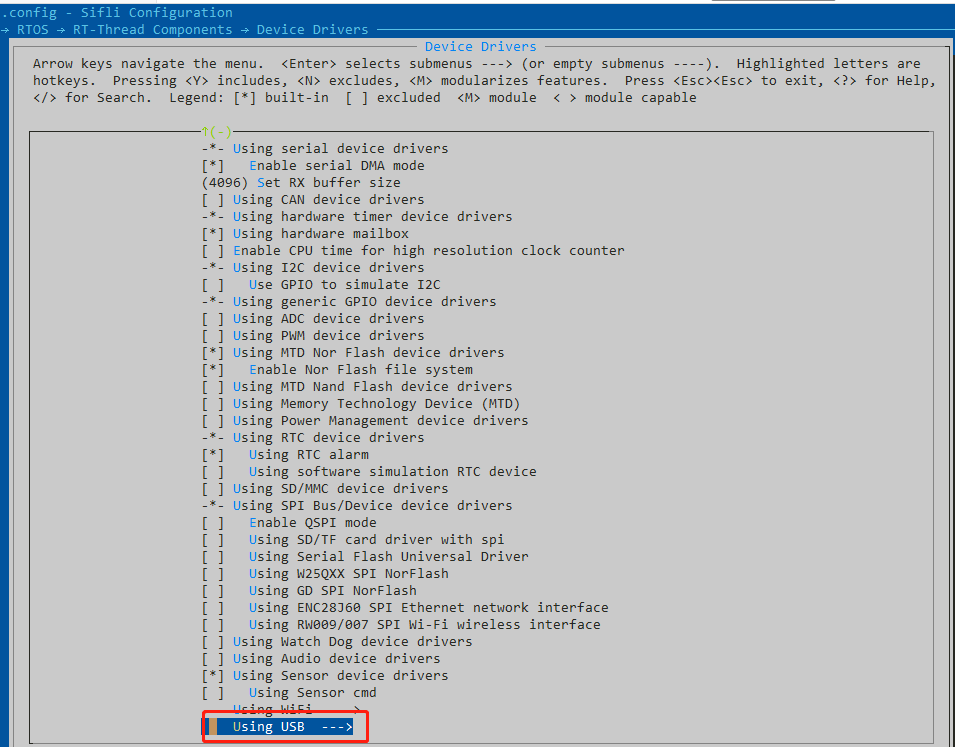
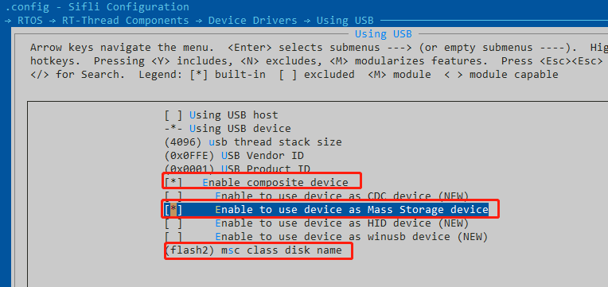

# 12 USB-Related
## 12.1 Using USB as Device Storage
usb can be used as a device storage function. That is, after the device is inserted into a PC, a USB drive can be seen on the PC, files can be copied, etc.<br>
1. You need to open menuconfig under the project and configure it as follows:<br>
Enable the usb device function:<br>
<br><br>   
Enable flash-related support and enable the flash file system:
<br><br>   
Enable the specific USB-related configuration:
<br><br>   
Perform detailed usb configuration, select Mass Storage device, and because flash1 space is small and also contains code, flash2 is usually selected as the USB drive space.
<br><br>   
After configuring the related definitions, compile the software. After downloading, connect the device to the pc through the usb port and power it on. You need to enter the command in the PC serial port:<br>
```
mkfs -t elm flash2    ---格式化
mountfs -t elm flash2 /  ---挂载
ls /dev      ---可以查看是否有usb的设备
mkdir abc    ---如果可以查看到usb设备，通过mkdir建立一个文件夹，可以在pc端看到U盘的图标，并且可以点击进入copy文件
```
PS: The SDK supports the device storage function. Related configuration is required, and customers also need to debug according to their own requirements. Sometimes the USB flash drive can only be seen after restarting and remounting.
