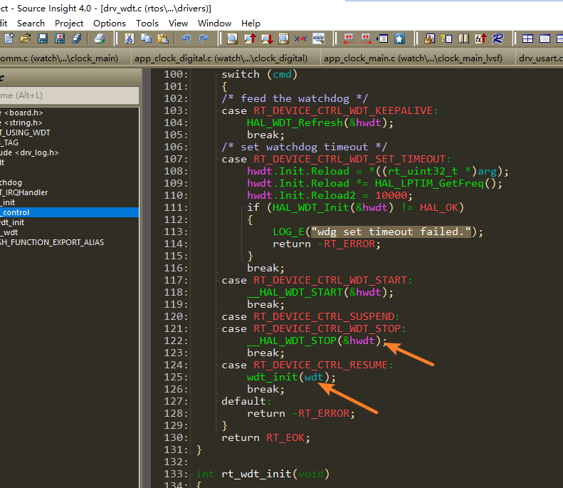

# 4 Watchdog-Related
## 4.1 WDT Watchdog Status After Standby
<br><br>   
In the code above, in the current SDK, after entering standby, the watchdog is not powered off, but the code stops the wdt. No matter how long it sleeps, the watchdog will not take effect and cause a reset.<br> 
Waking up from standby will go through the resume case, which will reinitialize the wdt, equivalent to restarting the count.<br> 

## 4.2 Method for Disabling WDT with J-Link
1. Scenario 1: If both Hcpu and Lcpu have enabled the watchdog and the device repeatedly restarts, making it impossible to dump memory to locate the issue, you can use jlink to disable the watchdog, 
Execute:<br> 
```
tools\segger\halt_all_cpu_and_disable_all_wdt_a0.bat
```
This will disable the WDT of hcpu and lcpu, and halt both CPUs, making it convenient to dump memory.<br> 
2. Scenario 2: If you only want to disable the Hcpu log and allow Hcpu to continue running<br> 
Modify the command contents in halt_all_cpu_and_disable_all_wdt_a0.jlink corresponding to halt_all_cpu_and_disable_all_wdt_a0.bat as follows:<br> 
```
connect #连接jlink
w4 0x4004f000 0 #jlink切到Hcpu
connect #连接jlink
h #halt hcpu
w4  0x40014018  0x51ff8621
w4  0x4001400C  0x34
w4  0x40014018  0x58ab99fc
w4  0x4007c018  0x51ff8621
w4  0x4007c00C  0x34
w4  0x4007c018  0x58ab99fc
g #上面操作完WDT寄存器后，go，继续运行Hcpu
exit
```
3. Scenario 3: If you only want to disable the Lcpu log and let Lcpu continue running, you can extract part of the commands in halt_all_cpu_and_disable_all_wdt_a0.jlink and make slight modifications.<br> 
```
connect
w4 0x4004f000 1
connect
w4 0x40070000 0 
h
w4  0x40055018  0x51ff8621
w4  0x4005500C  0x34
w4  0x40055018  0x58ab99fc
g
exit
```
## 4.3 Where WDT Is Cleared
1. The rt_hw_watchdog_init initialization function registers rt_hw_watchdog_pet as a hook function through rt_hw_watchdog_hook;<br> 
2. When the system has no tasks to process and enters the idle thread rt_thread_idle_entry, it executes the hook function registered in idle_hook_list above;<br> 
```c
__ROM_USED void rt_hw_watchdog_init(void)
{
    extern int rt_wdt_init(void);
    rt_wdt_init();
    wdt_dev = rt_device_find("wdt");
    if (wdt_dev)
    {
        rt_err_t err = rt_device_open(wdt_dev, RT_DEVICE_FLAG_RDWR);
        if (err == RT_EOK)
        {
            uint32_t count = WDT_TIMEOUT;
            rt_device_control(wdt_dev, RT_DEVICE_CTRL_WDT_SET_TIMEOUT, &count);
        }
    }
    rt_hw_watchdog_hook(1); //注册wdt钩子函数后，会在idle线程自动清狗
}

__ROM_USED void rt_hw_watchdog_pet(void) //手动清狗函数，可以调用此函数
{
    if (wdt_dev)
    {
        rt_device_control(wdt_dev, RT_DEVICE_CTRL_WDT_KEEPALIVE, NULL);
    }
}

```
