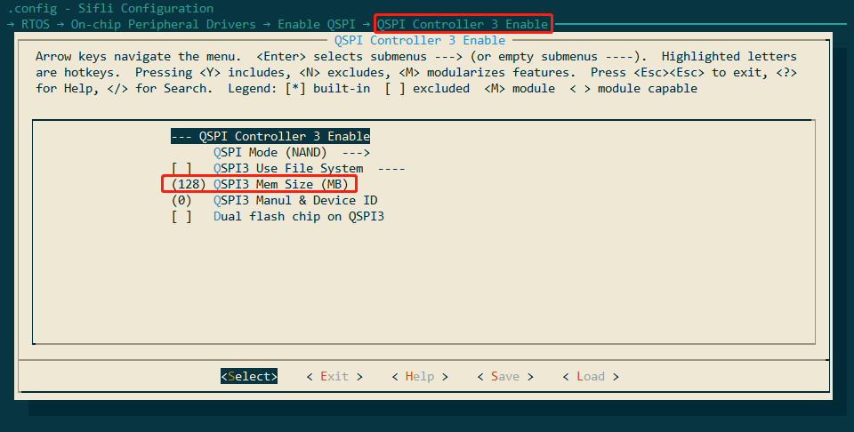
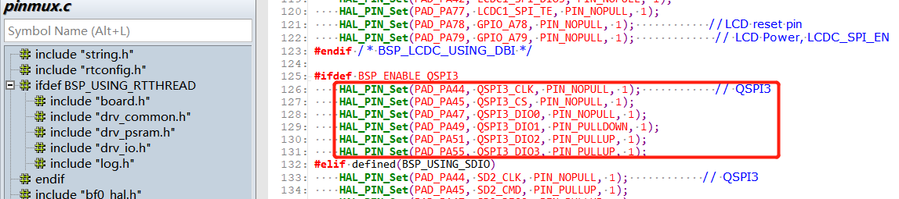
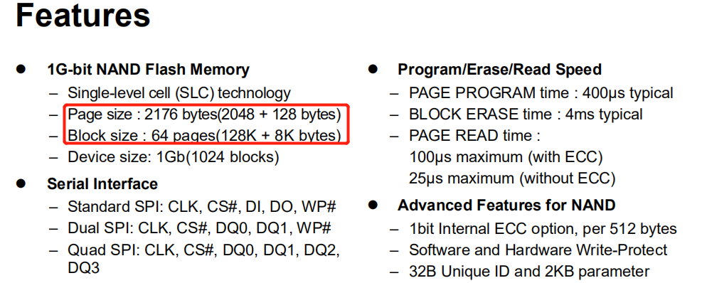
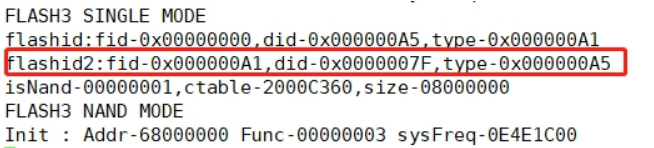
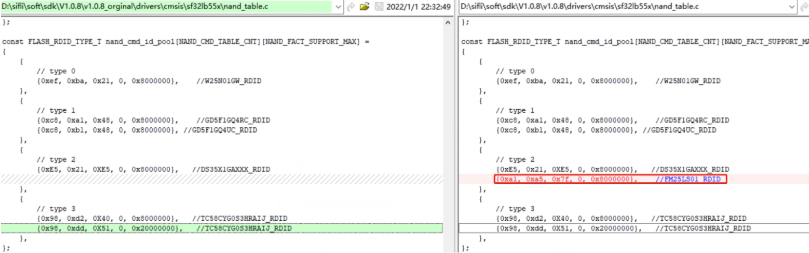
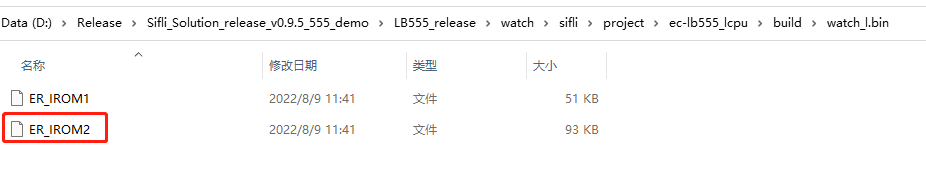

# 3 Common Flash Debugging Issues
## 3.1 SF32LB551 Flash3 Debugging Process for Nand Flash?
SF32LB551 Flash3 is connected to QSPI3. Notes for debugging Nand flash:<br> 
1. Ensure QSPI Controller 3 Enable is enabled, and set the memory size correctly,
The following figure shows 128MB (1G bit/)
<br><br>  
2. Because QSPI3 occupies PA49 and PA51, the hcpu log must be changed to segger output. For the specific method, refer to 2.2.1.<br> 
3. Check the mode settings of PA44, PA45, PA47, PA49, PA51, and PA55 used by QSPI3 as follows, confirm that these Pins are not used elsewhere. To confirm, on the Hcpu shell platform, use the command pin status 44 to check whether each pin status is set correctly.
<br><br>    
4. Enable the macro #define DRV_SPI_FLASH_TEST to support spi_flas shell commands for testing flash read/write.<br> 
5. Use the following commands to test whether Flash read/write is correct.<br> 
For specific commands, refer to the function int cmd_spi_flash(int argc, char *argv[])<br> 
```
spi_flash -id 0 2 /*显示flash3的ID，读操作发生在开机初始化，需要上电抓波形 */
spi_flash -read 0 2048 2 /*从flash3 十进制0的地址，读取2048个byte数据*/
spi_flash -read 4096 4096 2 /*从flash3 十进制4096的地址，读取4096个byte数据*/
spi_flash -write 4096 4096 0 2 /*从flash3 十进制地址4096，写4096个byte数据*/<
spi_flash -erase 0x20000 0x20000 2 /*从flash3 十六进制0x20000的地址，擦除0x20000个byte数据，注意只能按块擦除，地址和大小只能0x20000倍数 */<br> 
```
**Note:**<br> 
Today's NAND Flash read/write operations must be performed by page, but erasing must be done by block size, as shown in the following figure:  
<br><br>      
Each page has 2176 units, so each page is 2048Byte + 128Byte (SA).<br> 
Each Block consists of 64 pages, so the capacity of each Block is 2048x64=131,072 (0x20000), that is, 131,072Byte + 8KByte (SA).<br> 
6. Since the new flash is not in the nand_cmd_id_pool list, using the spi_flash -id 0 2 command to read the ID of flash3 will return 0xff.<br> 
Note: If you use a logic analyzer to capture the timing for reading the ID, you need to capture it during power-on. The ID read operation occurs during power-on.<br> The spi_flash -id 0 2 command only prints the ID read during power-on initialization.<br> 
7. The ID read back by the spi_flash -id 0 2 command is as follows:<br> 
```
 msh >spi_flash -id 0 2
 spi_flash -id 0 2
 rt_flash_read_id_addr: 0x68000000,id:2,value:7fa5a1
 ```
The new jlink elf driver currently adds a log for printing the ID in uart3 when downloading to address 0x68000000,<br> as shown in the following figure:
<br><br>   
Add the corresponding group to the nand_cmd_id_pool list in nand_table.c according to the command method, as shown below:
<br><br>   
{0xa1, 0xa5, 0x7f, 0, 0x8000000}, //FM25LS01_RDID<br> 
If the command is the same as the type2 command, read/write can work normally. Usually, after modifying the nand_cmd_id_pool and nand_cmd_table_list in the nand_table.c file,<br> read, erase, and write operations can be performed.<br> 
8. If, among the 4 Types, the timing captured by the logic analyzer is inconsistent with all sets of type timing for the Nand Flash being debugged, you need to define another Type to send the timing.<br> 

## 3.2 SF32LB555 LCPU Flash4 Mounting Process
Take the \watch\sifli\project\ec-lb555_lcpu project for the A3 chip supporting mounting flash4 as an example. Refer to the attached differential package below; all related modification diffs have been added:<br> 
You need to remove the flash-related functions from the relevant rom lib under \middleware\sifli_lib\lib (sifli_rom_a3.lib for the A3 chip, and sifli_rom.lib for other versions A0\A1\A2). Do not use the functions in rom; use the functions in the code. The rom lib files in customers' hands may have different versions, so the FLASH-related functions inside need to be checked carefully.<br> 
Modify the bf0_pm_a0.c file under \middleware\system.<br> 
Modify the drv_spi_flash.c file under \rtos\rtthread\bsp\sifli\drivers.<br> 
Modify the<br> link_lcpu_ram.sct partition file under \watch\sifli\project\ec-lb555_lcpu\linker_scripts, and place some algorithms into flash4.<br> 
Modify the menuconfig of \watch\sifli\project\ec-lb555_lcpu to enable QSPI FLASH4 support.<br> 
Modify the postbuild.bat file under \watch\sifli\project\ec-lb555_lcpu to add the new compiled file bin.<br> 
Modify the SConstruct file under \watch\sifli\project\ec-lb555_lcpu to add the new compiled file bin.<br> 
PS: During compilation, you need to manually delete the build under ec-lb555_lcpu. If a bin<br> file already existed previously, compilation may fail. After compilation succeeds, check whether the ER_IROM2 file has been added under<br> \watch\sifli\project\ec-lb555_lcpu\build\watch_l.bin:<br> 
<br><br>   

## 3.3 Interface for Reading SN/MAC in Flash
SN and MAC are written into the device when the production line downloads the version, and are saved in TLV format,
TLV is a commonly used data encoding format. It consists of three parts: Tag (Type), Length (Length), and Value (Value), that is, arranged as ID+LEN+DATA.<br>
For the data format, refer to the chapter:
[5.6 Method for Viewing OTP/Flash Data in the 55X Chip Factory Calibration Area](../tools/sifli.md#5655X查看芯片工厂校准区OTP)

type |length| value
:--|:--|:--
1byte| 1byte| <=256byte

The type number of SN is: FACTORY_CFG_ID_SN, and the corresponding value is 2.<br>
value composition: descriptor + serial number (8byte), for example: sifli_00000001<br>
Example code for obtaining sn:<br>
```c
{
int res = 0;
char sn[300] = {0};
res = rt_flash_config_read(FACTORY_CFG_ID_SN, (uint8_t) *)&sn[0], 256);
} 
rt_flash_config_read(FACTORY_CFG_ID_SN, (uint8_t *)mac, sizeof(mac));
//获取MAC地址方法
rt_flash_config_read(FACTORY_CFG_ID_MAC, (uint8_t *)&mac[0], 6);
```
<a name="34Flash下载驱动对应关系"></a>
## 3.4 Flash Download Driver Mapping

**Uart download driver file** <br>
The Uart download driver file is a *.bin file, as follows:<br>
ram_patch_52X.bin -- Driver corresponding to 52X internal or external Nor Flash<br>
ram_patch_52X_NAND.bin  -- Driver used for 52X external Nand Flash/when the serial port baud rate is lower than 6M<br>
ram_patch_52X_NAND_6M.bin -- Driver used for 52X external Nand Flash/when the serial port baud rate is equal to 6M<br>
ram_patch_52X_NAND_8M.bin -- Driver used for 52X external Nand Flash/when the serial port baud rate is equal to 8M<br>
ram_patch_52X_NAND_NOBBM.bin -- Driver corresponding to 52X external Nand Flash without using BBM (without creating a bad block management area, Bad Block Manage)<br>
ram_patch_52X_SD.bin -- Download driver corresponding to sd-nand/sd-emmc on the sdio interface<br>
- The correspondence between IImpeller download selections and bin files is shown in the configuration in `Impeller.ini`
```ini
[UART_DRIVER]
SF32LB55X=ram_patch.bin
SF32LB55X_SD=ram_patch_SD.bin
SF32LB56X=ram_patch_56X.bin
SF32LB56X_NAND=ram_patch_56X_NAND.bin
SF32LB56X_SD=ram_patch_56X_SD.bin
SF32LB52X=ram_patch_52X.bin
SF32LB52X_NAND=ram_patch_52X_NAND.bin
SF32LB52X_SD=ram_patch_52X_SD.bin
SF32LB58X_NAND=ram_patch_58X_NAND.bin
SF32LB58X=ram_patch_58X.bin
SF32LB58X_SD=ram_patch_58X_SD.bin

[UART_DRIVER_8M]
SF32LB56X_NAND=ram_patch_56X_NAND_8M.bin
SF32LB52X_NAND=ram_patch_52X_NAND_8M.bin
SF32LB58X_NAND=ram_patch_58X_NAND_8M.bin
```
**Jlink download driver file** <br>
The Jlink download driver file is a *.elf file.<br>
It is located in the Jlink installation directory `C:\Program Files\SEGGER\JLink\Devices\SiFli` or `C:\Users\yourname\AppData\Roaming\SEGGER\JLinkDevices\Devices\SiFli`. Open the `cmd.exe` command-line window and enter `jlink.exe`; this is the Jlink used by the Windows system variable configuration. Impeller uses this default Jlink version.
- The mapping of J-Link flashing drivers is shown in the configuration file `JLinkDevices.xml`<br>
```xml
  <Device>
    <ChipInfo Vendor="SiFli" Name="SF32LB52X_NOR" Core="JLINK_CORE_CORTEX_M33" WorkRAMAddr="0x20000000" WorkRAMSize="0x60000" />
    <FlashBankInfo Name="Internal Flash1" BaseAddr="0x10000000" MaxSize="0x8000000"  Loader="Devices/SiFli/SF32LB52X_INT_FLASH1.elf" LoaderType="FLASH_ALGO_TYPE_OPEN" AlwaysPresent="1"/>
    <FlashBankInfo Name="External Flash2" BaseAddr="0x12000000" MaxSize="0x8000000" Loader="Devices/SiFli/SF32LB52X_EXT_FLASH2.elf" LoaderType="FLASH_ALGO_TYPE_OPEN" AlwaysPresent="1"/>
  </Device>
 
  <Device>
    <ChipInfo Vendor="SiFli" Name="SF32LB52X_NAND" Core="JLINK_CORE_CORTEX_M33" WorkRAMAddr="0x20000000" WorkRAMSize="0x80000" />
    <FlashBankInfo Name="External Nand2" BaseAddr="0x62000000" MaxSize="0x3e000000" Loader="Devices/SiFli/SF32LB52X_EXT_NAND2.elf" LoaderType="FLASH_ALGO_TYPE_OPEN" AlwaysPresent="1"/>
  </Device>
```
**uart_download.bat download driver**<br>
When running the batch file `uart_download.bat` in the SDK, the Flash download driver used is `
\tools\uart_download\ImgDownUart.exe` file. This serial port driver is integrated in `ImgDownUart.exe`. In the current version, the driver has not been separated out, so the programming driver cannot be modified by users.
