# 1 Common LCD Debugging Issues
## 1.1 Green Stripe on the Right Side of the LCD Display
As shown in the following figure:<br>
<br>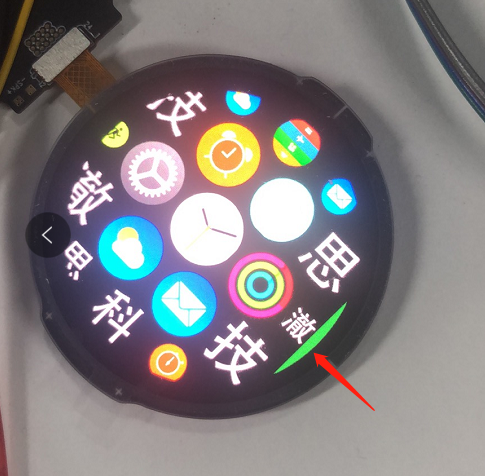<br> 
Confirm the modifications according to the following figure:<br>
<br>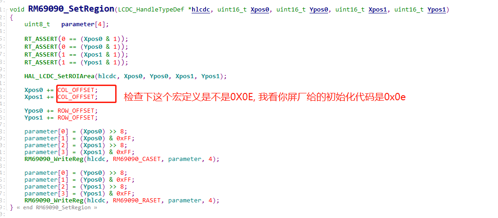<br> 

## 1.2 Distorted LCD Display
Debug method, as shown below:
<br>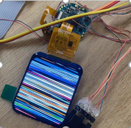<br>   
1. After jlink is connected, type h to stop the cpu.<br>
2. In the cmd window, go to this directory and execute \release\tools\crash_dump_analyser\script\save_ram_a0.bat to save the memory information.<br>
3. The dumped memory information is as follows:<br>
<br>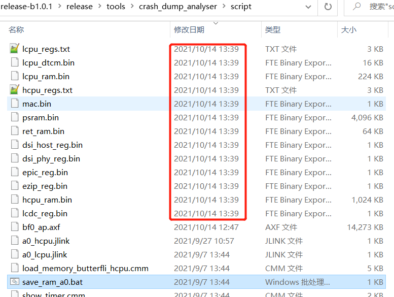<br> 
4. Run the release\tools\crash_dump_analyser\simarm\t32marm.exe tool to restore the hcpu context, and select load_memory_butterfli_hcpu.cmm to perform the restore operation.<br>
<br>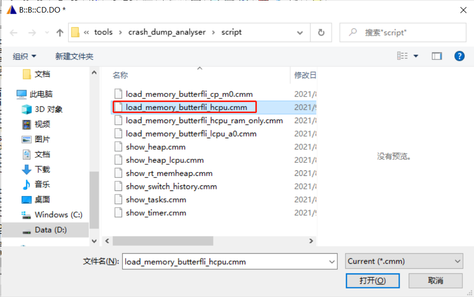<br>
Then, when it pops up again and asks you to select the bin at address 0x20000000, select hcpu_ram.bin.<br>
<br>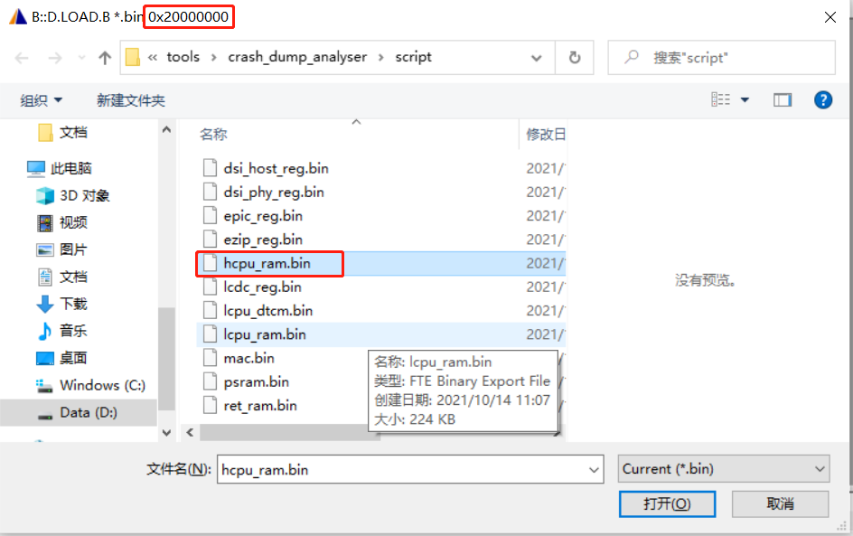<br> 
When it pops up and asks you to select the bin at address 0x60000000, select psram.bin, as shown in the following figure:<br>
<br>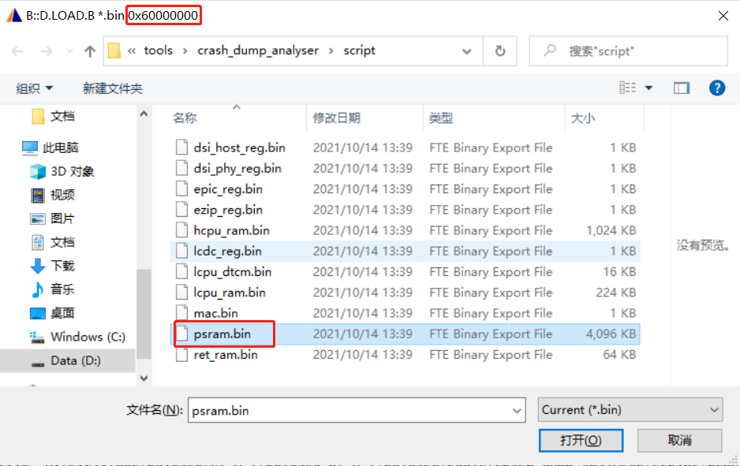<br> 
When it pops up and asks you to select the *.axf file, select the compiled hcpu *.axf file.<br>
The corresponding path for the Wachdemo project is: example\watch_demo\project\ec-lb551\build\bf0_ap.axf<br>
As shown in the following figure:<br>
<br>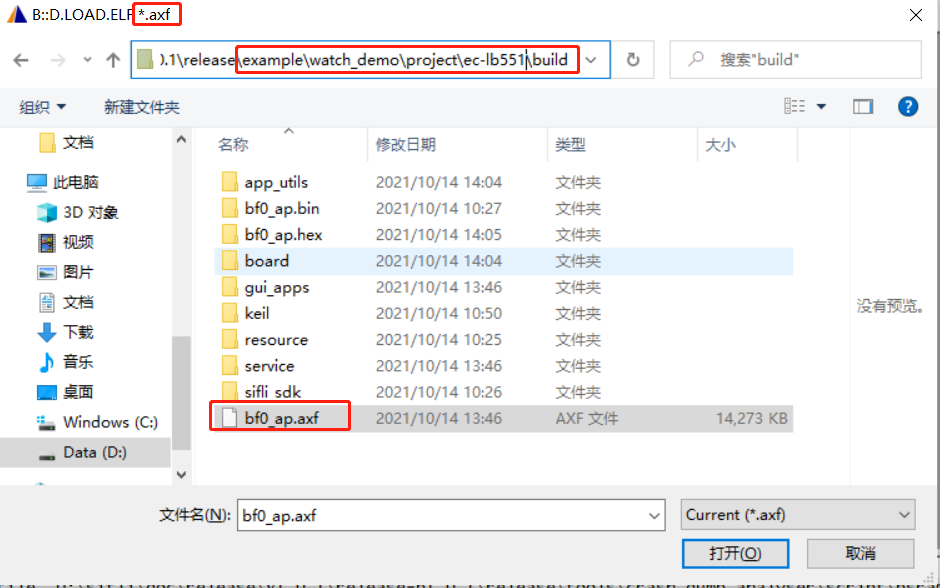<br> 
After restoring the context, open the Var->watch window, enter the drv_lcd variable to search for, and then add it to the watch window for viewing.<br>
<br>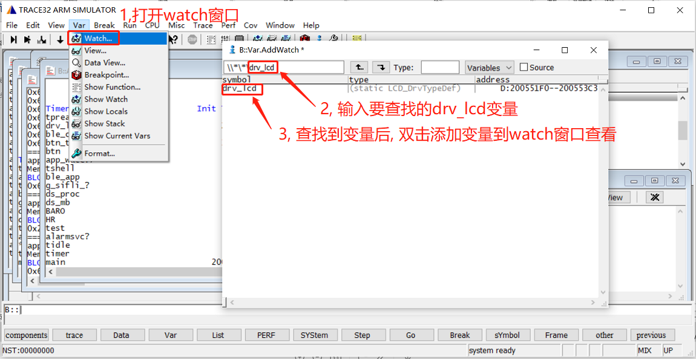<br> 
Expand the drv_lcd variable in the watch window and you will find that the window size configured for the LCD does not match the LCD driver.<br>
<br>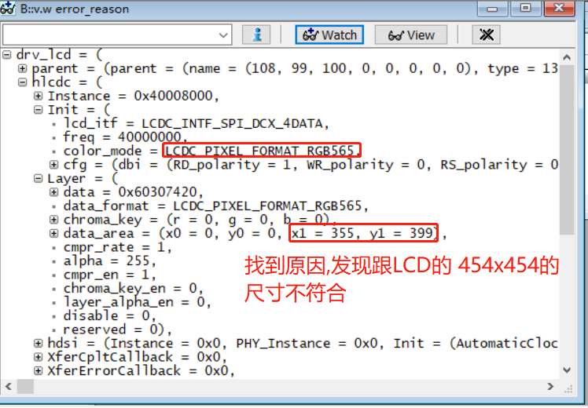<br> 
After modifying the configuration in the rtconfig.h file, the screen corruption issue is resolved.<br>
```c
#define LCD_HOR_RES_MAX 454
#define LCD_VER_RES_MAX 454
```
The corresponding macros for the littleVGL display setting registers also need to be changed to match the LCD size.<br>
```c
#define LV_HOR_RES_MAX 454
#define LV_VER_RES_MAX 454
#define LV_DPI 315
#define LV_FB_LINE_NUM 454
```

## 1.3 First Frame Distortion on TFT Display During Power-On or Wake-Up
Screen corruption occurs when the display is turned on and the data in the screen GRAM is incorrect. From the boot display logic,<br>
data should be sent first, then display_on should be performed on the chip, and then the backlight should be turned on. If the sequence is wrong, the first frame will be corrupted. You can also send a black screen after initialization is complete. If the screen driver IC supports writing a register to make the output black, use the method of writing the screen register first.<br>
Alternatively, use the following method:<br>
Refer to the method used by the SPD2012 driver in the code. Before turning on the screen, first send black screen data through the LCDC background to clear the GRAM inside the screen.<br>
<br>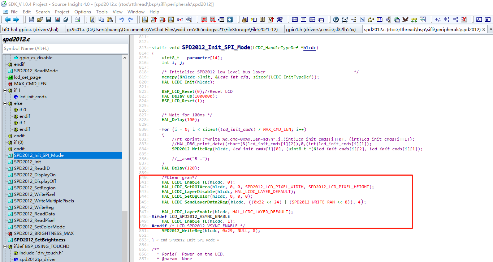<br> 

## 1.4 Display Does Not Light Up Even Though Initialization Read/Write Operations Are Normal
For each screen IC, the delay between power-on and register initialization varies. If the delay from screen power-on in the BSP_Power_Up function to LCD register initialization init is insufficient, the registers cannot be configured during initialization, causing the LCD driver to fail to start.<br>
Solution:<br>
Then, at the beginning of LCD register initialization init, add a certain delay according to the requirements of the screen driver IC.<br>
<br>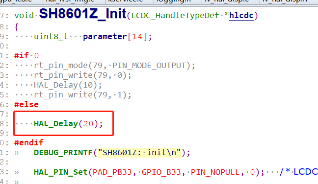<br>  
The following lists the three delay durations that need attention during screen initialization. If the delays are too long, the screen will light up more slowly. When reducing the delays, be sure to follow the screen IC datasheet.<br>
```c
static void SPD2010_Init_SPI_Mode(LCDC_HandleTypeDef *hlcdc)
{
    uint8_t   parameter[14];
    int i, j;

    memcpy(&hlcdc->Init, &lcdc_int_cfg, sizeof(LCDC_InitTypeDef));
    HAL_LCDC_Init(hlcdc);

    BSP_LCD_Reset(0);//Reset LCD
  	rt_thread_delay(1);  //依据屏驱IC规格书配置此延时
    BSP_LCD_Reset(1);

    /* Wait for 50ms */
    rt_thread_delay(50); //依据屏驱IC规格书配置此延时

    for (i = 0; i < sizeof(lcd_init_cmds) / MAX_CMD_LEN; i++)
    {
        SPD2010_WriteReg_I(hlcdc, lcd_init_cmds[i][0], (uint8_t *)&lcd_init_cmds[i][2], lcd_init_cmds[i][1]);
		HAL_Delay_us(10);
    }
	rt_thread_delay(50); //依据屏驱IC规格书配置此延时
	
  SPD2010_WriteReg(hlcdc, 0x29,(uint8_t *)NULL, 0);

}
```

## 1.5 How to Export from the Framebuffer to Check Whether the Image Is Normal?
a. Find the address of the buf1_1 global variable from the *.map file in the build directory, as shown in the following figure:<br>
Alternatively, the address of the buf1_1 global variable can also be found in Ozone.<br>
<br>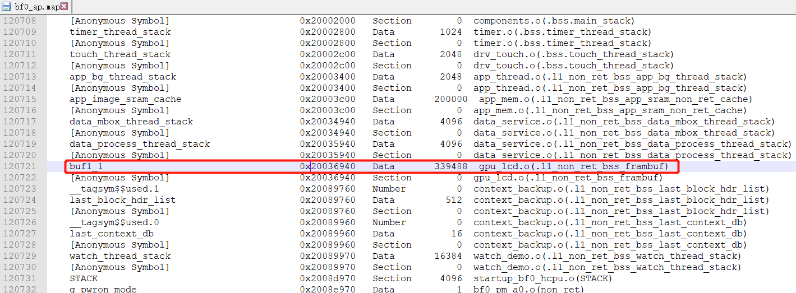<br> 
b. Use jlink to save the memory values as a bin file.<br>
savebin <path> <address> <length><br>
For example: savebin D:\sifli\customer\weizhang\lcd\1.bin 0x20036940 0x52e20<br>
This panel uses rgb565 format, which occupies 2 bytes. With a 412x412 resolution, the length is 412x412x2=339488=0x52E20<br>
c. Use the Python tool tools\bin2bmp\bin2bmp.py to convert the bin file to bmp image format.<br>
The command is as follows: <br>
Old command:<br>
python bin2bmp.py <file path> <screen height> <screen width> <bits per pixel> <bin offset address><br>
For example: for a 412x412 panel, 1.bin is saved from the base address, so no offset is required.<br>
```
python bin2bmp.py 1.bin 412 412 16 0
```
New command:<br>
python bin2bmp.py <file path> <color format> <screen height> <screen width> <bin offset address>
```
python bin2bmp.py 1.bin rgb565 412 412 0
```
Supported color formats: a8/rgb565/rgb888/argb8888/rgba8888<br>
d. The jlinkbin2bmp.py script has been added. When jlink is connected, it can export a bmp image in one step from savebin to conversion, using the following command:<br>
```
 python jlinkbin2bmp.py SF32LB55X rgb565 412 412 2004E3E0
```
e. For the latest usage instructions, refer to the tools\bin2bmp\readme.txt file.<br>

## 1.6 Common Assert Crashes in the LCD Driver
 Assert occurs:<br>
 ```
 Assertion failed at function:async_send_timeout_handler, line number:876 ,(0) 
```
<br>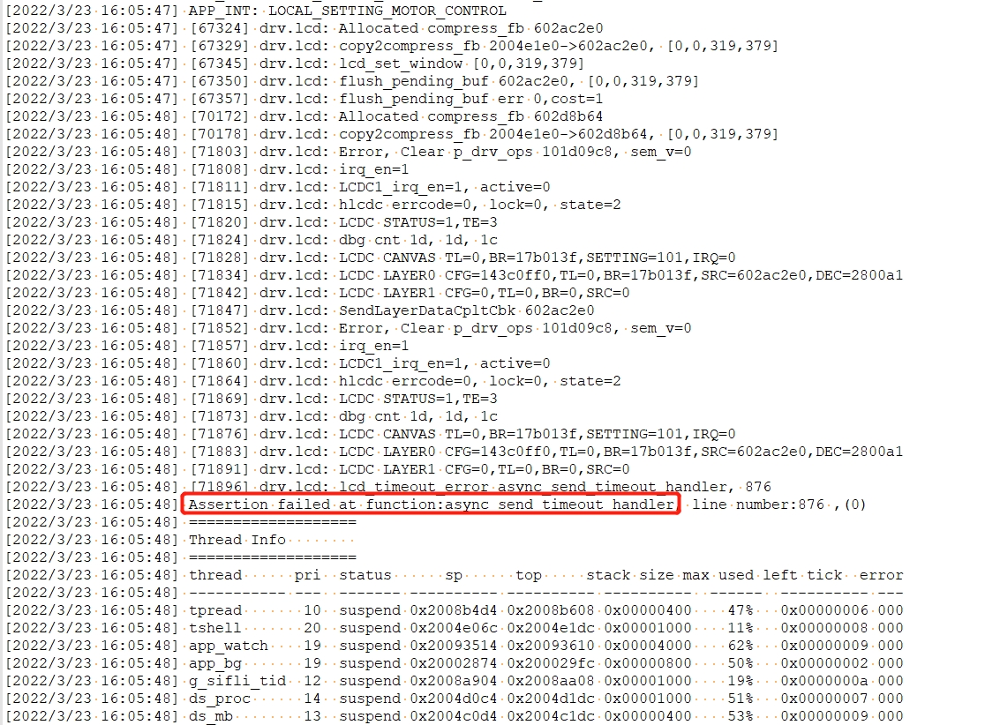<br> 
Root cause:<br>
The macro LCD_GC9B71_VSYNC_ENABLE is enabled, which enables the TE function. After the LCD sends data, it waits for the TE signal before refreshing the screen. The LCD TE signal never arrives, causing a timeout Assert.<br>
Common case 1:<br>
This assert occurs during the OTA process because the default IO for the motor is PA44, while in this project PA44 is the lcd reset signal. Entering dfu starts the motor, causing the LCD to be reset unexpectedly. The LCD then no longer outputs a TE signal, and the system crashes when dfu refreshes the screen.<br>
Common case 2:<br>
Crash when waking by key after the screen is turned off<br>
The symptom is that after the screen is turned off, pressing a key to wake it up causes an assert, and the system stops at the assert while waiting for TE during screen refresh.<br>
Root cause:<br>
After initializing the LCD panel, the initialization delay inside TP is too long, with a 100ms delay. The customer uses the rt_thread_mdelay(100); delay function, during which Hcpu enters the IDLE process and goes to sleep.<br>
After the timer expires, it wakes up from standby. At this point, the LCD has been powered off and has not been initialized, so there is no TE signal. The previous screen refresh then continues, causing a crash.<br>
Solution:<br>
In the driver, do not use the rt_thread_mdelay(10); delay function.<br>
Use the following instead: HAL_Delay(100); or HAL_Delay_us(10); functions.<br>
The rt_thread_mdelay function performs a thread switch. After switching to the Idle process, the system goes to sleep.<br>
The HAL_Delay function is a busy-wait loop and will not switch to the Idle process.<br>

## 1.7 LCD Distorted Display and Frozen Display Issues During ESD Testing
Solution approach: Determine whether the display is normal using the TE output signal or register values of the display driver IC. If it is abnormal, reinitialize the LCD.<br>
1. If there is no TE signal output when the LCD display is corrupted or stuck and the system crashes,<br>
Solution:<br>
In the drv_lcd.c file, in the TE wait timeout function async_send_timeout_handler:<br>
Use the code in the red box below to reinitialize the LCD:<br>
```c
    drv_lcd.assert_timeout = 3; //配置刷屏超时情况下是assert、不做操作还是重初始化LCD
```
<br>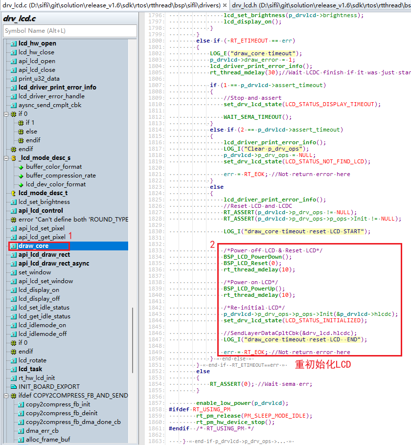<br> 
2. If there is TE signal output when the LCD display is corrupted, the LCD register values need to be read to determine the corrupted-display state.<br>
Solution:<br>
- Follow solution 1 above to first enable the display-refresh timeout code for reinitializing the LCD.<br>
- In the XXXX_WriteMultiplePixels screen-send function of the LCD driver,<br>
add reading of the LCD register values. If an incorrect register value is found, return without refreshing the screen.<br>
At this time, because the screen-send operation is not executed, the screen refresh enters RT_ETIMEOUT. The LCD is reinitialized according to the `drv_lcd.assert_timeout` configuration, as shown below:<br>
The LCD registers are checked 3 times. If the register values are incorrect all 3 times, the LCD is considered abnormal, and the function returns to trigger a screen-refresh timeout and reinitialize the LCD.<br>
<br>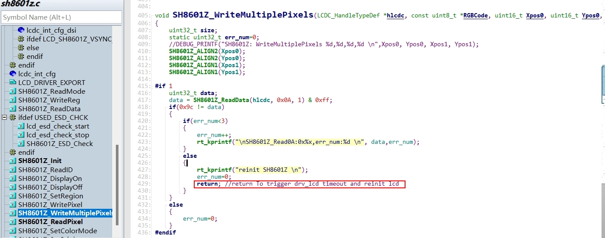<br>  
```c
void SH8601Z_WriteMultiplePixels(LCDC_HandleTypeDef *hlcdc, const uint8_t *RGBCode, uint16_t Xpos0, uint16_t Ypos0, uint16_t Xpos1, uint16_t Ypos1)
{
    uint32_t size;
	static uint32_t err_num=0;
	//DEBUG_PRINTF("SH8601Z: WriteMultiplePixels %d,%d,%d,%d \n",Xpos0, Ypos0, Xpos1, Ypos1);
    SH8601Z_ALIGN2(Xpos0);
    SH8601Z_ALIGN2(Ypos0);
    SH8601Z_ALIGN1(Xpos1);
    SH8601Z_ALIGN1(Ypos1);
    uint32_t data;
    data = SH8601Z_ReadData(hlcdc, 0x0A, 1) & 0xff;
	if(0x9c != data)
	{
		if(err_num<3)
		{
			err_num++;
			rt_kprintf("\nSH8601Z_Read0A:0x%x,err_num:%d \n", data,err_num);
		}
		else
		{
			rt_kprintf("reinit SH8601Z \n");
			err_num=0;
			return; //return To trigger drv_lcd timeout and reinit lcd
		}
	}
	else
	{
		err_num=0;
	}
    HAL_LCDC_LayerSetData(hlcdc, HAL_LCDC_LAYER_DEFAULT, (uint8_t *)RGBCode, Xpos0, Ypos0, Xpos1, Ypos1);
    HAL_LCDC_SendLayerData2Reg_IT(hlcdc, SH8601Z_WRITE_RAM, 1);
}
```

## 1.8 Distortion in Power-On/Power-Off Animation or Charging Image Display
The display abnormality is shown below:<br>
<br>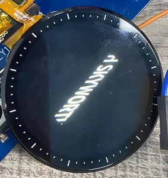<br>  
<br>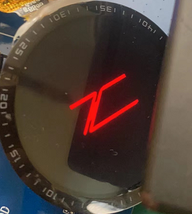<br>  
Root cause:<br>
This is a pixel alignment issue. A multiple of 4 pixels must be sent to the panel. As shown in the datasheet of the panel driver IC below, the number of pixels sent to the panel must be a multiple of 4:<br>
<br>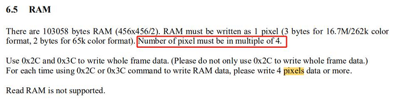<br>  
Solution:<br>
1. Modify the image: Ensure that images sent to the full screen, such as the boot animation and charging images, have an even-numbered resolution. For example, the size shown below is 161x80. After correcting it to 160x80, the image distortion issue is resolved.
<br>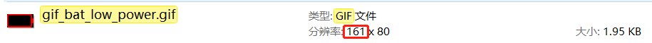<br>  
2. In the code, align to 4 pixels. For example, if the image above is 161x80, change it to 164x80 and fill the additional 3 pixels with the background color.<br>
Alternatively, drop one pixel to make it 160x80.<br>

## 1.9 Issue Where Display QSPI Cannot Read the Display ID
Currently, for 55x and 56x series chips, the QSPI of the display driver only supports reading QSPI/SPI data from IO0 and does not support reading SPI data output from IO1. The display ID is output from IO1, which is not supported (52x series chips support configuring any IO from IO0 to IO3 for reading), as shown below:
<br>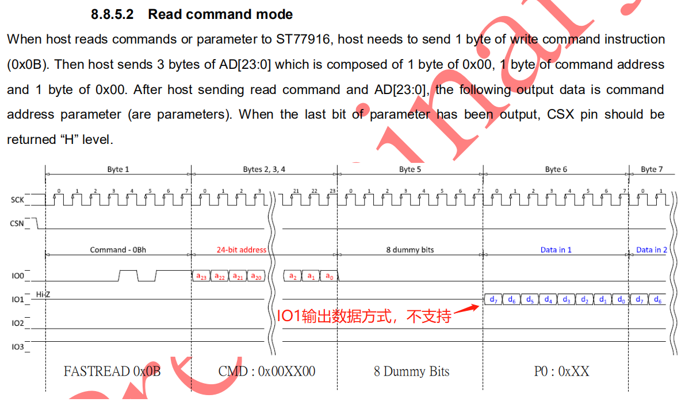<br>  
Output through Interface-II mode is not supported, as shown below:<br>
<br>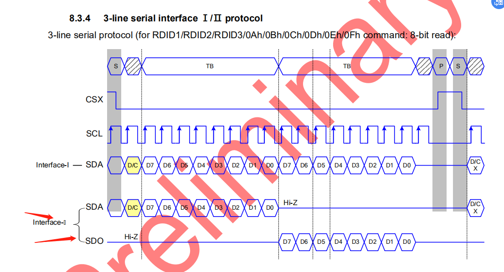<br>  
The panel ID output from IO0 is supported, as shown below:<br>
<br>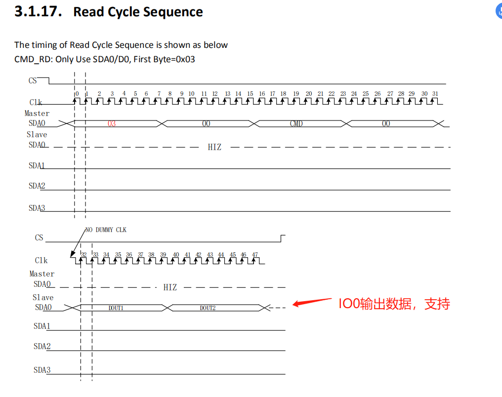<br>  
Solution:<br>
GPIO-simulated SPI reading chipid<br>

**Note:**
Currently, 52x series chips already support reading and writing QSPI/SPI data through any data line from IO0-IO3 of the panel driver's QSPI interface.<br>
The configuration method is as follows:<br>
```c
.readback_from_Dx= 0,  /* 0对应IO0,  1对应IO1,  2对应IO2,  3对应IO3,*/
```
<br>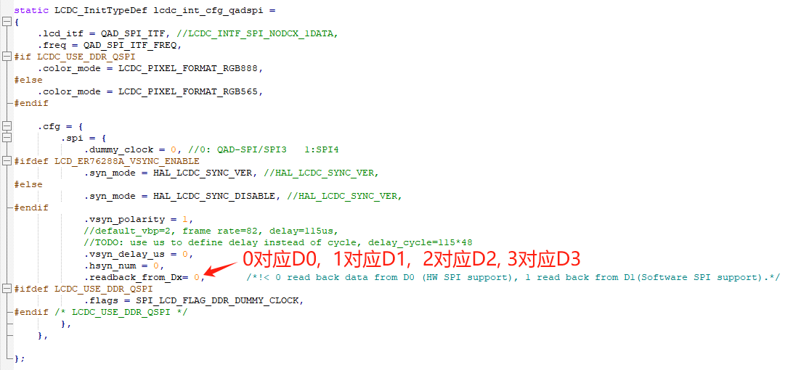<br> 

## 1.10 Dynamically Adjusting the CLK Rate for Display QSPI Register Read/Write Operations
For some panel driver ICs, there is an upper limit requirement on the CLK frequency for register read/write during initialization. For example, it cannot exceed 20Mhz, while screen sending can reach 50Mhz. This can be modified as follows:<br>
The default screen-send frequency is .freq = 48000000, //48Mhz<br>
<br>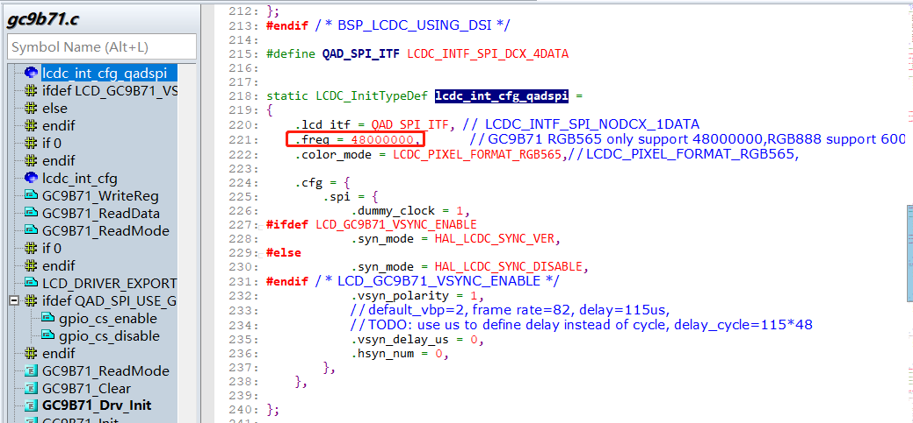<br> 
When reading registers, change it to 2Mhz, as follows:<br>
<br>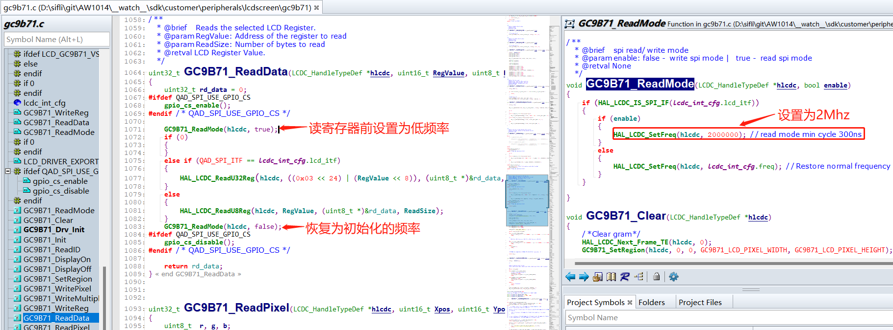<br> 
```c
void GC9B71_ReadMode(LCDC_HandleTypeDef *hlcdc, bool enable)
{
    if (HAL_LCDC_IS_SPI_IF(lcdc_int_cfg.lcd_itf)){
        if (enable){
            HAL_LCDC_SetFreq(hlcdc, 2000000); //read mode min cycle 300ns
        }
        else {
            HAL_LCDC_SetFreq(hlcdc, lcdc_int_cfg.freq); //Restore normal frequency
        }
    }
}
```
When writing registers with GC9B71_WriteReg, the above method can also be used to adjust the clk rate.<br>
