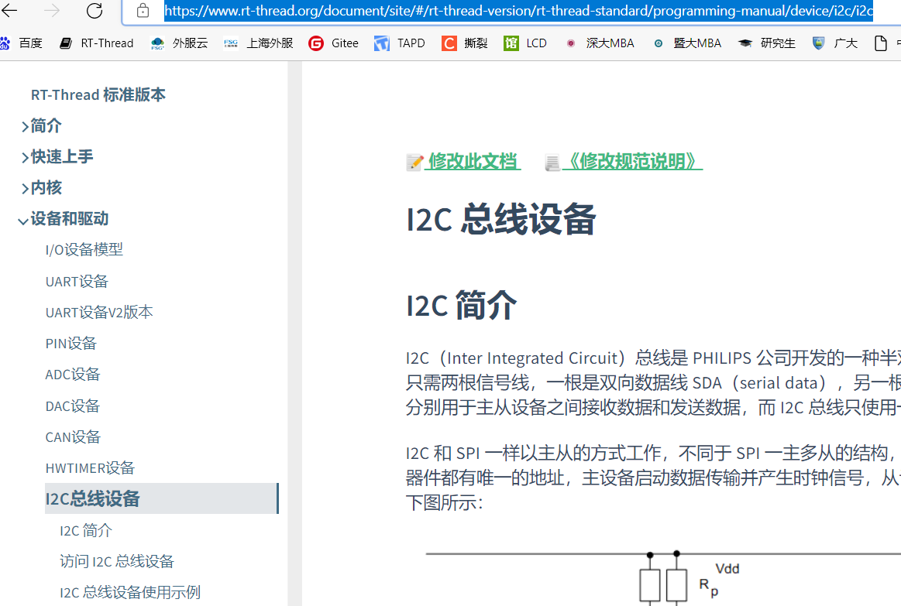
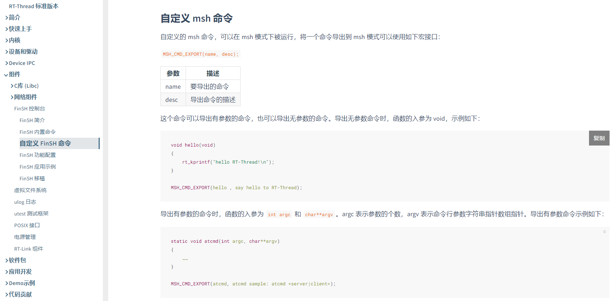
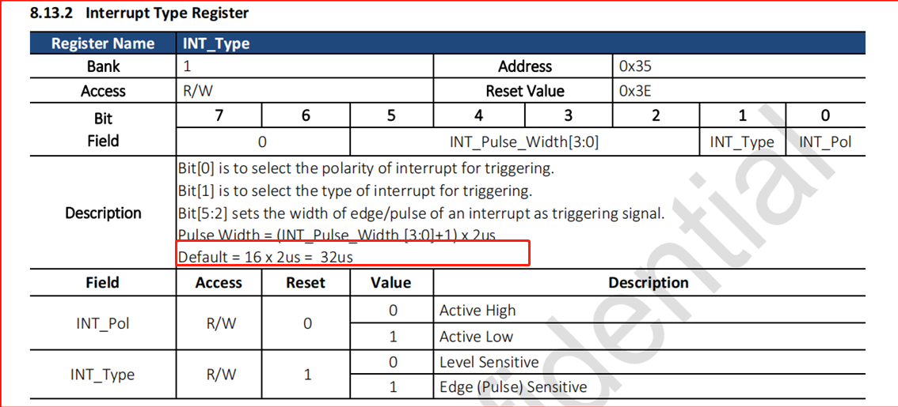

# 2 Common Sensor Debugging Issues
## 2.1 Method for Adding a Gsensor Driver to I2C5 in the LCPU
a. Under the SDK\rtos\rtthread\bsp\sifli\peripherals\ directory, refer to other Gsensor directories and create a directory, for example:<br>
Copy and create the directory: stk8321, and modify the macro in the SConscript in the corresponding directory: `group = DefineGroup('Drivers', src, depend = ['ACC_USING_STK8321'], CPPPATH = CPPPATH),`<br>
The ACC_USING_STK8321 macro depends on the Kconfig configuration of menuconfig in lcpu. Add it by referring to other peripherals.<br>

b. In menuconfig of the lcpu project, enable this Gsensor device and I2C5: ` → RTOS → On-chip Peripheral Drivers → Enable I2C BUS-> Enable I2C5 BUS`<br>
To confirm whether the configuration is correct, check whether the following exists in rtconfig.h under the corresponding lcpu project directory:<br>
```c
#define ACC_USING_STK8321
#define STK8321_BUS_NAME "i2c5
#define RT_USING_I2C
#define BSP_USING_I2C
#define BSP_USING_I2C4"
```
c. Confirm whether the I2C configuration in pinmux.c is set to the I2C function and pull-up state.<br>
```c
    HAL_PIN_Set(PAD_PB43, I2C5_SCL, PIN_PULLUP, 0);               //i2c5
    HAL_PIN_Set(PAD_PB44, I2C5_SDA, PIN_PULLUP, 0);
```    
d. The I2C peripheral has been encapsulated as a standard rt_thread I2C devices device. You can check how to use I2C devices on the rt_thread official website:<br>
You can refer to I2C Bus Device (rt-thread.org), the official documentation:<br>
<br><br>  
e. If the log from lcpu shows that I2C cannot read the device ID,<br>
check the following in order: <br>
Test the I2C power supply and operating conditions, including RESET, LDO_ON timing, etc.<br>
Then use an oscilloscope or logic analyzer to check whether the I2C output read/write waveforms meet the device expectations, whether the I2C device address is normal, and whether there is an ACK.<br>
f. You can customize an msh command to test whether the Gsensor works properly.<br>
For details, refer to the rtthread official documentation: FinSH Console (rt-thread.org)<br>
<br><br>  

## 2.2 Sensor Sometimes Cannot Trigger a GPIO Interrupt After the System Enters Sleep
Root cause:<br>
The wakeup pulse width provided by the heart-rate sensor is up to 32us. The pulse width is small. After the system enters sleep and uses a 32k frequency, AON cannot guarantee stable detection.<br>
<br><br>  
Solution:<br>
Modify the peripheral register or firmware. The interrupt pulse width must be greater than the clock period. Under the RC10K oscillator, the pulse width must be at least greater than 125us. See the interrupt section in the common FAQ.<br>
