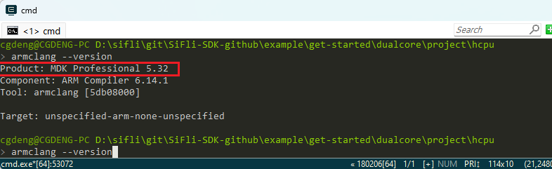
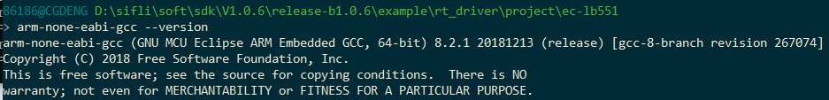
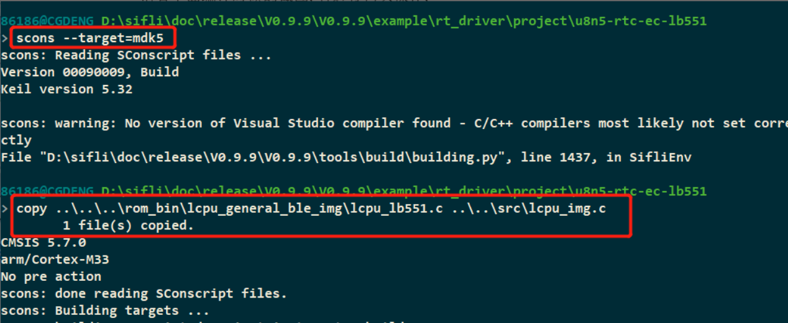
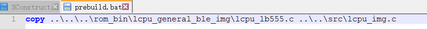
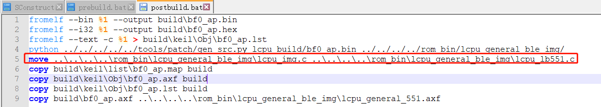
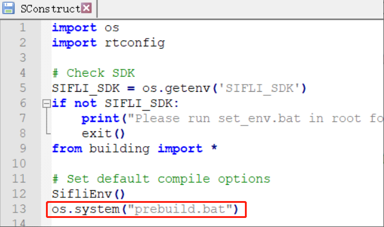
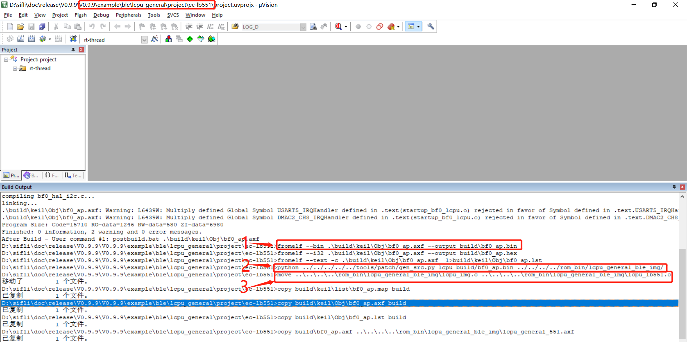

# 1 Compilation-Related
## 1.1 How to Disassemble an axf File into asm Assembly or a bin File
Use Keil's fromelf.exe tool. First place the axf file to be disassembled in `C:\Keil_v5\ARM\ARMCC\bin`,
Then enter the command in the cmd window:
```
c:\Keil_v5\ARM\ARMCC\bin\fromelf.exe lcpu_rom.axf --text -c >lcpu_rom.asm
c:\Keil_v5\ARM\ARMCC\bin\fromelf.exe hcpu.axf --text -c >hcpu.asm
```
Output a bin file from the axf file:
```
c:\Keil_v5\ARM\ARMCC\bin\fromelf.exe --bin --output=./lcpuaxf.bin ./lcpu.axf
```
## 1.2 Supported Compilers and Versions
Keil, recommended version for `armclang --version`:
<br>
GCC, recommended version: 
<br>
## 1.3 Default LCPU Project Path in the SDK Project
Please see the screenshot during compilation below, where a copy operation is performed,
<br>
The ..\..\..\rom_bin\lcpu_general_ble_img\lcpu_lb551.c file is generated by compiling the sdk\example\ble\lcpu_general\project\ec-lb551\ project.
The specific code copy operations are in the prebuild.bat batch file before compilation and the postbuild.bat batch file after compilation in the corresponding project directory.
<br>
<br>
scons --target=mdk5 will run the following
<br>
The prompt when compiling with Keil is as follows:
<br>
Batch processing configuration executed before and after keil compilation; see Question: 2.3.1
## 1.4 How to Prevent Unused Global Variables from Being Optimized Out During Compilation
For debugging convenience, some values are placed in a global variable for easier viewing. At this time, unused variables will be optimized out,
When defining a variable, you can add the volatile declaration before it so that it will not be optimized out. As follows:<br>
```
volatile uint32_t flash_dev_id=0xffffffff;
```
## 1.5 How to Resolve Compilation Exceptions Caused by Files in the Windows TMP Directory
Sometimes, when compiling a project, issues may occur with the generated bootloader, etc. in some Windows PC environments;<br>
In this case, check and confirm whether it is caused by cached files in the Windows temporary directory. You can clean up the contents under the temporary directory. To confirm/display the corresponding directory path, use the command line: "echo %TMP%". Then delete all files and directories under the corresponding directory.
## 1.6 Common Compilation Errors
(1) The code size of this image (xxx bytes) exceeds the maximum sllowed for this version of the linker. How can this be resolved?<br>
When this error occurs, check whether the Keil license is available.
## 1.7 Method for Forcing a Function to Be Non-Inline
When tracing code in Ozone, after some functions are compiled as inline functions, the code being traced may become assembly language, which makes it inconvenient to trace the code. In this case, you can force the function to be a non-inline function by adding the following declaration before the function: __attribute__ ( (noinline) ) or __NOINLINE
```c
 #define __NOINLINE __attribute__ ( (noinline) )
```
As follows:<br>
```c
__attribute__ ( (noinline) ) uint8_t _pm_enter_sleep(struct rt_pm *pm)
```
## 1.8 Method for Compiling Source Files into a Lib
For confidentiality requirements or other reasons, some customers do not want to disclose source code and need to compile a lib library for customers to use. The SDK provides an example for packaging into a Lib: `example\misc\generate_lib`. For the specific procedure, refer to the `README.md` document in the project directory.
