# 2 Jlink
## 2.1 How to Print Log Information Using JLINK RTT?
Currently, by default, the software Hcpu log is output from uart1 PA17/PA19(SF32LB555), PA49/51(SF32LB551)<br>
The Lcpu log is output from uart3,<br>
The customer only routed out uart3 PB45/PB46, or Uart1 is occupied<br>
Solution:<br>
Considering that uart3 is connected to lcpu, and lcpu will also need to output logs later,
You can use menuconfig to change the log output to swd<br>
Modification method for printing the hcpu log through Jlink swd:<br>
1) Enter the SDK\example\rt_driver\project\ec-lb555 directory<br>
2) menuconfig->Third party packages->select Segger RTT package
 <br>
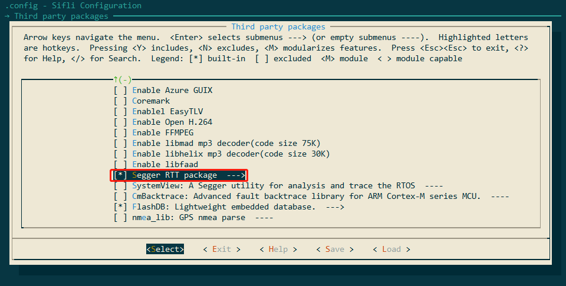<br>
3) menuconfig->RTOS -> RT-Thread Kernel->Kernel Device Object->change the devices name for console to segger<br>
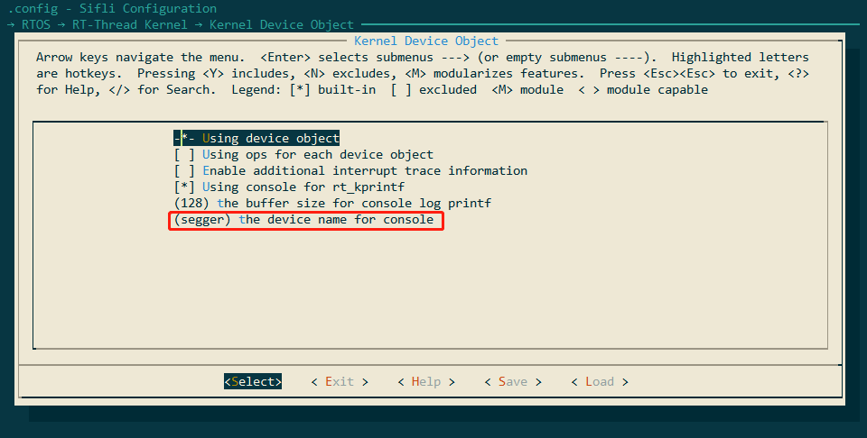<br> 
4) Connect jlink.
Method 1: Open C:\Program Files (x86)\SEGGER\JLink\jlink.exe -> connect ->? ->s->default 4000khz->connection succeeds, as shown below:<br>
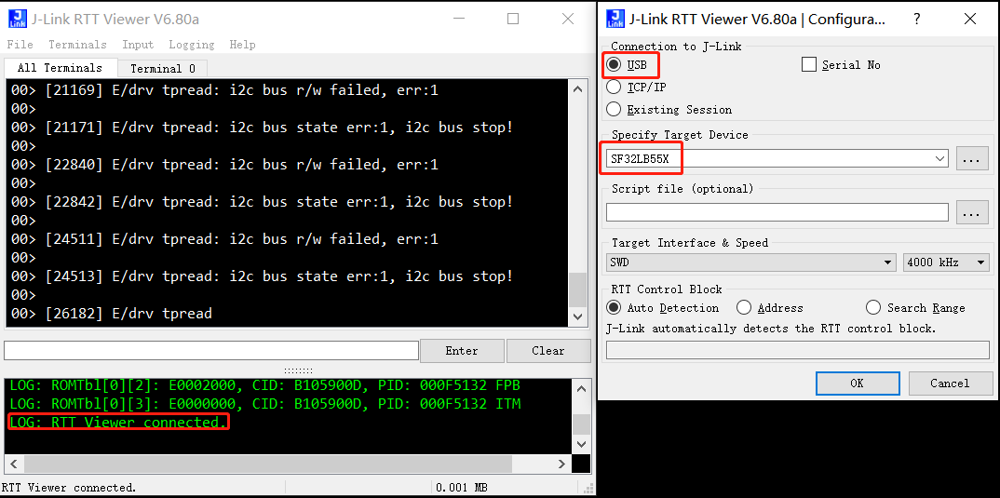<br> 
Method 2: Open C:\Program Files (x86)\SEGGER\JLink\JLinkRTTViewer.exe, configure it, and use the menu File -> Connect,
After a successful connection, you can see the following LOG: RTT Viewer connected. This indicates that the connection is successful.<br>
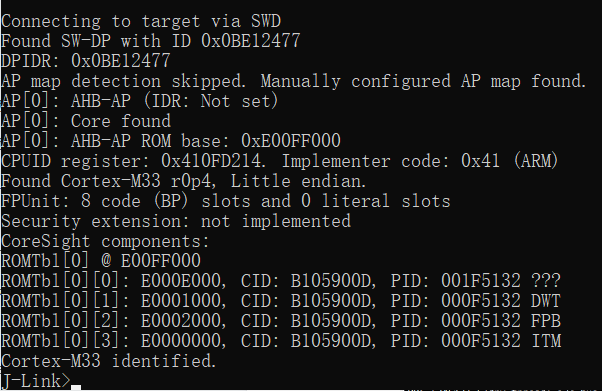<br> 
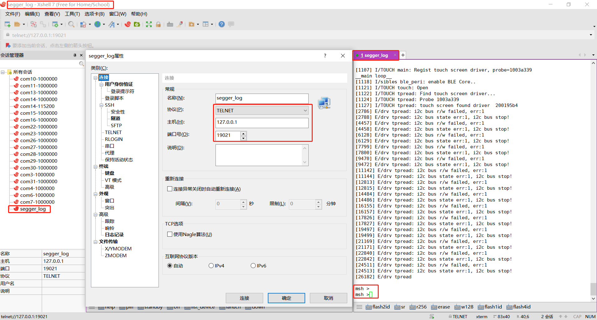<br>   
5) Run software such as Xshell or secureCRT, connect to jlink RTT viewer through telnet（hostname: 127.0.0.1 port: 19021）, and view the log; output and input are supported, as shown below:<br>
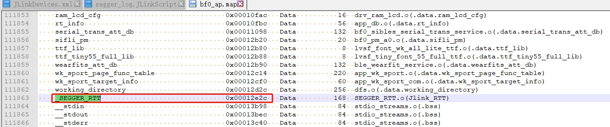<br> 
**Note** If Hcpu wakes up from standby or restarts, you need to reconnect jlink RTT viewer. <br>
F. If Segger still does not print after the above configuration, refer to #2.2 for troubleshooting.
## 2.2 Hcpu Logs Cannot Be Printed Through Jlink segger
Root cause:<br>
To optimize memory in the new sdk version, the Jlink Control block address: _SEGGER_RTT variable has been relinked from HPSYS SRAM0x20000000 to the memory region HPSYS ITCM RAM0x00010000 0x0001FFFF 64*1024
As shown in the following figure:<br>
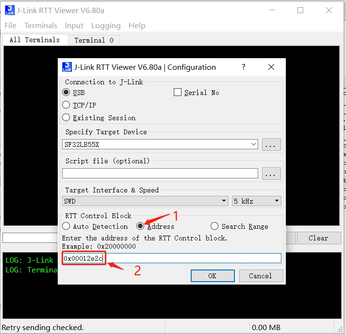<br>  
However, Jlink starts searching memory from 0x20000000 by default, so it cannot find it and the connection fails,<br>
In the old version 0.9.7, the compiled address was after 0x20000000, and jlink could automatically connect and find it.<br>
Solution 1: <br>
Specify the address in J-Link RTT Viewer.exe. This address can be found by searching the map file, as shown below:<br>
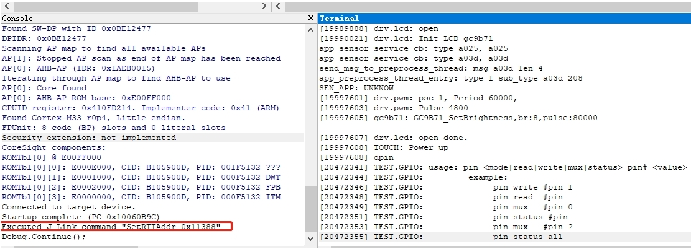<br> 
Solution 2:<br>
Switch to Ozone.exe. Ozone.exe can find this address from the axf file. As shown below, the SetRTTAddr address command exists:<br>
<br>  
Solution 3:<br>
Create a JLinkScript command that will be automatically called when jlink starts to set or search the Control block address range. The command is shown below:<br>
You can modify and select it yourself:<br>
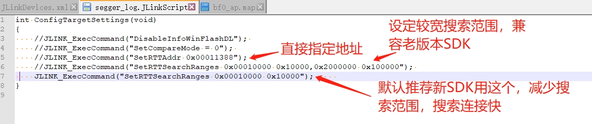<br>  
Corresponding xml file modification:<br>
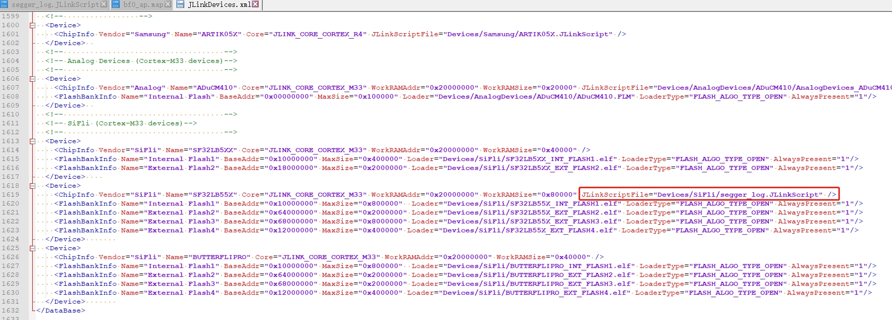<br>  
JLink.exe and J-Link RTT Viewer.exe can still connect automatically as before, which is much more convenient.<br>
It is recommended to use rttview.exe and telnet 127.0.0.1 to view the log!
The file patch is attached. Copy it to the corresponding Jlink installation directory:<br>
Program Files (x86).7z

## 2.3 Jlink Reads and Writes Flash Contents,
1) After jlink connects successfully, use mem32 to read, w4 to write, and erase to erase.<br>
```
mem32 0x40014000 1 #读1个32bit的寄存器值
mem32 0x64000000 10 #读10个byte从flash2地址0x64000000开始，
w4 0x64000000 0x2f 0x2f 0x2f 0x2f 0x2f 0x2f #写内存或者寄存器值 从flash2地址0x64000000开始， 写入后续的数据
```
1) Read and write using jflash<br>
In the same directory as jlink.exe, there is a jflash tool. Use the menu shown below to read the flash contents,
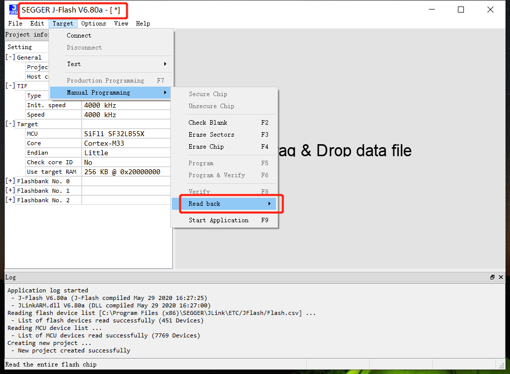<br>  
1) Read using the savebin command<br>
```
savebin d:\1.bin 0x101b4000 0x100000 
```
In the above, 0x101b4000 is the memory address, and 0x100000 is the memory read/write size in bytes.
d. Method for writing the saved bin back
```
loadbin  d:\1.bin 0x101b4000
```
## 2.4 Other Common Jlink Commands
1) halt and go commands<br>
Enter the command h to stop the CPU and view the location of the PC pointer<br>
Enter the command g to let the CPU continue running,
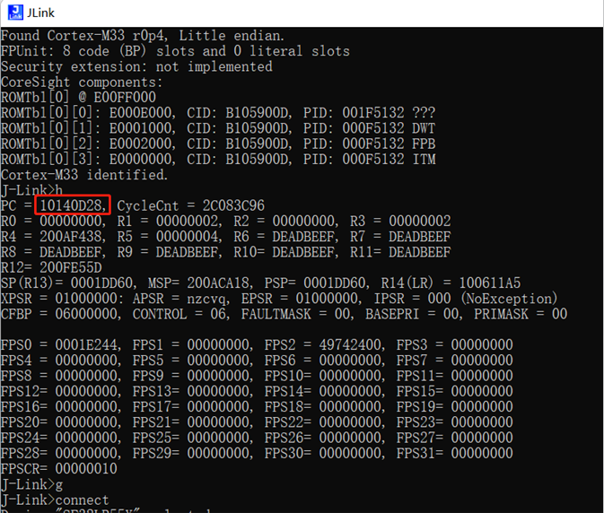<br>  
1) Set the PC pointer<br>
It is often used together with the __asm("B ."); instruction. When the code executes this instruction, it stops,<br>
As shown above, if the PC pointer is at 0x10140D28 at this time, add 2 to the PC pointer and enter setpc 0x10140D2A to skip the __asm("B ."); instruction and continue running.
1) Other commands<br>
erase 0x00000000.0x0000FFFF<br>
loadbin <filename> <address>-- Download the filename file to the address<br>
usb--------Connect to the target board<br>
r---------Restart the target board<br>
halt-------Stop the program running on the cpu<br>
loadbin----Load an executable binary file<br>
g-------Jump to the code segment address and execute<br>
s-------Single-step execution (for debugging)<br>
setpc-----Set the value of the pc register (for debugging)<br>
setbp-----Set a breakpoint. After stopping at the breakpoint, you can use the command g to continue running<br>
Regs-------Read the register set<br>
wreg-------Write register<br>
mem--------Read memory<br>
w4--------Write memory<br>
## 2.5 Method for Connecting Jlink Using SiFliUsartServer When There Is No SWD Port
After the 52 series, the MCU no longer has an SWD interface. If you want to use Jlink or Ozone for debug, you can use the SiFliUsartServer.exe tool. The Jlink usage is configured as shown below:
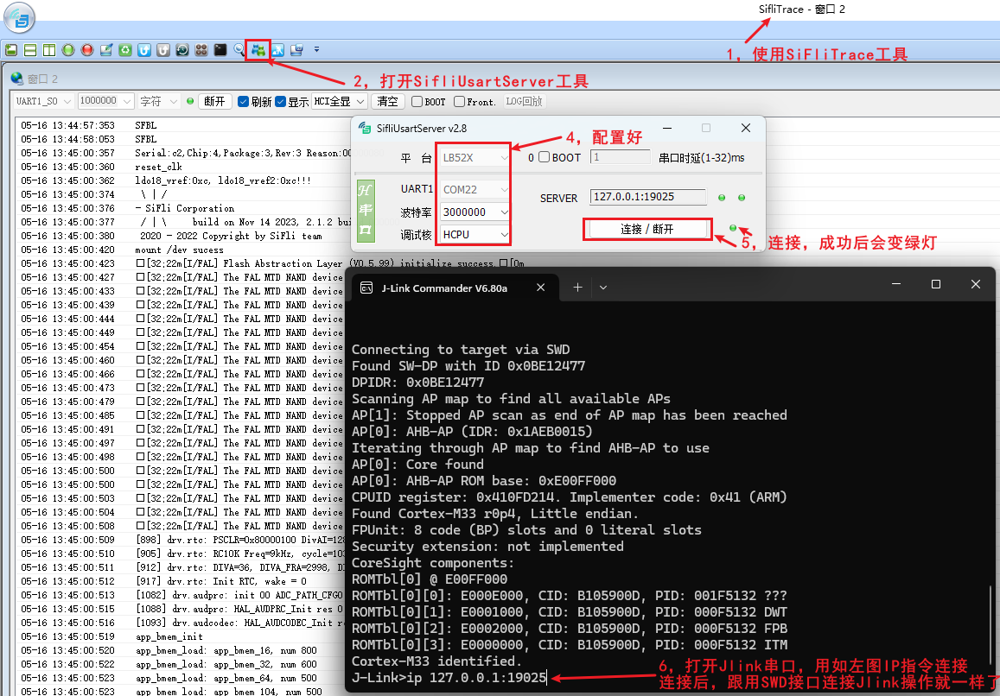<br>
