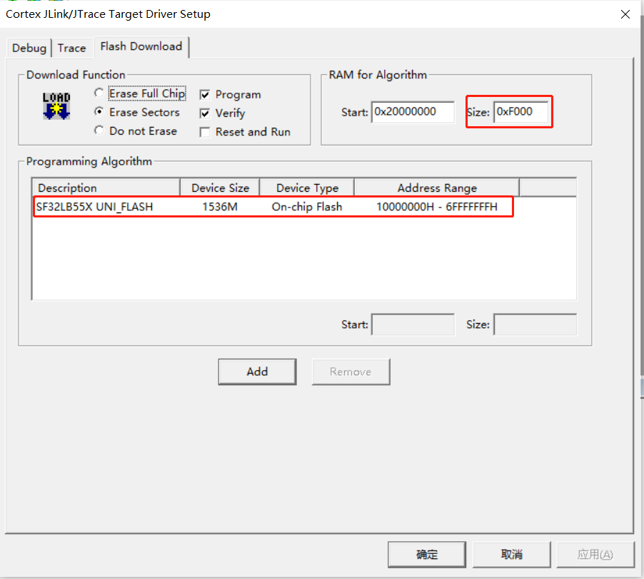
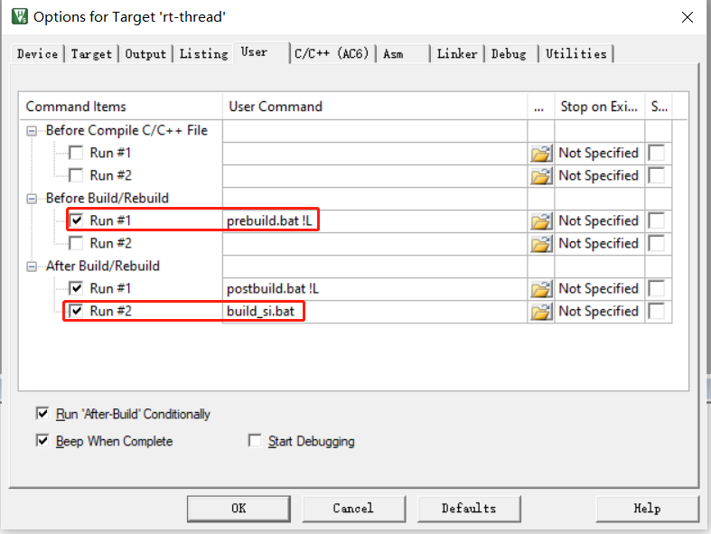

# 3 KEIL
## 3.1 Modify the Configuration File
The scons --target=mdk5 command generates the current project based on the project under sdk\tools\build\template\template.uvprojx. 
For the uvprojx project, after opening template.uvprojx in keil, modifying it, saving it, and exiting, the default result of the next scons --target=mdk5 command will follow the modifications made to the template.uvprojx project. 
Using it correctly can reduce repeated work and improve efficiency. 
Recommended modification 1: 
  
Recommended modification 2: 
Customize batch operations before and after compilation. Common operations include 
1) Copying lcpu_img.c in the prebuil.bat batch file, 
2) Disassemble the axf file into an asm assembly file, 
 
