# 4 Ozone
## 4.1 Ozone Download and Configuration Method
1. Download Ozone<br>
You can download it directly from Segger's official website. If it is a Windows system, select the Windows version. For the Ozone version, you can select the latest one.
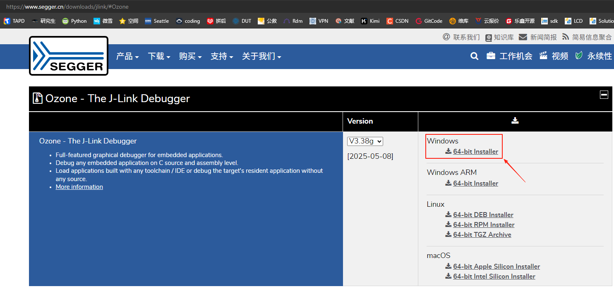<br> 
Download address for Segger's online debugging tool<br>
[Ozone - The J-Link Debugger Windows 64-bit Installer](https://www.segger.cn/downloads/jlink/#Ozone) [[Debugging Crash Method](../tools/ozone.md#43Ozone单步调试Debug)]<br>
**Note:**<br>
Ozone and Jlink versions later than V7.6 check for pirated Jlink debuggers. For developers using them for learning purposes, [Ozone_Windows_V320d_x64.exe](https://www.segger.cn/downloads/jlink/Ozone_Windows_V320d_x64.exe)(https://www.segger.cn/downloads/jlink/Ozone_Windows_V320d_x64.exe) and [JLink_Windows_V758a_x86_64.exe](https://www.segger.cn/downloads/jlink/JLink_Windows_V758a_x86_64.exe)(https://www.segger.cn/downloads/jlink/JLink_Windows_V758a_x86_64.exe) can be recommended.
 2. Configure Device, MCU peripheral registers, and the RT-Thread OS script<br> 
 A. Replace the Ozone configuration file `C:\Users\yourname\AppData\Roaming\SEGGER\JLinkDevices\JLinkDevices.xml` with `SiFli-SDK\tools\flash\jlink_drv\JLinkDevices.xml`. In addition, create a directory named SiFli under `C:\Users\yourname\AppData\Roaming\SEGGER\JLinkDevices\Devices\`, and copy `SiFli-SDK-i\tools\flash\jlink_drv\sf32lb52x\SF32LB52X_*.elf` to it. The corresponding directories and files are as follows:<br> 
 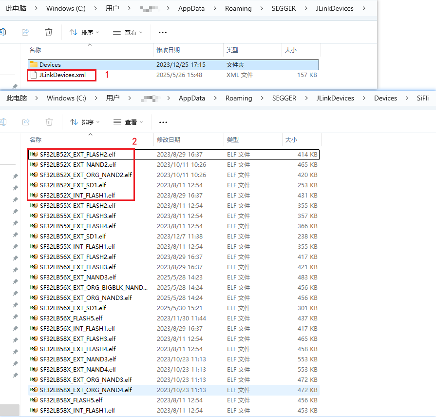<br>
 For the Jlink programming driver mapping, see the contents of the JLinkDevices.xml file:<br>
 ```xml
<Device>
    <ChipInfo Vendor="SiFli" Name="SF32LB52X_NOR" Core="JLINK_CORE_CORTEX_M33" WorkRAMAddr="0x20000000" WorkRAMSize="0x60000" />
    <FlashBankInfo Name="Internal Flash1" BaseAddr="0x10000000" MaxSize="0x8000000"  Loader="Devices/SiFli/SF32LB52X_INT_FLASH1.elf" LoaderType="FLASH_ALGO_TYPE_OPEN" AlwaysPresent="1"/>
    <FlashBankInfo Name="External Flash2" BaseAddr="0x12000000" MaxSize="0x8000000" Loader="Devices/SiFli/SF32LB52X_EXT_FLASH2.elf" LoaderType="FLASH_ALGO_TYPE_OPEN" AlwaysPresent="1"/>
</Device>
 ```
 B. Copy the peripheral register configuration files `D:\sifli\git\SiFli-SDK-i\tools\svd_external\SF32LB52X\SF32LB52x.*` to the `C:\Program Files\SEGGER\Ozone\Config\Peripherals` directory;<br> 
 C. Copy `SiFli-SDK\tools\segger\RtThreadOSPlugin.js` to the `C:\Program Files\SEGGER\Ozone\Plugins\OS\` directory. The corresponding directories and files are as follows:<br> 
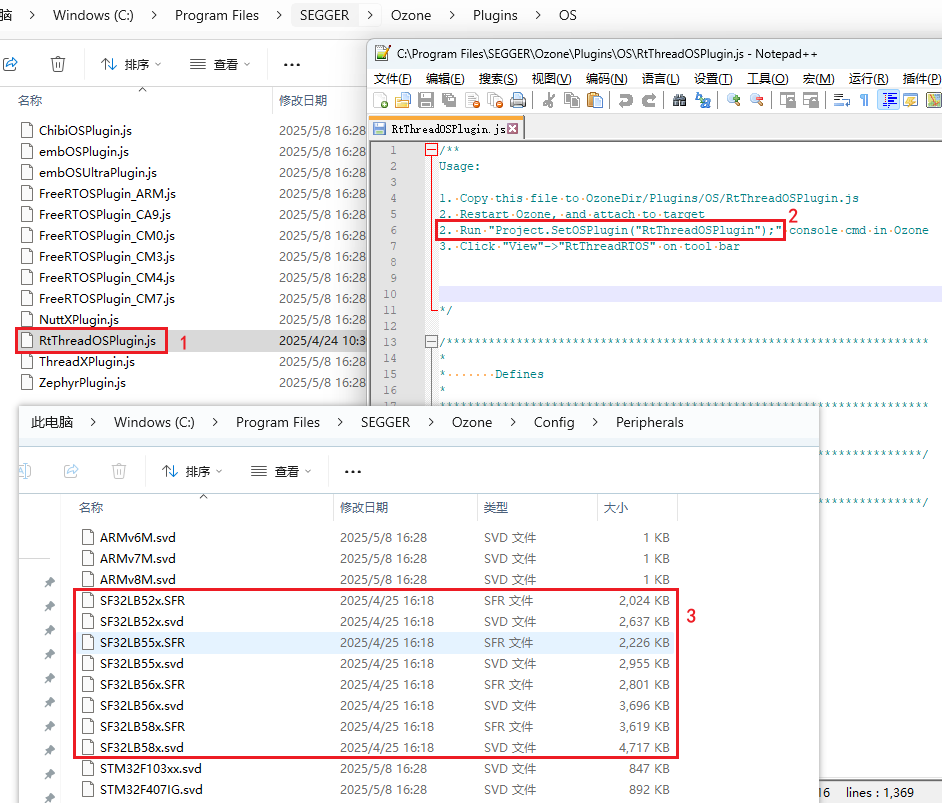<br> 
 After configuring items A/B/C, open Ozone, and you can select the Devices and MCU peripheral registers that need to be debugged.<br> 
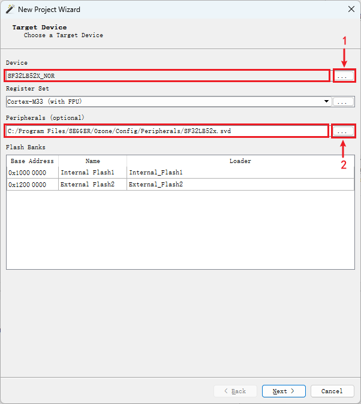<br> 

 After configuring the MCU peripheral registers and the RT-Thread OS script, enter the Ozone interface, where you can view the corresponding MCU peripheral registers and OS threads.<br> 
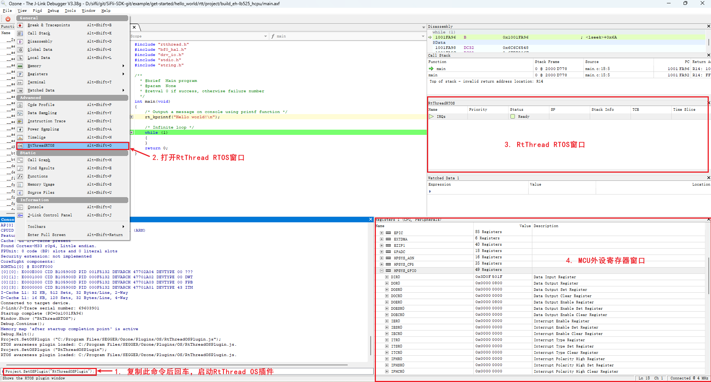<br> 
## 4.2 Ozone Debug Connection Fails
Note:<br>
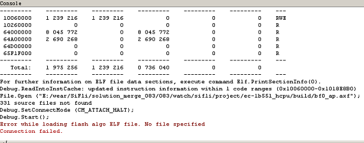<br>   
You need to add the flash driver and xml configuration file in the same way as for jlink, so that Ozone can support the SF32LB55X chip.<br>
```xml
C:\Program Files\SEGGER\Ozone\Devices\SiFli\SF32LB55X****.elf
C:\Program Files\SEGGER\Ozone\JLinkDevices.xml
#不同Jlink或者Ozone版本的路径可能如下：
C:\Users\yourname\AppData\Roaming\SEGGER\JLinkDevices.xml
C:\Users\yourname\AppData\Roaming\SEGGER\JLinkDevices\Devices\SF32LB55X****.elf
```
<a name="43Ozone单步调试Debug"></a>
## 4.3 Ozone Single-Step Debug
1. By default, J-Link connect connects to HCPU. If you are debugging HCPU, you can skip this step and debug HCPU directly. If you want to debug LCPU, run SDK\tools\segger\jlink_lcpu_a0.bat (55), jlink_lcpu_pro.bat (58), or jlink_lcpu_56x.bat (56) in the Windows cmd command window. Running this batch file executes several commands in \tools\segger\jlink_lcpu_xxx.jlink:<br>
```
w4 0x4004f000 1
connect
w4 0x40070000 0 
exit
```
You can also enter these two commands in sequence directly in the Jlink window to switch to lcpu.<br>
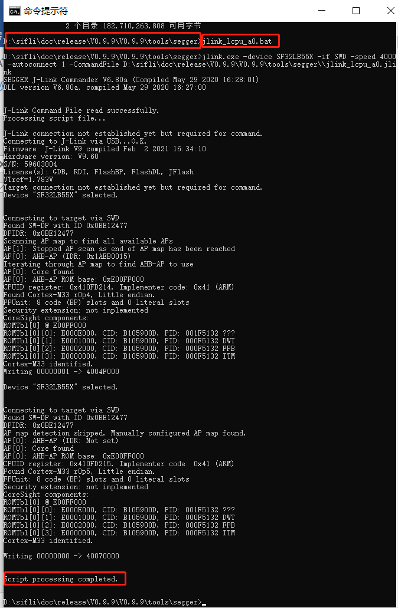<br>   
You can also write registers in the code to switch SWD Jlink to Lcpu debugging;<br>
2. Now take 55 as an example to demonstrate Lcpu single-step execution. First create a new project.<br>
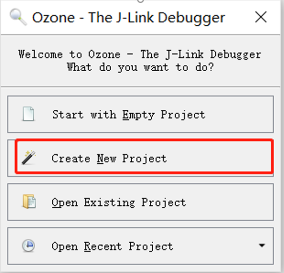<br>    
3. Select the debug chip,
If it cannot be found, you need to in
Add the 55x chip model configuration to C:\Program Files\SEGGER\Ozone\JLinkDevices.xml
and the four flash programming files in C:\Program Files\SEGGER\Ozone\Devices\SiFli\SF32LB55X_****.elf<br>
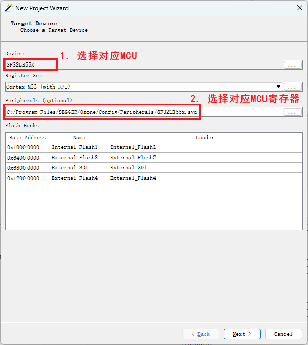<br>    
4. Select the jlink device that is already connected to the PC. If it cannot be found, check the jlink connection and jlink power supply.<br>
5. Select the compiled *.axf or *.elf file. If it is the watch_demo project, the Lcpu axf path will be at
```
\release\example\rom_bin\lcpu_general_ble_img\lcpu_general_551.axf
```
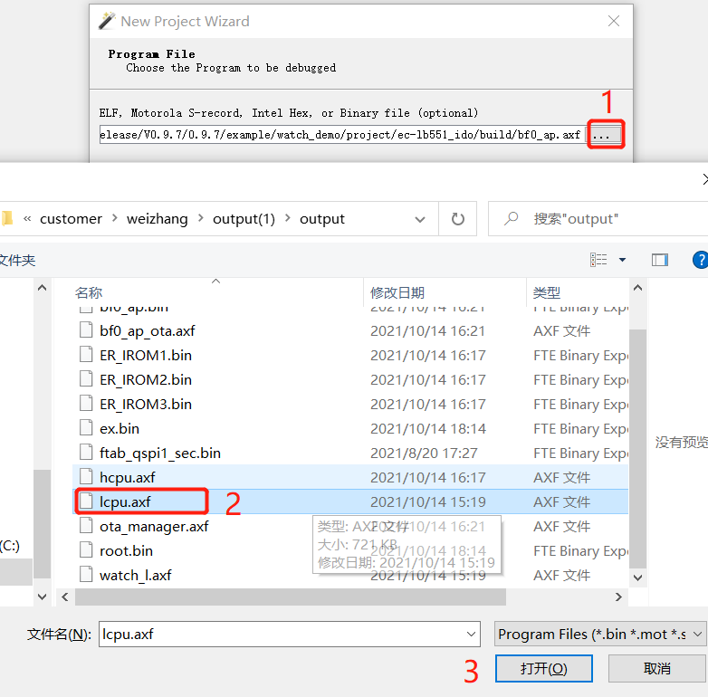<br>    
6. Select Jlink or the virtual IP of SifliUsartServer.exe<br> 
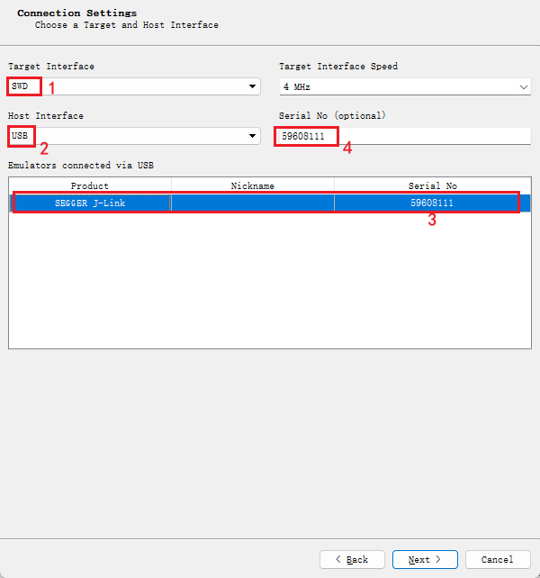<br> 
For 52, the default debugging port is uart. After connecting with SifliUsartServer.exe, use IP 127.0.0.1:19025
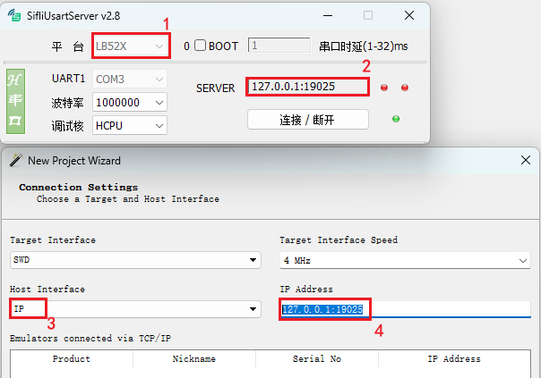<br> 
7. The next step is to select where to obtain the initial PC pointer and initial stack from. You can select the default option or select the Do no set option, then click finish to complete.<br>
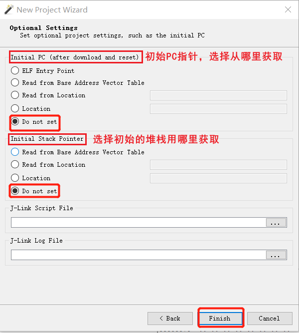<br>    
8. Attach and halt Program means to let jlink connect to lcpu and stop at the currently running PC pointer,
Attch and Running Program means to let jlink connect to lcpu and start continuing program execution from the current PC.<br>
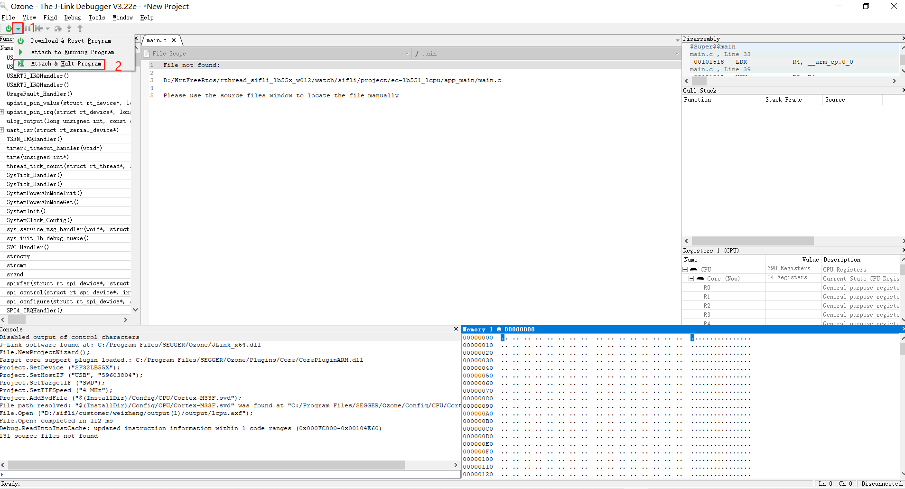<br>    
9. After clicking the run program arrow icon, you can see that lcpu can already run in single-step mode. You can add breakpoints and view stack information and register status.<br>
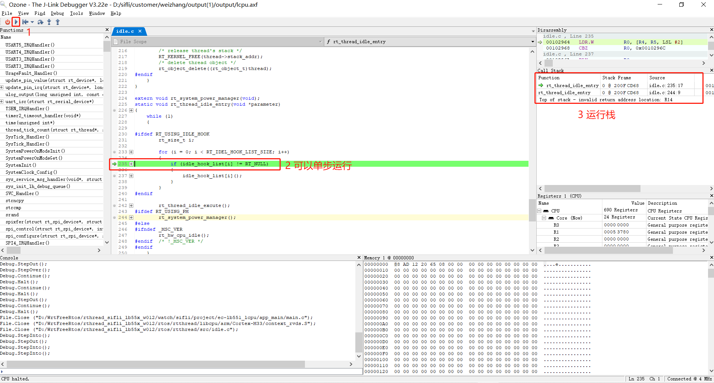<br>   
 
## 4.4 Disconnection Issue After Ozone Connects
Often, after being connected for a while, the following Target Connection Lost dialog box appears, and then the connection is lost.<br>
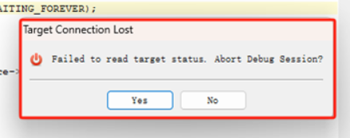<br>    
If you encounter the above issue, before connecting Ozone for debugging, close Ozone's Memory window and other unused windows. For example, the following window reads a nonexistent memory address or reads PSRAM memory that has not yet been initialized:<br>
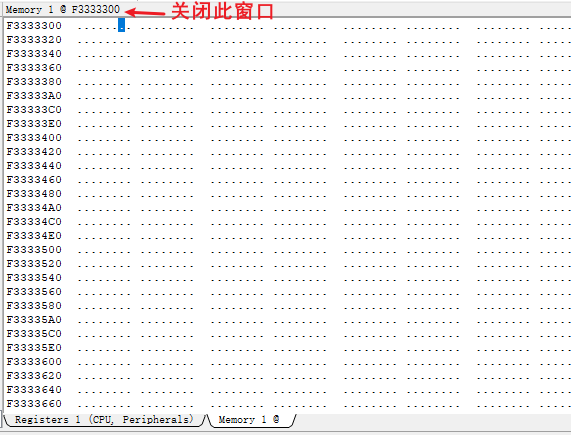<br> 
Because Ozone reads these memory contents during connection, a disconnection will occur if the read fails.<br>
## 4.5 Enable RT-Thread RTOS Online Debugging in Ozone
Copy the \sdk\tools\segger\RtThreadOSPlugin.js file to the Ozone installation directory:<br>
`C:\Program Files\SEGGER\Ozone\Plugins\OS\RtThreadOSPlugin.js`<br>
Then open this file and follow the steps below. You can then use Ozone to switch RTThread threads online for viewing and debugging.<br>
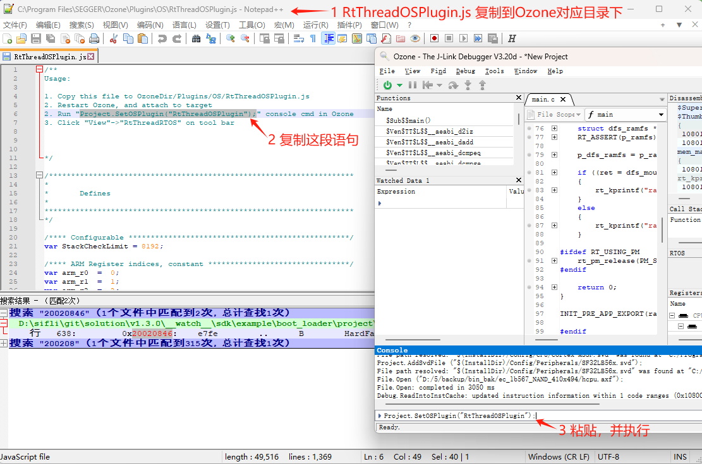<br>    
After Ozone is connected and Project.SetOSPlugin("RtThreadOSPlugin"); is enabled, the site is as follows:<br>
 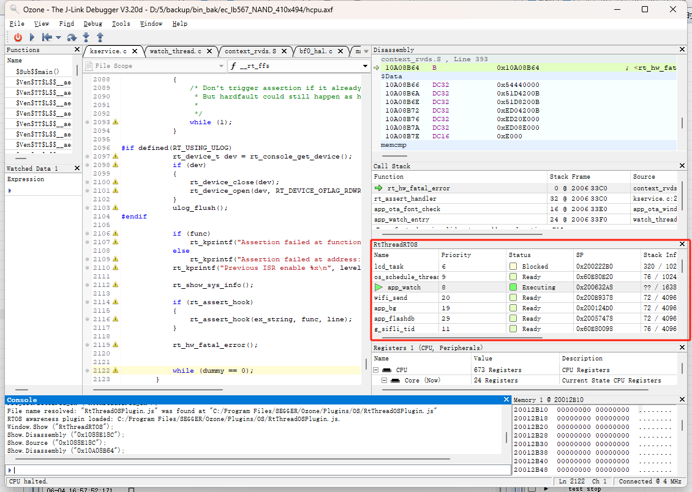<br>    
## 4.6 Redefine File Paths in Ozone
When the path of the programmed bin is not the local build path, using Ozone for Debug will prompt File not find, and the corresponding C source code cannot be located, so step-by-step tracing and issue locating cannot be performed.<br>
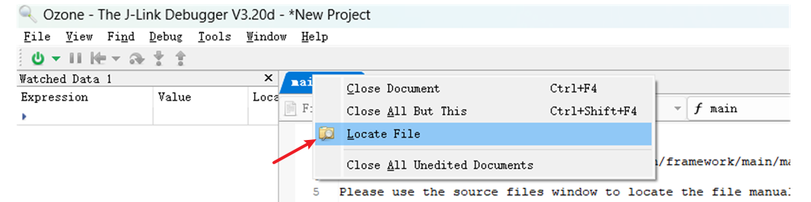<br>     
Solution:<br>
Single file not found: Right-click the file and use Locate File to locate the corresponding file, and then the C source file can be located.<br>
Incorrect base address for batch files: Use the Project.AddPathSubstitute command to relocate the path, for example, replacing the linux path in the elf with the windows path.<br>
 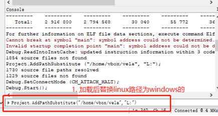
