# 5 SiFli
## 5.1 Impeller flashing reports a failure. Is something not configured correctly?
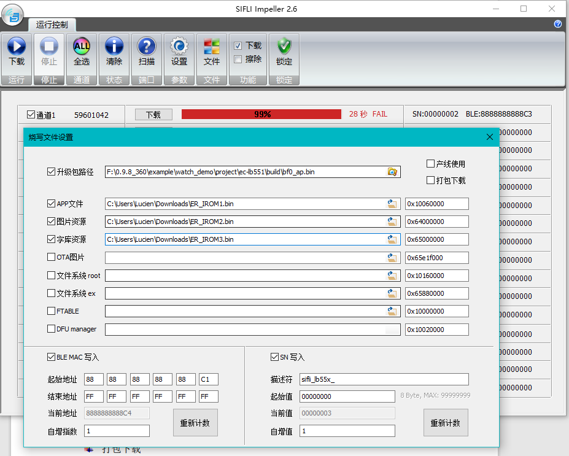<br>
Root cause: For 16M flash, ER_IROM3 specifies an address outside the 16Mflash address range 0x00000-0xFFFFFF.<br> 
Solution: 1. The method for trimming watchdemo in the SDK to 16M flash is shown in the following figure:<br> 
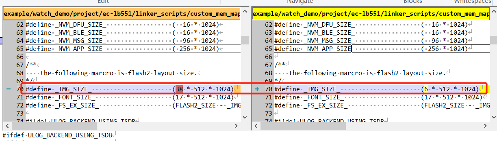<br> 
After compilation, find the address download address from the hex file format, as shown in the following figure:<br> 
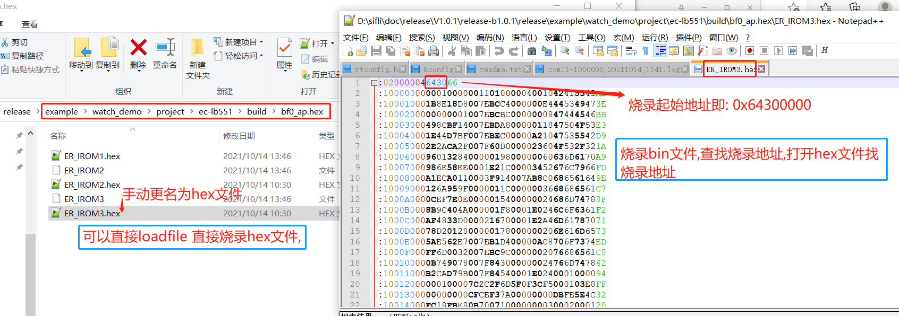<br> 
## 5.2 Double-clicking butterfli.exe in the solution cannot open the compilation tool
a. Open the display settings of the PC or laptop and set the percentage to 100%. (Some other resolution percentages may also work, but you must ensure that the butterfli.exe page is displayed correctly.)<br> 
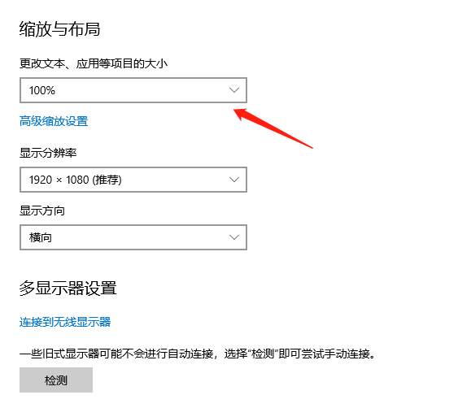<br> 
b. Make sure the following option is enabled in Display --- Advanced scaling settings. Otherwise, the page size may change, but the display size of some tools may remain unchanged, and butterfli.exe may still fail to open:<br> 
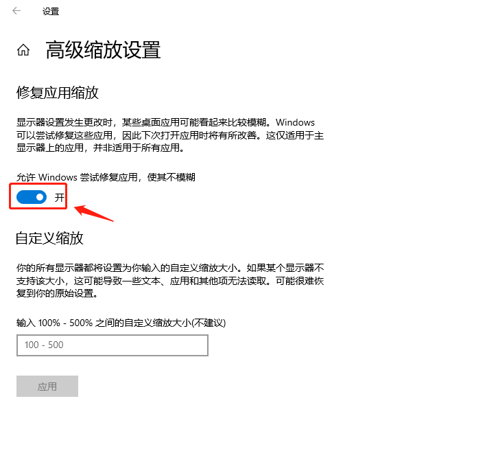<br> 
c. The normal butterfli.exe tool interface is displayed as follows. If the display is garbled, adjust the resolution and display percentage.<br> 
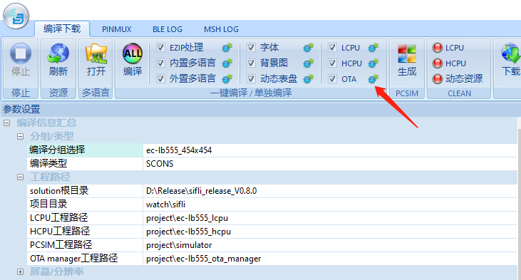<br> 
## 5.3 For console finsh shell commands, how do I use regop to read and write register values?
```
regop unlock 0000 # 先需要解锁
regop read 40070018 2  # 16进制不能带0x前缀
regop read 4007001c 1
regop write 40007100 200 # 16进制不能带0x前缀
```
## 5.4 Method for checking whether the 48M crystal frequency offset has been calibrated
1. Enter the crystal_get command in the hcpu serial command line. If a non-0 or 0xFF value is returned, it proves that the board has been calibrated, as shown in the following figure:<br> 
<br>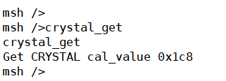<br>
If it has not been calibrated, the return is as follows:<br> 
```
msh />crystal_get
FACTORY_CFG_ID_CRYSTAL read fail with 0
```
Corresponding code:
```c
int32_t crystal_get(int32_t argc, char **argv)
{
    int res;
    uint32_t cal_value;

    res = rt_flash_config_read(FACTORY_CFG_ID_CRYSTAL, (uint8_t *)&cal_value, sizeof(cal_value));
    if (res <= 0)
    {
        rt_kprintf("FACTORY_CFG_ID_CRYSTAL read fail with %d\n", res);
        return -1;
    }
    else
    {
        rt_kprintf("Get CRYSTAL cal_value 0x%x\n", cal_value);
    }

    return 0;
}
MSH_CMD_EXPORT(crystal_get, crystal_get);
```
2. The 56x series solution code uses otp_factory_read to read all otp partition data, as shown in the following figure:<br> 
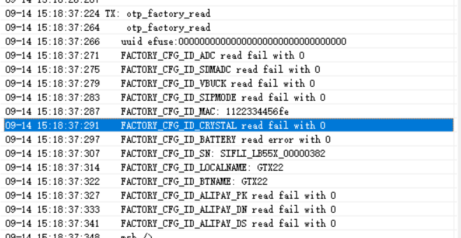<br> 


## 5.5 Method for generating a Source Insight project file list
1. After SDK v1.1.3, the `scons --target=si ` command was added, which can generate a file list `si_filelist.txt` that only participates in compilation.<br> 
For compilation commands that need to specify `--board=em-lb525`, the board parameter needs to be added. The command is as follows:<br> 
```
scons --target=si 
scons --board=em-lb525 --target=si 
```
2. After creating a new project in the SourceInsight tool, you can select `menu: project -> Add and Remove Project Files ->Add from list... ` to import the generated `si_filelist.txt` into the project, making it easier to view the code.<br> 
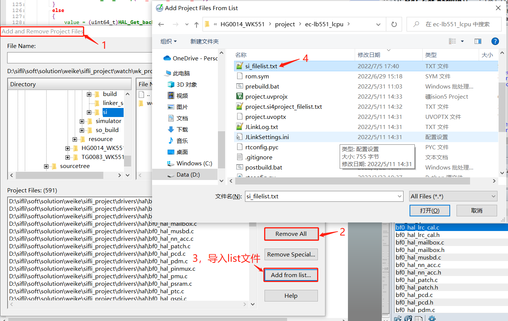<br> 
<a name="5655X查看芯片工厂校准区OTP"></a>
## 5.6 Method for viewing chip factory calibration area OTP/Flash data on 55X
1. It can be used to check whether the ADC and crystal have been calibrated, whether they have been overwritten, as well as the serial number, Bluetooth address, name, and so on.<br> 
The following is the procedure:<br> 
otp_debug_0922.7z<br> 
a. Make sure jlink can connect normally to the sifli device. If not, pull MODE high, then reset the device.<br> 
b. Run the test.bat batch command in otp_debug_0922.7z. It will program the factory_cali.bin file into RAM and jump to that RAM address to run, without affecting the original flash program.<br> 
c. Run JLinkRTTViewer.exe, select Auto Detection as the connection method, and enter help. If commands are returned, you can then enter commands to read the chip OTP data.<br> 
d. otp_read 0 1 /*This command reads all OTP*/<br> 

Refer to the following procedure:<br> 
```
00> Serial:c2,Chip:1,Package:0,Rev:80
00>  \ | /
00> - SiFli Corporation
00>  / | \     build on Aug 18 2022, 1.1.1 build 4df1cb
00>  2020 - 2021 Copyright by SiFli team
00> debug: main thread run
00> msh >
  < help
00> help
00> RT-Thread shell commands:
00> list_mem         - list memory usage information
00> memcheck         - check memory data
00> memtrace         - dump memory trace information
00> pin              - pin gpio functions
00> uart             - uart setting
00> reboot           - Reboot System
00> regop            - Register read / write
00> pwr_ctrl         - BLE TX power adjust
00> crystal_cali     - crystal_cali 8 5 20(PB08 5ppm 20s)
00> crystal_cali_get - crystal_cali_get
00> crystal_cali_set - crystal_cali_set 0x1EA
00> otp_reset        - otp_reset 0
00> otp_read         - otp_read 0 1
00> battery_get      - battery_get
00> battery_r_set    - battery_r_set 1000 220
00> battery_cali_set - battery_cali_set 10000 0
00> battery_cali_get - battery_cali_get
00> battery_cali     - battery_cali 4000 400 10 1000 220(4000mV +-400mV +-10mv 1000k 220k)
00> efuse_uid_read   - efuse_uid_read
00> otp_fwenc_read   - otp_fwenc_read
00> fw_enc_wr        - fw_enc_wr
00> hcpu_jump_run    - hcpu_jump_run addr (eg: hcpu_jump_run 0x10020000)
00> lcpu             - forward lcpu command
00> sysinfo          - Show system information
00> adc              - adc function
00> version          - show RT - Thread version information
00> list_event       - list event in system
00> list_mailbox     - list mail box in system
00> list_msgqueue    - list message queue in system
00> list_memheap     - list memory heap in system
00> exit             - return to RT - Thread shell mode.
00> console          - Change MSH / FINSH console device.
00> help             - RT - Thread shell help.
00> time             - Execute command with time.
00> free             - Show the memory usage in the system.
00> 
00> msh >
  < otp_read 0 1
00> otp_read 0 1
00> READ otp addr 0x1000 with res 256
00> 0x06  0x04  0x0d  0x6b  0x07  0x06  0x04  0x04  
00> 0x9f  0x81  0xfb  0x82  0xff  0xff  0xff  0xff  
00> 0xff  0xff  0xff  0xff  0xff  0xff  0xff  0xff  
00> 0xff  0xff  0xff  0xff  0xff  0xff  0xff  0xff  
00> 0xff  0xff  0xff  0xff  0xff  0xff  0xff  0xff  
00> 0xff  0xff  0xff  0xff  
00> ULOG_WARN: trace loss 97,521
```
2. OTP data interpretation:<br>
The data in OTP is stored in ‌TLV format (Tag-Length-Value), that is, stored as ID+LEN+DATA.<br> 
‌TLV format (Tag-Length-Value) is a commonly used data serialization format, mainly used for payload encoding of data packets or messages. ‌TLV format divides data into three main parts: Tag, Length, and Value.<br> 
a. ID occupies one byte and is defined in the header file; LEN occupies one byte, which limits the content of one ID to no more than 255 bytes;
DATA is the actual data, stored according to the data format defined by the ID itself. OTP does not care about the actual data. <br> 
The IDs are arranged tightly, with no other synchronization word, so queries must start from the beginning and search ID by ID.<br> 
b. When modifying existing ID data, first search from the beginning to find the corresponding ID and check the length. If the newly set length is the same as the previous length, the data is saved to the same location,
If the length changes, the subsequent ID data moves forward, and then the modified ID is placed at the end.<br> 
```c
#define FACTORY_CFG_ID_INVALID          0       /*!< Invalid ID */
#define FACTORY_CFG_ID_MAC              1       /*!< BLE MAC address */
#define FACTORY_CFG_ID_SN               2       /*!< Serial Number */
#define FACTORY_CFG_ID_CRYSTAL          3       /*!< Crystal tuning information */
#define FACTORY_CFG_ID_ADC              4       /*!< ADC tuning information*/
#define FACTORY_CFG_ID_SDMADC           5       /*!< SDMADC tuning information*/
#define FACTORY_CFG_ID_VBUCK            6       /*!< VBUCK /LDO information*/
#define FACTORY_CFG_ID_SECCODE          7       /*!< Security Code or something like this*/
#define FACTORY_CFG_ID_LOCALNAME        8       /*!< BLE localname*/
#define FACTORY_CFG_ID_BATTERY          9       /*!< Battery verify value*/
#define FACTORY_CFG_ID_FWVERIFY         10      /*!< FW verify code generated based in uid*/
#define FACTORY_CFG_ID_ALIPAY_PK        11      /*!< for alipay product key  code*/
#define FACTORY_CFG_ID_ALIPAY_DN        12      /*!< for alipay device name code*/
#define FACTORY_CFG_ID_ALIPAY_DS        13      /*!< for alipay device secret code*/
#define FACTORY_CFG_ID_UNINIT           0xFF    /*!< Uninitialized ID */
```
The following figure is parsed as follows:<br> 
ID in the red box: 0x06 is FACTORY_CFG_ID_VBUCK, the data length 0x04 is the data length, and the following 0x0d, 0x6b, 0x05, and 0x06 are the data.<br> 
The ID in the blue box is 0x04, which corresponds to ADC calibration data. It has been saved by ATE before the chip leaves the factory. ID 0x09 is the battery calibration saved during the second calibration on the production line (this item is not shown in the figure below). When calculating the battery voltage, the two are used in combination.<br> 
The ID in the green box is 0x03, which is crystal calibration data.<br> 
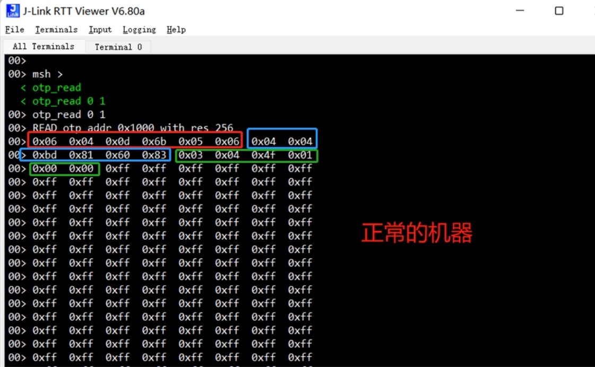<br>  
The following is an example of problematic OTP data:<br> 
As shown in the following figure: there is only data with ID=0x07, and the other ADC calibration and crystal calibration data have all been overwritten.<br> 
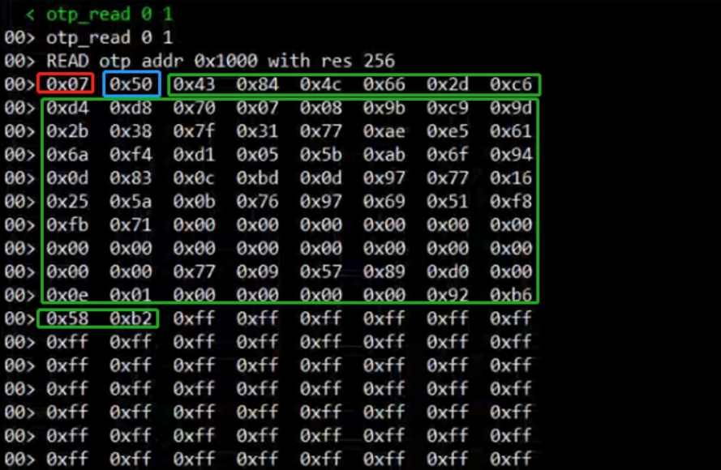<br>   
## 5.7 Method for checking whether a 52X chip has been calibrated
The PMU AON_BG register is updated with the value read from EFUSE during software initialization. If this register is not the default value 0x18, it can be considered that the chip has been calibrated. The specific method is as follows:<br> 
1. After normal startup, the code executes to BSP_System_Efuse_Config();<br> 
2. jlink.exe command `mem32 0x500ca000 20`<br> 
Check the corresponding 0x24 register value:<br> 
As shown below, the corresponding 0x500ca024 register is 0x39, not the default 0x18, proving that it has been calibrated.<br> 
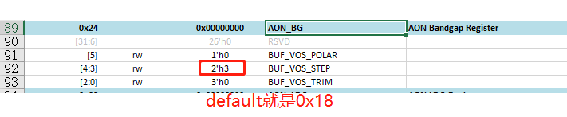<br>   
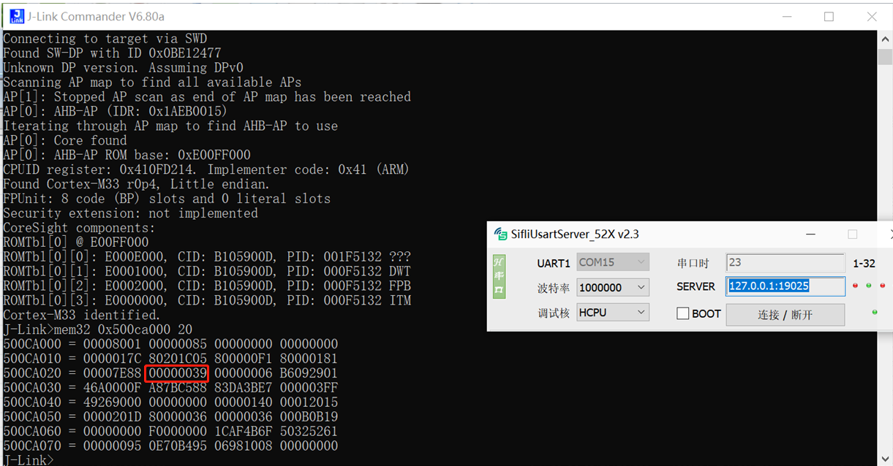<br>   
<a name="Mark_Dump内存方法"></a>
## 5.8 Memory dump method
## 5.8.1 On-site method for dumping memory through UART for 52x and 56x
Open the `sdk\tools\crash_dump_analyser\script` directory, run AssertDumpUart.exe, select the corresponding path for saving the bin, memory configuration, chip model (supports 52x and 56x), and serial port number, then click Export to start saving the memory contents as a bin file,
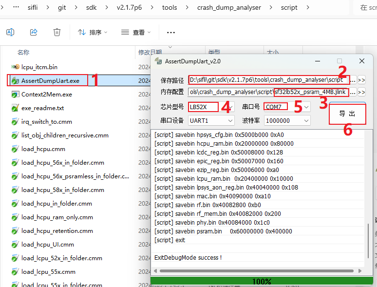<br>   
After the success prompt is displayed, place all generated *.bin and *.txt files, as well as the axf file generated by compilation, in one directory, and then use the Trace32 tool for analysis.
## 5.8.2 Method for dumping memory with jlink for 55x, 56x, and 58x;
Open the `sdk\tools\crash_dump_analyser\script` directory. As shown below, the *.bat files are the corresponding dump batch commands. You can open them with a text editor to see the specific operations executed internally.
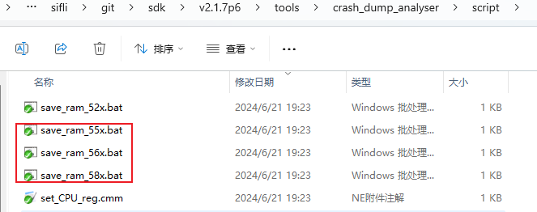<br>   
These 3 batch files all use jlink for dumping. As long as jlink can connect to the device, you can execute the corresponding *.bat file for the memory to be dumped. For example, after opening save_ram_55x.bat, its contents are as follows:
```
JLink.exe -Device CORTEX-M33 -CommanderScript sf32lb55x.jlink >log.txt
```
After connecting jlink, a series of commands in sf32lb55x.jlink (which can be opened to view and edit the commands) will be called to save registers and memory as bin files. The log of the dump process will then be saved in log.txt. If the dump fails, you can open it to view the cause of the failure.<br> 
After completion, `*.bin and *.txt files` will be generated in the directory where the *.bat is located. Place all generated `*.bin and *.txt` files, as well as the axf files of `hcpu/lcpu/bootloade`r generated by compilation, in one directory, and then use the Trace32 tool for analysis.
