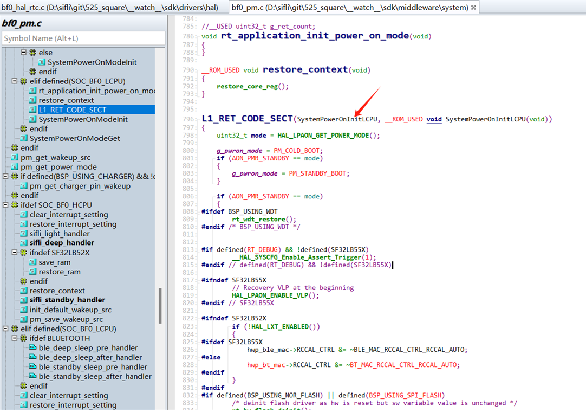
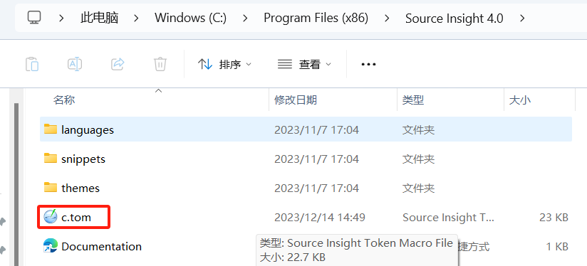
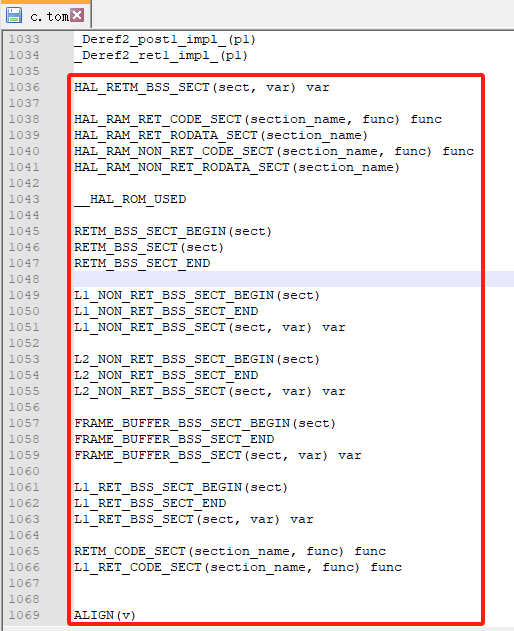
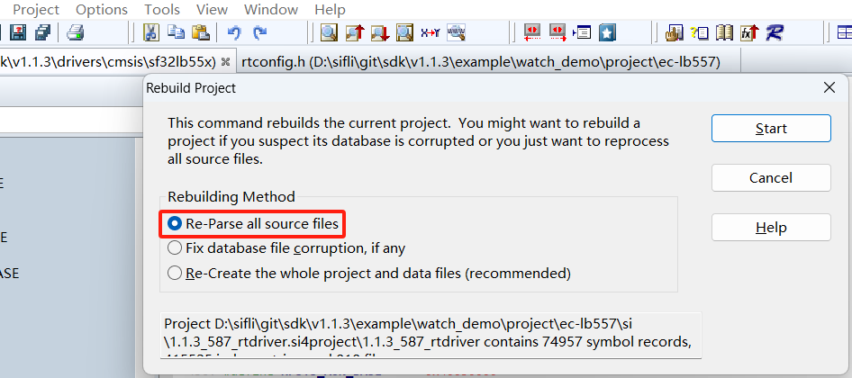

# 9 Source Insight-related

## 9.1 Issue where some symbols cannot be parsed in Source Insight
The phenomenon is shown below: functions cannot be recognized, which makes searching and viewing code inconvenient.
<br><br>  
Solution:<br>
1. Modify the file C:\Program Files (x86)\Source Insight 4.0\c.tom in the source insight installation directory.
<br><br>   
2. Add the following macro definition at the end of the file
<br><br>  
```c 
HAL_RETM_BSS_SECT(sect, var) var
HAL_RAM_RET_CODE_SECT(section_name, func) func
HAL_RAM_RET_RODATA_SECT(section_name)
HAL_RAM_NON_RET_CODE_SECT(section_name, func) func
HAL_RAM_NON_RET_RODATA_SECT(section_name)
__HAL_ROM_USED
RETM_BSS_SECT_BEGIN(sect)
RETM_BSS_SECT(sect)
RETM_BSS_SECT_END
L1_NON_RET_BSS_SECT_BEGIN(sect)
L1_NON_RET_BSS_SECT_END
L1_NON_RET_BSS_SECT(sect, var) var
L2_NON_RET_BSS_SECT_BEGIN(sect)
L2_NON_RET_BSS_SECT_END
L2_NON_RET_BSS_SECT(sect, var) var
FRAME_BUFFER_BSS_SECT_BEGIN(sect)
FRAME_BUFFER_BSS_SECT_END
FRAME_BUFFER_BSS_SECT(sect, var) var
L1_RET_BSS_SECT_BEGIN(sect)
L1_RET_BSS_SECT_END
L1_RET_BSS_SECT(sect, var) var
RETM_CODE_SECT(section_name, func) func
L1_RET_CODE_SECT(section_name, func) func
ALIGN(v)
```
3. How to make it take effect:<br>
a. Restart Source Insight,<br>
b. Menu File->Close All to close all files<br>
c. Reinterpret all files in the project <br>
<br><br>
