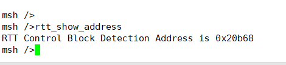
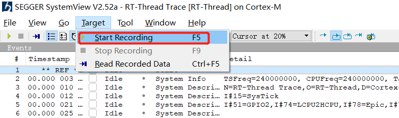
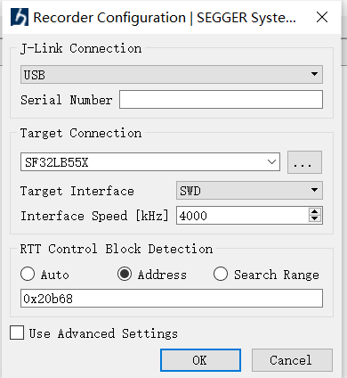
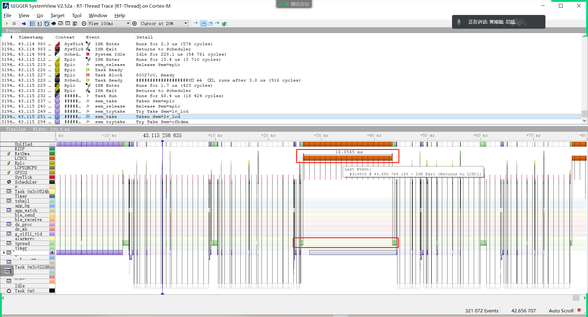
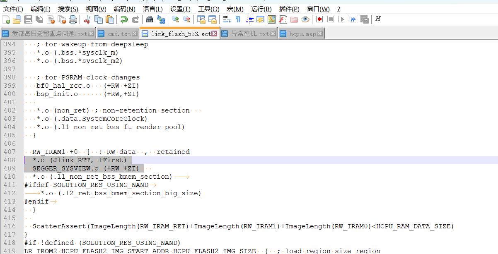

# 7 SystemView
## 7.1 What issues can SystemView be used to analyze?
SystemView is a visual analysis tool. As MCU performance becomes increasingly powerful and embedded product functions become increasingly complex, new challenges are posed for system debugging and analysis. Debugging a specific function or issue usually requires a great deal of effort. SystemView is a powerful tool that helps users perform system debugging and analysis, significantly shortening development and debugging time and improving development efficiency.<br>  RT-Thread provides the SystemView tool for system debugging and analysis.<br> 
This tool can show in detail the CPU time occupied by each thread and each interrupt. It is especially suitable for finding where CPU resources are being consumed. Here are examples of issues located with SystemView in the following two scenarios:<br> 
1. The LCD display image occasionally tore. SystemView was finally used to locate the cause: when storage data was read from or written to Flash, interrupts were disabled, causing one frame of data to be split into 2 frames for screen refresh because interrupts were disabled.<br> 
2. The TP I2C data transfer was interrupted for 16ms. SystemView located that this 16ms was caused by two data transfers occurring inside the LCD controller LCDC interrupt, resulting in the interrupt routine lasting too long.<br> 	
For details, refer to the official RT-Thread documentation:<br> 
[SystemView Analysis Tool (rt-thread.org)]( https://www.rt-thread.org/document/site/#/rt-thread-version/rt-thread-standard/application-note/debug/systemview/an0009-systemview?id=systemview-%e4%bd%bf%e7%94%a8%e6%8c%87%e5%8d%97):

## 7.2 How to Enable SystemView
1. SDK configuration: Hcpu menuconfig → Third party packages → SystemView: A Segger utility for analysis and trace the RTOS. Use the default configuration for all other options.<br> 
2. Enter the command in the Hcpu serial port console: `rtt_show_address`
It will return the address of the RTT Control Block, as shown in the following figure:
<br><br> 
3. Open the SystemView.exe software, menu -> Target -> Start Recording, 
<br><br>  
4. Select as follows and fill in the address obtained in step 2.
<br><br>  
5. After Start Recording begins recording, you can see the following window:
<br><br>  
6. To add Segger printing to the SystemView serial port, you can add the following code to the SDK code:<br> 
```
extern void SEGGER_SYSVIEW_Print(const char* s);
 SEGGER_SYSVIEW_Print("A");
```
For more usage information, refer to the RT-Thread official documentation or the documentation in the DOC directory.

## 7.3 How to Enable SystemView on 52X
Based on the prerequisite in ## 7.2, because 52X defaults to UART_DGB, the jlink converted using SifliUsartServer.exe is very slow and cannot connect to SystemView normally. Therefore, PA18 and PA19 need to be configured as jlink interface mode. Modify as follows:<br> 
1. In the BSP_PIN_Init function of the bsp_pinmux.c file, configure PA18 and P19 as the jlink interface.<br> 
```
#if 0
    // UART1
    HAL_PIN_Set(PAD_PA19, USART1_TXD, PIN_PULLUP, 1);
    HAL_PIN_Set(PAD_PA18, USART1_RXD, PIN_PULLUP, 1);
#else
    //SWD
    HAL_PIN_Set(PAD_PA18, SWDIO, PIN_PULLDOWN, 1);
    HAL_PIN_Set(PAD_PA19, SWCLK, PIN_PULLDOWN, 1);
    HAL_PIN_SetMode(PAD_PA18, 1, PIN_DIGITAL_IO_PULLDOWN);
    HAL_PIN_SetMode(PAD_PA19, 1, PIN_DIGITAL_IO_PULLDOWN);
#endif 
```
2. Change the hcpu log printing to jlink Segger printing as well.<br> 
3. You can directly search for the _SEGGER_RTT variable in the bf0_ap.map file of the compiled hcpu project,<br> 
```
_SEGGER_RTT     0x603c3258   Data    168  SEGGER_RTT.o(Jlink_RTT)
```
3. Enter the _SEGGER_RTT address queried above, 0x603c3258,<br> 
4. 52X crashes when connecting to SystemView. It was originally placed on PSRAM, and psram cache exceptions may occur during interaction with the host, causing a crash. <br> 
`*.o (Jlink_RTT, +First)
 SEGGER_SYSVIEW.o (+RW +ZI)` Put these two into sram.
 <br><br>
