# 6 Trace32
## 6.1 Trace32 Download and Configuration Method
**1. Download Trace32** <br>
You can download it directly from the official website of Lauterbach, as shown in the following figure:<br>
Select the ARM version [simarm.zip](https://repo.lauterbach.com/download_demo.html)(https://repo.lauterbach.com/download_demo.html). The free version has limitations on online debugging and Script length. The full range of SiFli MCUs currently only uses the offline debugging function;
<br>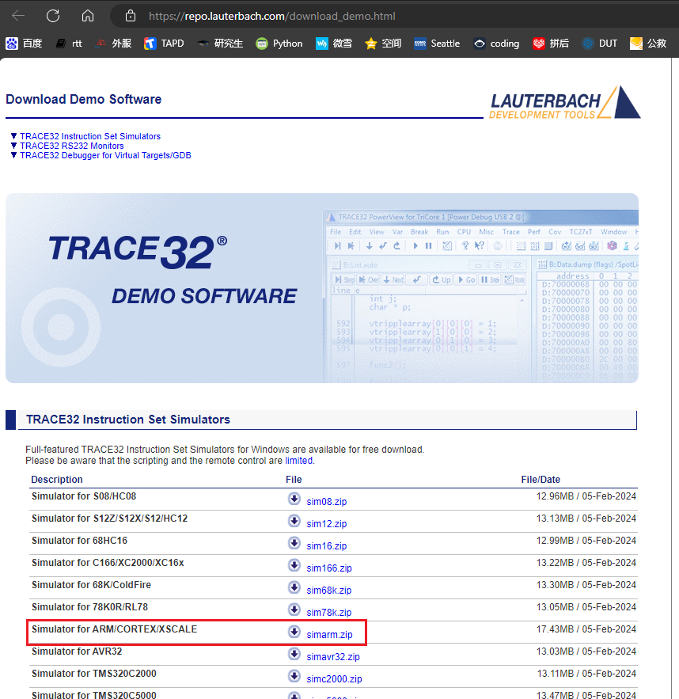<br>
Download address for Lauterbach's offline debugging tool:<br>
[Simulator for ARM/CORTEX/XSCALE
  simarm.zip](https://repo.lauterbach.com/download_demo.html)(https://repo.lauterbach.com/download_demo.html) [[Usage](#Mark_用Trace32恢复Hcpu死机现场)]<br>
**2. Configuration Method**<br>
Open the installation instructions file `SiFli-SDK\tools\crash_dump_analyser\INSTALL.md`
```
# Installation Guide

- Download simarm from the link below: https://www2.lauterbach.com/download/simarm.zip
- Extract all files in `simarm.zip` to `simarm` folder, `simarm` folder should be in `crash_dump_analyser` folder
- Replace t32.cmm and t32.men in `simarm` folder with the ones in `patch` folder
```
Extract the downloaded compressed package to the `SiFli-SDK\tools\crash_dump_analyser\` directory, then copy the contents of `patch` in this directory to the newly extracted `simarm` directory, as shown below:
<br>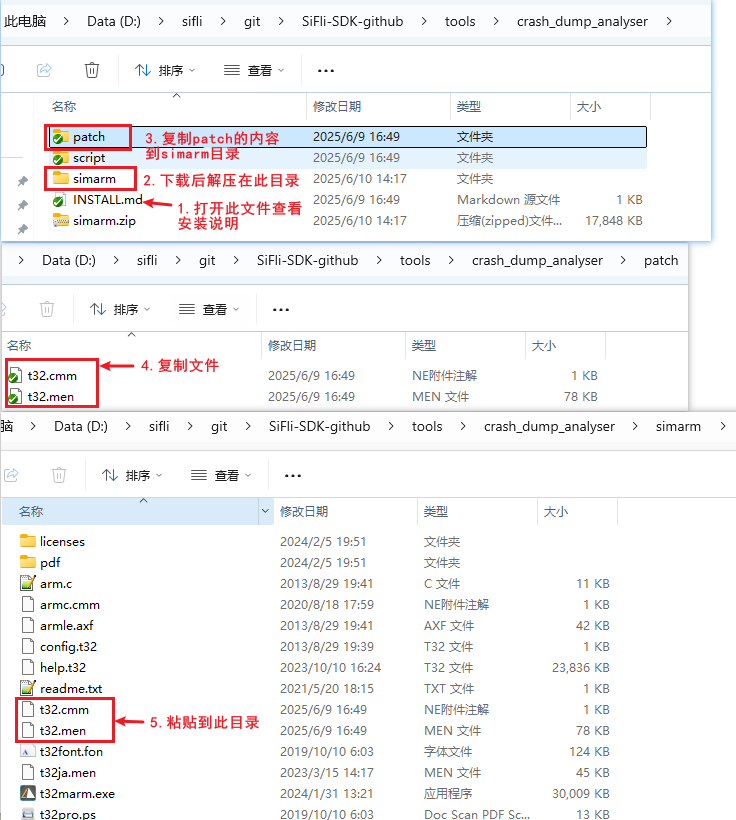<br>
**3. Trace32 Running Method** <br>
This software does not require installation. Double-click the `t32marm.exe` executable file in the `simarm` directory to open Trace32.<br>
<a name="Mark_用Trace32恢复Hcpu死机现场"></a>
## 6.2 Use Trace32 to Restore the Hcpu Crash Context
1. Refer to the section [5.8 Dump Memory Method](../tools/sifli.md#Mark_Dump内存方法) Dump Memory Method, dump the memory, and place it in the same directory as the axf file generated by compilation.<br>
2. Run \tools\crash_dump_analyser\simarm\t32marm.exe in the sdk directory.<br>
3. To view the Hcpu crash, click the HA button (HCPU assertion). If some bin files do not exist (for example, some dumps do not have PSRAM2), you can uncheck them to remove them.
<br>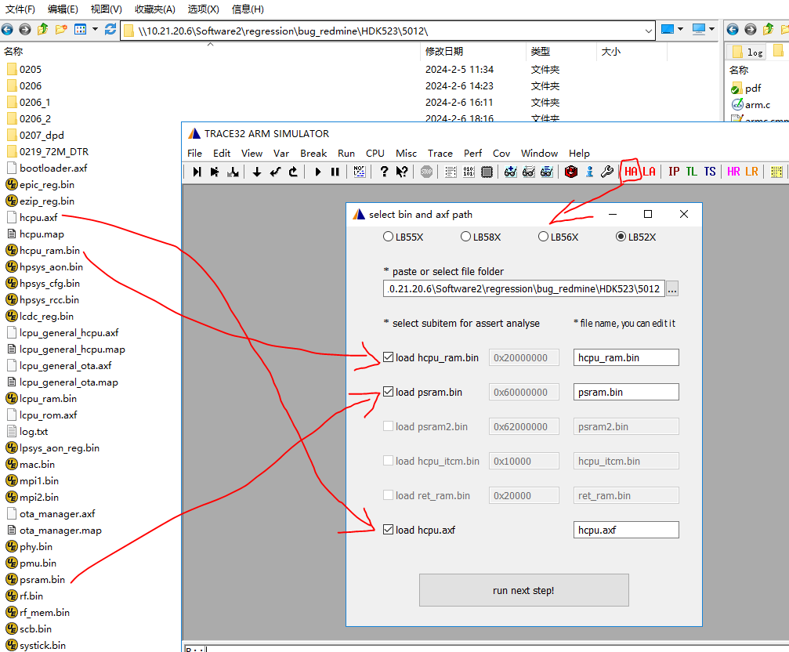<br>
Click the “run_next_step” button to load.<br>
After loading succeeds, the crash context information shown in the following figure is displayed,<br>
<br>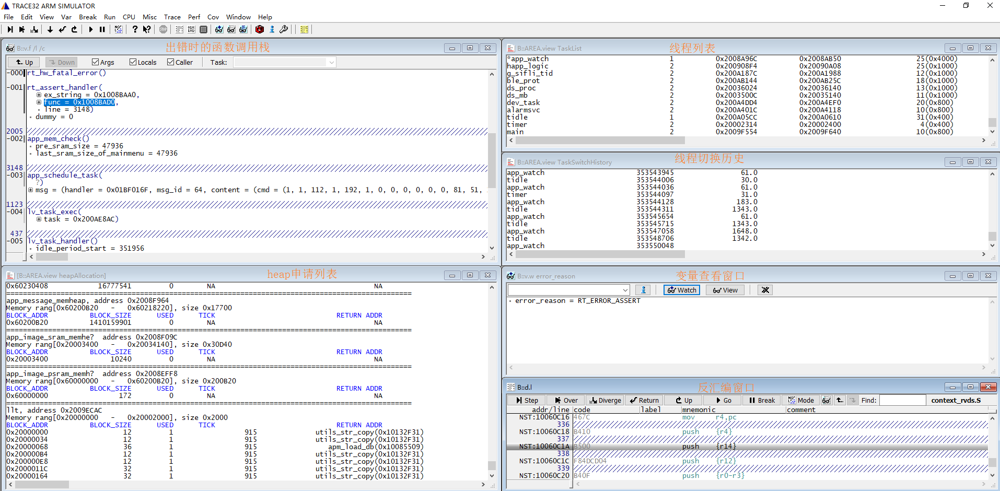<br> 
4. If all memory-related bins have been successfully saved, the relationship between the memory and the corresponding addresses will be established. You can refer to the Memory address space in each chip manual. If the crash context is not restored on site, check whether the dumped bin is normal and whether registers such as PC in log.txt were read correctly. In specific cases, such as when psram is not ready, you can modify the corresponding dump script, for example the dump content in sf32lb52x.jlink, to add or reduce the address space that needs to be dumped.
<br>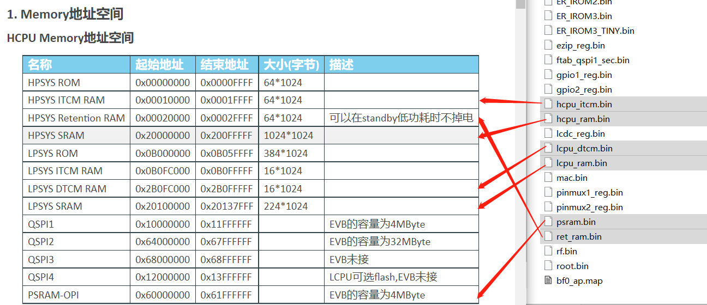<br> 
5. You can switch the displayed window from the Window menu.<br>
<br>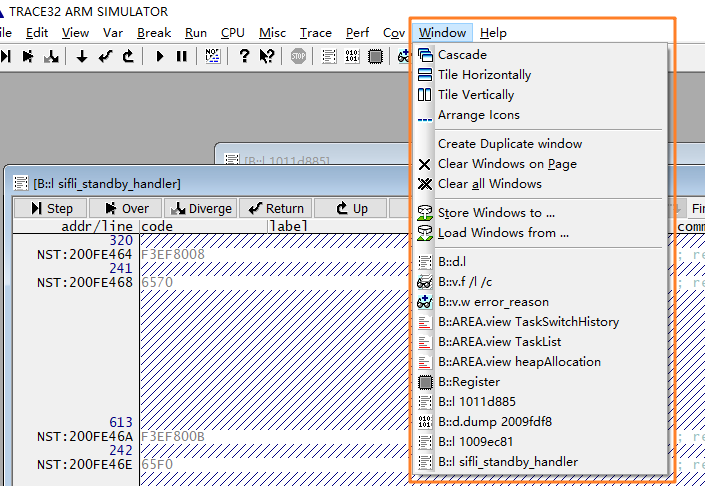<br> 
The heapAllocation window shows the allocation status of all heap pools in the system, including system heap and memheap_pool:<br>
system heap: the pool used by rt_malloc and lv_mem_alloc<br>
Each memheap_pool: a pool created using rt_memheap_init; allocation and release use rt_memheap_alloc and rt_memheap_free<br>
The meanings of the fields in the allocation information list are:<br>
```
BLOCK_ADDR: 分配的内存块的起始地址，包括了管理项
BLOCK_SIZE: 申请的内存大小，不包括管理项长度
USED：是否已分配，1表示已分配，0表示未分配
TICK: 申请时间，单位为OS tick，即1ms
RETURN ADDR: 申请者地址
```
6. Handling when the exception stack is not displayed<br>
After completing the previous steps, sometimes the crash stack may not be displayed. It may be that the dump contents were not saved or were saved abnormally. You can try the following 3 methods:
<br>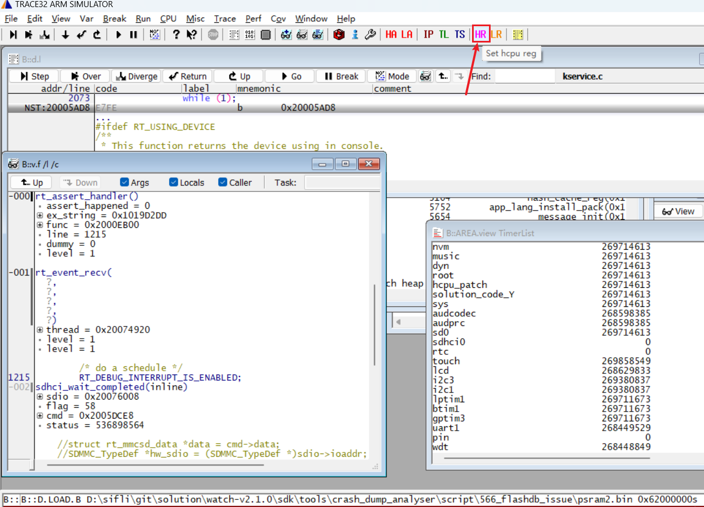<br>
1) Load the crash context stack from the Jlink halt log information. The HR (HCPU Registers) button is used to restore CPU registers when the exception handler has not been reached. After clicking the button, select the exported log.txt file of the crash context. It will backfill the 16 HCPU registers in it into trace32.
<br>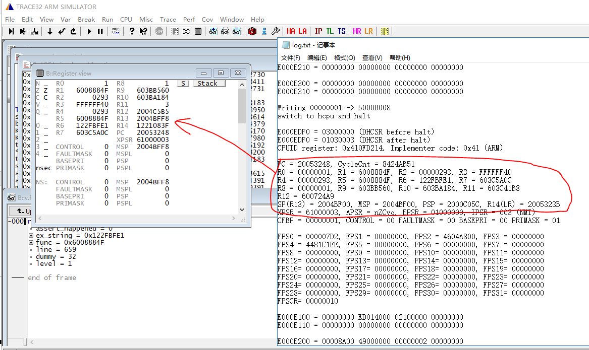<br> 
2) Backfill the 16 registers printed in the log into the register window of trace32
```
#提示：ARM内核中，寄存器对应关系如下：
SP <-> R13
LR <-> R14
PC <-> R15
```
<br>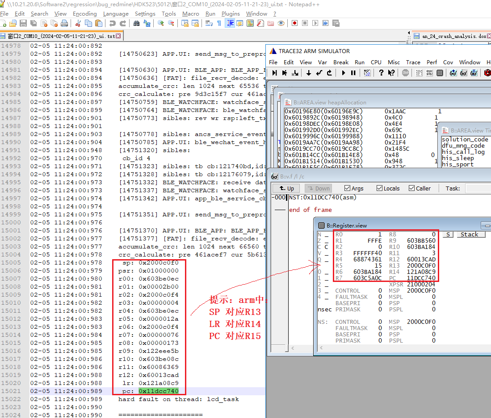<br> 
3) There is another method: manually restore directly from the hardfault context. Refer to [Trace32 Manual Crash Context Restoration Method](../debug/dump.md#33Trace32手动恢复死机现场方法) <br>
4) In the case of a crash caused by hardfaul`RT_ERROR_HW_EXCEPTION`, pay special attention to the problematic PC assembly instruction, and consider why an exception address or exception instruction appears, as shown in the following figure:
<br>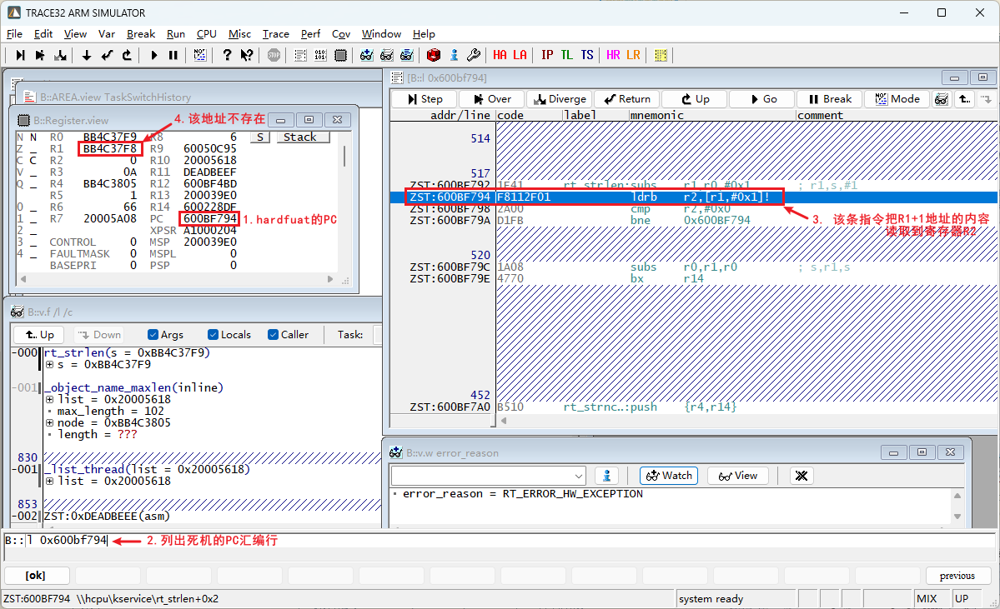<br>  
## 6.3 Use Trace32 to Restore the LCPU Crash Context
Similar to restoring the HCPU context, select the LA button and follow the prompts. Note that LCPU additionally supports synchronous loading of the rom axf, which can be selected as needed.
<br>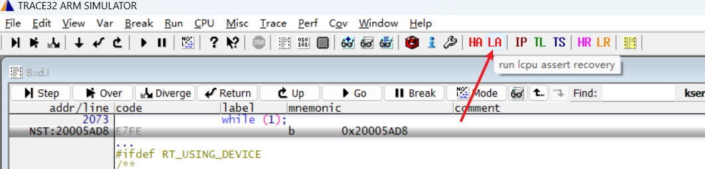<br>  

## 6.4 Common Trace32 Commands
1. Menu: View->List Soure, to open the source-code viewing window; or use the command L 10063c or l 0x10063c to view the code where the PC pointer is 0x10063c.<br>
2. Menu: VarT->View, or command: v.v * , to open the variable viewing window. You can search for variables and functions; the * wildcard is supported, as shown in the following figure:
<br>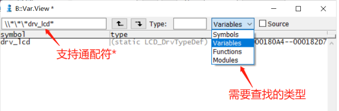<br>  
3. Menu: CPU->CPU Registers, or command: r , to open the register window and modify register values.<br>
4. Menu: View->Dump..., or command: data.dump, to open the memory address viewing window. For example, enter 0x200c0000 in the input box to view the memory at 0x200c0000, or use the command: data.dump 0x200c0000 to view the memory at 0x200c0000.<br>
5. Menu: View->StackFrame with locals, or command: frame /locals /caller , to view the call stack and local variables.<br>
6. You can execute the scripts under tools\crash_dump_analyser\script\ by command, as shown in the following figure: <br>
```
show_app_pages.cmm
show_heap.cmm
show_heap_lcpu.cmm
show_heap2.cmm
show_isr_history.cmm
show_reg.cmm
show_rt_memheap.cmm
show_running_app.cmm
show_switch_history.cmm
show_tasks.cmm
show_timer.cmm
switch_task.cmm
switch_to.cmm
``` 
Corresponding commands:<br> 
`do show_tasks` #Displays all threads, including the running state, stack address, and priority, as shown in the following figure:
<br>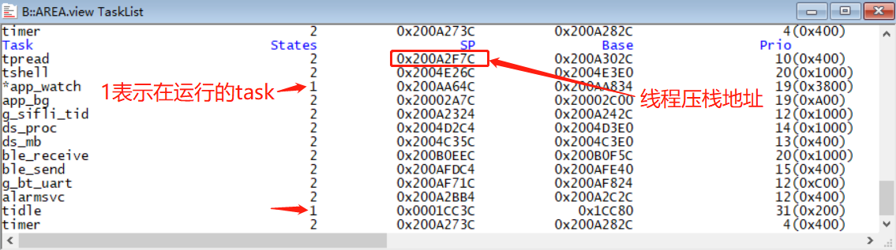<br> 
`do switch_to 0x200A2F7C` #You can switch to another thread by command. As shown below, switch to the TP thread:
<br>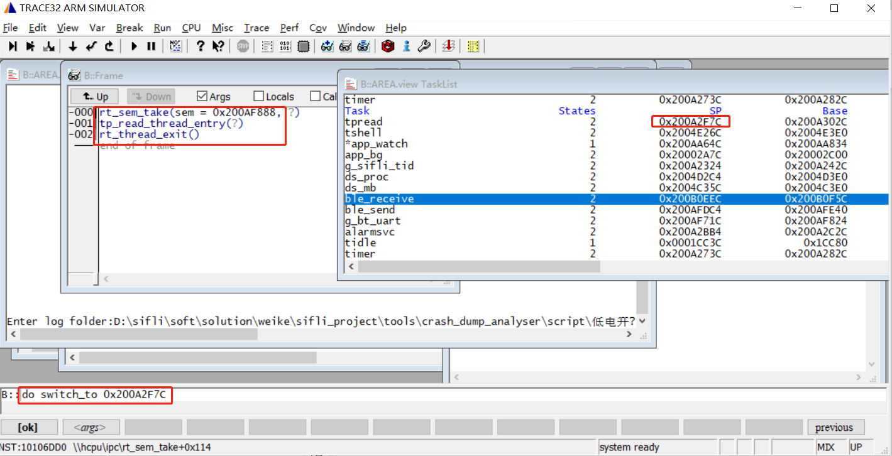<br> 
`do show_switch_history` #You can view the thread switch history.<br>
`do show_timer` #You can view timer usage.<br>

7. Method for force-casting a memory address to a struct:<br>
Struct `struct rt_pm _pm;`<br>
Conversion command: `(struct rt_pm *)0x101fa2b9 `<br>
As shown in the following figure:<br>
<br>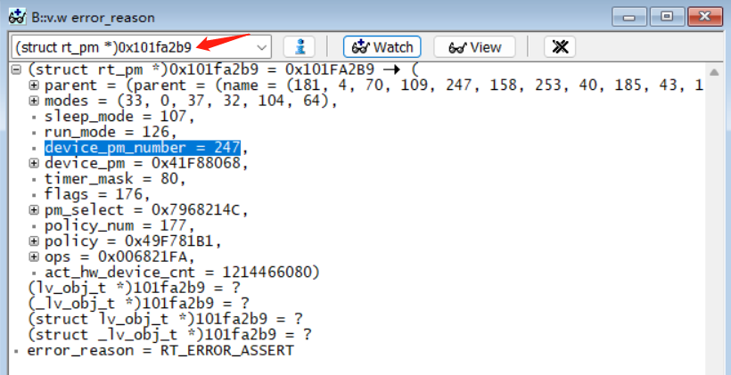<br>  
8. Method for force-casting a memory address to variables such as uint8 and uint16:<br>
`(uint16_t *)0x101fa2b9`
<br>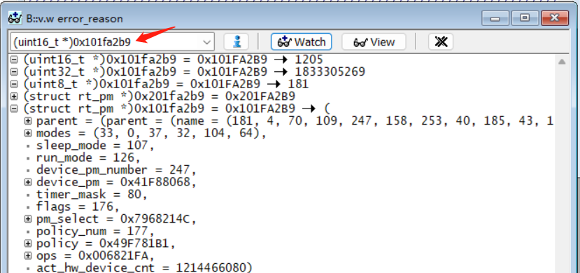<br>  

## 6.5 Trace32 Project Path Relocation
1. When trace32 restores a dumped memory file on a different computer to reproduce the context, the following situation may occur where only assembly is displayed and C code cannot be displayed:<br>
The reason is that the project path where save_ram_a0.bat was executed to dump memory is inconsistent with the project location in your trace32 reproduction path.<br>
<br>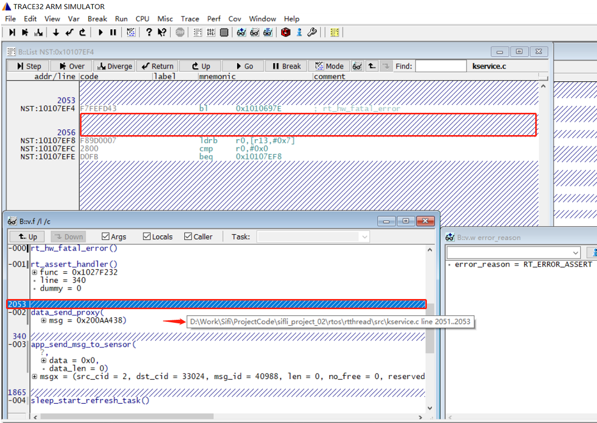<br>  
2. We can solve this issue by relocating the project path, as shown below:
<br>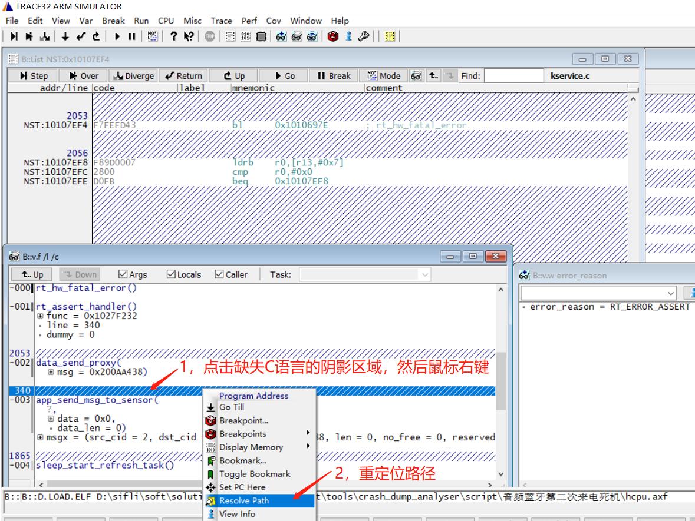<br>  
Select the project path where the corresponding c file is located. After selecting this one file, all project paths are relocated, as shown below:
<br>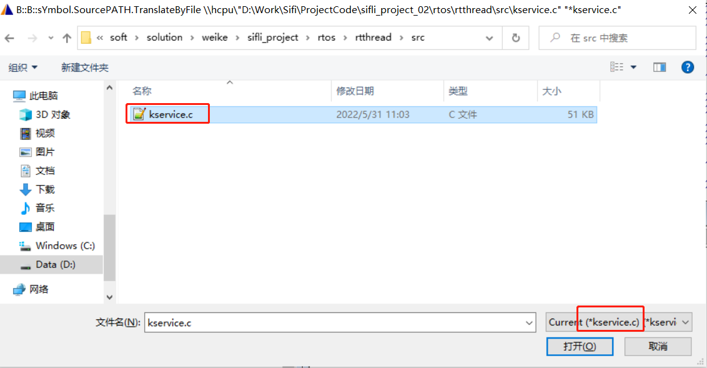<br>  
3. The relocated trace32 interface is as follows: except for code in lib, C language code can be displayed.
<br>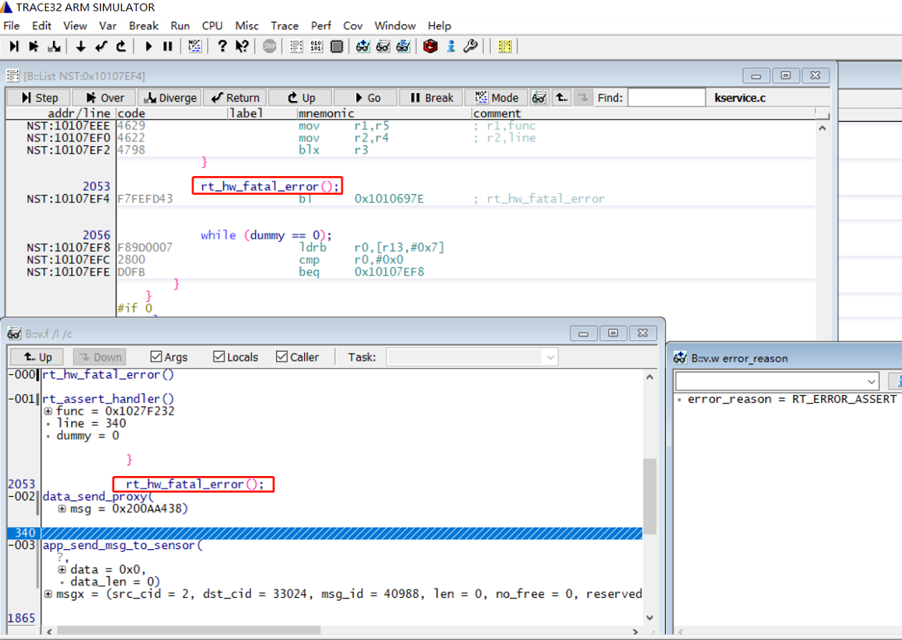<br>
