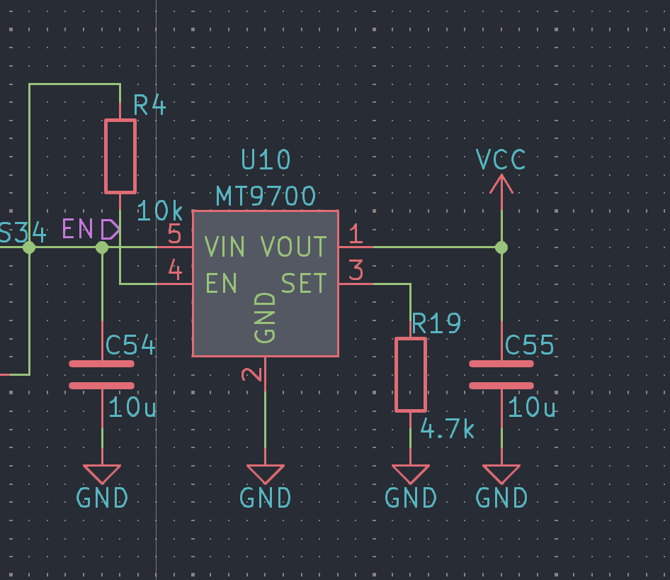
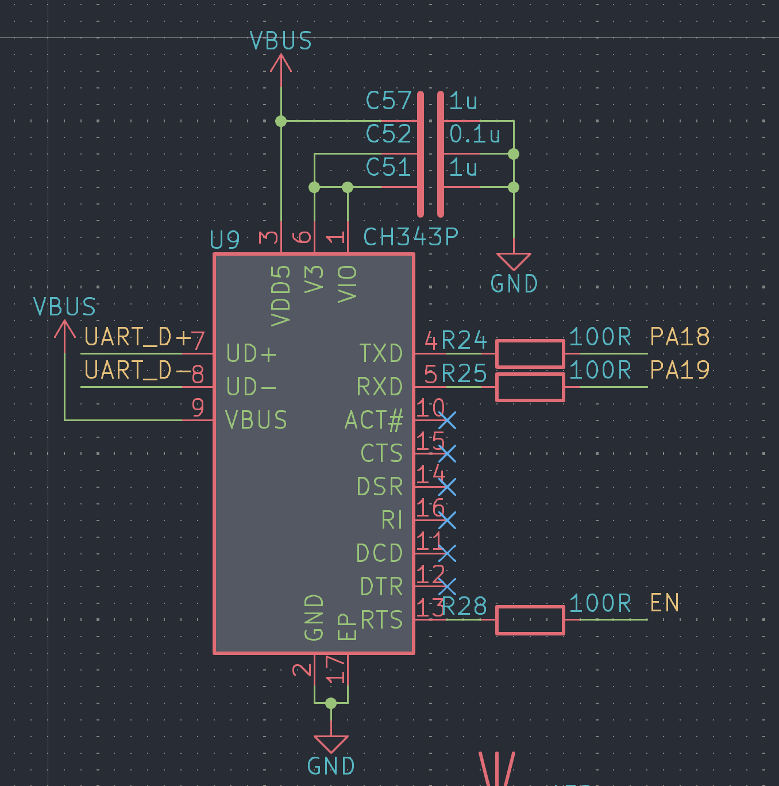
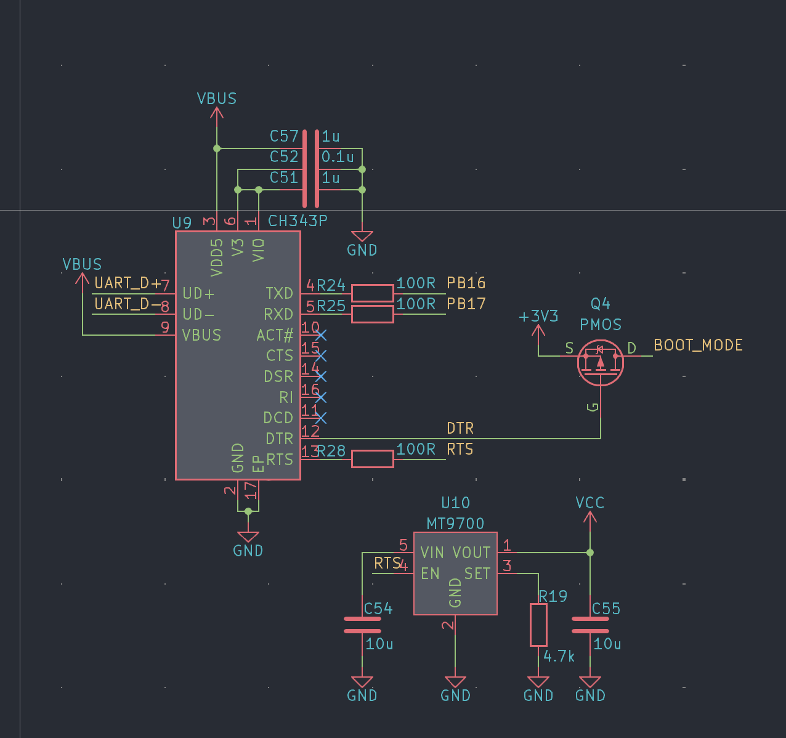
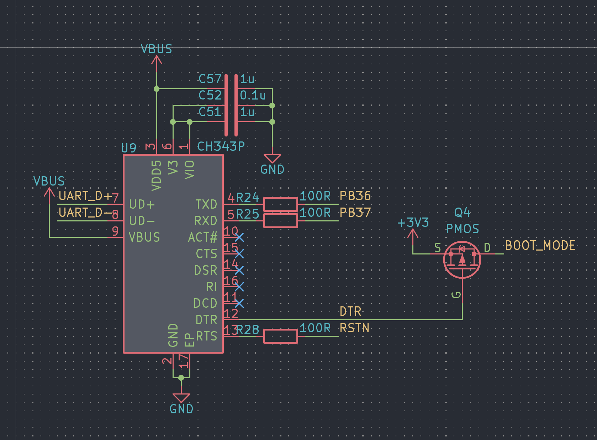

# SF32 Series UART Automatic Flashing Design

During development and debugging, firmware often needs to be flashed frequently. If a manual reset and manual entry into download mode are required every time, the process becomes very cumbersome. Therefore, the sftool tool took this issue into consideration from the beginning of its design and provides automatic flashing. It is recommended to include the related circuit design during development and debugging.

## 52 Series

The 52 Series does not provide an RST/EN pin, so resetting requires cutting off the chip power supply (VCC for the 52x Series, and PVDD for the 52X Series). Therefore, an external load switch is generally required to control the chip power supply.

When the 52 Series starts up, it remains in BootROM for about 2000 ms. During this period, UART debug can be used to enter download mode. During flashing, sftool resets the chip through `RTS`. Therefore, in the design, you only need to connect the `RTS` pin to the enable pin of the load switch.

## 56 Series

The 56 Series is similar to the 52 Series and also has UART debug for debugging. Therefore, when it is not disabled by software, UART debug can also be used to enter download mode. However, when it is disabled by software, operations can only be performed after entering `download mode`. The method for entering download mode is to keep the `BOOT_MODE` pin high during reset.

## 58 Series

The 58 Series does not have UART debug, so it must enter download mode when flashing is required. To enter download mode, keep the `BOOT_MODE` pin high during reset. In addition, the 58 Series has a `RSTN` reset pin, so a separate external load switch is not required.

