# SF32LB52-MOD-1 Module EPD Display Design Guide

The main purpose of this document is to help developers complete e-paper display solution development based on the SF32LB52-MOD-1 module. This document focuses on hardware design considerations during solution development, with the goal of reducing developers' workload as much as possible and shortening the product time to market.

## Introduction to SF32LB52-MOD-1 Module Resources

The SF32LB52-MOD-1 module has the two models shown in the table below.

Module Code| Chip | Flash Capacity | PSRAM Capacity | Ambient Temperature | Module Dimensions (mm)
:- | :-| :-|:-|:-|:-
SF32LB52-MOD-1-N16R8 | SF32LB525UC6 | 16MB QSPI-NOR | 8MB OPI-PSRAM | -40~85C | 18*27.9
SF32LB52-MOD-1-A128R16 | SF32LB527UD6 | 128MB SPI-Nand | 16MB OPI-PSRAM | -40~85C | 18*27.9

```{NOTE}
The SF32-OED-6'-EDP development board and open-source software use the `SF32LB52-MOD-1-N16R8` module.
```

## SF32LB52-MOD-1 Module Package

The SF32LB52-MOD-1 series modules use three-sided LCC castellated holes and bottom LGA pads, with an onboard PCBA Bluetooth antenna design. Dimensions: 18 x 27.9 x 3.1 mm.

### Module Pin Layout

 

<br> <br>

For detailed module pin information, refer to the module datasheet.

### Module Dimension Drawing

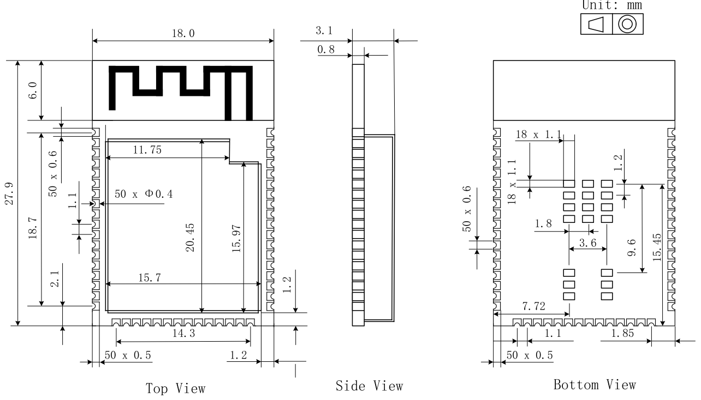 

<br> <br>

## Introduction to E-Paper Displays

In terms of driving method, common e-paper display interfaces include two types: `SPI` serial and `Source/Gate` parallel drive interfaces.
- An SPI serial-interface display integrates a TCON display control module internally. The MCU sends display data to the display through the SPI interface, and the TCON inside the display controls the e-paper display refresh.
- A parallel-interface display does not integrate a TCON display control module internally. The MCU needs to directly send specific TCON control timing to refresh the e-paper display.

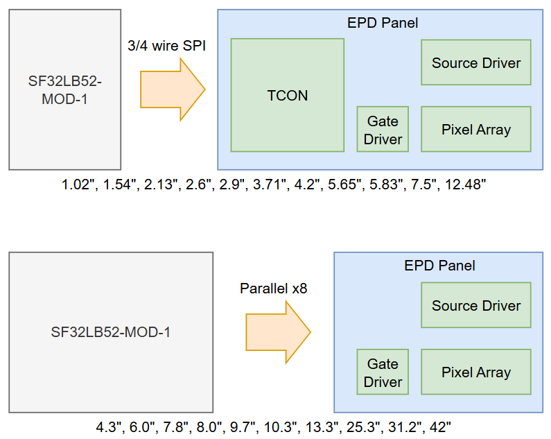 

<br> <br>
The CPU in the SF32LB52-MOD-1 module integrates an e-paper TCON control module and can directly drive a parallel e-paper display with an `x8` data bus.

## Typical E-Paper Display Solution Application Block Diagram

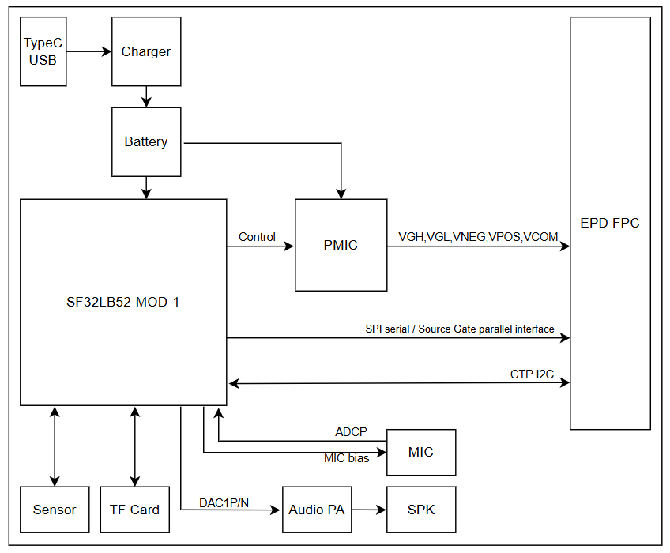 

<br> <br>

## Schematic Design Guidelines

### Display

#### SPI Serial Driver Interface

```{table}
:align: center
|Pin|	Module signal  |  Pin name    |   Function     |
|:--|:------- |:----------------|:-----------|
|1  | NC      | NC       | NO Connection                     
|2  | Boost   | GDR      | N-MOS gate control,for booster circuit output   
|3  | Boost   | RESE     | Current sense input for control loop 
|4  | NC      | NC       | NO Connection 
|5  | CAP     | VSH2     | Positive source driver voltage，Connect to CAP
|6  | NC      | NC       | NO Connection
|7  | NC      | NC       | NO Connection
|8  | VSS     | BS       | Bus selection pin，for 3-wire(H active) or 4-wire(L active) SPI interface
|9  | PA_02   | BUSY     | Busy state output
|10 | PA_00   | RES#     | Reset signal input         
|11 | PA_06   | DC#      | Data/Cammand control input             
|12 | PA_03   | CS#      | SPI chip select
|13 | PA_04   | SCL      | SPI clock input 
|14 | PB_05   | SDA      | SPI data input/output         
|15 | 3.3V    | VDDIO    | IO power supply              
|16 | 3.3V    | VCI      | Chip power supply，3.3V  
|17 | VSS     | VSS      | Ground
|18 | CAP     | VDD      | Power supply，Connect to CAP
|19 | NC      | VPP      | Power Supply for OTP Programming  
|20 | CAP     | VSH1     | Positive source driver voltage，Connect to CAP  
|21 | Boost   | VGH      | Power Supply pin for Positive Gate driving voltage and VSH 
|22 | CAP     | VSL      | Negative Source driving voltage，Connect to CAP
|23 | Boost   | VGL      | Power Supply pin for Negative Gate driving voltage, VCOM and VSL
|24 | CAP     | VCOM     | VCOM driving voltage，Connect to CAP
```

#### Parallel Source and Gate Driver Interface

```{table}
:align: center
|Pin|	Module signal  |  Pin name    |   Function     |
|:--|:------- |:----------------|:-----------|
|1  | PMIC    | VNEG     | Negative power supply source driver                     
|2  | PMIC    | VGL      | Negative power supply gate driver    
|3  | VSS     | VSS      | Ground 
|4  | NC      | NC       | NO Connection 
|5  | NC      | NC       | NO Connection
|6  | PMIC    | VDD      | Digital power supply driver
|7  | VSS     | VSS      | Ground
|8  | PA_04   | CLK      | Clock source driver
|9  | VSS     | VSS      | Ground
|10 | PA_09   | LE       | Latch enable source driver          
|11 | PA_05   | OE       | Output enable source dirver             
|12 | PA_06   | SPH      | Start pulse source driver
|13 | PA_07   | D0       | Data signal source driver 
|14 | PB_08   | D1       | Data signal source driver          
|15 | PA_37   | D2       | Data signal source driver              
|16 | PA_39   | D3       | Data signal source driver  
|17 | PA_40   | D4       | Data signal source driver  
|18 | PA_41   | D5       | Data signal source driver 
|19 | PA_42   | D6       | Data signal source driver  
|20 | PA_43   | D7       | Data signal source driver  
|21 | PMIC    | VCOM     | Common connection 
|22 | NC      | NC       | NO Connection    
|23 | NC      | NC       | NO Connection
|24 | NC      | NC       | NO Connection
|25 | NC      | NC       | NO Connection
|26 | VSS     | VSS      | Ground
|27 | PA_03   | MODE     | Output mode selection gate driver
|28 | PA_01   | CPV      | Shift clock input
|29 | PA_00   | STV      | Start pulse gate driver
|30 | NC      | NC       | NO Connection
|31 | NC      | VBORDER  | Border connection
|32 | VSS     | VSS      | Ground
|33 | PMIC    | VPOS     | Positive power supply source driver
|34 | PMIC    | VGH      | Positive power supply gate driver

```

### Power Supply

#### Serial Display Power Supply

In addition to the 3.3 V VDD power supply, an SPI serial e-paper display also requires `VGH` (approximately +20 V) and `VGL` (approximately -20 V) power supplies.

An SPI serial e-paper display can output the booster PWM signal `GDR` to generate `VGH` and `VGL`.

As shown in the figure below, `GDR` and `RESE` are used to generate `VGH` and `VGL`. For the specific component values, refer to the requirements in the display datasheet.

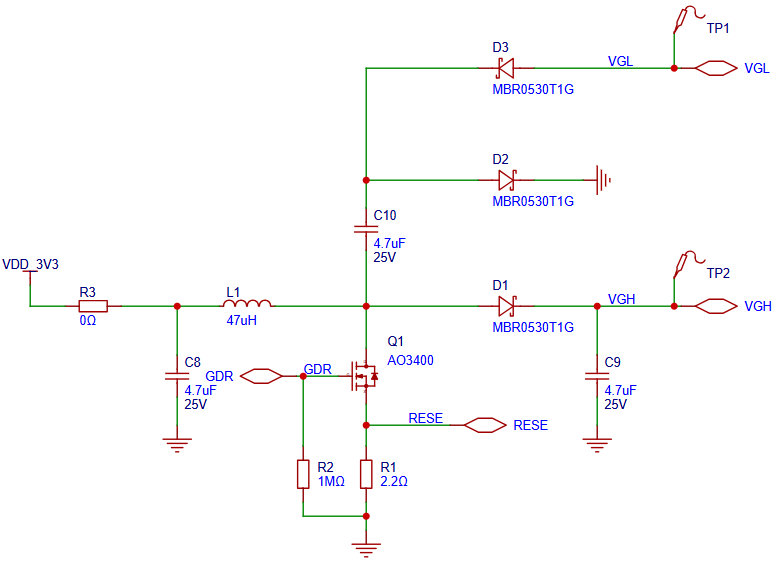 

<br> <br>

#### Parallel Display Power Supply

In addition to the 3.3 V VDD power supply, a parallel e-paper display also requires `VGH` (approximately +20 V), `VGL` (approximately -20 V), `VPOS` (approximately +15 V), `VNEG` (approximately -15 V), and `VCOM` (approximately -2.5 to -1.5 V) power supplies.

Parallel e-paper displays have specific power-on and power-off sequencing requirements for bias power supplies such as `VGH`, `VGL`, `VPOS`, `VNEG`, and `VCOM`.

Reference power-on sequence:
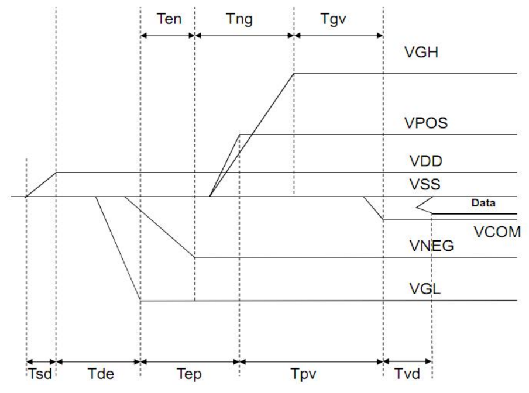 

<br> <br>

Reference power-off sequence:
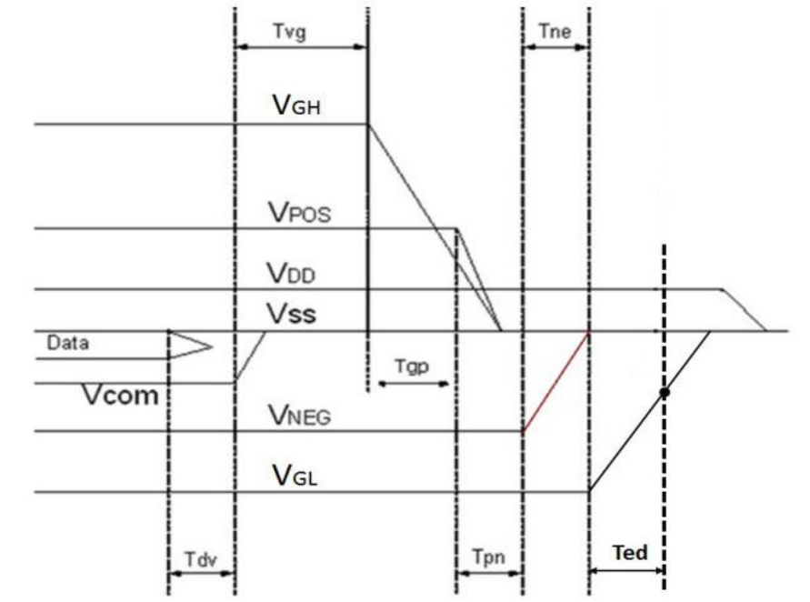 

<br> <br>

The power-on and power-off sequences for the e-paper display bias power supplies may vary among different display models. The design should follow the requirements in the datasheet of the actual display.

The e-paper display bias power supplies can be provided by a boost switching power supply. You can refer to the power supply schematic in the [Glider](https://github.com/Modos-Labs/Glider) open-source project for the design.

The e-paper display bias power supplies can also be provided by a dedicated PMIC chip. Common PMIC chips include:
- TPS6518x, VCOM accuracy ±1.5%, quiescent current 5.5 mA, shutdown current 3.5 µA
- FP9931, VCOM accuracy ±1.5%, quiescent current 1.5 mA, shutdown current 0.1 µA
- SY7636A, VCOM accuracy ±1.5%, quiescent current 1.5 mA, maximum shutdown current 3 µA

Typical TPS6518x application schematic:
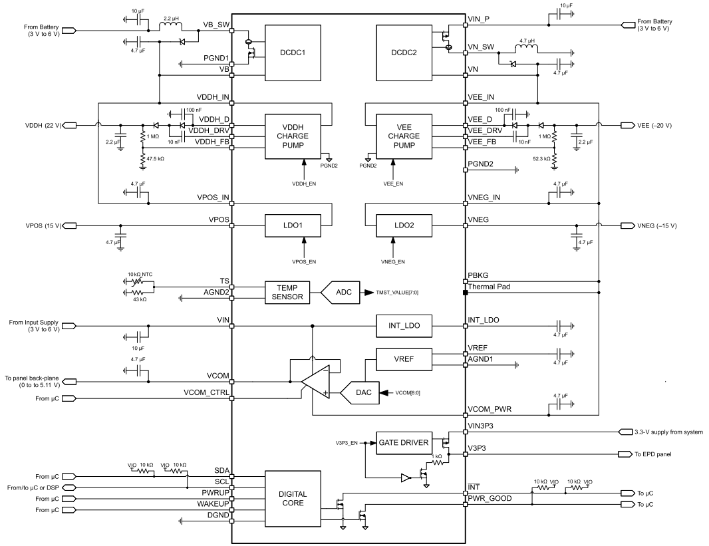 

<br> <br>
TPS6518x requires up to 7 I/Os (SDA, SCL, INT, WAKEUP, PWRUP, VCOM_CTRL, and PWR_GOOD), or at least 5 I/Os (SDA, SCL, WAKEUP, PWRUP, and VCOM_CTRL), connected to the module.

Typical FP9931 application schematic:
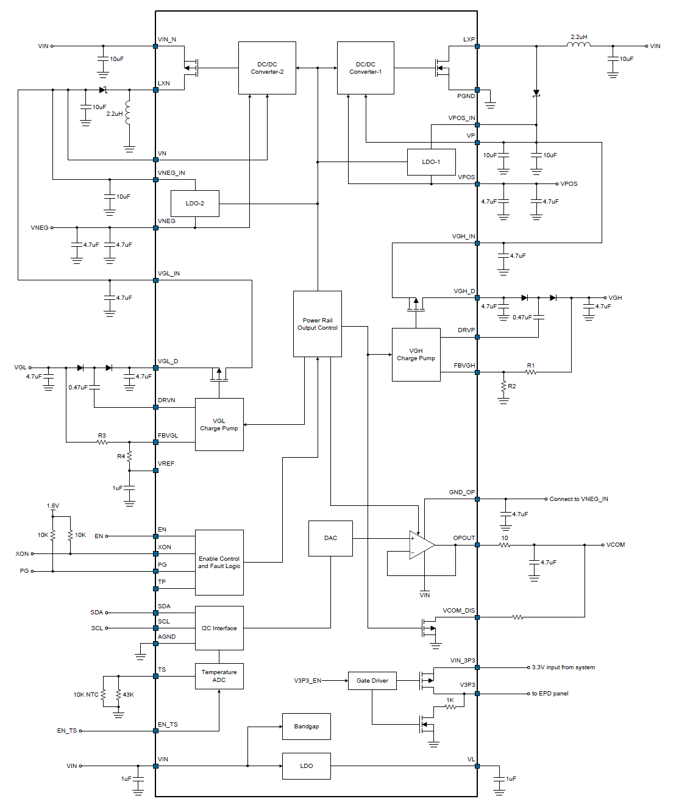 

<br> <br>
FP9931 requires at least 3 I/Os (SDA, SCL, and EN) connected to the module.

The connection method for SY7636A is similar to that for FP9931.

### RF

The module comes with a PCBA Bluetooth antenna, so no separate antenna design is required.

### TF Card

The module supports an SPI-mode TF card interface. The signal connections are shown in the table below:

```{table}
:align: center
|Pin name | TF Card pin name |  Function                   |
|:--------|:------------|:-------------------------|
| PA_24   |CMD          | SPI1_DO, SPI TF Card interface signal                   
| PA_25   |DAT0         | SPI1_DI, SPI TF interface signal 
| PA_27   |CD           | DET, SPI TF interface signal 
| PB_28   |CLK          | SPI1_CLK, SPI TF interface signal         
| PA_29   |CD/DAT3      | SPI1_CS, SPI TF interface signal             
```
<br> <br>

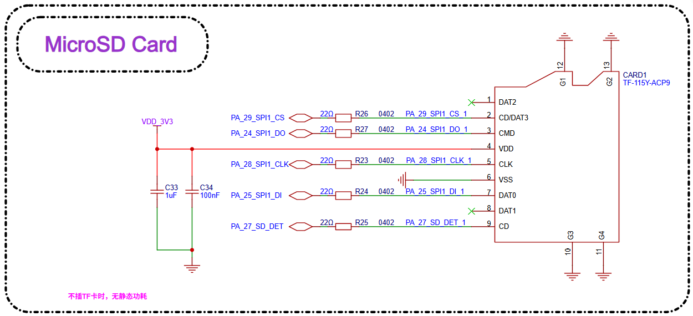 

<br> <br>

### Buttons
The module supports GPIO buttons and GPADC buttons. PA34 supports a restart function when pressed and held for about 10 s, and is recommended for use as the power button.
- When PA34 is used as a button input, it must be active high.
- When other GPIOs are used as button inputs, either active high or active low is supported.
- PA34 supports the GPADC function and can be used to implement GPADC buttons.
- For the GPADC button function, the input voltage must be greater than 2.1 V, the voltages corresponding to different button values must not overlap, and the range of each value must be greater than 100 mV.

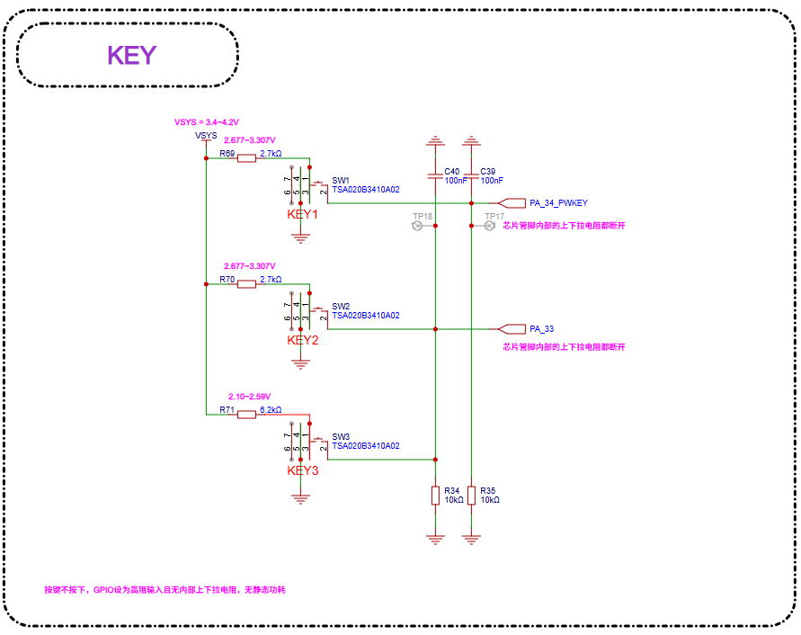 

<br> <br>

### Sensors
Sensors are connected through the I2C interface. The CPU obtains data by polling, eliminating the need for interrupt signals.

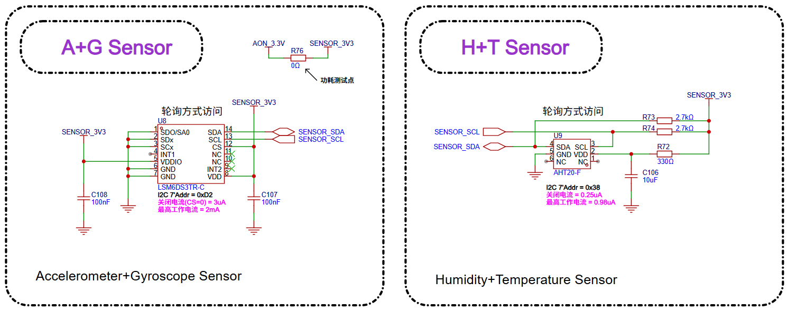 

<br> <br>

### Audio
The module supports one single-ended analog MIC input and one differential audio output.
- The analog MIC is powered by the module's MICBIAS output.
- An external power amplifier is required for audio output.

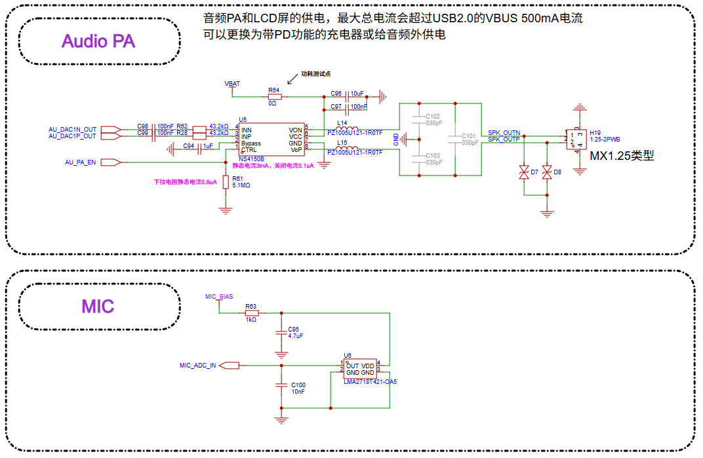 

<br> <br>

### Debugging and Flashing

The module supports the DBG_UART interface for flashing and debugging, and connects to a PC through a UART-to-USB dongle board with a 3.3 V interface.

```{table}
:align: center
|DBG signal |Pin   |Detailed description |
|:---|:---|:---|
|DBG_UART_RXD |PA18 |Debug UART receive |
|DBG_UART_TXD |PA19 |Debug UART transmit |
```

## PCB Design Guidelines

### PCB Footprint Design

The figure below shows the recommended PCB footprint dimensions, in mm.

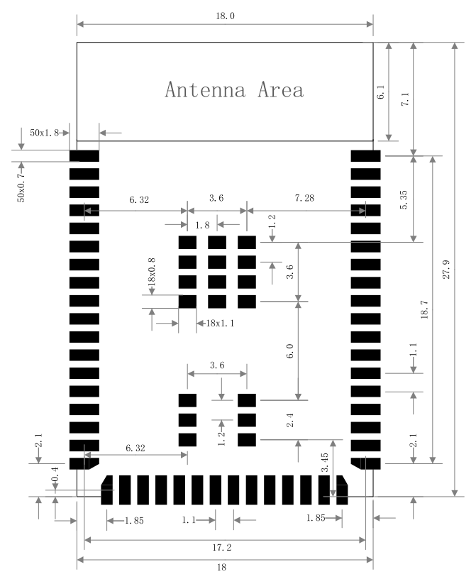 

<br> <br>

### PCB Stackup Design

The module can support a 2-layer through-hole board design:
 - Layer 1 (top layer) is mainly used for component placement and routing.
 - Layer 2 (bottom layer): do not place components. Keep routing to a minimum, ensure that there is a continuous ground plane under the audio section, and keep the ground return paths for other signal traces as short as possible.

### Module Placement in PCB Design

If the product uses the module for an on-board design, the position of the module PCB antenna must be properly reserved. Ensure that there are no other components or metal areas over the antenna area to avoid affecting antenna radiation efficiency. Carefully consider the module layout on the base board to minimize the impact on the performance of the module PCB antenna as much as possible.

It is recommended to extend the module antenna area beyond the board edge, with the feed point placed close to the edge of the base board.

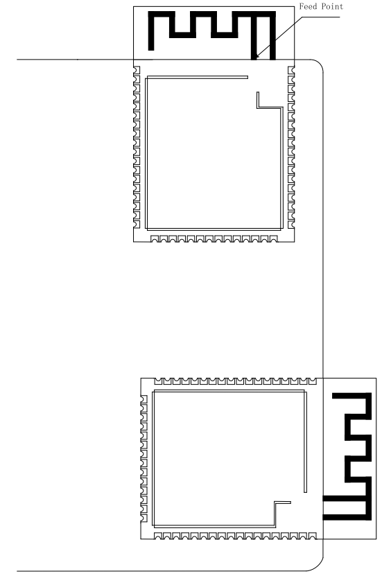 

<br> <br>

If the antenna cannot extend beyond the board edge, ensure that the PCB antenna has a sufficiently large keep-out area (copper pours, traces, and components are strictly prohibited). This keep-out area is recommended to be at least 15 mm. The base board area under the PCB antenna should be cut out to minimize the impact of the base board material on the PCB antenna. The feed point should still be placed as close to the board edge as possible. As shown in the figure below, the feed point is on the right side of the module, and the recommended keep-out area is indicated.

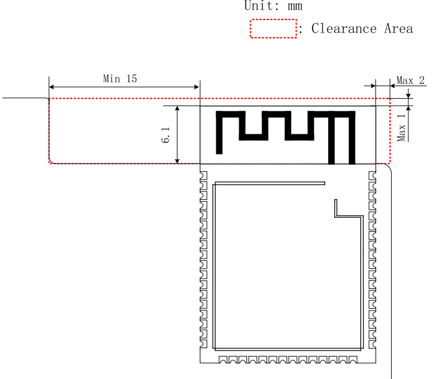 

<br> <br>

When designing the complete device, be sure to consider the impact of the enclosure on the antenna and perform RF verification.

Note that tests such as communication range testing still need to be performed on the final complete product to ensure the RF performance of the product.

### Display Interface Routing

For the EPD display interface, when signals are routed in parallel, try to follow the 3W rule to avoid crosstalk between signal lines. When routing on a 2-layer board, if the ground plane of the signal reference layer is split and incomplete, insert GND between signal lines wherever possible to keep the ground return path as short as possible.

### Audio Interface Routing

Place the circuit components for the analog MIC as close as possible to the module pins, keep the trace lengths as short as possible, provide three-dimensional ground shielding, and keep them away from other strong interference signals.

For the analog signal output DACP/DACN pins, place the corresponding circuit components as close as possible to the chip pins. Each P/N pair must be routed as differential traces, with trace lengths kept as short as possible. Three-dimensional ground shielding is required, and the traces should be kept away from other strong interference signals.

## References

[DS5203-SF32LB52-MOD-1 Technical Datasheet](index)

[SF32-OED-6'-EPD Open-Source Hardware Resources](https://oshwhub.com/sifli/sf32-oed-6-epd-v110)

[SiFli EPD_Reader Open-Source Software](https://github.com/OpenSiFli/EPD_Reader)
