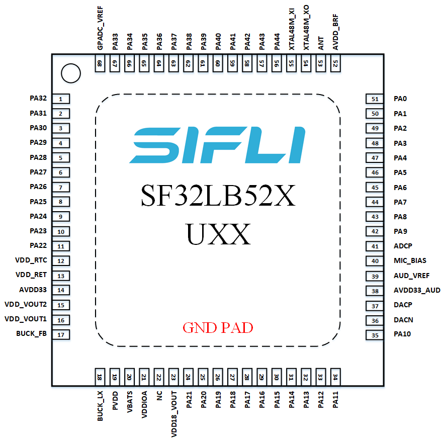
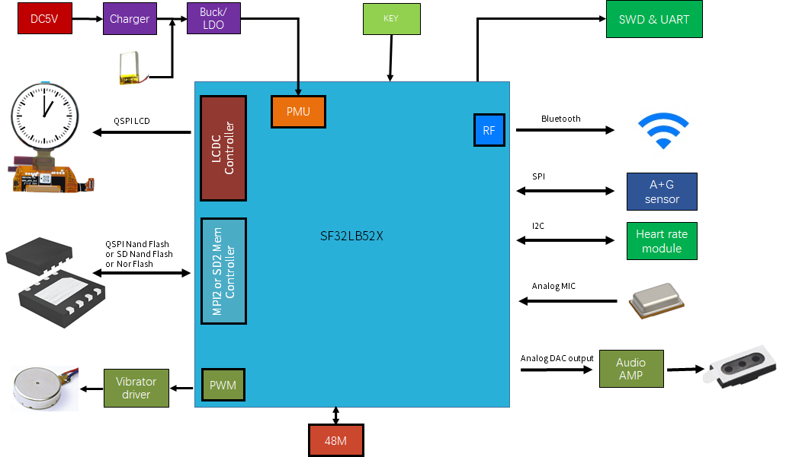
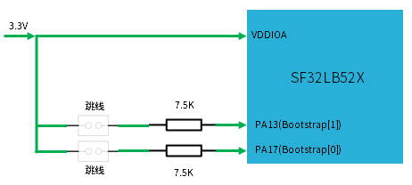
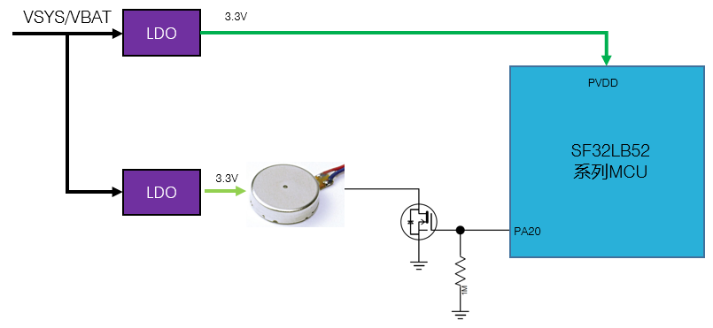
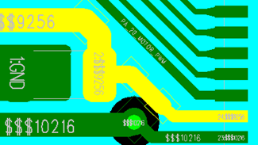

# SF32LB52X Hardware Design Guide

:::{attention}
This document applies to chips with suffix letters `B, E, G, J`, which use a 3.3 V power supply; chips with suffix letter `D` use a 1.8 V power supply.

Chips with suffix numbers `0, 3, 5, 7` belong to the SF32LB52x series, are powered by a lithium battery, and support USB charging. Refer to the [Hardware Design Guide](/hardware/SF32LB520-3-5-7-HW-Application).
:::

## Basic Introduction

The main purpose of this document is to help developers develop watch solutions based on the SF32LB52X series chips. This document focuses on hardware design considerations during solution development, with the goal of minimizing developer workload and shortening the product time to market.

SF32LB52X is a series of highly integrated, high-performance MCU chips for ultra-low-power artificial intelligence Internet of Things (AIoT) scenarios. The chip uses a big-core/little-core architecture based on the Arm Cortex-M33 STAR-MC1 processor and integrates a high-performance 2D/2.5D graphics engine, an artificial intelligence neural network accelerator, dual-mode Bluetooth 5.3, and an audio CODEC. It can be widely used in wrist-worn wearable electronic devices, smart mobile terminals, smart homes, and various other application scenarios.

:::{attention}
SF32LB52X is the **standard power-supply version of the SF32LB52 series, with a supply voltage of 2.97~3.63V (except 52D; 52D is 1.71~1.98V), and does not support charging**. It specifically includes the following models:\
SF32LB52BU36, co-packaged 1MB QSPI-NOR Flash \
SF32LB52DUB6, co-packaged with 4MB OPI-PSRAM \
SF32LB52EUB6, co-packaged 4MB OPI-PSRAM \
SF32LB52GUC6, co-packaged 8MB OPI-PSRAM \
SF32LB52JUD6, co-packaged 16MB OPI-PSRAM
:::

The processor peripheral resources are as follows:

- 45x GPIO
- 3x UART
- 4x I2C
- 2x GPTIM
- 2x SPI
- 1x I2S audio interface
- 1x SDIO storage interface
- 1x PDM audio interface
- 1x differential analog audio output
- 1x single-ended analog audio input
- Supports single-/dual-/quad-data-line SPI display interfaces and serial JDI-mode display interfaces
- Supports both displays with GRAM and displays without GRAM
- Supports UART firmware download and software debugging


## Package


<div align="center"> Table 2-1 Package Information Table </div>

```{table}
:align: center
|Package Name|Dimensions|Pin Pitch|
|:--|:-|:-|
|QFN68L | 7x7x0.85 mm | 0.35 mm |
```


  

<div align="center"> Figure 2-1 QFN68L Pin Distribution </div>  <br> <br> <br>


## Typical Application Solution

The following figure shows a typical SF32LB52X sports watch block diagram. The main functions include display, storage, sensors, vibration motor, and audio input and output.

<!-- This image has an issue and needs to be replaced with the B3 block diagram. -->
  

<div align="center"> Figure 3-1 Sports Watch Block Diagram </div>  <br> <br> <br>


:::{Note} 

   - Big/little dual-CPU architecture, meeting both high-performance and low-power design requirements
   - On-chip integrated PMU module
   - Supports TFT or AMOLED displays with a QSPI interface, with support for resolutions up to 512*512
   - Supports PWM backlight control
   - Supports external QSPI NOR/NAND Flash and SD NAND Flash memory chips
   - Supports dual-mode Bluetooth 5.3
   - Supports analog audio input
   - Supports analog audio output
   - Supports PWM vibration motor control
   - Supports accelerometer/geomagnetic/gyroscope sensors with SPI/I2C interfaces
   - Supports heart rate/blood oxygen/ECG/geomagnetic sensors with SPI/I2C interfaces
   - Supports UART debug print interface and flashing tools
   - Supports Bluetooth HCI debug interface
   - Supports one-to-many firmware flashing on the production line
   - Supports crystal calibration on the production line
   - Supports OTA online upgrade functionality
:::


## Schematic Design Guidelines

### Power Supply

#### Processor Power Supply Requirements

<div align="center"> Table 4-1 Power Supply Requirements </div>

```{table}
:align: center
|Power Supply pin| Minimum voltage (V) | Typical voltage (V) | Maximum voltage (V) | Maximum current (mA) |   Detailed description |
|:--|:--|:--|:--|:--|:----------------------------------------------------|
|PVDD       |2.97   |3.3        |3.63   |150    |PVDD system Power Supply input, connect a 10uF capacitor 
|BUCK_LX    |-      |1.25       |-      |50     |BUCK output pin, connected to a 4.7uH inductor 
|BUCK_FB    |-      |1.25       |-      |50     |BUCK feedback and internal Power Supply input pin, connect to the other end of the inductor and connect an external 4.7uF capacitor 
|VDD_VOUT1  |-      |1.1        |-      |50     |Internal LDO, connect an external 4.7uF capacitor; internal Power Supply, not used to power peripherals 
|VDD_VOUT2  |-      |0.9        |-      |20     |Internal LDO, connect an external 4.7uF capacitor; internal Power Supply, not used to power peripherals 
|VDD_RET    |-      |0.9        |-      |1      |Internal LDO, connect an external 0.47uF capacitor; internal Power Supply, not used to power peripherals 
|VDD_RTC    |-      |1.1        |-      |1      |Internal LDO, connect an external 1uF capacitor; internal Power Supply, not used to power peripherals 
|VDDIOA     |1.71   |1.8/3.3    |3.63   |-      |GPIO Power Supply input, connect an external 1uF capacitor 
|AVDD33     |2.97   |3.3        |3.63   |100    |3.3V analog Power Supply input, connect an external 4.7uF capacitor 
|AVDD33_AUD |2.97   |3.3        |3.63   |50     |3.3V audio Power Supply input, connect an external 2.2uF capacitor  
|VDD_SIP    |1.71   |1.8/3.3    |3.63   |30     |Internal LDO or external Power Supply input{SUP}`(1)`, connect an external 1uF capacitor
|AVDD_BRF   |2.97   |3.3        |3.63   |100    |Analog Power Supply input, connect an external 4.7uF capacitor 
|MIC_BIAS   |1.4    |-          |2.8    |-      |MIC Power Supply output, connect an external 1uF capacitor 
```
:::{note} 
{SUP}`(1)`
* SF32LB52BU36 requires an external 1.8 V or 3.3 V supply
* SF32LB52BU56 requires an external 3.3 V supply
* SF32LB52DUB6 requires an external 1.8 V supply
* SF32LB52E/G/JUx6 is powered directly by the internal LDO and does not require an external supply
:::
:::{important}
When the system uses Hibernate mode, the VDD_SIP power supply must be turned off; otherwise, there is a risk of leakage on the I/O of the co-packaged memory. Use the dedicated PA21 pin for the VDD_SIP power control signal.
:::

#### Processor BUCK Inductor Selection Requirements

**Key Parameters of the Power Inductor**
:::{important}
L (inductance) = 4.7 uH ± 20%, DCR (DC resistance) ≦ 0.4 ohm, Isat (saturation current) ≧ 450 mA.
:::

<!-- The A3 version needs battery and charging control content. -->

#### How to Reduce Standby Power Consumption

To meet the long battery life requirements of watch products, it is recommended to use load switches in the hardware design for dynamic power management of each functional module. For modules or paths that are always on, select appropriate devices to reduce quiescent current.

During design, pay attention to the hardware default state of the GPIO pin that controls the power switch, and add pull-up or pull-down resistors with MΩ-level resistance to ensure that the load switch is off by default.

When selecting power devices, choose LDO and Load Switch chips with low quiescent current Iq and low shutdown current Istb. In particular, pay attention to the Iq parameter for always-on power chips.


### Processor Operating Modes and Wake-up Sources

<div align="center"> Table 4-4 CPU Mode Table </div>

```{table}
:align: center
|Operating Mode|CPU |Peripherals  |SRAM |IO   |LPTIM |Wake-up Source |Wake-up Time |
|:--|:-------|:----|:----|:----|:---- |:---- |:----   |
|Active |Run |Run |Accessible |Can toggle |Run |- |- |
|Sleep |Stop |Run |Accessible |Can toggle |Run |Any interrupt |<0.5us |
|DeepSleep |Stop |Stop |Inaccessible, fully retained |Level held |Run |RTC, wake-up IO, GPIO, LPTIM, Bluetooth |250us |
|Standby |Reset |Reset |Inaccessible, fully retained |Level held |Run |RTC, wake-up IO, LPTIM, Bluetooth |1ms |
|Hibernate |Reset |Reset |Inaccessible, not retained |High-Z |Reset |RTC, wake-up IO |>2ms |
```

As shown in Table 4-5, the full series of chips supports 15 interrupt sources that can wake up the system in Standby and Hibernate modes.

<div align="center">Table 4-5 Interrupt Wake-Up Source Table </div>

```{table}
:align: center
|Interrupt Source|Pin   |Detailed Description  |
|:--|:-------|:--------|
|LWKUP_PIN0 |PA24 |Interrupt signal 0 |
|LWKUP_PIN1 |PA25 |Interrupt signal 1 |
|LWKUP_PIN2 |PA26 |Interrupt signal 2 |
|LWKUP_PIN3 |PA27 |Interrupt signal 3 |
|LWKUP_PIN10 |PA34 |Interrupt signal 10 |
|LWKUP_PIN11 |PA35 |Interrupt signal 11 |
|LWKUP_PIN12 |PA36 |Interrupt signal 12 |
|LWKUP_PIN13 |PA37 |Interrupt signal 13 |
|LWKUP_PIN14 |PA38 |Interrupt signal 14 |
|LWKUP_PIN15 |PA39 |Interrupt signal 15 |
|LWKUP_PIN16 |PA40 |Interrupt signal 16 |
|LWKUP_PIN17 |PA41 |Interrupt signal 17 |
|LWKUP_PIN18 |PA42 |Interrupt signal 18 |
|LWKUP_PIN19 |PA43 |Interrupt signal 19 |
|LWKUP_PIN20 |PA44 |Interrupt signal 20 |

```

### Clock
The chip requires two external clock sources: a 48 MHz main crystal and a 32.768 kHz RTC crystal. The detailed specification requirements and selection criteria for the crystals are as follows:

:::{important}

<div align="center"> Table 4-6 Crystal Specification Requirements </div>

```{table}
:align: center
|Crystal|Crystal specification requirements   |Detailed description  |
|:--|:-------|:--------|
|48MHz |7pF≦CL≦12pF (recommended value 8.8pF) △F/F0≦±10ppm ESR≦30 ohms (recommended value 22ohms)|Crystal oscillator power consumption is related to CL and ESR. The smaller the CL and ESR, the lower the power consumption. For optimal power performance, it is recommended to use components with relatively smaller CL and ESR values within the required range. Reserve parallel matching capacitors next to the crystal. When CL<12pF, no capacitors need to be mounted|
|32.768KHz |CL≦12.5pF (recommended value 7pF) △F/F0≦±20ppm ESR≦80k ohms (recommended value 38Kohms)|Crystal power consumption is related to CL and ESR. The smaller the CL and ESR, the lower the power consumption. For optimal power consumption performance, it is recommended to use components with relatively small CL and ESR values within the required range. Reserve parallel matching capacitors next to the crystal. When CL<12.5pF, no capacitor needs to be soldered|
```

<div align="center"> Table 4-7 Recommended Crystal List </div>

```{table}
:align: center
|Model|Manufacturer   |Parameters  |
|:---|:-------|:--------|
|E1SB48E001G00E  |Hosonic     |F0 = 48.000000MHz, △F/F0 = -6 ~ 8 ppm, CL = 8.8 pF, ESR = 22 ohms Max TOPR = -30 ~ 85℃, Package = (2016 metric)|
|ETST00327000LE  |Hosonic     |F0 = 32.768KHz, △F/F0 = -20 ~ 20 ppm, CL = 7 pF, ESR = 70K ohms Max TOPR = -40 ~ 85℃, Package = (3215 metric)|
|SX20Y048000B31T-8.8  |TKD    |F0 = 48.000000MHz, △F/F0 = -10 ~ 10 ppm, CL = 8.8 pF, ESR = 40 ohms Max TOPR = -20 ~ 75℃, Package = (2016 metric)|
|SF32K32768D71T01  |TKD       |F0 = 32.768KHz, △F/F0 = -20 ~ 20 ppm, CL = 7 pF, ESR = 70K ohms Max TOPR = -40 ~ 85℃, Package = (3215 metric)|
```
:::

For detailed material certification information, refer to:
[SIFLI-MCU-AVL Certification List](index)

### RF

The RF traces require a 50-ohm characteristic impedance. If the antenna is already matched, no additional RF components are required. It is recommended to reserve a π-type matching network in the design for spurious filtering or antenna matching.

  

<div align="center"> Figure 4-7 RF Circuit Diagram </div>   <br>  <br>  <br>


### Display

The chip supports 3-Line SPI, 4-Line SPI, Dual data SPI, Quad data SPI, and serial JDI interfaces. It supports 16.7M-color (RGB888), 262K-color (RGB666), 65K-color (RGB565), and 8-color (RGB111) color-depth modes. The maximum supported resolution is 512RGBx512.

<div align="center"> Table 4-8 LCD Driver Support List </div>

```{table}
:align: center
| Model   | Manufacturer  | Resolution  | Type   | Interface |
| :-- | :-- | :-- | :-- | :-- |
| RM69090  | Raydium    | 368*448 | Amoled | 3-Line SPI，4-Line  SPI，Dual data SPI，  Quad data SPI，MIPI-DSI |
| RM69330  | Raydium    | 454*454 | Amoled | 3-Line SPI，4-Line  SPI，Dual data SPI，  Quad data SPI，8-bits  8080-Series MCU ，MIPI-DSI |
| ILI8688E | ILITEK     | 368*448 | Amoled | Quad data SPI，MIPI-DSI                                      |
| SH8601A  | Shine World Technology   | 454*454 | Amoled | 3-Line SPI, 4-Line  SPI, Dual data SPI,  Quad data SPI, 8-bits  8080-Series MCU, MIPI-DSI |
| SPD2012  | Solomon    | 356*400 | TFT    | Quad data SPI                                                |
| GC9C01   | Galaxycore | 360*360 | TFT    | Quad data SPI                                                |
| GC9B71   | Galaxycore | 320*380 | TFT    | Quad data SPI                                                |
| ST77903  | Sitronix   | 400*400 | TFT    | Quad data SPI                                                |
| ICNA3311 | Chipone    | 454*454 | Amoled | Quad data SPI                                                |
| FT2308   | FocalTech  | 410*494 | Amoled | Quad data SPI                                                |
```


#### SPI/QSPI Display Interface

The chip supports 3/4-wire SPI and Quad-SPI interfaces for connecting LCD displays. The signals are described in the table below.

<div align="center"> Table 4-9 SPI/QSPI Signal Connection Method </div>

```{table}
:align: center
|spi signal|Pin   |Detailed description  |
|:--|:-------|:--------|
|CSx |PA03 |Enable signal |
|WRx_SCL |PA04 |Clock signal |
|DCx |PA06 |Data/command signal in 4-wire SPI mode; data 1 in Quad-SPI mode  |
|SDI_RDx |PA05 |Data input signal in 3/4-wire SPI mode; data 0 in Quad-SPI mode  |
|SDO |PA05 |Data output signal in 3/4-wire SPI mode; short it together with SDI_RDX |
|D[0] |PA07 |Data 2 in Quad-SPI mode |
|D[1] |PA08 |Data 3 in Quad-SPI mode |
|RESET |PA00 |Signal for resetting the Display screen |
|TE |PA02 |Tearing effect to MCU frame signal |
```

#### JDI Display Interface

The chip supports a parallel JDI interface for connecting LCD displays, as shown in the table below.

<div align="center"> Table 4-10 Parallel JDI Display Signal Connection Method </div>

```{table}
:align: center

| JDI Signal  | I/O  | Detailed Description   |
|:--|:-------|:--------|
| JDI_VCK  | PA39 | Shift clock for the vertical driver                  |
| JDI_VST  | PA08 | Start signal for the vertical driver                 |
| JDI_XRST | PA40 | Reset signal for the horizontal and  vertical driver |
| JDI_HCK  | PA41 | Shift  clock for the horizontal driver               |
| JDI_HST  | PA06 | Start signal for the horizontal driver               |
| JDI_ENB  | PA07 | Write enable signal for the pixel memory             |
| JDI_R1   | PA05 | Red image data (odd pixels)                          |
| JDI_R2   | PA42 | Red image data (even pixels)                         |
| JDI_G1   | PA04 | Green image data (odd pixels)                        |
| JDI_G2   | PA43 | Green image data (even pixels)                       |
| JDI_B1   | PA03 | Blue image data (odd pixels)                         |
| JDI_B2   | PA02 | Blue image data (even pixels)                        |
```

#### EPD Display Interface

The chip supports an 8-bit parallel EPD display interface, as shown in the table below.

```{table}
:align: center

| EDP Signal  | I/O  | Detailed Description   |
|:--|:-------|:--------|
| CLK          | PA04 | Clock source driver                    |
| CKV/CPV      | GPIO | Clock gate driver                      |
| SPH          | PA06 | Start pulse source driver              |
| SPV/STV      | GPIO | Start pulse gate driver                |
| LE           | GPIO | Latch enable source driver             |
| OE           | GPIO | Output enable source driver            |
| D0           | PA07 | Data signal source driver bit0         |
| D1           | PA08 | Data signal source driver bit1         |
| D2           | PA37 | Data signal source driver bit2         |
| D3           | PA39 | Data signal source driver bit3         |
| D4           | PA40 | Data signal source driver bit4         |
| D5           | PA41 | Data signal source driver bit5         |
| D6           | PA42 | Data signal source driver bit6         |
| D7           | PA43 | Data signal source driver bit7         |
| GMODE        | GPIO | Output mode selection gate driver      |
| VPOS         | TPS  | Positive power supply source driver    |
| VNEG         | TPS  | Negative power supply source driver    |
| VGH          | TPS  | Positive power supply gate driver      |
| VGL          | TPS  | Negative power supply gate driver      |
| VCOM         | TPS  | Common connection                      |
| TPS_WAKEUP   | GPIO | TPS pmic wake up                       |
| TPS_PWRUP    | GPIO | TPS pmic power up                      |
| TPS_SDA      | I2C  | TPS pmic I2C sda                       |
| TPS_SCL      | I2C  | TPS pmic I2C scl                       |
| TPS_PWRCOM   | GPIO | TPS pmic VCOM_CTRL,vcom enable         |
| TPS_GOOD     | GPIO | TPS pmic power good output             |

```
:::{note}

In the table above, in the I/O column,
- entries marked 'PA**' indicate that the I/O must be assigned this way
- entries marked GPIO indicate that the I/O can be assigned arbitrarily
- entries marked TPS refer to I/O output from the TPS PMIC chip to the display
- entries marked I2C refer to I/O that needs to be assigned the I2C function

:::


#### Touch and Backlight Interfaces

The chip supports an I2C-format touchscreen control interface and a touch status interrupt input. It also supports one PWM signal to control the enable and brightness of the backlight power supply, as shown in the table below.

<div align="center"> Table 4-11 Touch and Backlight Control Connection Method </div>

```{table}
:align: center
| Touchscreen and Backlight Signal | Pin | Detailed Description                   |
| ---------------- | ---- | -------------------------- |
| Interrupt        | PA43 | Touch status interrupt signal (wake-up capable) |
| I2C1_SCL         | PA42 | Clock signal for the touchscreen I2C        |
| I2C1_SDA         | PA41 | Data signal for the touchscreen I2C        |
| BL_PWM           | PA01 | Backlight PWM control signal            |
| Reset            | PA44 | Touch reset signal               |
```

### Storage
#### Memory Connection Interface Description
The chip supports four types of external storage media: SPI NOR Flash, SPI NAND Flash, SD NAND Flash, and eMMC.

<div align="center"> Table 4-12 SPI NOR/NAND Flash Signal Connections </div>

```{table}
:align: center
| Flash Signal | I/O Signal | Detailed Description                                    |
| ---------- | ------- | ------------------------------------------- |
| CS#        | PA12    | Chip select, active low.                    |
| SO         | PA13    | Data Input (Data Input Output 1)            |
| WP#        | PA14    | Write Protect Output (Data Input Output  2) |
| SI         | PA15    | Data Output (Data Input Output 0)           |
| SCLK       | PA16    | Serial Clock Output                         |
| Hold#      | PA17    | Data Output (Data Input Output 3)           |
```


<div align="center"> Table 4-13 SD NAND Flash and eMMC Signal Connections </div>

```{table}
:align: center
| Flash Signal | I/O Signal | Detailed Description |
| ---------- | ------- | -------- |
| SD2_CMD    | PA15    | Command signal |
| SD2_D1     | PA17    | Data 1    |
| SD2_D0     | PA16    | Data 0    |
| SD2_CLK    | PA14    | Clock signal |
| SD2_D2     | PA12    | Data 2    |
| SD2_D3     | PA13    | Data 3    |
```
:::{important}
- NOR Flash: no external pull-up resistor is required
- NAND Flash: add a pull-up resistor to PA17(Hold#)
- SD NAND Flash: add pull-up resistors to PA13(D3) and PA15(CMD)
- eMMC: add pull-up resistors to PA17(D1), PA13(D3), and PA15(CMD)
- A 7.5K pull-up resistor is recommended.
:::

#### Boot Settings

The chip supports booting from internally co-packaged SPI NOR Flash, external SPI NOR Flash, external SPI NAND Flash, external SD NAND Flash, and external eMMC. Specifically:
- SF32LB52AUx6 has internally co-packaged flash and boots from the internally co-packaged flash by default.
- SF32LB52D/F/HUx6 has internally co-packaged PSRAM and must boot from an external storage medium.


<!-- This image needs to be updated; A3 and B3 require different versions. -->

  

<div align="center"> Figure 4-8 Recommended Bootstrap Pin Circuit Diagram </div>  <br> <br> <br>

<!-- eMMC is supported only by B3 and should be removed from A3. -->
<div align="center"> Table 4-14 Boot Option Settings </div>

```{table}
:align: center
|Bootstrap[1] (PA13) |Bootstrap[0] (PA17)    |Boot From ext memory  |
| ------------ | ------------ | -------------- |
| L            | L            | SPI NOR Flash  |
| L            | H            | SPI NAND Flash |
| H            | X            | SD NAND Flash  |
| H            | H            | eMMC           |
```

#### Boot Storage Media Power Control
The chip supports power switch control for the boot storage media to reduce shutdown power consumption. The enable pin of the power switch must be controlled by PA21, and the required enable level for the switch is [high on, low off].

:::{important}
- SF32LB52AUx6 has internally co-packaged flash. Add a power switch to VDD_SIP.
- SF32LB52D/F/HUx6 has internally co-packaged PSRAM. If PVDD=3.3V and VDD_SIP is powered by the internal LDO, VDD_SIP does not require a power switch; if PVDD=1.8V, VDD_SIP requires a power switch.
- The power supply for the external storage media is independent of VDD_SIP; add a separate power switch.
<!-- eMMC is supported only by B3 and should be removed from A3. -->
- The eMMC chip has two power domains, VCC and VCCQ. Method 1: the two power supplies can be controlled together, resulting in low shutdown power consumption, but the eMMC recovers slowly from sleep and the CPU average power consumption is high. Method 2: VCC can be controlled independently while VCCQ remains continuously powered; shutdown power consumption is higher than in Method 1, but the eMMC recovers quickly from sleep and the CPU average power consumption is lower than in Method 1.
- **The enable pins of the power switches for all boot-related memories must be controlled by PA21.**
- When a NOR Flash with a capacity of 32 MB or larger is externally connected to MPI, the Flash must be controlled by PA21 so that it can be powered off, allowing the Flash to exit 4-byte mode when the MCU restarts or enters Hibernate; otherwise, the ROM will not recognize the Flash. When a NOR Flash with a capacity of 16 MB or smaller is externally connected, the Flash can remain continuously powered.
- In the reference design, pull-up resistor locations are reserved for both PA13 and PA17. Select the pull-up resistor according to the storage medium type. The recommended resistance is 7.5 kΩ.
:::

### Buttons
#### Power On/Off Button
The chip's PA34 supports a long-press reset function and can be designed as a button to implement power on/off + long-press reset. The long-press reset function of PA34 is active high, so it should be designed with a default pull-down to low; when the button is pressed, the level is high, as shown in {numref}`Figure {number} <sf32lb52X-B-PWKEY>`.

  

<div align="center">Figure 4-9 Power On/Off Button Circuit Diagram </div>   <br>  <br>  <br>


#### Mechanical Rotary Knob Button

  

<div align="center">Figure 4-10 Power On/Off Button Circuit Diagram </div>   <br>  <br>  <br>

### Vibration Motor

The chip supports PWM output to control a vibration motor.

<!-- This content needs separate handling for A3 and B3. -->
  

<div align="center"> Figure 4-11 Vibration Motor Circuit Diagram </div>  <br> <br> <br>


### Audio Interface

The chip's audio-related interfaces are shown in Table 4-15. The audio interface signals have the following characteristics:
1.	Supports one single-ended ADC input for connecting an external analog MIC. A DC-blocking capacitor with a capacitance of at least 2.2uF must be added in series, and the analog MIC power supply should be connected to the chip's MIC_BIAS power output pin;
2.	Supports one differential DAC output for connecting an external analog audio PA. The DAC output traces should be routed as differential traces with proper ground shielding. Also note: trace capacitance < 10pF, length < 2cm.

<div align="center"> Table 4-15 Audio Signal Connection Method </div>

```{table}
:align: center
|Audio signal |Pin   |Detailed description |
|:---|:---|:---|
|BIAS |MIC_BIAS |Microphone Power Supply       |
|AU_ADC1P |ADCP |Single-ended analog MIC input  |
|AU_DAC1P |DACP |Differential analog output P    |
|AU_DAC1N |DACN |Differential analog output N    |
```

The recommended circuit for an analog MEMS MIC is shown in Figure 4-12, and the recommended single-ended circuit for an analog ECM MIC is shown in Figure 4-13. MEMS_MIC_ADC_IN and ECM_MIC_ADC_IN are connected to the ADCP input pin of SF32LB52x.


  

<div align="center"> Figure 4-12 Analog MEMS MIC Single-Ended Input Circuit Diagram </div>   <br>  <br>  <br>


  

<div align="center"> Figure 4-13 Analog ECM Single-Ended Input Circuit Diagram </div>   <br>  <br>  <br>


The recommended circuit for analog audio output is shown in Figure 4-14. Note that the differential low-pass filter inside the dashed box should be placed close to the chip.


  

<div align="center"> Figure 4-14 Analog Audio PA Circuit Diagram </div>   <br>  <br>  <br>


### Sensors

The chip supports sensors such as heart rate, accelerometer, and geomagnetic sensors. For the sensor power supply, select a load switch with a relatively low Iq to control power switching.

### UART and I2C Pin Settings

The chip supports mapping UART and I2C functions to any pin. All PA interfaces can be mapped as UART or I2C function pins.

### GPTIM Pin Settings

The chip supports mapping the GPTIM function to any pin. All PA interfaces can be mapped as GPTIM function pins.

### Debug and Flashing Interface

The chip supports the DBG_UART interface for flashing and debugging, and connects to a PC through a UART-to-USB dongle board with a 3.3 V interface.

<div align="center">Table 4-16 Debug Port Connection Method </div>

```{table}
:align: center
|DBG signal |Pin   |Detailed description |
|:---|:---|:---|
|DBG_UART_RXD |PA18 |Debug UART receive |
|DBG_UART_TXD |PA19 |Debug UART transmit |
```

### Production Line Flashing and Crystal Calibration

SiFli provides an offline downloader to complete production line firmware flashing and crystal calibration. During hardware design, be sure to reserve at least the following test points: PVDD, GND, AVDD33, DB_UART_RXD, DB_UART_RXD, PA01.

For detailed flashing and crystal calibration, see the “**_Offline Downloader User Guide.pdf” document included in the development package.


### Schematic and PCB Drawing Checklist

See the “**_Schematic checklist_**.xlsx” and “**_PCB checklist_**.xlsx” documents included in the development package.


## PCB Design Guidelines

### PCB Footprint Design

The QFN68L package dimensions of the SF32LB52X series chips are: 7 mm x 7 mm x 0.85 mm; number of pins: 68; pin pitch: 0.35 mm. Detailed dimensions are shown in Figure 5-1.

  

<div align="center"> Figure 5-1 QFN68LPackage Dimension Drawing </div>   <br>  <br>  <br>


  

<div align="center"> Figure 5-2 QFN68LPackage Outline Drawing </div>   <br>  <br>  <br>


  

<div align="center"> Figure 5-3 QFN68LPackage PCB Pad Design Reference </div>   <br>  <br>  <br>


### PCB Stackup Design

The SF32LB52X series chips support single-sided and double-sided layouts. Components can be placed on one side, or capacitors and other components can be placed on the back side of the chip. The PCB supports a PTH through-hole design. A 4-layer PTH design is recommended, and the recommended reference stack-up structure is shown in Figure 5-4.

  

<div align="center"> Figure 5-4 Reference Stackup Structure Diagram </div>   <br>  <br>  <br>


### General PCB Design Rules

The general PCB design rules for a PTH board are shown in Figure 5-5.

  

<div align="center"> Figure 5-5 General Design Rules </div>   <br>  <br>  <br>


### PCB Trace Fanout

For QFN package signal fanout, all pins are fanned out through the top layer, as shown in Figure 5-6.

  

<div align="center"> Figure 5-6 Top-Layer Fanout Reference </div>   <br>  <br>  <br>


### Clock Interface Routing

The crystal must be placed inside the shielding can, with a clearance of more than 1 mm from the PCB outline. Keep it as far away as possible from components that generate significant heat, such as PA, Charge, PMU, and other circuit components. The distance should preferably be greater than 5 mm to avoid affecting the crystal frequency offset. The crystal circuit keep-out area should have a clearance greater than 0.25 mm to avoid other metals and components, as shown in Figure 5-7.

  

<div align="center"> Figure 5-7 Crystal Layout Diagram </div>   <br>  <br>  <br>


It is recommended to route the 48 MHz crystal traces on the top layer, with the length controlled within the range of 3–10 mm and the trace width 0.1 mm. Three-dimensional ground shielding is required, and the traces must be kept away from VBAT, DC/DC, and high-speed signal lines. No plane voids or copper cutouts are allowed on the top layer under the 48 MHz crystal area or on adjacent layers. Other traces are prohibited from passing through this area, as shown in Figures 5-8, 5-9, and 5-10.

  

<div align="center"> Figure 5-8 48MHz Crystal Schematic </div>   <br>  <br>  <br>


  

<div align="center"> Figure 5-9 48MHz Crystal Routing Model </div>   <br>  <br>  <br>


  

<div align="center"> Figure 5-10 48MHz Crystal Routing Reference </div>   <br>  <br>  <br>


It is recommended to route the 32.768 kHz crystal traces on the top layer, with the length controlled to ≤10 mm and a trace width of 0.1 mm. The spacing between the parallel 32K_XI/32_XO traces must be ≥0.15 mm, and three-dimensional ground shielding is required. No plane voids or copper cutouts are allowed on the top layer under the crystal area or on adjacent layers, and no other traces are allowed to pass through this area, as shown in Figures 5-11, 5-12, and 5-13.

  

<div align="center"> Figure 5-11 32.768KHz Crystal Schematic </div>   <br>  <br>  <br>


  

<div align="center"> Figure 5-12 32.768KHz Crystal Routing Model </div>   <br>  <br>  <br>


  

<div align="center"> Figure 5-13 32.768KHz Crystal Routing Reference </div>   <br>  <br>  <br>


### RF Interface Routing

The RF matching circuit should be placed as close as possible to the chip side, not near the antenna side. The filter capacitor for the AVDD_BRF RF power supply should be placed as close as possible to the chip pin, and the capacitor ground pin should be connected directly to the main ground through a via. The schematic and PCB layout of the π-type network for the RF signal are shown in Figures 5-14 and 5-15, respectively.

  

<div align="center"> Figure 5-14 π-Type Network and Power Supply Circuit Schematic </div>   <br>  <br>  <br>


  

<div align="center"> Figure 5-15 π-Type Network and Power Supply PCB Layout </div>   <br>  <br>  <br>


It is recommended to route RF traces on the top layer to avoid vias and layer transitions that may affect RF performance. The trace width should preferably be greater than 10 mil. Three-dimensional ground shielding is required, and acute-angle and right-angle routing should be avoided. RF traces should be controlled to 50 Ω impedance, with plenty of shielding ground vias placed on both sides, as shown in Figures 5-16 and 5-17.

  

<div align="center"> Figure 5-16 RF Signal Circuit Schematic </div>   <br>  <br>  <br>


  

<div align="center"> Figure 5-17 RF Signal PCB Routing Diagram </div>   <br>  <br>  <br>


### Audio Interface Routing
AVDD33_AUD is the audio power supply pin, and its filter capacitor should be placed close to the corresponding pin so that the ground pin of the filter capacitor has a solid connection to the PCB main ground. MIC_BIAS is the power output pin that supplies power to the microphone peripheral, and its corresponding filter capacitor should be placed close to the corresponding pin. Similarly, the filter capacitor for the AUD_VREF pin should also be placed close to the pin, as shown in Figures 5-18a and 5-18b.

  

<div align="center"> Figure 5-18a Audio-Related Power Supply Filter Circuit </div>   <br>  <br>  <br>


  

<div align="center"> Figure 5-18b Reference PCB Routing for the Audio-Related Power Supply Filter Circuit </div>   <br>  <br>  <br>


For the analog signal input ADCP pin, place the corresponding circuit components as close as possible to the chip pin, keep the trace length as short as possible, apply three-dimensional ground shielding, and keep it away from other strong interference signals, as shown in Figures 5-19a and 5-19b.

  

<div align="center"> Figure 5-19a Analog Audio Input Schematic </div>   <br>  <br>  <br>


  

<div align="center"> Figure 5-19b Analog Audio Input PCB Design </div>   <br>  <br>  <br>


For the analog signal output DACP/DACN pins, place the corresponding circuit components as close as possible to the chip pins. Each P/N pair must be routed as differential traces, with trace lengths kept as short as possible and parasitic capacitance less than 10 pF. Three-dimensional ground shielding is required, and the traces should be kept away from other strong interference signals, as shown in Figures 5-20a and 5-20b.

  

<div align="center"> Figure 5-20a Analog Audio Output Schematic </div>   <br>  <br>  <br>


  

<div align="center"> Figure 5-20b Analog Audio Output PCB Design </div>   <br>  <br>  <br>


### USB Interface Routing

The USB traces PA35(USB DP)/PA36(USB_DN) must first pass through the ESD device pins and then go to the chip side. Ensure that the ESD device ground pins are properly connected to the main ground. The traces must be routed as differential traces with 90-ohm differential impedance control, and three-dimensional ground shielding must be applied, as shown in Figures 5-21a and 5-21b.


  

<div align="center"> 5-21a USB Signal Schematic </div>   <br>  <br>  <br>


  

<div align="center"> 5-21b USB Signal PCB Design </div>   <br>  <br>  <br>


Figure 5-22a is a reference diagram for the component layout of USB signals, and Figure 5-22b is the PCB routing model.


  

<div align="center"> Figure 5-22a USB Signal Device Layout Reference </div>   <br>  <br>  <br>


  

<div align="center"> Figure 5-22b USB Signal Routing Model </div>   <br>  <br>  <br>


### SDIO Interface Routing
SDIO signal traces should be routed together as much as possible and should not be routed separately. The total trace length should be ≤50 mm, and the length matching within the group should be controlled to ≤6 mm. The clock signal of the SDIO interface requires three-dimensional ground shielding, and the DATA and CMD signals also require ground shielding, as shown in Figures 5-23a and 5-23b.

  

<div align="center"> Figure 5-23a SDIO Interface Circuit Diagram </div>   <br>  <br>  <br>


  

<div align="center"> Figure 5-23b SDIO PCB Routing Model </div>   <br>  <br>  <br>


### DCDC Circuit Routing
The power inductor and filter capacitors of the DC-DC circuit must be placed close to the chip pins. The BUCK_LX trace should be as short and wide as possible to ensure low loop inductance for the entire DC-DC circuit. The feedback trace for the BUCK_FB pin must not be too narrow and must be greater than 0.25 mm. The ground pins of all DC-DC output filter capacitors should be connected to the main ground plane with multiple vias. Copper pouring is prohibited on the top layer in the power inductor area, and the adjacent layer must be a complete reference ground. Avoid routing other traces through the inductor area, as shown in Figures 5-24a and 5-24b.

  

<div align="center"> Figure 5-24a DC-DC Critical Component Circuit Diagram </div>   <br>  <br>  <br>


  

<div align="center"> Figure 5-24b DC-DC Critical Component PCB Layout Diagram </div>   <br>  <br>  <br>


### Power Supply Routing

PVDD is the power input pin for the chip's built-in PMU module. The corresponding capacitor must be placed close to the pin, and the trace should be as wide as possible and must not be less than 0.4 mm, as shown in Figure 5-25.

<!-- This content needs separate handling for A3 and B3. -->
  

<div align="center"> Figure 5-25 PVDDPower Supply Routing Diagram </div>  <br> <br> <br>


The filter capacitors for pins such as AVDD33, VDDIOA, VDD_SIP, AVDD33_AUD, and AVDD_BRF should be placed close to the corresponding pins. Their trace widths must meet the input current requirements, and the traces should be as short and wide as possible to reduce power supply ripple and improve system stability.

<!-- The A3 version needs additional charging-section content. -->

### Other Interface Routing

When a pin is configured as a GPADC signal pin, three-dimensional ground shielding is required, and it must be kept away from other interfering signals, such as the battery level circuit and temperature check circuit.

### EMI&ESD
- Avoid long-distance routing on the outer layer outside the shielding can. In particular, interfering signals such as clocks and power should be routed on inner layers as much as possible and must not be routed on the outer layer.
- ESD protection devices must be placed close to the corresponding connector pins. Signal traces should first pass through the ESD protection device pins to avoid signal branches that bypass the ESD protection pins.
- The ground pins of ESD devices must be connected to the main ground through vias. Ensure that the ground pad traces are short and wide to reduce impedance and improve ESD device performance.
- 
### Other

The USB charging cable test point must be placed in front of the TVS diode, and the battery holder TVS diode must be placed in front of the platform. The routing must ensure that the trace passes through the TVS diode first and then reaches the chip end, as shown in Figure 5-27.

  

<div align="center"> Figure 5-27 Power SupplyTVS Layout Reference </div>   <br>  <br>  <br>

  

<div align="center"> Figure 5-28 TVS Routing Reference </div>   <br>  <br>  <br>

Avoid routing a long trace from the ground pin of the TVS diode before connecting it to ground whenever possible, as shown in Figure 5-28.

## Related Documents

- [SF32LB52x Chip Datasheet](https://downloads.sifli.com/silicon/DS0052-SF32LB52x-%E8%8A%AF%E7%89%87%E6%8A%80%E6%9C%AF%E8%A7%84%E6%A0%BC%E4%B9%A6%20V2p4.pdf?)
- [SF32LB52x User Manual](https://downloads.sifli.com/silicon/UM0052-SF32LB52x-%E7%94%A8%E6%88%B7%E6%89%8B%E5%86%8C%20V0p3.pdf?)
- [SF32LB52 Hardware Reference Design Package](https://downloads.sifli.com/hardware/files/documentation/SF32LB52-%E7%A1%AC%E4%BB%B6%E5%8F%82%E8%80%83%E8%AE%BE%E8%AE%A1-20250619.zip?)


## Revision History

```{table}
:align: left
:name: sf32lb52x-B-history

|Version |Date   |Release Notes |
|:---|:---|:---|
|0.0.1 |10/2024 |Initial version |

```
